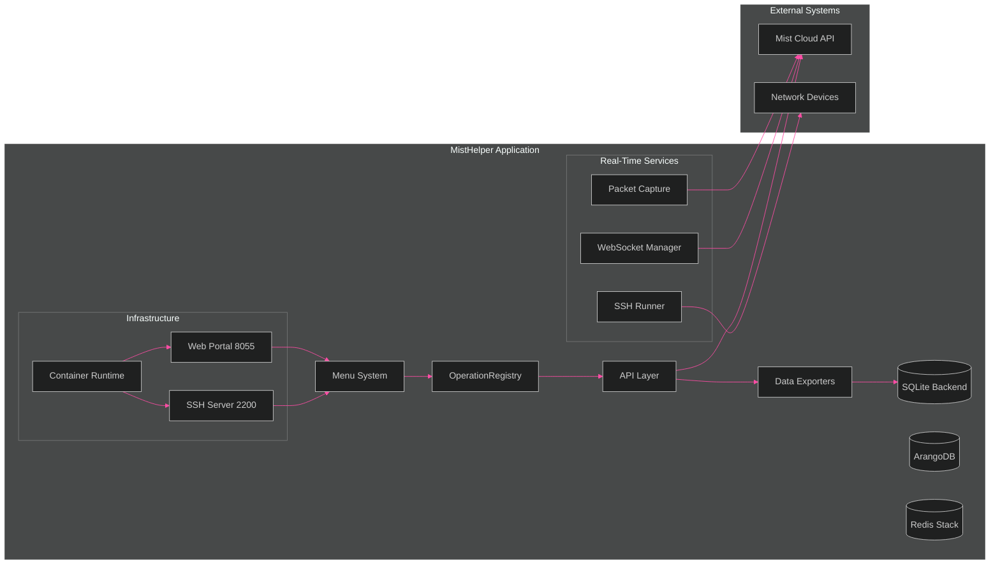
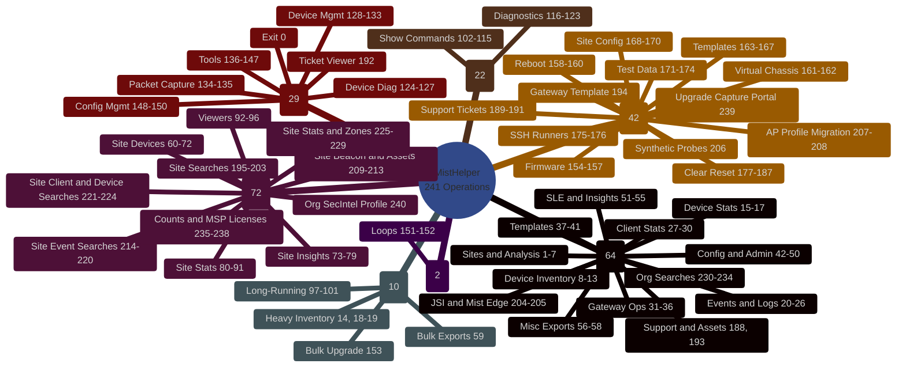

# MistHelper
Network Operations & Data Export Tool for Juniper Mist Cloud

[](https://github.com/jmorrison-juniper/MistHelper/actions/workflows/ci.yml)
[](https://github.com/jmorrison-juniper/MistHelper/actions/workflows/container-build.yml)

**Operation Count:** The code defines 240 actionable menu entries, numbered 1 to
240 with no gaps. Exit is menu 0, so the registry holds 241 entries in total.
The [Menu Reference](#menu-reference) section lists every category and range.

MistHelper is a production-focused Python application that streamlines large-scale Juniper Mist Cloud data extraction, enrichment, transformation, and limited lifecycle operations. It supports both interactive (menu) and fully automated CLI execution, with flexible output to CSV files, a local SQLite database, or a polyglot backend (ArangoDB for documents, Redis for time-series and JSON caching) using natural/composite business keys (no artificial surrogate IDs for core entities). The codebase emphasizes safety, transparency, and predictable behavior-aligned with the included internal Agents Guide and NASA/JPL style defensive programming practices.

> **[Full Documentation Wiki](https://github.com/jmorrison-juniper/MistHelper/wiki)** | [Menu Reference](https://github.com/jmorrison-juniper/MistHelper/wiki/Menu-Reference) | [Troubleshooting](https://github.com/jmorrison-juniper/MistHelper/wiki/Troubleshooting) | [Container Setup](https://github.com/jmorrison-juniper/MistHelper/wiki/Container-Setup)

## Quality Gates

Every pull request runs these 13 checks in parallel through GitHub Actions. The
workflow is `.github/workflows/ci.yml`. A caller can override each threshold
through a `workflow_call` input. The table lists the default.

| Gate | Tool | Threshold |
|------|------|-----------|
| Lint | Ruff | Zero violations |
| Format | Black | Zero files need reformatting |
| Type check | mypy | Zero errors under the `pyproject.toml` settings |
| Tests | pytest with coverage | Coverage >= 80 percent |
| Security | Bandit | Zero findings at any severity |
| Dependencies | pip-audit | Zero known vulnerabilities |
| Code quality | Pylint | Score >= 9.5 |
| Complexity | Radon | No block above cyclomatic complexity 10 |
| Dead code | Vulture | Zero findings at confidence 70 |
| Docstring style | pydocstyle | Zero violations |
| Docstring coverage | interrogate | Coverage >= 90 percent |
| Diagram references | `tools/diagram_lint` | Every diagram reference resolves |
| Browser tests | Playwright | Every end-to-end test passes |

CodeQL runs in a separate workflow, `.github/workflows/codeql.yml`. A code pull
request must wait for CodeQL before it takes the `auto-merge` label.

A gate that fails on `main` opens an issue with the `quality-gate` label. The
same gate closes that issue when it passes again.

## Deployment Options

| Method | File | Description |
|--------|------|-------------|
| Systemd | `deploy/misthelper.service` | Standalone host deployment |
| Podman Quadlet | `deploy/misthelper.container` | Containerized with auto-restart |
| Docker Compose | `compose.yml` | Container orchestration |

See `deploy/.env.example` for environment variable documentation. For full container and SSH setup, see the [Container Setup](https://github.com/jmorrison-juniper/MistHelper/wiki/Container-Setup) and [SSH Remote Access](https://github.com/jmorrison-juniper/MistHelper/wiki/SSH-Remote-Access) wiki pages.

### Corporate proxy and TLS certificates

The container image verifies every TLS certificate. It never disables the check.

Warning: Do not set `PYTHONHTTPSVERIFY=0`, and do not set a CA bundle variable to
an empty value. Without the check, an attacker on the network path can read your
Mist API token.

If you sit behind a TLS-inspecting proxy such as Zscaler, mount the proxy root
certificate. The container adds it to the system trust store at start time.

```powershell
podman run -d --name misthelper -p 2200:2200 -p 8055:8055 `
  -v "${PWD}/data:/app/data:rw" -v "${PWD}/.env:/app/.env:ro" `
  -v "${PWD}/zscaler-root-ca.crt:/usr/local/share/ca-certificates/corp-root-ca.crt:ro" `
  ghcr.io/jmorrison-juniper/misthelper:latest
```

To build behind the same proxy, add the root certificate at build time:

```powershell
podman build --build-arg INSTALL_CORPORATE_CA=true -t misthelper -f Containerfile .
```

---

## Visual Documentation

MistHelper includes a comprehensive [visual documentation suite](documentation/diagrams/README.md) with 20 Mermaid diagram types covering architecture, class hierarchy, operations, and infrastructure -- all themed with T-Mobile dark-mode colors.

<!-- INLINE DIAGRAM: Architecture Overview (flowchart) -->



> See [detailed architecture diagrams](documentation/diagrams/core/architecture-overview.md) including C4 Context view.

<!-- INLINE DIAGRAM: Menu Mindmap -->



> See [full operations reference](documentation/diagrams/operations/operations-reference.md) with lifecycle states, NOC engineer journey, and safety requirements.
>
> **[Browse all diagrams ->](documentation/diagrams/README.md)**

---

## Core Capabilities

* Multi-mode execution: interactive menu or direct CLI (`--menu <id>`)
* Multi-backend output: CSV (simple exchange), SQLite (`data/mist_data.db`), or polyglot (ArangoDB + Redis) with adaptive routing strategies
* Hybrid primary key strategy: natural keys when stable IDs exist, composite keys for time-series, and guarded fallback
* Adaptive dependency and import system (`GlobalImportManager`) with UV-to-pip fallback and optional auto-upgrade (disable in containers)
* Intelligent rate limiting & pacing (delay metrics + tuning persistence via `delay_metrics.json`, `tuning_data.json`)
* Robust flattening + sanitization pipeline for nested API JSON
* Optional fuzzy address normalization (scourgify + rapidfuzz; safe fallbacks if not installed)
* Enhanced SSH execution framework (Paramiko) with validation, shell mode, per-host logging stubs (option 97)
* Systematic safe-operation test harness (`--test` / `--testinteractive`) with **fail-closed** classification: `OperationRegistry` skips any menu option not explicitly classified `safe`/`interactive_safe` (unregistered options fail closed instead of defaulting to safe), so destructive/interactive/resource-intensive operations — including menu 194 — never auto-run. An exhaustive menu/registry coverage guardrail (`tests/guardrails/test_operation_registry_menu_coverage.py`) fails CI the instant `menu_actions` and the registry diverge.
* Safety preflights before any live systematic run: an isolated-virtual-environment guard blocks automatic dependency install/upgrade into system Python by default (override with `MISTHELPER_ALLOW_SYSTEM_PYTHON_INSTALL=true`), and a secret-safe credential/config preflight exits with a redacted, actionable message when host/token or org id are missing/placeholder. Copy `deploy/.env.example` to the repository-root `.env`, then set `MIST_APITOKEN`/`MIST_API_TOKEN` and `org_id`; systematic modes validate all of them before session or MSP API work begins.
* Container ready (Podman first, Docker compatible) with two build profiles (`Containerfile` simple, `Dockerfile` with HEALTHCHECK + UV logic)
* Defensive logging: `script.log` plus targeted debug gating

---

## Directory & Runtime Layout

| Path | Purpose |
|------|---------|
| `MistHelper.py` | Runtime entrypoint and menu registry. The decomposition moved most logic into `src/`. |
| `src/` | Extracted modules that mirror the Mist API and mistapi hierarchy |
| `tools/ste_linter/` | Simplified Technical English compliance linter and dictionary extractor |
| `data/` | SQLite DB (`mist_data.db`), generated CSV outputs, derived artifacts; polyglot backends run in containers |
| `CombinedInventory_ByWeek/` | Time-series weekly inventory snapshots |
| `data/SSH_COMMANDS.CSV` | Fallback SSH command list (legacy root path still supported) |
| `delay_metrics.json` / `tuning_data.json` | Adaptive rate / tuning persistence |
| `data/script.log` | Unified runtime log |
| `Dockerfile` / `Containerfile` | Two container strategies (UV hybrid vs simplified pip build). Both verify TLS certificates. |
| `compose.yml` | Orchestrated service definition (uses `Containerfile` by default) |
| `agents.md` | Internal "Agents Guide" (style, safety, refactor guidance) |

All export CSVs are now written inside `data/` (the code enforces a data directory even if a legacy doc claims root CSV placement).

---

## Architecture Evolution

MistHelper started as a single-file script (`MistHelper.py`). The decomposition
moved most logic into a modular `src/` package. The target structure mirrors
both the **Mist Cloud API hierarchy** (from the OpenAPI spec) and **Thomas
Munzer's mistapi library** (`tmunzer/mistapi_python`), so that the internal
organization matches the APIs that the tool consumes.

### Size Facts

Measured on 2026-08-05.

| Area | Python lines | Files |
|------|--------------|-------|
| `MistHelper.py` | 6,169 | 1 |
| `src/` | 124,675 | 363 |
| `tests/` | 129,893 | -- |

The entrypoint held roughly 28,000 lines before the decomposition. It now holds
6,169. The test suite is now larger than the source it covers.

### Current `src/` Layout

```text
src/
├── analytics/              # Site inventory health analysis and zone configuration
├── api/                    # API operation modules (orgs, sites, const)
├── audit/                  # Audit log operations
├── auth/                   # Authentication and session management
├── bootstrap/              # Dependency checks and package installation
├── cache/                  # Caching utilities
├── capture/                # Packet capture workflows and download management
├── config/                 # Configuration loading and resolution
├── data/                   # Shared data helpers
├── dataclasses/            # Structured payload definitions
├── db/                     # Database backends (ArangoDB, Redis, retention, routing)
├── device/                 # Device utility operations and AP profile migration
├── export/                 # Site data export and insights extraction
├── firmware/               # Firmware management operations
├── gateway/                # Gateway exports, stats, overrides, WAN migration
├── input/                  # Input handling utilities
├── inventory/              # Device inventory summary, MSP orchestration, CSV comparison
├── maps/                   # Maps manager operations
├── marvis/                 # Marvis AI integration
├── menu/                   # Menu system and option dispatch
├── network/                # Network configuration operations
├── org/                    # Organization operations and synthetic probes
├── org_data_collector.py   # Org-level data collection
├── output/                 # Output formatting (writer)
├── refactors/              # Extraction targets from the decomposition waves
├── reports/                # Report generation
├── site/                   # Site configuration management (test sites, RF, profiles)
├── ssh/                    # SSH runner and execution management
├── ssid_consolidation/     # SSID consolidation operations
├── time/                   # Time and lookback window utilities
├── troubleshooting/        # Marvis troubleshooting workflows
├── ui/                     # Web portal components
├── utils/                  # Shared utilities and the operation registry
├── validation/             # Input validation
├── wan_hub_group_manager.py  # WAN hub/group operations
├── wan_vpn_builder.py      # WAN VPN builder
├── websocket/              # WebSocket commands, diagnostics, service ping
├── constants.py            # Shared constants
└── __init__.py
```

### Decomposition Status

| Module | Status | Description |
|--------|--------|-------------|
| `src/db/` | **Done** | ArangoDB writer, Redis writer, retention, routing |
| `src/export/` | **Done** | Output writer (`DataExporter.write_with_format_selection`) |
| `src/constants.py` | **Done** | Shared constants |
| `src/wan_*.py` | **Done** | WAN hub group manager, VPN builder |
| `src/analytics/` | **Done (Wave 2)** | Site inventory health analyzer, site analytics configurator, zone analyzer |
| `src/capture/` | **Done (Wave 2)** | Canonical packet capture manager + download/poll helper extraction |
| `src/export/` | **Done (Wave 2)** | Site export utilities and site insights exporter |
| `src/gateway/` | **Done (Wave 2)** | Gateway exports, stats exporter, override analyzer, WAN2 migration, probe overrides |
| `src/inventory/` | **Done (Wave 2)** | Org device inventory summary, MSP orchestrator, CSV comparator |
| `src/site/` | **Done (Wave 2)** | Site config manager (test sites, RF templates, device profiles) |
| `src/ssh/` | **Done (Wave 2)** | SSH runner + SSH runner manager (orchestration retained in entrypoint) |
| `src/troubleshooting/` | **Done (Wave 2)** | Marvis troubleshooting helpers split from entrypoint |
| `src/websocket/` | **Done (Wave 2)** | WebSocket manager, commands, diagnostics, service ping manager + discovery |
| `src/api/` | In Progress | API operation modules (continuing incremental migration) |
| `src/auth/` | In Progress | Authentication/session flows |
| `src/ui/` | In Progress | Web portal extraction |

### Wave 2 Module Ownership (Phases 1-9)

All 9 phases completed with hard-gate evidence. Each phase passed: extraction, tests, quality gates, menu/API/output parity, import graph, runtime coupling, and sign-off.

| Phase | Package | Key Classes | Menu Operations |
|-------|---------|-------------|-----------------|
| 1 | `src/analytics/` | `SiteInventoryHealthAnalyzer`, `SiteAnalyticsConfigurator` | 7, 169 |
| 2 | `src/troubleshooting/`, `src/ssh/` | `MarvisTroubleshootUtils`, `SSHRunnerManager` | 124-127, 139, 175-176 |
| 3 | `src/gateway/` | `WAN2MigrationManager`, `WanProbeDeviceOverrideManager` | 149, 167 |
| 4 | `src/site/` | `SiteConfigManager` | 171-174 |
| 5 | `src/export/` | `SiteExportUtils`, `SiteInsightsExporter` | 60-96 |
| 6 | `src/inventory/` | `OrgDeviceInventorySummaryCore`, `OrgDeviceInventoryMSPOrchestrator` | 8-9, 13-14 |
| 7 | `src/gateway/` | `GatewayExportUtils`, `GatewayStatsExporter`, `GatewayOverrideAnalyzer` | 31-50, 99, 163 |
| 8 | `src/websocket/` | `ServicePingManager`, `ServicePingDiscoveryMixin` | 120-121 |
| 9 | `src/capture/` | `PacketCaptureManager`, `PacketCaptureDownloadManager` | 134-135 |

Compatibility surface preserved: `MistHelper.py` remains the runtime entrypoint with delegated ownership in `src/`. Hard-gate validations passed for all phases including menu/API/output parity, import graph cycle detection, runtime coupling isolation, and deployment pipeline.

### Guiding Principles

- **New features go in `src/`**, not `MistHelper.py`
- **MistHelper.py remains the entrypoint** but delegates to `src/` modules
- **Feature-domain packages** -- modules are organized by functional domain (analytics, capture, gateway, etc.)
- **Incremental migration** -- extract one class/feature at a time, keep tests green

---

## Installation and Setup

### Requirements

| Item | Minimum |
|------|---------|
| Python | 3.13 |
| mistapi | 0.63.1 |
| Container runtime | Podman (primary) or Docker |

`requirements.txt` and `pyproject.toml` hold the full dependency list.

### Step 1: Get the Code
```powershell
git clone https://github.com/jmorrison-juniper/MistHelper.git
cd MistHelper
```

### Step 2: Create a Virtual Environment
```powershell
python -m venv .venv
.venv\Scripts\Activate.ps1
```

**Note for a git worktree**: `git worktree add` copies the tracked files only, so a new
worktree holds no `.venv` directory. Run the bootstrap one time in the new worktree. The
script creates `.venv` and installs `requirements.txt` and `requirements-dev.txt`:

```powershell
python scripts/bootstrap_worktree.py   # Windows or Linux
.\scripts\bootstrap_worktree.ps1       # Windows entry point
```

If the environment is absent, `python -m pytest` stops with one message that names this
command. See issue #1866.

### Step 3: Install Dependencies

**Option A: Using UV (Faster, Recommended)**
```powershell
python -m pip install uv
uv pip install -r requirements.txt
```

**Option B: Using pip (Standard)**
```powershell
python -m pip install --upgrade pip
pip install -r requirements.txt
```

### Step 4: Configure Your Environment
```powershell
cp documentation\sample.env .env
```

Edit `.env` with your settings:
- **Required:** Set `MIST_APITOKEN` to your Mist API token
- **Optional but Helpful:** Set `org_id` to skip organization selection
- **Optional:** Configure SSH settings for device commands

To get your API token:
1. Login to https://manage.mist.com
2. Go to Organization > API Tokens
3. Create a new token with appropriate permissions
4. Copy the token to your `.env` file

### Step 5: Test Your Setup
```powershell
python MistHelper.py --help
python MistHelper.py --menu 1
```

---

## How to Run MistHelper

### Interactive Menu Mode (Beginner Friendly)
```powershell
python MistHelper.py
```

### Direct Command Mode (For Automation)
```powershell
# Export organization inventory
python MistHelper.py -M 11

# Export sites information
python MistHelper.py -M 12

# Run gateway synthetic tests (fast mode)
python MistHelper.py -M 16 --fast

# Export data to SQLite database
python MistHelper.py -M 11 --output-format sqlite
```

### Test Mode (Verify Everything Works)
```powershell
python MistHelper.py --test
```

### Common Useful Commands
```powershell
# Get help with all options
python MistHelper.py --help

# Run with detailed logging for troubleshooting
python MistHelper.py -M 11 --debug

# SSH into devices (requires SSH configuration in .env)
python MistHelper.py -M 97

# Fast mode for large organizations
python MistHelper.py -M 16 --fast
```

### Working with Output Files
MistHelper creates organized output in the `data/` directory:
- **CSV files:** Easy to open in Excel or import elsewhere
- **SQLite database:** Use `data/mist_data.db` for complex queries
- **Weekly inventory:** Time-series data in `CombinedInventory_ByWeek/`

---

## Command Line Interface

Primary flags (from argparse block near end of file):

| Flag | Purpose |
|------|---------|
| `-O, --org` | Organization ID |
| `-M, --menu <id>` | Execute a single menu action non-interactively |
| `-S, --site` | Human-readable site name |
| `-D, --device` | Human-readable device name |
| `-P, --port` | Port ID |
| `--output-format {csv,sqlite}` | Select output backend (default csv) |
| `--test` | Run systematic safe-operation test suite |
| `--fast` | Enable fast mode heuristics (threading & reduced retries) |
| `--skip-deps` | Skip dependency auto-install / upgrade phase |
| `--debug` | Enable debug output (includes detailed table data in logs) |
| `--delay <seconds>` | Fixed delay between loop iterations (in seconds) |
| `--address-check` | Enable external address validation using Nominatim API |
| `--skip-ssl-verify` | Skip SSL certificate verification for external API calls |
| `--no-env` | Disable .env file loading for SSH operations |
| `--dry-run` | Preview destructive operations without making changes |
| `--tui` | Launch Terminal User Interface mode for visual API navigation |
| `--login` | Use interactive login (email/password) instead of API token - enables MSP-level API access |
| `--web-portal` | Launch the web portal interface on port 8055 (or WEB_PORT env var) |
| `--capture-portal` | Launch the upgrade capture portal on port 8056 (or CAPTURE_PORT env var). Same as menu 239. |
| `--testinteractive` | Run systematic test of read-only interactive menu options |

Examples (PowerShell friendly):
```powershell
python .\MistHelper.py -M 11 --output-format sqlite
python .\MistHelper.py -M 13 --output-format sqlite --fast
python .\MistHelper.py --test --output-format sqlite --debug
```

Interactive fallback occurs if no `-M/--menu` is supplied.

---

## Menu Reference

This README stays lean. The full menu reference names each option, its
description, its safety level, and a usage example.

- Repository copy, which is authoritative: `documentation/menu_reference.md`
- Wiki mirror: <https://github.com/jmorrison-juniper/MistHelper/wiki/Menu-Reference>

### Categories and ranges

`src/utils/operation_registry.py` classifies every menu number. The classifier
fails closed, so `--test` skips any option that the registry does not name
`safe` or `interactive_safe`. Counts were measured on 2026-08-20.

| Category | Count | Menu numbers | Behavior under `--test` |
|----------|-------|--------------|-------------------------|
| `safe` | 64 | 1-13, 15-17, 20-58, 188, 193, 204-205, 230-234 | Runs |
| `interactive_safe` | 72 | 60-96, 195-203, 209-229, 235-238, 240 | Runs under `--testinteractive` |
| `destructive` | 42 | 154-187, 189-191, 194, 206-208, 239 | Never runs |
| `interactive` | 29 | 0, 124-150, 192 | Never runs |
| `websocket` | 22 | 102-123 | Never runs |
| `resource_intensive` | 10 | 14, 18-19, 59, 97-101, 153 | Never runs |
| `continuous_loop` | 2 | 151-152 | Never runs |
| **Total** | **241** | 0-240, no gaps | Menu 0 is Exit |

Warning: A destructive operation changes the Mist cloud configuration. Read
`documentation/menu_reference.md` before you run one.

### Recent additions

| Menu | Operation | Category |
|------|-----------|----------|
| 195 | Audit site addresses from a CSV file. Read-only. | `safe` |
| 196 | Export the async organization license claim status | `safe` |
| 197 | Download client packet captures grouped by VLAN | `interactive_safe` |
| 198 | Search site WAN usages (`searchSiteWanUsage`) | `interactive_safe` |
| 199 | Search site webhook deliveries (`searchSiteWebhooksDeliveries`) | `interactive_safe` |
| 200 | Search site guest authorization (`searchSiteGuestAuthorization`) | `interactive_safe` |
| 201 | Search site Mist Edge events (`searchSiteMistEdgeEvents`) | `interactive_safe` |
| 202 | Search site NAC client events (`searchSiteNacClientEvents`) | `interactive_safe` |
| 203 | Search site WAN client events (`searchSiteWanClientEvents`) | `interactive_safe` |
| 204 | Search organization JSI assets and contracts | `safe` |
| 205 | Search organization Mist Edge events. Org peer of menu 201. | `safe` |
| 206 | Manage organization Zscaler synthetic probes | `destructive` |
| 207 | Migrate access points between device profiles | `destructive` |
| 208 | Revert an access point profile migration from a backup | `destructive` |
| 209 | Get the site beacon detail (`getSiteBeacon`) | `interactive_safe` |
| 210 | Export BLE beacons matching an Asset or AssetFilter (`getSiteAssetsOfInterest`) | `interactive_safe` |
| 211 | Get the site asset filter detail (`getSiteAssetFilter`) | `interactive_safe` |
| 212 | Get the site asset detail (`getSiteAsset`) | `interactive_safe` |
| 213 | Export the site application list (`getSiteApplicationList`) | `interactive_safe` |
| 214 | Search site system events (`searchSiteSystemEvents`) | `interactive_safe` |
| 215 | Search site alarms (`searchSiteAlarms`) | `interactive_safe` |
| 216 | Search site tracked assets (`searchSiteAssets`) | `interactive_safe` |
| 217 | Search site BGP peer statistics (`searchSiteBgpStats`) | `interactive_safe` |
| 218 | Search site call quality records (`searchSiteCalls`) | `interactive_safe` |
| 219 | Search site Sky ATP security events (`searchSiteSkyatpEvents`) | `interactive_safe` |
| 220 | Search site wireless client events (`searchSiteWirelessClientEvents`) | `interactive_safe` |
| 221 | Search site WAN clients (`searchSiteWanClients`) | `interactive_safe` |
| 222 | Search site device events (`searchSiteDeviceEvents`) | `interactive_safe` |
| 223 | Search site devices (`searchSiteDevices`) | `interactive_safe` |
| 224 | Search site rogue access point events (`searchSiteRogueEvents`) | `interactive_safe` |
| 225 | Search site OSPF neighbor statistics (`searchSiteOspfStats`) | `interactive_safe` |
| 226 | Search the last site device configurations (`searchSiteDeviceLastConfigs`) | `interactive_safe` |
| 227 | Search site device configuration history (`searchSiteDeviceConfigHistory`) | `interactive_safe` |
| 228 | Search site discovered switches (`searchSiteDiscoveredSwitches`) | `interactive_safe` |
| 229 | Search site zone sessions by zone type (`searchSiteZoneSessions`) | `interactive_safe` |
| 230 | Search organization wireless client sessions (`searchOrgWirelessClientSessions`) | `safe` |
| 231 | Search organization wireless client events (`searchOrgWirelessClientEvents`) | `safe` |
| 232 | Search organization WAN clients (`searchOrgWanClients`) | `safe` |
| 233 | Search organization WAN client events (`searchOrgWanClientEvents`) | `safe` |
| 234 | Search organization system events (`searchOrgSystemEvents`) | `safe` |
| 235 | Run any org-scoped Mist count endpoint (35 operations) | `interactive_safe` |
| 236 | Run any site-scoped Mist count endpoint (32 operations) | `interactive_safe` |
| 237 | Run any MSP-scoped Mist count endpoint (3 operations) | `interactive_safe` |
| 238 | Export the MSP license entitlement, usage, and subscriptions (`listMspLicenses`) | `interactive_safe` |
| 239 | Start the upgrade capture portal on port 8056 | `destructive` |
| 240 | Export one organization security intelligence profile (`getOrgSecIntelProfile`) | `interactive_safe` |

Menu 197 writes to `data/packet_captures/<mac>/vlan_<id>/`. Every other
operation in the table writes through `DataExporter`, so it honors the CSV,
SQLite, and ArangoDB backends.

---

## Upgrade Capture Portal

The upgrade capture portal is a second web portal on port 8056. The portal
records the state of a site before a firmware upgrade and after the firmware
upgrade, then shows you what changed. In this portal, a capture is one record
of site state and not a packet capture.

Start the portal from menu entry **239**, or with this command:

```bash
python MistHelper.py --capture-portal
```

Then open `http://127.0.0.1:8056/`. Set `CAPTURE_PORT` to use a different port.

The portal needs ArangoDB for the capture records and Redis for the site lock.
One site takes one operator at a time. The portal keeps every capture, and it
writes a CSV backup file under `data/` when the database write fails.

The `--capture-portal` command validates `MIST_HOST`, but does not require an
environment token at startup. When the portal starts without an environment
token, it offers a browser token sign-in. The token remains in the browser
session and is never logged or saved.
The upgrade options select all, one, or more device types. The portal marks a
known running firmware version that differs from its safe target.

Read `documentation/upgrade_capture_portal.md` for the full operator guide.

---

## Security & Safety

| Area | Practice |
|------|---------|
| Credentials | Loaded from `.env`, never logged in cleartext |
| Destructive Ops | Uppercase warnings + explicit invocation required |
| File Output | Filenames sanitized; path traversal blocked in helpers |
| SSH | Paramiko host key auto-add restricted to trusted internal contexts |
| Logging | Secrets & tokens excluded; debug gating prevents noisy stdout |
| Data Integrity | Natural/composite PK strategies avoid silent duplication |
| Container TLS | The image verifies every certificate. A corporate proxy needs a mounted root certificate, not a disabled check. |

Before extending destructive workflows, replicate existing confirmation pattern and add SECURITY comments as per `agents.md`.

---

## Contributing

1. Fork & branch (`feat/<topic>` or `fix/<issue>`)
2. Add/adjust tests where logic changes (start with validators)
3. Keep commits focused; annotate with tags (`[FEAT]`, `[FIX]`, `[REF]`, `[DOC]`)
4. Update this README if public behavior or filenames change
5. Run `--test` (when feasible) before submitting PR

License: CC-BY-NC-SA-4.0 (Creative Commons Attribution-NonCommercial-ShareAlike 4.0 International)

---

## Roadmap (Short Horizon)

* Structured operation registry + `--list-operations`
* Modular extraction of SSH runner + validators
* Optional JSON log output mode
* Test harness for primary key strategy correctness
* Address verification toggle documented (when externally validated)

---

## Attribution

Built for operational reliability and clarity in large enterprise / NOC contexts. See `agents.md` for internal safety and refactor guidance.

---

## Changelog

See [CHANGELOG.md](CHANGELOG.md) for the full version history.

---
**MistHelper** -- Practical, transparent data operations for Juniper Mist Cloud.
