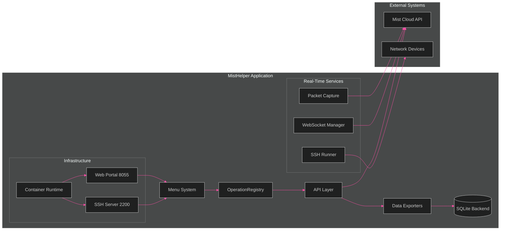
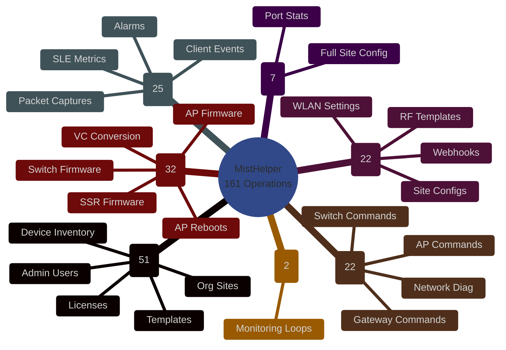

# MistHelper
Network Operations & Data Export Tool for Juniper Mist Cloud

[](https://github.com/jmorrison-juniper/MistHelper/actions/workflows/ci.yml)
[](https://github.com/jmorrison-juniper/MistHelper/actions/workflows/container-build.yml)

**Operation Count:** The code currently defines 161 actionable menu entries (0-160) with some gaps for future expansion.

MistHelper is a production-focused Python application that streamlines large-scale Juniper Mist Cloud data extraction, enrichment, transformation, and limited lifecycle operations. It supports both interactive (menu) and fully automated CLI execution, with flexible output to either CSV files or a relational SQLite database that uses natural/composite business keys (no artificial surrogate IDs for core entities). The codebase emphasizes safety, transparency, and predictable behavior-aligned with the included internal Agents Guide and NASA/JPL style defensive programming practices.

> **[Full Documentation Wiki](https://github.com/jmorrison-juniper/MistHelper/wiki)** | [Menu Reference](https://github.com/jmorrison-juniper/MistHelper/wiki/Menu-Reference) | [Troubleshooting](https://github.com/jmorrison-juniper/MistHelper/wiki/Troubleshooting) | [Container Setup](https://github.com/jmorrison-juniper/MistHelper/wiki/Container-Setup)

## Quality Gates

Every PR runs these checks in parallel via GitHub Actions:

| Gate | Tool | Threshold |
|------|------|-----------|
| Lint | Ruff | Zero violations |
| Type Check | mypy --strict | Phased enforcement |
| Tests | pytest + coverage | >= 70% |
| Security | Bandit | Zero findings |
| Dependencies | pip-audit | Zero vulnerabilities |

## Deployment Options

| Method | File | Description |
|--------|------|-------------|
| Systemd | `deploy/misthelper.service` | Standalone host deployment |
| Podman Quadlet | `deploy/misthelper.container` | Containerized with auto-restart |
| Docker Compose | `compose.yml` | Container orchestration |

See `deploy/.env.example` for environment variable documentation. For full container and SSH setup, see the [Container Setup](https://github.com/jmorrison-juniper/MistHelper/wiki/Container-Setup) and [SSH Remote Access](https://github.com/jmorrison-juniper/MistHelper/wiki/SSH-Remote-Access) wiki pages.

---

## Visual Documentation

MistHelper includes a comprehensive [visual documentation suite](documentation/diagrams/README.md) with 20 Mermaid diagram types covering architecture, class hierarchy, operations, and infrastructure -- all themed with T-Mobile dark-mode colors.

<!-- INLINE DIAGRAM: Architecture Overview (flowchart) -->



> See [detailed architecture diagrams](documentation/diagrams/core/architecture-overview.md) including C4 Context view.

<!-- INLINE DIAGRAM: Menu Mindmap -->



> See [full operations reference](documentation/diagrams/operations/operations-reference.md) with lifecycle states, NOC engineer journey, and safety requirements.
>
> **[Browse all diagrams ->](documentation/diagrams/README.md)**

---

## Core Capabilities

* Multi-mode execution: interactive menu or direct CLI (`--menu <id>`)
* Dual output backends: CSV (simple exchange) or SQLite (`data/mist_data.db`) with adaptive schema strategies
* Hybrid primary key strategy: natural keys when stable IDs exist, composite keys for time-series, and guarded fallback
* Adaptive dependency and import system (`GlobalImportManager`) with UV-to-pip fallback and optional auto-upgrade (disable in containers)
* Intelligent rate limiting & pacing (delay metrics + tuning persistence via `delay_metrics.json`, `tuning_data.json`)
* Robust flattening + sanitization pipeline for nested API JSON
* Optional fuzzy address normalization (scourgify + rapidfuzz; safe fallbacks if not installed)
* Enhanced SSH execution framework (Paramiko) with validation, shell mode, per-host logging stubs (option 97)
* Systematic safe-operation test harness (`--test`) with skip logic for unsafe / interactive / destructive items
* Container ready (Podman first, Docker compatible) with two build profiles (`Containerfile` simple, `Dockerfile` with HEALTHCHECK + UV logic)
* Defensive logging: `script.log` plus targeted debug gating

---

## Directory & Runtime Layout

| Path | Purpose |
|------|---------|
| `MistHelper.py` | Primary monolithic implementation (menu, exports, SSH, persistence) |
| `data/` | SQLite DB (`mist_data.db`), generated CSV outputs, derived artifacts |
| `CombinedInventory_ByWeek/` | Time-series weekly inventory snapshots |
| `data/SSH_COMMANDS.CSV` | Fallback SSH command list (legacy root path still supported) |
| `delay_metrics.json` / `tuning_data.json` | Adaptive rate / tuning persistence |
| `data/script.log` | Unified runtime log |
| `Dockerfile` / `Containerfile` | Two container strategies (UV hybrid vs simplified SSL-bypass) |
| `compose.yml` | Orchestrated service definition (uses `Containerfile` by default) |
| `agents.md` | Internal "Agents Guide" (style, safety, refactor guidance) |

All export CSVs are now written inside `data/` (the code enforces a data directory even if a legacy doc claims root CSV placement).

---

## Installation and Setup

### Step 1: Get the Code
```powershell
git clone https://github.com/jmorrison-juniper/MistHelper.git
cd MistHelper
```

### Step 2: Create a Virtual Environment
```powershell
python -m venv .venv
.venv\Scripts\Activate.ps1
```

### Step 3: Install Dependencies

**Option A: Using UV (Faster, Recommended)**
```powershell
python -m pip install uv
uv pip install -r requirements.txt
```

**Option B: Using pip (Standard)**
```powershell
python -m pip install --upgrade pip
pip install -r requirements.txt
```

### Step 4: Configure Your Environment
```powershell
cp documentation\sample.env .env
```

Edit `.env` with your settings:
- **Required:** Set `MIST_APITOKEN` to your Mist API token
- **Optional but Helpful:** Set `org_id` to skip organization selection
- **Optional:** Configure SSH settings for device commands

To get your API token:
1. Login to https://manage.mist.com
2. Go to Organization > API Tokens
3. Create a new token with appropriate permissions
4. Copy the token to your `.env` file

### Step 5: Test Your Setup
```powershell
python MistHelper.py --help
python MistHelper.py --menu 1
```

---

## How to Run MistHelper

### Interactive Menu Mode (Beginner Friendly)
```powershell
python MistHelper.py
```

### Direct Command Mode (For Automation)
```powershell
# Export organization inventory
python MistHelper.py -M 11

# Export sites information
python MistHelper.py -M 12

# Run gateway synthetic tests (fast mode)
python MistHelper.py -M 16 --fast

# Export data to SQLite database
python MistHelper.py -M 11 --output-format sqlite
```

### Test Mode (Verify Everything Works)
```powershell
python MistHelper.py --test
```

### Common Useful Commands
```powershell
# Get help with all options
python MistHelper.py --help

# Run with detailed logging for troubleshooting
python MistHelper.py -M 11 --debug

# SSH into devices (requires SSH configuration in .env)
python MistHelper.py -M 97

# Fast mode for large organizations
python MistHelper.py -M 16 --fast
```

### Working with Output Files
MistHelper creates organized output in the `data/` directory:
- **CSV files:** Easy to open in Excel or import elsewhere
- **SQLite database:** Use `data/mist_data.db` for complex queries
- **Weekly inventory:** Time-series data in `CombinedInventory_ByWeek/`

---

## Command Line Interface

Primary flags (from argparse block near end of file):

| Flag | Purpose |
|------|---------|
| `-O, --org` | Organization ID |
| `-M, --menu <id>` | Execute a single menu action non-interactively |
| `-S, --site` | Human-readable site name |
| `-D, --device` | Human-readable device name |
| `-P, --port` | Port ID |
| `--output-format {csv,sqlite}` | Select output backend (default csv) |
| `--test` | Run systematic safe-operation test suite |
| `--fast` | Enable fast mode heuristics (threading & reduced retries) |
| `--skip-deps` | Skip dependency auto-install / upgrade phase |
| `--debug` | Enable debug output (includes detailed table data in logs) |
| `--delay <seconds>` | Fixed delay between loop iterations (in seconds) |
| `--address-check` | Enable external address validation using Nominatim API |
| `--skip-ssl-verify` | Skip SSL certificate verification for external API calls |
| `--no-env` | Disable .env file loading for SSH operations |
| `--dry-run` | Preview destructive operations without making changes |
| `--tui` | Launch Terminal User Interface mode for visual API navigation |
| `--login` | Use interactive login (email/password) instead of API token - enables MSP-level API access |
| `--web-portal` | Launch the web portal interface on port 8055 (or WEB_PORT env var) |
| `--testinteractive` | Run systematic test of read-only interactive menu options |

Examples (PowerShell friendly):
```powershell
python .\MistHelper.py -M 11 --output-format sqlite
python .\MistHelper.py -M 13 --output-format sqlite --fast
python .\MistHelper.py --test --output-format sqlite --debug
```

Interactive fallback occurs if no `-M/--menu` is supplied.

---

## Menu Operations

Below is a condensed category summary. For the full per-item reference with descriptions, see the **[Menu Reference](https://github.com/jmorrison-juniper/MistHelper/wiki/Menu-Reference)** wiki page.

| Range | Category | Safety |
|-------|----------|--------|
| 0 | Exit | Safe |
| 1-4 | Org alarms, events, audit logs, gateway IPs | Safe |
| 5-8 | WebSocket commands (MAC/FIB/routing tables) | Interactive |
| 9-10 | Packet captures (site & org level) | Interactive |
| 11-28 | Inventory, stats, templates, enrichment | Safe |
| 29-34 | Site-scoped ports, clients, devices | Safe |
| 35-39 | Template bundles (network, RF, AP, switch) | Safe |
| 40-53 | Clients, security, licenses, PSKs, WLANs, maps | Safe/Interactive |
| 54-62 | Admin, MSP info, monitoring, firmware status | Safe/Interactive |
| 63-65 | Bulk history exports (WIP - unstable) | Resource Intensive |
| 66-89 | SLE insights, interactive views, continuous loops, WebSocket ops | Interactive |
| 90-100 | **Firmware, reboots, VC conversion, SSH runner** | **Destructive** |
| 101-112 | TUI, RADIUS config, template management, maps manager | Mixed |
| 113-122 | WAN probes, MSP inventory, site config analysis | Mixed |
| 123-146 | Device commands (traceroute, OSPF, BGP, ARP, cable test, etc.) | Interactive |
| 147-157 | Clear/reset commands (ARP, BGP, sessions, MAC, DHCP) | **Destructive** |
| 158-160 | Offline device report, SSID consolidation, E911 BSSID report | Safe/Interactive |

**Important Notes:**
* Options 14 & 18 are resource-intensive (multi-hour) and skipped during `--test`
* 63-65 are explicitly marked WIP; expect evolution
* Destructive operations (90-100, 104, 106-111, 113-114, 140, 142-143, 147-155) should never be scripted unattended without explicit review

---

## Security & Safety

| Area | Practice |
|------|---------|
| Credentials | Loaded from `.env`, never logged in cleartext |
| Destructive Ops | Uppercase warnings + explicit invocation required |
| File Output | Filenames sanitized; path traversal blocked in helpers |
| SSH | Paramiko host key auto-add restricted to trusted internal contexts |
| Logging | Secrets & tokens excluded; debug gating prevents noisy stdout |
| Data Integrity | Natural/composite PK strategies avoid silent duplication |

Before extending destructive workflows, replicate existing confirmation pattern and add SECURITY comments as per `agents.md`.

---

## Contributing

1. Fork & branch (`feat/<topic>` or `fix/<issue>`)
2. Add/adjust tests where logic changes (start with validators)
3. Keep commits focused; annotate with tags (`[FEAT]`, `[FIX]`, `[REF]`, `[DOC]`)
4. Update this README if public behavior or filenames change
5. Run `--test` (when feasible) before submitting PR

License: CC-BY-NC-SA-4.0 (Creative Commons Attribution-NonCommercial-ShareAlike 4.0 International)

---

## Roadmap (Short Horizon)

* Structured operation registry + `--list-operations`
* Modular extraction of SSH runner + validators
* Optional JSON log output mode
* Test harness for primary key strategy correctness
* Address verification toggle documented (when externally validated)

---

## Attribution

Built for operational reliability and clarity in large enterprise / NOC contexts. See `agents.md` for internal safety and refactor guidance.

---

## Changelog

See [CHANGELOG.md](CHANGELOG.md) for the full version history.

---
**MistHelper** -- Practical, transparent data operations for Juniper Mist Cloud.
