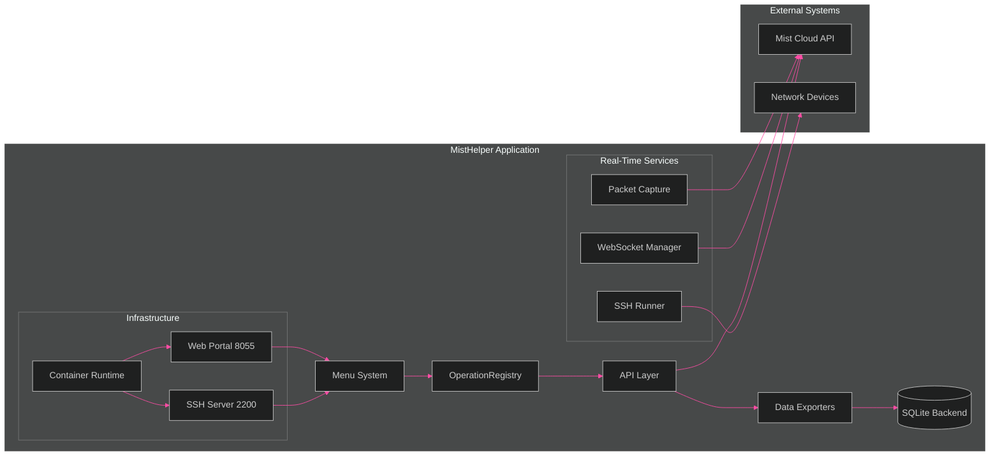
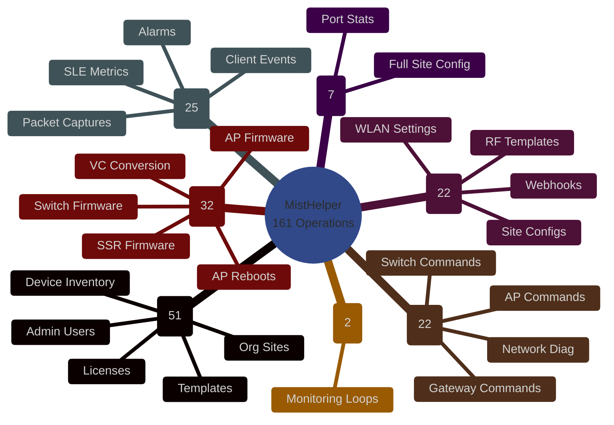

# MistHelper
Network Operations & Data Export Tool for Juniper Mist Cloud

[](https://github.com/jmorrison-juniper/MistHelper/actions/workflows/ci.yml)
[](https://github.com/jmorrison-juniper/MistHelper/actions/workflows/container-build.yml)

**Operation Count:** The code currently defines 161 actionable menu entries (0-160) with some gaps for future expansion.

MistHelper is a production-focused Python application that streamlines large-scale Juniper Mist Cloud data extraction, enrichment, transformation, and limited lifecycle operations. It supports both interactive (menu) and fully automated CLI execution, with flexible output to either CSV files or a relational SQLite database that uses natural/composite business keys (no artificial surrogate IDs for core entities). The codebase emphasizes safety, transparency, and predictable behavior-aligned with the included internal Agents Guide and NASA/JPL style defensive programming practices.

## Quality Gates

Every PR runs these checks in parallel via GitHub Actions:

| Gate | Tool | Threshold |
|------|------|-----------|
| Lint | Ruff | Zero violations |
| Type Check | mypy --strict | Phased enforcement |
| Tests | pytest + coverage | >= 70% |
| Security | Bandit | Zero findings |
| Dependencies | pip-audit | Zero vulnerabilities |

## Deployment Options

| Method | File | Description |
|--------|------|-------------|
| Systemd | `deploy/misthelper.service` | Standalone host deployment |
| Podman Quadlet | `deploy/misthelper.container` | Containerized with auto-restart |
| Docker Compose | `compose.yml` | Container orchestration |

See `deploy/.env.example` for environment variable documentation.

**NEW: SSH Remote Access** - MistHelper now supports containerized deployment with SSH server for remote access. Connect via SSH to run MistHelper in isolated sessions with automatic session management and multi-user support.

---

## Visual Documentation

MistHelper includes a comprehensive [visual documentation suite](documentation/diagrams/README.md) with 20 Mermaid diagram types covering architecture, class hierarchy, operations, and infrastructure -- all themed with T-Mobile dark-mode colors.

<!-- INLINE DIAGRAM: Architecture Overview (flowchart) -->



> See [detailed architecture diagrams](documentation/diagrams/core/architecture-overview.md) including C4 Context view.

<!-- INLINE DIAGRAM: Menu Mindmap -->



> See [full operations reference](documentation/diagrams/operations/operations-reference.md) with lifecycle states, NOC engineer journey, and safety requirements.

> **[Browse all diagrams ->](documentation/diagrams/README.md)**

---
## 1. Why This Rewrite?
The previous README was partially outdated. Key discrepancies corrected here:
1. Operation Count: The code currently defines 161 actionable menu entries (0-160) with some gaps for future expansion.
2. File Naming Differences: Actual code exports `OrgApiTokens.csv`, `OrgPsks.csv`, `OrgRfTemplates.csv`, etc. (case-sensitive differences from older docs). A weekly combined inventory is written under `CombinedInventory_ByWeek/` plus per‑operation CSVs in `data/`.
3. SSH Command Runner: Enhanced SSH Runner (option `97`) now uses a fallback CSV at `data/SSH_COMMANDS.CSV` (legacy root location still accepted temporarily).
4. Heavy / Long‑Running Operations: Options 14 (port stats) and 18 (full site config) are intentionally excluded from automated systematic test mode due to extreme duration and rate‑limit pressure.
5. WIP Operations: 63–65 are explicitly flagged in code as work‑in‑progress and may change schema/output without notice.

This README reflects the current actual logic inside `MistHelper.py` (≈44k lines) as of 2025‑12‑15.

---
## 2. Core Capabilities
* Multi‑mode execution: interactive menu or direct CLI (`--menu <id>`)
* Dual output backends: CSV (simple exchange) or SQLite (`data/mist_data.db`) with adaptive schema strategies
* Hybrid primary key strategy: natural keys when stable IDs exist, composite keys for time‑series, and guarded fallback
* Adaptive dependency and import system (`GlobalImportManager`) with UV→pip fallback and optional auto‑upgrade (disable in containers)
* Intelligent rate limiting & pacing (delay metrics + tuning persistence via `delay_metrics.json`, `tuning_data.json`)
* Robust flattening + sanitization pipeline for nested API JSON
* Optional fuzzy address normalization (scourgify + rapidfuzz; safe fallbacks if not installed)
* Enhanced SSH execution framework (Paramiko) with validation, shell mode, per‑host logging stubs (option 97)
* Systematic safe‑operation test harness (`--test`) with skip logic for unsafe / interactive / destructive items
* Container ready (Podman first, Docker compatible) with two build profiles (`Containerfile` simple, `Dockerfile` with HEALTHCHECK + UV logic)
* Defensive logging: `script.log` plus targeted debug gating

---
## 3. Directory & Runtime Layout
| Path | Purpose |
|------|---------|
| `MistHelper.py` | Primary monolithic implementation (menu, exports, SSH, persistence) |
| `data/` | SQLite DB (`mist_data.db`), generated CSV outputs, derived artifacts |
| `CombinedInventory_ByWeek/` | Time‑series weekly inventory snapshots |
| `data/SSH_COMMANDS.CSV` | Fallback SSH command list (legacy root path still supported) |
| `delay_metrics.json` / `tuning_data.json` | Adaptive rate / tuning persistence |
| `data/script.log` | Unified runtime log |
| `Dockerfile` / `Containerfile` | Two container strategies (UV hybrid vs simplified SSL‑bypass) |
| `compose.yml` | Orchestrated service definition (uses `Containerfile` by default) |
| `agents.md` | Internal “Agents Guide” (style, safety, refactor guidance) |

All export CSVs are now written inside `data/` (the code enforces a data directory even if a legacy doc claims root CSV placement).

---
## 4. Installation and Setup

### Step 1: Get the Code
Download or clone MistHelper to your local machine:
```powershell
git clone https://github.com/jmorrison-juniper/MistHelper.git
cd MistHelper
```

### Step 2: Create a Virtual Environment
Always use a virtual environment to keep your Python packages organized:
```powershell
python -m venv .venv
.venv\Scripts\Activate.ps1
```

### Step 3: Install Dependencies
Install the required Python packages using either UV (recommended) or pip:

**Option A: Using UV (Faster, Recommended)**
```powershell
python -m pip install uv
uv pip install -r requirements.txt
```

**Option B: Using pip (Standard)**
```powershell
python -m pip install --upgrade pip
pip install -r requirements.txt
```

### Step 4: Configure Your Environment
Create your configuration file from the template:
```powershell
cp documentation\sample.env .env
```

Edit `.env` file with your settings:
- **Required:** Set `MIST_APITOKEN` to your Mist API token
- **Optional but Helpful:** Set `org_id` to skip organization selection
- **Optional:** Configure SSH settings for device commands

To get your API token:
1. Login to https://manage.mist.com
2. Go to Organization → API Tokens  
3. Create a new token with appropriate permissions
4. Copy the token to your `.env` file

### Step 5: Test Your Setup
Verify everything works:
```powershell
python MistHelper.py --help
python MistHelper.py --menu 1
```

---
## 5. How to Run MistHelper

### Interactive Menu Mode (Beginner Friendly)
Simply run the script and choose from the menu:
```powershell
python MistHelper.py
```

### Direct Command Mode (For Automation)
Run specific operations directly:
```powershell
# Export organization inventory
python MistHelper.py -M 11

# Export sites information  
python MistHelper.py -M 12

# Run gateway synthetic tests (fast mode)
python MistHelper.py -M 16 --fast

# Export data to SQLite database
python MistHelper.py -M 11 --output-format sqlite
```

### Test Mode (Verify Everything Works)
Run automated tests on safe operations:
```powershell
python MistHelper.py --test
```

### Common Useful Commands
```powershell
# Get help with all options
python MistHelper.py --help

# Run with detailed logging for troubleshooting
python MistHelper.py -M 11 --debug

# SSH into devices (requires SSH configuration in .env)
python MistHelper.py -M 97

# Fast mode for large organizations
python MistHelper.py -M 16 --fast
```

### Working with Output Files
MistHelper creates organized output in the `data/` directory:
- **CSV files:** Easy to open in Excel or import elsewhere
- **SQLite database:** Use `data/mist_data.db` for complex queries
- **Weekly inventory:** Time-series data in `CombinedInventory_ByWeek/`

View SQLite data:
```powershell
sqlite3 data\mist_data.db
```
```sql
.tables
SELECT COUNT(*) FROM listOrgSites;
```

---
## 6. Command Line Interface
Primary flags (from argparse block near end of file):
| Flag | Purpose |
|------|---------|
| `-O, --org` | Organization ID |
| `-M, --menu <id>` | Execute a single menu action non‑interactively |
| `-S, --site` | Human-readable site name |
| `-D, --device` | Human-readable device name |
| `-P, --port` | Port ID |
| `--output-format {csv,sqlite}` | Select output backend (default csv) |
| `--test` | Run systematic safe‑operation test suite |
| `--fast` | Enable fast mode heuristics (threading & reduced retries) |
| `--skip-deps` | Skip dependency auto‑install / upgrade phase |
| `--debug` | Enable debug output (includes detailed table data in logs) |
| `--delay <seconds>` | Fixed delay between loop iterations (in seconds) |
| `--address-check` | Enable external address validation using Nominatim API |
| `--skip-ssl-verify` | Skip SSL certificate verification for external API calls |
| `--no-env` | Disable .env file loading for SSH operations |
| `--dry-run` | Preview destructive operations without making changes |
| `--tui` | Launch Terminal User Interface mode for visual API navigation |
| `--login` | Use interactive login (email/password) instead of API token - enables MSP-level API access |
| `--web-portal` | Launch the web portal interface on port 8055 (or WEB_PORT env var) |
| `--testinteractive` | Run systematic test of read-only interactive menu options |

Examples (PowerShell friendly):
```powershell
python .\MistHelper.py -M 11 --output-format sqlite
python .\MistHelper.py -M 13 --output-format sqlite --fast
python .\MistHelper.py --test --output-format sqlite --debug
```

Interactive fallback occurs if no `-M/--menu` is supplied.

---
## 7. Output & Data Model
### CSV
* Written under `data/` automatically (code ensures directory exists)
* Multiline fields sanitized (line breaks replaced with `\n`)
* Nested structures flattened: dotted / hierarchical keys converted with underscores + index suffixes

### SQLite (set `--output-format sqlite` or `OUTPUT_FORMAT=sqlite` env)
Adaptive strategy (see `ENDPOINT_PRIMARY_KEY_STRATEGIES` mapping):
1. Natural Primary Key: Entities with stable `id` (sites, devices, templates)
2. Composite Primary Key: Event/time‑series metrics (e.g., `device_id + timestamp`)
3. Auto‑Increment w/ Unique Constraint: Aggregated license or summary endpoints lacking stable composite identity

Upserts use `INSERT OR REPLACE` when natural/composite keys are in effect. Index selection is dynamic per endpoint (org/site/device/time fields prioritized). Metadata fields `misthelper_created_time` & `misthelper_updated_time` are appended for auditing.

Inspecting the DB:
```bash
sqlite3 data/mist_data.db
.tables
.schema getOrgInventory
SELECT COUNT(*) FROM listOrgSites;
```

---
## 8. Menu Actions (Current Truth)
Below is the authoritative (condensed) list derived directly from `menu_actions` in code. WIP = unstable schema, DESTRUCTIVE = requires explicit user confirmation & caution.

| Range | Focus | Highlights |
|-------|-------|-----------|
| 0 | Exit | Exit MistHelper |
| 1–4 | Alarms & Definitions | Org alarms, device events, audit logs (24h), gateway management IPs |
| 5–8 | WebSocket Commands | MAC table (switches), forwarding table (gateways), routing table (switches - BGP/OSPF/Static), SSR/SRX routing (128T/SRX gateways - Advanced BGP analysis) |
| 9–10 | Packet Capture | Site & org-level packet captures (wireless/wired/gateway/**switch**/scan/MxEdge) with WebSocket streaming |
| 11–15 | Org Inventory Core | Sites, inventory, device stats, port stats, VPN peer stats |
| 16–19 | Gateway Exports | Synthetic tests, devices list, site settings (HEAVY), test results by site |
| 20–28 | Location & Enrichment | Sites/gateways/devices with location info, guests, switch VC stats, combined inventory, templates, WAN overrides |
| 29–34 | Site‑Scoped | Per‑site ports, clients, devices, device stats, virtual chassis, Wi‑Fi clients |
| 35–39 | Template Bundles | All templates, network, RF, AP, switch templates |
| 40–44 | Clients & Security | Wireless/wired clients, security events, rogue clients/APs |
| 45–53 | Configuration | Licenses, PSKs, webhooks, WLANs (org/site), beacons, maps, zones, insights |
| 54–59 | Admin & Org Mgmt | API tokens, admins, MSP (info only - requires MSP-level access), SSO, usage, MX Edge |
| 60–62 | Monitoring / Analytics | Firmware upgrade status, inventory diff (address similarity), Marvis AI troubleshooting |
| 63–65 | WIP Bulk History | 52‑week device events, 52‑week audit logs, gateway configs (HEAVY) |
| 66–69 | Insights API | Org SLE metrics, sites SLE summary, site insight metrics, client insights |
| 70–74 | Interactive Views | Site selection, inventory browser, device stats/tests/config views |
| 75–76 | Continuous Loops | Both run same continuous collection (5 core API calls with rate limiting) - legacy duplicate |
| 77–78 | Processing & Support | SFP transceiver merge, site support package generation |
| 79–80 | CLI / WebSocket | Interactive CLI shell, ARP via WebSocket |
| 81–86 | Advanced Insights | Device insights, const definitions export, org insights, site/device/client anomaly events |
| 87–89 | WebSocket Device Commands | Device ping, ARP, and service ping via WebSocket (real-time output) |
| 90 | AP Firmware | **DESTRUCTIVE**: Advanced AP firmware upgrade with site selection or template-based targeting, family-based auto-upgrade configuration |
| 91 | Reboot by Template | **DESTRUCTIVE**: Reboot devices by gateway template list (GatewayTemplateRebootList.CSV) |
| 92–93 | Virtual Chassis | **DESTRUCTIVE**: Convert VC switches to virtual MAC (single or bulk via VCConvert.CSV) |
| 94 | VC Status | Check virtual chassis to virtual MAC conversion status |
| 95–96 | Gateway Status | Gateway stats with freshness check, WAN port conflict detection |
| 97–98 | SSH Runner | Enhanced SSH command execution (interactive or by gateway template) |
| 99 | Switch Firmware | **DESTRUCTIVE**: Advanced switch firmware upgrade with mode selection |
| 100 | SSR Firmware | **DESTRUCTIVE**: Advanced SSR/SRX firmware upgrade with mode selection |
| 101 | TUI Mode | Launch Terminal User Interface for visual Mist API library navigation |
| 102 | WLAN RADIUS Timers | Manage WLAN RADIUS authentication timers (timeout, retries, selection, fast_dot1x) |
| 103–104 | Gateway WAN2 Variable | Set WAN2 site variables & **DESTRUCTIVE**: migrate templates to {{wan2_interface}} |
| 105–106 | Template Config | Extract DIA_Pico/Picocell configs to JSON & **DESTRUCTIVE**: apply to other templates |
| 107 | Create Test Sites | **DESTRUCTIVE**: Create 137 test sites from NorthAmericanTestSites.csv |
| 108 | Country RF Templates | **DESTRUCTIVE**: Create country-specific RF templates and assign sites |
| 109 | AP Device Profiles | **DESTRUCTIVE**: Create Device Profile per AP model with inherit/auto settings |
| 110 | Assign APs to Profiles | **DESTRUCTIVE**: Assign APs to matching Device Profiles (AP-{model}) |
| 111 | Clone Templates | **DESTRUCTIVE**: Clone Gateway Template by State/Country geography |
| 112 | Maps Manager | Interactive site floorplan and map operations (sub-menu with 19 operations) |
| 113 | WAN Probe Templates | **DESTRUCTIVE**: Configure WAN Probe Override on Gateway Templates (supports --dry-run) |
| 114 | WAN Probe Devices | **DESTRUCTIVE**: Configure WAN Probe on Device Port Overrides (supports --dry-run) |
| 115 | Interactive Login | Switch to interactive login (email/password) - Enables MSP-level API access |
| 116 | AP Firmware Report | Export AP firmware versions with upgrade recommendations (current/available/suggested) |
| 117 | MSP Inventory | MSP Inventory Export - Device inventory across all MSPs and orgs (requires MSP privileges) |
| 118 | Site Auto-Upgrade | Configure AP auto-upgrade settings for sites (all, single, list, or range) |
| 119 | Site Config Analysis | Scan all sites for zone, engagement dwell tag, and occupancy setting deviations |
| 120 | Site Analytics Config | **DESTRUCTIVE**: Apply standard RTSA/Rogue/Engagement/Occupancy settings to deviating sites |
| 121 | Site Inventory Health | Find sites with APs missing switches/gateways, or with offline infrastructure |
| 122 | Bulk RADIUS WLAN Config | Configure RADIUS WLAN auth timers (timeout, retries, fast_dot1x) for org-level WLANs |
| 123 | Traceroute | Traceroute from device to destination host (AP/Switch/Gateway) |
| 124 | OSPF Neighbors | Show OSPF neighbor adjacencies (Gateway) |
| 125 | OSPF Interfaces | Show OSPF interface status (Gateway) |
| 126 | OSPF Database | Show OSPF link-state database (Gateway) |
| 127 | OSPF Summary | Show OSPF routing summary (Gateway) |
| 128 | Show Sessions | Show active sessions on SSR/SRX gateway |
| 129 | Show Service Path | Show SSR service path entries |
| 130 | Show BGP Summary | Show BGP peer summary (Gateway/Switch) |
| 131 | Show ARP Table | Show ARP table entries (Gateway/Switch) |
| 132 | Show DHCP Leases | Show DHCP lease table (Gateway/Switch) |
| 133 | Show 802.1X Table | Show 802.1X authenticated clients (Switch) |
| 134 | Show EVPN Database | Show EVPN database entries (Switch/Gateway) |
| 135 | Resolve DNS | Test DNS resolution on SSR device |
| 136 | Monitor Traffic | Stream live traffic counters (AP/Switch/Gateway) |
| 137 | Run Top | Stream top processes on SRX gateway |
| 138 | Locate Device | Start LED blink for physical device locate (AP/Switch/Gateway) |
| 139 | Unlocate Device | Stop LED blink on device (AP/Switch/Gateway) |
| 140 | Bounce Port | **DESTRUCTIVE**: Bounce (disable/enable) a switch port |
| 141 | Cable Test | Run cable diagnostics on a switch port |
| 142 | Reprovision Device | **DESTRUCTIVE**: Reprovision Octerm-managed device |
| 143 | Re-adopt Device | **DESTRUCTIVE**: Re-adopt Octerm-managed device |
| 144 | Get ZTP Password | Retrieve ZTP password for a device |
| 145 | Get Config Commands | Retrieve rendered CLI config commands for a device |
| 146 | Upload Support File | Upload device support/debug file to Mist cloud |
| 147 | Clear ARP Cache | **DESTRUCTIVE**: Clear ARP cache on SSR device |
| 148 | Clear BGP Routes | **DESTRUCTIVE**: Clear BGP neighbor routes on SSR |
| 149 | Clear Session | **DESTRUCTIVE**: Clear active session on device |
| 150 | Clear MAC Table | **DESTRUCTIVE**: Clear MAC address table on Switch |
| 151 | Clear BPDU Errors | **DESTRUCTIVE**: Clear BPDU errors on switch ports |
| 152 | Clear Learned MACs | **DESTRUCTIVE**: Clear learned MACs from switch port |
| 153 | Clear Policy Hit Count | **DESTRUCTIVE**: Clear policy hit counters on device |
| 154 | Release DHCP Lease | **DESTRUCTIVE**: Release DHCP lease from device port |
| 155 | Release DHCP SSR | **DESTRUCTIVE**: Release DHCP lease on SSR device |
| 156 | Poll Switch Stats | Force immediate stats poll on switch |
| 157 | Create Device Snapshot | Create configuration snapshot on switch |
| 158 | Offline Device Report | Scan org inventory for devices offline beyond configurable threshold (default 48h), display summary + PrettyTable, save CSV |
| 159 | SSID Template Consolidation | 5-phase guided workflow: audit matrix, site variables, site groups, template creation, and old SSID disable |
| 160 | E911 BSSID Compliance Report | Generate CSV of all BSSIDs per radio per AP across the org, organized by site/floor for E911 compliance |

Important Notes:
* Options 14 & 18 are resource‑intensive (multi‑hour) and skipped during `--test`.
* 63–65 intentionally marked WIP; expect evolution.
* 90–93, 99–100, 104, 106–111, 113–114, 140, 142–143, 147–155 should never be scripted unattended without explicit review.

---
## 9. Systematic Test Mode (`--test`)
Behavior:
* Dynamically enumerates safe menu items (GET, non‑interactive, non‑destructive)
* Skips heavy, WIP, interactive, WebSocket, continuous, destructive operations (documented inline in code)
* Executes in optimized order (fastest endpoints first) to minimize cumulative runtime
* Saves partial results even on rate limiting or exceptions

You can combine with `--output-format sqlite` and `--fast`:
```bash
python MistHelper.py --test --output-format sqlite --fast
```

### Unit Tests (Offline, No Credentials Required)

Run the offline unit test suite — no API token or network access needed:

```bash
python -m pytest tests/unit/ -v
```

Tests cover data processing utilities, telemetry event schemas, primary key strategy validation, and configuration helpers. All tests complete in under 30 seconds.

### NDJSON Test Event Output

Both `--test` and `--testinteractive` emit structured NDJSON events to timestamped files:

```text
data/test_events_YYYYMMDD_HHMMSS.jsonl
```

Each line is a self-contained JSON object with fields: `event_type`, `timestamp`, `menu_option`, `status`, `duration_seconds`. AI agents and CI pipelines can parse results without regex.

### Comparing Test Runs

Use the comparison utility to detect regressions between two test runs:

```bash
python scripts/compare_test_runs.py data/test_events_20260311_143000.jsonl data/test_events_20260312_100000.jsonl
```

The report flags new failures, resolved failures, and timing regressions (>2x slower). Exit code 1 if regressions are found.

### CI Pipeline

Unit tests run automatically in GitHub Actions on every push. The pipeline has three sequential jobs: `validate` (syntax check) -> `test` (pytest) -> `build-and-push` (container image). Test failures block container deployment.

---
## 10. Enhanced SSH Command Runner (Option 97)
Features:
* Auto‑detects hostname, username, password from `.env` (if supplied)
* Falls back to a CSV command list when no explicit `--command` passed (preferred path: `data/SSH_COMMANDS.CSV`, legacy root file still supported)
* Shell mode with adaptive reading & timeout safeguards
* Structured logging (per‑host log concept; ensure directory creation if extending)

Note: Legacy root `SSH_COMMANDS.CSV` is auto-detected if the `data/` copy is absent; you will see an informational message. Migrate to `data/` to suppress it.

### SSH by Gateway Template (Option 98)
Features:
* Integrates with Menu Option 4 (Gateway Management IPs) for target discovery
* Filters gateways by user-selected template name AND online status
* Only targets gateways with configured management IPs
* Interactive template selection with gateway counts
* Uses same SSH configuration as Option 97 (`.env` and `data/SSH_COMMANDS.CSV`)
* Provides confirmation before execution with target list preview

---
## 11. Rate Limiting & Performance
* Adaptive delays stored in `delay_metrics.json`
* Safe concurrency mediated by semaphores + environment‑driven thread limits (`FAST_MODE_MAX_CONCURRENT_CONNECTIONS`)
* Heavy operations log progress early, large loops chunked
* Fallback strategies engage when optional performance libraries are unavailable

---
## 12. Address Normalization & Similarity
If `usaddress-scourgify` and `rapidfuzz` are installed, address comparison for inventory reconciliation (menu 61) uses:
* Normalization pipeline (parse & canonicalize fields)
* Token sort ratio fuzzy scoring fallback (difflib fallback if rapidfuzz absent)
* Threshold configurable via future `.env` variable (documented in Agents Guide; ensure to add if implementing enhancement)

---
## 13. Security & Safety
| Area | Practice |
|------|---------|
| Credentials | Loaded from `.env`, never logged in cleartext |
| Destructive Ops | Uppercase warnings + explicit invocation required |
| File Output | Filenames sanitized; path traversal blocked in helpers |
| SSH | Paramiko host key auto‑add restricted to trusted internal contexts (document inline if expanding) |
| Logging | Secrets & tokens excluded; debug gating prevents noisy stdout |
| Data Integrity | Natural/composite PK strategies avoid silent duplication |

Before extending destructive workflows, replicate existing confirmation pattern and add SECURITY comments as per `agents.md`.

---
## 14. MSP (Managed Service Provider) Support

MistHelper supports MSP-level operations for users with Managed Service Provider privileges. This enables bulk operations across multiple organizations from a single session.

### Enabling MSP Mode

1. **Use Interactive Login (Menu 115)**: MSP privileges require email/password authentication, not API tokens
   ```text
   Select menu option: 115
   ```
   This switches from token-based auth to interactive login and automatically detects MSP privileges.

2. **Automatic Detection**: On successful login, MistHelper detects and displays your MSP access:
   ```text
   + MSP access available: 2 MSP(s)
   ```

### MSP-Enabled Operations

| Menu | Operation | MSP Capability |
|------|-----------|----------------|
| **90** | AP Firmware Upgrade | Mode 3: Upgrade across multiple orgs |
| **116** | Org-Level AP Firmware | Mode 2: Multi-org upgrade with org-level API |
| **118** | Site Auto-Upgrade Config | Mode 2: Configure ALL sites across multiple orgs |

### Using MSP Multi-Org Mode

When MSP privileges are detected, supported menus offer an additional mode:

```text
  MSP privileges detected. Select operation mode:

    [1] Single Organization - upgrade APs in current org
    [2] MSP Multi-Org - select orgs from your MSP(s)

  Select mode (1-2) [1]: 2
```

### MSP Selection Interface

Flexible selection patterns for MSPs and organizations:

| Pattern | Example | Result |
|---------|---------|--------|
| Single index | `1` | First item |
| Multiple indices | `1,3,5` | Items 1, 3, and 5 |
| Range (dash) | `1-5` | Items 1 through 5 |
| Range (word) | `1 through 5` | Items 1 through 5 |
| All items | `all` | Every item |
| Cancel | `q` | Exit selection |

### Workflow Example: Multi-Org Firmware Upgrade

```text
1. Run menu 115 to switch to interactive login
2. Run menu 116 (Org-Level AP Firmware Upgrade)
3. Select mode 2 (MSP Multi-Org)
4. Select MSP(s): "all" or "1,2"
5. For each MSP, select organizations: "1-10" or "all"
6. Configure upgrade settings (strategy, scheduling)
7. Confirm and execute - upgrades run sequentially per org
```

### Workflow Example: Multi-Org Auto-Upgrade Configuration

```text
1. Run menu 115 to switch to interactive login
2. Run menu 118 (Site Auto-Upgrade Configuration)
3. Select mode 2 (MSP Multi-Org)
4. Select MSP(s): "all" or "1,2"
5. For each MSP, select organizations: "1-10" or "all"
6. Configure shared schedule (day of week, time of day)
7. Each org is processed: all sites auto-selected, latest stable firmware chosen
8. Summary shows total sites configured across all orgs
```

### MSP Session Persistence

Once you select an MSP in menu 115, MistHelper remembers it for subsequent operations:
- Menu 116 offers your current MSP as the default
- Press Enter to use the previously selected MSP
- Or select different MSP(s) as needed

### Technical Notes

- **API Differences**: MSP operations use `mistapi.api.v1.msps.orgs.listMspOrgs()` to enumerate organizations
- **Dry-Run Support**: All MSP upgrade modes support `--dry-run` for safe validation
- **Global Variable**: MSP state stored in `msp_privileges` list and `selected_msp` dict
- **Detection Function**: `detect_msp_privileges()` called after interactive login

---
## 15. Containers & SSH Remote Access

### Container Build Strategies
Two build strategies:
1. `Containerfile` (simple, pip only, SSL bypass env overrides for constrained corporate PKI)
2. `Dockerfile` (multi‑path UV attempt + HEALTHCHECK)

### Local Container Usage
Compose example (interactive shell):
```bash
docker compose build
docker compose run --rm misthelper python MistHelper.py
```

Podman example (direct):
```powershell
podman build -t misthelper -f Containerfile .
podman run -it --rm -v "${PWD}/data:/app/data:rw" -v "${PWD}/.env:/app/.env:ro" misthelper python MistHelper.py
```

### SSH Remote Access (NEW)
MistHelper now supports SSH server deployment for remote access with automatic session management:

#### Quick Start - SSH Server
```powershell
# Build and start SSH server container
podman build -t misthelper -f Containerfile .

# IMPORTANT: Ensure data directory has proper permissions for container user
# The container runs as 'misthelper' user (non-root), so the mounted data 
# directory must be writable by that user
chmod -R 777 data/   # Or use appropriate ownership/permissions for your setup

podman run -d --name misthelper -p 2200:2200 -p 8055:8055 -v "${PWD}/data:/app/data:rw" -v "${PWD}/.env:/app/.env:ro" misthelper

# Connect from any SSH client
ssh -p 2200 misthelper@localhost
# Password: misthelper123!
```

#### Data Directory Permissions
The container runs MistHelper as a non-root user (`misthelper`) for security. When mounting the `data/` directory as a volume, ensure proper permissions:

```bash
# Option 1: Open permissions (simplest, suitable for development)
chmod -R 777 data/

# Option 2: Match container user UID/GID (more secure for production)
# The misthelper user in the container typically has UID 999
chown -R 999:999 data/
chmod -R 755 data/
```

**Symptom of permission issues:** If you see `PermissionError: [Errno 13] Permission denied: '/app/data/script.log'` when connecting via SSH, the data directory permissions need to be fixed.

#### SSH Server Features
- **Automatic Session Management**: Each SSH connection creates an isolated MistHelper session
- **Multi-User Support**: Multiple users can connect simultaneously with session isolation
- **Session Persistence**: Sessions persist until you explicitly exit
- **Auto-Restart**: If MistHelper crashes, the session automatically restarts
- **ForceCommand Architecture**: Direct launch into MistHelper (no shell access for security)

#### SSH Connection Details
| Setting | Value | Notes |
|---------|-------|-------|
| **Port** | 2200 | Avoids conflict with system SSH (port 22) |
| **Username** | misthelper | Fixed username for all connections |
| **Password** | misthelper123! | Default password (change in production) |
| **Host Keys** | Auto-generated | Unique per container instance |

#### SSH Session Management
Each SSH connection automatically:
1. Creates a unique session ID based on connection details
2. Sets up an isolated working directory (`/app/sessions/session_<id>/`)
3. Launches MistHelper with container detection
4. Handles clean exit and session cleanup
5. Provides session restart on unexpected termination

#### SSH Usage Examples
```bash
# Connect and run interactively
ssh -p 2200 misthelper@localhost

# Connect with specific SSH client settings
ssh -p 2200 -o StrictHostKeyChecking=no misthelper@localhost

# From Windows with built-in SSH client
ssh -p 2200 misthelper@127.0.0.1
```

#### SSH Architecture Details
- **ForceCommand**: SSH forces execution of MistHelper (no shell access)
- **Session Isolation**: Each connection gets independent session directory
- **Container Detection**: MistHelper automatically detects SSH container mode
- **Session Cleanup**: Automatic cleanup on connection termination
- **Multi-User**: Supports multiple simultaneous SSH connections

#### SSH Security Considerations
- SSH server runs on non-standard port 2200
- ForceCommand prevents shell access (application-only access)
- Session directories are isolated between connections
- Default credentials should be changed in production environments
- Host key verification recommended for production use

#### SSH Troubleshooting
| Issue | Solution |
|-------|----------|
| Connection refused | Ensure container is running: `podman ps` or `docker ps` |
| Wrong password | Default is `misthelper123!` |
| Permission denied (SSH) | Check SSH client settings, try `-o StrictHostKeyChecking=no` |
| Permission denied (data dir) | Run `chmod -R 777 data/` on host before starting container |
| `script.log` permission error | Data directory not writable - fix with `chmod -R 777 data/` |
| Session not starting | Check container logs: `podman logs misthelper` |
| Port conflict | Ensure port 2200 is available |

Persisted artifacts appear under local `data/` bind mount.

### Web Portal (NEW)
MistHelper includes a Flask-based web portal for browser access to data, operations, and map viewing.

#### Quick Start - Web Portal
```powershell
# Local development (Windows)
python MistHelper.py --web-portal

# Container (runs automatically alongside SSH)
podman run -d --name misthelper -p 2200:2200 -p 8055:8055 \
  -v "${PWD}/data:/app/data:rw" -v "${PWD}/.env:/app/.env:ro" \
  ghcr.io/jmorrison-juniper/misthelper:latest
```

Open http://localhost:8055 in your browser.

#### Portal Features
- **Data Browser**: Browse, preview, search, and download CSV/SQLite output files
- **Operations**: Run non-destructive data extraction operations (menus 1-89) with real-time SSE progress
- **Map Viewer**: Interactive Plotly.js floor plan viewer with device markers
- **Themes**: Dark, Light, and High Contrast themes with instant switching (persisted in localStorage)
- **Branding**: Customize title, logo, and accent color via ENV variables

#### Portal ENV Variables

| Variable | Default | Description |
|----------|---------|-------------|
| `PORTAL_TITLE` | `MistHelper` | Browser tab and navbar title |
| `PORTAL_LOGO_URL` | `/static/img/logo-default.svg` | Logo image URL |
| `PORTAL_ACCENT_COLOR` | `#0d6efd` | Accent color for buttons and highlights |
| `PORTAL_THEME` | `dark` | Default theme (dark, light, high-contrast) |
| `WEB_PORT` | `8055` | Web portal listen port |
| `PORTAL_ALLOWED_IPS` | *(empty = all)* | Comma-separated CIDR allowlist |
| `PORTAL_SECRET_KEY` | *(auto-generated)* | Flask session secret key |

#### Portal Endpoints

| Endpoint | Method | Description |
|----------|--------|-------------|
| `/` | GET | Dashboard with data summary |
| `/data` | GET | Data browser page |
| `/operations` | GET | Operations page |
| `/maps` | GET | Map viewer page |
| `/health` | GET | JSON health check |
| `/api/data/files` | GET | List data files |
| `/api/operations/list` | GET | List available operations |
| `/api/operations/run` | POST | Run an operation |
| `/api/operations/stream` | GET | SSE event stream |

---
## 16. Development Notes
Recommended incremental refactor targets (mirrors Agents Guide Section 18):
* Extract API domain modules: `api_ops/`, `output/`, `ssh/`
* Add unit tests for validators (hostname, port, command sanitation)
* Migrate SSH command CSV → structured JSON + schema validation
* Introduce optional structured JSON logging mode (feature flag)
* Implement `--list-operations` CLI flag (enumerate menu descriptors machine‑readably)

Coding Style Essentials:
* Explicit naming, early validation + early return
* All network calls wrapped with logging context and coarse-grained exception handling
* Restrict broad except clauses; log with context

---
## 17. Troubleshooting Quick Table
| Symptom | Likely Cause | Action |
|---------|--------------|--------|
| Empty CSV | Missing org_id / expired token | Verify `.env`, re-run |
| Slow runs / many 429s | Hitting rate limits | Space requests, enable `--fast`, avoid heavy options concurrently |
| SQLite table missing | First run not completed or permission issue | Re-run with `--output-format sqlite` and check write perms on `data/` |
| SSH runner fails | Missing `paramiko` or creds | Ensure `paramiko` installed; add SSH vars to `.env` |
| WIP export fails | Endpoint schema drift | Treat 63–65 as non-stable; review code before relying |
| **SSH connection refused** | **Container not running** | **Check `podman ps`, restart container with SSH enabled** |
| **SSH wrong password** | **Using incorrect credentials** | **Default password is `misthelper123!`** |
| **SSH session won't start** | **ForceCommand or session issues** | **Check container logs, verify SSH server is running** |
| **SSH port conflict** | **Port 2200 already in use** | **Stop other services on port 2200 or modify container config** |
| **Multiple SSH sessions interfering** | **Session isolation problem** | **Each connection should get unique session ID - check logs** |

---
## 18. Contributing
1. Fork & branch (`feat/<topic>` or `fix/<issue>`)  
2. Add/adjust tests where logic changes (start with validators)  
3. Keep commits focused; annotate with tags (`[FEAT]`, `[FIX]`, `[REF]`, `[DOC]`)  
4. Update this README if public behavior or filenames change  
5. Run `--test` (when feasible) before submitting PR  

License: CC-BY-NC-SA-4.0 (Creative Commons Attribution-NonCommercial-ShareAlike 4.0 International)

---
## 19. Roadmap (Short Horizon)
* Structured operation registry + `--list-operations`
* Modular extraction of SSH runner + validators
* Optional JSON log output mode
* Test harness for primary key strategy correctness
* Address verification toggle documented (when externally validated)

---
## 20. Support Flow
1. Run with `--debug` and reproduce
2. Inspect `script.log` (search for failing menu ID)
3. Confirm token validity (menu 11 success?)
4. Try alternate output backend (`--output-format csv` vs `sqlite`)
5. Open issue with log excerpt (redact org/site/device IDs if required by policy)

---
## 19a. Standalone Maps Manager

The Maps Manager (Menu 112, Option 40) can now be run independently using `maps_manager.py`.

### Quick Start
```powershell
# Launch directly into interactive map viewer
python maps_manager.py --viewer

# Launch with specific site
python maps_manager.py --site YOUR_SITE_ID --viewer

# Full interactive menu
python maps_manager.py

# Debug mode
python maps_manager.py --debug --viewer
```

### Command Line Options
| Flag | Description |
|------|-------------|
| `--org ORG_ID` | Specify organization ID (overrides .env) |
| `--site SITE_ID` | Skip site selection, go directly to site |
| `--map MAP_ID` | Skip map selection (requires --site) |
| `--viewer` | Launch interactive Plotly/Dash map viewer directly |
| `--debug` | Enable debug logging |
| `--env PATH` | Path to .env file (default: .env) |

### Environment Variables
The standalone module reads from `.env` or environment variables:
- `MIST_API_TOKEN` or `MISTAPI_API_TOKEN` - API token (required)
- `MIST_ORG_ID` or `MISTAPI_ORG_ID` - Default organization ID

### Architecture
The `maps_manager.py` module imports `MapsManager` from `MistHelper.py`, maintaining a single source of truth. This avoids code duplication while enabling:
- Independent execution without loading the full MistHelper
- Direct access to the interactive map viewer for quick visualization
- Container-friendly deployment with minimal dependencies

---
## 21. Attribution
Built for operational reliability and clarity in large enterprise / NOC contexts. See `agents.md` for internal safety and refactor guidance.

---
## 22. Changelog

See [CHANGELOG.md](CHANGELOG.md) for the full version history.

---
**MistHelper** – Practical, transparent data operations for Juniper Mist Cloud.
