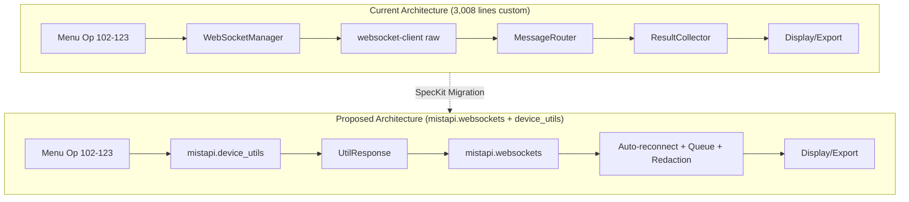
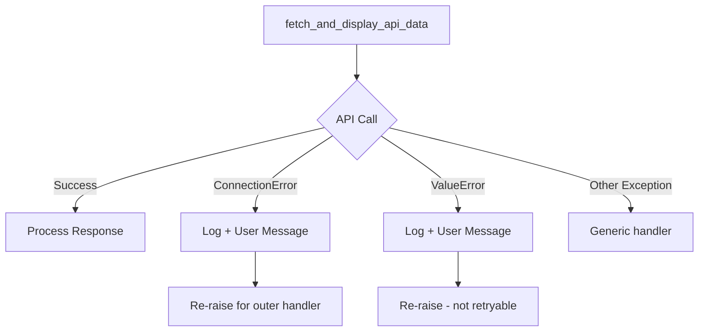

# UPSTREAM: tmunzer/mistapi — Changes since ~0.55

Generated: 2026-06-11
Source: tmunzer/mistapi_python CHANGELOG and releases (tags v0.59.1..v0.63.0, plus earlier 0.59.x); mistapi-go tags/docs.

Purpose: concise per-version summary (features, API changes, breaking changes) and an actionable checklist for the MistHelper repo to find/implement upstream-driven improvements.

---

## Quick summary (high level)
- Major platform additions: WebSocket streaming, Device Utilities (non-blocking diagnostic ops), MapStacks, MxEdge lifecycle and image upload changes, SLE trend endpoints, NAC CoA triggers, E911 export, SSO admin removal APIs.
- Pagination: widespread adoption of `search_after` and fixes to pagination URL handling.
- WebSocket improvements: reconnect/autoreconnect, bounded queues, header redaction, binary frame handling, backoff caps.
- Security & logging: log sanitization, keyring support, credential handling hardening.
- API client behavior: removed default values from optional parameters (client now sends None), and replaced `sys.exit()` calls by proper exceptions.

---

## Detailed per-version notes (version → highlights + note for MistHelper)

### v0.63.0 (2026-06-12)
- New features:
  - Org Async Claim APIs: `listOrgAsyncClaims()`, `createOrgAsyncClaim()`, `getOrgAsyncClaimStatus()`.
  - Org Marvis Client APIs: `getOrgMarvisClientInsights()`, `countOrgMarvisClientEvents()`, `searchOrgMarvisClientEvents()`, `countOrgMarvisClientsStats()`, `searchOrgMarvisClientsStats()`.
  - Site Marvis Configuration Actions: `countSiteMarvisConfigActions()`, `searchSiteMarvisConfigActions()`, `deleteSiteMarvisConfigAction()`, `submitSiteMarvisConfigFeedback()`.
  - AP Localization workflow: `acceptSiteApLocalizationData()`.
- Improvements:
  - Expanded query parameter coverage across device/client/stats/SLE/alarm/event/VPN/tunnel/NAC/webhook/PSK/inventory families.
  - Improved generated parameter documentation in SDK docstrings.

Note for MistHelper:
- New endpoint groups are strong menu candidates for NOC workflows:
  - async claim status and claim-job visibility,
  - Marvis client insights/events/stats exports,
  - site Marvis config action audit + feedback,
  - AP localization acceptance helper.
- Because these are new operations and/or destructive (`deleteSiteMarvisConfigAction`), implementation should run through SpecKit and standard typed-confirmation patterns.

---

### v0.62.0 (2026-05-01)
- New features:
  - Org E911 Report management: `getOrgE911Report()`, `enableOrgE911Report()`, `disableOrgE911Report()`.
  - SSO admin removal: `deleteOrgSsoAdmins()`, `deleteMspSsoAdmins()`.
  - NAC Change-of-Authorization (CoA): `sendOrgNacClientCoA()`, `sendSiteNacClientCoA()`.
  - Mist Edge upgrade lifecycle APIs (org + site endpoints).
  - Site Auto-Map Assignment APIs (`startSiteAutoMapAssignment`, status, apply, clear, etc.).
  - Added `enableSiteDeviceZigbeeJoin()`, `getSiteChannelScores()`, `searchSiteIotEndpoints()`.
- Improvements: expanded query parameter coverage (e.g., `countOrgInventory()` filters), audit log alignment, updated band enum values (5/6 dedicated/selectable).

Note for MistHelper:
- If MistHelper exposes org/site export or NAC features, add menu options and ADRs to call these new endpoints.
- Check any code using band enums or inventory-counting to accept new enum values and new filters.

---

### v0.61.5 (2026-04-22)
- Bugfix: `Privileges.__init__()` handles lists containing instantiated `_Privilege` objects as well as dicts.

Note for MistHelper:
- If MistHelper instantiates `Privilege` objects from mistapi, test for the updated behavior.

---

### v0.61.4 (2026-04-01)
- WebSocket: `max_reconnect_backoff` parameter to cap exponential backoff.
- `max_reconnect_attempts=0` now means unlimited reconnect attempts.
- `APISession` credential override logging; password cleared from memory after login; `_getself()` sets only known user attributes.

Note for MistHelper:
- Consider using `max_reconnect_backoff`/`max_reconnect_attempts` in persistent websocket-based tasks.
- Ensure login flows and credential handling in MistHelper align with new credential override logging/clearing behavior.

---

### v0.61.3 (2026-03-18)
- WebSocket: `queue_maxsize` to bound internal message buffer; dropped messages logged when full.
- Thread-safety hardened (Locks, `_finished` event); user callbacks wrapped in try/except.
- Header redaction filter for websocket-client debug logs (`Authorization`, `Cookie`).
- API: added optional `port_id` param for some insight metrics endpoints.

Note for MistHelper:
- If MistHelper consumes high-frequency websockets, add `queue_maxsize` and handle dropped messages.
- Make sure callbacks used in MistHelper can't crash websocket threads (wrap/guard if needed).

---

### v0.61.2 (2026-03-17)
- WebSocket auto-reconnect: `auto_reconnect`, `max_reconnect_attempts`, `reconnect_backoff`.
- OpenAPI updated (2602.1.7): `getSiteInsightMetrics()` now uses `metrics` query param instead of path param; new `getSiteInsightMetricsForAP()`; `getSiteInsightMetricsForClient()` and `ForGateway()` changed similarly.
- Stats API: `getOrgStats()` and `listOrgSiteStats()` removed `start/end/duration/limit/page` params.
- Bugfixes: shell session recv race conditions, thread-safety fixes.

Note for MistHelper:
- Update any calls that assumed `metric` path params for insights; audit calls to insight endpoints and adjust to new APIs.
- Review any callers of `getOrgStats()`/`listOrgSiteStats()` that supply removed params.

---

### v0.61.1 (2026-03-15)
- New helper: `mistapi.arun()` — runs sync mistapi functions in thread pool for async code.
- Device utilities: non-blocking behavior, `interactiveShell()` and `createShellSession()` for EX/SRX, `topCommand()` streaming with VT100 rendering, binary websocket frame handling, trigger-only commands run synchronously (return `trigger_api_response` immediately).
- Added `sshkeyboard` dependency for interactive shell.

Note for MistHelper:
- Consider adopting `mistapi.arun()` if MistHelper contains async parts or any web UI code that wants to call sync API without blocking.
- Device utilities are now rich: evaluate replacing custom SSH/WebSocket device runners with `device_utils` helpers (non-blocking `UtilResponse`, `createShellSession()`).

---

### v0.61.0 (2026-03-13) — MAJOR
- WebSocket streaming module (`mistapi.websockets`) with many channels (org, site, location), callback/generator/ctxmanager APIs, non-blocking background threads.
- `mistapi.device_utils` module: many device-specific utilities (AP, EX, SRX, SSR) for ping/traceroute/arp/mac/clear ops, streaming via WebSocket, `UtilResponse` API.
- MapStacks API: `listSiteMapStacks()`, `createSiteMapStack()`.
- Code improvements: lazy module loading, `_request_with_retry()` consolidation, `_new_session()`, `set_api_token(validate=...)`.
- Logging and security improvements (vault SSL verification, logging sanitization fixes).
- Added dependency: `websocket-client>=1.8.0`.

Note for MistHelper:
- Big opportunity: replace ad-hoc device-runner code with `device_utils` where appropriate; implement menu options using `UtilResponse`.
- Consider lazy-loading heavy mistapi modules if MistHelper import time is relevant.

---

### v0.60.4 (2026-03-03)
- Site Map Stacks API added.
- `searchOrgInventory()` updated: `model` parameter added.
- `searchOrgJsiAssetsAndContracts()` parameters replaced (duration → date filters) and added version/SIRT filters.
- Bugfix: `APIResponse.data` type annotation and pagination `_check_next()` handling.
- Breaking: `searchOrgJsiAssetsAndContracts()` param rename.

Note for MistHelper:
- If MistHelper parses or filters JSI results by `eol_duration`/`eos_duration`, update to new date filters.

---

### v0.60.3 / v0.60.1 / v0.60.0 (Feb 2026)
- 0.60.3: minor missing query param fix for `searchOrgWanClients()`.
- 0.60.1: fixes in self/logs and sites/sle modules.
- 0.60.0: Org AOS registration, JSI PBN/SIRT endpoints, site asset image management (`attachSiteAssetImageFile()`), site maps auto-geofence, `getOrgMxEdgeVmParams()`; API changes: `addOrgMxEdgeImage()` replaced by multipart `addOrgMxEdgeImageFile()`.

Note for MistHelper:
- Update any callers of `addOrgMxEdgeImage()` to `addOrgMxEdgeImageFile()` and pass file/multipart.
- Add new map/geofence and JSI-related menu items if useful.

---

### v0.59.5 → v0.59.1 (Dec 2024 → Jan 2026)
- 0.59.5: pagination fix for URL building; extensive error-handling improvements (replace `sys.exit()` with exceptions like `ConnectionError` and `ValueError`).
- 0.59.4: removed default values from optional parameters across API functions (client now sends None for omitted params; server applies defaults). 116 files affected.
- 0.59.3: LogSanitizer added for automatic redaction of sensitive fields; `keyring` added as dependency (secure credential storage).
- 0.59.2: SLE endpoints reorganized; `getSiteSleSummary` and `getSiteSleClassifierDetails` deprecated in favor of `*Trend` equivalents (migration guidance provided).
- 0.59.1: many new functions (OSPF stats, search_after pagination param widely added, `search_after` added to many org/site search endpoints; `searchOrgClientFingerprints` accepts `vty` client_type).

Note for MistHelper:
- Tests and exception handling: MistHelper should not rely on mistapi calling `sys.exit()`; instead, catch `ConnectionError`, `ValueError`, etc., and react appropriately.
- Search for uses of SLE endpoints and plan switch to `*Trend` endpoints (migration path exists until 0.65.0 deprecation removal).
- Update code that relied on default-valued function signatures; ensure explicit args where necessary or rely on server defaults.
- Consider adding `LogSanitizer` usage in MistHelper logging to avoid leaking tokens/PSKs in logs; review credential storage and optionally adopt `keyring`.
- Pagination: support `search_after` where appropriate for large result sets (and ensure client pagination helpers handle `_next` URLs correctly when `page` param absent).

---

### v0.58.x — v0.55.x (backfill, limited data)

> **Gap notice:** Upstream `tmunzer/mistapi_python` jumped directly from tag **v0.55.6** (Mar 27 2025) to tag **v0.59.1** (Dec 22 2025). No tags `v0.56.x`, `v0.57.x`, or `v0.58.x` were ever published. `CHANGELOG.md` was first introduced at v0.59.1, so the pre-0.59 history is reconstructed from commit messages between `v0.54.4...v0.59.1` (the compare endpoint exceeds GitHub's API size limit; the data below was extracted from earlier targeted commit fetches).

**Best-effort highlights (by area, not strictly chronological):**

| Area | Change | MistHelper impact |
| - | - | - |
| `APIResponse` | Fix for responses where `status_code != 200` — error responses are now parsed and surfaced correctly instead of being silently dropped. | Safer error visibility; no code change required on our side. |
| `mist_post` | Body parameter now accepts `list` in addition to `dict`. | Useful for future bulk-POST operations; no existing call paths affected. |
| Packaging | Migrated from `setup.py` to `pyproject.toml` + `hatchling` build backend. | Install path unchanged for `pip install mistapi`; only relevant if any packaging script hard-codes a `setup.py` invocation. |
| Vendored OpenAPI | `mist_openapi` repository imported as a **git submodule**. | No runtime impact. Source-build users must run `git submodule update --init` when cloning mistapi from source. |
| Credential storage | Added **HashiCorp Vault** support for token retrieval (alongside existing env vars / config files). | Aligns with our long-standing "keyring adoption" item — Vault is now a first-class option upstream. |
| Tooling | Added `pre-commit` hooks (`bandit`, `pylic`) and a unit-test CI workflow. | No runtime impact; upstream is now lint-/license-/security-gated, so future upstream PRs will be more consistent. |
| Python support | **Python 3.9 removed** from supported versions (3.10+ only). | MistHelper already targets 3.13 — no action. |
| Misc fixes | Environment-variable type-conversion fix; privileges iteration bug fix (PRs #6, #7 era). | Transparent; both were latent bugs in env/login paths. |

**What cannot be enumerated from this gap (no formal release notes existed):**

- Per-endpoint signature changes between 0.55 and 0.59 are absorbed into the v0.59.1 baseline. Treat the v0.59.1 entry above as the **effective floor** for any endpoint behavior prior to that tag.
- If line-by-line per-endpoint diffs are ever needed, the only reliable path is to clone the upstream repo and run `git log --follow` on each `mistapi/api/v1/.../*.py` file across the commits between `v0.55.6..v0.59.1`.

---

## mistapi-go (brief)
- Latest noted tag: v0.4.73 (Jun 24, 2025) and recent updates to OpenAPI spec (2604.1.0 mentioned in repo/README). The Go SDK is updated periodically to match OpenAPI.

Actionable (MistHelper-Go):
- If MistHelper-Go is used, bump `mistapi-go` dependency (go.mod) and regenerate bindings as needed after OpenAPI updates.
- Review `doc/controllers/*` for added/changed endpoints (MapStacks, stats controllers, etc.).

---

## Action checklist: where to look in MistHelper (search patterns & suggested changes)
Run the following searches in the MistHelper repo and open matching files for review:

- Search for removed-default assumptions:
  - `grep -R "duration=" -n MistHelper*` (calls that set durations implicitly)
  - `grep -R "searchOrgAlarms" -n .`
  - `grep -R "getSiteInsightMetricsFor" -n .`

- SLE endpoints: replace
  - `getSiteSleSummary` → `getSiteSleSummaryTrend`
  - `getSiteSleClassifierDetails` → `getSiteSleClassifierSummaryTrend`

- MxEdge image upload:
  - `grep -R "addOrgMxEdgeImage" -n .` → replace usages with `addOrgMxEdgeImageFile` (multipart file upload)

- Pagination and `search_after`:
  - Find long-running search usage: `grep -R "searchOrg"|grep -i "search" -n .`
  - Update callers to accept/forward `search_after` where large result sets exist.

- WebSocket / device-utils improvements:
  - If MistHelper uses websockets, add options: `queue_maxsize`, `auto_reconnect`, `max_reconnect_backoff`, `max_reconnect_attempts`.
  - Consider replacing any in-repo device WebSocket runners with `mistapi.device_utils` helpers and `UtilResponse` usage (non-blocking).

- Error handling changes:
  - Replace tests/flows that expect `sys.exit()` from mistapi with exception handling: catch `ConnectionError`, `ValueError`.

- New endpoints to consider adding to MistHelper menus:
  - Async Claim: `listOrgAsyncClaims`, `createOrgAsyncClaim`, `getOrgAsyncClaimStatus`.
  - Marvis Client (org): `getOrgMarvisClientInsights`, `count/searchOrgMarvisClientEvents`, `count/searchOrgMarvisClientsStats`.
  - Site Marvis Config Actions: `count/searchSiteMarvisConfigActions`, `deleteSiteMarvisConfigAction`, `submitSiteMarvisConfigFeedback`.
  - AP Localization: `acceptSiteApLocalizationData`.
  - E911 export: `getOrgE911Report`, `enableOrgE911Report`, `disableOrgE911Report`.
  - NAC CoA: `sendOrgNacClientCoA`, `sendSiteNacClientCoA`.
  - Mist Edge upgrade lifecycle and site auto-map assignment APIs.
  - SSO cleanup endpoints.

- Logging & secrets:
  - Consider integrating `mistapi.__logger.LogSanitizer` or ensure MistHelper's logging sanitizes tokens/PSKs before writing to disk.
  - Consider optional `keyring` usage for storing credentials (if adopting upstream patterns).

- Misc:
  - Update band enum handling (accept `5-dedicated`, etc.).
  - Update any test fixtures relying on previous pagination or sys.exit behaviour.

---

## Next steps I can take (pick one or more)
1. Run automated grep across this repo for the search patterns above and produce a findings report (file list + code snippets) — recommended first step.
2. Create issues/PR templates for each upstream change we want to adopt.
3. Implement one concrete change (example: migrate `addOrgMxEdgeImage` usages to the multipart API) and run tests.

---

## Audit Results (2026-06-11)

### Items Verified Safe (no action needed)
| Item | Status | Detail |
| - | - | - |
| `listOrgSiteStats` params | SAFE | `limit` and `page` still accepted in mistapi 0.62.0. `start/end/duration` removal claim was inaccurate. |
| `searchOrgJsiAssetsAndContracts` | SAFE | Not called directly in MistHelper.py (only PK strategy defined). |
| `getOrgStats` | SAFE | Not called directly in MistHelper.py (only PK strategy defined). |

### Items Fixed
| Item | Status | Detail |
| - | - | - |
| Exception handling (ConnectionError/ValueError) | **FIXED** | Updated `fetch_and_display_api_data()` to catch `ConnectionError` (network failures, user-friendly message) and `ValueError` (invalid params) from mistapi >= 0.59.5. Tests: 7/7 pass (`tests/unit/test_api_data_fetcher_retry.py`). |

### Items Requiring SpecKit Escalation
| Item | Scope | Recommendation |
| - | - | - |
| **WebSocket migration** to `mistapi.websockets` | 3,008 lines in `src/websocket/` (10+ files). `mistapi.websockets` provides `DeviceCmdEvents`, `DeviceEvents`, `DeviceStatsEvents` etc. with built-in auto-reconnect, queue bounds, header redaction. | Create SpecKit spec. Phased: adapter layer first, then migrate menu ops 102-123 one at a time. |
| **device_utils adoption** | Zero current usage. `mistapi.device_utils` provides non-blocking AP/EX/SRX/SSR utilities (ping, arp, traceroute, shell, bgp, ospf, etc.) with `UtilResponse` auto-WS handling. | Combine with WebSocket migration spec. Replaces both raw API calls AND custom WS polling. |
| **NAC CoA menu items** | New endpoints: `sendOrgNacClientCoA()`, `sendSiteNacClientCoA()` | New menu operations — SpecKit spec required. |
| **SSO admin removal** | New endpoints: `deleteOrgSsoAdmins()`, `deleteMspSsoAdmins()` | New menu operations — SpecKit spec required. |
| **MxEdge upgrade lifecycle** | Org + site endpoints for managing edge firmware upgrades | New menu operations — SpecKit spec required. |
| **Site Auto-Map Assignment** | `startSiteAutoMapAssignment()`, status, apply, clear | New menu operations — SpecKit spec required. |
| **Channel Scores, IoT, Zigbee** | `getSiteChannelScores()`, `searchSiteIotEndpoints()`, `enableSiteDeviceZigbeeJoin()` | New menu operations — SpecKit spec required. |

### Architecture Diagram: Current vs Proposed WebSocket Flow

### Architecture Diagram: Exception Handling Flow (IMPLEMENTED)

---

If you want me to proceed, tell me which next step to run (I recommend #1: run automated grep and produce a findings report).
