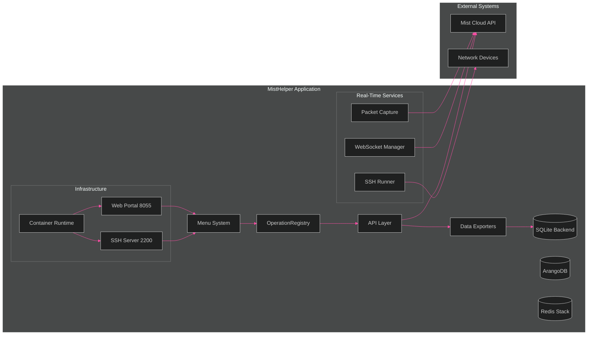
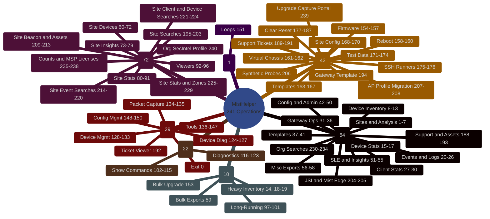

# Architecture

This page holds the structure of the code and the diagrams that describe it.

Read [the diagram suite](diagrams/README.md) for all 20 diagram types.

## The diagrams

MistHelper carries a full diagram suite with 20 Mermaid diagram types. The suite
covers the architecture, the class hierarchy, the operations, and the
infrastructure. Every diagram uses the same dark theme.

<!-- INLINE DIAGRAM: Architecture Overview (flowchart) -->



> See [detailed architecture diagrams](diagrams/core/architecture-overview.md) including C4 Context view.

<!-- INLINE DIAGRAM: Menu Mindmap -->



> See [full operations reference](diagrams/operations/operations-reference.md) with lifecycle states, NOC engineer journey, and safety requirements.
>
> **[Browse all diagrams ->](diagrams/README.md)**

---

## Directory & Runtime Layout

| Path | Purpose |
|------|---------|
| `MistHelper.py` | Runtime entrypoint and menu registry. The decomposition moved most logic into `src/`. |
| `src/` | Extracted modules that mirror the Mist API and mistapi hierarchy |
| `tools/ste_linter/` | Simplified Technical English compliance linter and dictionary extractor |
| `data/` | SQLite DB (`mist_data.db`), generated CSV outputs, derived artifacts; polyglot backends run in containers |
| `CombinedInventory_ByWeek/` | Time-series weekly inventory snapshots |
| `data/SSH_COMMANDS.CSV` | Fallback SSH command list (legacy root path still supported) |
| `delay_metrics.json` / `tuning_data.json` | Adaptive rate / tuning persistence |
| `data/script.log` | Unified runtime log |
| `Dockerfile` / `Containerfile` | Two container strategies (UV hybrid vs simplified pip build). Both verify TLS certificates. |
| `compose.yml` | Orchestrated service definition (uses `Containerfile` by default) |
| `agents.md` | Internal "Agents Guide" (style, safety, refactor guidance) |

All export CSVs are now written inside `data/` (the code enforces a data directory even if a legacy doc claims root CSV placement).

---

## Architecture Evolution

MistHelper started as a single-file script (`MistHelper.py`). The decomposition
moved most logic into a modular `src/` package. The target structure mirrors
both the **Mist Cloud API hierarchy** (from the OpenAPI spec) and **Thomas
Munzer's mistapi library** (`tmunzer/mistapi_python`), so that the internal
organization matches the APIs that the tool consumes.

### Size Facts

Measured on 2026-08-05.

| Area | Python lines | Files |
|------|--------------|-------|
| `MistHelper.py` | 6,169 | 1 |
| `src/` | 124,675 | 363 |
| `tests/` | 129,893 | -- |

The entrypoint held roughly 28,000 lines before the decomposition. It now holds
6,169. The test suite is now larger than the source it covers.

### Current `src/` Layout

```text
src/
├── analytics/              # Site inventory health analysis and zone configuration
├── api/                    # API operation modules (orgs, sites, const)
├── audit/                  # Audit log operations
├── auth/                   # Authentication and session management
├── bootstrap/              # Dependency checks and package installation
├── cache/                  # Caching utilities
├── capture/                # Packet capture workflows and download management
├── config/                 # Configuration loading and resolution
├── data/                   # Shared data helpers
├── dataclasses/            # Structured payload definitions
├── db/                     # Database backends (ArangoDB, Redis, retention, routing)
├── device/                 # Device utility operations and AP profile migration
├── export/                 # Site data export and insights extraction
├── firmware/               # Firmware management operations
├── gateway/                # Gateway exports, stats, overrides, WAN migration
├── input/                  # Input handling utilities
├── inventory/              # Device inventory summary, MSP orchestration, CSV comparison
├── maps/                   # Maps manager operations
├── marvis/                 # Marvis AI integration
├── menu/                   # Menu system and option dispatch
├── network/                # Network configuration operations
├── org/                    # Organization operations and synthetic probes
├── org_data_collector.py   # Org-level data collection
├── output/                 # Output formatting (writer)
├── refactors/              # Extraction targets from the decomposition waves
├── reports/                # Report generation
├── site/                   # Site configuration management (test sites, RF, profiles)
├── ssh/                    # SSH runner and execution management
├── ssid_consolidation/     # SSID consolidation operations
├── time/                   # Time and lookback window utilities
├── troubleshooting/        # Marvis troubleshooting workflows
├── ui/                     # Web portal components
├── utils/                  # Shared utilities and the operation registry
├── validation/             # Input validation
├── wan_hub_group_manager.py  # WAN hub/group operations
├── wan_vpn_builder.py      # WAN VPN builder
├── websocket/              # WebSocket commands, diagnostics, service ping
├── constants.py            # Shared constants
└── __init__.py
```

### Decomposition Status

| Module | Status | Description |
|--------|--------|-------------|
| `src/db/` | **Done** | ArangoDB writer, Redis writer, retention, routing |
| `src/export/` | **Done** | Output writer (`DataExporter.write_with_format_selection`) |
| `src/constants.py` | **Done** | Shared constants |
| `src/wan_*.py` | **Done** | WAN hub group manager, VPN builder |
| `src/analytics/` | **Done (Wave 2)** | Site inventory health analyzer, site analytics configurator, zone analyzer |
| `src/capture/` | **Done (Wave 2)** | Canonical packet capture manager + download/poll helper extraction |
| `src/export/` | **Done (Wave 2)** | Site export utilities and site insights exporter |
| `src/gateway/` | **Done (Wave 2)** | Gateway exports, stats exporter, override analyzer, WAN2 migration, probe overrides |
| `src/inventory/` | **Done (Wave 2)** | Org device inventory summary, MSP orchestrator, CSV comparator |
| `src/site/` | **Done (Wave 2)** | Site config manager (test sites, RF templates, device profiles) |
| `src/ssh/` | **Done (Wave 2)** | SSH runner + SSH runner manager (orchestration retained in entrypoint) |
| `src/troubleshooting/` | **Done (Wave 2)** | Marvis troubleshooting helpers split from entrypoint |
| `src/websocket/` | **Done (Wave 2)** | WebSocket manager, commands, diagnostics, service ping manager + discovery |
| `src/api/` | In Progress | API operation modules (continuing incremental migration) |
| `src/auth/` | In Progress | Authentication/session flows |
| `src/ui/` | In Progress | Web portal extraction |

### Wave 2 Module Ownership (Phases 1-9)

All 9 phases completed with hard-gate evidence. Each phase passed: extraction, tests, quality gates, menu/API/output parity, import graph, runtime coupling, and sign-off.

| Phase | Package | Key Classes | Menu Operations |
|-------|---------|-------------|-----------------|
| 1 | `src/analytics/` | `SiteInventoryHealthAnalyzer`, `SiteAnalyticsConfigurator` | 7, 169 |
| 2 | `src/troubleshooting/`, `src/ssh/` | `MarvisTroubleshootUtils`, `SSHRunnerManager` | 124-127, 139, 175-176 |
| 3 | `src/gateway/` | `WAN2MigrationManager`, `WanProbeDeviceOverrideManager` | 149, 167 |
| 4 | `src/site/` | `SiteConfigManager` | 171-174 |
| 5 | `src/export/` | `SiteExportUtils`, `SiteInsightsExporter` | 60-96 |
| 6 | `src/inventory/` | `OrgDeviceInventorySummaryCore`, `OrgDeviceInventoryMSPOrchestrator` | 8-9, 13-14 |
| 7 | `src/gateway/` | `GatewayExportUtils`, `GatewayStatsExporter`, `GatewayOverrideAnalyzer` | 31-50, 99, 163 |
| 8 | `src/websocket/` | `ServicePingManager`, `ServicePingDiscoveryMixin` | 120-121 |
| 9 | `src/capture/` | `PacketCaptureManager`, `PacketCaptureDownloadManager` | 134-135 |

Compatibility surface preserved: `MistHelper.py` remains the runtime entrypoint with delegated ownership in `src/`. Hard-gate validations passed for all phases including menu/API/output parity, import graph cycle detection, runtime coupling isolation, and deployment pipeline.

### Guiding Principles

- **New features go in `src/`**, not `MistHelper.py`
- **MistHelper.py remains the entrypoint** but delegates to `src/` modules
- **Feature-domain packages** -- modules are organized by functional domain (analytics, capture, gateway, etc.)
- **Incremental migration** -- extract one class/feature at a time, keep tests green

---
