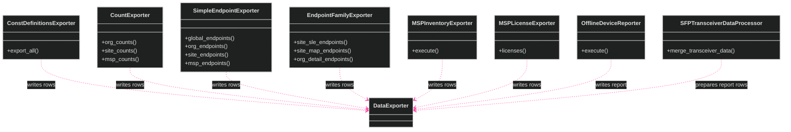

[<- Back to Diagram Index](../README.md) | [<- Back to Overview](overview.md)

# Exporter Classes

These diagrams show the current exporter classes.
Most exporter classes are static facades and do not inherit from `DataExporter`.
`SiteExportUtils` is the only class here with a verified base class.

## Shared Export and Org Exporters

```mermaid
%%{init: {'theme': 'dark', 'themeVariables': {
  'primaryColor': '#E20074',
  'primaryTextColor': '#E0E0E0',
  'primaryBorderColor': '#99004D',
  'lineColor': '#FF4DA6',
  'secondaryColor': '#16213E',
  'tertiaryColor': '#1A1A2E',
  'fontFamily': 'ui-monospace, monospace'
}}}%%
classDiagram
    direction TB

    class DataExporter {
        +write_with_format_selection()
        +write_to_csv()
        +export_with_processing()
    }

    class OrgExportUtils {
        +export_data()
        +sites_sle_summary()
        +insight_metrics()
        +mist_edge_events()
    }
    class OrgSiteExporter {
        +sites()
        +sites_list_api()
        +sites_with_location()
    }
    class OrgInventoryExporter {
        +inventory()
        +devices()
        +combined_inventory_with_site_info()
        +gateways_with_site_info()
    }
    class OrgDeviceStatsExporter {
        +device_stats()
        +device_port_stats()
        +vpn_peer_stats()
    }
    class OrgTemplateExporter {
        +all_templates()
        +network_templates()
        +rf_templates()
        +ap_templates()
    }
    class OrgAlarmEventExporter {
        +alarms()
        +events()
        +device_events()
    }
    class OrgClientSecurityExporter {
        +wireless_clients()
        +wired_clients()
        +security_events()
    }
    class OrgAdminExporter {
        +api_tokens()
        +admins()
        +licenses()
    }
    class OrgConfigExporter {
        +psks()
        +webhooks()
        +wlans()
    }

    OrgExportUtils ..> DataExporter : writes rows
    OrgSiteExporter ..> DataExporter : writes rows
    OrgInventoryExporter ..> DataExporter : writes rows
    OrgDeviceStatsExporter ..> DataExporter : writes rows
    OrgTemplateExporter ..> DataExporter : writes rows
    OrgAlarmEventExporter ..> DataExporter : writes rows
    OrgClientSecurityExporter ..> DataExporter : writes rows
    OrgAdminExporter ..> DataExporter : writes rows
    OrgConfigExporter ..> DataExporter : writes rows
```

## Site and Gateway Exporters

```mermaid
%%{init: {'theme': 'dark', 'themeVariables': {
  'primaryColor': '#E20074',
  'primaryTextColor': '#E0E0E0',
  'primaryBorderColor': '#99004D',
  'lineColor': '#FF4DA6',
  'secondaryColor': '#16213E',
  'tertiaryColor': '#1A1A2E',
  'fontFamily': 'ui-monospace, monospace'
}}}%%
classDiagram
    direction TB

    class SiteInsightsExporter
    class SiteExportUtils {
        +insights()
        +ospf_stats()
        +site_stats()
        +gateway_metrics()
    }
    class SiteDeviceExporter {
        +device_inventory()
        +device_stats()
        +port_stats()
    }
    class SiteClientExporter {
        +clients()
        +client_insights()
        +wifi_clients()
        +get_site_beacon()
    }
    class SiteConfigExporter {
        +wlans()
        +maps()
        +zones()
        +settings()
    }
    class SiteAnomalyExporter {
        +anomaly_events()
        +device_anomaly_events()
        +client_anomaly_events()
    }
    class SiteSearchExporter {
        +alarms()
        +assets()
        +devices()
        +rogue_events()
    }

    class GatewayExportUtils {
        +management_ips()
        +device_configs()
        +templates()
        +wan2_variable_migration()
    }
    class GatewayTestExporter {
        +synthetic_tests()
        +fetch_synthetic_test_stats_with_retry()
        +test_results_by_site()
    }
    class GatewayStatsExporter {
        +device_stats()
        +device_stats_with_freshness()
        +wan_port_conflicts()
    }
    class GatewayHaExporter {
        +ha_cluster_info()
    }

    SiteInsightsExporter <|-- SiteExportUtils
    SiteExportUtils ..> DataExporter : injected writer
    SiteDeviceExporter ..> DataExporter : writes rows
    SiteClientExporter ..> DataExporter : writes rows
    SiteConfigExporter ..> DataExporter : writes rows
    SiteAnomalyExporter ..> DataExporter : writes rows
    SiteSearchExporter ..> DataExporter : writes rows
    GatewayExportUtils ..> OrgInventoryExporter : forwards inventory
    GatewayTestExporter ..> DataExporter : writes rows
    GatewayStatsExporter ..> DataExporter : writes rows
    GatewayHaExporter ..> DataExporter : writes rows
```

## Other Exporters and Report Exporters

## Module Paths

| Class | Module path |
|-------|-------------|
| `DataExporter` | `src/export/data_exporter.py` |
| `OrgExportUtils` | `src/export/org_export_utils.py` |
| `SiteExportUtils` | `src/export/site_export_utils.py` |
| `GatewayExportUtils` | `src/gateway/gateway_export_utils.py` |
| `SFPTransceiverDataProcessor` | `src/reports/sfp_transceiver_data_processor.py` |

## Siblings

- [Infrastructure](infrastructure.md) - Core and API fetching classes
- [Managers](managers.md) - Manager classes
- [Utilities](utilities.md) - Utility and data processing classes
