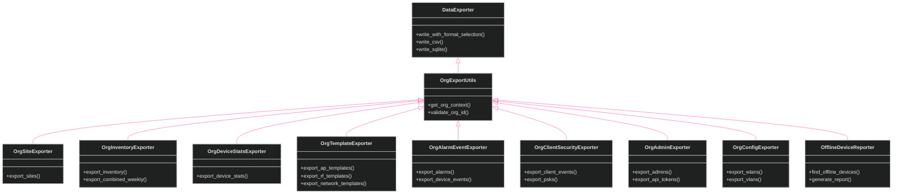
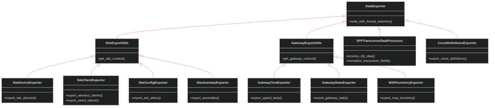

[<- Back to Diagram Index](../README.md) | [<- Back to Overview](overview.md)

# Exporter Classes

Org-level, site-level, and gateway exporter families plus shared export utilities.

## Org-Level Exporters

## Site & Gateway Exporters

## Siblings

- [Infrastructure](infrastructure.md) - Core and API fetching classes
- [Managers](managers.md) - Manager classes (firmware, SSH, WebSocket)
- [Utilities](utilities.md) - Utility and data processing classes
