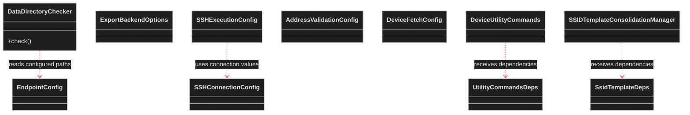
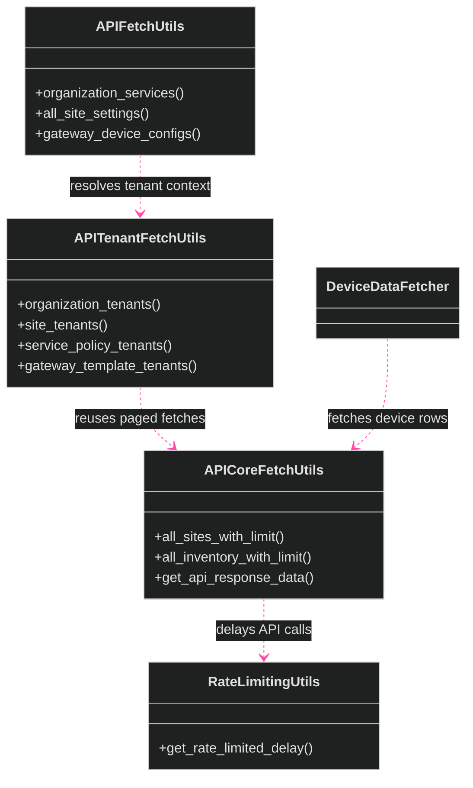

[<- Back to Diagram Index](../README.md) | [<- Back to Overview](overview.md)

# Infrastructure, Configuration, and API Fetching

These diagrams show the core, the configuration objects, and the utilities for API fetches.
The utility classes for API fetches are separate facades.
They do not form an inheritance chain in the current tree.

## Infrastructure and Configuration

## API Fetch Utilities

## Verified Module Paths

| Class | Module path |
|-------|-------------|
| `DataDirectoryChecker` | `src/refactors/data_directory_checker.py` |
| `EndpointConfig` | `src/dataclasses/endpoint_config.py` |
| `SSHConnectionConfig` | `src/ssh/ssh_runner.py` |
| `SSHExecutionConfig` | `src/ssh/ssh_runner.py` |
| `APICoreFetchUtils` | `src/api/api_core_fetch_utils.py` |
| `APITenantFetchUtils` | `src/api/tenant_fetch.py` |
| `APIFetchUtils` | `src/api/api_fetch_utils.py` |
| `DeviceDataFetcher` | `src/refactors/device_data_fetcher.py` and `src/gateway/overrides/device_data_fetcher.py` |

## Siblings

- [Exporters](exporters.md) - Class families for data export
- [Managers](managers.md) - Manager classes
- [Utilities](utilities.md) - Utility classes and data processing classes
