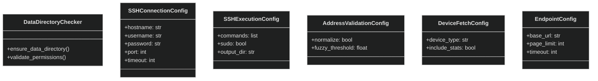
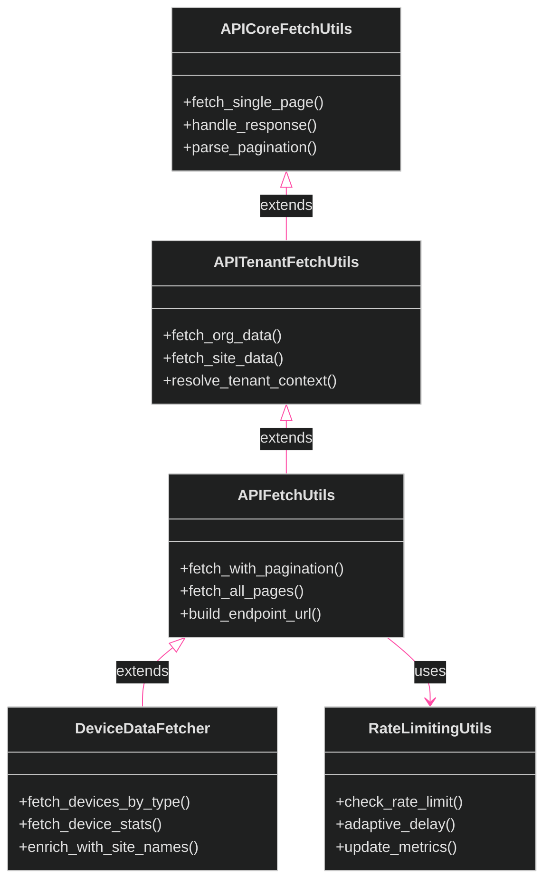

[<- Back to Diagram Index](../README.md) | [<- Back to Overview](overview.md)

# Infrastructure, Configuration & API Fetching

Core infrastructure classes, configuration dataclass objects, and the API fetching inheritance chain.

## Infrastructure & Core

## API Fetching Chain

The API fetching classes form an inheritance chain, each layer adding specificity.

## Siblings

- [Exporters](exporters.md) - Data export class families
- [Managers](managers.md) - Manager classes (firmware, SSH, WebSocket)
- [Utilities](utilities.md) - Utility and data processing classes
