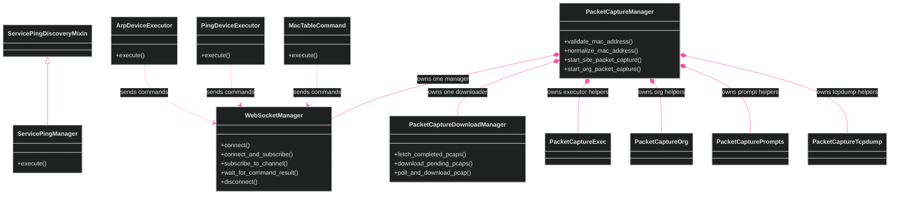
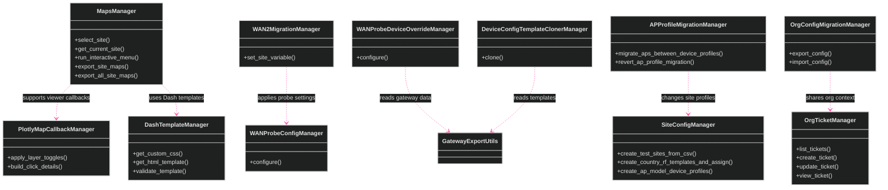

[<- Back to Diagram Index](../README.md) | [<- Back to Overview](overview.md)

# Manager Classes

The current tree has 40 classes with names that end in `Manager`.
The diagrams below show the main manager families.
They also show the cluster-forwarding pattern where it matters.

## WebSocket and Packet Capture Managers

## SSH, Device, and Firmware Managers

```mermaid
%%{init: {'theme': 'dark', 'themeVariables': {
  'primaryColor': '#E20074',
  'primaryTextColor': '#E0E0E0',
  'primaryBorderColor': '#99004D',
  'lineColor': '#FF4DA6',
  'secondaryColor': '#16213E',
  'tertiaryColor': '#1A1A2E',
  'fontFamily': 'ui-monospace, monospace'
}}}%%
classDiagram
    direction TB

    class EnhancedSSHRunner {
        +sanitize_filename()
    }
    class SSHRunnerManager {
        +interactive()
        +by_gateway_template()
    }
    class CLIShellManager {
        +launch()
    }
    class BatchExecutor {
        +run()
    }
    class HostRunner {
        +run()
    }
    class MultiHostRunner {
        +run()
    }
    class ARPCommandManager {
        +execute()
    }
    class DeviceRebootManager {
        +by_gateway_template_list()
    }
    class VirtualChassisManager {
        +launch_convert_single()
        +convert_single()
        +check_status()
    }
    class FirmwareManager {
        +check_firmware_upgrade_status()
        +execute_firmware_upgrade_with_mode_selection()
        +execute_switch_firmware_upgrade_with_mode_selection()
    }
    class BulkAPFirmwareUpgrader {
        +execute()
    }
    class BulkSwitchFirmwareUpgrader {
        +execute()
    }
    class OrgLevelAPFirmwareUpgrader {
        +run()
        +execute()
    }

    SSHRunnerManager ..> EnhancedSSHRunner : starts SSH flows
    CLIShellManager ..> EnhancedSSHRunner : launches shell
    BatchExecutor ..> HostRunner : runs one host
    MultiHostRunner ..> HostRunner : runs many hosts
    FirmwareManager ..> BulkAPFirmwareUpgrader : starts AP upgrades
    FirmwareManager ..> BulkSwitchFirmwareUpgrader : starts switch upgrades
    FirmwareManager ..> OrgLevelAPFirmwareUpgrader : starts org AP upgrades
    VirtualChassisManager ..> EnhancedSSHRunner : uses SSH utilities
```

## Map, Gateway, Site, and Org Managers

## Siblings

- [Infrastructure](infrastructure.md) - Core and API fetching classes
- [Exporters](exporters.md) - Data export class families
- [Utilities](utilities.md) - Utility and data processing classes
