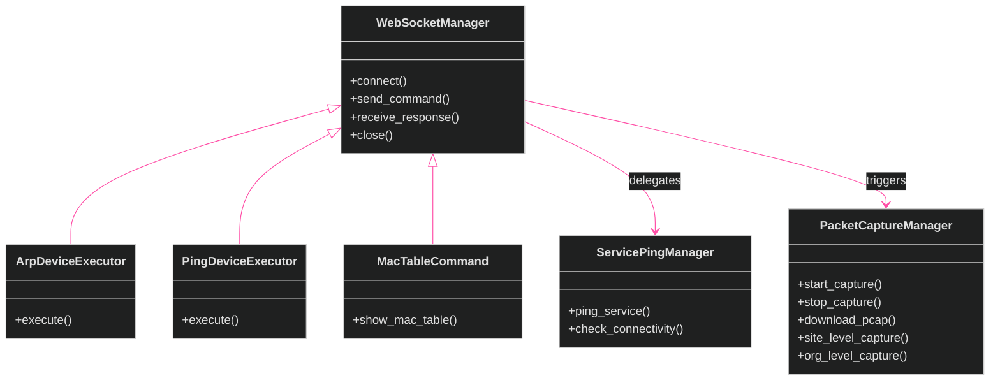
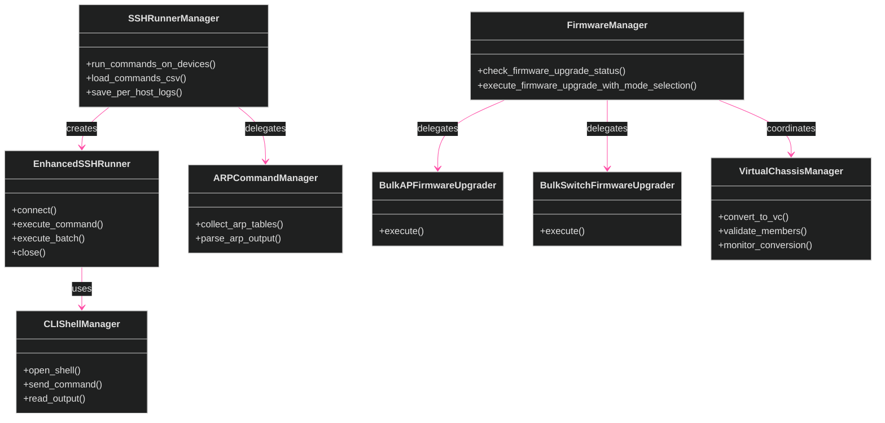
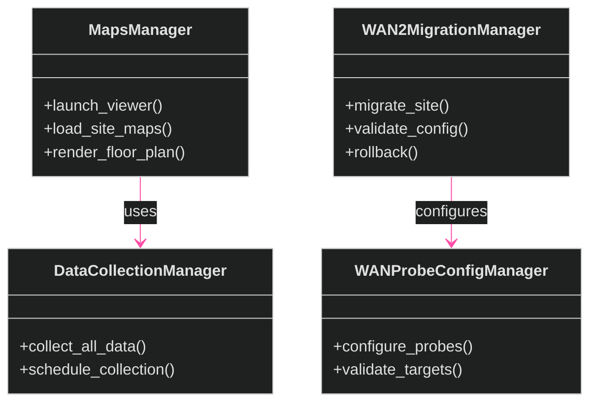

# Manager Classes

[<- Back to Diagram Index](../README.md) | [<- Back to Overview](overview.md)

The 28+ manager classes handle advanced operations: firmware upgrades, SSH execution, packet captures, WebSocket commands, maps, virtual chassis, and WAN migration.

## WebSocket & Network Managers

## SSH & Device Managers

## Maps & WAN Managers

## Siblings

- [Infrastructure](infrastructure.md) - Core and API fetching classes
- [Exporters](exporters.md) - Data export class families
- [Utilities](utilities.md) - Utility and data processing classes
