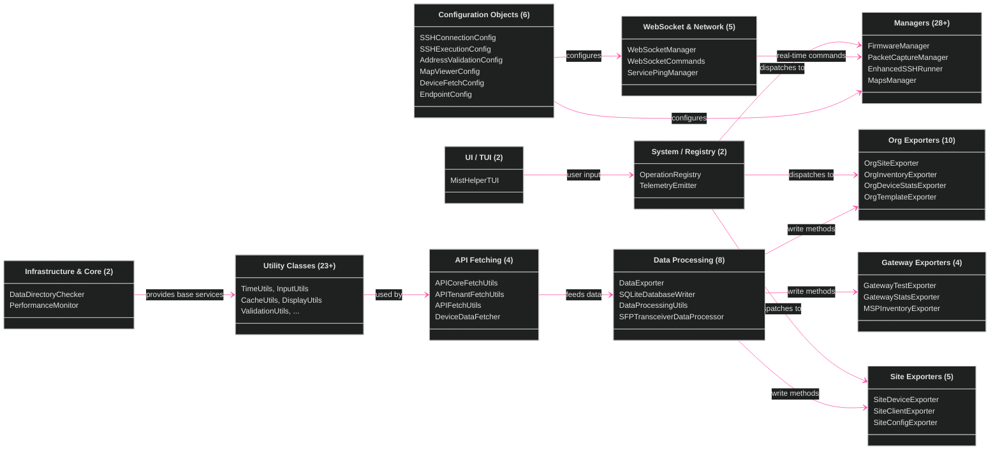

[<- Back to Diagram Index](../README.md)

# Class Hierarchy Overview

Top-level view of MistHelper's 99+ classes organized into 12 families with inter-family dependencies.

## Family Sub-Diagrams

| Family | Classes | Details |
|--------|---------|---------|
| [Infrastructure](infrastructure.md) | Infrastructure, Configuration, API Fetching | Core services, config objects, API chain |
| [Exporters](exporters.md) | Org, Site, Gateway Exporters | All data export classes |
| [Managers](managers.md) | Managers & Advanced (28+) | Firmware, SSH, WebSocket, captures |
| [Utilities](utilities.md) | Utilities & Data Processing (31+) | Helper classes and data transform |

---

## Related Diagrams

- [Architecture Overview](../core/architecture-overview.md) - System-level subsystem map
- [Operations Reference](../operations/operations-reference.md) - How operations use these classes
- [Data Pipeline](../core/data-pipeline.md) - Data flow through the class chain
