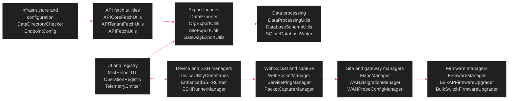

[<- Back to Diagram Index](../README.md)

# Class Hierarchy Overview

This view shows the current class families in `MistHelper.py` and `src/`.

The static scan reads `MistHelper.py` and 621 files under `src/`.
It found 1,190 classes and no parse errors.
The scan ran against the current worktree without importing project modules.

## Verified Class Family Counts

| Family | Count | Main package paths |
|--------|-------|--------------------|
| Exporters | 43 classes ending in `Exporter` | `src/export/`, `src/gateway/`, `src/reports/` |
| Managers | 40 classes ending in `Manager` | `src/firmware/`, `src/device/`, `src/gateway/`, `src/maps/`, `src/capture/` |
| Utilities | 31 classes ending in `Utils` | `src/utils/`, `src/export/`, `src/data/`, `src/network/` |
| Config objects | 21 classes ending in `Config` | `src/dataclasses/`, `src/ssh/`, `src/capture/`, `src/firmware/` |
| Runners | 16 classes ending in `Runner` | `src/ssh/`, `src/capture/`, `src/bootstrap/` |
| Writers | 7 classes ending in `Writer` | `src/refactors/`, `src/db/`, `src/upgrade_portal/` |

## Family Sub-Diagrams

| Family | Details |
|--------|---------|
| [Infrastructure](infrastructure.md) | Core services, configuration objects, and API fetch utilities |
| [Exporters](exporters.md) | Export facades, endpoint exporters, and shared output classes |
| [Managers](managers.md) | Firmware, SSH, WebSocket, capture, map, and migration managers |
| [Utilities](utilities.md) | Utility classes, processing classes, and cluster-forwarding classes |

## Related Diagrams

- [Architecture Overview](../core/architecture-overview.md) - System subsystem map
- [Operations Reference](../operations/operations-reference.md) - Operation flow into these classes
- [Data Pipeline](../core/data-pipeline.md) - Data flow through the export path
