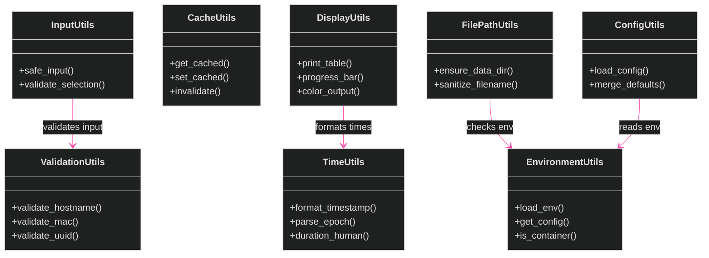
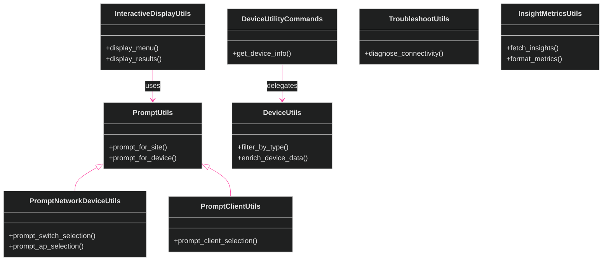
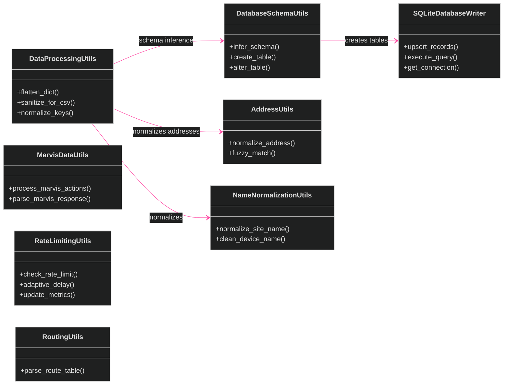

[<- Back to Diagram Index](../README.md) | [<- Back to Overview](overview.md)

# Utility & Data Processing Classes

23+ utility classes organized by responsibility, plus the data processing chain that transforms raw API responses into exportable records.

## Utility Classes by Responsibility

## Prompt & Interactive Utilities

## Data Processing Chain

## Siblings

- [Infrastructure](infrastructure.md) - Core and API fetching classes
- [Exporters](exporters.md) - Data export class families
- [Managers](managers.md) - Manager classes (firmware, SSH, WebSocket)
