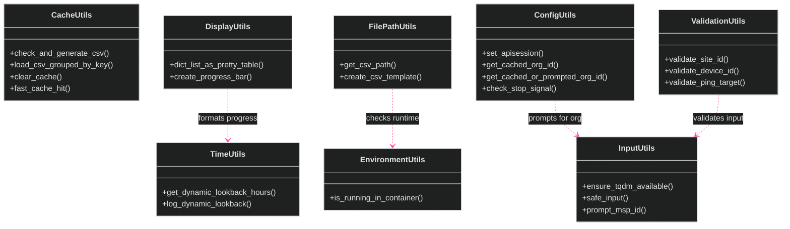
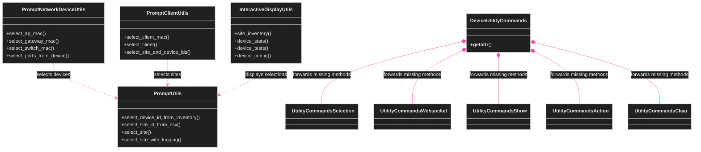
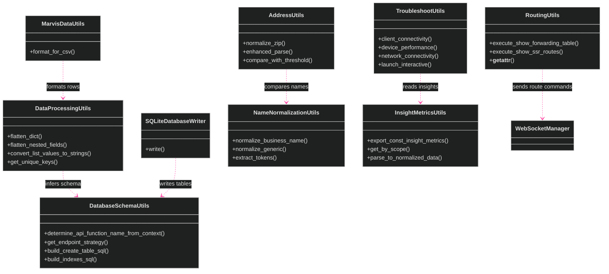
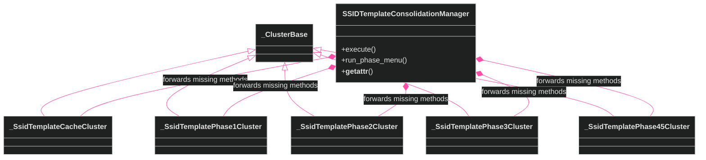

[<- Back to Diagram Index](../README.md) | [<- Back to Overview](overview.md)

# Utility and Data Processing Classes

The current tree has 31 classes with names that end in `Utils`.
Several large utility classes use helper clusters and `__getattr__`.
That pattern keeps the public surface stable without wrapper methods.

## Core Utility Classes

## Prompt, Device, and Cluster-Forwarding Utilities

## Data Processing and Routing Utilities

## SSID Consolidation Cluster Pattern

## Siblings

- [Infrastructure](infrastructure.md) - Core and API fetching classes
- [Exporters](exporters.md) - Data export class families
- [Managers](managers.md) - Manager classes
