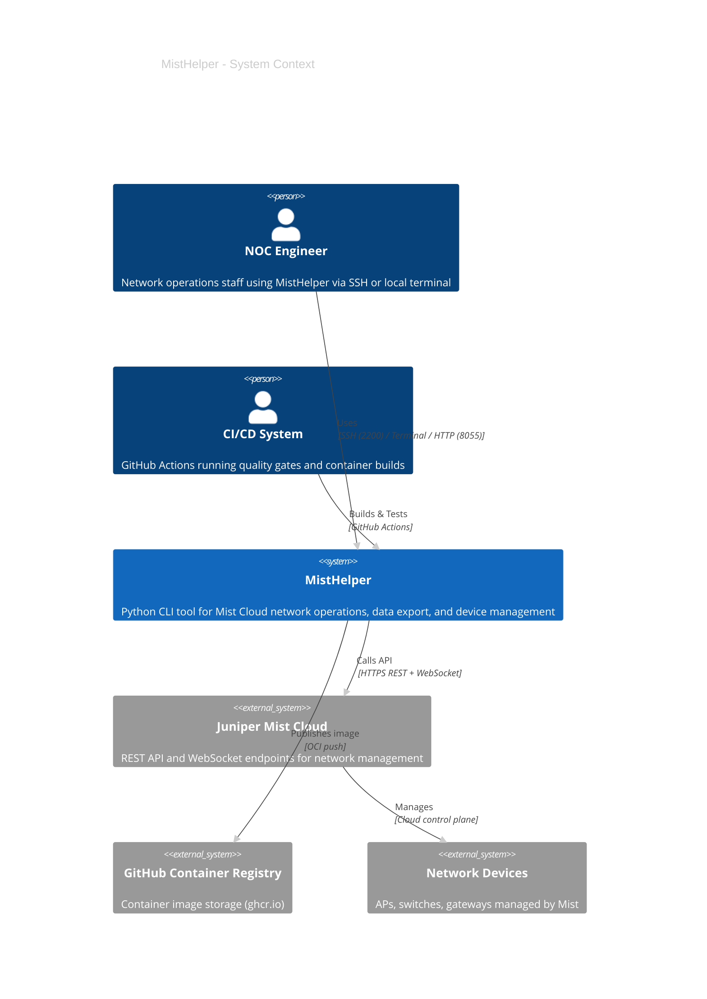

[<- Back to Diagram Index](../README.md)

# Architecture Overview

System-level context and internal component relationships for MistHelper.

## System Context (C4)

Who interacts with MistHelper and what external systems does it depend on?

## Internal Architecture

How MistHelper's subsystems connect and interact internally.

> **PNG fallback**: If the architecture-beta diagram does not render, see [architecture-overview.png](architecture-overview.png).

## Key Subsystems

| Subsystem | Primary Classes | Purpose |
|-----------|----------------|---------|
| Menu System | `OperationRegistry`, `MistHelperTUI` | 159-operation interactive/CLI menu |
| API Layer | `APIFetchUtils`, `RateLimitingUtils` | Paginated API calls with adaptive rate limiting |
| Data Exporters | `DataExporter`, `SQLiteDatabaseWriter` | Dual CSV/SQLite output with business keys |
| WebSocket | `WebSocketManager`, `WebSocketCommands` | Real-time device commands |
| SSH Runner | `EnhancedSSHRunner`, `SSHRunnerManager` | Paramiko-based device command execution |
| Packet Capture | `PacketCaptureManager` | Site and org-level packet captures |
| Container | Non-root user, ForceCommand SSH | Isolated session management |
| Web Portal | Gunicorn on port 8055 | Browser-based UI for operations |

---

## Related Diagrams

- [Data Pipeline](data-pipeline.md) - How data flows from menu selection to output
- [Database Strategy](database-strategy.md) - Hybrid PK system for data persistence
- [Container Architecture](../infrastructure/container-architecture.md) - Container internals and SSH isolation
- [Class Hierarchy Overview](../class-hierarchy/overview.md) - All 99+ classes organized by family
