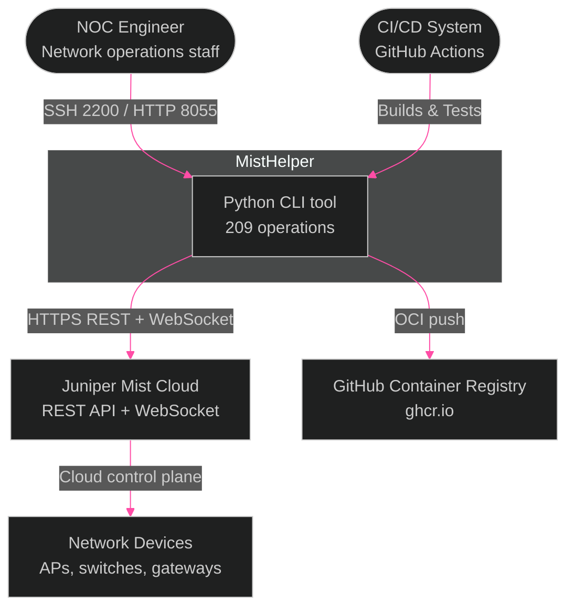
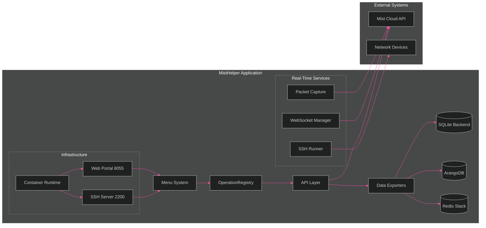
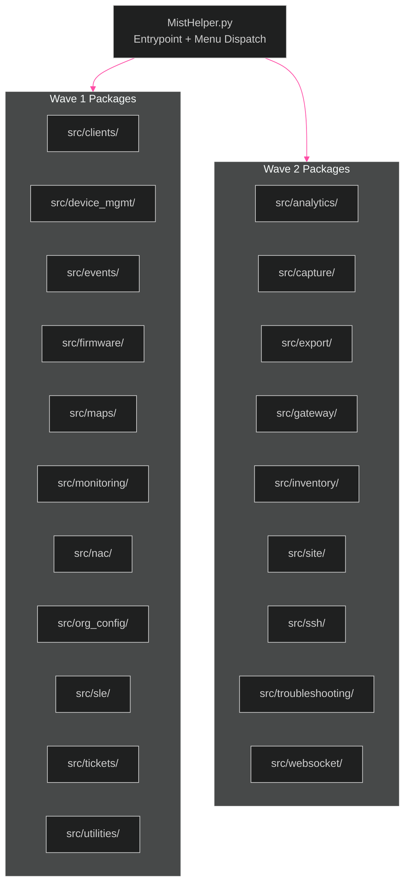

[<- Back to Diagram Index](../README.md)

# Architecture Overview

System-level context and internal component relationships for MistHelper.

## System Context (C4)

Who interacts with MistHelper and what external systems does it depend on?

## Internal Architecture

How MistHelper's subsystems connect and interact internally.

> **PNG fallback**: If this diagram does not render, see [architecture-overview.png](architecture-overview.png).

## Module Decomposition (`src/`)

Feature-domain packages extracted from `MistHelper.py` during Wave 1 and Wave 2
decomposition. Each package owns its classes and delegates back to the entrypoint
only for shared state (session, config, output routing).

| Package | Primary Classes | Menu Ops |
|---------|----------------|----------|
| `src/analytics/` | `ZoneConfigurationAnalyzer`, `SiteInventoryHealthAnalyzer`, `SiteAnalyticsConfigurator` | 7, 77-79, 169 |
| `src/capture/` | `PacketCaptureManager`, `PacketCaptureDownloadManager` | 134-135 |
| `src/clients/` | `WirelessClientExporter`, `WiredClientExporter`, `WANClientExporter` | 27-30 |
| `src/device_mgmt/` | `DeviceManagementUtils`, `DeviceConfigManager` | 128-133, 148 |
| `src/events/` | `EventExporter`, `AlarmExporter` | 20-26 |
| `src/export/` | `SiteExportUtils`, `SiteInsightsExporter` | 60-96 |
| `src/firmware/` | `FirmwareManager` | 154-157 |
| `src/gateway/` | `GatewayExportUtils`, `GatewayStatsExporter`, `WAN2MigrationManager` | 31-50, 104-111, 149, 167 |
| `src/inventory/` | `OrgDeviceInventorySummaryCore`, `OrgDeviceInventoryMSPOrchestrator` | 8-9, 13-14 |
| `src/monitoring/` | `ContinuousMonitor` | 151-152 |
| `src/site/` | `SiteConfigManager` | 171-174 |
| `src/sle/` | `SLEExporter` | 51-55 |
| `src/ssh/` | `EnhancedSSHRunner`, `SSHRunnerManager` | 175-176 |
| `src/tickets/` | `OrgTicketManager` | 188-193 |
| `src/troubleshooting/` | `MarvisTroubleshootUtils` | 124-127, 139 |
| `src/websocket/` | `WebSocketManager`, `ServicePingManager` | 102-123 |

## Key Subsystems

| Subsystem | Primary Classes | Purpose |
|-----------|----------------|---------|
| Menu System | `OperationRegistry`, `MistHelperTUI` | 193-operation interactive/CLI menu |
| API Layer | `APIFetchUtils`, `RateLimitingUtils` | Paginated API calls with adaptive rate limiting |
| Data Exporters | `DataExporter`, `SQLiteDatabaseWriter`, `DatabaseRouter` | Multi-backend output (CSV/SQLite/ArangoDB/Redis) with business keys |
| WebSocket | `WebSocketManager`, `WebSocketCommands`, `ServicePingManager` | Real-time device commands plus extracted service-ping orchestration |
| SSH Runner | `EnhancedSSHRunner`, `SSHRunnerManager` | Paramiko-based device command execution |
| Packet Capture | `PacketCaptureManager`, `PacketCaptureDownloadManager` | Site/org packet captures with extracted poll/download handling |
| Container | Non-root user, ForceCommand SSH | Isolated session management |
| Web Portal | Gunicorn on port 8055 | Browser-based UI for operations |

---

## Related Diagrams

- [Data Pipeline](data-pipeline.md) - How data flows from menu selection to output
- [Database Strategy](database-strategy.md) - Hybrid PK system for data persistence
- [Container Architecture](../infrastructure/container-architecture.md) - Container internals and SSH isolation
- [Class Hierarchy Overview](../class-hierarchy/overview.md) - All 99+ classes organized by family
