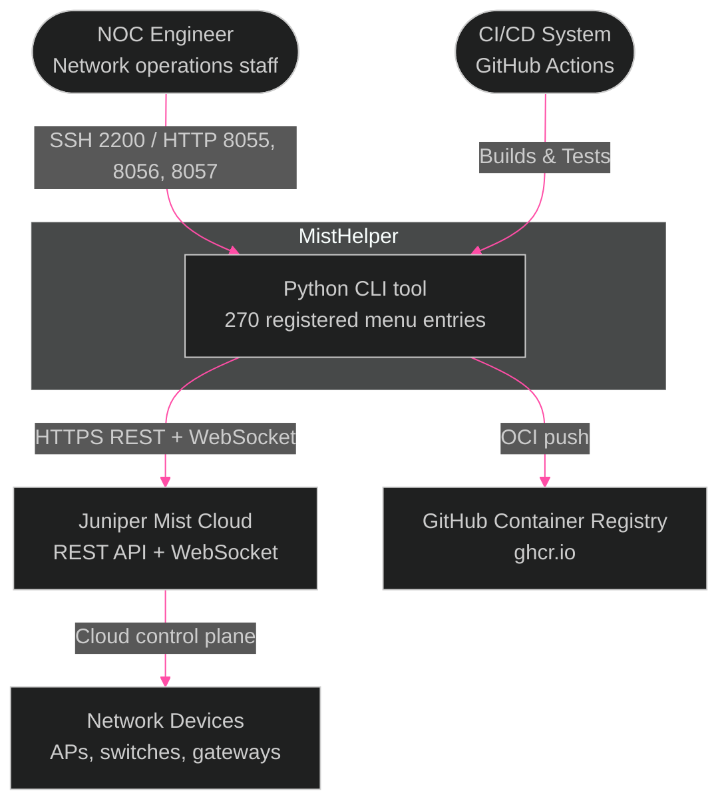
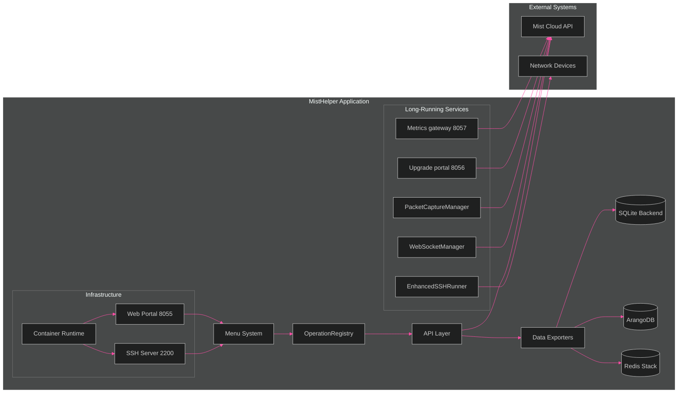
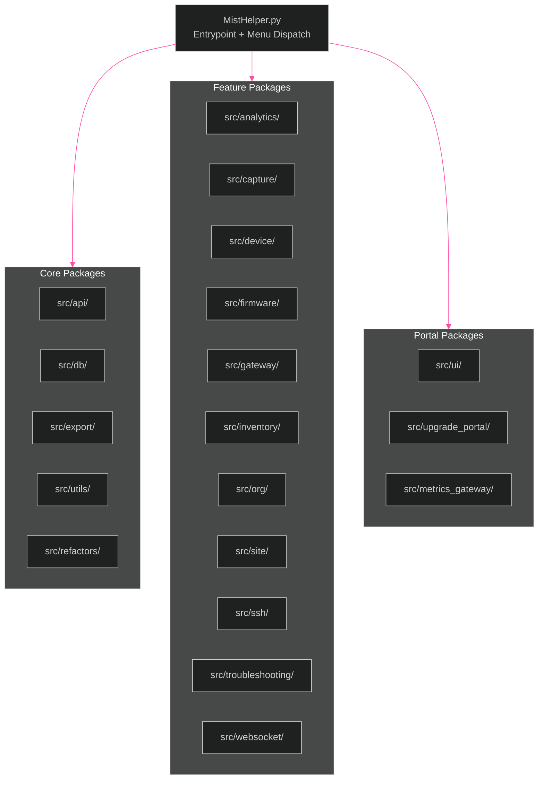

[<- Back to Diagram Index](../README.md)

# Architecture Overview

System-level context and internal component relationships for MistHelper.

## System Context (C4)

Who interacts with MistHelper and what external systems does it depend on?

## Internal Architecture

How MistHelper's subsystems connect and interact internally.

> **PNG fallback**: If this diagram does not render, see [architecture-overview.png](architecture-overview.png).

## Module Decomposition (`src/`)

Feature-domain packages now hold most runtime code. `MistHelper.py` remains the
entrypoint and menu dispatch surface.

| Package | Primary Classes | Menu Ops |
|---------|----------------|----------|
| `src/analytics/` | `ZoneConfigurationAnalyzer`, `SiteInventoryHealthAnalyzer`, `SiteAnalyticsConfigurator` | 7, 77-79, 169 |
| `src/capture/` | `PacketCaptureManager`, `PacketCaptureDownloadManager` | 134-135 |
| `src/db/` | `DatabaseRouter`, `ArangoDBWriter`, `RedisTimeSeriesWriter`, `RedisJSONWriter` | Output backends |
| `src/device/` | Device utility modules | 128-133, 148, 207-208 |
| `src/export/` | `SiteExportUtils`, `SiteInsightsExporter` | 60-96 |
| `src/firmware/` | `FirmwareManager` | 153-157, 239 |
| `src/gateway/` | `GatewayExportUtils`, `GatewayStatsExporter`, `WAN2MigrationManager` | 31-50, 104-111, 149, 167 |
| `src/inventory/` | `OrgDeviceInventorySummaryCore`, `OrgDeviceInventoryMSPOrchestrator` | 8-9, 13-14 |
| `src/site/` | `SiteConfigManager` | 171-174 |
| `src/sle/` | `SLEExporter` | 51-55 |
| `src/ssh/` | `EnhancedSSHRunner`, `SSHRunnerManager` | 175-176 |
| `src/org/` | `OrgTicketManager` | 188-193 |
| `src/troubleshooting/` | `MarvisTroubleshootUtils` | 124-127, 139 |
| `src/websocket/` | `WebSocketManager`, `ServicePingManager` | 102-123 |
| `src/metrics_gateway/` | `MistMetricsCollector`, `PrometheusRenderer`, `SnmpPassPersistResponder` | 241 |
| `src/upgrade_portal/` | Upgrade portal modules | 239 |

## Key Subsystems

| Subsystem | Primary Classes | Purpose |
|-----------|----------------|---------|
| Menu System | `OperationRegistry`, `MistHelperTUI` | 270 registered entries, with no menu 152 |
| API Layer | `APIFetchUtils`, `RateLimitingUtils` | Paginated API calls with adaptive rate limiting |
| Data Exporters | `DataExporter`, `SQLiteDatabaseWriter`, `DatabaseRouter` | CSV, SQLite, ArangoDB, Redis JSON, and Redis TimeSeries output |
| WebSocket | `WebSocketManager`, `WebSocketCommands`, `ServicePingManager` | Real-time device commands plus extracted service-ping orchestration |
| SSH Runner | `EnhancedSSHRunner`, `SSHRunnerManager` | Paramiko-based device command execution |
| Packet Capture | `PacketCaptureManager`, `PacketCaptureDownloadManager` | Site/org packet captures with extracted poll/download handling |
| Container | Non-root user, ForceCommand SSH | Isolated session management |
| Web Portal | Gunicorn on port 8055 | Browser UI for operations |
| Upgrade Portal | `src/upgrade_portal/` on port 8056 | Pre-check, upgrade, and post-check capture workflow |
| Metrics Gateway | `src/metrics_gateway/` on port 8057 | Prometheus and SNMP monitoring output |

---

## Related Diagrams

- [Data Pipeline](data-pipeline.md) - How data flows from menu selection to output
- [Database Strategy](database-strategy.md) - Hybrid PK system for data persistence
- [Container Architecture](../infrastructure/container-architecture.md) - Container internals and SSH isolation
- [Class Hierarchy Overview](../class-hierarchy/overview.md) - Class families and dependencies
