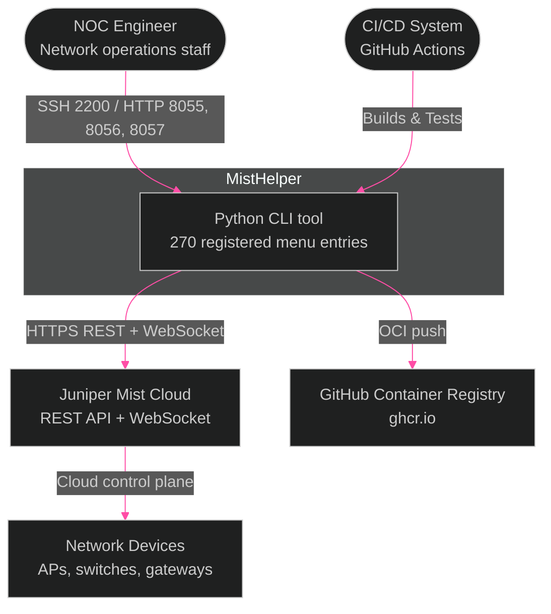
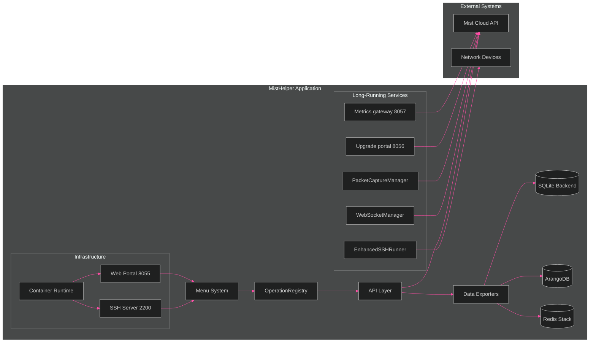
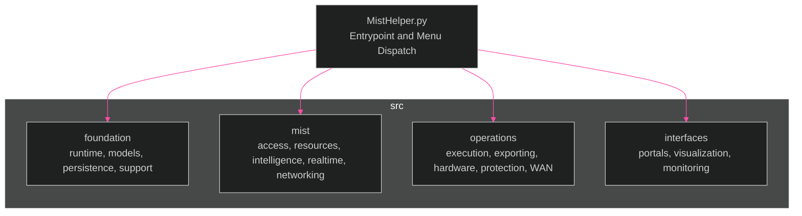

[<- Back to Diagram Index](../README.md)

# Architecture Overview

System-level context and internal component relationships for MistHelper.

## System Context (C4)

Who interacts with MistHelper and what external systems does it depend on?

```mermaid
%%{init: {'theme': 'dark', 'themeVariables': {
  'primaryColor': '#E20074',
  'primaryTextColor': '#E0E0E0',
  'primaryBorderColor': '#99004D',
  'lineColor': '#FF4DA6',
  'secondaryColor': '#16213E',
  'tertiaryColor': '#1A1A2E',
  'fontFamily': 'ui-monospace, monospace'
}}}%%
flowchart TB
    noc_engineer(["NOC Engineer<br/>Network operations staff"])
    ci_system(["CI/CD System<br/>GitHub Actions"])

    subgraph misthelper["MistHelper"]
        mh["Python CLI tool<br/>270 registered menu entries"]
    end

    mist_cloud["Juniper Mist Cloud<br/>REST API + WebSocket"]
    ghcr["GitHub Container Registry<br/>ghcr.io"]
    network_devices["Network Devices<br/>APs, switches, gateways"]

    noc_engineer -->|"SSH 2200 / HTTP 8055, 8056, 8057"| mh
    ci_system -->|"Builds & Tests"| mh
    mh -->|"HTTPS REST + WebSocket"| mist_cloud
    mh -->|"OCI push"| ghcr
    mist_cloud -->|"Cloud control plane"| network_devices
```

## Internal Architecture

How MistHelper's subsystems connect and interact internally.

```mermaid
%%{init: {'theme': 'dark', 'themeVariables': {
  'primaryColor': '#E20074',
  'primaryTextColor': '#E0E0E0',
  'primaryBorderColor': '#99004D',
  'lineColor': '#FF4DA6',
  'secondaryColor': '#16213E',
  'tertiaryColor': '#1A1A2E',
  'fontFamily': 'ui-monospace, monospace'
}}}%%
flowchart LR
    subgraph misthelper["MistHelper Application"]
        menu["Menu System"]
        registry["OperationRegistry"]
        api["API Layer"]
        exporters["Data Exporters"]
        db[("SQLite Backend")]
        arango[("ArangoDB")]
        redis[("Redis Stack")]

        subgraph services["Long-Running Services"]
            websocket["WebSocketManager"]
            ssh_runner["EnhancedSSHRunner"]
            pcap["PacketCaptureManager"]
            capture_portal["Upgrade portal 8056"]
            metrics_gateway["Metrics gateway 8057"]
        end

        subgraph infra["Infrastructure"]
            container["Container Runtime"]
            web_portal["Web Portal 8055"]
            ssh_server["SSH Server 2200"]
        end
    end

    subgraph external["External Systems"]
        mist_api["Mist Cloud API"]
        devices["Network Devices"]
    end

    menu --> registry --> api --> exporters --> db
    exporters --> arango
    exporters --> redis
    api --> mist_api
    websocket --> mist_api
    ssh_runner --> devices
    pcap --> mist_api
    capture_portal --> mist_api
    metrics_gateway --> mist_api
    ssh_server --> menu
    web_portal --> menu
    container --> ssh_server
    container --> web_portal
```

> **Beta diagram type**: this diagram uses `architecture-beta`. A viewer without beta
> support does not render it. Open this page on GitHub.

## Module Decomposition (`src/`)

Four domain packages now hold the runtime code. `MistHelper.py` remains the
entrypoint and menu dispatch surface.

```mermaid
%%{init: {'theme': 'dark', 'themeVariables': {
  'primaryColor': '#E20074',
  'primaryTextColor': '#E0E0E0',
  'primaryBorderColor': '#99004D',
  'lineColor': '#FF4DA6',
  'secondaryColor': '#16213E',
  'tertiaryColor': '#1A1A2E',
  'fontFamily': 'ui-monospace, monospace'
}}}%%
flowchart TD
    entrypoint["MistHelper.py<br/>Entrypoint and Menu Dispatch"]

    subgraph source["src"]
        foundation["foundation<br/>runtime, models, persistence, support"]
        mist["mist<br/>access, resources, intelligence, realtime, networking"]
        operations["operations<br/>execution, exporting, hardware, protection, WAN"]
        interfaces["interfaces<br/>portals, visualization, monitoring"]
    end

    entrypoint --> foundation
    entrypoint --> mist
    entrypoint --> operations
    entrypoint --> interfaces
```

| Package | Primary Classes | Menu Ops |
|---------|----------------|----------|
| `src/mist/intelligence/analytics/` | `ZoneConfigurationAnalyzer`, `SiteInventoryHealthAnalyzer`, `SiteAnalyticsConfigurator` | 7, 77-79, 169 |
| `src/operations/execution/capture/` | `PacketCaptureManager`, `PacketCaptureDownloadManager` | 134-135 |
| `src/foundation/persistence/db/` | `DatabaseRouter`, `ArangoDBWriter`, `RedisTimeSeriesWriter`, `RedisJSONWriter` | Output backends |
| `src/mist/resources/device/` | Device utility modules | 128-133, 148, 207-208 |
| `src/operations/exporting/export/` | `SiteExportUtils`, `SiteInsightsExporter` | 60-96 |
| `src/operations/execution/firmware/` | `FirmwareManager` | 153-157, 239 |
| `src/mist/resources/gateway/` | `GatewayExportUtils`, `GatewayStatsExporter`, `WAN2MigrationManager` | 31-50, 104-111, 149, 167 |
| `src/mist/resources/inventory/` | `OrgDeviceInventorySummaryCore`, `OrgDeviceInventoryMSPOrchestrator` | 8-9, 13-14 |
| `src/mist/resources/site/` | `SiteConfigManager` | 171-174 |
| `src/sle/` | `SLEExporter` | 51-55 |
| `src/operations/execution/ssh/` | `EnhancedSSHRunner`, `SSHRunnerManager` | 175-176 |
| `src/mist/resources/org/` | `OrgTicketManager` | 188-193 |
| `src/mist/intelligence/troubleshooting/` | `MarvisTroubleshootUtils` | 124-127, 139 |
| `src/mist/realtime/websocket/` | `WebSocketManager`, `ServicePingManager` | 102-123 |
| `src/interfaces/monitoring/metrics_gateway/` | `MistMetricsCollector`, `PrometheusRenderer`, `SnmpPassPersistResponder` | 241 |
| `src/interfaces/portals/upgrade_portal/` | Upgrade portal modules | 239 |

## Key Subsystems

| Subsystem | Primary Classes | Purpose |
|-----------|----------------|---------|
| Menu System | `OperationRegistry`, `MistHelperTUI` | 270 registered entries, with no menu 152 |
| API Layer | `APIFetchUtils`, `RateLimitingUtils` | Paginated API calls with adaptive rate limiting |
| Data Exporters | `DataExporter`, `SQLiteDatabaseWriter`, `DatabaseRouter` | CSV, SQLite, ArangoDB, Redis JSON, and Redis TimeSeries output |
| WebSocket | `WebSocketManager`, `WebSocketCommands`, `ServicePingManager` | Real-time device commands plus extracted service-ping orchestration |
| SSH Runner | `EnhancedSSHRunner`, `SSHRunnerManager` | Paramiko-based device command execution |
| Packet Capture | `PacketCaptureManager`, `PacketCaptureDownloadManager` | Site/org packet captures with extracted poll/download handling |
| Container | Non-root user, ForceCommand SSH | Isolated session management |
| Web Portal | Gunicorn on port 8055 | Browser UI for operations |
| Upgrade Portal | `src/interfaces/portals/upgrade_portal/` on port 8056 | Pre-check, upgrade, and post-check capture workflow |
| Metrics Gateway | `src/interfaces/monitoring/metrics_gateway/` on port 8057 | Prometheus and SNMP monitoring output |

---

## Related Diagrams

- [Data Pipeline](data-pipeline.md) - How data flows from menu selection to output
- [Database Strategy](database-strategy.md) - Hybrid PK system for data persistence
- [Container Architecture](../infrastructure/container-architecture.md) - Container internals and SSH isolation
- [Class Hierarchy Overview](../class-hierarchy/overview.md) - Class families and dependencies
