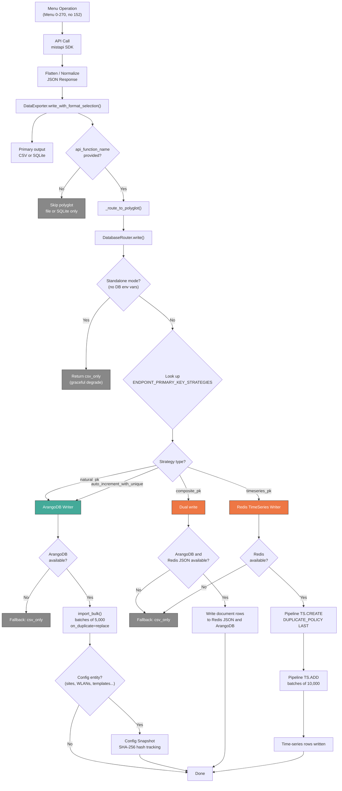

# Data Persistence Routing

## Decision Tree

How MistHelper routes data to the appropriate storage backend based on
the primary key strategy defined in `ENDPOINT_PRIMARY_KEY_STRATEGIES`.

## Strategy Routing Summary

| Strategy Type | Backend | Use Case | Examples |
| - | - | - | - |
| `natural_pk` | ArangoDB | Entities with stable UUIDs | Sites, Inventory, Templates |
| `auto_increment_with_unique` | ArangoDB | Aggregated data without stable keys | Licenses summary |
| `composite_pk` | ArangoDB and Redis JSON | Event and log rows | Device events, alarms |
| `timeseries_pk` | Redis TimeSeries | Numeric metric rows | Device stats, client stats |

## Key Files

| File | Role |
| - | - |
| `src/refactors/endpoint_primary_key_strategies.py` | `ENDPOINT_PRIMARY_KEY_STRATEGIES` dict |
| `src/export/data_exporter.py` | `DataExporter.write_with_format_selection()`, `_route_to_polyglot()` |
| `src/db/router.py` | `DatabaseRouter` — strategy lookup and backend dispatch |
| `src/db/arango_writer.py` | `ArangoDBWriter` — batch `import_bulk()`, snapshots, graph edges |
| `src/db/redis_writer.py` | `RedisTimeSeriesWriter` and `RedisJSONWriter` |
| `src/db/__init__.py` | `DatabaseConfig`, `WriteResult`, shared logger |
