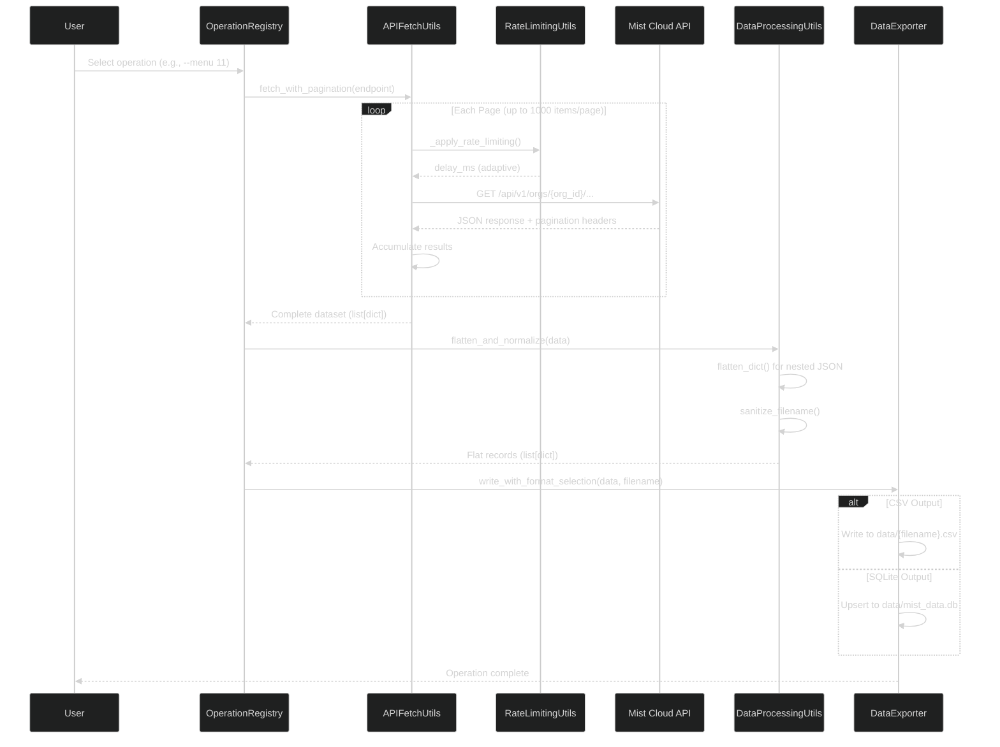
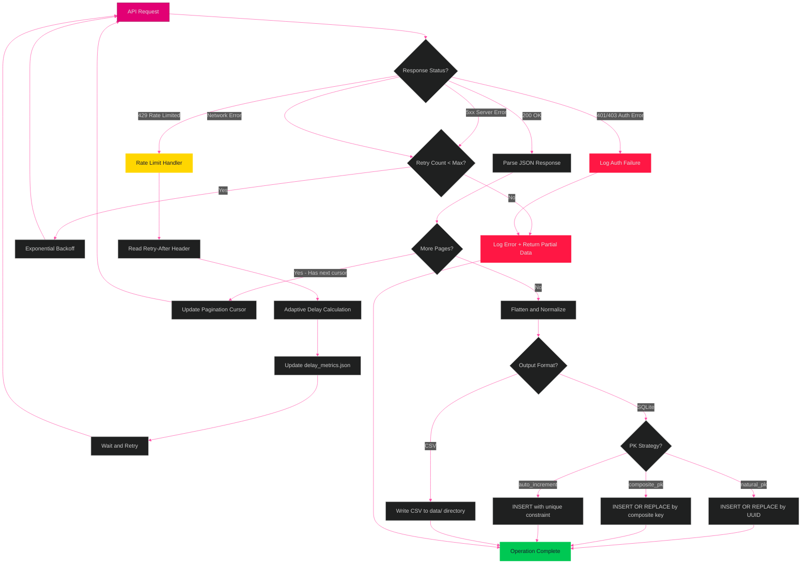

[<- Back to Diagram Index](../README.md)

# Data Pipeline

Traces the complete data flow from menu selection through API calls, pagination, rate limiting, data transformation, to dual-format output (CSV/SQLite).

## Happy-Path Sequence

How a typical data extraction operation flows through MistHelper's class chain.

## Error Handling and Recovery

Decision flowchart showing how MistHelper handles API errors, rate limits, and output failures.

## Key Classes in the Pipeline

| Stage | Class | Key Method |
|-------|-------|------------|
| Entry Point | `OperationRegistry` | Dispatches menu selection to handler |
| API Calls | `APIFetchUtils` | `fetch_with_pagination()` |
| Rate Limiting | `RateLimitingUtils` | `_apply_rate_limiting()` with PID-like control |
| Data Transform | `DataProcessingUtils` | `flatten_dict()`, `sanitize_filename()` |
| CSV Output | `DataExporter` | `write_with_format_selection()` |
| SQLite Output | `SQLiteDatabaseWriter` | `upsert_records()` with PK strategies |

---

## Related Diagrams

- [Architecture Overview](architecture-overview.md) - System-level component map
- [Database Strategy](database-strategy.md) - PK strategy details for SQLite upserts
- [Operations Reference](../operations/operations-reference.md) - Operation lifecycle states
- [Class Hierarchy: Utilities](../class-hierarchy/utilities.md) - DataProcessingUtils detail
