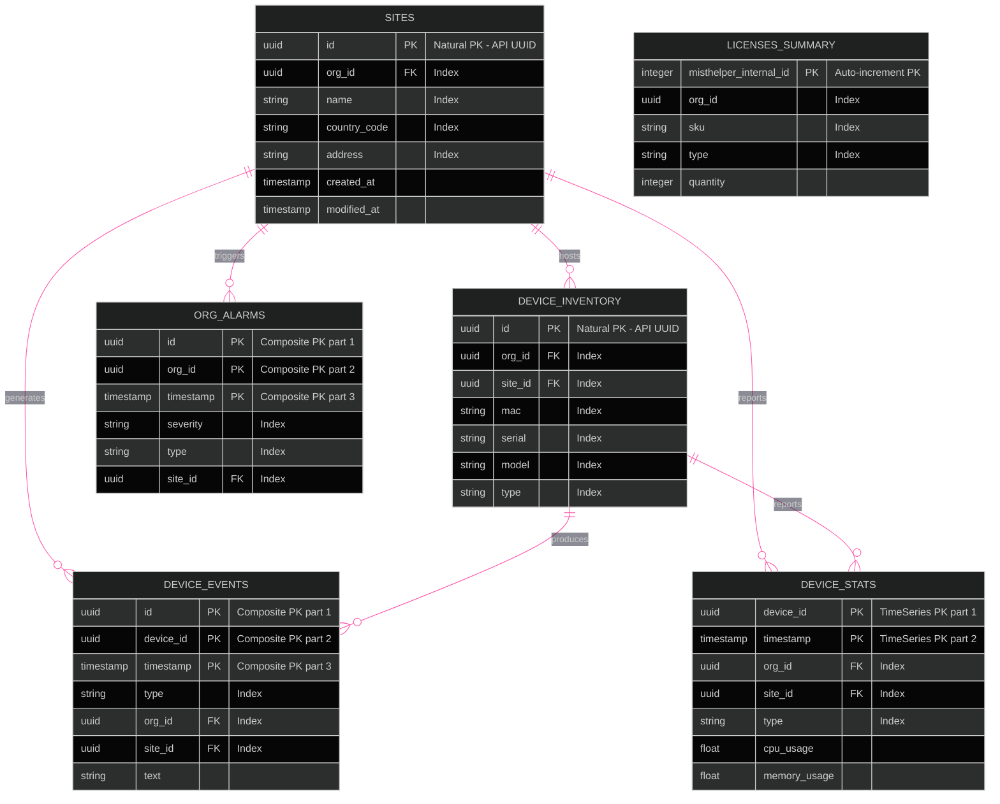
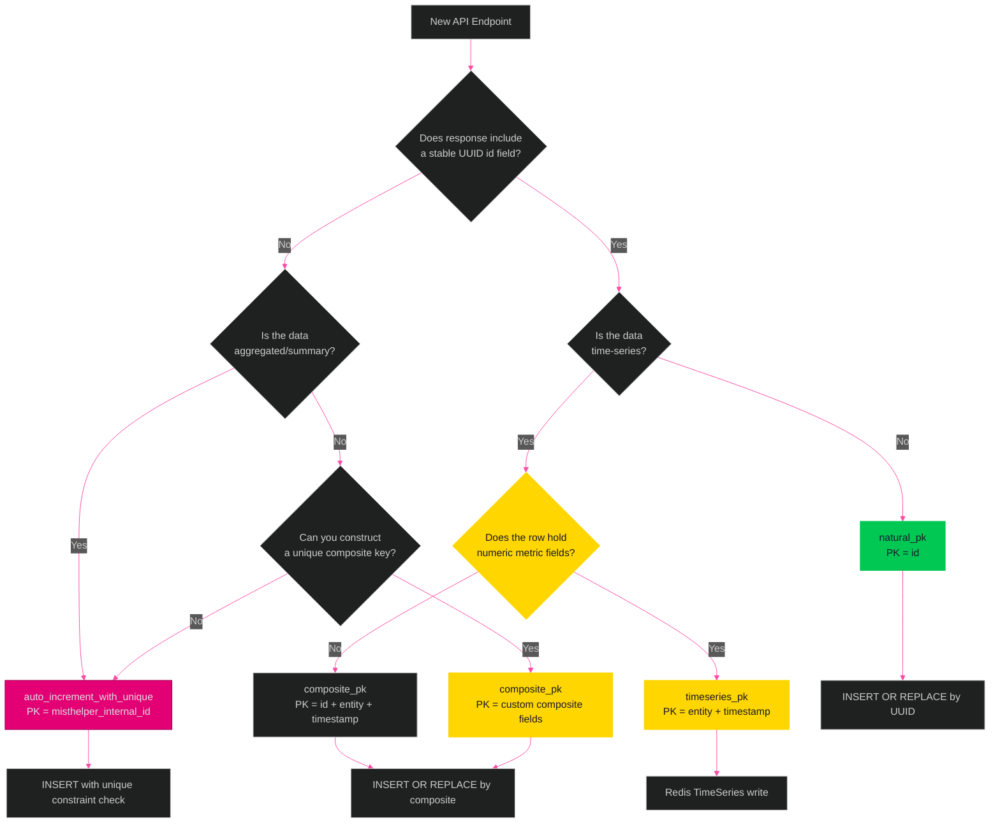

[<- Back to Diagram Index](../README.md)

# Database Strategy

Hybrid primary key system and strategy decision flowchart for MistHelper storage backends.

## Entity Relationship Diagram

Representative tables show the strategy types used across 270 registered menu entries.

## PK Strategy Decision Tree

How to choose the right primary key strategy when adding a new operation.

## Strategy Examples

| API Endpoint | PK Type | Primary Key | Use Case |
|-------------|---------|-------------|----------|
| `listOrgSites` | `natural_pk` | `[id]` | Sites have stable UUIDs |
| `searchOrgDeviceEvents` | `composite_pk` | `[id, device_id, timestamp]` | Time-series event data |
| `listOrgDevicesStats` | `timeseries_pk` | `[device_id, timestamp]` | Periodic device statistics |
| `searchOrgAlarms` | `composite_pk` | `[id, org_id, timestamp]` | Time-stamped alarm records |
| `getOrgLicensesSummary` | `auto_increment_with_unique` | `[misthelper_internal_id]` | Aggregated summary without stable ID |

---

## Related Diagrams

- [Data Pipeline](data-pipeline.md) - Output paths with PK strategy selection
- [Data Persistence Routing](data-persistence-routing.md) - Polyglot routing decision tree (ArangoDB/Redis)
- [Architecture Overview](architecture-overview.md) - Database backends in system context
- [Class Hierarchy: Utilities](../class-hierarchy/utilities.md) - DatabaseSchemaUtils and SQLiteDatabaseWriter

## Source of Truth

`src/refactors/endpoint_primary_key_strategies.py` holds the
`ENDPOINT_PRIMARY_KEY_STRATEGIES` dictionary. `src/db/router.py` maps
`natural_pk` and `auto_increment_with_unique` to ArangoDB, `composite_pk` to
ArangoDB plus Redis JSON, and `timeseries_pk` to Redis TimeSeries.
