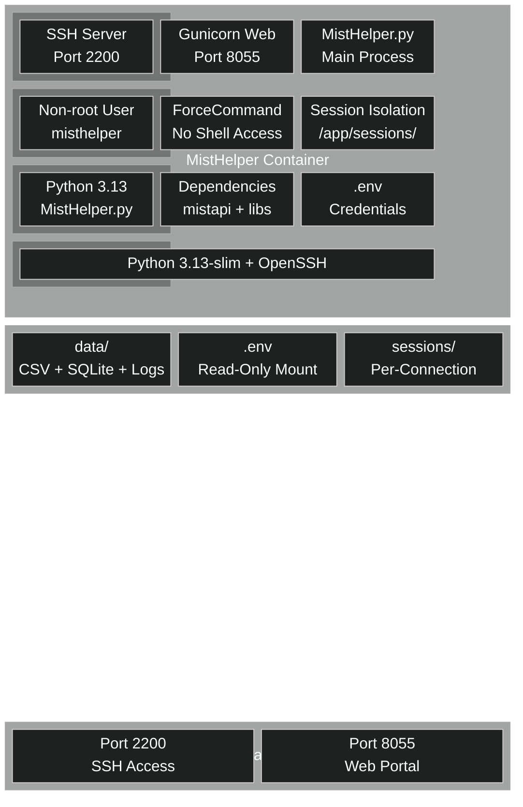

[<- Back to Diagram Index](../README.md)

# Container Architecture

Container layers, session isolation, and external access paths for MistHelper's containerized deployment.

## Container Layers

Internal structure of the MistHelper container from base image to running services.

> **PNG fallback**: If the block-beta diagram does not render, see [container-architecture.png](container-architecture.png).

## External Access Architecture

How NOC engineers reach MistHelper through SSH and HTTP paths.

## Session Isolation Model

Each SSH connection gets its own isolated session directory.

| Component | Path | Purpose |
|-----------|------|---------|
| Session Directory | `/app/sessions/session_{id}/` | Per-connection isolation |
| Data Volume | `/app/data/` | Shared CSV/SQLite output |
| SSH Config | `/etc/ssh/sshd_config` | ForceCommand, port 2200 |
| Web Server | `0.0.0.0:8055` | Gunicorn with workers |
| Credentials | `/app/.env` | Read-only mounted secrets |

---

## Related Diagrams

- [Architecture Overview](../core/architecture-overview.md) - Container in system context
- [Deployment Pipeline](deployment-pipeline.md) - How container images get built and pushed
- [Network Protocols](network-protocols.md) - Packet structure for captures
