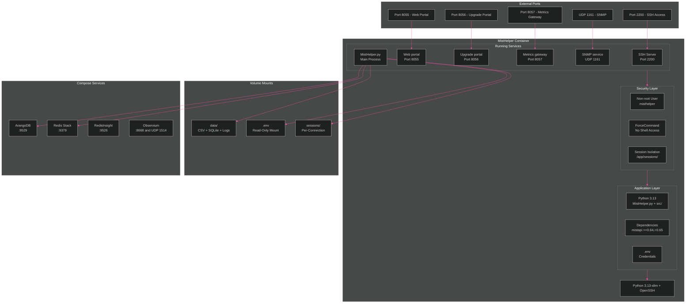
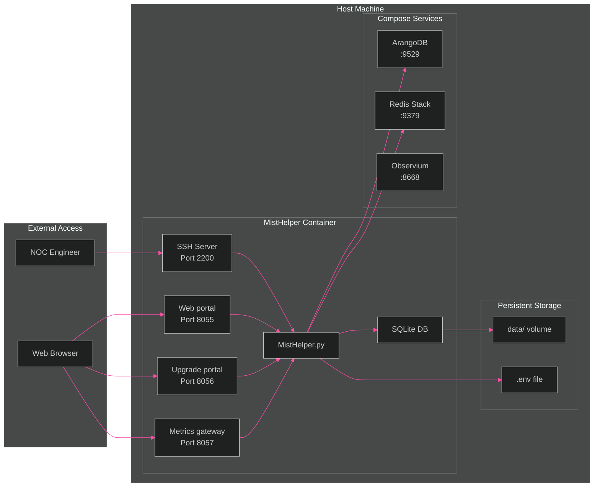

[<- Back to Diagram Index](../README.md)

# Container Architecture

Container layers, session isolation, and access paths for the compose deployment.

## Container Layers

Internal structure of the MistHelper container from base image to running services.

> **PNG fallback**: If this diagram does not render, see [container-architecture.png](container-architecture.png).

## External Access Architecture

How NOC engineers reach MistHelper through SSH and HTTP paths.

## Session Isolation Model

Each SSH connection gets its own isolated session directory.

Phase-9 decomposition note: packet capture runtime ownership is split between
`src/capture/packet_capture.py` (orchestration) and
`src/capture/packet_capture_download.py` (poll/download helpers), while
container entrypoint behavior remains unchanged.

| Component | Path | Purpose |
|-----------|------|---------|
| Session Directory | `/app/sessions/session_{id}/` | Per-connection isolation |
| Data Volume | `/app/data/` | Shared CSV/SQLite output |
| ArangoDB | `misthelper-arangodb:9529` | Document storage (optional polyglot backend) |
| Redis Stack | `misthelper-redis:9379` | Redis JSON and Redis TimeSeries backend |
| RedisInsight | `localhost:9526` | Redis browser from the Redis Stack image |
| Observium | `localhost:8668`, `localhost:1514/udp` | Optional monitoring profile |
| SSH Config | `/etc/ssh/sshd_config` | ForceCommand, port 2200 |
| Web Server | `0.0.0.0:8055` | Gunicorn with workers |
| Capture Portal | `0.0.0.0:8056` | Separate portal process for upgrade captures |
| Metrics Gateway | `0.0.0.0:8057` | Prometheus endpoint and SNMP data source |
| Credentials | `/app/.env` | Read-only mounted secrets |

---

## Related Diagrams

- [Architecture Overview](../core/architecture-overview.md) - Container in system context
- [Deployment Pipeline](deployment-pipeline.md) - How container images get built and pushed
- [Network Protocols](network-protocols.md) - Packet structure for captures
