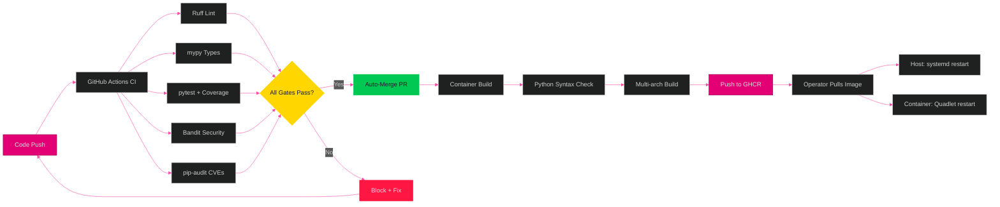

[<- Back to Diagram Index](../README.md)

# Deployment Pipeline

CI/CD quality gates, pipeline timing, and branching strategy for MistHelper.

## CI/CD Flow

From code change through quality gates to container deployment.



## Pipeline Timing

Approximate duration of each CI stage.

```mermaid
%%{init: {'theme': 'dark', 'themeVariables': {
  'primaryColor': '#E20074',
  'primaryTextColor': '#E0E0E0',
  'gridColor': '#16213E',
  'todayLineColor': '#FF1744'
}}}%%
gantt
    title CI/CD Pipeline Timing
    dateFormat X
    axisFormat %s sec

    section Quality Gates
        Ruff Lint           :a1, 0, 15
        mypy Type Check     :a2, 0, 30
        pytest + Coverage   :a3, 0, 60
        Bandit Security     :a4, 0, 20
        pip-audit CVEs      :a5, 0, 15
        Playwright E2E      :a6, 0, 90

    section Build
        Syntax Validation   :b1, after a3, 5
        Container Build     :b2, after b1, 120
        GHCR Push           :b3, after b2, 30

    section Deploy
        Operator Pull       :c1, after b3, 15
        Service Restart     :c2, after c1, 10
```



## Branching Strategy

How feature branches flow through the auto-merge pipeline.

```mermaid
%%{init: {'theme': 'dark', 'themeVariables': {
  'primaryColor': '#E20074',
  'primaryTextColor': '#E0E0E0',
  'primaryBorderColor': '#99004D',
  'lineColor': '#FF4DA6',
  'secondaryColor': '#16213E',
  'tertiaryColor': '#1A1A2E',
  'fontFamily': 'ui-monospace, monospace'
}}}%%
gitgraph
    commit id: "main"
    branch feature/new-operation
    checkout feature/new-operation
    commit id: "implement feature"
    commit id: "add tests"
    commit id: "update docs"
    checkout main
    merge feature/new-operation id: "auto-merge (CI green)" type: HIGHLIGHT
    commit id: "container build triggers"
    branch feature/firmware-fix
    checkout feature/firmware-fix
    commit id: "fix firmware logic"
    commit id: "add safety tests"
    checkout main
    merge feature/firmware-fix id: "auto-merge (CI green) " type: HIGHLIGHT
    commit id: "v25.06.15 tag" tag: "v25.06.15"
```

---

## Related Diagrams

- [Architecture Overview](../core/architecture-overview.md) - System context showing CI/CD as external actor
- [Container Architecture](container-architecture.md) - What gets deployed
- [Development Workflow](../operations/development-workflow.md) - SpecKit feature lifecycle
