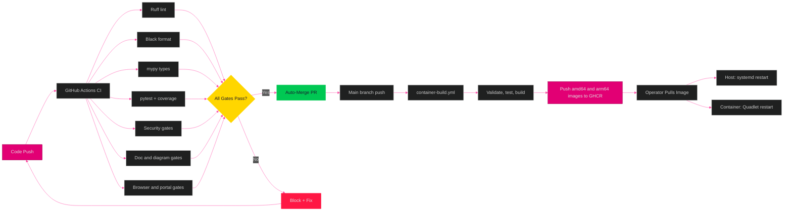
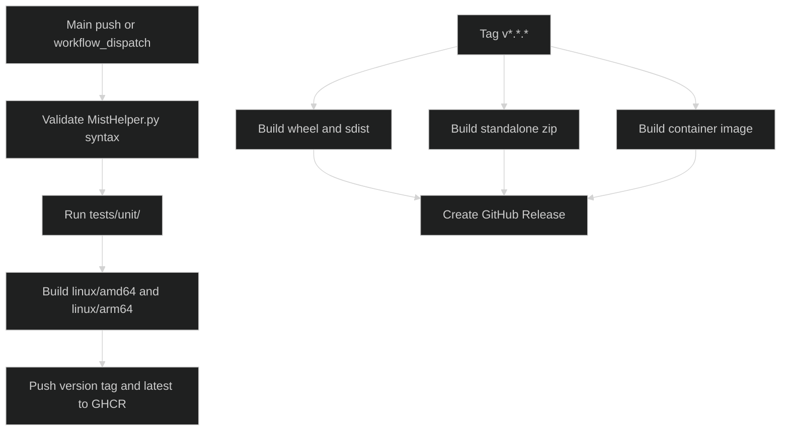
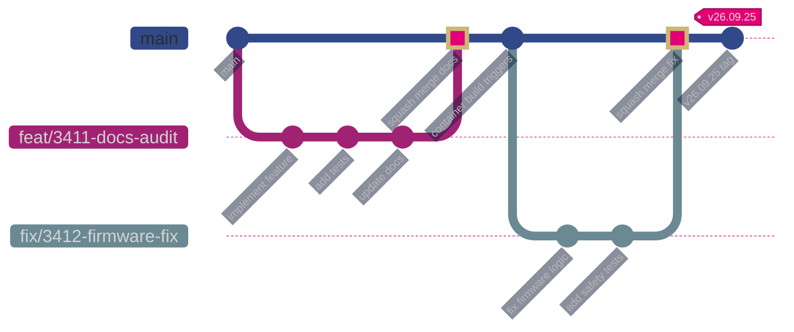

[<- Back to Diagram Index](../README.md)

# Deployment Pipeline

Quality gates, container publishing, and release artifacts for MistHelper.

## Quality Gate Flow

From code change through quality gates to a merge.

## Container and Release Jobs

The container workflow runs after a main push or a manual request. The release
workflow runs only for tags that match `v*.*.*`.

## Branching Strategy

How feature branches flow through the auto-merge pipeline.

---

## Related Diagrams

- [Architecture Overview](../core/architecture-overview.md) - System context showing CI/CD as external actor
- [Container Architecture](container-architecture.md) - What gets deployed
- [Development Workflow](../operations/development-workflow.md) - SpecKit feature lifecycle
