[<- Back to Diagram Index](../README.md)

# Network Protocols

Packet structure documentation for MistHelper's packet capture feature (Menu 9-10).

## Captured Packet Structure

Typical 802.11 frame structure captured by MistHelper's PacketCaptureManager.

```mermaid
%%{init: {'theme': 'dark', 'themeVariables': {
  'primaryColor': '#E20074',
  'primaryTextColor': '#E0E0E0',
  'primaryBorderColor': '#99004D',
  'lineColor': '#FF4DA6',
  'secondaryColor': '#16213E',
  'tertiaryColor': '#1A1A2E',
  'fontFamily': 'ui-monospace, monospace'
}}}%%
flowchart LR
    FC["Frame Control<br/>Bytes 0-1 (2B)"] --> DUR["Duration/ID<br/>Bytes 2-3 (2B)"]
    DUR --> A1["Address 1<br/>Dest (6B)"]
    A1 --> A2["Address 2<br/>Source (6B)"]
    A2 --> A3["Address 3<br/>BSSID (6B)"]
    A3 --> SEQ["Seq Control<br/>Bytes 22-23 (2B)"]
    SEQ --> BODY["Frame Body<br/>(variable)"]
    BODY --> FCS["FCS<br/>Bytes 32-35 (4B)"]
```

> **PNG fallback**: If this diagram does not render, see [network-protocols.png](network-protocols.png).

## Ethernet Frame (Switch Captures)

For switch port-specific captures using tcpdump filtering.

```mermaid
%%{init: {'theme': 'dark', 'themeVariables': {
  'primaryColor': '#E20074',
  'primaryTextColor': '#E0E0E0',
  'primaryBorderColor': '#99004D',
  'lineColor': '#FF4DA6',
  'secondaryColor': '#16213E',
  'tertiaryColor': '#1A1A2E',
  'fontFamily': 'ui-monospace, monospace'
}}}%%
flowchart LR
    DMAC["Dest MAC<br/>Bytes 0-5 (6B)"] --> SMAC["Src MAC<br/>Bytes 6-11 (6B)"]
    SMAC --> ET["EtherType<br/>Bytes 12-13 (2B)"]
    ET --> VLAN["VLAN Tag 802.1Q<br/>Bytes 14-17 (4B opt)"]
    VLAN --> IPH["IP Header<br/>Bytes 18-41 (20B)"]
    IPH --> TCPH["TCP/UDP Header<br/>Bytes 42-61 (20B)"]
    TCPH --> PL["Payload Start<br/>Byte 62+"]
```

## Capture Types Supported

| Capture Type | Menu | Target | Method |
|-------------|------|--------|--------|
| Wireless Client | 9, 10 | AP radio interface | Mist Cloud API |
| Wired Client | 9, 10 | Switch port | tcpdump filtering |
| Gateway | 9, 10 | Gateway interface | Mist Cloud API |
| Switch | 9, 10 | Switch port | Port-specific tcpdump |
| New Association | 9 | AP during client join | Mist Cloud API |
| Scan Radio | 9 | AP scanning radio | Mist Cloud API |

---

## Related Diagrams

- [Container Architecture](container-architecture.md) - Port mappings and access paths
- [Architecture Overview](../core/architecture-overview.md) - PacketCaptureManager in system context
- [Class Hierarchy: Managers](../class-hierarchy/managers.md) - PacketCaptureManager class detail
