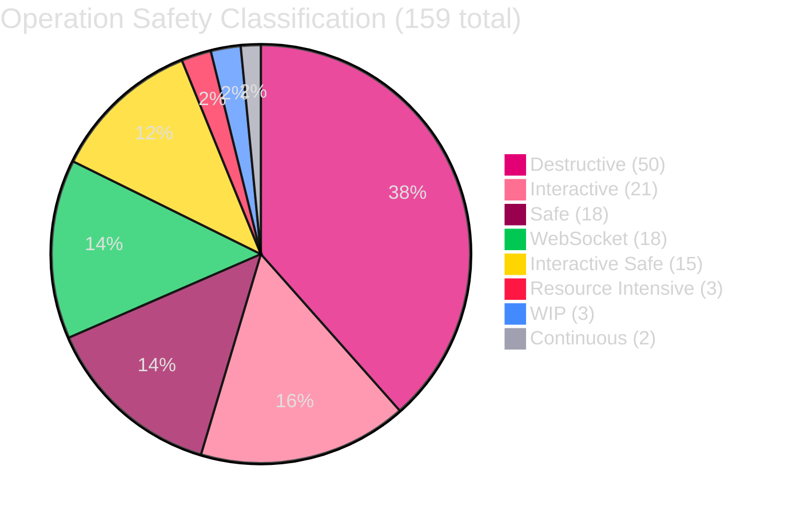
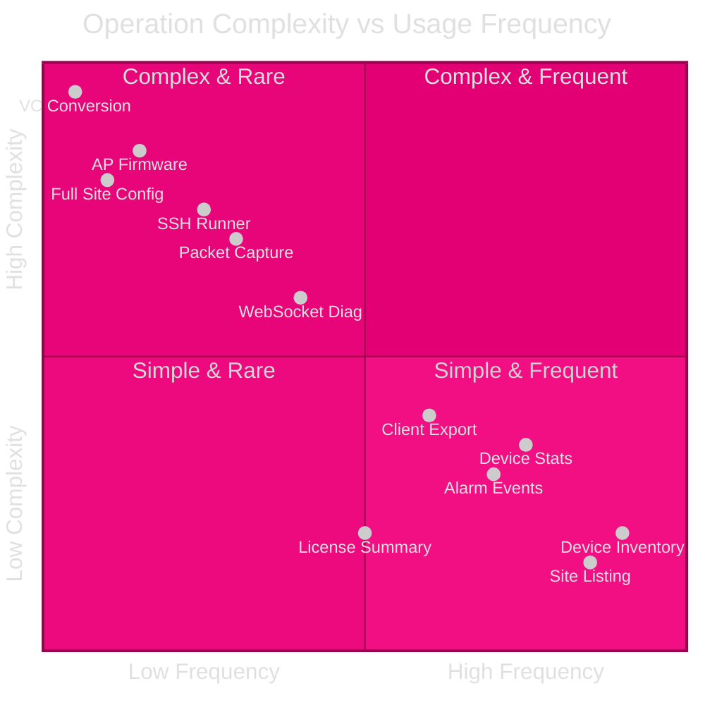
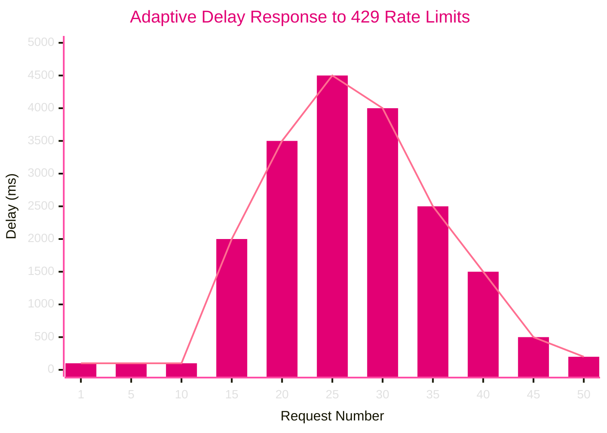
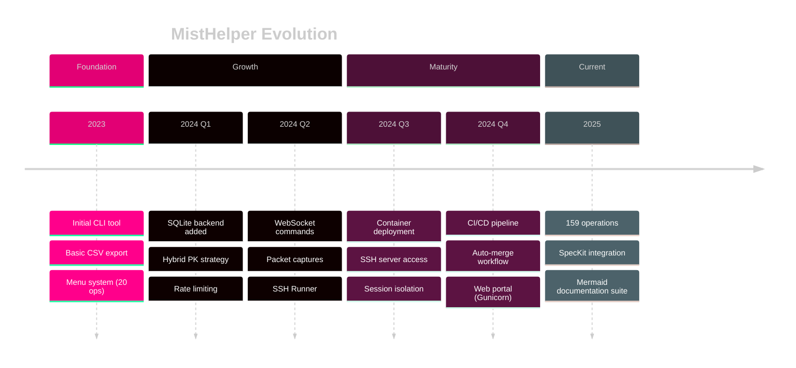

[<- Back to Diagram Index](../README.md)

# Metrics and Analytics

Operation distribution, rate limiting behavior, data flow volumes, and version history.

## Operation Category Distribution

How MistHelper's 159 operations break down by safety classification.



## Operation Complexity vs Frequency

Where operations fall on the complexity-frequency spectrum.



## Rate Limiting Adaptive Delay

How MistHelper's PID-like controller adjusts API request delay over time.



> **PNG fallback**: If the xychart-beta diagram does not render, see [metrics-xychart.png](metrics-xychart.png).

## Data Flow Volumes

How API data flows through processing stages to output formats.

```mermaid
%%{init: {'theme': 'dark', 'themeVariables': {
  'primaryColor': '#E20074',
  'primaryTextColor': '#E0E0E0',
  'primaryBorderColor': '#99004D',
  'lineColor': '#FF4DA6',
  'secondaryColor': '#16213E',
  'tertiaryColor': '#1A1A2E',
  'fontFamily': 'ui-monospace, monospace'
}}}%%
sankey-beta

API Calls,Pagination Handler,1000
Pagination Handler,Rate Limiter,1000
Rate Limiter,JSON Parser,950
Rate Limiter,Rate Limited (429),50
Rate Limited (429),Rate Limiter,50
JSON Parser,Flattener,950
Flattener,CSV Writer,570
Flattener,SQLite Writer,380
CSV Writer,data/ Directory,570
SQLite Writer,mist_data.db,380
```

> **PNG fallback**: If the sankey-beta diagram does not render, see [data-flow-sankey.png](data-flow-sankey.png).

## Version History Milestones

Key milestones in MistHelper's evolution.



---

## Related Diagrams

- [Operations Reference](operations-reference.md) - Operation lifecycle and safety classifications
- [Data Pipeline](../core/data-pipeline.md) - Detailed data flow with error handling
- [Deployment Pipeline](../infrastructure/deployment-pipeline.md) - CI/CD timing context
