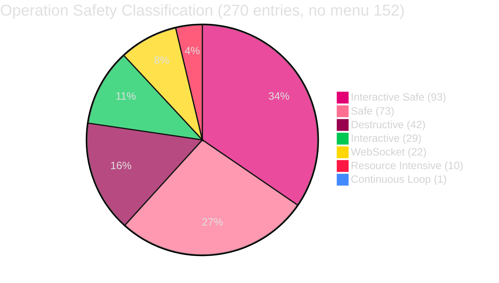
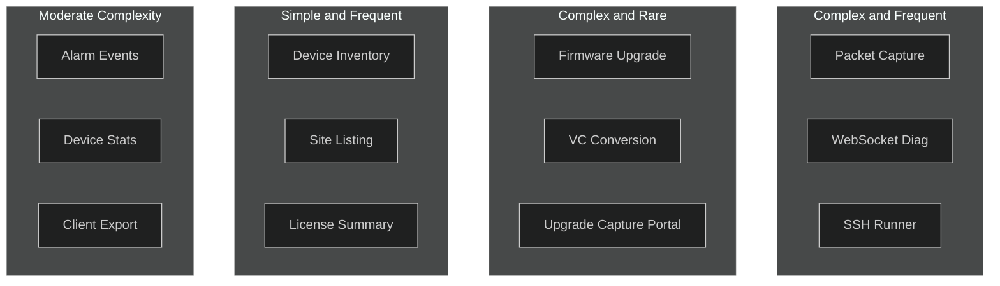
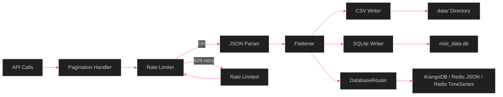
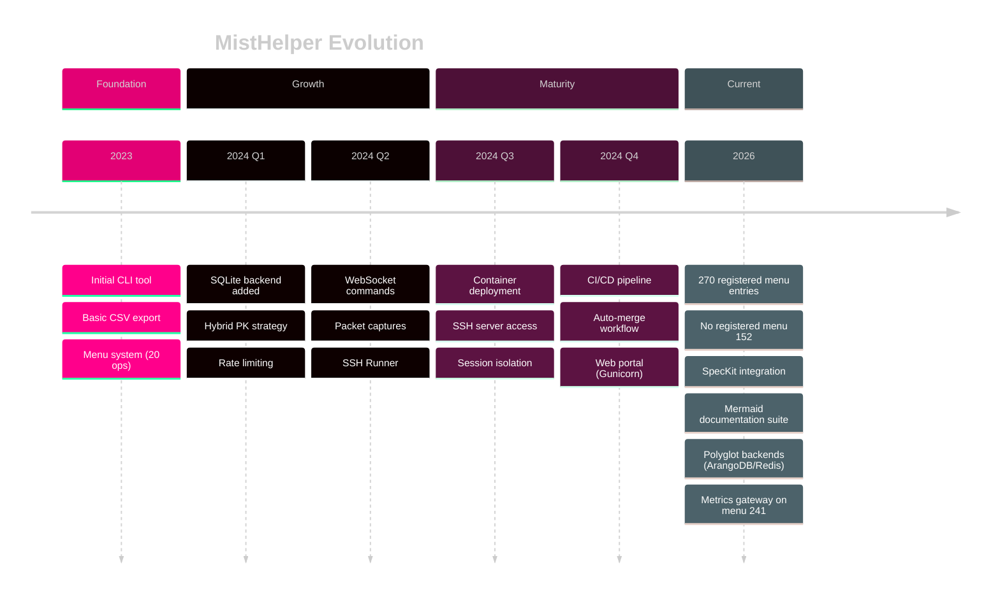

[<- Back to Diagram Index](../README.md)

# Metrics and Analytics

Operation distribution, rate limiting behavior, data flow paths, and version history.

## Operation Category Distribution

How MistHelper's 270 registered menu entries break down by safety classification.

## Operation Complexity vs Frequency

Where operations fall on the complexity-frequency spectrum.

## Rate Limiting Adaptive Delay

How the rate limiter adjusts API request delay when the Mist API returns 429.

> **Beta diagram type**: this diagram uses `xychart-beta`. A viewer without beta
> support does not render it. Open this page on GitHub.

## Data Flow Volumes

How API data flows through processing stages to output formats.

> **Beta diagram type**: this diagram uses `sankey-beta`. A viewer without beta
> support does not render it. Open this page on GitHub.

## Version History Milestones

Key milestones in MistHelper's evolution.

---

## Related Diagrams

- [Operations Reference](operations-reference.md) - Operation lifecycle and safety classifications
- [Data Pipeline](../core/data-pipeline.md) - Detailed data flow with error handling
- [Deployment Pipeline](../infrastructure/deployment-pipeline.md) - CI/CD timing context
