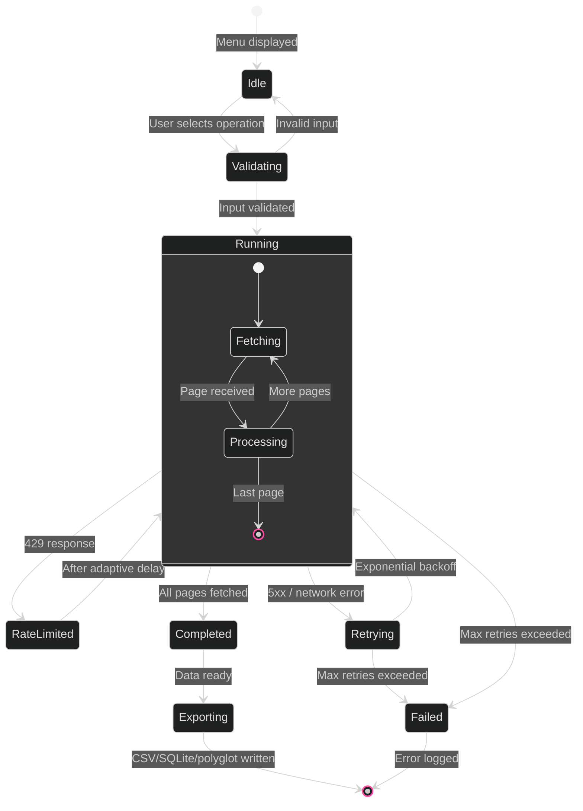
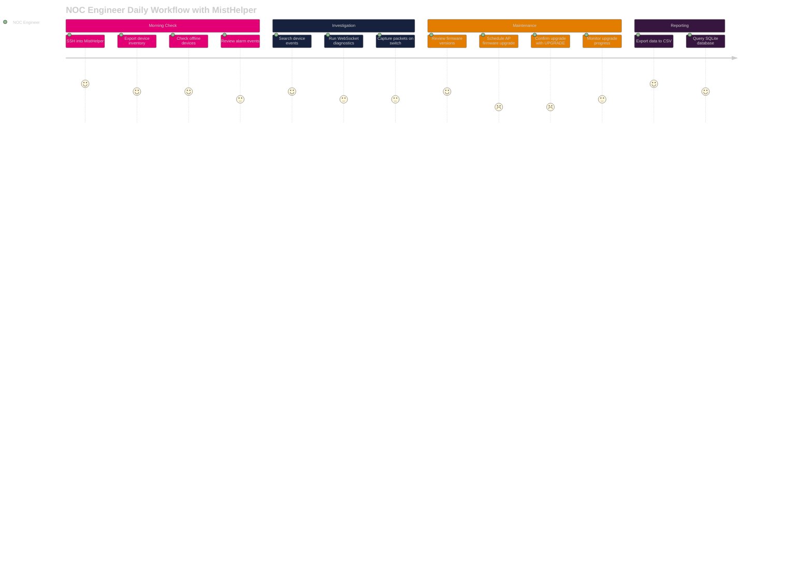
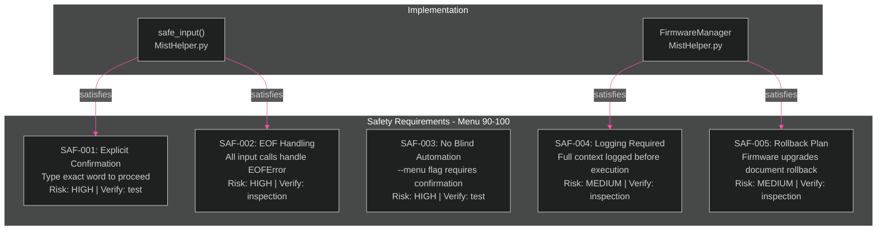

[<- Back to Diagram Index](../README.md)

# Operations Reference

Operation lifecycle, NOC engineer user journey, and destructive operation safety requirements.

## Operation Lifecycle

How an operation moves through states from selection to completion.

## NOC Engineer Journey

A typical day for a junior NOC engineer using MistHelper.

## Destructive Operation Safety Requirements

Requirements that MUST be met before any destructive operation (Menu 90-100) executes.

---

## Related Diagrams

- [Data Pipeline](../core/data-pipeline.md) - Detailed trace of the running state internals
- [Architecture Overview](../core/architecture-overview.md) - Where operations fit in the system
- [Metrics and Analytics](metrics-and-analytics.md) - Operation category distribution
- [Class Hierarchy: Managers](../class-hierarchy/managers.md) - Manager classes that implement operations
