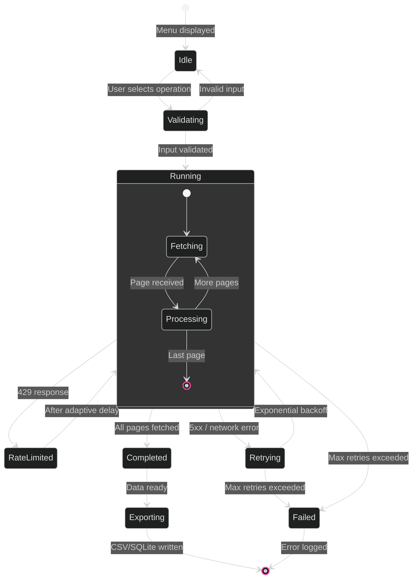

[<- Back to Diagram Index](../README.md)

# Operations Reference

Operation lifecycle, NOC engineer user journey, and destructive operation safety requirements.

## Operation Lifecycle

How an operation moves through states from selection to completion.



## NOC Engineer Journey

A typical day for a junior NOC engineer using MistHelper.


## Destructive Operation Safety Requirements

Requirements that MUST be met before any destructive operation (Menu 90-100) executes.

```mermaid
%%{init: {'theme': 'dark', 'themeVariables': {
  'primaryColor': '#E20074',
  'primaryTextColor': '#E0E0E0',
  'primaryBorderColor': '#99004D',
  'lineColor': '#FF4DA6',
  'secondaryColor': '#16213E',
  'tertiaryColor': '#1A1A2E',
  'fontFamily': 'ui-monospace, monospace'
}}}%%
requirementDiagram

    requirement explicit_confirmation {
        id: SAF-001
        text: Destructive operations require typing exact confirmation word
        risk: high
        verifymethod: test
    }

    requirement eof_handling {
        id: SAF-002
        text: All input calls handle EOFError for SSH session disconnects
        risk: high
        verifymethod: inspection
    }

    requirement no_automation {
        id: SAF-003
        text: Menu 90-100 cannot run via --menu flag without confirmation
        risk: high
        verifymethod: test
    }

    requirement logging_required {
        id: SAF-004
        text: All destructive actions logged with full context before execution
        risk: medium
        verifymethod: inspection
    }

    requirement rollback_plan {
        id: SAF-005
        text: Firmware upgrades document rollback procedures
        risk: medium
        verifymethod: inspection
    }

    element safe_input {
        type: function
        docRef: MistHelper.py
    }

    element FirmwareManager {
        type: class
        docRef: MistHelper.py
    }

    safe_input - satisfies -> explicit_confirmation
    safe_input - satisfies -> eof_handling
    FirmwareManager - satisfies -> logging_required
    FirmwareManager - satisfies -> rollback_plan
```

---

## Related Diagrams

- [Data Pipeline](../core/data-pipeline.md) - Detailed trace of the running state internals
- [Architecture Overview](../core/architecture-overview.md) - Where operations fit in the system
- [Metrics and Analytics](metrics-and-analytics.md) - Operation category distribution
- [Class Hierarchy: Managers](../class-hierarchy/managers.md) - Manager classes that implement operations
