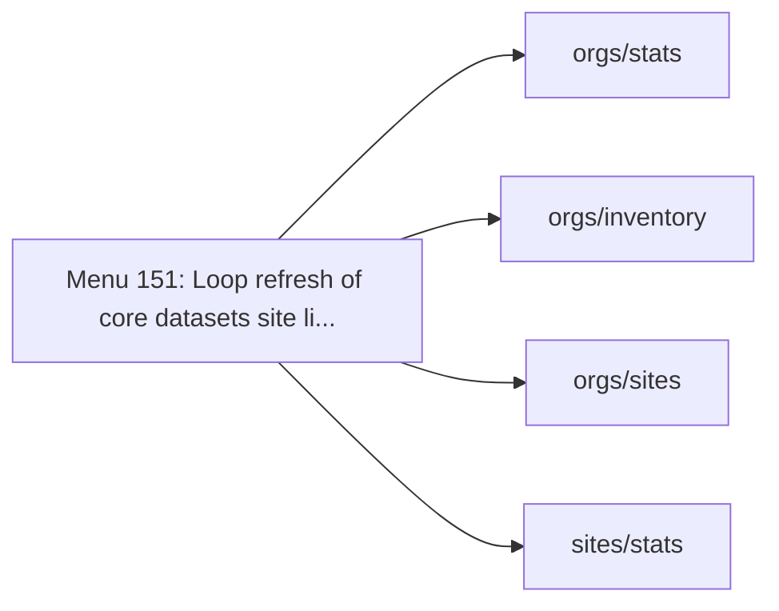
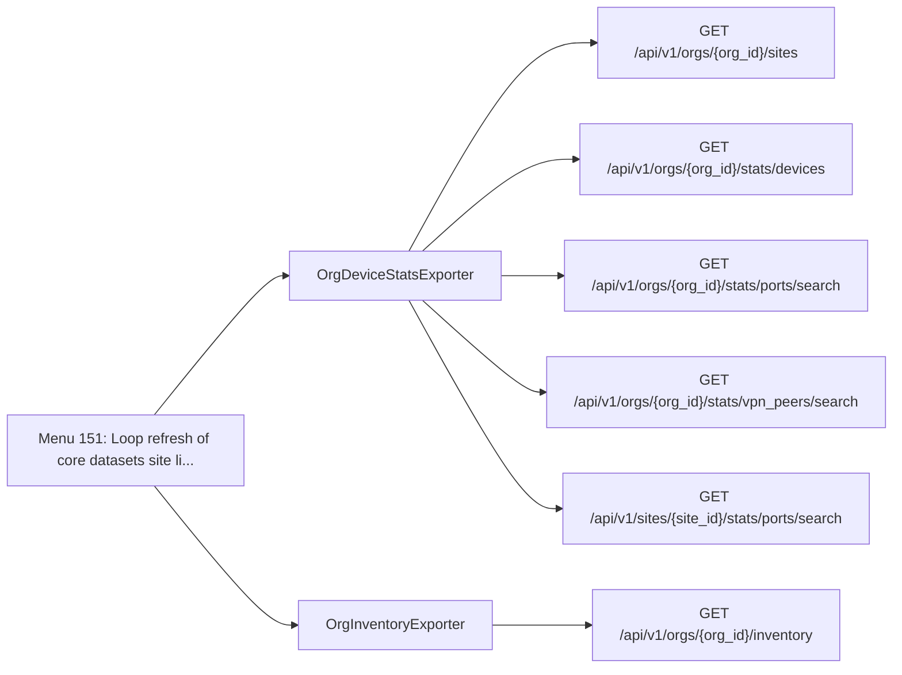

<!-- The tool python -m scripts.menu_api_map writes this page. Do not edit it by hand. -->

# Menu API endpoints: continuous_loop

This page lists the Mist API endpoints of the 1 menu options in the `continuous_loop` category.
A menu option in this category runs until the operator stops it.

The index page explains how to read the map: [Menu API endpoint map](README.md).

## Overview

Each overview diagram links a menu option to the SDK families that it uses.
The section of each menu option has a second diagram.
That diagram links the menu option to the classes that send the requests, and each class to its endpoints.

## Menu 151

- Title: Loop refresh of core datasets (site list, inventory, stats, ports, VPN) Stop with CTRL+C or create 'stop_loop.txt'
- Handler: `DataCollectionManager.continuous_loop`
- Shared helpers: [`CacheUtils`](README.md#cacheutils), [`ConfigUtils`](README.md#configutils), [`DataExporter`](README.md#dataexporter), [`SourceDependencyResolver`](README.md#sourcedependencyresolver)
- Endpoints: 6

| Method | Path | SDK function | Called from | Found by |
| - | - | - | - | - |
| GET | `/api/v1/orgs/{org_id}/inventory` | [`orgs.inventory.getOrgInventory`](https://www.juniper.net/documentation/us/en/software/mist/api/http/api/orgs/inventory/get-org-inventory) | [`OrgInventoryExporter.inventory`](../../src/export/org_inventory_exporter.py) | Reference |
| GET | `/api/v1/orgs/{org_id}/sites` | [`orgs.sites.listOrgSites`](https://www.juniper.net/documentation/us/en/software/mist/api/http/api/orgs/sites/list-org-sites) | [`OrgDeviceStatsExporter._load_port_stats_sites_from_api`](../../src/export/org_device_stats_exporter.py) | Call |
| GET | `/api/v1/orgs/{org_id}/stats/devices` | [`orgs.stats.listOrgDevicesStats`](https://www.juniper.net/documentation/us/en/software/mist/api/http/api/orgs/stats/devices/list-org-devices-stats) | [`OrgDeviceStatsExporter.device_stats`](../../src/export/org_device_stats_exporter.py) | Reference |
| GET | `/api/v1/orgs/{org_id}/stats/ports/search` | [`orgs.stats.searchOrgSwOrGwPorts`](https://www.juniper.net/documentation/us/en/software/mist/api/http/api/orgs/stats/ports/search-org-sw-or-gw-ports) | [`OrgDeviceStatsExporter.device_port_stats`](../../src/export/org_device_stats_exporter.py) | Reference |
| GET | `/api/v1/orgs/{org_id}/stats/vpn_peers/search` | [`orgs.stats.searchOrgPeerPathStats`](https://www.juniper.net/documentation/us/en/software/mist/api/http/api/orgs/stats/vpn-peers/search-org-peer-path-stats) | [`OrgDeviceStatsExporter.vpn_peer_stats`](../../src/export/org_device_stats_exporter.py) | Reference |
| GET | `/api/v1/sites/{site_id}/stats/ports/search` | [`sites.stats.searchSiteSwOrGwPorts`](https://www.juniper.net/documentation/us/en/software/mist/api/http/api/sites/stats/ports/search-site-sw-or-gw-ports) | [`OrgDeviceStatsExporter._attempt_site_port_stats_fetch`](../../src/export/org_device_stats_exporter.py) | Call |
