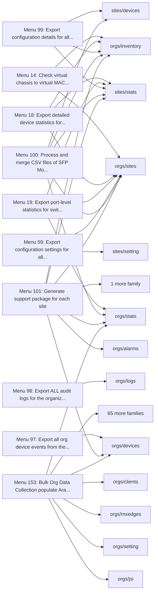
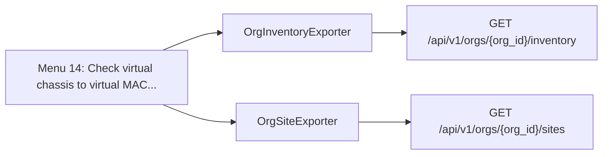
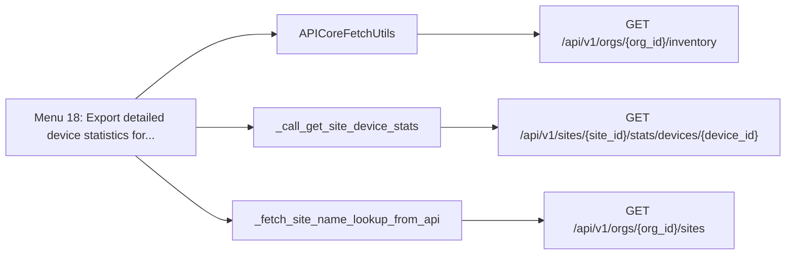
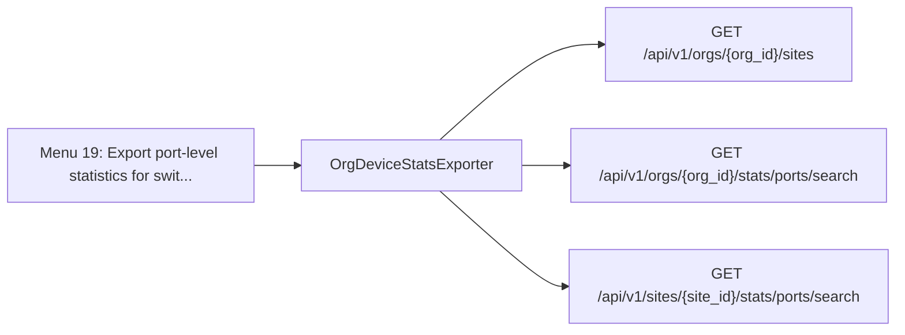
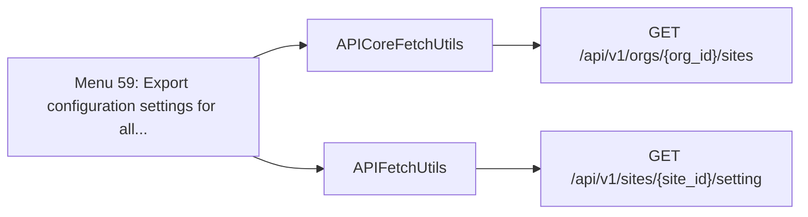
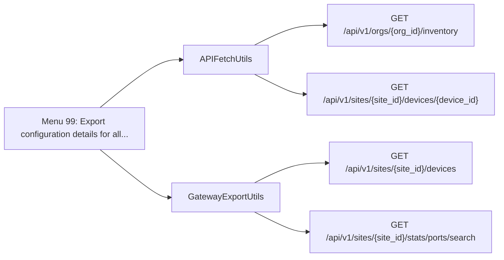
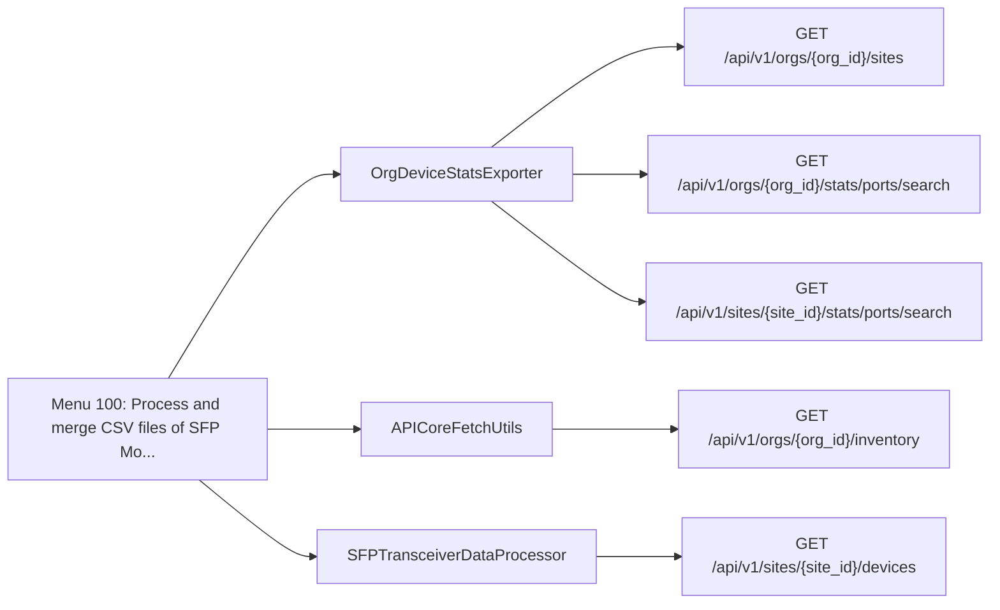
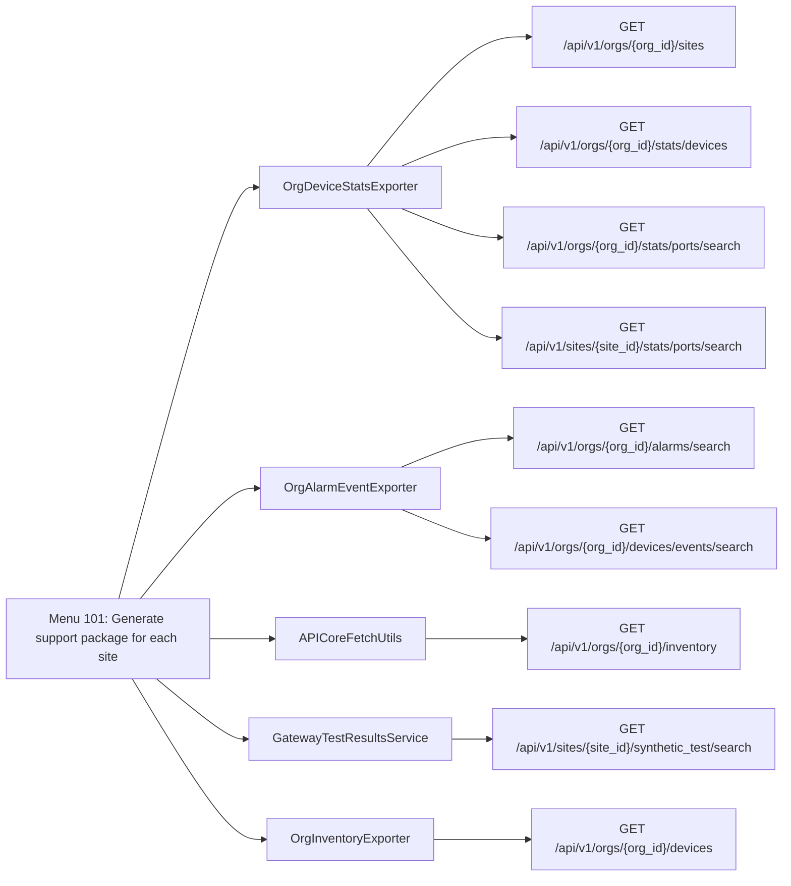
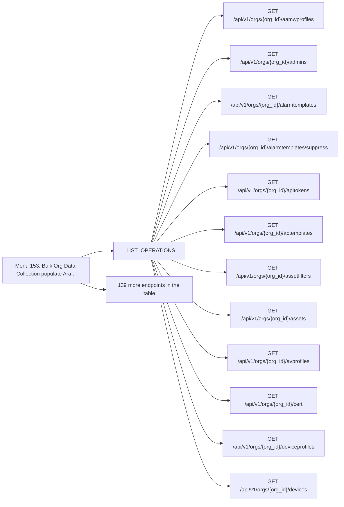

<!-- The tool python -m scripts.menu_api_map writes this page. Do not edit it by hand. -->

# Menu API endpoints: resource_intensive

This page lists the Mist API endpoints of the 10 menu options in the `resource_intensive` category.
A menu option in this category runs for a long time, or it sends many API calls.

The index page explains how to read the map: [Menu API endpoint map](README.md).

## Overview

Each overview diagram links a menu option to the SDK families that it uses.
The section of each menu option has a second diagram.
That diagram links the menu option to the classes that send the requests, and each class to its endpoints.

## Menu 14

- Title: Check virtual chassis to virtual MAC conversion status for all switches
- Handler: `lambda: _configure_virtual_chassis_manager().launch_check_status()`
- Shared helpers: [`CacheUtils`](README.md#cacheutils), [`DataExporter`](README.md#dataexporter), [`MainEntrypoint`](README.md#mainentrypoint), [`SourceDependencyResolver`](README.md#sourcedependencyresolver)
- Endpoints: 2

| Method | Path | SDK function | Called from | Found by |
| - | - | - | - | - |
| GET | `/api/v1/orgs/{org_id}/inventory` | [`orgs.inventory.getOrgInventory`](https://www.juniper.net/documentation/us/en/software/mist/api/http/api/orgs/inventory/get-org-inventory) | [`OrgInventoryExporter.inventory`](../../src/export/org_inventory_exporter.py) | Reference |
| GET | `/api/v1/orgs/{org_id}/sites` | [`orgs.sites.listOrgSites`](https://www.juniper.net/documentation/us/en/software/mist/api/http/api/orgs/sites/list-org-sites) | [`OrgSiteExporter.sites`](../../src/export/org_site_exporter.py) | Reference |

## Menu 18

- Title: Export detailed device statistics for all gateways (with freshness check)
- Handler: `lambda fast=False: _dispatch_gateway_stats_device_stats_with_freshness(fast=fast)`
- Shared helpers: [`CacheUtils`](README.md#cacheutils), [`ConfigUtils`](README.md#configutils), [`DataExporter`](README.md#dataexporter), [`MainEntrypoint`](README.md#mainentrypoint), [`SourceDependencyResolver`](README.md#sourcedependencyresolver)
- Endpoints: 3

| Method | Path | SDK function | Called from | Found by |
| - | - | - | - | - |
| GET | `/api/v1/orgs/{org_id}/inventory` | [`orgs.inventory.getOrgInventory`](https://www.juniper.net/documentation/us/en/software/mist/api/http/api/orgs/inventory/get-org-inventory) | [`APICoreFetchUtils.all_inventory_with_limit`](../../src/api/api_core_fetch_utils.py) | Call |
| GET | `/api/v1/orgs/{org_id}/sites` | [`orgs.sites.listOrgSites`](https://www.juniper.net/documentation/us/en/software/mist/api/http/api/orgs/sites/list-org-sites) | [`_fetch_site_name_lookup_from_api`](../../src/gateway/gateway_export_utils.py) | Call |
| GET | `/api/v1/sites/{site_id}/stats/devices/{device_id}` | [`sites.stats.getSiteDeviceStats`](https://www.juniper.net/documentation/us/en/software/mist/api/http/api/sites/stats/devices/get-site-device-stats) | [`_call_get_site_device_stats`](../../src/gateway/gateway_stats_exporter.py) | Call |

## Menu 19

- Title: Export port-level statistics for switches and gateways
- Handler: `OrgDeviceStatsExporter.device_port_stats`
- Shared helpers: [`CacheUtils`](README.md#cacheutils), [`ConfigUtils`](README.md#configutils), [`DataExporter`](README.md#dataexporter), [`SourceDependencyResolver`](README.md#sourcedependencyresolver)
- Endpoints: 3

| Method | Path | SDK function | Called from | Found by |
| - | - | - | - | - |
| GET | `/api/v1/orgs/{org_id}/sites` | [`orgs.sites.listOrgSites`](https://www.juniper.net/documentation/us/en/software/mist/api/http/api/orgs/sites/list-org-sites) | [`OrgDeviceStatsExporter._load_port_stats_sites_from_api`](../../src/export/org_device_stats_exporter.py) | Call |
| GET | `/api/v1/orgs/{org_id}/stats/ports/search` | [`orgs.stats.searchOrgSwOrGwPorts`](https://www.juniper.net/documentation/us/en/software/mist/api/http/api/orgs/stats/ports/search-org-sw-or-gw-ports) | [`OrgDeviceStatsExporter.device_port_stats`](../../src/export/org_device_stats_exporter.py) | Reference |
| GET | `/api/v1/sites/{site_id}/stats/ports/search` | [`sites.stats.searchSiteSwOrGwPorts`](https://www.juniper.net/documentation/us/en/software/mist/api/http/api/sites/stats/ports/search-site-sw-or-gw-ports) | [`OrgDeviceStatsExporter._attempt_site_port_stats_fetch`](../../src/export/org_device_stats_exporter.py) | Call |

## Menu 59

- Title: Export configuration settings for all sites
- Handler: `SiteConfigExporter.settings`
- Shared helpers: [`ConfigUtils`](README.md#configutils), [`DataExporter`](README.md#dataexporter), [`SourceDependencyResolver`](README.md#sourcedependencyresolver)
- Endpoints: 2

| Method | Path | SDK function | Called from | Found by |
| - | - | - | - | - |
| GET | `/api/v1/orgs/{org_id}/sites` | [`orgs.sites.listOrgSites`](https://www.juniper.net/documentation/us/en/software/mist/api/http/api/orgs/sites/list-org-sites) | [`APICoreFetchUtils.all_sites_with_limit`](../../src/api/api_core_fetch_utils.py) | Call |
| GET | `/api/v1/sites/{site_id}/setting` | [`sites.setting.getSiteSetting`](https://www.juniper.net/documentation/us/en/software/mist/api/http/api/sites/setting/get-site-setting) | [`APIFetchUtils._fetch_single_site_setting`](../../src/api/api_fetch_utils.py) | Call |

## Menu 97

- Title: Export all org device events from the last 52 weeks (streaming with checkpoint/resume)
- Handler: `OrgAlarmEventExporter.device_events_52w`
- Shared helpers: [`ConfigUtils`](README.md#configutils), [`DataExporter`](README.md#dataexporter), [`SourceDependencyResolver`](README.md#sourcedependencyresolver)
- Endpoints: 1

| Method | Path | SDK function | Called from | Found by |
| - | - | - | - | - |
| GET | `/api/v1/orgs/{org_id}/devices/events/search` | [`orgs.devices.searchOrgDeviceEvents`](https://www.juniper.net/documentation/us/en/software/mist/api/http/api/orgs/devices/search-org-device-events) | [`DeviceEvents52wExporter._fetch_page`](../../src/export/device_events_52w_exporter.py) | Call |

## Menu 98

- Title: Export ALL audit logs for the organization (last 52 weeks)
- Handler: `lambda: OrgExportUtils.audit_logs(full_history=True, duration='52w')`
- Shared helpers: [`ConfigUtils`](README.md#configutils), [`DataExporter`](README.md#dataexporter), [`SourceDependencyResolver`](README.md#sourcedependencyresolver)
- Endpoints: 1

| Method | Path | SDK function | Called from | Found by |
| - | - | - | - | - |
| GET | `/api/v1/orgs/{org_id}/logs/search` | [`orgs.logs.listOrgAuditLogs`](https://www.juniper.net/documentation/us/en/software/mist/api/http/api/orgs/logs/list-org-audit-logs) | [`OrgExportUtils.audit_logs`](../../src/export/org_export_utils.py) | Call |

## Menu 99

- Title: Export configuration details for all gateway devices across all sites
- Handler: `_dispatch_gateway_device_configs`
- Shared helpers: [`CacheUtils`](README.md#cacheutils), [`ConfigUtils`](README.md#configutils), [`DataExporter`](README.md#dataexporter), [`MainEntrypoint`](README.md#mainentrypoint), [`SourceDependencyResolver`](README.md#sourcedependencyresolver)
- Endpoints: 4

| Method | Path | SDK function | Called from | Found by |
| - | - | - | - | - |
| GET | `/api/v1/orgs/{org_id}/inventory` | [`orgs.inventory.getOrgInventory`](https://www.juniper.net/documentation/us/en/software/mist/api/http/api/orgs/inventory/get-org-inventory) | [`APIFetchUtils._gw_load_inventory`](../../src/api/api_fetch_utils.py) | Call |
| GET | `/api/v1/sites/{site_id}/devices` | [`sites.devices.listSiteDevices`](https://www.juniper.net/documentation/us/en/software/mist/api/http/api/sites/devices/list-site-devices) | [`GatewayExportUtils.device_configs`](../../src/gateway/gateway_export_utils.py) | Name |
| GET | `/api/v1/sites/{site_id}/devices/{device_id}` | [`sites.devices.getSiteDevice`](https://www.juniper.net/documentation/us/en/software/mist/api/http/api/sites/devices/get-site-device) | [`APIFetchUtils._gw_fetch_one_config`](../../src/api/api_fetch_utils.py) | Call |
| GET | `/api/v1/sites/{site_id}/stats/ports/search` | [`sites.stats.searchSiteSwOrGwPorts`](https://www.juniper.net/documentation/us/en/software/mist/api/http/api/sites/stats/ports/search-site-sw-or-gw-ports) | [`GatewayExportUtils._save_filtered_port_configs`](../../src/gateway/gateway_export_utils.py) | Name |

## Menu 100

- Title: Process and merge CSV files of SFP Module locations into a single CSV file
- Handler: `SFPTransceiverDataProcessor.merge_transceiver_data`
- Shared helpers: [`CacheUtils`](README.md#cacheutils), [`ConfigUtils`](README.md#configutils), [`DataExporter`](README.md#dataexporter), [`SourceDependencyResolver`](README.md#sourcedependencyresolver)
- Endpoints: 5

| Method | Path | SDK function | Called from | Found by |
| - | - | - | - | - |
| GET | `/api/v1/orgs/{org_id}/inventory` | [`orgs.inventory.getOrgInventory`](https://www.juniper.net/documentation/us/en/software/mist/api/http/api/orgs/inventory/get-org-inventory) | [`APICoreFetchUtils.all_inventory_with_limit`](../../src/api/api_core_fetch_utils.py) | Call |
| GET | `/api/v1/orgs/{org_id}/sites` | [`orgs.sites.listOrgSites`](https://www.juniper.net/documentation/us/en/software/mist/api/http/api/orgs/sites/list-org-sites) | [`OrgDeviceStatsExporter._load_port_stats_sites_from_api`](../../src/export/org_device_stats_exporter.py) | Call |
| GET | `/api/v1/orgs/{org_id}/stats/ports/search` | [`orgs.stats.searchOrgSwOrGwPorts`](https://www.juniper.net/documentation/us/en/software/mist/api/http/api/orgs/stats/ports/search-org-sw-or-gw-ports) | [`OrgDeviceStatsExporter.device_port_stats`](../../src/export/org_device_stats_exporter.py) | Reference |
| GET | `/api/v1/sites/{site_id}/devices` | [`sites.devices.listSiteDevices`](https://www.juniper.net/documentation/us/en/software/mist/api/http/api/sites/devices/list-site-devices) | [`SFPTransceiverDataProcessor._finalize_merge_output`](../../src/reports/sfp_transceiver_data_processor.py) | Name |
| GET | `/api/v1/sites/{site_id}/stats/ports/search` | [`sites.stats.searchSiteSwOrGwPorts`](https://www.juniper.net/documentation/us/en/software/mist/api/http/api/sites/stats/ports/search-site-sw-or-gw-ports) | [`OrgDeviceStatsExporter._attempt_site_port_stats_fetch`](../../src/export/org_device_stats_exporter.py) | Call |

## Menu 101

- Title: Generate support package for each site
- Handler: `DataCollectionManager.generate_support_packages`
- Shared helpers: [`CacheUtils`](README.md#cacheutils), [`ConfigUtils`](README.md#configutils), [`DataExporter`](README.md#dataexporter), [`RateLimitingUtils`](README.md#ratelimitingutils), [`SourceDependencyResolver`](README.md#sourcedependencyresolver)
- Endpoints: 9

| Method | Path | SDK function | Called from | Found by |
| - | - | - | - | - |
| GET | `/api/v1/orgs/{org_id}/alarms/search` | [`orgs.alarms.searchOrgAlarms`](https://www.juniper.net/documentation/us/en/software/mist/api/http/api/orgs/alarms/search-org-alarms) | [`OrgAlarmEventExporter.alarms`](../../src/export/org_alarm_event_exporter.py) | Reference |
| GET | `/api/v1/orgs/{org_id}/devices` | [`orgs.devices.listOrgDevices`](https://www.juniper.net/documentation/us/en/software/mist/api/http/api/orgs/devices/list-org-devices) | [`OrgInventoryExporter.devices`](../../src/export/org_inventory_exporter.py) | Reference |
| GET | `/api/v1/orgs/{org_id}/devices/events/search` | [`orgs.devices.searchOrgDeviceEvents`](https://www.juniper.net/documentation/us/en/software/mist/api/http/api/orgs/devices/search-org-device-events) | [`OrgAlarmEventExporter.device_events`](../../src/export/org_alarm_event_exporter.py) | Call |
| GET | `/api/v1/orgs/{org_id}/inventory` | [`orgs.inventory.getOrgInventory`](https://www.juniper.net/documentation/us/en/software/mist/api/http/api/orgs/inventory/get-org-inventory) | [`APICoreFetchUtils.all_inventory_with_limit`](../../src/api/api_core_fetch_utils.py) | Call |
| GET | `/api/v1/orgs/{org_id}/sites` | [`orgs.sites.listOrgSites`](https://www.juniper.net/documentation/us/en/software/mist/api/http/api/orgs/sites/list-org-sites) | [`OrgDeviceStatsExporter._load_port_stats_sites_from_api`](../../src/export/org_device_stats_exporter.py) | Call |
| GET | `/api/v1/orgs/{org_id}/stats/devices` | [`orgs.stats.listOrgDevicesStats`](https://www.juniper.net/documentation/us/en/software/mist/api/http/api/orgs/stats/devices/list-org-devices-stats) | [`OrgDeviceStatsExporter.device_stats`](../../src/export/org_device_stats_exporter.py) | Reference |
| GET | `/api/v1/orgs/{org_id}/stats/ports/search` | [`orgs.stats.searchOrgSwOrGwPorts`](https://www.juniper.net/documentation/us/en/software/mist/api/http/api/orgs/stats/ports/search-org-sw-or-gw-ports) | [`OrgDeviceStatsExporter.device_port_stats`](../../src/export/org_device_stats_exporter.py) | Reference |
| GET | `/api/v1/sites/{site_id}/stats/ports/search` | [`sites.stats.searchSiteSwOrGwPorts`](https://www.juniper.net/documentation/us/en/software/mist/api/http/api/sites/stats/ports/search-site-sw-or-gw-ports) | [`OrgDeviceStatsExporter._attempt_site_port_stats_fetch`](../../src/export/org_device_stats_exporter.py) | Call |
| GET | `/api/v1/sites/{site_id}/synthetic_test/search` | [`sites.synthetic_test.searchSiteSyntheticTest`](https://www.juniper.net/documentation/us/en/software/mist/api/http/api/sites/synthetic-tests/search-site-synthetic-test) | [`GatewayTestResultsService._invoke_search_api`](../../src/refactors/serial_cc/test_results_by_site.py) | Call |

## Menu 153

- Title: Bulk Org Data Collection (populate ArangoDB/Redis/SQLite with all org-level APIs)
- Handler: `lambda: OrgDataCollector.execute(OrgExportUtils.export_data, ConfigUtils.get_cached_or_prompted_org_id, InputUtils.safe_input)`
- Shared helpers: [`ConfigUtils`](README.md#configutils), [`InputUtils`](README.md#inpututils), [`SourceDependencyResolver`](README.md#sourcedependencyresolver)
- Endpoints: 151

| Method | Path | SDK function | Called from | Found by |
| - | - | - | - | - |
| GET | `/api/v1/orgs/{org_id}` | [`orgs.orgs.getOrg`](https://www.juniper.net/documentation/us/en/software/mist/api/http/api/orgs/get-org) | [`_GET_OPERATIONS`](../../src/org_data_collector.py) | Reference |
| GET | `/api/v1/orgs/{org_id}/aamwprofiles` | [`orgs.aamwprofiles.listOrgAAMWProfiles`](https://www.juniper.net/documentation/us/en/software/mist/api/http/api/orgs/advanced-anti-malware-profiles/list-org-a-a-m-w-profiles) | [`_LIST_OPERATIONS`](../../src/org_data_collector.py) | Reference |
| GET | `/api/v1/orgs/{org_id}/admins` | [`orgs.admins.listOrgAdmins`](https://www.juniper.net/documentation/us/en/software/mist/api/http/api/orgs/admins/list-org-admins) | [`_LIST_OPERATIONS`](../../src/org_data_collector.py) | Reference |
| GET | `/api/v1/orgs/{org_id}/alarms/count` | [`orgs.alarms.countOrgAlarms`](https://www.juniper.net/documentation/us/en/software/mist/api/http/api/orgs/alarms/count-org-alarms) | [`_COUNT_OPERATIONS`](../../src/org_data_collector.py) | Reference |
| GET | `/api/v1/orgs/{org_id}/alarms/search` | [`orgs.alarms.searchOrgAlarms`](https://www.juniper.net/documentation/us/en/software/mist/api/http/api/orgs/alarms/search-org-alarms) | [`_SEARCH_OPERATIONS`](../../src/org_data_collector.py) | Reference |
| GET | `/api/v1/orgs/{org_id}/alarmtemplates` | [`orgs.alarmtemplates.listOrgAlarmTemplates`](https://www.juniper.net/documentation/us/en/software/mist/api/http/api/orgs/alarm-templates/list-org-alarm-templates) | [`_LIST_OPERATIONS`](../../src/org_data_collector.py) | Reference |
| GET | `/api/v1/orgs/{org_id}/alarmtemplates/suppress` | [`orgs.alarmtemplates.listOrgSuppressedAlarms`](https://www.juniper.net/documentation/us/en/software/mist/api/http/api/orgs/alarm-templates/list-org-suppressed-alarms) | [`_LIST_OPERATIONS`](../../src/org_data_collector.py) | Reference |
| GET | `/api/v1/orgs/{org_id}/aoscx/register_cmd` | [`orgs.aoscx.getOrgAoscxRegisterCmd`](https://www.juniper.net/documentation/us/en/software/mist/api/http/api/orgs/devices/aoscx/get-org-aoscx-register-cmd) | [`_GET_OPERATIONS`](../../src/org_data_collector.py) | Reference |
| GET | `/api/v1/orgs/{org_id}/apitokens` | [`orgs.apitokens.listOrgApiTokens`](https://www.juniper.net/documentation/us/en/software/mist/api/http/api/orgs/api-tokens/list-org-api-tokens) | [`_LIST_OPERATIONS`](../../src/org_data_collector.py) | Reference |
| GET | `/api/v1/orgs/{org_id}/aptemplates` | [`orgs.aptemplates.listOrgAptemplates`](https://www.juniper.net/documentation/us/en/software/mist/api/http/api/orgs/ap-templates/list-org-aptemplates) | [`_LIST_OPERATIONS`](../../src/org_data_collector.py) | Reference |
| GET | `/api/v1/orgs/{org_id}/assetfilters` | [`orgs.assetfilters.listOrgAssetFilters`](https://www.juniper.net/documentation/us/en/software/mist/api/http/api/orgs/asset-filters/list-org-asset-filters) | [`_LIST_OPERATIONS`](../../src/org_data_collector.py) | Reference |
| GET | `/api/v1/orgs/{org_id}/assets` | [`orgs.assets.listOrgAssets`](https://www.juniper.net/documentation/us/en/software/mist/api/http/api/orgs/assets/list-org-assets) | [`_LIST_OPERATIONS`](../../src/org_data_collector.py) | Reference |
| GET | `/api/v1/orgs/{org_id}/avprofiles` | [`orgs.avprofiles.listOrgAntivirusProfiles`](https://www.juniper.net/documentation/us/en/software/mist/api/http/api/orgs/antivirus-profiles/list-org-antivirus-profiles) | [`_LIST_OPERATIONS`](../../src/org_data_collector.py) | Reference |
| GET | `/api/v1/orgs/{org_id}/cert` | [`orgs.cert.listOrgCertificates`](https://www.juniper.net/documentation/us/en/software/mist/api/http/api/orgs/cert/list-org-certificates) | [`_LIST_OPERATIONS`](../../src/org_data_collector.py) | Reference |
| GET | `/api/v1/orgs/{org_id}/clients/count` | [`orgs.clients.countOrgWirelessClients`](https://www.juniper.net/documentation/us/en/software/mist/api/http/api/orgs/clients/wireless/count-org-wireless-clients) | [`_COUNT_OPERATIONS`](../../src/org_data_collector.py) | Reference |
| GET | `/api/v1/orgs/{org_id}/clients/events/count` | [`orgs.clients.countOrgWirelessClientEvents`](https://www.juniper.net/documentation/us/en/software/mist/api/http/api/orgs/clients/wireless/count-org-wireless-client-events) | [`_COUNT_OPERATIONS`](../../src/org_data_collector.py) | Reference |
| GET | `/api/v1/orgs/{org_id}/clients/events/search` | [`orgs.clients.searchOrgWirelessClientEvents`](https://www.juniper.net/documentation/us/en/software/mist/api/http/api/orgs/clients/wireless/search-org-wireless-client-events) | [`_SEARCH_OPERATIONS`](../../src/org_data_collector.py) | Reference |
| GET | `/api/v1/orgs/{org_id}/clients/search` | [`orgs.clients.searchOrgWirelessClients`](https://www.juniper.net/documentation/us/en/software/mist/api/http/api/orgs/clients/wireless/search-org-wireless-clients) | [`_SEARCH_OPERATIONS`](../../src/org_data_collector.py) | Reference |
| GET | `/api/v1/orgs/{org_id}/clients/sessions/count` | [`orgs.clients.countOrgWirelessClientsSessions`](https://www.juniper.net/documentation/us/en/software/mist/api/http/api/orgs/clients/wireless/count-org-wireless-clients-sessions) | [`_COUNT_OPERATIONS`](../../src/org_data_collector.py) | Reference |
| GET | `/api/v1/orgs/{org_id}/clients/sessions/search` | [`orgs.clients.searchOrgWirelessClientSessions`](https://www.juniper.net/documentation/us/en/software/mist/api/http/api/orgs/clients/wireless/search-org-wireless-client-sessions) | [`_SEARCH_OPERATIONS`](../../src/org_data_collector.py) | Reference |
| GET | `/api/v1/orgs/{org_id}/crl` | [`orgs.crl.getOrgCrlFile`](https://www.juniper.net/documentation/us/en/software/mist/api/http/api/orgs/crl/get-org-crl-file) | [`_GET_OPERATIONS`](../../src/org_data_collector.py) | Reference |
| GET | `/api/v1/orgs/{org_id}/deviceprofiles` | [`orgs.deviceprofiles.listOrgDeviceProfiles`](https://www.juniper.net/documentation/us/en/software/mist/api/http/api/orgs/device-profiles/list-org-device-profiles) | [`_LIST_OPERATIONS`](../../src/org_data_collector.py) | Reference |
| GET | `/api/v1/orgs/{org_id}/devices` | [`orgs.devices.listOrgDevices`](https://www.juniper.net/documentation/us/en/software/mist/api/http/api/orgs/devices/list-org-devices) | [`_LIST_OPERATIONS`](../../src/org_data_collector.py) | Reference |
| GET | `/api/v1/orgs/{org_id}/devices/count` | [`orgs.devices.countOrgDevices`](https://www.juniper.net/documentation/us/en/software/mist/api/http/api/orgs/devices/count-org-devices) | [`_COUNT_OPERATIONS`](../../src/org_data_collector.py) | Reference |
| GET | `/api/v1/orgs/{org_id}/devices/events/count` | [`orgs.devices.countOrgDeviceEvents`](https://www.juniper.net/documentation/us/en/software/mist/api/http/api/orgs/devices/count-org-device-events) | [`_COUNT_OPERATIONS`](../../src/org_data_collector.py) | Reference |
| GET | `/api/v1/orgs/{org_id}/devices/events/search` | [`orgs.devices.searchOrgDeviceEvents`](https://www.juniper.net/documentation/us/en/software/mist/api/http/api/orgs/devices/search-org-device-events) | [`_SEARCH_OPERATIONS`](../../src/org_data_collector.py) | Reference |
| GET | `/api/v1/orgs/{org_id}/devices/last_config/count` | [`orgs.devices.countOrgDeviceLastConfigs`](https://www.juniper.net/documentation/us/en/software/mist/api/http/api/orgs/devices/count-org-device-last-configs) | [`_COUNT_OPERATIONS`](../../src/org_data_collector.py) | Reference |
| GET | `/api/v1/orgs/{org_id}/devices/last_config/search` | [`orgs.devices.searchOrgDeviceLastConfigs`](https://www.juniper.net/documentation/us/en/software/mist/api/http/api/orgs/devices/search-org-device-last-configs) | [`_SEARCH_OPERATIONS`](../../src/org_data_collector.py) | Reference |
| GET | `/api/v1/orgs/{org_id}/devices/radio_macs` | [`orgs.devices.listOrgApsMacs`](https://www.juniper.net/documentation/us/en/software/mist/api/http/api/orgs/devices/list-org-aps-macs) | [`_LIST_OPERATIONS`](../../src/org_data_collector.py) | Reference |
| GET | `/api/v1/orgs/{org_id}/devices/search` | [`orgs.devices.searchOrgDevices`](https://www.juniper.net/documentation/us/en/software/mist/api/http/api/orgs/devices/search-org-devices) | [`_SEARCH_OPERATIONS`](../../src/org_data_collector.py) | Reference |
| GET | `/api/v1/orgs/{org_id}/devices/summary` | [`orgs.devices.listOrgDevicesSummary`](https://www.juniper.net/documentation/us/en/software/mist/api/http/api/orgs/devices/list-org-devices-summary) | [`_LIST_OPERATIONS`](../../src/org_data_collector.py) | Reference |
| GET | `/api/v1/orgs/{org_id}/devices/upgrade` | [`orgs.devices.listOrgDeviceUpgrades`](https://www.juniper.net/documentation/us/en/software/mist/api/http/api/utilities/upgrade/list-org-device-upgrades) | [`_LIST_OPERATIONS`](../../src/org_data_collector.py) | Reference |
| GET | `/api/v1/orgs/{org_id}/devices/versions` | [`orgs.devices.listOrgAvailableDeviceVersions`](https://www.juniper.net/documentation/us/en/software/mist/api/http/api/utilities/upgrade/list-org-available-device-versions) | [`_LIST_OPERATIONS`](../../src/org_data_collector.py) | Reference |
| GET | `/api/v1/orgs/{org_id}/events/search` | [`orgs.events.searchOrgEvents`](https://www.juniper.net/documentation/us/en/software/mist/api/http/api/orgs/events/search-org-events) | [`_SEARCH_OPERATIONS`](../../src/org_data_collector.py) | Reference |
| GET | `/api/v1/orgs/{org_id}/events/system/count` | [`orgs.events.countOrgSystemEvents`](https://www.juniper.net/documentation/us/en/software/mist/api/http/api/orgs/events/count-org-system-events) | [`_COUNT_OPERATIONS`](../../src/org_data_collector.py) | Reference |
| GET | `/api/v1/orgs/{org_id}/events/system/search` | [`orgs.events.searchOrgSystemEvents`](https://www.juniper.net/documentation/us/en/software/mist/api/http/api/orgs/events/search-org-system-events) | [`_SEARCH_OPERATIONS`](../../src/org_data_collector.py) | Reference |
| GET | `/api/v1/orgs/{org_id}/evpn_topologies` | [`orgs.evpn_topologies.listOrgEvpnTopologies`](https://www.juniper.net/documentation/us/en/software/mist/api/http/api/orgs/evpn-topologies/list-org-evpn-topologies) | [`_LIST_OPERATIONS`](../../src/org_data_collector.py) | Reference |
| GET | `/api/v1/orgs/{org_id}/gatewaytemplates` | [`orgs.gatewaytemplates.listOrgGatewayTemplates`](https://www.juniper.net/documentation/us/en/software/mist/api/http/api/orgs/gateway-templates/list-org-gateway-templates) | [`_LIST_OPERATIONS`](../../src/org_data_collector.py) | Reference |
| GET | `/api/v1/orgs/{org_id}/guests` | [`orgs.guests.listOrgGuestAuthorizations`](https://www.juniper.net/documentation/us/en/software/mist/api/http/api/orgs/guests/list-org-guest-authorizations) | [`_LIST_OPERATIONS`](../../src/org_data_collector.py) | Reference |
| GET | `/api/v1/orgs/{org_id}/guests/count` | [`orgs.guests.countOrgGuestAuthorizations`](https://www.juniper.net/documentation/us/en/software/mist/api/http/api/orgs/guests/count-org-guest-authorizations) | [`_COUNT_OPERATIONS`](../../src/org_data_collector.py) | Reference |
| GET | `/api/v1/orgs/{org_id}/guests/search` | [`orgs.guests.searchOrgGuestAuthorization`](https://www.juniper.net/documentation/us/en/software/mist/api/http/api/orgs/guests/search-org-guest-authorization) | [`_SEARCH_OPERATIONS`](../../src/org_data_collector.py) | Reference |
| GET | `/api/v1/orgs/{org_id}/idpprofiles` | [`orgs.idpprofiles.listOrgIdpProfiles`](https://www.juniper.net/documentation/us/en/software/mist/api/http/api/orgs/idp-profiles/list-org-idp-profiles) | [`_LIST_OPERATIONS`](../../src/org_data_collector.py) | Reference |
| GET | `/api/v1/orgs/{org_id}/insights/sites-sle` | [`orgs.insights.getOrgSitesSle`](https://www.juniper.net/documentation/us/en/software/mist/api/http/api/orgs/sles/get-org-sites-sle) | [`_GET_OPERATIONS`](../../src/org_data_collector.py) | Reference |
| GET | `/api/v1/orgs/{org_id}/inventory` | [`orgs.inventory.getOrgInventory`](https://www.juniper.net/documentation/us/en/software/mist/api/http/api/orgs/inventory/get-org-inventory) | [`_LIST_OPERATIONS`](../../src/org_data_collector.py) | Reference |
| GET | `/api/v1/orgs/{org_id}/inventory/count` | [`orgs.inventory.countOrgInventory`](https://www.juniper.net/documentation/us/en/software/mist/api/http/api/orgs/inventory/count-org-inventory) | [`_COUNT_OPERATIONS`](../../src/org_data_collector.py) | Reference |
| GET | `/api/v1/orgs/{org_id}/inventory/search` | [`orgs.inventory.searchOrgInventory`](https://www.juniper.net/documentation/us/en/software/mist/api/http/api/orgs/inventory/search-org-inventory) | [`_SEARCH_OPERATIONS`](../../src/org_data_collector.py) | Reference |
| GET | `/api/v1/orgs/{org_id}/jsi/devices` | [`orgs.jsi.listOrgJsiDevices`](https://www.juniper.net/documentation/us/en/software/mist/api/http/api/orgs/jsi/list-org-jsi-devices) | [`_LIST_OPERATIONS`](../../src/org_data_collector.py) | Reference |
| GET | `/api/v1/orgs/{org_id}/jsi/inventory` | [`orgs.jsi.listOrgJsiPastPurchases`](https://www.juniper.net/documentation/us/en/software/mist/api/http/api/orgs/jsi/list-org-jsi-past-purchases) | [`_LIST_OPERATIONS`](../../src/org_data_collector.py) | Reference |
| GET | `/api/v1/orgs/{org_id}/jsi/inventory/count` | [`orgs.jsi.countOrgJsiAssetsAndContracts`](https://www.juniper.net/documentation/us/en/software/mist/api/http/api/orgs/jsi/count-org-jsi-assets-and-contracts) | [`_COUNT_OPERATIONS`](../../src/org_data_collector.py) | Reference |
| GET | `/api/v1/orgs/{org_id}/jsi/inventory/search` | [`orgs.jsi.searchOrgJsiAssetsAndContracts`](https://www.juniper.net/documentation/us/en/software/mist/api/http/api/orgs/jsi/search-org-jsi-assets-and-contracts) | [`_SEARCH_OPERATIONS`](../../src/org_data_collector.py) | Reference |
| GET | `/api/v1/orgs/{org_id}/jsi/pbn/count` | [`orgs.jsi.countOrgJsiPbn`](https://www.juniper.net/documentation/us/en/software/mist/api/http/api/orgs/jsi/count-org-jsi-pbn) | [`_COUNT_OPERATIONS`](../../src/org_data_collector.py) | Reference |
| GET | `/api/v1/orgs/{org_id}/jsi/pbn/search` | [`orgs.jsi.searchOrgJsiPbn`](https://www.juniper.net/documentation/us/en/software/mist/api/http/api/orgs/jsi/search-org-jsi-pbn) | [`_SEARCH_OPERATIONS`](../../src/org_data_collector.py) | Reference |
| GET | `/api/v1/orgs/{org_id}/jsi/sirt/count` | [`orgs.jsi.countOrgJsiSirt`](https://www.juniper.net/documentation/us/en/software/mist/api/http/api/orgs/jsi/count-org-jsi-sirt) | [`_COUNT_OPERATIONS`](../../src/org_data_collector.py) | Reference |
| GET | `/api/v1/orgs/{org_id}/jsi/sirt/search` | [`orgs.jsi.searchOrgJsiSirt`](https://www.juniper.net/documentation/us/en/software/mist/api/http/api/orgs/jsi/search-org-jsi-sirt) | [`_SEARCH_OPERATIONS`](../../src/org_data_collector.py) | Reference |
| GET | `/api/v1/orgs/{org_id}/licenses` | [`orgs.licenses.getOrgLicensesSummary`](https://www.juniper.net/documentation/us/en/software/mist/api/http/api/orgs/licenses/get-org-licenses-summary) | [`_GET_OPERATIONS`](../../src/org_data_collector.py) | Reference |
| GET | `/api/v1/orgs/{org_id}/licenses/usages` | [`orgs.licenses.getOrgLicensesBySite`](https://www.juniper.net/documentation/us/en/software/mist/api/http/api/orgs/licenses/get-org-licenses-by-site) | [`_LIST_OPERATIONS`](../../src/org_data_collector.py) | Reference |
| GET | `/api/v1/orgs/{org_id}/logs/count` | [`orgs.logs.countOrgAuditLogs`](https://www.juniper.net/documentation/us/en/software/mist/api/http/api/orgs/logs/count-org-audit-logs) | [`_COUNT_OPERATIONS`](../../src/org_data_collector.py) | Reference |
| GET | `/api/v1/orgs/{org_id}/logs/search` | [`orgs.logs.listOrgAuditLogs`](https://www.juniper.net/documentation/us/en/software/mist/api/http/api/orgs/logs/list-org-audit-logs) | [`_LIST_OPERATIONS`](../../src/org_data_collector.py) | Reference |
| GET | `/api/v1/orgs/{org_id}/marvisinvites` | [`orgs.marvisinvites.listOrgMarvisClientInvites`](https://www.juniper.net/documentation/us/en/software/mist/api/http/api/orgs/marvis-invites/list-org-marvis-client-invites) | [`_LIST_OPERATIONS`](../../src/org_data_collector.py) | Reference |
| GET | `/api/v1/orgs/{org_id}/mxclusters` | [`orgs.mxclusters.listOrgMxEdgeClusters`](https://www.juniper.net/documentation/us/en/software/mist/api/http/api/orgs/mxclusters/list-org-mx-edge-clusters) | [`_LIST_OPERATIONS`](../../src/org_data_collector.py) | Reference |
| GET | `/api/v1/orgs/{org_id}/mxedges` | [`orgs.mxedges.listOrgMxEdges`](https://www.juniper.net/documentation/us/en/software/mist/api/http/api/orgs/mxedges/list-org-mx-edges) | [`_LIST_OPERATIONS`](../../src/org_data_collector.py) | Reference |
| GET | `/api/v1/orgs/{org_id}/mxedges/count` | [`orgs.mxedges.countOrgMxEdges`](https://www.juniper.net/documentation/us/en/software/mist/api/http/api/orgs/mxedges/count-org-mx-edges) | [`_COUNT_OPERATIONS`](../../src/org_data_collector.py) | Reference |
| GET | `/api/v1/orgs/{org_id}/mxedges/events/count` | [`orgs.mxedges.countOrgSiteMxEdgeEvents`](https://www.juniper.net/documentation/us/en/software/mist/api/http/api/orgs/mxedges/count-org-site-mx-edge-events) | [`_COUNT_OPERATIONS`](../../src/org_data_collector.py) | Reference |
| GET | `/api/v1/orgs/{org_id}/mxedges/events/search` | [`orgs.mxedges.searchOrgMistEdgeEvents`](https://www.juniper.net/documentation/us/en/software/mist/api/http/api/orgs/mxedges/search-org-mist-edge-events) | [`_SEARCH_OPERATIONS`](../../src/org_data_collector.py) | Reference |
| GET | `/api/v1/orgs/{org_id}/mxedges/search` | [`orgs.mxedges.searchOrgMxEdges`](https://www.juniper.net/documentation/us/en/software/mist/api/http/api/orgs/mxedges/search-org-mx-edges) | [`_SEARCH_OPERATIONS`](../../src/org_data_collector.py) | Reference |
| GET | `/api/v1/orgs/{org_id}/mxedges/upgrade` | [`orgs.mxedges.listOrgMxEdgeUpgrades`](https://www.juniper.net/documentation/us/en/software/mist/api/http/api/utilities/upgrade/list-org-mx-edge-upgrades) | [`_LIST_OPERATIONS`](../../src/org_data_collector.py) | Reference |
| GET | `/api/v1/orgs/{org_id}/mxedges/versions` | [`orgs.mxedges.getOrgMxEdgeUpgradeInfo`](https://www.juniper.net/documentation/us/en/software/mist/api/http/api/orgs/mxedges/get-org-mx-edge-upgrade-info) | [`_GET_OPERATIONS`](../../src/org_data_collector.py) | Reference |
| GET | `/api/v1/orgs/{org_id}/mxtunnels` | [`orgs.mxtunnels.listOrgMxTunnels`](https://www.juniper.net/documentation/us/en/software/mist/api/http/api/orgs/mxtunnels/list-org-mx-tunnels) | [`_LIST_OPERATIONS`](../../src/org_data_collector.py) | Reference |
| GET | `/api/v1/orgs/{org_id}/nac_clients/count` | [`orgs.nac_clients.countOrgNacClients`](https://www.juniper.net/documentation/us/en/software/mist/api/http/api/orgs/clients/nac/count-org-nac-clients) | [`_COUNT_OPERATIONS`](../../src/org_data_collector.py) | Reference |
| GET | `/api/v1/orgs/{org_id}/nac_clients/events/count` | [`orgs.nac_clients.countOrgNacClientEvents`](https://www.juniper.net/documentation/us/en/software/mist/api/http/api/orgs/clients/nac/count-org-nac-client-events) | [`_COUNT_OPERATIONS`](../../src/org_data_collector.py) | Reference |
| GET | `/api/v1/orgs/{org_id}/nac_clients/events/search` | [`orgs.nac_clients.searchOrgNacClientEvents`](https://www.juniper.net/documentation/us/en/software/mist/api/http/api/orgs/clients/nac/search-org-nac-client-events) | [`_SEARCH_OPERATIONS`](../../src/org_data_collector.py) | Reference |
| GET | `/api/v1/orgs/{org_id}/nac_clients/search` | [`orgs.nac_clients.searchOrgNacClients`](https://www.juniper.net/documentation/us/en/software/mist/api/http/api/orgs/clients/nac/search-org-nac-clients) | [`_SEARCH_OPERATIONS`](../../src/org_data_collector.py) | Reference |
| GET | `/api/v1/orgs/{org_id}/nacportals` | [`orgs.nacportals.listOrgNacPortals`](https://www.juniper.net/documentation/us/en/software/mist/api/http/api/orgs/nac-portals/list-org-nac-portals) | [`_LIST_OPERATIONS`](../../src/org_data_collector.py) | Reference |
| GET | `/api/v1/orgs/{org_id}/nacrules` | [`orgs.nacrules.listOrgNacRules`](https://www.juniper.net/documentation/us/en/software/mist/api/http/api/orgs/nac-rules/list-org-nac-rules) | [`_LIST_OPERATIONS`](../../src/org_data_collector.py) | Reference |
| GET | `/api/v1/orgs/{org_id}/nactags` | [`orgs.nactags.listOrgNacTags`](https://www.juniper.net/documentation/us/en/software/mist/api/http/api/orgs/nac-tags/list-org-nac-tags) | [`_LIST_OPERATIONS`](../../src/org_data_collector.py) | Reference |
| GET | `/api/v1/orgs/{org_id}/networks` | [`orgs.networks.listOrgNetworks`](https://www.juniper.net/documentation/us/en/software/mist/api/http/api/orgs/networks/list-org-networks) | [`_LIST_OPERATIONS`](../../src/org_data_collector.py) | Reference |
| GET | `/api/v1/orgs/{org_id}/networktemplates` | [`orgs.networktemplates.listOrgNetworkTemplates`](https://www.juniper.net/documentation/us/en/software/mist/api/http/api/orgs/network-templates/list-org-network-templates) | [`_LIST_OPERATIONS`](../../src/org_data_collector.py) | Reference |
| GET | `/api/v1/orgs/{org_id}/otherdevices` | [`orgs.otherdevices.listOrgOtherDevices`](https://www.juniper.net/documentation/us/en/software/mist/api/http/api/orgs/devices/others/list-org-other-devices) | [`_LIST_OPERATIONS`](../../src/org_data_collector.py) | Reference |
| GET | `/api/v1/orgs/{org_id}/otherdevices/events/count` | [`orgs.otherdevices.countOrgOtherDeviceEvents`](https://www.juniper.net/documentation/us/en/software/mist/api/http/api/orgs/devices/others/count-org-other-device-events) | [`_COUNT_OPERATIONS`](../../src/org_data_collector.py) | Reference |
| GET | `/api/v1/orgs/{org_id}/otherdevices/events/search` | [`orgs.otherdevices.searchOrgOtherDeviceEvents`](https://www.juniper.net/documentation/us/en/software/mist/api/http/api/orgs/devices/others/search-org-other-device-events) | [`_SEARCH_OPERATIONS`](../../src/org_data_collector.py) | Reference |
| GET | `/api/v1/orgs/{org_id}/pcaps` | [`orgs.pcaps.listOrgPacketCaptures`](https://www.juniper.net/documentation/us/en/software/mist/api/http/api/utilities/pcaps/list-org-packet-captures) | [`_LIST_OPERATIONS`](../../src/org_data_collector.py) | Reference |
| GET | `/api/v1/orgs/{org_id}/pcaps/capture` | [`orgs.pcaps.getOrgCapturingStatus`](https://www.juniper.net/documentation/us/en/software/mist/api/http/api/utilities/pcaps/get-org-capturing-status) | [`_GET_OPERATIONS`](../../src/org_data_collector.py) | Reference |
| GET | `/api/v1/orgs/{org_id}/pma/dashboards` | [`orgs.pma.listOrgPmaDashboards`](https://www.juniper.net/documentation/us/en/software/mist/api/http/api/orgs/premium-analytics/list-org-pma-dashboards) | [`_LIST_OPERATIONS`](../../src/org_data_collector.py) | Reference |
| GET | `/api/v1/orgs/{org_id}/pskportals` | [`orgs.pskportals.listOrgPskPortals`](https://www.juniper.net/documentation/us/en/software/mist/api/http/api/orgs/psk-portals/list-org-psk-portals) | [`_LIST_OPERATIONS`](../../src/org_data_collector.py) | Reference |
| GET | `/api/v1/orgs/{org_id}/pskportals/logs` | [`orgs.pskportals.listOrgPskPortalLogs`](https://www.juniper.net/documentation/us/en/software/mist/api/http/api/orgs/psk-portals/list-org-psk-portal-logs) | [`_LIST_OPERATIONS`](../../src/org_data_collector.py) | Reference |
| GET | `/api/v1/orgs/{org_id}/pskportals/logs/count` | [`orgs.pskportals.countOrgPskPortalLogs`](https://www.juniper.net/documentation/us/en/software/mist/api/http/api/orgs/psk-portals/count-org-psk-portal-logs) | [`_COUNT_OPERATIONS`](../../src/org_data_collector.py) | Reference |
| GET | `/api/v1/orgs/{org_id}/pskportals/logs/search` | [`orgs.pskportals.searchOrgPskPortalLogs`](https://www.juniper.net/documentation/us/en/software/mist/api/http/api/orgs/psk-portals/search-org-psk-portal-logs) | [`_SEARCH_OPERATIONS`](../../src/org_data_collector.py) | Reference |
| GET | `/api/v1/orgs/{org_id}/psks` | [`orgs.psks.listOrgPsks`](https://www.juniper.net/documentation/us/en/software/mist/api/http/api/orgs/psks/list-org-psks) | [`_LIST_OPERATIONS`](../../src/org_data_collector.py) | Reference |
| GET | `/api/v1/orgs/{org_id}/rftemplates` | [`orgs.rftemplates.listOrgRfTemplates`](https://www.juniper.net/documentation/us/en/software/mist/api/http/api/orgs/rf-templates/list-org-rf-templates) | [`_LIST_OPERATIONS`](../../src/org_data_collector.py) | Reference |
| GET | `/api/v1/orgs/{org_id}/sdkinvites` | [`orgs.sdkinvites.listSdkInvites`](https://www.juniper.net/documentation/us/en/software/mist/api/http/api/orgs/sdk-invites/list-sdk-invites) | [`_LIST_OPERATIONS`](../../src/org_data_collector.py) | Reference |
| GET | `/api/v1/orgs/{org_id}/sdktemplates` | [`orgs.sdktemplates.listSdkTemplates`](https://www.juniper.net/documentation/us/en/software/mist/api/http/api/orgs/sdk-templates/list-sdk-templates) | [`_LIST_OPERATIONS`](../../src/org_data_collector.py) | Reference |
| GET | `/api/v1/orgs/{org_id}/secintelprofiles` | [`orgs.secintelprofiles.listOrgSecIntelProfiles`](https://www.juniper.net/documentation/us/en/software/mist/api/http/api/orgs/secintel-profiles/list-org-sec-intel-profiles) | [`_LIST_OPERATIONS`](../../src/org_data_collector.py) | Reference |
| GET | `/api/v1/orgs/{org_id}/secpolicies` | [`orgs.secpolicies.listOrgSecPolicies`](https://www.juniper.net/documentation/us/en/software/mist/api/http/api/orgs/security-policies/list-org-sec-policies) | [`_LIST_OPERATIONS`](../../src/org_data_collector.py) | Reference |
| GET | `/api/v1/orgs/{org_id}/servicepolicies` | [`orgs.servicepolicies.listOrgServicePolicies`](https://www.juniper.net/documentation/us/en/software/mist/api/http/api/orgs/service-policies/list-org-service-policies) | [`_LIST_OPERATIONS`](../../src/org_data_collector.py) | Reference |
| GET | `/api/v1/orgs/{org_id}/services` | [`orgs.services.listOrgServices`](https://www.juniper.net/documentation/us/en/software/mist/api/http/api/orgs/services/list-org-services) | [`_LIST_OPERATIONS`](../../src/org_data_collector.py) | Reference |
| GET | `/api/v1/orgs/{org_id}/setting` | [`orgs.setting.getOrgSettings`](https://www.juniper.net/documentation/us/en/software/mist/api/http/api/orgs/setting/get-org-settings) | [`_GET_OPERATIONS`](../../src/org_data_collector.py) | Reference |
| GET | `/api/v1/orgs/{org_id}/setting/jse/info` | [`orgs.setting.getOrgJseInfo`](https://www.juniper.net/documentation/us/en/software/mist/api/http/api/orgs/integration-jse/get-org-jse-info) | [`_GET_OPERATIONS`](../../src/org_data_collector.py) | Reference |
| GET | `/api/v1/orgs/{org_id}/setting/jse/setup` | [`orgs.setting.getOrgJseIntegration`](https://www.juniper.net/documentation/us/en/software/mist/api/http/api/orgs/integration-jse/get-org-jse-integration) | [`_GET_OPERATIONS`](../../src/org_data_collector.py) | Reference |
| GET | `/api/v1/orgs/{org_id}/setting/mist_nac_crls` | [`orgs.setting.getOrgNacCrl`](https://www.juniper.net/documentation/us/en/software/mist/api/http/api/orgs/nac-crl/get-org-nac-crl) | [`_GET_OPERATIONS`](../../src/org_data_collector.py) | Reference |
| GET | `/api/v1/orgs/{org_id}/setting/mist_scep` | [`orgs.setting.getOrgMistScep`](https://www.juniper.net/documentation/us/en/software/mist/api/http/api/orgs/scep/get-org-mist-scep) | [`_GET_OPERATIONS`](../../src/org_data_collector.py) | Reference |
| GET | `/api/v1/orgs/{org_id}/setting/mist_scep/client_certs` | [`orgs.setting.listOrgIssuedClientCertificates`](https://www.juniper.net/documentation/us/en/software/mist/api/http/api/orgs/scep/list-org-issued-client-certificates) | [`_LIST_OPERATIONS`](../../src/org_data_collector.py) | Reference |
| GET | `/api/v1/orgs/{org_id}/setting/skyatp/setup` | [`orgs.setting.getOrgSkyAtpIntegration`](https://www.juniper.net/documentation/us/en/software/mist/api/http/api/orgs/integration-skyatp/get-org-sky-atp-integration) | [`_GET_OPERATIONS`](../../src/org_data_collector.py) | Reference |
| GET | `/api/v1/orgs/{org_id}/setting/zscaler/setup` | [`orgs.setting.getOrgZscalerIntegration`](https://www.juniper.net/documentation/us/en/software/mist/api/http/api/orgs/integration-zscaler/get-org-zscaler-integration) | [`_GET_OPERATIONS`](../../src/org_data_collector.py) | Reference |
| GET | `/api/v1/orgs/{org_id}/sitegroups` | [`orgs.sitegroups.listOrgSiteGroups`](https://www.juniper.net/documentation/us/en/software/mist/api/http/api/orgs/sitegroups/list-org-site-groups) | [`_LIST_OPERATIONS`](../../src/org_data_collector.py) | Reference |
| GET | `/api/v1/orgs/{org_id}/sites` | [`orgs.sites.listOrgSites`](https://www.juniper.net/documentation/us/en/software/mist/api/http/api/orgs/sites/list-org-sites) | [`_LIST_OPERATIONS`](../../src/org_data_collector.py) | Reference |
| GET | `/api/v1/orgs/{org_id}/sites/count` | [`orgs.sites.countOrgSites`](https://www.juniper.net/documentation/us/en/software/mist/api/http/api/orgs/sites/count-org-sites) | [`_COUNT_OPERATIONS`](../../src/org_data_collector.py) | Reference |
| GET | `/api/v1/orgs/{org_id}/sites/search` | [`orgs.sites.searchOrgSites`](https://www.juniper.net/documentation/us/en/software/mist/api/http/api/orgs/sites/search-org-sites) | [`_SEARCH_OPERATIONS`](../../src/org_data_collector.py) | Reference |
| GET | `/api/v1/orgs/{org_id}/sitetemplates` | [`orgs.sitetemplates.listOrgSiteTemplates`](https://www.juniper.net/documentation/us/en/software/mist/api/http/api/orgs/site-templates/list-org-site-templates) | [`_LIST_OPERATIONS`](../../src/org_data_collector.py) | Reference |
| GET | `/api/v1/orgs/{org_id}/ssl_proxy_cert` | [`orgs.ssl_proxy_cert.getOrgSslProxyCert`](https://www.juniper.net/documentation/us/en/software/mist/api/http/api/orgs/cert/get-org-ssl-proxy-cert) | [`_GET_OPERATIONS`](../../src/org_data_collector.py) | Reference |
| GET | `/api/v1/orgs/{org_id}/ssoroles` | [`orgs.ssoroles.listOrgSsoRoles`](https://www.juniper.net/documentation/us/en/software/mist/api/http/api/orgs/sso-roles/list-org-sso-roles) | [`_LIST_OPERATIONS`](../../src/org_data_collector.py) | Reference |
| GET | `/api/v1/orgs/{org_id}/ssos` | [`orgs.ssos.listOrgSsos`](https://www.juniper.net/documentation/us/en/software/mist/api/http/api/orgs/sso/list-org-ssos) | [`_LIST_OPERATIONS`](../../src/org_data_collector.py) | Reference |
| GET | `/api/v1/orgs/{org_id}/ssr/register_cmd` | [`orgs.ssr.getOrgSsrRegistrationCommands`](https://www.juniper.net/documentation/us/en/software/mist/api/http/api/orgs/devices/ssr/get-org-ssr-registration-commands) | [`_GET_OPERATIONS`](../../src/org_data_collector.py) | Reference |
| GET | `/api/v1/orgs/{org_id}/ssr/upgrade` | [`orgs.ssr.listOrgSsrUpgrades`](https://www.juniper.net/documentation/us/en/software/mist/api/http/api/utilities/upgrade/list-org-ssr-upgrades) | [`_LIST_OPERATIONS`](../../src/org_data_collector.py) | Reference |
| GET | `/api/v1/orgs/{org_id}/ssr/versions` | [`orgs.ssr.listOrgAvailableSsrVersions`](https://www.juniper.net/documentation/us/en/software/mist/api/http/api/utilities/upgrade/list-org-available-ssr-versions) | [`_LIST_OPERATIONS`](../../src/org_data_collector.py) | Reference |
| GET | `/api/v1/orgs/{org_id}/stats` | [`orgs.stats.getOrgStats`](https://www.juniper.net/documentation/us/en/software/mist/api/http/api/orgs/stats/get-org-stats) | [`_GET_OPERATIONS`](../../src/org_data_collector.py) | Reference |
| GET | `/api/v1/orgs/{org_id}/stats/assets` | [`orgs.stats.listOrgAssetsStats`](https://www.juniper.net/documentation/us/en/software/mist/api/http/api/orgs/stats/assets/list-org-assets-stats) | [`_SEARCH_OPERATIONS`](../../src/org_data_collector.py) | Reference |
| GET | `/api/v1/orgs/{org_id}/stats/assets/count` | [`orgs.stats.countOrgAssetsByDistanceField`](https://www.juniper.net/documentation/us/en/software/mist/api/http/api/orgs/stats/assets/count-org-assets-by-distance-field) | [`_COUNT_OPERATIONS`](../../src/org_data_collector.py) | Reference |
| GET | `/api/v1/orgs/{org_id}/stats/assets/search` | [`orgs.stats.searchOrgAssets`](https://www.juniper.net/documentation/us/en/software/mist/api/http/api/orgs/stats/assets/search-org-assets) | [`_SEARCH_OPERATIONS`](../../src/org_data_collector.py) | Reference |
| GET | `/api/v1/orgs/{org_id}/stats/bgp_peers/count` | [`orgs.stats.countOrgBgpStats`](https://www.juniper.net/documentation/us/en/software/mist/api/http/api/orgs/stats/bgp-peers/count-org-bgp-stats) | [`_COUNT_OPERATIONS`](../../src/org_data_collector.py) | Reference |
| GET | `/api/v1/orgs/{org_id}/stats/bgp_peers/search` | [`orgs.stats.searchOrgBgpStats`](https://www.juniper.net/documentation/us/en/software/mist/api/http/api/orgs/stats/bgp-peers/search-org-bgp-stats) | [`_SEARCH_OPERATIONS`](../../src/org_data_collector.py) | Reference |
| GET | `/api/v1/orgs/{org_id}/stats/devices` | [`orgs.stats.listOrgDevicesStats`](https://www.juniper.net/documentation/us/en/software/mist/api/http/api/orgs/stats/devices/list-org-devices-stats) | [`_SEARCH_OPERATIONS`](../../src/org_data_collector.py) | Reference |
| GET | `/api/v1/orgs/{org_id}/stats/mxedges` | [`orgs.stats.listOrgMxEdgesStats`](https://www.juniper.net/documentation/us/en/software/mist/api/http/api/orgs/stats/mxedges/list-org-mx-edges-stats) | [`_SEARCH_OPERATIONS`](../../src/org_data_collector.py) | Reference |
| GET | `/api/v1/orgs/{org_id}/stats/ospf_peers/count` | [`orgs.stats.countOrgOspfStats`](https://www.juniper.net/documentation/us/en/software/mist/api/http/api/orgs/stats/ospf/count-org-ospf-stats) | [`_COUNT_OPERATIONS`](../../src/org_data_collector.py) | Reference |
| GET | `/api/v1/orgs/{org_id}/stats/ospf_peers/search` | [`orgs.stats.searchOrgOspfStats`](https://www.juniper.net/documentation/us/en/software/mist/api/http/api/orgs/stats/ospf/search-org-ospf-stats) | [`_SEARCH_OPERATIONS`](../../src/org_data_collector.py) | Reference |
| GET | `/api/v1/orgs/{org_id}/stats/ports/count` | [`orgs.stats.countOrgSwOrGwPorts`](https://www.juniper.net/documentation/us/en/software/mist/api/http/api/orgs/stats/ports/count-org-sw-or-gw-ports) | [`_COUNT_OPERATIONS`](../../src/org_data_collector.py) | Reference |
| GET | `/api/v1/orgs/{org_id}/stats/ports/search` | [`orgs.stats.searchOrgSwOrGwPorts`](https://www.juniper.net/documentation/us/en/software/mist/api/http/api/orgs/stats/ports/search-org-sw-or-gw-ports) | [`_SEARCH_OPERATIONS`](../../src/org_data_collector.py) | Reference |
| GET | `/api/v1/orgs/{org_id}/stats/sites` | [`orgs.stats.listOrgSiteStats`](https://www.juniper.net/documentation/us/en/software/mist/api/http/api/orgs/stats/sites/list-org-site-stats) | [`_SEARCH_OPERATIONS`](../../src/org_data_collector.py) | Reference |
| GET | `/api/v1/orgs/{org_id}/stats/tunnels/count` | [`orgs.stats.countOrgTunnelsStats`](https://www.juniper.net/documentation/us/en/software/mist/api/http/api/orgs/stats/tunnels/count-org-tunnels-stats) | [`_COUNT_OPERATIONS`](../../src/org_data_collector.py) | Reference |
| GET | `/api/v1/orgs/{org_id}/stats/tunnels/search` | [`orgs.stats.searchOrgTunnelsStats`](https://www.juniper.net/documentation/us/en/software/mist/api/http/api/orgs/stats/tunnels/search-org-tunnels-stats) | [`_SEARCH_OPERATIONS`](../../src/org_data_collector.py) | Reference |
| GET | `/api/v1/orgs/{org_id}/stats/vpn_peers/count` | [`orgs.stats.countOrgPeerPathStats`](https://www.juniper.net/documentation/us/en/software/mist/api/http/api/orgs/stats/vpn-peers/count-org-peer-path-stats) | [`_COUNT_OPERATIONS`](../../src/org_data_collector.py) | Reference |
| GET | `/api/v1/orgs/{org_id}/stats/vpn_peers/search` | [`orgs.stats.searchOrgPeerPathStats`](https://www.juniper.net/documentation/us/en/software/mist/api/http/api/orgs/stats/vpn-peers/search-org-peer-path-stats) | [`_SEARCH_OPERATIONS`](../../src/org_data_collector.py) | Reference |
| GET | `/api/v1/orgs/{org_id}/templates` | [`orgs.templates.listOrgTemplates`](https://www.juniper.net/documentation/us/en/software/mist/api/http/api/orgs/wlan-templates/list-org-templates) | [`_LIST_OPERATIONS`](../../src/org_data_collector.py) | Reference |
| GET | `/api/v1/orgs/{org_id}/tickets` | [`orgs.tickets.listOrgTickets`](https://www.juniper.net/documentation/us/en/software/mist/api/http/api/orgs/tickets/list-org-tickets) | [`_LIST_OPERATIONS`](../../src/org_data_collector.py) | Reference |
| GET | `/api/v1/orgs/{org_id}/tickets/count` | [`orgs.tickets.countOrgTickets`](https://www.juniper.net/documentation/us/en/software/mist/api/http/api/orgs/tickets/count-org-tickets) | [`_COUNT_OPERATIONS`](../../src/org_data_collector.py) | Reference |
| GET | `/api/v1/orgs/{org_id}/uisettings` | [`orgs.uisettings.listOrgUiSettings`](https://www.juniper.net/documentation/us/en/software/mist/api/http/api/orgs/ui-settings/list-org-ui-settings) | [`_LIST_OPERATIONS`](../../src/org_data_collector.py) | Reference |
| GET | `/api/v1/orgs/{org_id}/usermacs/count` | [`orgs.usermacs.countOrgUserMacs`](https://www.juniper.net/documentation/us/en/software/mist/api/http/api/orgs/user-macs/count-org-user-macs) | [`_COUNT_OPERATIONS`](../../src/org_data_collector.py) | Reference |
| GET | `/api/v1/orgs/{org_id}/usermacs/search` | [`orgs.usermacs.searchOrgUserMacs`](https://www.juniper.net/documentation/us/en/software/mist/api/http/api/orgs/user-macs/search-org-user-macs) | [`_SEARCH_OPERATIONS`](../../src/org_data_collector.py) | Reference |
| GET | `/api/v1/orgs/{org_id}/vars/search` | [`orgs.vars.searchOrgVars`](https://www.juniper.net/documentation/us/en/software/mist/api/http/api/orgs/vars/search-org-vars) | [`_SEARCH_OPERATIONS`](../../src/org_data_collector.py) | Reference |
| GET | `/api/v1/orgs/{org_id}/vpns` | [`orgs.vpns.listOrgVpns`](https://www.juniper.net/documentation/us/en/software/mist/api/http/api/orgs/vpns/list-org-vpns) | [`_LIST_OPERATIONS`](../../src/org_data_collector.py) | Reference |
| GET | `/api/v1/orgs/{org_id}/wan_client/events/count` | [`orgs.wan_client.countOrgWanClientEvents`](https://www.juniper.net/documentation/us/en/software/mist/api/http/api/orgs/clients/wan/count-org-wan-client-events) | [`_COUNT_OPERATIONS`](../../src/org_data_collector.py) | Reference |
| GET | `/api/v1/orgs/{org_id}/wan_clients/count` | [`orgs.wan_clients.countOrgWanClients`](https://www.juniper.net/documentation/us/en/software/mist/api/http/api/orgs/clients/wan/count-org-wan-clients) | [`_COUNT_OPERATIONS`](../../src/org_data_collector.py) | Reference |
| GET | `/api/v1/orgs/{org_id}/wan_clients/events/search` | [`orgs.wan_clients.searchOrgWanClientEvents`](https://www.juniper.net/documentation/us/en/software/mist/api/http/api/orgs/clients/wan/search-org-wan-client-events) | [`_SEARCH_OPERATIONS`](../../src/org_data_collector.py) | Reference |
| GET | `/api/v1/orgs/{org_id}/wan_clients/search` | [`orgs.wan_clients.searchOrgWanClients`](https://www.juniper.net/documentation/us/en/software/mist/api/http/api/orgs/clients/wan/search-org-wan-clients) | [`_SEARCH_OPERATIONS`](../../src/org_data_collector.py) | Reference |
| GET | `/api/v1/orgs/{org_id}/webhooks` | [`orgs.webhooks.listOrgWebhooks`](https://www.juniper.net/documentation/us/en/software/mist/api/http/api/orgs/webhooks/list-org-webhooks) | [`_LIST_OPERATIONS`](../../src/org_data_collector.py) | Reference |
| GET | `/api/v1/orgs/{org_id}/wired_clients/count` | [`orgs.wired_clients.countOrgWiredClients`](https://www.juniper.net/documentation/us/en/software/mist/api/http/api/orgs/clients/wired/count-org-wired-clients) | [`_COUNT_OPERATIONS`](../../src/org_data_collector.py) | Reference |
| GET | `/api/v1/orgs/{org_id}/wired_clients/search` | [`orgs.wired_clients.searchOrgWiredClients`](https://www.juniper.net/documentation/us/en/software/mist/api/http/api/orgs/clients/wired/search-org-wired-clients) | [`_SEARCH_OPERATIONS`](../../src/org_data_collector.py) | Reference |
| GET | `/api/v1/orgs/{org_id}/wlans` | [`orgs.wlans.listOrgWlans`](https://www.juniper.net/documentation/us/en/software/mist/api/http/api/orgs/wlans/list-org-wlans) | [`_LIST_OPERATIONS`](../../src/org_data_collector.py) | Reference |
| GET | `/api/v1/orgs/{org_id}/wxrules` | [`orgs.wxrules.listOrgWxRules`](https://www.juniper.net/documentation/us/en/software/mist/api/http/api/orgs/wxrules/list-org-wx-rules) | [`_LIST_OPERATIONS`](../../src/org_data_collector.py) | Reference |
| GET | `/api/v1/orgs/{org_id}/wxtags` | [`orgs.wxtags.listOrgWxTags`](https://www.juniper.net/documentation/us/en/software/mist/api/http/api/orgs/wxtags/list-org-wx-tags) | [`_LIST_OPERATIONS`](../../src/org_data_collector.py) | Reference |
| GET | `/api/v1/orgs/{org_id}/wxtags/apps` | [`orgs.wxtags.getOrgApplicationList`](https://www.juniper.net/documentation/us/en/software/mist/api/http/api/orgs/wxtags/get-org-application-list) | [`_GET_OPERATIONS`](../../src/org_data_collector.py) | Reference |
| GET | `/api/v1/orgs/{org_id}/wxtunnels` | [`orgs.wxtunnels.listOrgWxTunnels`](https://www.juniper.net/documentation/us/en/software/mist/api/http/api/orgs/wxtunnels/list-org-wx-tunnels) | [`_LIST_OPERATIONS`](../../src/org_data_collector.py) | Reference |
