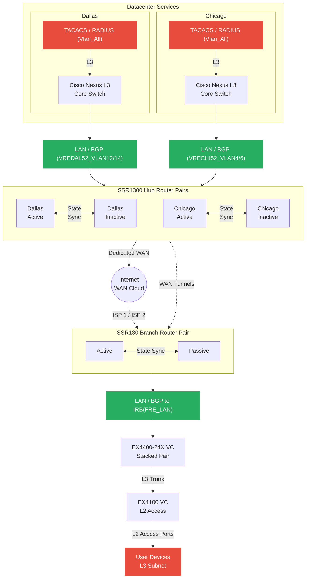

# Network Routing Diagram

Vertical 8-level topology: two datacenters (Dallas, Chicago) with Juniper SSR1300 hub pairs,
a branch site with Juniper SSR130 router pair, EX4400/EX4100 switching, and full-mesh WAN tunnels.

## Legend

| Line Style | Meaning |
| - | - |
| Solid arrow | Physical link (LAN, WAN, trunk) |
| Dotted arrow | Logical WAN tunnel overlay (through public internet) |
| Bidirectional | State sync or route exchange between peers |

## Hardware Summary

| Level | Role | Hardware |
| - | - | - |
| 1 | Authentication | TACACS / RADIUS servers (L3 subnet) |
| 2 | DC Core | Cisco Nexus L3 switches |
| 3 | DC Hub Routers | Juniper SSR1300 pairs (Active / Inactive) |
| 4 | WAN | Public Internet (dual dedicated + dual ISP) |
| 5 | Branch Routers | Juniper SSR130 pairs (Active / Passive) |
| 6 | Branch Distribution | Juniper EX4400-24X Virtual Chassis |
| 7 | Branch Access | Juniper EX4100 Virtual Chassis (L2 only) |
| 8 | Endpoints | User devices (L3 subnet) |
