<!-- The tool python -m tools.menu_api_map writes this page. Do not edit it by hand. -->

# Menu API endpoints: destructive

This page lists the Mist API endpoints of the 42 menu options in the `destructive` category.
A menu option in this category changes the Mist cloud configuration.

The index page explains how to read the map: [Menu API endpoint map](Menu-API-Endpoints).

Warning: a menu option in this category changes the live Mist cloud configuration. Make a change plan before you run one. The change can stop client traffic at a site.

## Overview

Each overview diagram links a menu option to the SDK families that it uses.
The section of each menu option has a second diagram.
That diagram links the menu option to the classes that send the requests, and each class to its endpoints.

```mermaid
flowchart LR
    m154["Menu 154: DESTRUCTIVE: Advanced AP firmware upg..."]
    m154 --> f_orgs_devices
    m154 --> f_sites_devices
    m154 --> f_const_device_models
    m154 --> f_msps_orgs
    m154 --> f_orgs_gatewaytemplates
    m154 --> f_orgs_logs
    m154 --> more154["5 more families"]
    m155["Menu 155: DESTRUCTIVE: Advanced Switch firmware..."]
    m155 --> f_sites_devices
    m155 --> f_orgs_devices
    m155 --> f_orgs_gatewaytemplates
    m155 --> f_orgs_inventory
    m155 --> f_orgs_orgs
    m155 --> f_orgs_sites
    m156["Menu 156: DESTRUCTIVE: Advanced SSR firmware up..."]
    m156 --> f_orgs_ssr
    m156 --> f_orgs_gatewaytemplates
    m156 --> f_orgs_inventory
    m156 --> f_orgs_orgs
    m156 --> f_orgs_sites
    m156 --> f_sites_devices
    m156 --> more156["1 more family"]
    m157["Menu 157: DESTRUCTIVE: Org-Level AP Firmware Up..."]
    m157 --> f_orgs_devices
    m157 --> f_msps_orgs
    m157 --> f_orgs_inventory
    m157 --> f_orgs_sites
    m157 --> f_orgs_stats
    m157 --> f_sites_devices
    m158["Menu 158: DESTRUCTIVE: Reboot all devices assoc..."]
    m158 --> f_sites_devices
    m158 --> f_orgs_devices
    m158 --> f_orgs_gatewaytemplates
    m158 --> f_orgs_inventory
    m158 --> f_orgs_sites
    m158 --> f_sites_stats
    m159["Menu 159: Bounce Switch/Gateway Port y/N confir..."]
    m159 --> f_sites_devices
    m159 --> f_sites_stats
    m159 --> f_websocket_channels
    m160["Menu 160: Reprovision Switch/Gateway y/N confir..."]
    m160 --> f_sites_devices
    m160 --> f_sites_stats
    m161["Menu 161: DESTRUCTIVE: Convert a virtual chassi..."]
    m161 --> f_orgs_inventory
    m161 --> f_orgs_sites
    m161 --> f_sites_devices
    m161 --> f_sites_sites
    m162["Menu 162: DESTRUCTIVE: Convert all virtual chas..."]
    m162 --> f_orgs_inventory
    m162 --> f_orgs_sites
    m162 --> f_sites_devices
    m163["Menu 163: DESTRUCTIVE: Update Gateway Templates..."]
    m163 --> f_orgs_gatewaytemplates
    m163 --> f_sites_devices
    m163 --> f_orgs_sites
    m164["Menu 164: DESTRUCTIVE: Apply Gateway Template C..."]
    m164 --> f_orgs_gatewaytemplates
    m164 --> f_orgs_sites
    m165["Menu 165: DESTRUCTIVE: Clone Gateway Template b..."]
    m165 --> f_orgs_gatewaytemplates
    m165 --> f_orgs_sites
    m165 --> f_sites_sites
    m166["Menu 166: DESTRUCTIVE: Configure WAN Probe Over..."]
    m166 --> f_orgs_gatewaytemplates
    m166 --> f_orgs_sites
    m167["Menu 167: DESTRUCTIVE: Configure WAN Probe on D..."]
    m167 --> f_sites_devices
    m167 --> f_orgs_gatewaytemplates
    m167 --> f_orgs_sites
    m168["Menu 168: Site Auto-Upgrade Configuration - Con..."]
    m168 --> f_sites_setting
    m168 --> f_msps_orgs
    m168 --> f_orgs_devices
    m168 --> f_orgs_sites
    f_const_device_models["const/device_models"]
    f_msps_orgs["msps/orgs"]
    f_orgs_devices["orgs/devices"]
    f_orgs_gatewaytemplates["orgs/gatewaytemplates"]
    f_orgs_inventory["orgs/inventory"]
    f_orgs_logs["orgs/logs"]
    f_orgs_orgs["orgs/orgs"]
    f_orgs_sites["orgs/sites"]
    f_orgs_ssr["orgs/ssr"]
    f_orgs_stats["orgs/stats"]
    f_sites_devices["sites/devices"]
    f_sites_setting["sites/setting"]
    f_sites_sites["sites/sites"]
    f_sites_stats["sites/stats"]
    f_websocket_channels["websocket channels"]
```

```mermaid
flowchart LR
    m169["Menu 169: DESTRUCTIVE: Site Analytics Configura..."]
    m169 --> f_sites_setting
    m169 --> f_orgs_sites
    m170["Menu 170: Bulk RADIUS WLAN Configuration - Conf..."]
    m170 --> f_orgs_wlans
    m170 --> f_sites_wlans
    m171["Menu 171: DESTRUCTIVE: Create 137 test sites fr..."]
    m171 --> f_orgs_sites
    m172["Menu 172: DESTRUCTIVE: Create country-specific..."]
    m172 --> f_orgs_rftemplates
    m172 --> f_orgs_deviceprofiles
    m172 --> f_orgs_sites
    m172 --> f_sites_sites
    m173["Menu 173: DESTRUCTIVE: Scan org for AP models a..."]
    m173 --> f_orgs_deviceprofiles
    m173 --> f_orgs_inventory
    m174["Menu 174: DESTRUCTIVE: Assign APs to Device Pro..."]
    m174 --> f_orgs_deviceprofiles
    m174 --> f_orgs_inventory
    m175["Menu 175: Enhanced SSH Command Runner - Execute..."]
    m176["Menu 176: SSH Runner - Target gateways by templ..."]
    m176 --> f_sites_devices
    m176 --> f_orgs_gatewaytemplates
    m176 --> f_orgs_inventory
    m176 --> f_orgs_sites
    m176 --> f_sites_stats
    m177["Menu 177: DESTRUCTIVE: Clear ARP Cache type CLEAR"]
    m177 --> f_sites_devices
    m177 --> f_sites_stats
    m178["Menu 178: DESTRUCTIVE: Clear BGP Routes type CLEAR"]
    m178 --> f_sites_devices
    m178 --> f_sites_stats
    m179["Menu 179: DESTRUCTIVE: Clear Session on SSR/SRX..."]
    m179 --> f_sites_devices
    m179 --> f_sites_stats
    m180["Menu 180: DESTRUCTIVE: Clear MAC Table type CLEAR"]
    m180 --> f_sites_devices
    m180 --> f_sites_stats
    m181["Menu 181: DESTRUCTIVE: Clear BPDU Errors on Swi..."]
    m181 --> f_sites_devices
    m181 --> f_sites_stats
    m182["Menu 182: DESTRUCTIVE: Clear Learned MACs from..."]
    m182 --> f_sites_devices
    m182 --> f_sites_stats
    m183["Menu 183: DESTRUCTIVE: Clear Policy Hit Count o..."]
    m183 --> f_sites_devices
    m183 --> f_sites_stats
    f_orgs_deviceprofiles["orgs/deviceprofiles"]
    f_orgs_gatewaytemplates["orgs/gatewaytemplates"]
    f_orgs_inventory["orgs/inventory"]
    f_orgs_rftemplates["orgs/rftemplates"]
    f_orgs_sites["orgs/sites"]
    f_orgs_wlans["orgs/wlans"]
    f_sites_devices["sites/devices"]
    f_sites_setting["sites/setting"]
    f_sites_sites["sites/sites"]
    f_sites_stats["sites/stats"]
    f_sites_wlans["sites/wlans"]
```

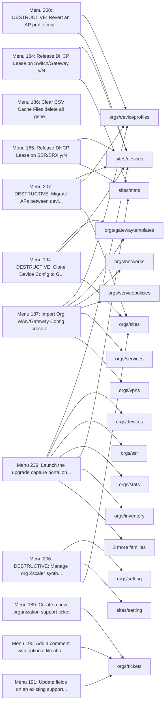

## Menu 154

- Title: DESTRUCTIVE: Advanced AP firmware upgrade with mode selection - upgrade by site list/selection or by Gateway Template assignment
- Handler: `lambda: _build_firmware_manager(MainEntrypoint.context.apisession, ConfigUtils.get_cached_or_prompted_org_id()).execute_firmware_upgrade_with_mode_selection()`
- Shared helpers: [`CacheUtils`](Menu-API-Endpoints#cacheutils), [`ConfigUtils`](Menu-API-Endpoints#configutils), [`DataExporter`](Menu-API-Endpoints#dataexporter), [`InputUtils`](Menu-API-Endpoints#inpututils), [`MainEntrypoint`](Menu-API-Endpoints#mainentrypoint), [`PromptUtils`](Menu-API-Endpoints#promptutils), [`SourceDependencyResolver`](Menu-API-Endpoints#sourcedependencyresolver), [`SourceDependencyResolverService`](Menu-API-Endpoints#sourcedependencyresolverservice)
- Endpoints: 17

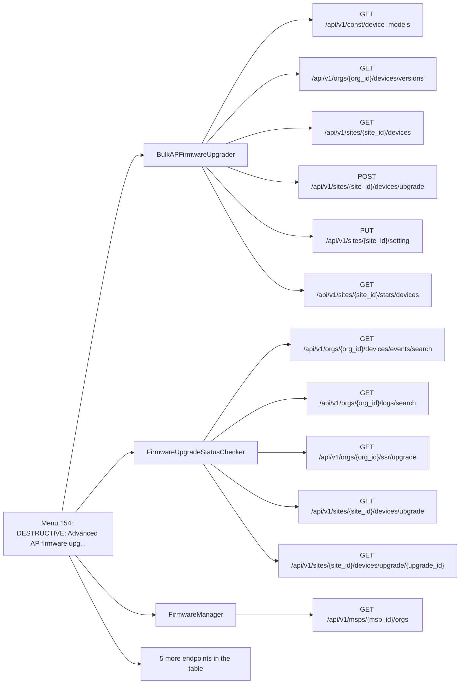

| Method | Path | SDK function | Called from | Found by |
| - | - | - | - | - |
| GET | `/api/v1/const/device_models` | [`const.device_models.listDeviceModels`](https://www.juniper.net/documentation/us/en/software/mist/api/http/api/constants/models/list-device-models) | [`BulkAPFirmwareUpgrader._request_device_models`](https://github.com/jmorrison-juniper/MistHelper/blob/main/src/firmware/bulk_ap_upgrader.py) | Reference |
| GET | `/api/v1/msps/{msp_id}/orgs` | [`msps.orgs.listMspOrgs`](https://www.juniper.net/documentation/us/en/software/mist/api/http/api/msps/orgs/list-msp-orgs) | [`FirmwareManager._fetch_msp_org_list`](https://github.com/jmorrison-juniper/MistHelper/blob/main/src/firmware/firmware_manager.py) | Call |
| GET | `/api/v1/orgs/{org_id}/devices/events/search` | [`orgs.devices.searchOrgDeviceEvents`](https://www.juniper.net/documentation/us/en/software/mist/api/http/api/orgs/devices/search-org-device-events) | [`FirmwareUpgradeStatusChecker._fetch_device_upgrade_events_24h`](https://github.com/jmorrison-juniper/MistHelper/blob/main/src/firmware/firmware_manager.py) | Call |
| GET | `/api/v1/orgs/{org_id}/devices/upgrade` | [`orgs.devices.listOrgDeviceUpgrades`](https://www.juniper.net/documentation/us/en/software/mist/api/http/api/utilities/upgrade/list-org-device-upgrades) | [`FirmwareManager._fetch_org_upgrade_jobs`](https://github.com/jmorrison-juniper/MistHelper/blob/main/src/firmware/firmware_manager.py) | Call |
| GET | `/api/v1/orgs/{org_id}/devices/upgrade/{upgrade_id}` | [`orgs.devices.getOrgDeviceUpgrade`](https://www.juniper.net/documentation/us/en/software/mist/api/http/api/utilities/upgrade/get-org-device-upgrade) | [`FirmwareManager._print_upgrade_job_detail_block`](https://github.com/jmorrison-juniper/MistHelper/blob/main/src/firmware/firmware_manager.py) | Call |
| GET | `/api/v1/orgs/{org_id}/devices/versions` | [`orgs.devices.listOrgAvailableDeviceVersions`](https://www.juniper.net/documentation/us/en/software/mist/api/http/api/utilities/upgrade/list-org-available-device-versions) | [`BulkAPFirmwareUpgrader._step4_fetch_available_firmware`](https://github.com/jmorrison-juniper/MistHelper/blob/main/src/firmware/bulk_ap_upgrader.py) | Call |
| GET | `/api/v1/orgs/{org_id}/gatewaytemplates` | [`orgs.gatewaytemplates.listOrgGatewayTemplates`](https://www.juniper.net/documentation/us/en/software/mist/api/http/api/orgs/gateway-templates/list-org-gateway-templates) | [`GatewayExportUtils.templates`](https://github.com/jmorrison-juniper/MistHelper/blob/main/src/gateway/gateway_export_utils.py) | Call |
| GET | `/api/v1/orgs/{org_id}/logs/search` | [`orgs.logs.listOrgAuditLogs`](https://www.juniper.net/documentation/us/en/software/mist/api/http/api/orgs/logs/list-org-audit-logs) | [`FirmwareUpgradeStatusChecker._fetch_audit_logs_24h`](https://github.com/jmorrison-juniper/MistHelper/blob/main/src/firmware/firmware_manager.py) | Call |
| GET | `/api/v1/orgs/{org_id}/sites` | [`orgs.sites.listOrgSites`](https://www.juniper.net/documentation/us/en/software/mist/api/http/api/orgs/sites/list-org-sites) | [`APICoreFetchUtils.all_sites_with_limit`](https://github.com/jmorrison-juniper/MistHelper/blob/main/src/api/api_core_fetch_utils.py) | Call |
| GET | `/api/v1/orgs/{org_id}/ssr/upgrade` | [`orgs.ssr.listOrgSsrUpgrades`](https://www.juniper.net/documentation/us/en/software/mist/api/http/api/utilities/upgrade/list-org-ssr-upgrades) | [`FirmwareUpgradeStatusChecker._fetch_ssr_upgrades_payload`](https://github.com/jmorrison-juniper/MistHelper/blob/main/src/firmware/firmware_manager.py) | Call |
| GET | `/api/v1/orgs/{org_id}/stats/devices` | [`orgs.stats.listOrgDevicesStats`](https://www.juniper.net/documentation/us/en/software/mist/api/http/api/orgs/stats/devices/list-org-devices-stats) | [`FirmwareManager._fetch_device_stats_for_monitoring`](https://github.com/jmorrison-juniper/MistHelper/blob/main/src/firmware/firmware_manager.py) | Call |
| GET | `/api/v1/sites/{site_id}/devices` | [`sites.devices.listSiteDevices`](https://www.juniper.net/documentation/us/en/software/mist/api/http/api/sites/devices/list-site-devices) | [`BulkAPFirmwareUpgrader._request_site_aps`](https://github.com/jmorrison-juniper/MistHelper/blob/main/src/firmware/bulk_ap_upgrader.py) | Call |
| GET | `/api/v1/sites/{site_id}/devices/upgrade` | [`sites.devices.listSiteDeviceUpgrades`](https://www.juniper.net/documentation/us/en/software/mist/api/http/api/utilities/upgrade/list-site-device-upgrades) | [`FirmwareUpgradeStatusChecker._check_single_site_upgrades`](https://github.com/jmorrison-juniper/MistHelper/blob/main/src/firmware/firmware_manager.py) | Call |
| POST | `/api/v1/sites/{site_id}/devices/upgrade` | [`sites.devices.upgradeSiteDevices`](https://www.juniper.net/documentation/us/en/software/mist/api/http/api/utilities/upgrade/upgrade-site-devices) | [`BulkAPFirmwareUpgrader._post_single_version_upgrade`](https://github.com/jmorrison-juniper/MistHelper/blob/main/src/firmware/bulk_ap_upgrader.py) | Call |
| GET | `/api/v1/sites/{site_id}/devices/upgrade/{upgrade_id}` | [`sites.devices.getSiteDeviceUpgrade`](https://www.juniper.net/documentation/us/en/software/mist/api/http/api/utilities/upgrade/get-site-device-upgrade) | [`FirmwareUpgradeStatusChecker._safe_get_site_upgrade_data`](https://github.com/jmorrison-juniper/MistHelper/blob/main/src/firmware/firmware_manager.py) | Call |
| PUT | `/api/v1/sites/{site_id}/setting` | [`sites.setting.updateSiteSettings`](https://www.juniper.net/documentation/us/en/software/mist/api/http/api/sites/setting/update-site-settings) | [`BulkAPFirmwareUpgrader._apply_settings_to_sites`](https://github.com/jmorrison-juniper/MistHelper/blob/main/src/firmware/bulk_ap_upgrader.py) | Call |
| GET | `/api/v1/sites/{site_id}/stats/devices` | [`sites.stats.listSiteDevicesStats`](https://www.juniper.net/documentation/us/en/software/mist/api/http/api/sites/stats/devices/list-site-devices-stats) | [`BulkAPFirmwareUpgrader._call_site_stats_api`](https://github.com/jmorrison-juniper/MistHelper/blob/main/src/firmware/bulk_ap_upgrader.py) | Call |

## Menu 155

- Title: DESTRUCTIVE: Advanced Switch firmware upgrade with mode selection - upgrade by site list/selection or by Gateway Template assignment
- Handler: `lambda: _build_firmware_manager(MainEntrypoint.context.apisession, ConfigUtils.get_cached_or_prompted_org_id()).execute_switch_firmware_upgrade_with_mode_sel...`
- Shared helpers: [`CacheUtils`](Menu-API-Endpoints#cacheutils), [`ConfigUtils`](Menu-API-Endpoints#configutils), [`DataExporter`](Menu-API-Endpoints#dataexporter), [`InputUtils`](Menu-API-Endpoints#inpututils), [`MainEntrypoint`](Menu-API-Endpoints#mainentrypoint), [`PromptUtils`](Menu-API-Endpoints#promptutils), [`SourceDependencyResolver`](Menu-API-Endpoints#sourcedependencyresolver), [`SourceDependencyResolverService`](Menu-API-Endpoints#sourcedependencyresolverservice)
- Endpoints: 7

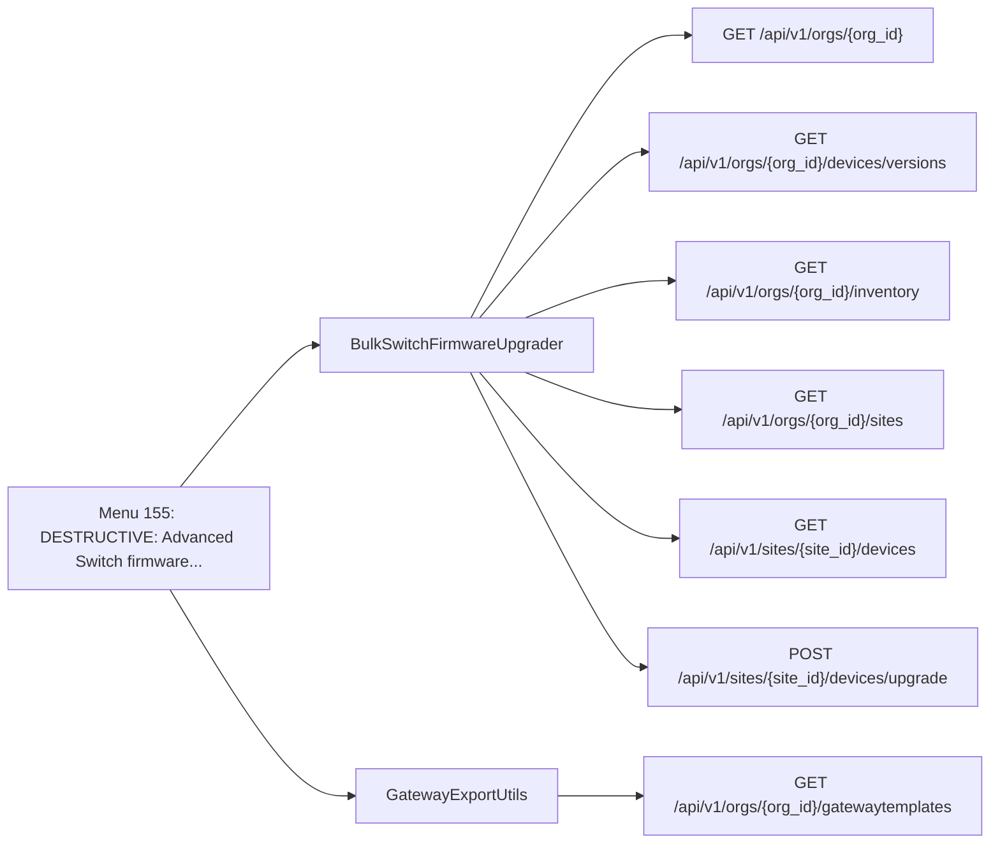

| Method | Path | SDK function | Called from | Found by |
| - | - | - | - | - |
| GET | `/api/v1/orgs/{org_id}` | [`orgs.orgs.getOrg`](https://www.juniper.net/documentation/us/en/software/mist/api/http/api/orgs/get-org) | [`BulkSwitchFirmwareUpgrader._validate_organization`](https://github.com/jmorrison-juniper/MistHelper/blob/main/src/firmware/bulk_switch_upgrader.py) | Call |
| GET | `/api/v1/orgs/{org_id}/devices/versions` | [`orgs.devices.listOrgAvailableDeviceVersions`](https://www.juniper.net/documentation/us/en/software/mist/api/http/api/utilities/upgrade/list-org-available-device-versions) | [`BulkSwitchFirmwareUpgrader._fetch_firmware_from_api`](https://github.com/jmorrison-juniper/MistHelper/blob/main/src/firmware/bulk_switch_upgrader.py) | Call |
| GET | `/api/v1/orgs/{org_id}/gatewaytemplates` | [`orgs.gatewaytemplates.listOrgGatewayTemplates`](https://www.juniper.net/documentation/us/en/software/mist/api/http/api/orgs/gateway-templates/list-org-gateway-templates) | [`GatewayExportUtils.templates`](https://github.com/jmorrison-juniper/MistHelper/blob/main/src/gateway/gateway_export_utils.py) | Call |
| GET | `/api/v1/orgs/{org_id}/inventory` | [`orgs.inventory.getOrgInventory`](https://www.juniper.net/documentation/us/en/software/mist/api/http/api/orgs/inventory/get-org-inventory) | [`BulkSwitchFirmwareUpgrader._call_inventory_api`](https://github.com/jmorrison-juniper/MistHelper/blob/main/src/firmware/bulk_switch_upgrader.py) | Call |
| GET | `/api/v1/orgs/{org_id}/sites` | [`orgs.sites.listOrgSites`](https://www.juniper.net/documentation/us/en/software/mist/api/http/api/orgs/sites/list-org-sites) | [`BulkSwitchFirmwareUpgrader._interactive_site_selection`](https://github.com/jmorrison-juniper/MistHelper/blob/main/src/firmware/bulk_switch_upgrader.py) | Call |
| GET | `/api/v1/sites/{site_id}/devices` | [`sites.devices.listSiteDevices`](https://www.juniper.net/documentation/us/en/software/mist/api/http/api/sites/devices/list-site-devices) | [`BulkSwitchFirmwareUpgrader._get_site_switches`](https://github.com/jmorrison-juniper/MistHelper/blob/main/src/firmware/bulk_switch_upgrader.py) | Call |
| POST | `/api/v1/sites/{site_id}/devices/upgrade` | [`sites.devices.upgradeSiteDevices`](https://www.juniper.net/documentation/us/en/software/mist/api/http/api/utilities/upgrade/upgrade-site-devices) | [`BulkSwitchFirmwareUpgrader._call_upgrade_api`](https://github.com/jmorrison-juniper/MistHelper/blob/main/src/firmware/bulk_switch_upgrader.py) | Call |

## Menu 156

- Title: DESTRUCTIVE: Advanced SSR firmware upgrade with mode selection - upgrade by site list/selection or by Gateway Template assignment
- Handler: `lambda: _build_firmware_manager(MainEntrypoint.context.apisession, ConfigUtils.get_cached_or_prompted_org_id()).execute_ssr_firmware_upgrade_with_mode_select...`
- Shared helpers: [`CacheUtils`](Menu-API-Endpoints#cacheutils), [`ConfigUtils`](Menu-API-Endpoints#configutils), [`DataExporter`](Menu-API-Endpoints#dataexporter), [`InputUtils`](Menu-API-Endpoints#inpututils), [`MainEntrypoint`](Menu-API-Endpoints#mainentrypoint), [`PromptUtils`](Menu-API-Endpoints#promptutils), [`SourceDependencyResolver`](Menu-API-Endpoints#sourcedependencyresolver), [`SourceDependencyResolverService`](Menu-API-Endpoints#sourcedependencyresolverservice)
- Endpoints: 8

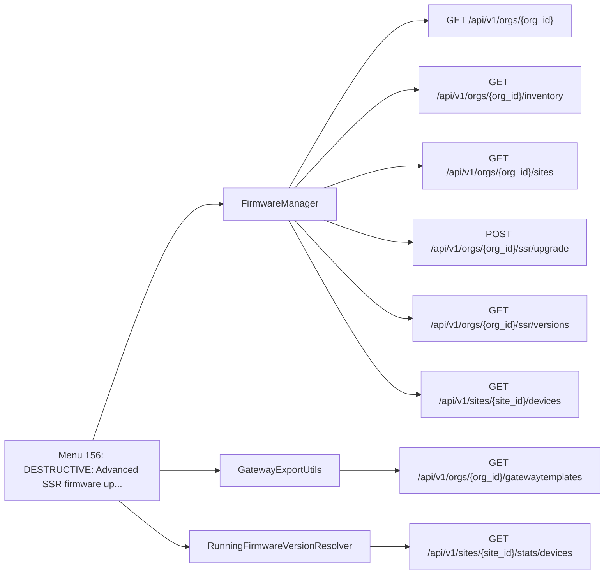

| Method | Path | SDK function | Called from | Found by |
| - | - | - | - | - |
| GET | `/api/v1/orgs/{org_id}` | [`orgs.orgs.getOrg`](https://www.juniper.net/documentation/us/en/software/mist/api/http/api/orgs/get-org) | [`FirmwareManager._validate_org_for_ssr_upgrade`](https://github.com/jmorrison-juniper/MistHelper/blob/main/src/firmware/firmware_manager.py) | Call |
| GET | `/api/v1/orgs/{org_id}/gatewaytemplates` | [`orgs.gatewaytemplates.listOrgGatewayTemplates`](https://www.juniper.net/documentation/us/en/software/mist/api/http/api/orgs/gateway-templates/list-org-gateway-templates) | [`GatewayExportUtils.templates`](https://github.com/jmorrison-juniper/MistHelper/blob/main/src/gateway/gateway_export_utils.py) | Call |
| GET | `/api/v1/orgs/{org_id}/inventory` | [`orgs.inventory.getOrgInventory`](https://www.juniper.net/documentation/us/en/software/mist/api/http/api/orgs/inventory/get-org-inventory) | [`FirmwareManager._fetch_org_gateway_inventory`](https://github.com/jmorrison-juniper/MistHelper/blob/main/src/firmware/firmware_manager.py) | Call |
| GET | `/api/v1/orgs/{org_id}/sites` | [`orgs.sites.listOrgSites`](https://www.juniper.net/documentation/us/en/software/mist/api/http/api/orgs/sites/list-org-sites) | [`FirmwareManager._select_ssr_sites_for_upgrade`](https://github.com/jmorrison-juniper/MistHelper/blob/main/src/firmware/firmware_manager.py) | Call |
| POST | `/api/v1/orgs/{org_id}/ssr/upgrade` | [`orgs.ssr.upgradeOrgSsrs`](https://www.juniper.net/documentation/us/en/software/mist/api/http/api/utilities/upgrade/upgrade-org-ssrs) | [`FirmwareManager._call_ssr_upgrade_api`](https://github.com/jmorrison-juniper/MistHelper/blob/main/src/firmware/firmware_manager.py) | Call |
| GET | `/api/v1/orgs/{org_id}/ssr/versions` | [`orgs.ssr.listOrgAvailableSsrVersions`](https://www.juniper.net/documentation/us/en/software/mist/api/http/api/utilities/upgrade/list-org-available-ssr-versions) | [`FirmwareManager._fetch_ssr_version_rows`](https://github.com/jmorrison-juniper/MistHelper/blob/main/src/firmware/firmware_manager.py) | Call |
| GET | `/api/v1/sites/{site_id}/devices` | [`sites.devices.listSiteDevices`](https://www.juniper.net/documentation/us/en/software/mist/api/http/api/sites/devices/list-site-devices) | [`FirmwareManager._fetch_site_gateway_devices`](https://github.com/jmorrison-juniper/MistHelper/blob/main/src/firmware/firmware_manager.py) | Call |
| GET | `/api/v1/sites/{site_id}/stats/devices` | [`sites.stats.listSiteDevicesStats`](https://www.juniper.net/documentation/us/en/software/mist/api/http/api/sites/stats/devices/list-site-devices-stats) | [`RunningFirmwareVersionResolver._resolve_stats_fn`](https://github.com/jmorrison-juniper/MistHelper/blob/main/src/firmware/running_version.py) | Reference |

## Menu 157

- Title: DESTRUCTIVE: Org-Level AP Firmware Upgrade - Efficient multi-site upgrade using org-level API (1 call per version vs 1 per site), MSP multi-org support, supports --dry-run
- Handler: `lambda: _build_org_ap_upgrader().run()`
- Shared helpers: [`ConfigUtils`](Menu-API-Endpoints#configutils), [`DataExporter`](Menu-API-Endpoints#dataexporter), [`InputUtils`](Menu-API-Endpoints#inpututils), [`MainEntrypoint`](Menu-API-Endpoints#mainentrypoint), [`SourceDependencyResolver`](Menu-API-Endpoints#sourcedependencyresolver)
- Endpoints: 7

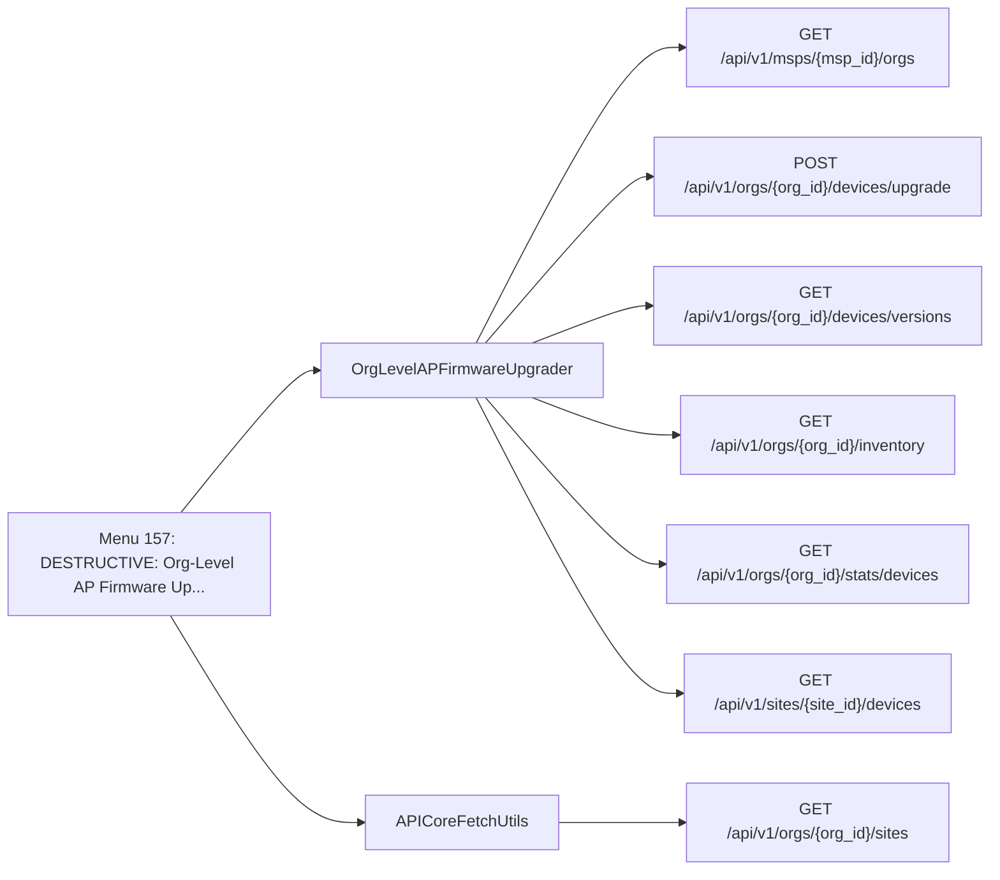

| Method | Path | SDK function | Called from | Found by |
| - | - | - | - | - |
| GET | `/api/v1/msps/{msp_id}/orgs` | [`msps.orgs.listMspOrgs`](https://www.juniper.net/documentation/us/en/software/mist/api/http/api/msps/orgs/list-msp-orgs) | [`OrgLevelAPFirmwareUpgrader._call_list_msp_orgs`](https://github.com/jmorrison-juniper/MistHelper/blob/main/src/firmware/org_ap_upgrader.py) | Call |
| POST | `/api/v1/orgs/{org_id}/devices/upgrade` | [`orgs.devices.upgradeOrgDevices`](https://www.juniper.net/documentation/us/en/software/mist/api/http/api/utilities/upgrade/upgrade-org-devices) | [`OrgLevelAPFirmwareUpgrader._execute_single_version_upgrade`](https://github.com/jmorrison-juniper/MistHelper/blob/main/src/firmware/org_ap_upgrader.py) | Call |
| GET | `/api/v1/orgs/{org_id}/devices/versions` | [`orgs.devices.listOrgAvailableDeviceVersions`](https://www.juniper.net/documentation/us/en/software/mist/api/http/api/utilities/upgrade/list-org-available-device-versions) | [`OrgLevelAPFirmwareUpgrader._load_available_versions`](https://github.com/jmorrison-juniper/MistHelper/blob/main/src/firmware/org_ap_upgrader.py) | Call |
| GET | `/api/v1/orgs/{org_id}/inventory` | [`orgs.inventory.getOrgInventory`](https://www.juniper.net/documentation/us/en/software/mist/api/http/api/orgs/inventory/get-org-inventory) | [`OrgLevelAPFirmwareUpgrader._call_get_org_inventory`](https://github.com/jmorrison-juniper/MistHelper/blob/main/src/firmware/org_ap_upgrader.py) | Call |
| GET | `/api/v1/orgs/{org_id}/sites` | [`orgs.sites.listOrgSites`](https://www.juniper.net/documentation/us/en/software/mist/api/http/api/orgs/sites/list-org-sites) | [`APICoreFetchUtils.all_sites_with_limit`](https://github.com/jmorrison-juniper/MistHelper/blob/main/src/api/api_core_fetch_utils.py) | Call |
| GET | `/api/v1/orgs/{org_id}/stats/devices` | [`orgs.stats.listOrgDevicesStats`](https://www.juniper.net/documentation/us/en/software/mist/api/http/api/orgs/stats/devices/list-org-devices-stats) | [`OrgLevelAPFirmwareUpgrader._fetch_ap_stats_data`](https://github.com/jmorrison-juniper/MistHelper/blob/main/src/firmware/org_ap_upgrader.py) | Call |
| GET | `/api/v1/sites/{site_id}/devices` | [`sites.devices.listSiteDevices`](https://www.juniper.net/documentation/us/en/software/mist/api/http/api/sites/devices/list-site-devices) | [`OrgLevelAPFirmwareUpgrader._call_list_site_devices`](https://github.com/jmorrison-juniper/MistHelper/blob/main/src/firmware/org_ap_upgrader.py) | Call |

## Menu 158

- Title: DESTRUCTIVE: Reboot all devices associated with templates listed in GatewayTemplateRebootList.CSV and log results
- Handler: `DeviceRebootManager.by_gateway_template_list`
- Shared helpers: [`CacheUtils`](Menu-API-Endpoints#cacheutils), [`ConfigUtils`](Menu-API-Endpoints#configutils), [`DataExporter`](Menu-API-Endpoints#dataexporter), [`InputUtils`](Menu-API-Endpoints#inpututils), [`SourceDependencyResolver`](Menu-API-Endpoints#sourcedependencyresolver)
- Endpoints: 8

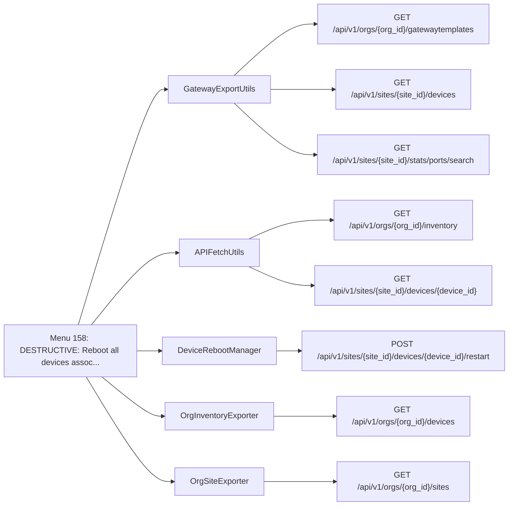

| Method | Path | SDK function | Called from | Found by |
| - | - | - | - | - |
| GET | `/api/v1/orgs/{org_id}/devices` | [`orgs.devices.listOrgDevices`](https://www.juniper.net/documentation/us/en/software/mist/api/http/api/orgs/devices/list-org-devices) | [`OrgInventoryExporter.devices`](https://github.com/jmorrison-juniper/MistHelper/blob/main/src/export/org_inventory_exporter.py) | Reference |
| GET | `/api/v1/orgs/{org_id}/gatewaytemplates` | [`orgs.gatewaytemplates.listOrgGatewayTemplates`](https://www.juniper.net/documentation/us/en/software/mist/api/http/api/orgs/gateway-templates/list-org-gateway-templates) | [`GatewayExportUtils.templates`](https://github.com/jmorrison-juniper/MistHelper/blob/main/src/gateway/gateway_export_utils.py) | Call |
| GET | `/api/v1/orgs/{org_id}/inventory` | [`orgs.inventory.getOrgInventory`](https://www.juniper.net/documentation/us/en/software/mist/api/http/api/orgs/inventory/get-org-inventory) | [`APIFetchUtils._gw_load_inventory`](https://github.com/jmorrison-juniper/MistHelper/blob/main/src/api/api_fetch_utils.py) | Call |
| GET | `/api/v1/orgs/{org_id}/sites` | [`orgs.sites.listOrgSites`](https://www.juniper.net/documentation/us/en/software/mist/api/http/api/orgs/sites/list-org-sites) | [`OrgSiteExporter.sites`](https://github.com/jmorrison-juniper/MistHelper/blob/main/src/export/org_site_exporter.py) | Reference |
| GET | `/api/v1/sites/{site_id}/devices` | [`sites.devices.listSiteDevices`](https://www.juniper.net/documentation/us/en/software/mist/api/http/api/sites/devices/list-site-devices) | [`GatewayExportUtils.device_configs`](https://github.com/jmorrison-juniper/MistHelper/blob/main/src/gateway/gateway_export_utils.py) | Name |
| GET | `/api/v1/sites/{site_id}/devices/{device_id}` | [`sites.devices.getSiteDevice`](https://www.juniper.net/documentation/us/en/software/mist/api/http/api/sites/devices/get-site-device) | [`APIFetchUtils._gw_fetch_one_config`](https://github.com/jmorrison-juniper/MistHelper/blob/main/src/api/api_fetch_utils.py) | Call |
| POST | `/api/v1/sites/{site_id}/devices/{device_id}/restart` | [`sites.devices.restartSiteDevice`](https://www.juniper.net/documentation/us/en/software/mist/api/http/api/utilities/common/restart-site-device) | [`DeviceRebootManager._reboot_one_device`](https://github.com/jmorrison-juniper/MistHelper/blob/main/src/device/device_reboot_manager.py) | Call |
| GET | `/api/v1/sites/{site_id}/stats/ports/search` | [`sites.stats.searchSiteSwOrGwPorts`](https://www.juniper.net/documentation/us/en/software/mist/api/http/api/sites/stats/ports/search-site-sw-or-gw-ports) | [`GatewayExportUtils._save_filtered_port_configs`](https://github.com/jmorrison-juniper/MistHelper/blob/main/src/gateway/gateway_export_utils.py) | Name |

## Menu 159

- Title: Bounce Switch/Gateway Port (y/N confirmation)
- Handler: `lambda: _get_duc_instance().bounce_port()`
- Shared helpers: [`DataExporter`](Menu-API-Endpoints#dataexporter), [`InputUtils`](Menu-API-Endpoints#inpututils), [`MainEntrypoint`](Menu-API-Endpoints#mainentrypoint), [`PromptUtils`](Menu-API-Endpoints#promptutils)
- Endpoints: 3

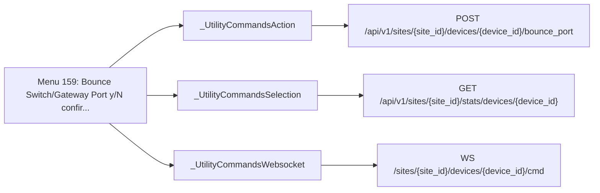

| Method | Path | SDK function | Called from | Found by |
| - | - | - | - | - |
| POST | `/api/v1/sites/{site_id}/devices/{device_id}/bounce_port` | [`sites.devices.bounceDevicePort`](https://www.juniper.net/documentation/us/en/software/mist/api/http/api/utilities/common/bounce-device-port) | [`_UtilityCommandsAction._invoke_port_bounce`](https://github.com/jmorrison-juniper/MistHelper/blob/main/src/device/_utility_commands_action.py) | Reference |
| GET | `/api/v1/sites/{site_id}/stats/devices/{device_id}` | [`sites.stats.getSiteDeviceStats`](https://www.juniper.net/documentation/us/en/software/mist/api/http/api/sites/stats/devices/get-site-device-stats) | [`_UtilityCommandsSelection._get_device_info`](https://github.com/jmorrison-juniper/MistHelper/blob/main/src/device/_utility_commands_selection.py) | Call |
| WS | `/sites/{site_id}/devices/{device_id}/cmd` | None (WebSocket channel) | [`_UtilityCommandsWebsocket._prepare_ws_channel`](https://github.com/jmorrison-juniper/MistHelper/blob/main/src/device/_utility_commands_websocket.py) | Channel |

## Menu 160

- Title: Reprovision Switch/Gateway (y/N confirmation)
- Handler: `lambda: _get_duc_instance().reprovision_device()`
- Shared helpers: [`DataExporter`](Menu-API-Endpoints#dataexporter), [`InputUtils`](Menu-API-Endpoints#inpututils), [`MainEntrypoint`](Menu-API-Endpoints#mainentrypoint), [`PromptUtils`](Menu-API-Endpoints#promptutils)
- Endpoints: 2

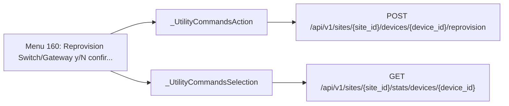

| Method | Path | SDK function | Called from | Found by |
| - | - | - | - | - |
| POST | `/api/v1/sites/{site_id}/devices/{device_id}/reprovision` | [`sites.devices.reprovisionSiteOctermDevice`](https://www.juniper.net/documentation/us/en/software/mist/api/http/api/utilities/common/reprovision-site-octerm-device) | [`_UtilityCommandsAction._invoke_reprovision`](https://github.com/jmorrison-juniper/MistHelper/blob/main/src/device/_utility_commands_action.py) | Call |
| GET | `/api/v1/sites/{site_id}/stats/devices/{device_id}` | [`sites.stats.getSiteDeviceStats`](https://www.juniper.net/documentation/us/en/software/mist/api/http/api/sites/stats/devices/get-site-device-stats) | [`_UtilityCommandsSelection._get_device_info`](https://github.com/jmorrison-juniper/MistHelper/blob/main/src/device/_utility_commands_selection.py) | Call |

## Menu 161

- Title: DESTRUCTIVE: Convert a virtual chassis switch to virtual MAC (interactive, supports --dry-run)
- Handler: `lambda dry_run=False: _configure_virtual_chassis_manager().launch_convert_single(dry_run=dry_run)`
- Shared helpers: [`CacheUtils`](Menu-API-Endpoints#cacheutils), [`InputUtils`](Menu-API-Endpoints#inpututils), [`MainEntrypoint`](Menu-API-Endpoints#mainentrypoint), [`PromptUtils`](Menu-API-Endpoints#promptutils), [`SourceDependencyResolver`](Menu-API-Endpoints#sourcedependencyresolver)
- Endpoints: 4

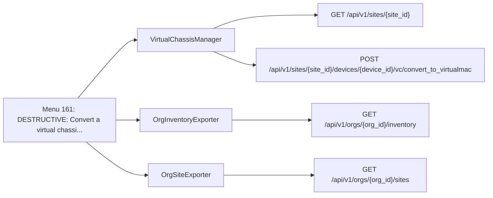

| Method | Path | SDK function | Called from | Found by |
| - | - | - | - | - |
| GET | `/api/v1/orgs/{org_id}/inventory` | [`orgs.inventory.getOrgInventory`](https://www.juniper.net/documentation/us/en/software/mist/api/http/api/orgs/inventory/get-org-inventory) | [`OrgInventoryExporter.inventory`](https://github.com/jmorrison-juniper/MistHelper/blob/main/src/export/org_inventory_exporter.py) | Reference |
| GET | `/api/v1/orgs/{org_id}/sites` | [`orgs.sites.listOrgSites`](https://www.juniper.net/documentation/us/en/software/mist/api/http/api/orgs/sites/list-org-sites) | [`OrgSiteExporter.sites`](https://github.com/jmorrison-juniper/MistHelper/blob/main/src/export/org_site_exporter.py) | Reference |
| GET | `/api/v1/sites/{site_id}` | [`sites.sites.getSiteInfo`](https://www.juniper.net/documentation/us/en/software/mist/api/http/api/sites/get-site-info) | [`VirtualChassisManager._get_site_name`](https://github.com/jmorrison-juniper/MistHelper/blob/main/src/device/virtual_chassis.py) | Call |
| POST | `/api/v1/sites/{site_id}/devices/{device_id}/vc/convert_to_virtualmac` | [`sites.devices.convertSiteVirtualChassisToVirtualMac`](https://www.juniper.net/documentation/us/en/software/mist/api/http/api/sites/devices/wired/virtual-chassis/convert-site-virtual-chassis-to-virtual-mac) | [`VirtualChassisManager._execute_conversion`](https://github.com/jmorrison-juniper/MistHelper/blob/main/src/device/virtual_chassis.py) | Call |

## Menu 162

- Title: DESTRUCTIVE: Convert all virtual chassis switches in sites listed in VCConvert.CSV (bulk operation)
- Handler: `lambda: _configure_virtual_chassis_manager().launch_convert_by_site_list()`
- Shared helpers: [`CacheUtils`](Menu-API-Endpoints#cacheutils), [`InputUtils`](Menu-API-Endpoints#inpututils), [`MainEntrypoint`](Menu-API-Endpoints#mainentrypoint), [`SourceDependencyResolver`](Menu-API-Endpoints#sourcedependencyresolver)
- Endpoints: 3

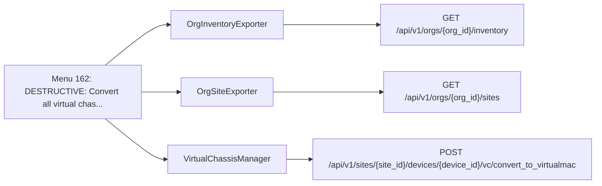

| Method | Path | SDK function | Called from | Found by |
| - | - | - | - | - |
| GET | `/api/v1/orgs/{org_id}/inventory` | [`orgs.inventory.getOrgInventory`](https://www.juniper.net/documentation/us/en/software/mist/api/http/api/orgs/inventory/get-org-inventory) | [`OrgInventoryExporter.inventory`](https://github.com/jmorrison-juniper/MistHelper/blob/main/src/export/org_inventory_exporter.py) | Reference |
| GET | `/api/v1/orgs/{org_id}/sites` | [`orgs.sites.listOrgSites`](https://www.juniper.net/documentation/us/en/software/mist/api/http/api/orgs/sites/list-org-sites) | [`OrgSiteExporter.sites`](https://github.com/jmorrison-juniper/MistHelper/blob/main/src/export/org_site_exporter.py) | Reference |
| POST | `/api/v1/sites/{site_id}/devices/{device_id}/vc/convert_to_virtualmac` | [`sites.devices.convertSiteVirtualChassisToVirtualMac`](https://www.juniper.net/documentation/us/en/software/mist/api/http/api/sites/devices/wired/virtual-chassis/convert-site-virtual-chassis-to-virtual-mac) | [`VirtualChassisManager._call_convert_api`](https://github.com/jmorrison-juniper/MistHelper/blob/main/src/device/virtual_chassis.py) | Call |

## Menu 163

- Title: DESTRUCTIVE: Update Gateway Templates to Use WAN2 Variable - Replace hardcoded 'ge-0/0/1' references with {{wan2_interface}} variable (Requires uppercase 'MIGRATE' confirmation, supports --dry-run)
- Handler: `_dispatch_gateway_wan2_variable_migration`
- Shared helpers: [`CacheUtils`](Menu-API-Endpoints#cacheutils), [`ConfigUtils`](Menu-API-Endpoints#configutils), [`DataExporter`](Menu-API-Endpoints#dataexporter), [`InputUtils`](Menu-API-Endpoints#inpututils), [`MainEntrypoint`](Menu-API-Endpoints#mainentrypoint), [`SourceDependencyResolver`](Menu-API-Endpoints#sourcedependencyresolver)
- Endpoints: 7

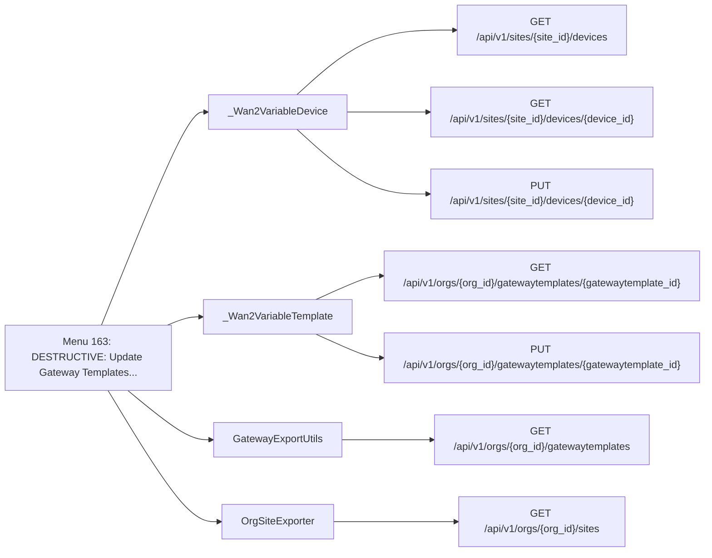

| Method | Path | SDK function | Called from | Found by |
| - | - | - | - | - |
| GET | `/api/v1/orgs/{org_id}/gatewaytemplates` | [`orgs.gatewaytemplates.listOrgGatewayTemplates`](https://www.juniper.net/documentation/us/en/software/mist/api/http/api/orgs/gateway-templates/list-org-gateway-templates) | [`GatewayExportUtils.templates`](https://github.com/jmorrison-juniper/MistHelper/blob/main/src/gateway/gateway_export_utils.py) | Call |
| GET | `/api/v1/orgs/{org_id}/gatewaytemplates/{gatewaytemplate_id}` | [`orgs.gatewaytemplates.getOrgGatewayTemplate`](https://www.juniper.net/documentation/us/en/software/mist/api/http/api/orgs/gateway-templates/get-org-gateway-template) | [`_Wan2VariableTemplate._get_template_config_dict`](https://github.com/jmorrison-juniper/MistHelper/blob/main/src/gateway/_wan2_variable_template.py) | Call |
| PUT | `/api/v1/orgs/{org_id}/gatewaytemplates/{gatewaytemplate_id}` | [`orgs.gatewaytemplates.updateOrgGatewayTemplate`](https://www.juniper.net/documentation/us/en/software/mist/api/http/api/orgs/gateway-templates/update-org-gateway-template) | [`_Wan2VariableTemplate._commit_template_or_dry_run`](https://github.com/jmorrison-juniper/MistHelper/blob/main/src/gateway/_wan2_variable_template.py) | Call |
| GET | `/api/v1/orgs/{org_id}/sites` | [`orgs.sites.listOrgSites`](https://www.juniper.net/documentation/us/en/software/mist/api/http/api/orgs/sites/list-org-sites) | [`OrgSiteExporter.sites`](https://github.com/jmorrison-juniper/MistHelper/blob/main/src/export/org_site_exporter.py) | Reference |
| GET | `/api/v1/sites/{site_id}/devices` | [`sites.devices.listSiteDevices`](https://www.juniper.net/documentation/us/en/software/mist/api/http/api/sites/devices/list-site-devices) | [`_Wan2VariableDevice._scan_one_site`](https://github.com/jmorrison-juniper/MistHelper/blob/main/src/gateway/_wan2_variable_device.py) | Call |
| GET | `/api/v1/sites/{site_id}/devices/{device_id}` | [`sites.devices.getSiteDevice`](https://www.juniper.net/documentation/us/en/software/mist/api/http/api/sites/devices/get-site-device) | [`_Wan2VariableDevice._check_device_override`](https://github.com/jmorrison-juniper/MistHelper/blob/main/src/gateway/_wan2_variable_device.py) | Call |
| PUT | `/api/v1/sites/{site_id}/devices/{device_id}` | [`sites.devices.updateSiteDevice`](https://www.juniper.net/documentation/us/en/software/mist/api/http/api/sites/devices/update-site-device) | [`_Wan2VariableDevice._commit_device_or_dry_run`](https://github.com/jmorrison-juniper/MistHelper/blob/main/src/gateway/_wan2_variable_device.py) | Call |

## Menu 164

- Title: DESTRUCTIVE: Apply Gateway Template Configuration - Replicate extracted configs to other templates (Requires uppercase 'APPLY' confirmation)
- Handler: `lambda: GlobalImportManager.GatewayTemplateConfigManagerFactory().build().apply()`
- Shared helpers: [`CacheUtils`](Menu-API-Endpoints#cacheutils), [`ConfigUtils`](Menu-API-Endpoints#configutils), [`DataExporter`](Menu-API-Endpoints#dataexporter), [`InputUtils`](Menu-API-Endpoints#inpututils), [`MainEntrypoint`](Menu-API-Endpoints#mainentrypoint), [`SourceDependencyResolver`](Menu-API-Endpoints#sourcedependencyresolver)
- Endpoints: 4

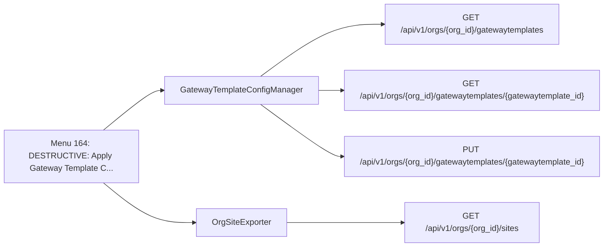

| Method | Path | SDK function | Called from | Found by |
| - | - | - | - | - |
| GET | `/api/v1/orgs/{org_id}/gatewaytemplates` | [`orgs.gatewaytemplates.listOrgGatewayTemplates`](https://www.juniper.net/documentation/us/en/software/mist/api/http/api/orgs/gateway-templates/list-org-gateway-templates) | [`GatewayTemplateConfigManager._fetch_templates`](https://github.com/jmorrison-juniper/MistHelper/blob/main/src/gateway/template_config.py) | Call |
| GET | `/api/v1/orgs/{org_id}/gatewaytemplates/{gatewaytemplate_id}` | [`orgs.gatewaytemplates.getOrgGatewayTemplate`](https://www.juniper.net/documentation/us/en/software/mist/api/http/api/orgs/gateway-templates/get-org-gateway-template) | [`GatewayTemplateConfigManager._fetch_single_config`](https://github.com/jmorrison-juniper/MistHelper/blob/main/src/gateway/template_config.py) | Call |
| PUT | `/api/v1/orgs/{org_id}/gatewaytemplates/{gatewaytemplate_id}` | [`orgs.gatewaytemplates.updateOrgGatewayTemplate`](https://www.juniper.net/documentation/us/en/software/mist/api/http/api/orgs/gateway-templates/update-org-gateway-template) | [`GatewayTemplateConfigManager._push_template_update`](https://github.com/jmorrison-juniper/MistHelper/blob/main/src/gateway/template_config.py) | Call |
| GET | `/api/v1/orgs/{org_id}/sites` | [`orgs.sites.listOrgSites`](https://www.juniper.net/documentation/us/en/software/mist/api/http/api/orgs/sites/list-org-sites) | [`OrgSiteExporter.sites`](https://github.com/jmorrison-juniper/MistHelper/blob/main/src/export/org_site_exporter.py) | Reference |

## Menu 165

- Title: DESTRUCTIVE: Clone Gateway Template by State and Country - Create state/country-specific templates and assign sites (Requires uppercase 'CLONE' confirmation)
- Handler: `lambda: GlobalImportManager.GatewayTemplateConfigManagerFactory().build().clone_by_location()`
- Shared helpers: [`CacheUtils`](Menu-API-Endpoints#cacheutils), [`ConfigUtils`](Menu-API-Endpoints#configutils), [`DataExporter`](Menu-API-Endpoints#dataexporter), [`InputUtils`](Menu-API-Endpoints#inpututils), [`MainEntrypoint`](Menu-API-Endpoints#mainentrypoint), [`SourceDependencyResolver`](Menu-API-Endpoints#sourcedependencyresolver)
- Endpoints: 5

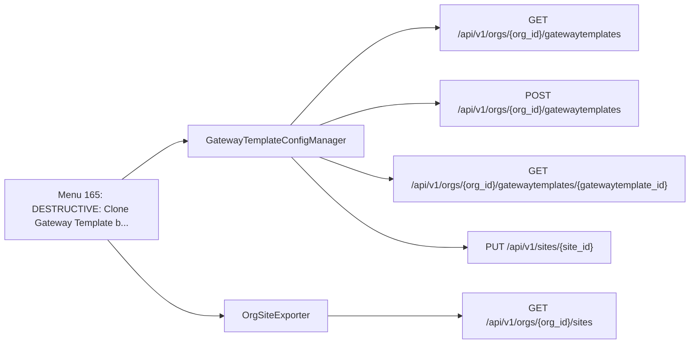

| Method | Path | SDK function | Called from | Found by |
| - | - | - | - | - |
| GET | `/api/v1/orgs/{org_id}/gatewaytemplates` | [`orgs.gatewaytemplates.listOrgGatewayTemplates`](https://www.juniper.net/documentation/us/en/software/mist/api/http/api/orgs/gateway-templates/list-org-gateway-templates) | [`GatewayTemplateConfigManager._get_existing_template_names`](https://github.com/jmorrison-juniper/MistHelper/blob/main/src/gateway/template_config.py) | Call |
| POST | `/api/v1/orgs/{org_id}/gatewaytemplates` | [`orgs.gatewaytemplates.createOrgGatewayTemplate`](https://www.juniper.net/documentation/us/en/software/mist/api/http/api/orgs/gateway-templates/create-org-gateway-template) | [`GatewayTemplateConfigManager._create_single_template`](https://github.com/jmorrison-juniper/MistHelper/blob/main/src/gateway/template_config.py) | Call |
| GET | `/api/v1/orgs/{org_id}/gatewaytemplates/{gatewaytemplate_id}` | [`orgs.gatewaytemplates.getOrgGatewayTemplate`](https://www.juniper.net/documentation/us/en/software/mist/api/http/api/orgs/gateway-templates/get-org-gateway-template) | [`GatewayTemplateConfigManager._call_get_template`](https://github.com/jmorrison-juniper/MistHelper/blob/main/src/gateway/template_config.py) | Call |
| GET | `/api/v1/orgs/{org_id}/sites` | [`orgs.sites.listOrgSites`](https://www.juniper.net/documentation/us/en/software/mist/api/http/api/orgs/sites/list-org-sites) | [`OrgSiteExporter.sites`](https://github.com/jmorrison-juniper/MistHelper/blob/main/src/export/org_site_exporter.py) | Reference |
| PUT | `/api/v1/sites/{site_id}` | [`sites.sites.updateSiteInfo`](https://www.juniper.net/documentation/us/en/software/mist/api/http/api/sites/update-site-info) | [`GatewayTemplateConfigManager._update_site_template`](https://github.com/jmorrison-juniper/MistHelper/blob/main/src/gateway/template_config.py) | Call |

## Menu 166

- Title: DESTRUCTIVE: Configure WAN Probe Override on Gateway Templates - Set ICMP probe IPs and profile for all WAN interfaces (Requires uppercase 'APPLY' confirmation, supports --dry-run)
- Handler: `lambda dry_run=False: WANProbeConfigManager.configure(dry_run=dry_run)`
- Shared helpers: [`CacheUtils`](Menu-API-Endpoints#cacheutils), [`ConfigUtils`](Menu-API-Endpoints#configutils), [`DataExporter`](Menu-API-Endpoints#dataexporter), [`InputUtils`](Menu-API-Endpoints#inpututils), [`RateLimitingUtils`](Menu-API-Endpoints#ratelimitingutils), [`SourceDependencyResolver`](Menu-API-Endpoints#sourcedependencyresolver)
- Endpoints: 4

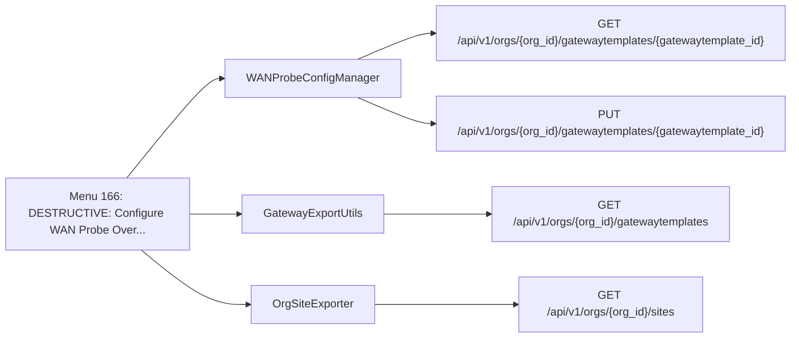

| Method | Path | SDK function | Called from | Found by |
| - | - | - | - | - |
| GET | `/api/v1/orgs/{org_id}/gatewaytemplates` | [`orgs.gatewaytemplates.listOrgGatewayTemplates`](https://www.juniper.net/documentation/us/en/software/mist/api/http/api/orgs/gateway-templates/list-org-gateway-templates) | [`GatewayExportUtils.templates`](https://github.com/jmorrison-juniper/MistHelper/blob/main/src/gateway/gateway_export_utils.py) | Call |
| GET | `/api/v1/orgs/{org_id}/gatewaytemplates/{gatewaytemplate_id}` | [`orgs.gatewaytemplates.getOrgGatewayTemplate`](https://www.juniper.net/documentation/us/en/software/mist/api/http/api/orgs/gateway-templates/get-org-gateway-template) | [`WANProbeConfigManager._fetch_template_config`](https://github.com/jmorrison-juniper/MistHelper/blob/main/src/refactors/wanprobe_config_manager.py) | Call |
| PUT | `/api/v1/orgs/{org_id}/gatewaytemplates/{gatewaytemplate_id}` | [`orgs.gatewaytemplates.updateOrgGatewayTemplate`](https://www.juniper.net/documentation/us/en/software/mist/api/http/api/orgs/gateway-templates/update-org-gateway-template) | [`WANProbeConfigManager._persist_template_update`](https://github.com/jmorrison-juniper/MistHelper/blob/main/src/refactors/wanprobe_config_manager.py) | Call |
| GET | `/api/v1/orgs/{org_id}/sites` | [`orgs.sites.listOrgSites`](https://www.juniper.net/documentation/us/en/software/mist/api/http/api/orgs/sites/list-org-sites) | [`OrgSiteExporter.sites`](https://github.com/jmorrison-juniper/MistHelper/blob/main/src/export/org_site_exporter.py) | Reference |

## Menu 167

- Title: DESTRUCTIVE: Configure WAN Probe on Device Port Overrides - Set ICMP probe on device-level WAN overrides only (Requires uppercase 'APPLY' confirmation, supports --dry-run)
- Handler: `lambda dry_run=False: WANProbeDeviceOverrideManager.configure(dry_run=dry_run)`
- Shared helpers: [`CacheUtils`](Menu-API-Endpoints#cacheutils), [`ConfigUtils`](Menu-API-Endpoints#configutils), [`DataExporter`](Menu-API-Endpoints#dataexporter), [`InputUtils`](Menu-API-Endpoints#inpututils), [`SourceDependencyResolver`](Menu-API-Endpoints#sourcedependencyresolver)
- Endpoints: 5

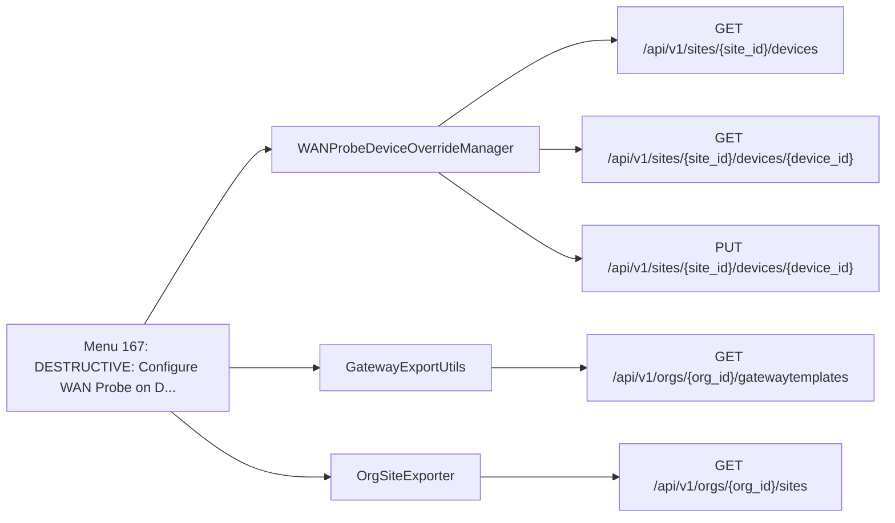

| Method | Path | SDK function | Called from | Found by |
| - | - | - | - | - |
| GET | `/api/v1/orgs/{org_id}/gatewaytemplates` | [`orgs.gatewaytemplates.listOrgGatewayTemplates`](https://www.juniper.net/documentation/us/en/software/mist/api/http/api/orgs/gateway-templates/list-org-gateway-templates) | [`GatewayExportUtils.templates`](https://github.com/jmorrison-juniper/MistHelper/blob/main/src/gateway/gateway_export_utils.py) | Call |
| GET | `/api/v1/orgs/{org_id}/sites` | [`orgs.sites.listOrgSites`](https://www.juniper.net/documentation/us/en/software/mist/api/http/api/orgs/sites/list-org-sites) | [`OrgSiteExporter.sites`](https://github.com/jmorrison-juniper/MistHelper/blob/main/src/export/org_site_exporter.py) | Reference |
| GET | `/api/v1/sites/{site_id}/devices` | [`sites.devices.listSiteDevices`](https://www.juniper.net/documentation/us/en/software/mist/api/http/api/sites/devices/list-site-devices) | [`WANProbeDeviceOverrideManager._scan_single_site`](https://github.com/jmorrison-juniper/MistHelper/blob/main/src/gateway/wan_probe_device_override_manager.py) | Call |
| GET | `/api/v1/sites/{site_id}/devices/{device_id}` | [`sites.devices.getSiteDevice`](https://www.juniper.net/documentation/us/en/software/mist/api/http/api/sites/devices/get-site-device) | [`WANProbeDeviceOverrideManager._fetch_device_config`](https://github.com/jmorrison-juniper/MistHelper/blob/main/src/gateway/wan_probe_device_override_manager.py) | Call |
| PUT | `/api/v1/sites/{site_id}/devices/{device_id}` | [`sites.devices.updateSiteDevice`](https://www.juniper.net/documentation/us/en/software/mist/api/http/api/sites/devices/update-site-device) | [`WANProbeDeviceOverrideManager._commit_device_update`](https://github.com/jmorrison-juniper/MistHelper/blob/main/src/gateway/wan_probe_device_override_manager.py) | Call |

## Menu 168

- Title: Site Auto-Upgrade Configuration - Configure AP auto-upgrade settings for sites with MSP multi-org support (supports --dry-run)
- Handler: `lambda: SiteAutoUpgradeConfigurator.execute(apisession=MainEntrypoint.context.apisession, msp_privileges=MainEntrypoint.context.msp_privileges if MainEntrypo...`
- Shared helpers: [`ConfigUtils`](Menu-API-Endpoints#configutils), [`DataExporter`](Menu-API-Endpoints#dataexporter), [`InputUtils`](Menu-API-Endpoints#inpututils), [`MainEntrypoint`](Menu-API-Endpoints#mainentrypoint), [`SourceDependencyResolver`](Menu-API-Endpoints#sourcedependencyresolver)
- Endpoints: 5

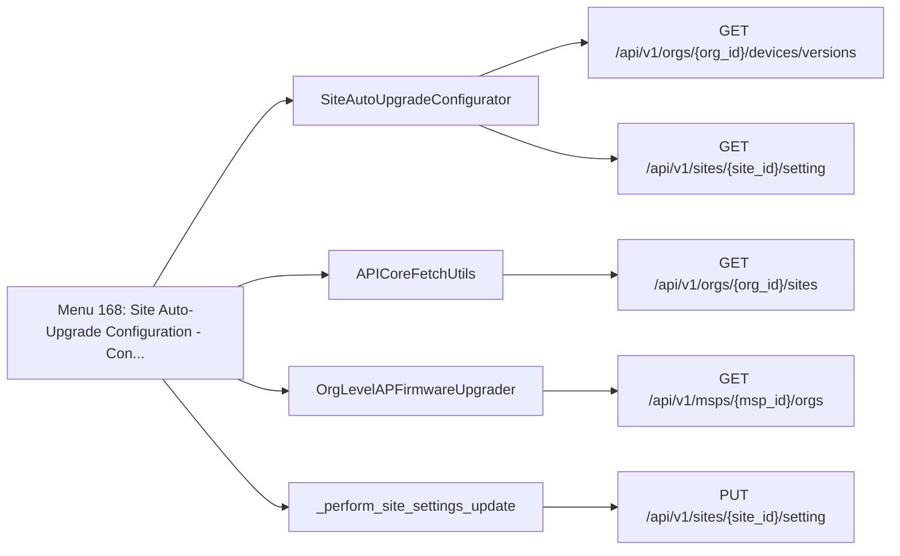

| Method | Path | SDK function | Called from | Found by |
| - | - | - | - | - |
| GET | `/api/v1/msps/{msp_id}/orgs` | [`msps.orgs.listMspOrgs`](https://www.juniper.net/documentation/us/en/software/mist/api/http/api/msps/orgs/list-msp-orgs) | [`OrgLevelAPFirmwareUpgrader._call_list_msp_orgs`](https://github.com/jmorrison-juniper/MistHelper/blob/main/src/firmware/org_ap_upgrader.py) | Call |
| GET | `/api/v1/orgs/{org_id}/devices/versions` | [`orgs.devices.listOrgAvailableDeviceVersions`](https://www.juniper.net/documentation/us/en/software/mist/api/http/api/utilities/upgrade/list-org-available-device-versions) | [`SiteAutoUpgradeConfigurator._fetch_available_versions_payload`](https://github.com/jmorrison-juniper/MistHelper/blob/main/src/firmware/site_auto_upgrade.py) | Call |
| GET | `/api/v1/orgs/{org_id}/sites` | [`orgs.sites.listOrgSites`](https://www.juniper.net/documentation/us/en/software/mist/api/http/api/orgs/sites/list-org-sites) | [`APICoreFetchUtils.all_sites_with_limit`](https://github.com/jmorrison-juniper/MistHelper/blob/main/src/api/api_core_fetch_utils.py) | Call |
| GET | `/api/v1/sites/{site_id}/setting` | [`sites.setting.getSiteSetting`](https://www.juniper.net/documentation/us/en/software/mist/api/http/api/sites/setting/get-site-setting) | [`SiteAutoUpgradeConfigurator._read_site_settings_payload`](https://github.com/jmorrison-juniper/MistHelper/blob/main/src/firmware/site_auto_upgrade.py) | Call |
| PUT | `/api/v1/sites/{site_id}/setting` | [`sites.setting.updateSiteSettings`](https://www.juniper.net/documentation/us/en/software/mist/api/http/api/sites/setting/update-site-settings) | [`_perform_site_settings_update`](https://github.com/jmorrison-juniper/MistHelper/blob/main/src/firmware/site_auto_upgrade.py) | Call |

## Menu 169

- Title: DESTRUCTIVE: Site Analytics Configuration - Apply standard RTSA/Rogue/Engagement/Occupancy settings to deviating sites
- Handler: `lambda: ExtractedSiteAnalyticsConfigurator.execute(SiteAnalyticsConfiguratorDeps(apisession=MainEntrypoint.context.apisession, mistapi=mistapi, get_org_id_fn...`
- Shared helpers: [`ConfigUtils`](Menu-API-Endpoints#configutils), [`DataExporter`](Menu-API-Endpoints#dataexporter), [`InputUtils`](Menu-API-Endpoints#inpututils), [`MainEntrypoint`](Menu-API-Endpoints#mainentrypoint), [`SourceDependencyResolver`](Menu-API-Endpoints#sourcedependencyresolver)
- Endpoints: 3

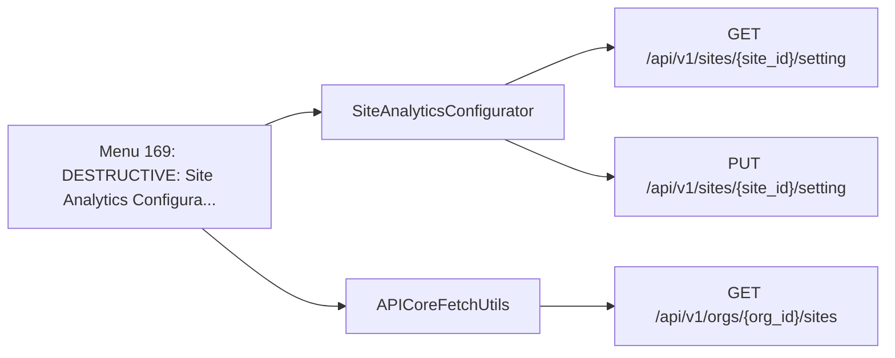

| Method | Path | SDK function | Called from | Found by |
| - | - | - | - | - |
| GET | `/api/v1/orgs/{org_id}/sites` | [`orgs.sites.listOrgSites`](https://www.juniper.net/documentation/us/en/software/mist/api/http/api/orgs/sites/list-org-sites) | [`APICoreFetchUtils.all_sites_with_limit`](https://github.com/jmorrison-juniper/MistHelper/blob/main/src/api/api_core_fetch_utils.py) | Call |
| GET | `/api/v1/sites/{site_id}/setting` | [`sites.setting.getSiteSetting`](https://www.juniper.net/documentation/us/en/software/mist/api/http/api/sites/setting/get-site-setting) | [`SiteAnalyticsConfigurator._fetch_current_settings`](https://github.com/jmorrison-juniper/MistHelper/blob/main/src/analytics/site_analytics_configurator.py) | Call |
| PUT | `/api/v1/sites/{site_id}/setting` | [`sites.setting.updateSiteSettings`](https://www.juniper.net/documentation/us/en/software/mist/api/http/api/sites/setting/update-site-settings) | [`SiteAnalyticsConfigurator._push_updated_settings`](https://github.com/jmorrison-juniper/MistHelper/blob/main/src/analytics/site_analytics_configurator.py) | Call |

## Menu 170

- Title: Bulk RADIUS WLAN Configuration - Configure auth_servers_timeout, auth_servers_retries, fast_dot1x_timers for org-level RADIUS WLANs
- Handler: `lambda dry_run=False: BulkRadiusWLANConfigManager().manage(dry_run=dry_run)`
- Shared helpers: [`ConfigUtils`](Menu-API-Endpoints#configutils), [`DataExporter`](Menu-API-Endpoints#dataexporter), [`InputUtils`](Menu-API-Endpoints#inpututils), [`RateLimitingUtils`](Menu-API-Endpoints#ratelimitingutils), [`SourceDependencyResolver`](Menu-API-Endpoints#sourcedependencyresolver)
- Endpoints: 3

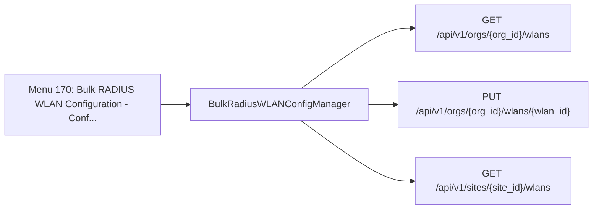

| Method | Path | SDK function | Called from | Found by |
| - | - | - | - | - |
| GET | `/api/v1/orgs/{org_id}/wlans` | [`orgs.wlans.listOrgWlans`](https://www.juniper.net/documentation/us/en/software/mist/api/http/api/orgs/wlans/list-org-wlans) | [`BulkRadiusWLANConfigManager._scan_org_wlans`](https://github.com/jmorrison-juniper/MistHelper/blob/main/src/site/bulk_radius_wlan_config_manager.py) | Call |
| PUT | `/api/v1/orgs/{org_id}/wlans/{wlan_id}` | [`orgs.wlans.updateOrgWlan`](https://www.juniper.net/documentation/us/en/software/mist/api/http/api/orgs/wlans/update-org-wlan) | [`BulkRadiusWLANConfigManager._call_wlan_update_api`](https://github.com/jmorrison-juniper/MistHelper/blob/main/src/site/bulk_radius_wlan_config_manager.py) | Call |
| GET | `/api/v1/sites/{site_id}/wlans` | [`sites.wlans.listSiteWlans`](https://www.juniper.net/documentation/us/en/software/mist/api/http/api/sites/wlans/list-site-wlans) | [`BulkRadiusWLANConfigManager._export_scan_snapshot`](https://github.com/jmorrison-juniper/MistHelper/blob/main/src/site/bulk_radius_wlan_config_manager.py) | Name |

## Menu 171

- Title: DESTRUCTIVE: Create 137 test sites from NorthAmericanTestSites.csv - Real landmarks across 13 North American countries (Requires uppercase 'CREATE' confirmation)
- Handler: `lambda: _configure_site_config_manager().create_test_sites_from_csv()`
- Shared helpers: [`ConfigUtils`](Menu-API-Endpoints#configutils), [`DataExporter`](Menu-API-Endpoints#dataexporter), [`InputUtils`](Menu-API-Endpoints#inpututils), [`MainEntrypoint`](Menu-API-Endpoints#mainentrypoint), [`RateLimitingUtils`](Menu-API-Endpoints#ratelimitingutils)
- Endpoints: 1

```mermaid
flowchart LR
    menu["Menu 171: DESTRUCTIVE: Create 137 test sites fr..."]
    menu --> c1["SiteConfigManager"]
    c1 --> e1["POST /api/v1/orgs/{org_id}/sites"]
```

| Method | Path | SDK function | Called from | Found by |
| - | - | - | - | - |
| POST | `/api/v1/orgs/{org_id}/sites` | [`orgs.sites.createOrgSite`](https://www.juniper.net/documentation/us/en/software/mist/api/http/api/orgs/sites/create-org-site) | [`SiteConfigManager._create_single_site`](https://github.com/jmorrison-juniper/MistHelper/blob/main/src/site/site_config_manager.py) | Call |

## Menu 172

- Title: DESTRUCTIVE: Create country-specific RF templates and assign sites to matching templates (Requires uppercase 'CREATE' confirmation)
- Handler: `lambda: _configure_site_config_manager().create_country_rf_templates_and_assign()`
- Shared helpers: [`ConfigUtils`](Menu-API-Endpoints#configutils), [`DataExporter`](Menu-API-Endpoints#dataexporter), [`InputUtils`](Menu-API-Endpoints#inpututils), [`MainEntrypoint`](Menu-API-Endpoints#mainentrypoint), [`RateLimitingUtils`](Menu-API-Endpoints#ratelimitingutils)
- Endpoints: 6

```mermaid
flowchart LR
    menu["Menu 172: DESTRUCTIVE: Create country-specific..."]
    menu --> c1["SiteConfigManager"]
    c1 --> e1["POST /api/v1/orgs/{org_id}/deviceprofiles/{deviceprofile_id}/assign"]
    c1 --> e2["GET /api/v1/orgs/{org_id}/rftemplates"]
    c1 --> e3["POST /api/v1/orgs/{org_id}/rftemplates"]
    c1 --> e4["PUT /api/v1/orgs/{org_id}/rftemplates/{rftemplate_id}"]
    c1 --> e5["GET /api/v1/orgs/{org_id}/sites"]
    c1 --> e6["PUT /api/v1/sites/{site_id}"]
```

| Method | Path | SDK function | Called from | Found by |
| - | - | - | - | - |
| POST | `/api/v1/orgs/{org_id}/deviceprofiles/{deviceprofile_id}/assign` | [`orgs.deviceprofiles.assignOrgDeviceProfile`](https://www.juniper.net/documentation/us/en/software/mist/api/http/api/orgs/device-profiles/assign-org-device-profile) | [`SiteConfigManager._report_rf_template_results`](https://github.com/jmorrison-juniper/MistHelper/blob/main/src/site/site_config_manager.py) | Name |
| GET | `/api/v1/orgs/{org_id}/rftemplates` | [`orgs.rftemplates.listOrgRfTemplates`](https://www.juniper.net/documentation/us/en/software/mist/api/http/api/orgs/rf-templates/list-org-rf-templates) | [`SiteConfigManager._fetch_existing_rf_templates`](https://github.com/jmorrison-juniper/MistHelper/blob/main/src/site/site_config_manager.py) | Call |
| POST | `/api/v1/orgs/{org_id}/rftemplates` | [`orgs.rftemplates.createOrgRfTemplate`](https://www.juniper.net/documentation/us/en/software/mist/api/http/api/orgs/rf-templates/create-org-rf-template) | [`SiteConfigManager._create_one_rf_template`](https://github.com/jmorrison-juniper/MistHelper/blob/main/src/site/site_config_manager.py) | Call |
| PUT | `/api/v1/orgs/{org_id}/rftemplates/{rftemplate_id}` | [`orgs.rftemplates.updateOrgRfTemplate`](https://www.juniper.net/documentation/us/en/software/mist/api/http/api/orgs/rf-templates/update-org-rf-template) | [`SiteConfigManager._update_one_rf_template`](https://github.com/jmorrison-juniper/MistHelper/blob/main/src/site/site_config_manager.py) | Call |
| GET | `/api/v1/orgs/{org_id}/sites` | [`orgs.sites.listOrgSites`](https://www.juniper.net/documentation/us/en/software/mist/api/http/api/orgs/sites/list-org-sites) | [`SiteConfigManager._fetch_org_sites_for_rf`](https://github.com/jmorrison-juniper/MistHelper/blob/main/src/site/site_config_manager.py) | Call |
| PUT | `/api/v1/sites/{site_id}` | [`sites.sites.updateSiteInfo`](https://www.juniper.net/documentation/us/en/software/mist/api/http/api/sites/update-site-info) | [`SiteConfigManager._assign_one_site_to_template`](https://github.com/jmorrison-juniper/MistHelper/blob/main/src/site/site_config_manager.py) | Call |

## Menu 173

- Title: DESTRUCTIVE: Scan org for AP models and create Device Profile per model with inherit/auto settings (Requires uppercase 'CREATE' confirmation)
- Handler: `lambda: _configure_site_config_manager().create_ap_model_device_profiles()`
- Shared helpers: [`ConfigUtils`](Menu-API-Endpoints#configutils), [`DataExporter`](Menu-API-Endpoints#dataexporter), [`InputUtils`](Menu-API-Endpoints#inpututils), [`MainEntrypoint`](Menu-API-Endpoints#mainentrypoint), [`RateLimitingUtils`](Menu-API-Endpoints#ratelimitingutils)
- Endpoints: 3

```mermaid
flowchart LR
    menu["Menu 173: DESTRUCTIVE: Scan org for AP models a..."]
    menu --> c1["SiteConfigManager"]
    c1 --> e1["GET /api/v1/orgs/{org_id}/deviceprofiles"]
    c1 --> e2["POST /api/v1/orgs/{org_id}/deviceprofiles"]
    c1 --> e3["GET /api/v1/orgs/{org_id}/inventory"]
```

| Method | Path | SDK function | Called from | Found by |
| - | - | - | - | - |
| GET | `/api/v1/orgs/{org_id}/deviceprofiles` | [`orgs.deviceprofiles.listOrgDeviceProfiles`](https://www.juniper.net/documentation/us/en/software/mist/api/http/api/orgs/device-profiles/list-org-device-profiles) | [`SiteConfigManager._get_existing_device_profiles`](https://github.com/jmorrison-juniper/MistHelper/blob/main/src/site/site_config_manager.py) | Call |
| POST | `/api/v1/orgs/{org_id}/deviceprofiles` | [`orgs.deviceprofiles.createOrgDeviceProfile`](https://www.juniper.net/documentation/us/en/software/mist/api/http/api/orgs/device-profiles/create-org-device-profile) | [`SiteConfigManager._create_one_device_profile`](https://github.com/jmorrison-juniper/MistHelper/blob/main/src/site/site_config_manager.py) | Call |
| GET | `/api/v1/orgs/{org_id}/inventory` | [`orgs.inventory.getOrgInventory`](https://www.juniper.net/documentation/us/en/software/mist/api/http/api/orgs/inventory/get-org-inventory) | [`SiteConfigManager._fetch_org_ap_inventory`](https://github.com/jmorrison-juniper/MistHelper/blob/main/src/site/site_config_manager.py) | Call |

## Menu 174

- Title: DESTRUCTIVE: Assign APs to Device Profiles matching their model type (AP-{model}) - Skips APs without matching profiles (Requires uppercase 'ASSIGN' confirmation)
- Handler: `lambda: _configure_site_config_manager().assign_aps_to_matching_device_profiles()`
- Shared helpers: [`ConfigUtils`](Menu-API-Endpoints#configutils), [`DataExporter`](Menu-API-Endpoints#dataexporter), [`InputUtils`](Menu-API-Endpoints#inpututils), [`MainEntrypoint`](Menu-API-Endpoints#mainentrypoint), [`RateLimitingUtils`](Menu-API-Endpoints#ratelimitingutils)
- Endpoints: 3

```mermaid
flowchart LR
    menu["Menu 174: DESTRUCTIVE: Assign APs to Device Pro..."]
    menu --> c1["SiteConfigManager"]
    c1 --> e1["GET /api/v1/orgs/{org_id}/deviceprofiles"]
    c1 --> e2["POST /api/v1/orgs/{org_id}/deviceprofiles/{deviceprofile_id}/assign"]
    c1 --> e3["GET /api/v1/orgs/{org_id}/inventory"]
```

| Method | Path | SDK function | Called from | Found by |
| - | - | - | - | - |
| GET | `/api/v1/orgs/{org_id}/deviceprofiles` | [`orgs.deviceprofiles.listOrgDeviceProfiles`](https://www.juniper.net/documentation/us/en/software/mist/api/http/api/orgs/device-profiles/list-org-device-profiles) | [`SiteConfigManager._fetch_profile_map`](https://github.com/jmorrison-juniper/MistHelper/blob/main/src/site/site_config_manager.py) | Call |
| POST | `/api/v1/orgs/{org_id}/deviceprofiles/{deviceprofile_id}/assign` | [`orgs.deviceprofiles.assignOrgDeviceProfile`](https://www.juniper.net/documentation/us/en/software/mist/api/http/api/orgs/device-profiles/assign-org-device-profile) | [`SiteConfigManager._assign_one_ap_to_profile`](https://github.com/jmorrison-juniper/MistHelper/blob/main/src/site/site_config_manager.py) | Call |
| GET | `/api/v1/orgs/{org_id}/inventory` | [`orgs.inventory.getOrgInventory`](https://www.juniper.net/documentation/us/en/software/mist/api/http/api/orgs/inventory/get-org-inventory) | [`SiteConfigManager._fetch_ap_inventory`](https://github.com/jmorrison-juniper/MistHelper/blob/main/src/site/site_config_manager.py) | Call |

## Menu 175

- Title: Enhanced SSH Command Runner - Execute commands on remote network devices via SSH
- Handler: `lambda: SSHRunnerManager.interactive(_build_ssh_runner_deps())`
- Shared helpers: [`CacheUtils`](Menu-API-Endpoints#cacheutils), [`DataExporter`](Menu-API-Endpoints#dataexporter), [`InputUtils`](Menu-API-Endpoints#inpututils), [`MainEntrypoint`](Menu-API-Endpoints#mainentrypoint)
- Endpoints: 0

Menu 175 connects over SSH to the devices that the operator names. It sends no Mist API request.

## Menu 176

- Title: SSH Runner - Target gateways by template name (online gateways with management IPs only)
- Handler: `lambda: SSHRunnerManager.by_gateway_template(_build_ssh_runner_deps())`
- Shared helpers: [`CacheUtils`](Menu-API-Endpoints#cacheutils), [`ConfigUtils`](Menu-API-Endpoints#configutils), [`DataExporter`](Menu-API-Endpoints#dataexporter), [`InputUtils`](Menu-API-Endpoints#inpututils), [`MainEntrypoint`](Menu-API-Endpoints#mainentrypoint), [`SourceDependencyResolver`](Menu-API-Endpoints#sourcedependencyresolver)
- Endpoints: 6

```mermaid
flowchart LR
    menu["Menu 176: SSH Runner - Target gateways by templ..."]
    menu --> c1["GatewayExportUtils"]
    c1 --> e1["GET /api/v1/orgs/{org_id}/gatewaytemplates"]
    c1 --> e2["GET /api/v1/sites/{site_id}/devices"]
    c1 --> e3["GET /api/v1/sites/{site_id}/stats/ports/search"]
    menu --> c2["APICoreFetchUtils"]
    c2 --> e4["GET /api/v1/orgs/{org_id}/inventory"]
    c2 --> e5["GET /api/v1/orgs/{org_id}/sites"]
    menu --> c3["APIFetchUtils"]
    c3 --> e6["GET /api/v1/sites/{site_id}/devices/{device_id}"]
```

| Method | Path | SDK function | Called from | Found by |
| - | - | - | - | - |
| GET | `/api/v1/orgs/{org_id}/gatewaytemplates` | [`orgs.gatewaytemplates.listOrgGatewayTemplates`](https://www.juniper.net/documentation/us/en/software/mist/api/http/api/orgs/gateway-templates/list-org-gateway-templates) | [`GatewayExportUtils.templates`](https://github.com/jmorrison-juniper/MistHelper/blob/main/src/gateway/gateway_export_utils.py) | Call |
| GET | `/api/v1/orgs/{org_id}/inventory` | [`orgs.inventory.getOrgInventory`](https://www.juniper.net/documentation/us/en/software/mist/api/http/api/orgs/inventory/get-org-inventory) | [`APICoreFetchUtils.all_inventory_with_limit`](https://github.com/jmorrison-juniper/MistHelper/blob/main/src/api/api_core_fetch_utils.py) | Call |
| GET | `/api/v1/orgs/{org_id}/sites` | [`orgs.sites.listOrgSites`](https://www.juniper.net/documentation/us/en/software/mist/api/http/api/orgs/sites/list-org-sites) | [`APICoreFetchUtils.all_sites_with_limit`](https://github.com/jmorrison-juniper/MistHelper/blob/main/src/api/api_core_fetch_utils.py) | Call |
| GET | `/api/v1/sites/{site_id}/devices` | [`sites.devices.listSiteDevices`](https://www.juniper.net/documentation/us/en/software/mist/api/http/api/sites/devices/list-site-devices) | [`GatewayExportUtils._finalise_management_ip_output`](https://github.com/jmorrison-juniper/MistHelper/blob/main/src/gateway/gateway_export_utils.py) | Name |
| GET | `/api/v1/sites/{site_id}/devices/{device_id}` | [`sites.devices.getSiteDevice`](https://www.juniper.net/documentation/us/en/software/mist/api/http/api/sites/devices/get-site-device) | [`APIFetchUtils._gw_fetch_one_config`](https://github.com/jmorrison-juniper/MistHelper/blob/main/src/api/api_fetch_utils.py) | Call |
| GET | `/api/v1/sites/{site_id}/stats/ports/search` | [`sites.stats.searchSiteSwOrGwPorts`](https://www.juniper.net/documentation/us/en/software/mist/api/http/api/sites/stats/ports/search-site-sw-or-gw-ports) | [`GatewayExportUtils._save_filtered_port_configs`](https://github.com/jmorrison-juniper/MistHelper/blob/main/src/gateway/gateway_export_utils.py) | Name |

## Menu 177

- Title: DESTRUCTIVE: Clear ARP Cache (type CLEAR)
- Handler: `lambda: _get_duc_instance().clear_arp_cache()`
- Shared helpers: [`DataExporter`](Menu-API-Endpoints#dataexporter), [`InputUtils`](Menu-API-Endpoints#inpututils), [`MainEntrypoint`](Menu-API-Endpoints#mainentrypoint), [`PromptUtils`](Menu-API-Endpoints#promptutils)
- Endpoints: 2

```mermaid
flowchart LR
    menu["Menu 177: DESTRUCTIVE: Clear ARP Cache type CLEAR"]
    menu --> c1["_UtilityCommandsClear"]
    c1 --> e1["POST /api/v1/sites/{site_id}/devices/{device_id}/clear_arp"]
    menu --> c2["_UtilityCommandsSelection"]
    c2 --> e2["GET /api/v1/sites/{site_id}/stats/devices/{device_id}"]
```

| Method | Path | SDK function | Called from | Found by |
| - | - | - | - | - |
| POST | `/api/v1/sites/{site_id}/devices/{device_id}/clear_arp` | [`sites.devices.clearSiteSsrArpCache`](https://www.juniper.net/documentation/us/en/software/mist/api/http/api/utilities/wan/clear-site-ssr-arp-cache) | [`_UtilityCommandsClear._invoke_arp_clear`](https://github.com/jmorrison-juniper/MistHelper/blob/main/src/device/_utility_commands_clear.py) | Call |
| GET | `/api/v1/sites/{site_id}/stats/devices/{device_id}` | [`sites.stats.getSiteDeviceStats`](https://www.juniper.net/documentation/us/en/software/mist/api/http/api/sites/stats/devices/get-site-device-stats) | [`_UtilityCommandsSelection._get_device_info`](https://github.com/jmorrison-juniper/MistHelper/blob/main/src/device/_utility_commands_selection.py) | Call |

## Menu 178

- Title: DESTRUCTIVE: Clear BGP Routes (type CLEAR)
- Handler: `lambda: _get_duc_instance().clear_bgp_routes()`
- Shared helpers: [`DataExporter`](Menu-API-Endpoints#dataexporter), [`InputUtils`](Menu-API-Endpoints#inpututils), [`MainEntrypoint`](Menu-API-Endpoints#mainentrypoint), [`PromptUtils`](Menu-API-Endpoints#promptutils)
- Endpoints: 2

```mermaid
flowchart LR
    menu["Menu 178: DESTRUCTIVE: Clear BGP Routes type CLEAR"]
    menu --> c1["_UtilityCommandsClear"]
    c1 --> e1["POST /api/v1/sites/{site_id}/devices/{device_id}/clear_bgp"]
    menu --> c2["_UtilityCommandsSelection"]
    c2 --> e2["GET /api/v1/sites/{site_id}/stats/devices/{device_id}"]
```

| Method | Path | SDK function | Called from | Found by |
| - | - | - | - | - |
| POST | `/api/v1/sites/{site_id}/devices/{device_id}/clear_bgp` | [`sites.devices.clearSiteSsrBgpRoutes`](https://www.juniper.net/documentation/us/en/software/mist/api/http/api/utilities/wan/clear-site-ssr-bgp-routes) | [`_UtilityCommandsClear._invoke_bgp_clear`](https://github.com/jmorrison-juniper/MistHelper/blob/main/src/device/_utility_commands_clear.py) | Call |
| GET | `/api/v1/sites/{site_id}/stats/devices/{device_id}` | [`sites.stats.getSiteDeviceStats`](https://www.juniper.net/documentation/us/en/software/mist/api/http/api/sites/stats/devices/get-site-device-stats) | [`_UtilityCommandsSelection._get_device_info`](https://github.com/jmorrison-juniper/MistHelper/blob/main/src/device/_utility_commands_selection.py) | Call |

## Menu 179

- Title: DESTRUCTIVE: Clear Session on SSR/SRX (type CLEAR)
- Handler: `lambda: _get_duc_instance().clear_session()`
- Shared helpers: [`DataExporter`](Menu-API-Endpoints#dataexporter), [`InputUtils`](Menu-API-Endpoints#inpututils), [`MainEntrypoint`](Menu-API-Endpoints#mainentrypoint), [`PromptUtils`](Menu-API-Endpoints#promptutils)
- Endpoints: 2

```mermaid
flowchart LR
    menu["Menu 179: DESTRUCTIVE: Clear Session on SSR/SRX..."]
    menu --> c1["_UtilityCommandsClear"]
    c1 --> e1["POST /api/v1/sites/{site_id}/devices/{device_id}/clear_session"]
    menu --> c2["_UtilityCommandsSelection"]
    c2 --> e2["GET /api/v1/sites/{site_id}/stats/devices/{device_id}"]
```

| Method | Path | SDK function | Called from | Found by |
| - | - | - | - | - |
| POST | `/api/v1/sites/{site_id}/devices/{device_id}/clear_session` | [`sites.devices.clearSiteDeviceSession`](https://www.juniper.net/documentation/us/en/software/mist/api/http/api/utilities/wan/clear-site-device-session) | [`_UtilityCommandsClear._invoke_session_clear`](https://github.com/jmorrison-juniper/MistHelper/blob/main/src/device/_utility_commands_clear.py) | Call |
| GET | `/api/v1/sites/{site_id}/stats/devices/{device_id}` | [`sites.stats.getSiteDeviceStats`](https://www.juniper.net/documentation/us/en/software/mist/api/http/api/sites/stats/devices/get-site-device-stats) | [`_UtilityCommandsSelection._get_device_info`](https://github.com/jmorrison-juniper/MistHelper/blob/main/src/device/_utility_commands_selection.py) | Call |

## Menu 180

- Title: DESTRUCTIVE: Clear MAC Table (type CLEAR)
- Handler: `lambda: _get_duc_instance().clear_mac_table()`
- Shared helpers: [`DataExporter`](Menu-API-Endpoints#dataexporter), [`InputUtils`](Menu-API-Endpoints#inpututils), [`MainEntrypoint`](Menu-API-Endpoints#mainentrypoint), [`PromptUtils`](Menu-API-Endpoints#promptutils)
- Endpoints: 2

```mermaid
flowchart LR
    menu["Menu 180: DESTRUCTIVE: Clear MAC Table type CLEAR"]
    menu --> c1["_UtilityCommandsClear"]
    c1 --> e1["POST /api/v1/sites/{site_id}/devices/{device_id}/clear_mac_table"]
    menu --> c2["_UtilityCommandsSelection"]
    c2 --> e2["GET /api/v1/sites/{site_id}/stats/devices/{device_id}"]
```

| Method | Path | SDK function | Called from | Found by |
| - | - | - | - | - |
| POST | `/api/v1/sites/{site_id}/devices/{device_id}/clear_mac_table` | [`sites.devices.clearSiteDeviceMacTable`](https://www.juniper.net/documentation/us/en/software/mist/api/http/api/utilities/common/clear-site-device-mac-table) | [`_UtilityCommandsClear._invoke_mac_clear`](https://github.com/jmorrison-juniper/MistHelper/blob/main/src/device/_utility_commands_clear.py) | Call |
| GET | `/api/v1/sites/{site_id}/stats/devices/{device_id}` | [`sites.stats.getSiteDeviceStats`](https://www.juniper.net/documentation/us/en/software/mist/api/http/api/sites/stats/devices/get-site-device-stats) | [`_UtilityCommandsSelection._get_device_info`](https://github.com/jmorrison-juniper/MistHelper/blob/main/src/device/_utility_commands_selection.py) | Call |

## Menu 181

- Title: DESTRUCTIVE: Clear BPDU Errors on Switch (type CLEAR)
- Handler: `lambda: _get_duc_instance().clear_bpdu_error()`
- Shared helpers: [`DataExporter`](Menu-API-Endpoints#dataexporter), [`InputUtils`](Menu-API-Endpoints#inpututils), [`MainEntrypoint`](Menu-API-Endpoints#mainentrypoint), [`PromptUtils`](Menu-API-Endpoints#promptutils)
- Endpoints: 2

```mermaid
flowchart LR
    menu["Menu 181: DESTRUCTIVE: Clear BPDU Errors on Swi..."]
    menu --> c1["_UtilityCommandsClear"]
    c1 --> e1["POST /api/v1/sites/{site_id}/devices/{device_id}/clear_bpdu_error"]
    menu --> c2["_UtilityCommandsSelection"]
    c2 --> e2["GET /api/v1/sites/{site_id}/stats/devices/{device_id}"]
```

| Method | Path | SDK function | Called from | Found by |
| - | - | - | - | - |
| POST | `/api/v1/sites/{site_id}/devices/{device_id}/clear_bpdu_error` | [`sites.devices.clearBpduErrorsFromPortsOnSwitch`](https://www.juniper.net/documentation/us/en/software/mist/api/http/api/utilities/lan/clear-bpdu-errors-from-ports-on-switch) | [`_UtilityCommandsClear._invoke_bpdu_clear`](https://github.com/jmorrison-juniper/MistHelper/blob/main/src/device/_utility_commands_clear.py) | Call |
| GET | `/api/v1/sites/{site_id}/stats/devices/{device_id}` | [`sites.stats.getSiteDeviceStats`](https://www.juniper.net/documentation/us/en/software/mist/api/http/api/sites/stats/devices/get-site-device-stats) | [`_UtilityCommandsSelection._get_device_info`](https://github.com/jmorrison-juniper/MistHelper/blob/main/src/device/_utility_commands_selection.py) | Call |

## Menu 182

- Title: DESTRUCTIVE: Clear Learned MACs from Switch Port (type CLEAR)
- Handler: `lambda: _get_duc_instance().clear_learned_macs()`
- Shared helpers: [`DataExporter`](Menu-API-Endpoints#dataexporter), [`InputUtils`](Menu-API-Endpoints#inpututils), [`MainEntrypoint`](Menu-API-Endpoints#mainentrypoint), [`PromptUtils`](Menu-API-Endpoints#promptutils)
- Endpoints: 2

```mermaid
flowchart LR
    menu["Menu 182: DESTRUCTIVE: Clear Learned MACs from..."]
    menu --> c1["_UtilityCommandsClear"]
    c1 --> e1["POST /api/v1/sites/{site_id}/devices/{device_id}/clear_macs"]
    menu --> c2["_UtilityCommandsSelection"]
    c2 --> e2["GET /api/v1/sites/{site_id}/stats/devices/{device_id}"]
```

| Method | Path | SDK function | Called from | Found by |
| - | - | - | - | - |
| POST | `/api/v1/sites/{site_id}/devices/{device_id}/clear_macs` | [`sites.devices.clearAllLearnedMacsFromPortOnSwitch`](https://www.juniper.net/documentation/us/en/software/mist/api/http/api/utilities/lan/clear-all-learned-macs-from-port-on-switch) | [`_UtilityCommandsClear._invoke_learned_mac_clear`](https://github.com/jmorrison-juniper/MistHelper/blob/main/src/device/_utility_commands_clear.py) | Call |
| GET | `/api/v1/sites/{site_id}/stats/devices/{device_id}` | [`sites.stats.getSiteDeviceStats`](https://www.juniper.net/documentation/us/en/software/mist/api/http/api/sites/stats/devices/get-site-device-stats) | [`_UtilityCommandsSelection._get_device_info`](https://github.com/jmorrison-juniper/MistHelper/blob/main/src/device/_utility_commands_selection.py) | Call |

## Menu 183

- Title: DESTRUCTIVE: Clear Policy Hit Count on SSR (type CLEAR)
- Handler: `lambda: _get_duc_instance().clear_policy_hit_count()`
- Shared helpers: [`DataExporter`](Menu-API-Endpoints#dataexporter), [`InputUtils`](Menu-API-Endpoints#inpututils), [`MainEntrypoint`](Menu-API-Endpoints#mainentrypoint), [`PromptUtils`](Menu-API-Endpoints#promptutils)
- Endpoints: 2

```mermaid
flowchart LR
    menu["Menu 183: DESTRUCTIVE: Clear Policy Hit Count o..."]
    menu --> c1["_UtilityCommandsClear"]
    c1 --> e1["POST /api/v1/sites/{site_id}/devices/{device_id}/clear_policy_hit_count"]
    menu --> c2["_UtilityCommandsSelection"]
    c2 --> e2["GET /api/v1/sites/{site_id}/stats/devices/{device_id}"]
```

| Method | Path | SDK function | Called from | Found by |
| - | - | - | - | - |
| POST | `/api/v1/sites/{site_id}/devices/{device_id}/clear_policy_hit_count` | [`sites.devices.clearSiteDevicePolicyHitCount`](https://www.juniper.net/documentation/us/en/software/mist/api/http/api/utilities/common/clear-site-device-policy-hit-count) | [`_UtilityCommandsClear._invoke_policy_clear`](https://github.com/jmorrison-juniper/MistHelper/blob/main/src/device/_utility_commands_clear.py) | Call |
| GET | `/api/v1/sites/{site_id}/stats/devices/{device_id}` | [`sites.stats.getSiteDeviceStats`](https://www.juniper.net/documentation/us/en/software/mist/api/http/api/sites/stats/devices/get-site-device-stats) | [`_UtilityCommandsSelection._get_device_info`](https://github.com/jmorrison-juniper/MistHelper/blob/main/src/device/_utility_commands_selection.py) | Call |

## Menu 184

- Title: Release DHCP Lease on Switch/Gateway (y/N)
- Handler: `lambda: _get_duc_instance().release_dhcp_lease()`
- Shared helpers: [`DataExporter`](Menu-API-Endpoints#dataexporter), [`InputUtils`](Menu-API-Endpoints#inpututils), [`MainEntrypoint`](Menu-API-Endpoints#mainentrypoint), [`PromptUtils`](Menu-API-Endpoints#promptutils)
- Endpoints: 2

```mermaid
flowchart LR
    menu["Menu 184: Release DHCP Lease on Switch/Gateway y/N"]
    menu --> c1["_UtilityCommandsClear"]
    c1 --> e1["POST /api/v1/sites/{site_id}/devices/{device_id}/release_dhcp_leases"]
    menu --> c2["_UtilityCommandsSelection"]
    c2 --> e2["GET /api/v1/sites/{site_id}/stats/devices/{device_id}"]
```

| Method | Path | SDK function | Called from | Found by |
| - | - | - | - | - |
| POST | `/api/v1/sites/{site_id}/devices/{device_id}/release_dhcp_leases` | [`sites.devices.releaseSiteDeviceDhcpLease`](https://www.juniper.net/documentation/us/en/software/mist/api/http/api/utilities/common/release-site-device-dhcp-lease) | [`_UtilityCommandsClear._invoke_dhcp_release`](https://github.com/jmorrison-juniper/MistHelper/blob/main/src/device/_utility_commands_clear.py) | Call |
| GET | `/api/v1/sites/{site_id}/stats/devices/{device_id}` | [`sites.stats.getSiteDeviceStats`](https://www.juniper.net/documentation/us/en/software/mist/api/http/api/sites/stats/devices/get-site-device-stats) | [`_UtilityCommandsSelection._get_device_info`](https://github.com/jmorrison-juniper/MistHelper/blob/main/src/device/_utility_commands_selection.py) | Call |

## Menu 185

- Title: Release DHCP Lease on SSR/SRX (y/N)
- Handler: `lambda: _get_duc_instance().release_dhcp_ssr()`
- Shared helpers: [`DataExporter`](Menu-API-Endpoints#dataexporter), [`InputUtils`](Menu-API-Endpoints#inpututils), [`MainEntrypoint`](Menu-API-Endpoints#mainentrypoint), [`PromptUtils`](Menu-API-Endpoints#promptutils)
- Endpoints: 2

```mermaid
flowchart LR
    menu["Menu 185: Release DHCP Lease on SSR/SRX y/N"]
    menu --> c1["_UtilityCommandsClear"]
    c1 --> e1["POST /api/v1/sites/{site_id}/devices/{device_id}/release_dhcp"]
    menu --> c2["_UtilityCommandsSelection"]
    c2 --> e2["GET /api/v1/sites/{site_id}/stats/devices/{device_id}"]
```

| Method | Path | SDK function | Called from | Found by |
| - | - | - | - | - |
| POST | `/api/v1/sites/{site_id}/devices/{device_id}/release_dhcp` | [`sites.devices.releaseSiteSsrDhcpLease`](https://www.juniper.net/documentation/us/en/software/mist/api/http/api/utilities/wan/release-site-ssr-dhcp-lease) | [`_UtilityCommandsClear._invoke_ssr_dhcp_release`](https://github.com/jmorrison-juniper/MistHelper/blob/main/src/device/_utility_commands_clear.py) | Call |
| GET | `/api/v1/sites/{site_id}/stats/devices/{device_id}` | [`sites.stats.getSiteDeviceStats`](https://www.juniper.net/documentation/us/en/software/mist/api/http/api/sites/stats/devices/get-site-device-stats) | [`_UtilityCommandsSelection._get_device_info`](https://github.com/jmorrison-juniper/MistHelper/blob/main/src/device/_utility_commands_selection.py) | Call |

## Menu 186

- Title: Clear CSV Cache Files (delete all generated cache CSVs)
- Handler: `CacheUtils.clear_cache`
- Endpoints: 0

Menu 186 deletes the local CSV cache files. It sends no API request.

## Menu 187

- Title: Import Org WAN/Gateway Config (cross-org migration with conflict detection)
- Handler: `lambda: cast(Any, OrgConfigMigrationManager)(MainEntrypoint.context.apisession, ConfigUtils.get_cached_or_prompted_org_id, InputUtils.safe_input).import_conf...`
- Shared helpers: [`ConfigUtils`](Menu-API-Endpoints#configutils), [`InputUtils`](Menu-API-Endpoints#inpututils), [`MainEntrypoint`](Menu-API-Endpoints#mainentrypoint)
- Endpoints: 12

```mermaid
flowchart LR
    menu["Menu 187: Import Org WAN/Gateway Config cross-o..."]
    menu --> c1["OrgConfigMigrationManager"]
    c1 --> e1["GET /api/v1/orgs/{org_id}/deviceprofiles"]
    c1 --> e2["POST /api/v1/orgs/{org_id}/deviceprofiles"]
    c1 --> e3["GET /api/v1/orgs/{org_id}/gatewaytemplates"]
    c1 --> e4["POST /api/v1/orgs/{org_id}/gatewaytemplates"]
    c1 --> e5["GET /api/v1/orgs/{org_id}/networks"]
    c1 --> e6["POST /api/v1/orgs/{org_id}/networks"]
    c1 --> e7["GET /api/v1/orgs/{org_id}/servicepolicies"]
    c1 --> e8["POST /api/v1/orgs/{org_id}/servicepolicies"]
    c1 --> e9["GET /api/v1/orgs/{org_id}/services"]
    c1 --> e10["POST /api/v1/orgs/{org_id}/services"]
    c1 --> e11["GET /api/v1/orgs/{org_id}/vpns"]
    c1 --> e12["POST /api/v1/orgs/{org_id}/vpns"]
```

| Method | Path | SDK function | Called from | Found by |
| - | - | - | - | - |
| GET | `/api/v1/orgs/{org_id}/deviceprofiles` | [`orgs.deviceprofiles.listOrgDeviceProfiles`](https://www.juniper.net/documentation/us/en/software/mist/api/http/api/orgs/device-profiles/list-org-device-profiles) | [`OrgConfigMigrationManager.CONFIG_TYPES`](https://github.com/jmorrison-juniper/MistHelper/blob/main/src/org/org_config_migration_manager.py) | Reference |
| POST | `/api/v1/orgs/{org_id}/deviceprofiles` | [`orgs.deviceprofiles.createOrgDeviceProfile`](https://www.juniper.net/documentation/us/en/software/mist/api/http/api/orgs/device-profiles/create-org-device-profile) | [`OrgConfigMigrationManager.CONFIG_TYPES`](https://github.com/jmorrison-juniper/MistHelper/blob/main/src/org/org_config_migration_manager.py) | Reference |
| GET | `/api/v1/orgs/{org_id}/gatewaytemplates` | [`orgs.gatewaytemplates.listOrgGatewayTemplates`](https://www.juniper.net/documentation/us/en/software/mist/api/http/api/orgs/gateway-templates/list-org-gateway-templates) | [`OrgConfigMigrationManager.CONFIG_TYPES`](https://github.com/jmorrison-juniper/MistHelper/blob/main/src/org/org_config_migration_manager.py) | Reference |
| POST | `/api/v1/orgs/{org_id}/gatewaytemplates` | [`orgs.gatewaytemplates.createOrgGatewayTemplate`](https://www.juniper.net/documentation/us/en/software/mist/api/http/api/orgs/gateway-templates/create-org-gateway-template) | [`OrgConfigMigrationManager.CONFIG_TYPES`](https://github.com/jmorrison-juniper/MistHelper/blob/main/src/org/org_config_migration_manager.py) | Reference |
| GET | `/api/v1/orgs/{org_id}/networks` | [`orgs.networks.listOrgNetworks`](https://www.juniper.net/documentation/us/en/software/mist/api/http/api/orgs/networks/list-org-networks) | [`OrgConfigMigrationManager.CONFIG_TYPES`](https://github.com/jmorrison-juniper/MistHelper/blob/main/src/org/org_config_migration_manager.py) | Reference |
| POST | `/api/v1/orgs/{org_id}/networks` | [`orgs.networks.createOrgNetwork`](https://www.juniper.net/documentation/us/en/software/mist/api/http/api/orgs/networks/create-org-network) | [`OrgConfigMigrationManager.CONFIG_TYPES`](https://github.com/jmorrison-juniper/MistHelper/blob/main/src/org/org_config_migration_manager.py) | Reference |
| GET | `/api/v1/orgs/{org_id}/servicepolicies` | [`orgs.servicepolicies.listOrgServicePolicies`](https://www.juniper.net/documentation/us/en/software/mist/api/http/api/orgs/service-policies/list-org-service-policies) | [`OrgConfigMigrationManager.CONFIG_TYPES`](https://github.com/jmorrison-juniper/MistHelper/blob/main/src/org/org_config_migration_manager.py) | Reference |
| POST | `/api/v1/orgs/{org_id}/servicepolicies` | [`orgs.servicepolicies.createOrgServicePolicy`](https://www.juniper.net/documentation/us/en/software/mist/api/http/api/orgs/service-policies/create-org-service-policy) | [`OrgConfigMigrationManager.CONFIG_TYPES`](https://github.com/jmorrison-juniper/MistHelper/blob/main/src/org/org_config_migration_manager.py) | Reference |
| GET | `/api/v1/orgs/{org_id}/services` | [`orgs.services.listOrgServices`](https://www.juniper.net/documentation/us/en/software/mist/api/http/api/orgs/services/list-org-services) | [`OrgConfigMigrationManager.CONFIG_TYPES`](https://github.com/jmorrison-juniper/MistHelper/blob/main/src/org/org_config_migration_manager.py) | Reference |
| POST | `/api/v1/orgs/{org_id}/services` | [`orgs.services.createOrgService`](https://www.juniper.net/documentation/us/en/software/mist/api/http/api/orgs/services/create-org-service) | [`OrgConfigMigrationManager.CONFIG_TYPES`](https://github.com/jmorrison-juniper/MistHelper/blob/main/src/org/org_config_migration_manager.py) | Reference |
| GET | `/api/v1/orgs/{org_id}/vpns` | [`orgs.vpns.listOrgVpns`](https://www.juniper.net/documentation/us/en/software/mist/api/http/api/orgs/vpns/list-org-vpns) | [`OrgConfigMigrationManager.CONFIG_TYPES`](https://github.com/jmorrison-juniper/MistHelper/blob/main/src/org/org_config_migration_manager.py) | Reference |
| POST | `/api/v1/orgs/{org_id}/vpns` | [`orgs.vpns.createOrgVpn`](https://www.juniper.net/documentation/us/en/software/mist/api/http/api/orgs/vpns/create-org-vpn) | [`OrgConfigMigrationManager.CONFIG_TYPES`](https://github.com/jmorrison-juniper/MistHelper/blob/main/src/org/org_config_migration_manager.py) | Reference |

## Menu 189

- Title: Create a new organization support ticket
- Handler: `OrgTicketManager.create_ticket`
- Shared helpers: [`ConfigUtils`](Menu-API-Endpoints#configutils), [`InputUtils`](Menu-API-Endpoints#inpututils), [`SourceDependencyResolver`](Menu-API-Endpoints#sourcedependencyresolver)
- Endpoints: 1

```mermaid
flowchart LR
    menu["Menu 189: Create a new organization support ticket"]
    menu --> c1["OrgTicketManager"]
    c1 --> e1["POST /api/v1/orgs/{org_id}/tickets"]
```

| Method | Path | SDK function | Called from | Found by |
| - | - | - | - | - |
| POST | `/api/v1/orgs/{org_id}/tickets` | [`orgs.tickets.createOrgTicket`](https://www.juniper.net/documentation/us/en/software/mist/api/http/api/orgs/tickets/create-org-ticket) | [`OrgTicketManager._submit_create_ticket`](https://github.com/jmorrison-juniper/MistHelper/blob/main/src/org/org_ticket_manager.py) | Call |

## Menu 190

- Title: Add a comment (with optional file attachment) to a support ticket
- Handler: `OrgTicketManager.add_comment`
- Shared helpers: [`ConfigUtils`](Menu-API-Endpoints#configutils), [`InputUtils`](Menu-API-Endpoints#inpututils), [`SourceDependencyResolver`](Menu-API-Endpoints#sourcedependencyresolver)
- Endpoints: 3

```mermaid
flowchart LR
    menu["Menu 190: Add a comment with optional file atta..."]
    menu --> c1["OrgTicketManager"]
    c1 --> e1["GET /api/v1/orgs/{org_id}/tickets"]
    c1 --> e2["POST /api/v1/orgs/{org_id}/tickets/{ticket_id}/comments"]
    c1 --> e3["POST /api/v1/orgs/{org_id}/tickets/{ticket_id}/comments"]
```

| Method | Path | SDK function | Called from | Found by |
| - | - | - | - | - |
| GET | `/api/v1/orgs/{org_id}/tickets` | [`orgs.tickets.listOrgTickets`](https://www.juniper.net/documentation/us/en/software/mist/api/http/api/orgs/tickets/list-org-tickets) | [`OrgTicketManager._fetch_tickets_for_selection`](https://github.com/jmorrison-juniper/MistHelper/blob/main/src/org/org_ticket_manager.py) | Call |
| POST | `/api/v1/orgs/{org_id}/tickets/{ticket_id}/comments` | [`orgs.tickets.addOrgTicketComment`](https://www.juniper.net/documentation/us/en/software/mist/api/http/api/orgs/tickets/add-org-ticket-comment) | [`OrgTicketManager._submit_text_comment`](https://github.com/jmorrison-juniper/MistHelper/blob/main/src/org/org_ticket_manager.py) | Call |
| POST | `/api/v1/orgs/{org_id}/tickets/{ticket_id}/comments` | [`orgs.tickets.addOrgTicketCommentFile`](https://www.juniper.net/documentation/us/en/software/mist/api/http/api/orgs/tickets/add-org-ticket-comment) | [`OrgTicketManager._submit_comment`](https://github.com/jmorrison-juniper/MistHelper/blob/main/src/org/org_ticket_manager.py) | Call |

## Menu 191

- Title: Update fields on an existing support ticket
- Handler: `OrgTicketManager.update_ticket`
- Shared helpers: [`ConfigUtils`](Menu-API-Endpoints#configutils), [`InputUtils`](Menu-API-Endpoints#inpututils), [`SourceDependencyResolver`](Menu-API-Endpoints#sourcedependencyresolver)
- Endpoints: 2

```mermaid
flowchart LR
    menu["Menu 191: Update fields on an existing support..."]
    menu --> c1["OrgTicketManager"]
    c1 --> e1["GET /api/v1/orgs/{org_id}/tickets"]
    c1 --> e2["PUT /api/v1/orgs/{org_id}/tickets/{ticket_id}"]
```

| Method | Path | SDK function | Called from | Found by |
| - | - | - | - | - |
| GET | `/api/v1/orgs/{org_id}/tickets` | [`orgs.tickets.listOrgTickets`](https://www.juniper.net/documentation/us/en/software/mist/api/http/api/orgs/tickets/list-org-tickets) | [`OrgTicketManager._fetch_tickets_for_selection`](https://github.com/jmorrison-juniper/MistHelper/blob/main/src/org/org_ticket_manager.py) | Call |
| PUT | `/api/v1/orgs/{org_id}/tickets/{ticket_id}` | [`orgs.tickets.updateOrgTicket`](https://www.juniper.net/documentation/us/en/software/mist/api/http/api/orgs/tickets/update-org-ticket) | [`OrgTicketManager._update_via_api`](https://github.com/jmorrison-juniper/MistHelper/blob/main/src/org/org_ticket_manager.py) | Call |

## Menu 194

- Title: DESTRUCTIVE: Clone Device Config to Gateway Template - Select a gateway, extract its local config, and create a new org gateway template (Requires typing 'CREATE' to confirm)
- Handler: `DeviceConfigTemplateClonerManager.clone`
- Shared helpers: [`ConfigUtils`](Menu-API-Endpoints#configutils), [`DataExporter`](Menu-API-Endpoints#dataexporter), [`InputUtils`](Menu-API-Endpoints#inpututils)
- Endpoints: 5

```mermaid
flowchart LR
    menu["Menu 194: DESTRUCTIVE: Clone Device Config to G..."]
    menu --> c1["DeviceConfigTemplateClonerManager"]
    c1 --> e1["GET /api/v1/orgs/{org_id}/gatewaytemplates"]
    c1 --> e2["POST /api/v1/orgs/{org_id}/gatewaytemplates"]
    c1 --> e3["GET /api/v1/orgs/{org_id}/sites"]
    c1 --> e4["GET /api/v1/sites/{site_id}/devices"]
    c1 --> e5["GET /api/v1/sites/{site_id}/devices/{device_id}"]
```

| Method | Path | SDK function | Called from | Found by |
| - | - | - | - | - |
| GET | `/api/v1/orgs/{org_id}/gatewaytemplates` | [`orgs.gatewaytemplates.listOrgGatewayTemplates`](https://www.juniper.net/documentation/us/en/software/mist/api/http/api/orgs/gateway-templates/list-org-gateway-templates) | [`DeviceConfigTemplateClonerManager._fetch_existing_template_names`](https://github.com/jmorrison-juniper/MistHelper/blob/main/src/gateway/device_template_cloner.py) | Call |
| POST | `/api/v1/orgs/{org_id}/gatewaytemplates` | [`orgs.gatewaytemplates.createOrgGatewayTemplate`](https://www.juniper.net/documentation/us/en/software/mist/api/http/api/orgs/gateway-templates/create-org-gateway-template) | [`DeviceConfigTemplateClonerManager._create_template`](https://github.com/jmorrison-juniper/MistHelper/blob/main/src/gateway/device_template_cloner.py) | Call |
| GET | `/api/v1/orgs/{org_id}/sites` | [`orgs.sites.listOrgSites`](https://www.juniper.net/documentation/us/en/software/mist/api/http/api/orgs/sites/list-org-sites) | [`DeviceConfigTemplateClonerManager._list_sites`](https://github.com/jmorrison-juniper/MistHelper/blob/main/src/gateway/device_template_cloner.py) | Call |
| GET | `/api/v1/sites/{site_id}/devices` | [`sites.devices.listSiteDevices`](https://www.juniper.net/documentation/us/en/software/mist/api/http/api/sites/devices/list-site-devices) | [`DeviceConfigTemplateClonerManager._list_gateways`](https://github.com/jmorrison-juniper/MistHelper/blob/main/src/gateway/device_template_cloner.py) | Call |
| GET | `/api/v1/sites/{site_id}/devices/{device_id}` | [`sites.devices.getSiteDevice`](https://www.juniper.net/documentation/us/en/software/mist/api/http/api/sites/devices/get-site-device) | [`DeviceConfigTemplateClonerManager._fetch_device_config`](https://github.com/jmorrison-juniper/MistHelper/blob/main/src/gateway/device_template_cloner.py) | Call |

## Menu 206

- Title: DESTRUCTIVE: Manage org Zscaler synthetic probes - Build/merge/swap synthetic_test.custom_probes from curated Zscaler catalogue
- Handler: `lambda: manage_org_synthetic_probes(MainEntrypoint.context.apisession, ConfigUtils.get_cached_or_prompted_org_id())`
- Shared helpers: [`ConfigUtils`](Menu-API-Endpoints#configutils), [`InputUtils`](Menu-API-Endpoints#inpututils), [`MainEntrypoint`](Menu-API-Endpoints#mainentrypoint)
- Endpoints: 5

```mermaid
flowchart LR
    menu["Menu 206: DESTRUCTIVE: Manage org Zscaler synth..."]
    menu --> c1["SyntheticProbeSettingApplier"]
    c1 --> e1["PUT /api/v1/orgs/{org_id}/setting"]
    menu --> c2["_fetch_setting"]
    c2 --> e2["GET /api/v1/orgs/{org_id}/setting"]
    menu --> c3["_fetch_site_setting"]
    c3 --> e3["GET /api/v1/sites/{site_id}/setting"]
    menu --> c4["_list_org_sites"]
    c4 --> e4["GET /api/v1/orgs/{org_id}/sites"]
    menu --> c5["_put_site_setting"]
    c5 --> e5["PUT /api/v1/sites/{site_id}/setting"]
```

| Method | Path | SDK function | Called from | Found by |
| - | - | - | - | - |
| GET | `/api/v1/orgs/{org_id}/setting` | [`orgs.setting.getOrgSettings`](https://www.juniper.net/documentation/us/en/software/mist/api/http/api/orgs/setting/get-org-settings) | [`_fetch_setting`](https://github.com/jmorrison-juniper/MistHelper/blob/main/src/org/org_synthetic_probes_manager.py) | Call |
| PUT | `/api/v1/orgs/{org_id}/setting` | [`orgs.setting.updateOrgSettings`](https://www.juniper.net/documentation/us/en/software/mist/api/http/api/orgs/setting/update-org-settings) | [`SyntheticProbeSettingApplier.write_setting`](https://github.com/jmorrison-juniper/MistHelper/blob/main/src/org/org_synthetic_probes_manager.py) | Call |
| GET | `/api/v1/orgs/{org_id}/sites` | [`orgs.sites.listOrgSites`](https://www.juniper.net/documentation/us/en/software/mist/api/http/api/orgs/sites/list-org-sites) | [`_list_org_sites`](https://github.com/jmorrison-juniper/MistHelper/blob/main/src/org/org_synthetic_probes_manager.py) | Call |
| GET | `/api/v1/sites/{site_id}/setting` | [`sites.setting.getSiteSetting`](https://www.juniper.net/documentation/us/en/software/mist/api/http/api/sites/setting/get-site-setting) | [`_fetch_site_setting`](https://github.com/jmorrison-juniper/MistHelper/blob/main/src/org/org_synthetic_probes_manager.py) | Call |
| PUT | `/api/v1/sites/{site_id}/setting` | [`sites.setting.updateSiteSettings`](https://www.juniper.net/documentation/us/en/software/mist/api/http/api/sites/setting/update-site-settings) | [`_put_site_setting`](https://github.com/jmorrison-juniper/MistHelper/blob/main/src/org/org_synthetic_probes_manager.py) | Call |

## Menu 207

- Title: DESTRUCTIVE: Migrate APs between device profiles - Reassign every AP bound to a source device profile to a chosen target profile (Requires typing 'MIGRATE' or 'DRY-RUN' to confirm)
- Handler: `lambda: APProfileMigrationManager.migrate_aps_between_device_profiles(MainEntrypoint.context.apisession)`
- Shared helpers: [`ConfigUtils`](Menu-API-Endpoints#configutils), [`InputUtils`](Menu-API-Endpoints#inpututils), [`MainEntrypoint`](Menu-API-Endpoints#mainentrypoint), [`RateLimitingUtils`](Menu-API-Endpoints#ratelimitingutils)
- Endpoints: 4

```mermaid
flowchart LR
    menu["Menu 207: DESTRUCTIVE: Migrate APs between devi..."]
    menu --> c1["APProfileMigrationManager"]
    c1 --> e1["GET /api/v1/orgs/{org_id}/deviceprofiles"]
    c1 --> e2["GET /api/v1/orgs/{org_id}/sites"]
    c1 --> e3["GET /api/v1/sites/{site_id}/devices"]
    c1 --> e4["PUT /api/v1/sites/{site_id}/devices/{device_id}"]
```

| Method | Path | SDK function | Called from | Found by |
| - | - | - | - | - |
| GET | `/api/v1/orgs/{org_id}/deviceprofiles` | [`orgs.deviceprofiles.listOrgDeviceProfiles`](https://www.juniper.net/documentation/us/en/software/mist/api/http/api/orgs/device-profiles/list-org-device-profiles) | [`APProfileMigrationManager._fetch_and_sort_ap_profiles`](https://github.com/jmorrison-juniper/MistHelper/blob/main/src/device/ap_profile_migration_manager.py) | Call |
| GET | `/api/v1/orgs/{org_id}/sites` | [`orgs.sites.listOrgSites`](https://www.juniper.net/documentation/us/en/software/mist/api/http/api/orgs/sites/list-org-sites) | [`APProfileMigrationManager._discover_aps_on_source_profile`](https://github.com/jmorrison-juniper/MistHelper/blob/main/src/device/ap_profile_migration_manager.py) | Call |
| GET | `/api/v1/sites/{site_id}/devices` | [`sites.devices.listSiteDevices`](https://www.juniper.net/documentation/us/en/software/mist/api/http/api/sites/devices/list-site-devices) | [`APProfileMigrationManager._discover_aps_on_source_profile`](https://github.com/jmorrison-juniper/MistHelper/blob/main/src/device/ap_profile_migration_manager.py) | Call |
| PUT | `/api/v1/sites/{site_id}/devices/{device_id}` | [`sites.devices.updateSiteDevice`](https://www.juniper.net/documentation/us/en/software/mist/api/http/api/sites/devices/update-site-device) | [`APProfileMigrationManager._reassign_one_ap`](https://github.com/jmorrison-juniper/MistHelper/blob/main/src/device/ap_profile_migration_manager.py) | Call |

## Menu 208

- Title: DESTRUCTIVE: Revert an AP profile migration from a backup file - Reassign each listed AP back to its original device profile (Requires typing 'REVERT' to confirm)
- Handler: `lambda: APProfileMigrationManager.revert_ap_profile_migration(MainEntrypoint.context.apisession)`
- Shared helpers: [`ConfigUtils`](Menu-API-Endpoints#configutils), [`InputUtils`](Menu-API-Endpoints#inpututils), [`MainEntrypoint`](Menu-API-Endpoints#mainentrypoint), [`RateLimitingUtils`](Menu-API-Endpoints#ratelimitingutils)
- Endpoints: 2

```mermaid
flowchart LR
    menu["Menu 208: DESTRUCTIVE: Revert an AP profile mig..."]
    menu --> c1["APProfileMigrationManager"]
    c1 --> e1["GET /api/v1/orgs/{org_id}/deviceprofiles/{deviceprofile_id}"]
    c1 --> e2["PUT /api/v1/sites/{site_id}/devices/{device_id}"]
```

| Method | Path | SDK function | Called from | Found by |
| - | - | - | - | - |
| GET | `/api/v1/orgs/{org_id}/deviceprofiles/{deviceprofile_id}` | [`orgs.deviceprofiles.getOrgDeviceProfile`](https://www.juniper.net/documentation/us/en/software/mist/api/http/api/orgs/device-profiles/get-org-device-profile) | [`APProfileMigrationManager._verify_source_profile_exists`](https://github.com/jmorrison-juniper/MistHelper/blob/main/src/device/ap_profile_migration_manager.py) | Call |
| PUT | `/api/v1/sites/{site_id}/devices/{device_id}` | [`sites.devices.updateSiteDevice`](https://www.juniper.net/documentation/us/en/software/mist/api/http/api/sites/devices/update-site-device) | [`APProfileMigrationManager._revert_one_ap`](https://github.com/jmorrison-juniper/MistHelper/blob/main/src/device/ap_profile_migration_manager.py) | Call |

## Menu 239

- Title: Launch the upgrade capture portal on port 8056 (pre-check, upgrade, post-check)
- Handler: `lambda: _launch_capture_portal()`
- Shared helpers: [`ConfigUtils`](Menu-API-Endpoints#configutils), [`DataExporter`](Menu-API-Endpoints#dataexporter), [`PromptUtils`](Menu-API-Endpoints#promptutils), [`SourceDependencyResolver`](Menu-API-Endpoints#sourcedependencyresolver)
- Endpoints: 20

```mermaid
flowchart LR
    menu["Menu 239: Launch the upgrade capture portal on..."]
    menu --> c1["_ENDPOINT_MODULES"]
    c1 --> e1["GET /api/v1/orgs/{org_id}/devices/upgrade/{upgrade_id}"]
    c1 --> e2["POST /api/v1/orgs/{org_id}/devices/upgrade/{upgrade_id}/cancel"]
    c1 --> e3["POST /api/v1/orgs/{org_id}/ssr/upgrade/{upgrade_id}/cancel"]
    c1 --> e4["GET /api/v1/sites/{site_id}/devices/events/search"]
    c1 --> e5["GET /api/v1/sites/{site_id}/devices/upgrade/{upgrade_id}"]
    c1 --> e6["POST /api/v1/sites/{site_id}/devices/upgrade/{upgrade_id}/cancel"]
    c1 --> e7["GET /api/v1/sites/{site_id}/ssr/upgrade/{upgrade_id}"]
    menu --> c2["APICoreFetchUtils"]
    c2 --> e8["GET /api/v1/orgs/{org_id}/sites"]
    menu --> c3["AggregateUpgradeService"]
    c3 --> e9["POST /api/v1/orgs/{org_id}/devices/upgrade"]
    menu --> c4["ENDPOINT_ORG_SSRS"]
    c4 --> e10["POST /api/v1/orgs/{org_id}/ssr/upgrade"]
    menu --> c5["ENDPOINT_SITE_DEVICE"]
    c5 --> e11["POST /api/v1/sites/{site_id}/devices/{device_id}/upgrade"]
    menu --> c6["ENDPOINT_SITE_DEVICES"]
    c6 --> e12["POST /api/v1/sites/{site_id}/devices/upgrade"]
    menu --> more["8 more endpoints in the table"]
```

| Method | Path | SDK function | Called from | Found by |
| - | - | - | - | - |
| POST | `/api/v1/orgs/{org_id}/devices/upgrade` | [`orgs.devices.upgradeOrgDevices`](https://www.juniper.net/documentation/us/en/software/mist/api/http/api/utilities/upgrade/upgrade-org-devices) | [`AggregateUpgradeService._cancellation_result`](https://github.com/jmorrison-juniper/MistHelper/blob/main/src/firmware/aggregate_upgrade_service.py) | Name |
| GET | `/api/v1/orgs/{org_id}/devices/upgrade/{upgrade_id}` | [`orgs.devices.getOrgDeviceUpgrade`](https://www.juniper.net/documentation/us/en/software/mist/api/http/api/utilities/upgrade/get-org-device-upgrade) | [`_ENDPOINT_MODULES`](https://github.com/jmorrison-juniper/MistHelper/blob/main/src/firmware/upgrade_service.py) | Name |
| POST | `/api/v1/orgs/{org_id}/devices/upgrade/{upgrade_id}/cancel` | [`orgs.devices.cancelOrgDeviceUpgrade`](https://www.juniper.net/documentation/us/en/software/mist/api/http/api/utilities/upgrade/cancel-org-device-upgrade) | [`_ENDPOINT_MODULES`](https://github.com/jmorrison-juniper/MistHelper/blob/main/src/firmware/upgrade_service.py) | Name |
| GET | `/api/v1/orgs/{org_id}/inventory` | [`orgs.inventory.getOrgInventory`](https://www.juniper.net/documentation/us/en/software/mist/api/http/api/orgs/inventory/get-org-inventory) | [`read_upgrade_inventory`](https://github.com/jmorrison-juniper/MistHelper/blob/main/src/upgrade_portal/upgrade/options.py) | Reference |
| GET | `/api/v1/orgs/{org_id}/sites` | [`orgs.sites.listOrgSites`](https://www.juniper.net/documentation/us/en/software/mist/api/http/api/orgs/sites/list-org-sites) | [`APICoreFetchUtils.all_sites_with_limit`](https://github.com/jmorrison-juniper/MistHelper/blob/main/src/api/api_core_fetch_utils.py) | Call |
| POST | `/api/v1/orgs/{org_id}/ssr/upgrade` | [`orgs.ssr.upgradeOrgSsrs`](https://www.juniper.net/documentation/us/en/software/mist/api/http/api/utilities/upgrade/upgrade-org-ssrs) | [`ENDPOINT_ORG_SSRS`](https://github.com/jmorrison-juniper/MistHelper/blob/main/src/firmware/upgrade_service.py) | Name |
| POST | `/api/v1/orgs/{org_id}/ssr/upgrade/{upgrade_id}/cancel` | [`orgs.ssr.cancelOrgSsrUpgrade`](https://www.juniper.net/documentation/us/en/software/mist/api/http/api/utilities/upgrade/cancel-org-ssr-upgrade) | [`_ENDPOINT_MODULES`](https://github.com/jmorrison-juniper/MistHelper/blob/main/src/firmware/upgrade_service.py) | Name |
| GET | `/api/v1/orgs/{org_id}/ssr/versions` | [`orgs.ssr.listOrgAvailableSsrVersions`](https://www.juniper.net/documentation/us/en/software/mist/api/http/api/utilities/upgrade/list-org-available-ssr-versions) | [`_ssr_versions`](https://github.com/jmorrison-juniper/MistHelper/blob/main/src/firmware/upgrade_service.py) | Name |
| GET | `/api/v1/orgs/{org_id}/stats/devices` | [`orgs.stats.listOrgDevicesStats`](https://www.juniper.net/documentation/us/en/software/mist/api/http/api/orgs/stats/devices/list-org-devices-stats) | [`read_fleet_statistics`](https://github.com/jmorrison-juniper/MistHelper/blob/main/src/upgrade_portal/upgrade/gate.py) | Reference |
| GET | `/api/v1/orgs/{org_id}/stats/sites` | [`orgs.stats.listOrgSiteStats`](https://www.juniper.net/documentation/us/en/software/mist/api/http/api/orgs/stats/sites/list-org-site-stats) | [`build_site_rows`](https://github.com/jmorrison-juniper/MistHelper/blob/main/src/upgrade_portal/app/routes/select.py) | Name |
| GET | `/api/v1/self` | [`self.self.getSelf`](https://www.juniper.net/documentation/us/en/software/mist/api/http/api/self/account/get-self) | [`default_token_identity`](https://github.com/jmorrison-juniper/MistHelper/blob/main/src/upgrade_portal/app/routes/auth.py) | Call |
| GET | `/api/v1/sites/{site_id}/devices/events/search` | [`sites.devices.searchSiteDeviceEvents`](https://www.juniper.net/documentation/us/en/software/mist/api/http/api/sites/devices/search-site-device-events) | [`_ENDPOINT_MODULES`](https://github.com/jmorrison-juniper/MistHelper/blob/main/src/firmware/upgrade_service.py) | Name |
| POST | `/api/v1/sites/{site_id}/devices/upgrade` | [`sites.devices.upgradeSiteDevices`](https://www.juniper.net/documentation/us/en/software/mist/api/http/api/utilities/upgrade/upgrade-site-devices) | [`ENDPOINT_SITE_DEVICES`](https://github.com/jmorrison-juniper/MistHelper/blob/main/src/firmware/upgrade_service.py) | Name |
| GET | `/api/v1/sites/{site_id}/devices/upgrade/{upgrade_id}` | [`sites.devices.getSiteDeviceUpgrade`](https://www.juniper.net/documentation/us/en/software/mist/api/http/api/utilities/upgrade/get-site-device-upgrade) | [`_ENDPOINT_MODULES`](https://github.com/jmorrison-juniper/MistHelper/blob/main/src/firmware/upgrade_service.py) | Name |
| POST | `/api/v1/sites/{site_id}/devices/upgrade/{upgrade_id}/cancel` | [`sites.devices.cancelSiteDeviceUpgrade`](https://www.juniper.net/documentation/us/en/software/mist/api/http/api/utilities/upgrade/cancel-site-device-upgrade) | [`_ENDPOINT_MODULES`](https://github.com/jmorrison-juniper/MistHelper/blob/main/src/firmware/upgrade_service.py) | Name |
| GET | `/api/v1/sites/{site_id}/devices/versions` | [`sites.devices.listSiteAvailableDeviceVersions`](https://www.juniper.net/documentation/us/en/software/mist/api/http/api/utilities/upgrade/list-site-available-device-versions) | [`_version_rows`](https://github.com/jmorrison-juniper/MistHelper/blob/main/src/firmware/upgrade_service.py) | Name |
| POST | `/api/v1/sites/{site_id}/devices/{device_id}/upgrade` | [`sites.devices.upgradeDevice`](https://www.juniper.net/documentation/us/en/software/mist/api/http/api/utilities/upgrade/upgrade-device) | [`ENDPOINT_SITE_DEVICE`](https://github.com/jmorrison-juniper/MistHelper/blob/main/src/firmware/upgrade_service.py) | Name |
| GET | `/api/v1/sites/{site_id}/ssr/upgrade/{upgrade_id}` | [`sites.ssr.getSiteSsrUpgrade`](https://www.juniper.net/documentation/us/en/software/mist/api/http/api/utilities/upgrade/get-site-ssr-upgrade) | [`_ENDPOINT_MODULES`](https://github.com/jmorrison-juniper/MistHelper/blob/main/src/firmware/upgrade_service.py) | Name |
| GET | `/api/v1/sites/{site_id}/stats/calls/search` | [`sites.stats.searchSiteCalls`](https://www.juniper.net/documentation/us/en/software/mist/api/http/api/sites/stats/calls/search-site-calls) | [`SiteSearchExporter.calls`](https://github.com/jmorrison-juniper/MistHelper/blob/main/src/export/site_search_exporter.py) | Reference |
| GET | `/api/v1/sites/{site_id}/stats/devices` | [`sites.stats.listSiteDevicesStats`](https://www.juniper.net/documentation/us/en/software/mist/api/http/api/sites/stats/devices/list-site-devices-stats) | [`SiteStatsFirmwareEvidenceReader._read_site_statistics`](https://github.com/jmorrison-juniper/MistHelper/blob/main/src/upgrade_portal/api/run_controls/routes.py) | Call |
