<!-- The tool python -m tools.menu_api_map writes this page. Do not edit it by hand. -->

# Menu API endpoints: interactive_safe

This page lists the Mist API endpoints of the 93 menu options in the `interactive_safe` category.
A menu option in this category asks the operator for input, and it reads data only.

The index page explains how to read the map: [Menu API endpoint map](Menu-API-Endpoints).

## Overview

Each overview diagram links a menu option to the SDK families that it uses.
The section of each menu option has a second diagram.
That diagram links the menu option to the classes that send the requests, and each class to its endpoints.

```mermaid
flowchart LR
    m60["Menu 60: Export device list for a selected site"]
    m60 --> f_orgs_sites
    m60 --> f_sites_devices
    m61["Menu 61: Export device statistics for a select..."]
    m61 --> f_orgs_sites
    m61 --> f_sites_stats
    m62["Menu 62: Export port statistics for a selected..."]
    m62 --> f_orgs_sites
    m62 --> f_sites_stats
    m63["Menu 63: Export virtual chassis information fo..."]
    m63 --> f_sites_devices
    m64["Menu 64: Export currently connected WiFi clien..."]
    m64 --> f_sites_clients
    m64 --> f_orgs_sites
    m64 --> f_sites_stats
    m65["Menu 65: Export client statistics for a select..."]
    m65 --> f_orgs_sites
    m65 --> f_sites_stats
    m66["Menu 66: Export beacon information for a selec..."]
    m66 --> f_orgs_sites
    m66 --> f_sites_beacons
    m67["Menu 67: Export map information for a selected..."]
    m67 --> f_orgs_sites
    m67 --> f_sites_maps
    m68["Menu 68: Export zone information for a selecte..."]
    m68 --> f_orgs_sites
    m68 --> f_sites_zones
    m69["Menu 69: Export WLAN configuration for a selec..."]
    m69 --> f_sites_wlans
    m69 --> f_orgs_sites
    m70["Menu 70: Export OSPF adjacency statistics for..."]
    m70 --> f_orgs_sites
    m70 --> f_sites_stats
    m71["Menu 71: Export MxEdge upgrade status for a se..."]
    m71 --> f_orgs_sites
    m71 --> f_sites_mxedges
    m72["Menu 72: Export auto-map assignment status for..."]
    m72 --> f_orgs_sites
    m72 --> f_sites_auto_map_assignment
    m73["Menu 73: Export SLE Service Level Experience m..."]
    m73 --> f_orgs_sites
    m73 --> f_sites_sle
    m74["Menu 74: Export general insight metrics for a..."]
    m74 --> f_const_alarm_defs
    m74 --> f_const_ap_channels
    m74 --> f_const_ap_esl_versions
    m74 --> f_const_ap_led_status
    m74 --> f_const_app_categories
    m74 --> f_const_app_subcategories
    m74 --> more74["24 more families"]
    f_const_alarm_defs["const/alarm_defs"]
    f_const_ap_channels["const/ap_channels"]
    f_const_ap_esl_versions["const/ap_esl_versions"]
    f_const_ap_led_status["const/ap_led_status"]
    f_const_app_categories["const/app_categories"]
    f_const_app_subcategories["const/app_subcategories"]
    f_orgs_sites["orgs/sites"]
    f_sites_auto_map_assignment["sites/auto_map_assignment"]
    f_sites_beacons["sites/beacons"]
    f_sites_clients["sites/clients"]
    f_sites_devices["sites/devices"]
    f_sites_maps["sites/maps"]
    f_sites_mxedges["sites/mxedges"]
    f_sites_sle["sites/sle"]
    f_sites_stats["sites/stats"]
    f_sites_wlans["sites/wlans"]
    f_sites_zones["sites/zones"]
```

```mermaid
flowchart LR
    m75["Menu 75: Export client-specific insight metric..."]
    m75 --> f_const_alarm_defs
    m75 --> f_const_ap_channels
    m75 --> f_const_ap_esl_versions
    m75 --> f_const_ap_led_status
    m75 --> f_const_app_categories
    m75 --> f_const_app_subcategories
    m75 --> more75["24 more families"]
    m76["Menu 76: Export device-specific insight metric..."]
    m76 --> f_const_alarm_defs
    m76 --> f_const_ap_channels
    m76 --> f_const_ap_esl_versions
    m76 --> f_const_ap_led_status
    m76 --> f_const_app_categories
    m76 --> f_const_app_subcategories
    m76 --> more76["25 more families"]
    m77["Menu 77: Export Site Anomaly Events dynamic di..."]
    m77 --> f_sites_anomaly
    m77 --> f_sites_sites
    m78["Menu 78: Export Site Device Anomaly Events dev..."]
    m78 --> f_sites_anomaly
    m78 --> f_sites_sites
    m79["Menu 79: Export Site Client Anomaly Events cli..."]
    m79 --> f_sites_anomaly
    m79 --> f_sites_sites
    m79 --> f_sites_stats
    m80["Menu 80: Export site aggregate health capacity..."]
    m80 --> f_sites_stats
    m81["Menu 81: Export site gateway performance metri..."]
    m81 --> f_sites_stats
    m82["Menu 82: Export site switch performance metric..."]
    m82 --> f_sites_stats
    m83["Menu 83: Export site BLE beacon statistics"]
    m83 --> f_orgs_sites
    m83 --> f_sites_stats
    m84["Menu 84: Export site WxLAN rule usage statistics"]
    m84 --> f_sites_stats
    m85["Menu 85: Export site asset statistics"]
    m85 --> f_orgs_sites
    m85 --> f_sites_stats
    m86["Menu 86: Export current RRM channel power plan..."]
    m86 --> f_sites_rrm
    m87["Menu 87: Export HA gateway cluster info, stats..."]
    m87 --> f_sites_devices
    m87 --> f_sites_stats
    m88["Menu 88: Export sites by AP model with site ad..."]
    m88 --> f_orgs_inventory
    m88 --> f_orgs_sites
    m89["Menu 89: E911 BSSID Compliance Report"]
    m89 --> f_orgs_devices
    m89 --> f_orgs_sites
    m89 --> f_orgs_sitetemplates
    m89 --> f_orgs_stats
    m89 --> f_orgs_templates
    m89 --> f_orgs_wlans
    m89 --> more89["2 more families"]
    f_const_alarm_defs["const/alarm_defs"]
    f_const_ap_channels["const/ap_channels"]
    f_const_ap_esl_versions["const/ap_esl_versions"]
    f_const_ap_led_status["const/ap_led_status"]
    f_const_app_categories["const/app_categories"]
    f_const_app_subcategories["const/app_subcategories"]
    f_orgs_devices["orgs/devices"]
    f_orgs_inventory["orgs/inventory"]
    f_orgs_sites["orgs/sites"]
    f_orgs_sitetemplates["orgs/sitetemplates"]
    f_orgs_stats["orgs/stats"]
    f_orgs_templates["orgs/templates"]
    f_orgs_wlans["orgs/wlans"]
    f_sites_anomaly["sites/anomaly"]
    f_sites_devices["sites/devices"]
    f_sites_rrm["sites/rrm"]
    f_sites_sites["sites/sites"]
    f_sites_stats["sites/stats"]
```

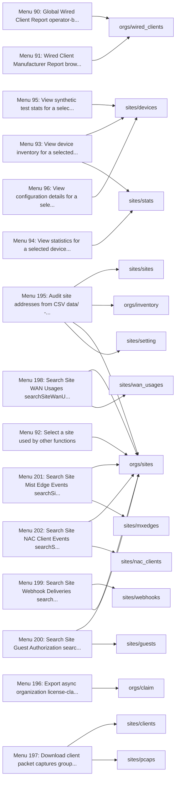

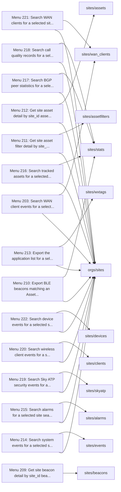

```mermaid
flowchart LR
    m223["Menu 223: Search devices for a selected site se..."]
    m223 --> f_orgs_sites
    m223 --> f_sites_devices
    m224["Menu 224: Search rogue access point events for..."]
    m224 --> f_orgs_sites
    m224 --> f_sites_rogues
    m225["Menu 225: Search OSPF neighbor statistics for a..."]
    m225 --> f_orgs_sites
    m225 --> f_sites_stats
    m226["Menu 226: Search the last device configurations..."]
    m226 --> f_orgs_sites
    m226 --> f_sites_devices
    m227["Menu 227: Search device configuration history f..."]
    m227 --> f_orgs_sites
    m227 --> f_sites_devices
    m228["Menu 228: Search discovered switches for a sele..."]
    m228 --> f_orgs_sites
    m228 --> f_sites_stats
    m229["Menu 229: Search zone sessions for a selected s..."]
    m229 --> f_orgs_sites
    m229 --> f_sites_visits
    m235["Menu 235: Run any org-scoped Mist count endpoin..."]
    m235 --> f_orgs_stats
    m235 --> f_orgs_clients
    m235 --> f_orgs_devices
    m235 --> f_orgs_jsi
    m235 --> f_orgs_mxedges
    m235 --> f_orgs_nac_clients
    m235 --> more235["15 more families"]
    m236["Menu 236: Run any site-scoped Mist count endpoi..."]
    m236 --> f_sites_stats
    m236 --> f_sites_devices
    m236 --> f_sites_clients
    m236 --> f_sites_nac_clients
    m236 --> f_orgs_sites
    m236 --> f_sites_alarms
    m236 --> more236["16 more families"]
    m237["Menu 237: Run any MSP-scoped Mist count endpoin..."]
    m237 --> f_msps_logs
    m237 --> f_msps_suggestion
    m237 --> f_msps_tickets
    m238["Menu 238: Export the license entitlement, usage..."]
    m238 --> f_msps_licenses
    m240["Menu 240: Export one organization security inte..."]
    m240 --> f_orgs_secintelprofiles
    m241["Menu 241: Serve Mist Cloud health to a monitori..."]
    m241 --> f_orgs_stats
    m241 --> f_raw_requests
    m242["Menu 242: Find sites where an SSID is not broad..."]
    m242 --> f_orgs_sites
    m242 --> f_sites_wlans
    m244["Menu 244: Search service path events for a sele..."]
    m244 --> f_orgs_sites
    m244 --> f_sites_services
    f_msps_licenses["msps/licenses"]
    f_msps_logs["msps/logs"]
    f_msps_suggestion["msps/suggestion"]
    f_msps_tickets["msps/tickets"]
    f_orgs_clients["orgs/clients"]
    f_orgs_devices["orgs/devices"]
    f_orgs_jsi["orgs/jsi"]
    f_orgs_mxedges["orgs/mxedges"]
    f_orgs_nac_clients["orgs/nac_clients"]
    f_orgs_secintelprofiles["orgs/secintelprofiles"]
    f_orgs_sites["orgs/sites"]
    f_orgs_stats["orgs/stats"]
    f_raw_requests["raw requests"]
    f_sites_alarms["sites/alarms"]
    f_sites_clients["sites/clients"]
    f_sites_devices["sites/devices"]
    f_sites_nac_clients["sites/nac_clients"]
    f_sites_rogues["sites/rogues"]
    f_sites_services["sites/services"]
    f_sites_stats["sites/stats"]
    f_sites_visits["sites/visits"]
    f_sites_wlans["sites/wlans"]
```

```mermaid
flowchart LR
    m245["Menu 245: Export the Cradlepoint connection sta..."]
    m245 --> f_orgs_setting
    m246["Menu 246: Troubleshoot a call for a site, clien..."]
    m246 --> f_orgs_sites
    m246 --> f_sites_stats
    m247["Menu 247: Verify an email change token from the..."]
    m247 --> f_self_update
    m254["Menu 254: Search organization inventory with op..."]
    m254 --> f_orgs_inventory
    m256["Menu 256: Search organization webhook deliverie..."]
    m256 --> f_orgs_webhooks
    m257["Menu 257: Search NAC clients for a selected sit..."]
    m257 --> f_orgs_sites
    m257 --> f_sites_nac_clients
    m258["Menu 258: Search other-device events for a sele..."]
    m258 --> f_orgs_sites
    m258 --> f_sites_otherdevices
    m259["Menu 259: Run any no-identifier Mist get or lis..."]
    m259 --> f_const_alarm_defs
    m259 --> f_const_ap_channels
    m259 --> f_const_ap_esl_versions
    m259 --> f_const_ap_led_status
    m259 --> f_const_app_categories
    m259 --> f_const_app_subcategories
    m259 --> more259["23 more families"]
    m260["Menu 260: Run any org-scoped Mist get or list e..."]
    m260 --> f_orgs_setting
    m260 --> f_orgs_devices
    m260 --> f_orgs_jsi
    m260 --> f_orgs_mxedges
    m260 --> f_orgs_pskportals
    m260 --> f_orgs_stats
    m260 --> more260["35 more families"]
    m261["Menu 261: Run any site-scoped simple Mist read..."]
    m261 --> f_sites_stats
    m261 --> f_sites_location
    m261 --> f_sites_devices
    m261 --> f_sites_guests
    m261 --> f_sites_rrm
    m261 --> f_sites_setting
    m261 --> more261["32 more families"]
    m262["Menu 262: Run any MSP-scoped Mist get or list e..."]
    m262 --> f_msps_stats
    m262 --> f_msps_admins
    m262 --> f_msps_logs
    m262 --> f_msps_msps
    m262 --> f_msps_orggroups
    m262 --> f_msps_orgs
    m262 --> more262["3 more families"]
    m263["Menu 263: Run any site SLE endpoint with scope..."]
    m263 --> f_sites_sle
    m263 --> f_orgs_sites
    m264["Menu 264: Run any site map endpoint with map pr..."]
    m264 --> f_sites_stats
    m264 --> f_sites_maps
    m264 --> f_orgs_sites
    m265["Menu 265: Run any site detail endpoint with ide..."]
    m265 --> f_sites_stats
    m265 --> f_sites_devices
    m265 --> f_sites_insights
    m265 --> f_sites_rfdiags
    m265 --> f_sites_rrm
    m265 --> f_orgs_sites
    m265 --> more265["16 more families"]
    m266["Menu 266: Run any org detail endpoint with iden..."]
    m266 --> f_orgs_nacportals
    m266 --> f_orgs_ssos
    m266 --> f_orgs_mxedges
    m266 --> f_orgs_devices
    m266 --> f_orgs_sdkinvites
    m266 --> f_orgs_wxtags
    m266 --> more266["44 more families"]
    f_const_alarm_defs["const/alarm_defs"]
    f_const_ap_channels["const/ap_channels"]
    f_const_ap_esl_versions["const/ap_esl_versions"]
    f_const_ap_led_status["const/ap_led_status"]
    f_const_app_categories["const/app_categories"]
    f_const_app_subcategories["const/app_subcategories"]
    f_msps_admins["msps/admins"]
    f_msps_logs["msps/logs"]
    f_msps_msps["msps/msps"]
    f_msps_orggroups["msps/orggroups"]
    f_msps_orgs["msps/orgs"]
    f_msps_stats["msps/stats"]
    f_orgs_devices["orgs/devices"]
    f_orgs_inventory["orgs/inventory"]
    f_orgs_jsi["orgs/jsi"]
    f_orgs_mxedges["orgs/mxedges"]
    f_orgs_nacportals["orgs/nacportals"]
    f_orgs_pskportals["orgs/pskportals"]
    f_orgs_sdkinvites["orgs/sdkinvites"]
    f_orgs_setting["orgs/setting"]
    f_orgs_sites["orgs/sites"]
    f_orgs_ssos["orgs/ssos"]
    f_orgs_stats["orgs/stats"]
    f_orgs_webhooks["orgs/webhooks"]
    f_orgs_wxtags["orgs/wxtags"]
    f_self_update["self/update"]
    f_sites_devices["sites/devices"]
    f_sites_guests["sites/guests"]
    f_sites_insights["sites/insights"]
    f_sites_location["sites/location"]
    f_sites_maps["sites/maps"]
    f_sites_nac_clients["sites/nac_clients"]
    f_sites_otherdevices["sites/otherdevices"]
    f_sites_rfdiags["sites/rfdiags"]
    f_sites_rrm["sites/rrm"]
    f_sites_setting["sites/setting"]
    f_sites_sle["sites/sle"]
    f_sites_stats["sites/stats"]
```

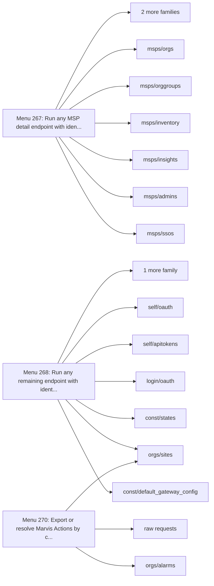

## Menu 60

- Title: Export device list for a selected site
- Handler: `SiteDeviceExporter.devices`
- Shared helpers: [`ConfigUtils`](Menu-API-Endpoints#configutils), [`DataExporter`](Menu-API-Endpoints#dataexporter), [`PromptUtils`](Menu-API-Endpoints#promptutils), [`SourceDependencyResolver`](Menu-API-Endpoints#sourcedependencyresolver)
- Endpoints: 2

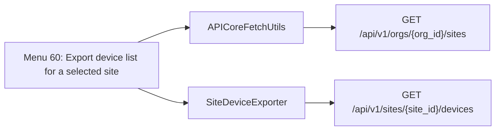

| Method | Path | SDK function | Called from | Found by |
| - | - | - | - | - |
| GET | `/api/v1/orgs/{org_id}/sites` | [`orgs.sites.listOrgSites`](https://www.juniper.net/documentation/us/en/software/mist/api/http/api/orgs/sites/list-org-sites) | [`APICoreFetchUtils.all_sites_with_limit`](https://github.com/jmorrison-juniper/MistHelper/blob/main/src/api/api_core_fetch_utils.py) | Call |
| GET | `/api/v1/sites/{site_id}/devices` | [`sites.devices.listSiteDevices`](https://www.juniper.net/documentation/us/en/software/mist/api/http/api/sites/devices/list-site-devices) | [`SiteDeviceExporter.devices`](https://github.com/jmorrison-juniper/MistHelper/blob/main/src/export/site_device_exporter.py) | Call |

## Menu 61

- Title: Export device statistics for a selected site
- Handler: `SiteDeviceExporter.device_stats`
- Shared helpers: [`ConfigUtils`](Menu-API-Endpoints#configutils), [`DataExporter`](Menu-API-Endpoints#dataexporter), [`PromptUtils`](Menu-API-Endpoints#promptutils), [`SourceDependencyResolver`](Menu-API-Endpoints#sourcedependencyresolver)
- Endpoints: 2

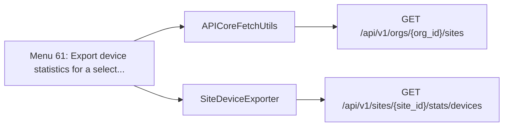

| Method | Path | SDK function | Called from | Found by |
| - | - | - | - | - |
| GET | `/api/v1/orgs/{org_id}/sites` | [`orgs.sites.listOrgSites`](https://www.juniper.net/documentation/us/en/software/mist/api/http/api/orgs/sites/list-org-sites) | [`APICoreFetchUtils.all_sites_with_limit`](https://github.com/jmorrison-juniper/MistHelper/blob/main/src/api/api_core_fetch_utils.py) | Call |
| GET | `/api/v1/sites/{site_id}/stats/devices` | [`sites.stats.listSiteDevicesStats`](https://www.juniper.net/documentation/us/en/software/mist/api/http/api/sites/stats/devices/list-site-devices-stats) | [`SiteDeviceExporter.device_stats`](https://github.com/jmorrison-juniper/MistHelper/blob/main/src/export/site_device_exporter.py) | Call |

## Menu 62

- Title: Export port statistics for a selected site
- Handler: `SiteDeviceExporter.port_stats`
- Shared helpers: [`ConfigUtils`](Menu-API-Endpoints#configutils), [`DataExporter`](Menu-API-Endpoints#dataexporter), [`PromptUtils`](Menu-API-Endpoints#promptutils), [`SourceDependencyResolver`](Menu-API-Endpoints#sourcedependencyresolver)
- Endpoints: 2

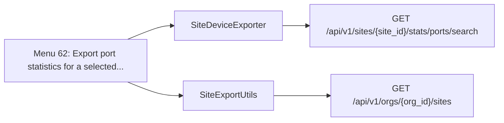

| Method | Path | SDK function | Called from | Found by |
| - | - | - | - | - |
| GET | `/api/v1/orgs/{org_id}/sites` | [`orgs.sites.listOrgSites`](https://www.juniper.net/documentation/us/en/software/mist/api/http/api/orgs/sites/list-org-sites) | [`SiteExportUtils._fetch_org_site_name`](https://github.com/jmorrison-juniper/MistHelper/blob/main/src/export/site_export_utils.py) | Call |
| GET | `/api/v1/sites/{site_id}/stats/ports/search` | [`sites.stats.searchSiteSwOrGwPorts`](https://www.juniper.net/documentation/us/en/software/mist/api/http/api/sites/stats/ports/search-site-sw-or-gw-ports) | [`SiteDeviceExporter.port_stats`](https://github.com/jmorrison-juniper/MistHelper/blob/main/src/export/site_device_exporter.py) | Reference |

## Menu 63

- Title: Export virtual chassis information for a selected switch device
- Handler: `SiteDeviceExporter.device_virtual_chassis`
- Shared helpers: [`DataExporter`](Menu-API-Endpoints#dataexporter), [`PromptUtils`](Menu-API-Endpoints#promptutils), [`SourceDependencyResolver`](Menu-API-Endpoints#sourcedependencyresolver)
- Endpoints: 2

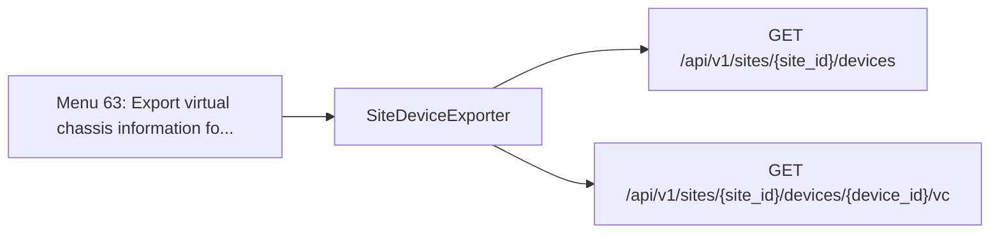

| Method | Path | SDK function | Called from | Found by |
| - | - | - | - | - |
| GET | `/api/v1/sites/{site_id}/devices` | [`sites.devices.listSiteDevices`](https://www.juniper.net/documentation/us/en/software/mist/api/http/api/sites/devices/list-site-devices) | [`SiteDeviceExporter._resolve_device_name`](https://github.com/jmorrison-juniper/MistHelper/blob/main/src/export/site_device_exporter.py) | Call |
| GET | `/api/v1/sites/{site_id}/devices/{device_id}/vc` | [`sites.devices.getSiteDeviceVirtualChassis`](https://www.juniper.net/documentation/us/en/software/mist/api/http/api/sites/devices/wired/virtual-chassis/get-site-device-virtual-chassis) | [`SiteDeviceExporter._export_vc_for_device`](https://github.com/jmorrison-juniper/MistHelper/blob/main/src/export/site_device_exporter.py) | Call |

## Menu 64

- Title: Export currently connected WiFi clients and session data for a selected site to SiteWiFiClients.CSV
- Handler: `SiteClientExporter.wifi_clients`
- Shared helpers: [`CacheUtils`](Menu-API-Endpoints#cacheutils), [`DataExporter`](Menu-API-Endpoints#dataexporter), [`PromptUtils`](Menu-API-Endpoints#promptutils), [`SourceDependencyResolver`](Menu-API-Endpoints#sourcedependencyresolver)
- Endpoints: 4

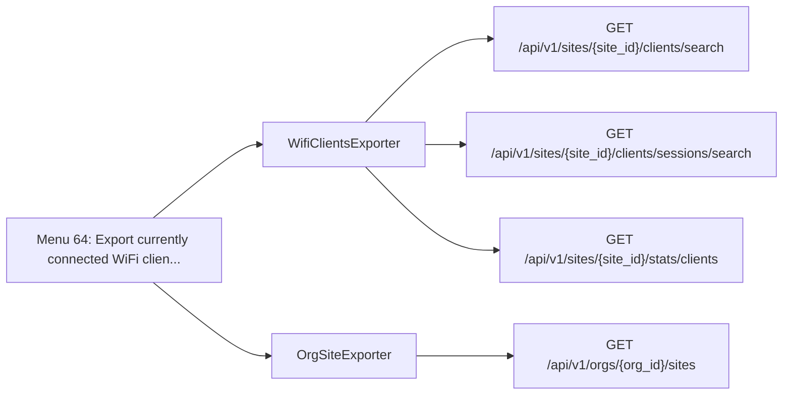

| Method | Path | SDK function | Called from | Found by |
| - | - | - | - | - |
| GET | `/api/v1/orgs/{org_id}/sites` | [`orgs.sites.listOrgSites`](https://www.juniper.net/documentation/us/en/software/mist/api/http/api/orgs/sites/list-org-sites) | [`OrgSiteExporter.sites`](https://github.com/jmorrison-juniper/MistHelper/blob/main/src/export/org_site_exporter.py) | Reference |
| GET | `/api/v1/sites/{site_id}/clients/search` | [`sites.clients.searchSiteWirelessClients`](https://www.juniper.net/documentation/us/en/software/mist/api/http/api/sites/clients/wireless/search-site-wireless-clients) | [`WifiClientsExporter._fetch_clients_and_sessions`](https://github.com/jmorrison-juniper/MistHelper/blob/main/src/export/wifi_clients_exporter.py) | Reference |
| GET | `/api/v1/sites/{site_id}/clients/sessions/search` | [`sites.clients.searchSiteWirelessClientSessions`](https://www.juniper.net/documentation/us/en/software/mist/api/http/api/sites/clients/wireless/search-site-wireless-client-sessions) | [`WifiClientsExporter._fetch_clients_and_sessions`](https://github.com/jmorrison-juniper/MistHelper/blob/main/src/export/wifi_clients_exporter.py) | Reference |
| GET | `/api/v1/sites/{site_id}/stats/clients` | [`sites.stats.listSiteWirelessClientsStats`](https://www.juniper.net/documentation/us/en/software/mist/api/http/api/sites/stats/clients-wireless/list-site-wireless-clients-stats) | [`WifiClientsExporter._write_final_csv`](https://github.com/jmorrison-juniper/MistHelper/blob/main/src/export/wifi_clients_exporter.py) | Name |

## Menu 65

- Title: Export client statistics for a selected site
- Handler: `SiteClientExporter.clients`
- Shared helpers: [`ConfigUtils`](Menu-API-Endpoints#configutils), [`DataExporter`](Menu-API-Endpoints#dataexporter), [`PromptUtils`](Menu-API-Endpoints#promptutils), [`SourceDependencyResolver`](Menu-API-Endpoints#sourcedependencyresolver)
- Endpoints: 2

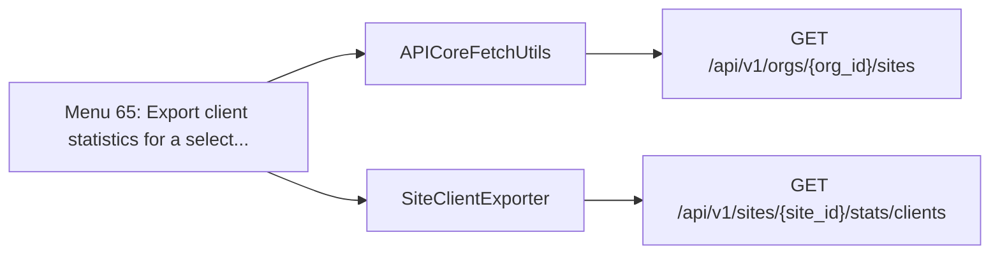

| Method | Path | SDK function | Called from | Found by |
| - | - | - | - | - |
| GET | `/api/v1/orgs/{org_id}/sites` | [`orgs.sites.listOrgSites`](https://www.juniper.net/documentation/us/en/software/mist/api/http/api/orgs/sites/list-org-sites) | [`APICoreFetchUtils.all_sites_with_limit`](https://github.com/jmorrison-juniper/MistHelper/blob/main/src/api/api_core_fetch_utils.py) | Call |
| GET | `/api/v1/sites/{site_id}/stats/clients` | [`sites.stats.listSiteWirelessClientsStats`](https://www.juniper.net/documentation/us/en/software/mist/api/http/api/sites/stats/clients-wireless/list-site-wireless-clients-stats) | [`SiteClientExporter.clients`](https://github.com/jmorrison-juniper/MistHelper/blob/main/src/export/site_client_exporter.py) | Call |

## Menu 66

- Title: Export beacon information for a selected site
- Handler: `SiteClientExporter.beacons`
- Shared helpers: [`ConfigUtils`](Menu-API-Endpoints#configutils), [`DataExporter`](Menu-API-Endpoints#dataexporter), [`PromptUtils`](Menu-API-Endpoints#promptutils), [`SourceDependencyResolver`](Menu-API-Endpoints#sourcedependencyresolver)
- Endpoints: 2

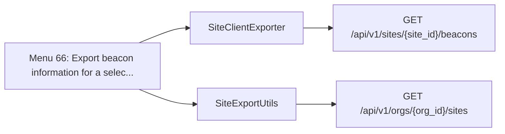

| Method | Path | SDK function | Called from | Found by |
| - | - | - | - | - |
| GET | `/api/v1/orgs/{org_id}/sites` | [`orgs.sites.listOrgSites`](https://www.juniper.net/documentation/us/en/software/mist/api/http/api/orgs/sites/list-org-sites) | [`SiteExportUtils._fetch_org_site_name`](https://github.com/jmorrison-juniper/MistHelper/blob/main/src/export/site_export_utils.py) | Call |
| GET | `/api/v1/sites/{site_id}/beacons` | [`sites.beacons.listSiteBeacons`](https://www.juniper.net/documentation/us/en/software/mist/api/http/api/sites/beacons/list-site-beacons) | [`SiteClientExporter.beacons`](https://github.com/jmorrison-juniper/MistHelper/blob/main/src/export/site_client_exporter.py) | Reference |

## Menu 67

- Title: Export map information for a selected site
- Handler: `SiteConfigExporter.maps`
- Shared helpers: [`ConfigUtils`](Menu-API-Endpoints#configutils), [`DataExporter`](Menu-API-Endpoints#dataexporter), [`PromptUtils`](Menu-API-Endpoints#promptutils), [`SourceDependencyResolver`](Menu-API-Endpoints#sourcedependencyresolver)
- Endpoints: 2

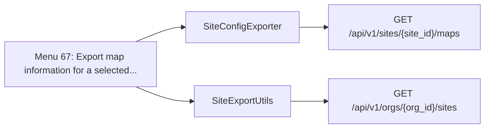

| Method | Path | SDK function | Called from | Found by |
| - | - | - | - | - |
| GET | `/api/v1/orgs/{org_id}/sites` | [`orgs.sites.listOrgSites`](https://www.juniper.net/documentation/us/en/software/mist/api/http/api/orgs/sites/list-org-sites) | [`SiteExportUtils._fetch_org_site_name`](https://github.com/jmorrison-juniper/MistHelper/blob/main/src/export/site_export_utils.py) | Call |
| GET | `/api/v1/sites/{site_id}/maps` | [`sites.maps.listSiteMaps`](https://www.juniper.net/documentation/us/en/software/mist/api/http/api/sites/maps/list-site-maps) | [`SiteConfigExporter.maps`](https://github.com/jmorrison-juniper/MistHelper/blob/main/src/export/site_config_exporter.py) | Reference |

## Menu 68

- Title: Export zone information for a selected site
- Handler: `SiteConfigExporter.zones`
- Shared helpers: [`ConfigUtils`](Menu-API-Endpoints#configutils), [`DataExporter`](Menu-API-Endpoints#dataexporter), [`PromptUtils`](Menu-API-Endpoints#promptutils), [`SourceDependencyResolver`](Menu-API-Endpoints#sourcedependencyresolver)
- Endpoints: 2


| Method | Path | SDK function | Called from | Found by |
| - | - | - | - | - |
| GET | `/api/v1/orgs/{org_id}/sites` | [`orgs.sites.listOrgSites`](https://www.juniper.net/documentation/us/en/software/mist/api/http/api/orgs/sites/list-org-sites) | [`SiteExportUtils._fetch_org_site_name`](https://github.com/jmorrison-juniper/MistHelper/blob/main/src/export/site_export_utils.py) | Call |
| GET | `/api/v1/sites/{site_id}/zones` | [`sites.zones.listSiteZones`](https://www.juniper.net/documentation/us/en/software/mist/api/http/api/sites/zones/list-site-zones) | [`SiteConfigExporter.zones`](https://github.com/jmorrison-juniper/MistHelper/blob/main/src/export/site_config_exporter.py) | Reference |

## Menu 69

- Title: Export WLAN configuration for a selected site
- Handler: `SiteConfigExporter.wlans`
- Shared helpers: [`ConfigUtils`](Menu-API-Endpoints#configutils), [`DataExporter`](Menu-API-Endpoints#dataexporter), [`PromptUtils`](Menu-API-Endpoints#promptutils), [`SourceDependencyResolver`](Menu-API-Endpoints#sourcedependencyresolver)
- Endpoints: 3

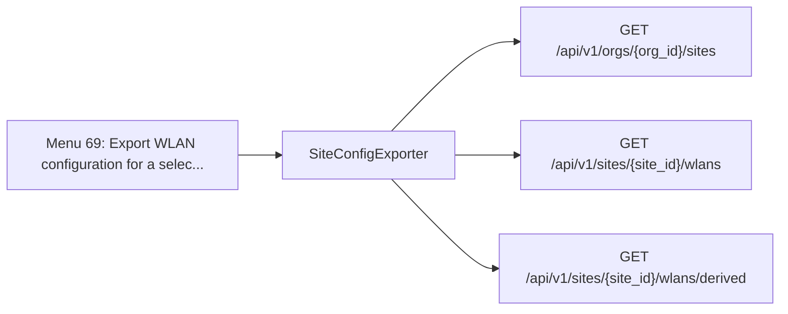

| Method | Path | SDK function | Called from | Found by |
| - | - | - | - | - |
| GET | `/api/v1/orgs/{org_id}/sites` | [`orgs.sites.listOrgSites`](https://www.juniper.net/documentation/us/en/software/mist/api/http/api/orgs/sites/list-org-sites) | [`SiteConfigExporter._resolve_wlan_site_name`](https://github.com/jmorrison-juniper/MistHelper/blob/main/src/export/site_config_exporter.py) | Call |
| GET | `/api/v1/sites/{site_id}/wlans` | [`sites.wlans.listSiteWlans`](https://www.juniper.net/documentation/us/en/software/mist/api/http/api/sites/wlans/list-site-wlans) | [`SiteConfigExporter._fetch_wlans_with_fallback`](https://github.com/jmorrison-juniper/MistHelper/blob/main/src/export/site_config_exporter.py) | Call |
| GET | `/api/v1/sites/{site_id}/wlans/derived` | [`sites.wlans.listSiteWlansDerived`](https://www.juniper.net/documentation/us/en/software/mist/api/http/api/sites/wlans/list-site-wlans-derived) | [`SiteConfigExporter._fetch_wlans_with_fallback`](https://github.com/jmorrison-juniper/MistHelper/blob/main/src/export/site_config_exporter.py) | Call |

## Menu 70

- Title: Export OSPF adjacency statistics for a selected site
- Handler: `lambda: GlobalImportManager.SiteExportUtilsFactory().build().ospf_stats()`
- Shared helpers: [`ConfigUtils`](Menu-API-Endpoints#configutils), [`DataExporter`](Menu-API-Endpoints#dataexporter), [`MainEntrypoint`](Menu-API-Endpoints#mainentrypoint), [`PromptUtils`](Menu-API-Endpoints#promptutils)
- Endpoints: 2

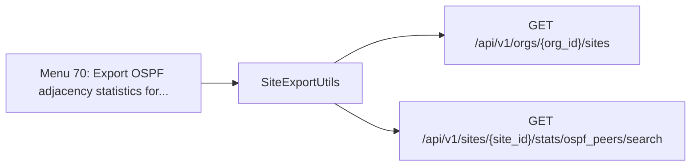

| Method | Path | SDK function | Called from | Found by |
| - | - | - | - | - |
| GET | `/api/v1/orgs/{org_id}/sites` | [`orgs.sites.listOrgSites`](https://www.juniper.net/documentation/us/en/software/mist/api/http/api/orgs/sites/list-org-sites) | [`SiteExportUtils._fetch_org_site_name`](https://github.com/jmorrison-juniper/MistHelper/blob/main/src/export/site_export_utils.py) | Call |
| GET | `/api/v1/sites/{site_id}/stats/ospf_peers/search` | [`sites.stats.searchSiteOspfStats`](https://www.juniper.net/documentation/us/en/software/mist/api/http/api/sites/stats/ospf/search-site-ospf-stats) | [`SiteExportUtils.ospf_stats`](https://github.com/jmorrison-juniper/MistHelper/blob/main/src/export/site_export_utils.py) | Reference |

## Menu 71

- Title: Export MxEdge upgrade status for a selected site
- Handler: `lambda: GlobalImportManager.SiteExportUtilsFactory().build().mxedge_upgrade_status()`
- Shared helpers: [`ConfigUtils`](Menu-API-Endpoints#configutils), [`DataExporter`](Menu-API-Endpoints#dataexporter), [`MainEntrypoint`](Menu-API-Endpoints#mainentrypoint), [`PromptUtils`](Menu-API-Endpoints#promptutils)
- Endpoints: 2

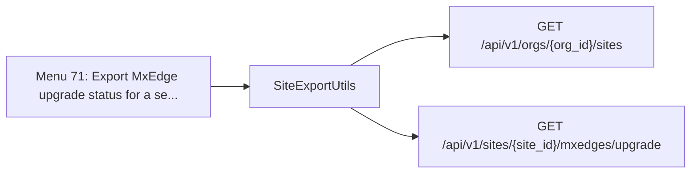

| Method | Path | SDK function | Called from | Found by |
| - | - | - | - | - |
| GET | `/api/v1/orgs/{org_id}/sites` | [`orgs.sites.listOrgSites`](https://www.juniper.net/documentation/us/en/software/mist/api/http/api/orgs/sites/list-org-sites) | [`SiteExportUtils._fetch_org_site_name`](https://github.com/jmorrison-juniper/MistHelper/blob/main/src/export/site_export_utils.py) | Call |
| GET | `/api/v1/sites/{site_id}/mxedges/upgrade` | [`sites.mxedges.listSiteMxEdgeUpgrades`](https://www.juniper.net/documentation/us/en/software/mist/api/http/api/utilities/upgrade/list-site-mx-edge-upgrades) | [`SiteExportUtils.mxedge_upgrade_status`](https://github.com/jmorrison-juniper/MistHelper/blob/main/src/export/site_export_utils.py) | Reference |

## Menu 72

- Title: Export auto-map assignment status for a selected site
- Handler: `lambda: GlobalImportManager.SiteExportUtilsFactory().build().auto_map_assignment_status()`
- Shared helpers: [`ConfigUtils`](Menu-API-Endpoints#configutils), [`DataExporter`](Menu-API-Endpoints#dataexporter), [`MainEntrypoint`](Menu-API-Endpoints#mainentrypoint), [`PromptUtils`](Menu-API-Endpoints#promptutils)
- Endpoints: 2

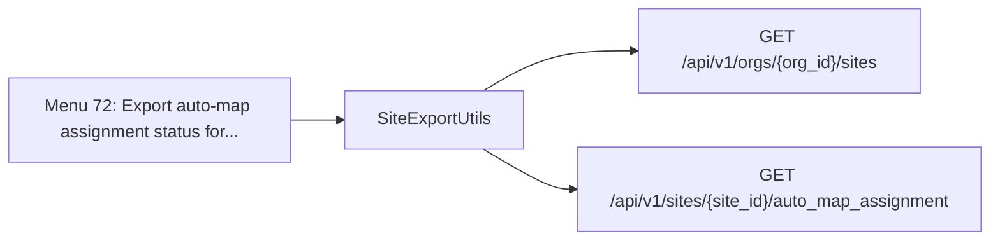

| Method | Path | SDK function | Called from | Found by |
| - | - | - | - | - |
| GET | `/api/v1/orgs/{org_id}/sites` | [`orgs.sites.listOrgSites`](https://www.juniper.net/documentation/us/en/software/mist/api/http/api/orgs/sites/list-org-sites) | [`SiteExportUtils._fetch_org_site_name`](https://github.com/jmorrison-juniper/MistHelper/blob/main/src/export/site_export_utils.py) | Call |
| GET | `/api/v1/sites/{site_id}/auto_map_assignment` | [`sites.auto_map_assignment.getSiteAutoMapAssignmentStatus`](https://www.juniper.net/documentation/us/en/software/mist/api/http/api/sites/auto-map-assignment/get-site-auto-map-assignment-status) | [`SiteExportUtils.auto_map_assignment_status`](https://github.com/jmorrison-juniper/MistHelper/blob/main/src/export/site_export_utils.py) | Reference |

## Menu 73

- Title: Export SLE (Service Level Experience) metrics insights for a selected site
- Handler: `lambda: GlobalImportManager.SiteExportUtilsFactory().build().insights()`
- Shared helpers: [`ConfigUtils`](Menu-API-Endpoints#configutils), [`DataExporter`](Menu-API-Endpoints#dataexporter), [`MainEntrypoint`](Menu-API-Endpoints#mainentrypoint), [`PromptUtils`](Menu-API-Endpoints#promptutils)
- Endpoints: 2

```mermaid
flowchart LR
    menu["Menu 73: Export SLE Service Level Experience m..."]
    menu --> c1["SiteExportUtils"]
    c1 --> e1["GET /api/v1/orgs/{org_id}/sites"]
    c1 --> e2["GET /api/v1/sites/{site_id}/sle/{scope}/{scope_id}/metrics"]
```

| Method | Path | SDK function | Called from | Found by |
| - | - | - | - | - |
| GET | `/api/v1/orgs/{org_id}/sites` | [`orgs.sites.listOrgSites`](https://www.juniper.net/documentation/us/en/software/mist/api/http/api/orgs/sites/list-org-sites) | [`SiteExportUtils._fetch_org_site_name`](https://github.com/jmorrison-juniper/MistHelper/blob/main/src/export/site_export_utils.py) | Call |
| GET | `/api/v1/sites/{site_id}/sle/{scope}/{scope_id}/metrics` | [`sites.sle.listSiteSlesMetrics`](https://www.juniper.net/documentation/us/en/software/mist/api/http/api/sites/sles/list-site-sles-metrics) | [`SiteExportUtils._fetch_site_sle_metrics_payload`](https://github.com/jmorrison-juniper/MistHelper/blob/main/src/export/site_export_utils.py) | Call |

## Menu 74

- Title: Export general insight metrics for a selected site
- Handler: `lambda: SiteMetricOperation(apisession=MainEntrypoint.context.apisession, PromptUtils=PromptUtils, DataProcessingUtils=DataProcessingUtils, DataExporter=Data...`
- Shared helpers: [`DataExporter`](Menu-API-Endpoints#dataexporter), [`MainEntrypoint`](Menu-API-Endpoints#mainentrypoint), [`PromptUtils`](Menu-API-Endpoints#promptutils), [`SourceDependencyResolver`](Menu-API-Endpoints#sourcedependencyresolver)
- Endpoints: 30

```mermaid
flowchart LR
    menu["Menu 74: Export general insight metrics for a..."]
    menu --> c1["ConstDefinitionsExporter"]
    c1 --> e1["GET /api/v1/const/alarm_defs"]
    c1 --> e2["GET /api/v1/const/ap_channels"]
    c1 --> e3["GET /api/v1/const/ap_esl_versions"]
    c1 --> e4["GET /api/v1/const/ap_led_status"]
    c1 --> e5["GET /api/v1/const/app_categories"]
    c1 --> e6["GET /api/v1/const/app_subcategories"]
    c1 --> e7["GET /api/v1/const/applications"]
    c1 --> e8["GET /api/v1/const/client_events"]
    c1 --> e9["GET /api/v1/const/countries"]
    c1 --> e10["GET /api/v1/const/default_gateway_config"]
    c1 --> e11["GET /api/v1/const/device_events"]
    c1 --> e12["GET /api/v1/const/device_models"]
    menu --> more["18 more endpoints in the table"]
```

| Method | Path | SDK function | Called from | Found by |
| - | - | - | - | - |
| GET | `/api/v1/const/alarm_defs` | [`const.alarm_defs.listAlarmDefinitions`](https://www.juniper.net/documentation/us/en/software/mist/api/http/api/constants/events/list-alarm-definitions) | [`ConstDefinitionsExporter._discover_endpoints`](https://github.com/jmorrison-juniper/MistHelper/blob/main/src/export/const_definitions_exporter.py) | Curated |
| GET | `/api/v1/const/ap_channels` | [`const.ap_channels.listApChannels`](https://www.juniper.net/documentation/us/en/software/mist/api/http/api/constants/definitions/list-ap-channels) | [`ConstDefinitionsExporter._discover_endpoints`](https://github.com/jmorrison-juniper/MistHelper/blob/main/src/export/const_definitions_exporter.py) | Curated |
| GET | `/api/v1/const/ap_esl_versions` | [`const.ap_esl_versions.listApLEslVersions`](https://www.juniper.net/documentation/us/en/software/mist/api/http/api/constants/definitions/list-ap-l-esl-versions) | [`ConstDefinitionsExporter._discover_endpoints`](https://github.com/jmorrison-juniper/MistHelper/blob/main/src/export/const_definitions_exporter.py) | Curated |
| GET | `/api/v1/const/ap_led_status` | [`const.ap_led_status.listApLedDefinition`](https://www.juniper.net/documentation/us/en/software/mist/api/http/api/constants/definitions/list-ap-led-definition) | [`ConstDefinitionsExporter._discover_endpoints`](https://github.com/jmorrison-juniper/MistHelper/blob/main/src/export/const_definitions_exporter.py) | Curated |
| GET | `/api/v1/const/app_categories` | [`const.app_categories.listAppCategoryDefinitions`](https://www.juniper.net/documentation/us/en/software/mist/api/http/api/constants/definitions/list-app-category-definitions) | [`ConstDefinitionsExporter._discover_endpoints`](https://github.com/jmorrison-juniper/MistHelper/blob/main/src/export/const_definitions_exporter.py) | Curated |
| GET | `/api/v1/const/app_subcategories` | [`const.app_subcategories.listAppSubCategoryDefinitions`](https://www.juniper.net/documentation/us/en/software/mist/api/http/api/constants/definitions/list-app-sub-category-definitions) | [`ConstDefinitionsExporter._discover_endpoints`](https://github.com/jmorrison-juniper/MistHelper/blob/main/src/export/const_definitions_exporter.py) | Curated |
| GET | `/api/v1/const/applications` | [`const.applications.listApplications`](https://www.juniper.net/documentation/us/en/software/mist/api/http/api/constants/definitions/list-applications) | [`ConstDefinitionsExporter._discover_endpoints`](https://github.com/jmorrison-juniper/MistHelper/blob/main/src/export/const_definitions_exporter.py) | Curated |
| GET | `/api/v1/const/client_events` | [`const.client_events.listClientEventsDefinitions`](https://www.juniper.net/documentation/us/en/software/mist/api/http/api/constants/events/list-client-events-definitions) | [`ConstDefinitionsExporter._discover_endpoints`](https://github.com/jmorrison-juniper/MistHelper/blob/main/src/export/const_definitions_exporter.py) | Curated |
| GET | `/api/v1/const/countries` | [`const.countries.listCountryCodes`](https://www.juniper.net/documentation/us/en/software/mist/api/http/api/constants/definitions/list-country-codes) | [`ConstDefinitionsExporter._get_channel_country_codes`](https://github.com/jmorrison-juniper/MistHelper/blob/main/src/export/const_definitions_exporter.py) | Reference |
| GET | `/api/v1/const/default_gateway_config` | [`const.default_gateway_config.getGatewayDefaultConfig`](https://www.juniper.net/documentation/us/en/software/mist/api/http/api/constants/models/get-gateway-default-config) | [`ConstDefinitionsExporter._discover_endpoints`](https://github.com/jmorrison-juniper/MistHelper/blob/main/src/export/const_definitions_exporter.py) | Curated |
| GET | `/api/v1/const/device_events` | [`const.device_events.listDeviceEventsDefinitions`](https://www.juniper.net/documentation/us/en/software/mist/api/http/api/constants/events/list-device-events-definitions) | [`ConstDefinitionsExporter._discover_endpoints`](https://github.com/jmorrison-juniper/MistHelper/blob/main/src/export/const_definitions_exporter.py) | Curated |
| GET | `/api/v1/const/device_models` | [`const.device_models.listDeviceModels`](https://www.juniper.net/documentation/us/en/software/mist/api/http/api/constants/models/list-device-models) | [`ConstDefinitionsExporter._get_gateway_models_list`](https://github.com/jmorrison-juniper/MistHelper/blob/main/src/export/const_definitions_exporter.py) | Reference |
| GET | `/api/v1/const/fingerprint_types` | [`const.fingerprint_types.listFingerprintTypes`](https://www.juniper.net/documentation/us/en/software/mist/api/http/api/constants/definitions/list-fingerprint-types) | [`ConstDefinitionsExporter._discover_endpoints`](https://github.com/jmorrison-juniper/MistHelper/blob/main/src/export/const_definitions_exporter.py) | Curated |
| GET | `/api/v1/const/gateway_applications` | [`const.gateway_applications.listGatewayApplications`](https://www.juniper.net/documentation/us/en/software/mist/api/http/api/constants/definitions/list-gateway-applications) | [`ConstDefinitionsExporter._discover_endpoints`](https://github.com/jmorrison-juniper/MistHelper/blob/main/src/export/const_definitions_exporter.py) | Curated |
| GET | `/api/v1/const/insight_metrics` | [`const.insight_metrics.listInsightMetrics`](https://www.juniper.net/documentation/us/en/software/mist/api/http/api/constants/definitions/list-insight-metrics) | [`ConstDefinitionsExporter._discover_endpoints`](https://github.com/jmorrison-juniper/MistHelper/blob/main/src/export/const_definitions_exporter.py) | Curated |
| GET | `/api/v1/const/languages` | [`const.languages.listSiteLanguages`](https://www.juniper.net/documentation/us/en/software/mist/api/http/api/constants/definitions/list-site-languages) | [`ConstDefinitionsExporter._discover_endpoints`](https://github.com/jmorrison-juniper/MistHelper/blob/main/src/export/const_definitions_exporter.py) | Curated |
| GET | `/api/v1/const/license_types` | [`const.license_types.listLicenseTypes`](https://www.juniper.net/documentation/us/en/software/mist/api/http/api/constants/definitions/list-license-types) | [`ConstDefinitionsExporter._discover_endpoints`](https://github.com/jmorrison-juniper/MistHelper/blob/main/src/export/const_definitions_exporter.py) | Curated |
| GET | `/api/v1/const/marvisclient_events` | [`const.marvisclient_events.listMarvisClientEventsDefinitions`](https://www.juniper.net/documentation/us/en/software/mist/api/http/api/constants/definitions/list-marvis-client-events-definitions) | [`ConstDefinitionsExporter._discover_endpoints`](https://github.com/jmorrison-juniper/MistHelper/blob/main/src/export/const_definitions_exporter.py) | Curated |
| GET | `/api/v1/const/marvisclient_versions` | [`const.marvisclient_versions.listMarvisClientVersions`](https://www.juniper.net/documentation/us/en/software/mist/api/http/api/constants/definitions/list-marvis-client-versions) | [`ConstDefinitionsExporter._discover_endpoints`](https://github.com/jmorrison-juniper/MistHelper/blob/main/src/export/const_definitions_exporter.py) | Curated |
| GET | `/api/v1/const/mxedge_events` | [`const.mxedge_events.listMxEdgeEventsDefinitions`](https://www.juniper.net/documentation/us/en/software/mist/api/http/api/constants/events/list-mx-edge-events-definitions) | [`ConstDefinitionsExporter._discover_endpoints`](https://github.com/jmorrison-juniper/MistHelper/blob/main/src/export/const_definitions_exporter.py) | Curated |
| GET | `/api/v1/const/mxedge_models` | [`const.mxedge_models.listMxEdgeModels`](https://www.juniper.net/documentation/us/en/software/mist/api/http/api/constants/models/list-mx-edge-models) | [`ConstDefinitionsExporter._discover_endpoints`](https://github.com/jmorrison-juniper/MistHelper/blob/main/src/export/const_definitions_exporter.py) | Curated |
| GET | `/api/v1/const/nac_events` | [`const.nac_events.listNacEventsDefinitions`](https://www.juniper.net/documentation/us/en/software/mist/api/http/api/constants/events/list-nac-events-definitions) | [`ConstDefinitionsExporter._discover_endpoints`](https://github.com/jmorrison-juniper/MistHelper/blob/main/src/export/const_definitions_exporter.py) | Curated |
| GET | `/api/v1/const/otherdevice_events` | [`const.otherdevice_events.listOtherDeviceEventsDefinitions`](https://www.juniper.net/documentation/us/en/software/mist/api/http/api/constants/events/list-other-device-events-definitions) | [`ConstDefinitionsExporter._discover_endpoints`](https://github.com/jmorrison-juniper/MistHelper/blob/main/src/export/const_definitions_exporter.py) | Curated |
| GET | `/api/v1/const/otherdevice_models` | [`const.otherdevice_models.listSupportedOtherDeviceModels`](https://www.juniper.net/documentation/us/en/software/mist/api/http/api/constants/models/list-supported-other-device-models) | [`ConstDefinitionsExporter._discover_endpoints`](https://github.com/jmorrison-juniper/MistHelper/blob/main/src/export/const_definitions_exporter.py) | Curated |
| GET | `/api/v1/const/states` | [`const.states.listStates`](https://www.juniper.net/documentation/us/en/software/mist/api/http/api/constants/definitions/list-states) | [`ConstDefinitionsExporter._discover_endpoints`](https://github.com/jmorrison-juniper/MistHelper/blob/main/src/export/const_definitions_exporter.py) | Curated |
| GET | `/api/v1/const/system_events` | [`const.system_events.listSystemEventsDefinitions`](https://www.juniper.net/documentation/us/en/software/mist/api/http/api/constants/events/list-system-events-definitions) | [`ConstDefinitionsExporter._discover_endpoints`](https://github.com/jmorrison-juniper/MistHelper/blob/main/src/export/const_definitions_exporter.py) | Curated |
| GET | `/api/v1/const/traffic_types` | [`const.traffic_types.listTrafficTypes`](https://www.juniper.net/documentation/us/en/software/mist/api/http/api/constants/definitions/list-traffic-types) | [`ConstDefinitionsExporter._discover_endpoints`](https://github.com/jmorrison-juniper/MistHelper/blob/main/src/export/const_definitions_exporter.py) | Curated |
| GET | `/api/v1/const/webhook_topics` | [`const.webhook_topics.listWebhookTopics`](https://www.juniper.net/documentation/us/en/software/mist/api/http/api/constants/definitions/list-webhook-topics) | [`ConstDefinitionsExporter._discover_endpoints`](https://github.com/jmorrison-juniper/MistHelper/blob/main/src/export/const_definitions_exporter.py) | Curated |
| GET | `/api/v1/sites/{site_id}` | [`sites.sites.getSiteInfo`](https://www.juniper.net/documentation/us/en/software/mist/api/http/api/sites/get-site-info) | [`SiteMetricOperation._resolve_site_name`](https://github.com/jmorrison-juniper/MistHelper/blob/main/src/export/site_insights/site_metric_operation.py) | Call |
| GET | `/api/v1/sites/{site_id}/insights` | [`sites.insights.getSiteInsightMetrics`](https://www.juniper.net/documentation/us/en/software/mist/api/http/api/sites/insights/get-site-insight-metrics) | [`SiteMetricOperation._emit_empty_metric_list`](https://github.com/jmorrison-juniper/MistHelper/blob/main/src/export/site_insights/site_metric_operation.py) | Name |

## Menu 75

- Title: Export client-specific insight metrics for a selected site
- Handler: `SiteClientExporter.client_insights`
- Shared helpers: [`DataExporter`](Menu-API-Endpoints#dataexporter), [`InputUtils`](Menu-API-Endpoints#inpututils), [`PromptUtils`](Menu-API-Endpoints#promptutils), [`SourceDependencyResolver`](Menu-API-Endpoints#sourcedependencyresolver), [`SourceDependencyResolverService`](Menu-API-Endpoints#sourcedependencyresolverservice)
- Endpoints: 30

```mermaid
flowchart LR
    menu["Menu 75: Export client-specific insight metric..."]
    menu --> c1["ConstDefinitionsExporter"]
    c1 --> e1["GET /api/v1/const/alarm_defs"]
    c1 --> e2["GET /api/v1/const/ap_channels"]
    c1 --> e3["GET /api/v1/const/ap_esl_versions"]
    c1 --> e4["GET /api/v1/const/ap_led_status"]
    c1 --> e5["GET /api/v1/const/app_categories"]
    c1 --> e6["GET /api/v1/const/app_subcategories"]
    c1 --> e7["GET /api/v1/const/applications"]
    c1 --> e8["GET /api/v1/const/client_events"]
    c1 --> e9["GET /api/v1/const/countries"]
    c1 --> e10["GET /api/v1/const/default_gateway_config"]
    c1 --> e11["GET /api/v1/const/device_events"]
    c1 --> e12["GET /api/v1/const/device_models"]
    menu --> more["18 more endpoints in the table"]
```

| Method | Path | SDK function | Called from | Found by |
| - | - | - | - | - |
| GET | `/api/v1/const/alarm_defs` | [`const.alarm_defs.listAlarmDefinitions`](https://www.juniper.net/documentation/us/en/software/mist/api/http/api/constants/events/list-alarm-definitions) | [`ConstDefinitionsExporter._discover_endpoints`](https://github.com/jmorrison-juniper/MistHelper/blob/main/src/export/const_definitions_exporter.py) | Curated |
| GET | `/api/v1/const/ap_channels` | [`const.ap_channels.listApChannels`](https://www.juniper.net/documentation/us/en/software/mist/api/http/api/constants/definitions/list-ap-channels) | [`ConstDefinitionsExporter._discover_endpoints`](https://github.com/jmorrison-juniper/MistHelper/blob/main/src/export/const_definitions_exporter.py) | Curated |
| GET | `/api/v1/const/ap_esl_versions` | [`const.ap_esl_versions.listApLEslVersions`](https://www.juniper.net/documentation/us/en/software/mist/api/http/api/constants/definitions/list-ap-l-esl-versions) | [`ConstDefinitionsExporter._discover_endpoints`](https://github.com/jmorrison-juniper/MistHelper/blob/main/src/export/const_definitions_exporter.py) | Curated |
| GET | `/api/v1/const/ap_led_status` | [`const.ap_led_status.listApLedDefinition`](https://www.juniper.net/documentation/us/en/software/mist/api/http/api/constants/definitions/list-ap-led-definition) | [`ConstDefinitionsExporter._discover_endpoints`](https://github.com/jmorrison-juniper/MistHelper/blob/main/src/export/const_definitions_exporter.py) | Curated |
| GET | `/api/v1/const/app_categories` | [`const.app_categories.listAppCategoryDefinitions`](https://www.juniper.net/documentation/us/en/software/mist/api/http/api/constants/definitions/list-app-category-definitions) | [`ConstDefinitionsExporter._discover_endpoints`](https://github.com/jmorrison-juniper/MistHelper/blob/main/src/export/const_definitions_exporter.py) | Curated |
| GET | `/api/v1/const/app_subcategories` | [`const.app_subcategories.listAppSubCategoryDefinitions`](https://www.juniper.net/documentation/us/en/software/mist/api/http/api/constants/definitions/list-app-sub-category-definitions) | [`ConstDefinitionsExporter._discover_endpoints`](https://github.com/jmorrison-juniper/MistHelper/blob/main/src/export/const_definitions_exporter.py) | Curated |
| GET | `/api/v1/const/applications` | [`const.applications.listApplications`](https://www.juniper.net/documentation/us/en/software/mist/api/http/api/constants/definitions/list-applications) | [`ConstDefinitionsExporter._discover_endpoints`](https://github.com/jmorrison-juniper/MistHelper/blob/main/src/export/const_definitions_exporter.py) | Curated |
| GET | `/api/v1/const/client_events` | [`const.client_events.listClientEventsDefinitions`](https://www.juniper.net/documentation/us/en/software/mist/api/http/api/constants/events/list-client-events-definitions) | [`ConstDefinitionsExporter._discover_endpoints`](https://github.com/jmorrison-juniper/MistHelper/blob/main/src/export/const_definitions_exporter.py) | Curated |
| GET | `/api/v1/const/countries` | [`const.countries.listCountryCodes`](https://www.juniper.net/documentation/us/en/software/mist/api/http/api/constants/definitions/list-country-codes) | [`ConstDefinitionsExporter._get_channel_country_codes`](https://github.com/jmorrison-juniper/MistHelper/blob/main/src/export/const_definitions_exporter.py) | Reference |
| GET | `/api/v1/const/default_gateway_config` | [`const.default_gateway_config.getGatewayDefaultConfig`](https://www.juniper.net/documentation/us/en/software/mist/api/http/api/constants/models/get-gateway-default-config) | [`ConstDefinitionsExporter._discover_endpoints`](https://github.com/jmorrison-juniper/MistHelper/blob/main/src/export/const_definitions_exporter.py) | Curated |
| GET | `/api/v1/const/device_events` | [`const.device_events.listDeviceEventsDefinitions`](https://www.juniper.net/documentation/us/en/software/mist/api/http/api/constants/events/list-device-events-definitions) | [`ConstDefinitionsExporter._discover_endpoints`](https://github.com/jmorrison-juniper/MistHelper/blob/main/src/export/const_definitions_exporter.py) | Curated |
| GET | `/api/v1/const/device_models` | [`const.device_models.listDeviceModels`](https://www.juniper.net/documentation/us/en/software/mist/api/http/api/constants/models/list-device-models) | [`ConstDefinitionsExporter._get_gateway_models_list`](https://github.com/jmorrison-juniper/MistHelper/blob/main/src/export/const_definitions_exporter.py) | Reference |
| GET | `/api/v1/const/fingerprint_types` | [`const.fingerprint_types.listFingerprintTypes`](https://www.juniper.net/documentation/us/en/software/mist/api/http/api/constants/definitions/list-fingerprint-types) | [`ConstDefinitionsExporter._discover_endpoints`](https://github.com/jmorrison-juniper/MistHelper/blob/main/src/export/const_definitions_exporter.py) | Curated |
| GET | `/api/v1/const/gateway_applications` | [`const.gateway_applications.listGatewayApplications`](https://www.juniper.net/documentation/us/en/software/mist/api/http/api/constants/definitions/list-gateway-applications) | [`ConstDefinitionsExporter._discover_endpoints`](https://github.com/jmorrison-juniper/MistHelper/blob/main/src/export/const_definitions_exporter.py) | Curated |
| GET | `/api/v1/const/insight_metrics` | [`const.insight_metrics.listInsightMetrics`](https://www.juniper.net/documentation/us/en/software/mist/api/http/api/constants/definitions/list-insight-metrics) | [`ConstDefinitionsExporter._discover_endpoints`](https://github.com/jmorrison-juniper/MistHelper/blob/main/src/export/const_definitions_exporter.py) | Curated |
| GET | `/api/v1/const/languages` | [`const.languages.listSiteLanguages`](https://www.juniper.net/documentation/us/en/software/mist/api/http/api/constants/definitions/list-site-languages) | [`ConstDefinitionsExporter._discover_endpoints`](https://github.com/jmorrison-juniper/MistHelper/blob/main/src/export/const_definitions_exporter.py) | Curated |
| GET | `/api/v1/const/license_types` | [`const.license_types.listLicenseTypes`](https://www.juniper.net/documentation/us/en/software/mist/api/http/api/constants/definitions/list-license-types) | [`ConstDefinitionsExporter._discover_endpoints`](https://github.com/jmorrison-juniper/MistHelper/blob/main/src/export/const_definitions_exporter.py) | Curated |
| GET | `/api/v1/const/marvisclient_events` | [`const.marvisclient_events.listMarvisClientEventsDefinitions`](https://www.juniper.net/documentation/us/en/software/mist/api/http/api/constants/definitions/list-marvis-client-events-definitions) | [`ConstDefinitionsExporter._discover_endpoints`](https://github.com/jmorrison-juniper/MistHelper/blob/main/src/export/const_definitions_exporter.py) | Curated |
| GET | `/api/v1/const/marvisclient_versions` | [`const.marvisclient_versions.listMarvisClientVersions`](https://www.juniper.net/documentation/us/en/software/mist/api/http/api/constants/definitions/list-marvis-client-versions) | [`ConstDefinitionsExporter._discover_endpoints`](https://github.com/jmorrison-juniper/MistHelper/blob/main/src/export/const_definitions_exporter.py) | Curated |
| GET | `/api/v1/const/mxedge_events` | [`const.mxedge_events.listMxEdgeEventsDefinitions`](https://www.juniper.net/documentation/us/en/software/mist/api/http/api/constants/events/list-mx-edge-events-definitions) | [`ConstDefinitionsExporter._discover_endpoints`](https://github.com/jmorrison-juniper/MistHelper/blob/main/src/export/const_definitions_exporter.py) | Curated |
| GET | `/api/v1/const/mxedge_models` | [`const.mxedge_models.listMxEdgeModels`](https://www.juniper.net/documentation/us/en/software/mist/api/http/api/constants/models/list-mx-edge-models) | [`ConstDefinitionsExporter._discover_endpoints`](https://github.com/jmorrison-juniper/MistHelper/blob/main/src/export/const_definitions_exporter.py) | Curated |
| GET | `/api/v1/const/nac_events` | [`const.nac_events.listNacEventsDefinitions`](https://www.juniper.net/documentation/us/en/software/mist/api/http/api/constants/events/list-nac-events-definitions) | [`ConstDefinitionsExporter._discover_endpoints`](https://github.com/jmorrison-juniper/MistHelper/blob/main/src/export/const_definitions_exporter.py) | Curated |
| GET | `/api/v1/const/otherdevice_events` | [`const.otherdevice_events.listOtherDeviceEventsDefinitions`](https://www.juniper.net/documentation/us/en/software/mist/api/http/api/constants/events/list-other-device-events-definitions) | [`ConstDefinitionsExporter._discover_endpoints`](https://github.com/jmorrison-juniper/MistHelper/blob/main/src/export/const_definitions_exporter.py) | Curated |
| GET | `/api/v1/const/otherdevice_models` | [`const.otherdevice_models.listSupportedOtherDeviceModels`](https://www.juniper.net/documentation/us/en/software/mist/api/http/api/constants/models/list-supported-other-device-models) | [`ConstDefinitionsExporter._discover_endpoints`](https://github.com/jmorrison-juniper/MistHelper/blob/main/src/export/const_definitions_exporter.py) | Curated |
| GET | `/api/v1/const/states` | [`const.states.listStates`](https://www.juniper.net/documentation/us/en/software/mist/api/http/api/constants/definitions/list-states) | [`ConstDefinitionsExporter._discover_endpoints`](https://github.com/jmorrison-juniper/MistHelper/blob/main/src/export/const_definitions_exporter.py) | Curated |
| GET | `/api/v1/const/system_events` | [`const.system_events.listSystemEventsDefinitions`](https://www.juniper.net/documentation/us/en/software/mist/api/http/api/constants/events/list-system-events-definitions) | [`ConstDefinitionsExporter._discover_endpoints`](https://github.com/jmorrison-juniper/MistHelper/blob/main/src/export/const_definitions_exporter.py) | Curated |
| GET | `/api/v1/const/traffic_types` | [`const.traffic_types.listTrafficTypes`](https://www.juniper.net/documentation/us/en/software/mist/api/http/api/constants/definitions/list-traffic-types) | [`ConstDefinitionsExporter._discover_endpoints`](https://github.com/jmorrison-juniper/MistHelper/blob/main/src/export/const_definitions_exporter.py) | Curated |
| GET | `/api/v1/const/webhook_topics` | [`const.webhook_topics.listWebhookTopics`](https://www.juniper.net/documentation/us/en/software/mist/api/http/api/constants/definitions/list-webhook-topics) | [`ConstDefinitionsExporter._discover_endpoints`](https://github.com/jmorrison-juniper/MistHelper/blob/main/src/export/const_definitions_exporter.py) | Curated |
| GET | `/api/v1/sites/{site_id}` | [`sites.sites.getSiteInfo`](https://www.juniper.net/documentation/us/en/software/mist/api/http/api/sites/get-site-info) | [`SiteClientInsightsService._resolve_site_name`](https://github.com/jmorrison-juniper/MistHelper/blob/main/src/refactors/serial_cc/site_client_insights.py) | Call |
| GET | `/api/v1/sites/{site_id}/stats/clients` | [`sites.stats.listSiteWirelessClientsStats`](https://www.juniper.net/documentation/us/en/software/mist/api/http/api/sites/stats/clients-wireless/list-site-wireless-clients-stats) | [`SiteClientInsightsService._list_and_display_clients`](https://github.com/jmorrison-juniper/MistHelper/blob/main/src/refactors/serial_cc/site_client_insights.py) | Call |

## Menu 76

- Title: Export device-specific insight metrics for a selected site
- Handler: `lambda: DeviceMetricOperation(apisession=MainEntrypoint.context.apisession, PromptUtils=PromptUtils, DataProcessingUtils=DataProcessingUtils, DataExporter=Da...`
- Shared helpers: [`ConfigUtils`](Menu-API-Endpoints#configutils), [`DataExporter`](Menu-API-Endpoints#dataexporter), [`MainEntrypoint`](Menu-API-Endpoints#mainentrypoint), [`PromptUtils`](Menu-API-Endpoints#promptutils), [`SourceDependencyResolver`](Menu-API-Endpoints#sourcedependencyresolver)
- Endpoints: 31

```mermaid
flowchart LR
    menu["Menu 76: Export device-specific insight metric..."]
    menu --> c1["ConstDefinitionsExporter"]
    c1 --> e1["GET /api/v1/const/alarm_defs"]
    c1 --> e2["GET /api/v1/const/ap_channels"]
    c1 --> e3["GET /api/v1/const/ap_esl_versions"]
    c1 --> e4["GET /api/v1/const/ap_led_status"]
    c1 --> e5["GET /api/v1/const/app_categories"]
    c1 --> e6["GET /api/v1/const/app_subcategories"]
    c1 --> e7["GET /api/v1/const/applications"]
    c1 --> e8["GET /api/v1/const/client_events"]
    c1 --> e9["GET /api/v1/const/countries"]
    c1 --> e10["GET /api/v1/const/default_gateway_config"]
    c1 --> e11["GET /api/v1/const/device_events"]
    c1 --> e12["GET /api/v1/const/device_models"]
    menu --> more["19 more endpoints in the table"]
```

| Method | Path | SDK function | Called from | Found by |
| - | - | - | - | - |
| GET | `/api/v1/const/alarm_defs` | [`const.alarm_defs.listAlarmDefinitions`](https://www.juniper.net/documentation/us/en/software/mist/api/http/api/constants/events/list-alarm-definitions) | [`ConstDefinitionsExporter._discover_endpoints`](https://github.com/jmorrison-juniper/MistHelper/blob/main/src/export/const_definitions_exporter.py) | Curated |
| GET | `/api/v1/const/ap_channels` | [`const.ap_channels.listApChannels`](https://www.juniper.net/documentation/us/en/software/mist/api/http/api/constants/definitions/list-ap-channels) | [`ConstDefinitionsExporter._discover_endpoints`](https://github.com/jmorrison-juniper/MistHelper/blob/main/src/export/const_definitions_exporter.py) | Curated |
| GET | `/api/v1/const/ap_esl_versions` | [`const.ap_esl_versions.listApLEslVersions`](https://www.juniper.net/documentation/us/en/software/mist/api/http/api/constants/definitions/list-ap-l-esl-versions) | [`ConstDefinitionsExporter._discover_endpoints`](https://github.com/jmorrison-juniper/MistHelper/blob/main/src/export/const_definitions_exporter.py) | Curated |
| GET | `/api/v1/const/ap_led_status` | [`const.ap_led_status.listApLedDefinition`](https://www.juniper.net/documentation/us/en/software/mist/api/http/api/constants/definitions/list-ap-led-definition) | [`ConstDefinitionsExporter._discover_endpoints`](https://github.com/jmorrison-juniper/MistHelper/blob/main/src/export/const_definitions_exporter.py) | Curated |
| GET | `/api/v1/const/app_categories` | [`const.app_categories.listAppCategoryDefinitions`](https://www.juniper.net/documentation/us/en/software/mist/api/http/api/constants/definitions/list-app-category-definitions) | [`ConstDefinitionsExporter._discover_endpoints`](https://github.com/jmorrison-juniper/MistHelper/blob/main/src/export/const_definitions_exporter.py) | Curated |
| GET | `/api/v1/const/app_subcategories` | [`const.app_subcategories.listAppSubCategoryDefinitions`](https://www.juniper.net/documentation/us/en/software/mist/api/http/api/constants/definitions/list-app-sub-category-definitions) | [`ConstDefinitionsExporter._discover_endpoints`](https://github.com/jmorrison-juniper/MistHelper/blob/main/src/export/const_definitions_exporter.py) | Curated |
| GET | `/api/v1/const/applications` | [`const.applications.listApplications`](https://www.juniper.net/documentation/us/en/software/mist/api/http/api/constants/definitions/list-applications) | [`ConstDefinitionsExporter._discover_endpoints`](https://github.com/jmorrison-juniper/MistHelper/blob/main/src/export/const_definitions_exporter.py) | Curated |
| GET | `/api/v1/const/client_events` | [`const.client_events.listClientEventsDefinitions`](https://www.juniper.net/documentation/us/en/software/mist/api/http/api/constants/events/list-client-events-definitions) | [`ConstDefinitionsExporter._discover_endpoints`](https://github.com/jmorrison-juniper/MistHelper/blob/main/src/export/const_definitions_exporter.py) | Curated |
| GET | `/api/v1/const/countries` | [`const.countries.listCountryCodes`](https://www.juniper.net/documentation/us/en/software/mist/api/http/api/constants/definitions/list-country-codes) | [`ConstDefinitionsExporter._get_channel_country_codes`](https://github.com/jmorrison-juniper/MistHelper/blob/main/src/export/const_definitions_exporter.py) | Reference |
| GET | `/api/v1/const/default_gateway_config` | [`const.default_gateway_config.getGatewayDefaultConfig`](https://www.juniper.net/documentation/us/en/software/mist/api/http/api/constants/models/get-gateway-default-config) | [`ConstDefinitionsExporter._discover_endpoints`](https://github.com/jmorrison-juniper/MistHelper/blob/main/src/export/const_definitions_exporter.py) | Curated |
| GET | `/api/v1/const/device_events` | [`const.device_events.listDeviceEventsDefinitions`](https://www.juniper.net/documentation/us/en/software/mist/api/http/api/constants/events/list-device-events-definitions) | [`ConstDefinitionsExporter._discover_endpoints`](https://github.com/jmorrison-juniper/MistHelper/blob/main/src/export/const_definitions_exporter.py) | Curated |
| GET | `/api/v1/const/device_models` | [`const.device_models.listDeviceModels`](https://www.juniper.net/documentation/us/en/software/mist/api/http/api/constants/models/list-device-models) | [`ConstDefinitionsExporter._get_gateway_models_list`](https://github.com/jmorrison-juniper/MistHelper/blob/main/src/export/const_definitions_exporter.py) | Reference |
| GET | `/api/v1/const/fingerprint_types` | [`const.fingerprint_types.listFingerprintTypes`](https://www.juniper.net/documentation/us/en/software/mist/api/http/api/constants/definitions/list-fingerprint-types) | [`ConstDefinitionsExporter._discover_endpoints`](https://github.com/jmorrison-juniper/MistHelper/blob/main/src/export/const_definitions_exporter.py) | Curated |
| GET | `/api/v1/const/gateway_applications` | [`const.gateway_applications.listGatewayApplications`](https://www.juniper.net/documentation/us/en/software/mist/api/http/api/constants/definitions/list-gateway-applications) | [`ConstDefinitionsExporter._discover_endpoints`](https://github.com/jmorrison-juniper/MistHelper/blob/main/src/export/const_definitions_exporter.py) | Curated |
| GET | `/api/v1/const/insight_metrics` | [`const.insight_metrics.listInsightMetrics`](https://www.juniper.net/documentation/us/en/software/mist/api/http/api/constants/definitions/list-insight-metrics) | [`ConstDefinitionsExporter._discover_endpoints`](https://github.com/jmorrison-juniper/MistHelper/blob/main/src/export/const_definitions_exporter.py) | Curated |
| GET | `/api/v1/const/languages` | [`const.languages.listSiteLanguages`](https://www.juniper.net/documentation/us/en/software/mist/api/http/api/constants/definitions/list-site-languages) | [`ConstDefinitionsExporter._discover_endpoints`](https://github.com/jmorrison-juniper/MistHelper/blob/main/src/export/const_definitions_exporter.py) | Curated |
| GET | `/api/v1/const/license_types` | [`const.license_types.listLicenseTypes`](https://www.juniper.net/documentation/us/en/software/mist/api/http/api/constants/definitions/list-license-types) | [`ConstDefinitionsExporter._discover_endpoints`](https://github.com/jmorrison-juniper/MistHelper/blob/main/src/export/const_definitions_exporter.py) | Curated |
| GET | `/api/v1/const/marvisclient_events` | [`const.marvisclient_events.listMarvisClientEventsDefinitions`](https://www.juniper.net/documentation/us/en/software/mist/api/http/api/constants/definitions/list-marvis-client-events-definitions) | [`ConstDefinitionsExporter._discover_endpoints`](https://github.com/jmorrison-juniper/MistHelper/blob/main/src/export/const_definitions_exporter.py) | Curated |
| GET | `/api/v1/const/marvisclient_versions` | [`const.marvisclient_versions.listMarvisClientVersions`](https://www.juniper.net/documentation/us/en/software/mist/api/http/api/constants/definitions/list-marvis-client-versions) | [`ConstDefinitionsExporter._discover_endpoints`](https://github.com/jmorrison-juniper/MistHelper/blob/main/src/export/const_definitions_exporter.py) | Curated |
| GET | `/api/v1/const/mxedge_events` | [`const.mxedge_events.listMxEdgeEventsDefinitions`](https://www.juniper.net/documentation/us/en/software/mist/api/http/api/constants/events/list-mx-edge-events-definitions) | [`ConstDefinitionsExporter._discover_endpoints`](https://github.com/jmorrison-juniper/MistHelper/blob/main/src/export/const_definitions_exporter.py) | Curated |
| GET | `/api/v1/const/mxedge_models` | [`const.mxedge_models.listMxEdgeModels`](https://www.juniper.net/documentation/us/en/software/mist/api/http/api/constants/models/list-mx-edge-models) | [`ConstDefinitionsExporter._discover_endpoints`](https://github.com/jmorrison-juniper/MistHelper/blob/main/src/export/const_definitions_exporter.py) | Curated |
| GET | `/api/v1/const/nac_events` | [`const.nac_events.listNacEventsDefinitions`](https://www.juniper.net/documentation/us/en/software/mist/api/http/api/constants/events/list-nac-events-definitions) | [`ConstDefinitionsExporter._discover_endpoints`](https://github.com/jmorrison-juniper/MistHelper/blob/main/src/export/const_definitions_exporter.py) | Curated |
| GET | `/api/v1/const/otherdevice_events` | [`const.otherdevice_events.listOtherDeviceEventsDefinitions`](https://www.juniper.net/documentation/us/en/software/mist/api/http/api/constants/events/list-other-device-events-definitions) | [`ConstDefinitionsExporter._discover_endpoints`](https://github.com/jmorrison-juniper/MistHelper/blob/main/src/export/const_definitions_exporter.py) | Curated |
| GET | `/api/v1/const/otherdevice_models` | [`const.otherdevice_models.listSupportedOtherDeviceModels`](https://www.juniper.net/documentation/us/en/software/mist/api/http/api/constants/models/list-supported-other-device-models) | [`ConstDefinitionsExporter._discover_endpoints`](https://github.com/jmorrison-juniper/MistHelper/blob/main/src/export/const_definitions_exporter.py) | Curated |
| GET | `/api/v1/const/states` | [`const.states.listStates`](https://www.juniper.net/documentation/us/en/software/mist/api/http/api/constants/definitions/list-states) | [`ConstDefinitionsExporter._discover_endpoints`](https://github.com/jmorrison-juniper/MistHelper/blob/main/src/export/const_definitions_exporter.py) | Curated |
| GET | `/api/v1/const/system_events` | [`const.system_events.listSystemEventsDefinitions`](https://www.juniper.net/documentation/us/en/software/mist/api/http/api/constants/events/list-system-events-definitions) | [`ConstDefinitionsExporter._discover_endpoints`](https://github.com/jmorrison-juniper/MistHelper/blob/main/src/export/const_definitions_exporter.py) | Curated |
| GET | `/api/v1/const/traffic_types` | [`const.traffic_types.listTrafficTypes`](https://www.juniper.net/documentation/us/en/software/mist/api/http/api/constants/definitions/list-traffic-types) | [`ConstDefinitionsExporter._discover_endpoints`](https://github.com/jmorrison-juniper/MistHelper/blob/main/src/export/const_definitions_exporter.py) | Curated |
| GET | `/api/v1/const/webhook_topics` | [`const.webhook_topics.listWebhookTopics`](https://www.juniper.net/documentation/us/en/software/mist/api/http/api/constants/definitions/list-webhook-topics) | [`ConstDefinitionsExporter._discover_endpoints`](https://github.com/jmorrison-juniper/MistHelper/blob/main/src/export/const_definitions_exporter.py) | Curated |
| GET | `/api/v1/sites/{site_id}` | [`sites.sites.getSiteInfo`](https://www.juniper.net/documentation/us/en/software/mist/api/http/api/sites/get-site-info) | [`DeviceMetricOperation._resolve_site_name`](https://github.com/jmorrison-juniper/MistHelper/blob/main/src/export/site_insights/device_metric_operation.py) | Call |
| GET | `/api/v1/sites/{site_id}/devices` | [`sites.devices.listSiteDevices`](https://www.juniper.net/documentation/us/en/software/mist/api/http/api/sites/devices/list-site-devices) | [`DeviceMetricOperation._resolve_device_info`](https://github.com/jmorrison-juniper/MistHelper/blob/main/src/export/site_insights/device_metric_operation.py) | Call |
| GET | `/api/v1/sites/{site_id}/insights/device/{device_mac}/{metric}` | [`sites.insights.getSiteInsightMetricsForDevice`](https://www.juniper.net/documentation/us/en/software/mist/api/http/api/sites/insights/get-site-insight-metrics-for-device) | [`DeviceMetricOperation._fetch_one_metric`](https://github.com/jmorrison-juniper/MistHelper/blob/main/src/export/site_insights/device_metric_operation.py) | Call |

## Menu 77

- Title: Export Site Anomaly Events (dynamic discovery of all anomaly-related metrics from Mist API)
- Handler: `SiteAnomalyExporter.anomaly_events`
- Shared helpers: [`DataExporter`](Menu-API-Endpoints#dataexporter), [`PromptUtils`](Menu-API-Endpoints#promptutils), [`SourceDependencyResolver`](Menu-API-Endpoints#sourcedependencyresolver)
- Endpoints: 2

```mermaid
flowchart LR
    menu["Menu 77: Export Site Anomaly Events dynamic di..."]
    menu --> c1["SiteAnomalyExporter"]
    c1 --> e1["GET /api/v1/sites/{site_id}"]
    c1 --> e2["GET /api/v1/sites/{site_id}/anomaly/{metric}"]
```

| Method | Path | SDK function | Called from | Found by |
| - | - | - | - | - |
| GET | `/api/v1/sites/{site_id}` | [`sites.sites.getSiteInfo`](https://www.juniper.net/documentation/us/en/software/mist/api/http/api/sites/get-site-info) | [`SiteAnomalyExporter._anomaly_resolve_site_name`](https://github.com/jmorrison-juniper/MistHelper/blob/main/src/export/site_anomaly_exporter.py) | Call |
| GET | `/api/v1/sites/{site_id}/anomaly/{metric}` | [`sites.anomaly.listSiteAnomalyEvents`](https://www.juniper.net/documentation/us/en/software/mist/api/http/api/sites/anomaly/list-site-anomaly-events) | [`SiteAnomalyExporter._aggregate_site_anomaly_data`](https://github.com/jmorrison-juniper/MistHelper/blob/main/src/export/site_anomaly_exporter.py) | Reference |

## Menu 78

- Title: Export Site Device Anomaly Events (device-specific anomaly detection)
- Handler: `SiteAnomalyExporter.device_anomaly_events`
- Shared helpers: [`DataExporter`](Menu-API-Endpoints#dataexporter), [`PromptUtils`](Menu-API-Endpoints#promptutils), [`SourceDependencyResolver`](Menu-API-Endpoints#sourcedependencyresolver)
- Endpoints: 3

```mermaid
flowchart LR
    menu["Menu 78: Export Site Device Anomaly Events dev..."]
    menu --> c1["SiteAnomalyExporter"]
    c1 --> e1["GET /api/v1/sites/{site_id}"]
    c1 --> e2["GET /api/v1/sites/{site_id}/anomaly/device/{device_mac}/{metric}"]
    c1 --> e3["GET /api/v1/sites/{site_id}/anomaly/{metric}"]
```

| Method | Path | SDK function | Called from | Found by |
| - | - | - | - | - |
| GET | `/api/v1/sites/{site_id}` | [`sites.sites.getSiteInfo`](https://www.juniper.net/documentation/us/en/software/mist/api/http/api/sites/get-site-info) | [`SiteAnomalyExporter._anomaly_resolve_site_name`](https://github.com/jmorrison-juniper/MistHelper/blob/main/src/export/site_anomaly_exporter.py) | Call |
| GET | `/api/v1/sites/{site_id}/anomaly/device/{device_mac}/{metric}` | [`sites.anomaly.getSiteAnomalyEventsForDevice`](https://www.juniper.net/documentation/us/en/software/mist/api/http/api/sites/anomaly/get-site-anomaly-events-for-device) | [`SiteAnomalyExporter._aggregate_device_anomaly_data`](https://github.com/jmorrison-juniper/MistHelper/blob/main/src/export/site_anomaly_exporter.py) | Reference |
| GET | `/api/v1/sites/{site_id}/anomaly/{metric}` | [`sites.anomaly.listSiteAnomalyEvents`](https://www.juniper.net/documentation/us/en/software/mist/api/http/api/sites/anomaly/list-site-anomaly-events) | [`SiteAnomalyExporter._export_anomaly_data`](https://github.com/jmorrison-juniper/MistHelper/blob/main/src/export/site_anomaly_exporter.py) | Name |

## Menu 79

- Title: Export Site Client Anomaly Events (client-specific anomaly detection: connectivity, roaming, throughput)
- Handler: `SiteAnomalyExporter.client_anomaly_events`
- Shared helpers: [`ConfigUtils`](Menu-API-Endpoints#configutils), [`DataExporter`](Menu-API-Endpoints#dataexporter), [`PromptUtils`](Menu-API-Endpoints#promptutils), [`SourceDependencyResolver`](Menu-API-Endpoints#sourcedependencyresolver)
- Endpoints: 3

```mermaid
flowchart LR
    menu["Menu 79: Export Site Client Anomaly Events cli..."]
    menu --> c1["SiteAnomalyExporter"]
    c1 --> e1["GET /api/v1/sites/{site_id}"]
    c1 --> e2["GET /api/v1/sites/{site_id}/anomaly/client/{client_mac}/{metric}"]
    c1 --> e3["GET /api/v1/sites/{site_id}/stats/clients"]
```

| Method | Path | SDK function | Called from | Found by |
| - | - | - | - | - |
| GET | `/api/v1/sites/{site_id}` | [`sites.sites.getSiteInfo`](https://www.juniper.net/documentation/us/en/software/mist/api/http/api/sites/get-site-info) | [`SiteAnomalyExporter._anomaly_resolve_site_name`](https://github.com/jmorrison-juniper/MistHelper/blob/main/src/export/site_anomaly_exporter.py) | Call |
| GET | `/api/v1/sites/{site_id}/anomaly/client/{client_mac}/{metric}` | [`sites.anomaly.getSiteAnomalyEventsForClient`](https://www.juniper.net/documentation/us/en/software/mist/api/http/api/sites/anomaly/get-site-anomaly-events-for-client) | [`SiteAnomalyExporter._anomaly_fetch_one_metric`](https://github.com/jmorrison-juniper/MistHelper/blob/main/src/export/site_anomaly_exporter.py) | Call |
| GET | `/api/v1/sites/{site_id}/stats/clients` | [`sites.stats.listSiteWirelessClientsStats`](https://www.juniper.net/documentation/us/en/software/mist/api/http/api/sites/stats/clients-wireless/list-site-wireless-clients-stats) | [`SiteAnomalyExporter._anomaly_lookup_client_hostname`](https://github.com/jmorrison-juniper/MistHelper/blob/main/src/export/site_anomaly_exporter.py) | Call |

## Menu 80

- Title: Export site aggregate health & capacity statistics
- Handler: `lambda: GlobalImportManager.SiteExportUtilsFactory().build().site_stats()`
- Shared helpers: [`ConfigUtils`](Menu-API-Endpoints#configutils), [`DataExporter`](Menu-API-Endpoints#dataexporter), [`MainEntrypoint`](Menu-API-Endpoints#mainentrypoint), [`PromptUtils`](Menu-API-Endpoints#promptutils)
- Endpoints: 1

```mermaid
flowchart LR
    menu["Menu 80: Export site aggregate health capacity..."]
    menu --> c1["SiteExportUtils"]
    c1 --> e1["GET /api/v1/sites/{site_id}/stats"]
```

| Method | Path | SDK function | Called from | Found by |
| - | - | - | - | - |
| GET | `/api/v1/sites/{site_id}/stats` | [`sites.stats.getSiteStats`](https://www.juniper.net/documentation/us/en/software/mist/api/http/api/sites/stats/get-site-stats) | [`SiteExportUtils.site_stats`](https://github.com/jmorrison-juniper/MistHelper/blob/main/src/export/site_export_utils.py) | Reference |

## Menu 81

- Title: Export site gateway performance metrics summary
- Handler: `lambda: GlobalImportManager.SiteExportUtilsFactory().build().gateway_metrics()`
- Shared helpers: [`ConfigUtils`](Menu-API-Endpoints#configutils), [`DataExporter`](Menu-API-Endpoints#dataexporter), [`MainEntrypoint`](Menu-API-Endpoints#mainentrypoint), [`PromptUtils`](Menu-API-Endpoints#promptutils)
- Endpoints: 1

```mermaid
flowchart LR
    menu["Menu 81: Export site gateway performance metri..."]
    menu --> c1["SiteExportUtils"]
    c1 --> e1["GET /api/v1/sites/{site_id}/stats/gateways/metrics"]
```

| Method | Path | SDK function | Called from | Found by |
| - | - | - | - | - |
| GET | `/api/v1/sites/{site_id}/stats/gateways/metrics` | [`sites.stats.getSiteGatewayMetrics`](https://www.juniper.net/documentation/us/en/software/mist/api/http/api/sites/stats/devices/get-site-gateway-metrics) | [`SiteExportUtils.gateway_metrics`](https://github.com/jmorrison-juniper/MistHelper/blob/main/src/export/site_export_utils.py) | Reference |

## Menu 82

- Title: Export site switch performance metrics summary
- Handler: `lambda: GlobalImportManager.SiteExportUtilsFactory().build().switches_metrics()`
- Shared helpers: [`ConfigUtils`](Menu-API-Endpoints#configutils), [`DataExporter`](Menu-API-Endpoints#dataexporter), [`MainEntrypoint`](Menu-API-Endpoints#mainentrypoint), [`PromptUtils`](Menu-API-Endpoints#promptutils)
- Endpoints: 1

```mermaid
flowchart LR
    menu["Menu 82: Export site switch performance metric..."]
    menu --> c1["SiteExportUtils"]
    c1 --> e1["GET /api/v1/sites/{site_id}/stats/switches/metrics"]
```

| Method | Path | SDK function | Called from | Found by |
| - | - | - | - | - |
| GET | `/api/v1/sites/{site_id}/stats/switches/metrics` | [`sites.stats.getSiteSwitchesMetrics`](https://www.juniper.net/documentation/us/en/software/mist/api/http/api/sites/stats/devices/get-site-switches-metrics) | [`SiteExportUtils.switches_metrics`](https://github.com/jmorrison-juniper/MistHelper/blob/main/src/export/site_export_utils.py) | Reference |

## Menu 83

- Title: Export site BLE beacon statistics
- Handler: `lambda: GlobalImportManager.SiteExportUtilsFactory().build().beacons_stats()`
- Shared helpers: [`ConfigUtils`](Menu-API-Endpoints#configutils), [`DataExporter`](Menu-API-Endpoints#dataexporter), [`MainEntrypoint`](Menu-API-Endpoints#mainentrypoint), [`PromptUtils`](Menu-API-Endpoints#promptutils)
- Endpoints: 2

```mermaid
flowchart LR
    menu["Menu 83: Export site BLE beacon statistics"]
    menu --> c1["SiteExportUtils"]
    c1 --> e1["GET /api/v1/orgs/{org_id}/sites"]
    c1 --> e2["GET /api/v1/sites/{site_id}/stats/beacons"]
```

| Method | Path | SDK function | Called from | Found by |
| - | - | - | - | - |
| GET | `/api/v1/orgs/{org_id}/sites` | [`orgs.sites.listOrgSites`](https://www.juniper.net/documentation/us/en/software/mist/api/http/api/orgs/sites/list-org-sites) | [`SiteExportUtils._fetch_org_site_name`](https://github.com/jmorrison-juniper/MistHelper/blob/main/src/export/site_export_utils.py) | Call |
| GET | `/api/v1/sites/{site_id}/stats/beacons` | [`sites.stats.listSiteBeaconsStats`](https://www.juniper.net/documentation/us/en/software/mist/api/http/api/sites/stats/beacons/list-site-beacons-stats) | [`SiteExportUtils.beacons_stats`](https://github.com/jmorrison-juniper/MistHelper/blob/main/src/export/site_export_utils.py) | Reference |

## Menu 84

- Title: Export site WxLAN rule usage statistics
- Handler: `lambda: GlobalImportManager.SiteExportUtilsFactory().build().wxrules_usage()`
- Shared helpers: [`ConfigUtils`](Menu-API-Endpoints#configutils), [`DataExporter`](Menu-API-Endpoints#dataexporter), [`MainEntrypoint`](Menu-API-Endpoints#mainentrypoint), [`PromptUtils`](Menu-API-Endpoints#promptutils)
- Endpoints: 1

```mermaid
flowchart LR
    menu["Menu 84: Export site WxLAN rule usage statistics"]
    menu --> c1["SiteExportUtils"]
    c1 --> e1["GET /api/v1/sites/{site_id}/stats/wxrules"]
```

| Method | Path | SDK function | Called from | Found by |
| - | - | - | - | - |
| GET | `/api/v1/sites/{site_id}/stats/wxrules` | [`sites.stats.getSiteWxRulesUsage`](https://www.juniper.net/documentation/us/en/software/mist/api/http/api/sites/stats/wxrules/get-site-wx-rules-usage) | [`SiteExportUtils.wxrules_usage`](https://github.com/jmorrison-juniper/MistHelper/blob/main/src/export/site_export_utils.py) | Reference |

## Menu 85

- Title: Export site asset statistics
- Handler: `lambda: GlobalImportManager.SiteExportUtilsFactory().build().assets_stats()`
- Shared helpers: [`ConfigUtils`](Menu-API-Endpoints#configutils), [`DataExporter`](Menu-API-Endpoints#dataexporter), [`MainEntrypoint`](Menu-API-Endpoints#mainentrypoint), [`PromptUtils`](Menu-API-Endpoints#promptutils)
- Endpoints: 2

```mermaid
flowchart LR
    menu["Menu 85: Export site asset statistics"]
    menu --> c1["SiteExportUtils"]
    c1 --> e1["GET /api/v1/orgs/{org_id}/sites"]
    c1 --> e2["GET /api/v1/sites/{site_id}/stats/assets"]
```

| Method | Path | SDK function | Called from | Found by |
| - | - | - | - | - |
| GET | `/api/v1/orgs/{org_id}/sites` | [`orgs.sites.listOrgSites`](https://www.juniper.net/documentation/us/en/software/mist/api/http/api/orgs/sites/list-org-sites) | [`SiteExportUtils._fetch_org_site_name`](https://github.com/jmorrison-juniper/MistHelper/blob/main/src/export/site_export_utils.py) | Call |
| GET | `/api/v1/sites/{site_id}/stats/assets` | [`sites.stats.listSiteAssetsStats`](https://www.juniper.net/documentation/us/en/software/mist/api/http/api/sites/stats/assets/list-site-assets-stats) | [`SiteExportUtils.assets_stats`](https://github.com/jmorrison-juniper/MistHelper/blob/main/src/export/site_export_utils.py) | Reference |

## Menu 86

- Title: Export current RRM channel & power plan per AP radio
- Handler: `lambda: GlobalImportManager.SiteExportUtilsFactory().build().current_channel_planning()`
- Shared helpers: [`ConfigUtils`](Menu-API-Endpoints#configutils), [`DataExporter`](Menu-API-Endpoints#dataexporter), [`MainEntrypoint`](Menu-API-Endpoints#mainentrypoint), [`PromptUtils`](Menu-API-Endpoints#promptutils)
- Endpoints: 1

```mermaid
flowchart LR
    menu["Menu 86: Export current RRM channel power plan..."]
    menu --> c1["SiteExportUtils"]
    c1 --> e1["GET /api/v1/sites/{site_id}/rrm/current"]
```

| Method | Path | SDK function | Called from | Found by |
| - | - | - | - | - |
| GET | `/api/v1/sites/{site_id}/rrm/current` | [`sites.rrm.getSiteCurrentChannelPlanning`](https://www.juniper.net/documentation/us/en/software/mist/api/http/api/sites/rrm/get-site-current-channel-planning) | [`SiteExportUtils.current_channel_planning`](https://github.com/jmorrison-juniper/MistHelper/blob/main/src/export/site_export_utils.py) | Call |

## Menu 87

- Title: Export HA gateway cluster info, stats & node pair for a site
- Handler: `GatewayHaExporter.ha_cluster_info`
- Shared helpers: [`ConfigUtils`](Menu-API-Endpoints#configutils), [`DataExporter`](Menu-API-Endpoints#dataexporter), [`PromptUtils`](Menu-API-Endpoints#promptutils), [`SourceDependencyResolver`](Menu-API-Endpoints#sourcedependencyresolver)
- Endpoints: 2

```mermaid
flowchart LR
    menu["Menu 87: Export HA gateway cluster info, stats..."]
    menu --> c1["GatewayHaExporter"]
    c1 --> e1["GET /api/v1/sites/{site_id}/devices/{device_id}/ha"]
    c1 --> e2["GET /api/v1/sites/{site_id}/stats/devices"]
```

| Method | Path | SDK function | Called from | Found by |
| - | - | - | - | - |
| GET | `/api/v1/sites/{site_id}/devices/{device_id}/ha` | [`sites.devices.GetSiteDeviceHaClusterNode`](https://www.juniper.net/documentation/us/en/software/mist/api/http/api/sites/devices/wan-cluster/get-site-device-ha-cluster-node) | [`GatewayHaExporter._fetch_ha_pair_for_gateway`](https://github.com/jmorrison-juniper/MistHelper/blob/main/src/gateway/gateway_ha_exporter.py) | Call |
| GET | `/api/v1/sites/{site_id}/stats/devices` | [`sites.stats.listSiteDevicesStats`](https://www.juniper.net/documentation/us/en/software/mist/api/http/api/sites/stats/devices/list-site-devices-stats) | [`GatewayHaExporter._collect_ha_gateways`](https://github.com/jmorrison-juniper/MistHelper/blob/main/src/gateway/gateway_ha_exporter.py) | Call |

## Menu 88

- Title: Export sites by AP model with site address (CSV)
- Handler: `SitesByAPModelExporter.export_sites_by_ap_model`
- Shared helpers: [`ConfigUtils`](Menu-API-Endpoints#configutils), [`DataExporter`](Menu-API-Endpoints#dataexporter), [`InputUtils`](Menu-API-Endpoints#inpututils), [`SourceDependencyResolver`](Menu-API-Endpoints#sourcedependencyresolver)
- Endpoints: 2

```mermaid
flowchart LR
    menu["Menu 88: Export sites by AP model with site ad..."]
    menu --> c1["APICoreFetchUtils"]
    c1 --> e1["GET /api/v1/orgs/{org_id}/inventory"]
    c1 --> e2["GET /api/v1/orgs/{org_id}/sites"]
```

| Method | Path | SDK function | Called from | Found by |
| - | - | - | - | - |
| GET | `/api/v1/orgs/{org_id}/inventory` | [`orgs.inventory.getOrgInventory`](https://www.juniper.net/documentation/us/en/software/mist/api/http/api/orgs/inventory/get-org-inventory) | [`APICoreFetchUtils.all_inventory_with_limit`](https://github.com/jmorrison-juniper/MistHelper/blob/main/src/api/api_core_fetch_utils.py) | Call |
| GET | `/api/v1/orgs/{org_id}/sites` | [`orgs.sites.listOrgSites`](https://www.juniper.net/documentation/us/en/software/mist/api/http/api/orgs/sites/list-org-sites) | [`APICoreFetchUtils.all_sites_with_limit`](https://github.com/jmorrison-juniper/MistHelper/blob/main/src/api/api_core_fetch_utils.py) | Call |

## Menu 89

- Title: E911 BSSID Compliance Report
- Handler: `OrgExportUtils.e911_bssid_compliance_report`
- Shared helpers: [`ConfigUtils`](Menu-API-Endpoints#configutils), [`DataExporter`](Menu-API-Endpoints#dataexporter), [`InputUtils`](Menu-API-Endpoints#inpututils), [`SourceDependencyResolver`](Menu-API-Endpoints#sourcedependencyresolver)
- Endpoints: 8

```mermaid
flowchart LR
    menu["Menu 89: E911 BSSID Compliance Report"]
    menu --> c1["E911BSSIDReportGenerator"]
    c1 --> e1["GET /api/v1/orgs/{org_id}/devices/radio_macs"]
    c1 --> e2["GET /api/v1/orgs/{org_id}/sites"]
    c1 --> e3["GET /api/v1/orgs/{org_id}/sitetemplates/{sitetemplate_id}"]
    c1 --> e4["GET /api/v1/orgs/{org_id}/stats/devices"]
    c1 --> e5["GET /api/v1/orgs/{org_id}/templates"]
    c1 --> e6["GET /api/v1/orgs/{org_id}/wlans"]
    c1 --> e7["GET /api/v1/sites/{site_id}/maps"]
    c1 --> e8["GET /api/v1/sites/{site_id}/wlans"]
```

| Method | Path | SDK function | Called from | Found by |
| - | - | - | - | - |
| GET | `/api/v1/orgs/{org_id}/devices/radio_macs` | [`orgs.devices.listOrgApsMacs`](https://www.juniper.net/documentation/us/en/software/mist/api/http/api/orgs/devices/list-org-aps-macs) | [`E911BSSIDReportGenerator._fetch_radio_bulk`](https://github.com/jmorrison-juniper/MistHelper/blob/main/src/reports/e911_bssid.py) | Call |
| GET | `/api/v1/orgs/{org_id}/sites` | [`orgs.sites.listOrgSites`](https://www.juniper.net/documentation/us/en/software/mist/api/http/api/orgs/sites/list-org-sites) | [`E911BSSIDReportGenerator._fetch_all_sites`](https://github.com/jmorrison-juniper/MistHelper/blob/main/src/reports/e911_bssid.py) | Call |
| GET | `/api/v1/orgs/{org_id}/sitetemplates/{sitetemplate_id}` | [`orgs.sitetemplates.getOrgSiteTemplate`](https://www.juniper.net/documentation/us/en/software/mist/api/http/api/orgs/site-templates/get-org-site-template) | [`E911BSSIDReportGenerator._load_template_wlans`](https://github.com/jmorrison-juniper/MistHelper/blob/main/src/reports/e911_bssid.py) | Call |
| GET | `/api/v1/orgs/{org_id}/stats/devices` | [`orgs.stats.listOrgDevicesStats`](https://www.juniper.net/documentation/us/en/software/mist/api/http/api/orgs/stats/devices/list-org-devices-stats) | [`E911BSSIDReportGenerator._fetch_ap_stats`](https://github.com/jmorrison-juniper/MistHelper/blob/main/src/reports/e911_bssid.py) | Call |
| GET | `/api/v1/orgs/{org_id}/templates` | [`orgs.templates.listOrgTemplates`](https://www.juniper.net/documentation/us/en/software/mist/api/http/api/orgs/wlan-templates/list-org-templates) | [`E911BSSIDReportGenerator._fetch_org_wlan_templates`](https://github.com/jmorrison-juniper/MistHelper/blob/main/src/reports/e911_bssid.py) | Call |
| GET | `/api/v1/orgs/{org_id}/wlans` | [`orgs.wlans.listOrgWlans`](https://www.juniper.net/documentation/us/en/software/mist/api/http/api/orgs/wlans/list-org-wlans) | [`E911BSSIDReportGenerator._fetch_org_wlans`](https://github.com/jmorrison-juniper/MistHelper/blob/main/src/reports/e911_bssid.py) | Call |
| GET | `/api/v1/sites/{site_id}/maps` | [`sites.maps.listSiteMaps`](https://www.juniper.net/documentation/us/en/software/mist/api/http/api/sites/maps/list-site-maps) | [`E911BSSIDReportGenerator._fetch_site_maps`](https://github.com/jmorrison-juniper/MistHelper/blob/main/src/reports/e911_bssid.py) | Call |
| GET | `/api/v1/sites/{site_id}/wlans` | [`sites.wlans.listSiteWlans`](https://www.juniper.net/documentation/us/en/software/mist/api/http/api/sites/wlans/list-site-wlans) | [`E911BSSIDReportGenerator._merge_site_wlans`](https://github.com/jmorrison-juniper/MistHelper/blob/main/src/reports/e911_bssid.py) | Call |

## Menu 90

- Title: Global Wired Client Report (operator-based MAC/MFG filtering)
- Handler: `GlobalWiredClientReportGenerator.execute`
- Shared helpers: [`ConfigUtils`](Menu-API-Endpoints#configutils), [`DataExporter`](Menu-API-Endpoints#dataexporter), [`InputUtils`](Menu-API-Endpoints#inpututils), [`SourceDependencyResolver`](Menu-API-Endpoints#sourcedependencyresolver)
- Endpoints: 1

```mermaid
flowchart LR
    menu["Menu 90: Global Wired Client Report operator-b..."]
    menu --> c1["GlobalWiredClientReportGenerator"]
    c1 --> e1["GET /api/v1/orgs/{org_id}/wired_clients/search"]
```

| Method | Path | SDK function | Called from | Found by |
| - | - | - | - | - |
| GET | `/api/v1/orgs/{org_id}/wired_clients/search` | [`orgs.wired_clients.searchOrgWiredClients`](https://www.juniper.net/documentation/us/en/software/mist/api/http/api/orgs/clients/wired/search-org-wired-clients) | [`GlobalWiredClientReportGenerator._fetch_clients`](https://github.com/jmorrison-juniper/MistHelper/blob/main/src/reports/global_wired_client_report_generator.py) | Call |

## Menu 91

- Title: Wired Client Manufacturer Report (browse & select)
- Handler: `WiredClientManufacturerReportGenerator.execute`
- Shared helpers: [`ConfigUtils`](Menu-API-Endpoints#configutils), [`DataExporter`](Menu-API-Endpoints#dataexporter), [`InputUtils`](Menu-API-Endpoints#inpututils), [`SourceDependencyResolver`](Menu-API-Endpoints#sourcedependencyresolver)
- Endpoints: 1

```mermaid
flowchart LR
    menu["Menu 91: Wired Client Manufacturer Report brow..."]
    menu --> c1["WiredClientManufacturerReportGenerator"]
    c1 --> e1["GET /api/v1/orgs/{org_id}/wired_clients/search"]
```

| Method | Path | SDK function | Called from | Found by |
| - | - | - | - | - |
| GET | `/api/v1/orgs/{org_id}/wired_clients/search` | [`orgs.wired_clients.searchOrgWiredClients`](https://www.juniper.net/documentation/us/en/software/mist/api/http/api/orgs/clients/wired/search-org-wired-clients) | [`WiredClientManufacturerReportGenerator._fetch_all_clients`](https://github.com/jmorrison-juniper/MistHelper/blob/main/src/reports/wired_client_manufacturer_report_generator.py) | Call |

## Menu 92

- Title: Select a site (used by other functions)
- Handler: `PromptUtils.select_site_with_logging`
- Shared helpers: [`CacheUtils`](Menu-API-Endpoints#cacheutils), [`InputUtils`](Menu-API-Endpoints#inpututils), [`SourceDependencyResolver`](Menu-API-Endpoints#sourcedependencyresolver)
- Endpoints: 1

```mermaid
flowchart LR
    menu["Menu 92: Select a site used by other functions"]
    menu --> c1["OrgSiteExporter"]
    c1 --> e1["GET /api/v1/orgs/{org_id}/sites"]
```

| Method | Path | SDK function | Called from | Found by |
| - | - | - | - | - |
| GET | `/api/v1/orgs/{org_id}/sites` | [`orgs.sites.listOrgSites`](https://www.juniper.net/documentation/us/en/software/mist/api/http/api/orgs/sites/list-org-sites) | [`OrgSiteExporter.sites`](https://github.com/jmorrison-juniper/MistHelper/blob/main/src/export/org_site_exporter.py) | Reference |

## Menu 93

- Title: View device inventory for a selected site
- Handler: `InteractiveDisplayUtils.site_inventory`
- Shared helpers: [`DataExporter`](Menu-API-Endpoints#dataexporter), [`PromptUtils`](Menu-API-Endpoints#promptutils), [`SourceDependencyResolver`](Menu-API-Endpoints#sourcedependencyresolver)
- Endpoints: 2

```mermaid
flowchart LR
    menu["Menu 93: View device inventory for a selected..."]
    menu --> c1["SiteDeviceExporter"]
    c1 --> e1["GET /api/v1/sites/{site_id}/devices"]
    c1 --> e2["GET /api/v1/sites/{site_id}/stats/devices"]
```

| Method | Path | SDK function | Called from | Found by |
| - | - | - | - | - |
| GET | `/api/v1/sites/{site_id}/devices` | [`sites.devices.listSiteDevices`](https://www.juniper.net/documentation/us/en/software/mist/api/http/api/sites/devices/list-site-devices) | [`SiteDeviceExporter.device_inventory`](https://github.com/jmorrison-juniper/MistHelper/blob/main/src/export/site_device_exporter.py) | Call |
| GET | `/api/v1/sites/{site_id}/stats/devices` | [`sites.stats.listSiteDevicesStats`](https://www.juniper.net/documentation/us/en/software/mist/api/http/api/sites/stats/devices/list-site-devices-stats) | [`SiteDeviceExporter.device_inventory`](https://github.com/jmorrison-juniper/MistHelper/blob/main/src/export/site_device_exporter.py) | Name |

## Menu 94

- Title: View statistics for a selected device at a site
- Handler: `InteractiveDisplayUtils.device_stats`
- Shared helpers: [`SourceDependencyResolver`](Menu-API-Endpoints#sourcedependencyresolver)
- Endpoints: 1

```mermaid
flowchart LR
    menu["Menu 94: View statistics for a selected device..."]
    menu --> c1["InteractiveDisplayUtils"]
    c1 --> e1["GET /api/v1/sites/{site_id}/stats/devices/{device_id}"]
```

| Method | Path | SDK function | Called from | Found by |
| - | - | - | - | - |
| GET | `/api/v1/sites/{site_id}/stats/devices/{device_id}` | [`sites.stats.getSiteDeviceStats`](https://www.juniper.net/documentation/us/en/software/mist/api/http/api/sites/stats/devices/get-site-device-stats) | [`InteractiveDisplayUtils.device_stats`](https://github.com/jmorrison-juniper/MistHelper/blob/main/src/ui/interactive_display_utils.py) | Reference |

## Menu 95

- Title: View synthetic test stats for a selected gateway device
- Handler: `InteractiveDisplayUtils.device_tests`
- Shared helpers: [`SourceDependencyResolver`](Menu-API-Endpoints#sourcedependencyresolver)
- Endpoints: 1

```mermaid
flowchart LR
    menu["Menu 95: View synthetic test stats for a selec..."]
    menu --> c1["InteractiveDisplayUtils"]
    c1 --> e1["GET /api/v1/sites/{site_id}/devices/{device_id}/synthetic_test"]
```

| Method | Path | SDK function | Called from | Found by |
| - | - | - | - | - |
| GET | `/api/v1/sites/{site_id}/devices/{device_id}/synthetic_test` | [`sites.devices.getSiteDeviceSyntheticTest`](https://www.juniper.net/documentation/us/en/software/mist/api/http/api/sites/synthetic-tests/get-site-device-synthetic-test) | [`InteractiveDisplayUtils.device_tests`](https://github.com/jmorrison-juniper/MistHelper/blob/main/src/ui/interactive_display_utils.py) | Reference |

## Menu 96

- Title: View configuration details for a selected device
- Handler: `InteractiveDisplayUtils.device_config`
- Shared helpers: [`SourceDependencyResolver`](Menu-API-Endpoints#sourcedependencyresolver)
- Endpoints: 1

```mermaid
flowchart LR
    menu["Menu 96: View configuration details for a sele..."]
    menu --> c1["InteractiveDisplayUtils"]
    c1 --> e1["GET /api/v1/sites/{site_id}/devices/{device_id}"]
```

| Method | Path | SDK function | Called from | Found by |
| - | - | - | - | - |
| GET | `/api/v1/sites/{site_id}/devices/{device_id}` | [`sites.devices.getSiteDevice`](https://www.juniper.net/documentation/us/en/software/mist/api/http/api/sites/devices/get-site-device) | [`InteractiveDisplayUtils.device_config`](https://github.com/jmorrison-juniper/MistHelper/blob/main/src/ui/interactive_display_utils.py) | Reference |

## Menu 195

- Title: Audit site addresses from CSV (data/) - fuse Mist + SNMP + CSV hints, verify vs. web; READ-ONLY, saves report. Tier-3 browser geocoding auto-engages when available (ADDRESS_AUDIT_GEOCODE=off to skip)
- Handler: `lambda: AddressAuditEngine().run(MainEntrypoint.context.apisession, ConfigUtils.get_cached_or_prompted_org_id())`
- Shared helpers: [`ConfigUtils`](Menu-API-Endpoints#configutils), [`InputUtils`](Menu-API-Endpoints#inpututils), [`MainEntrypoint`](Menu-API-Endpoints#mainentrypoint)
- Endpoints: 5

```mermaid
flowchart LR
    menu["Menu 195: Audit site addresses from CSV data/ -..."]
    menu --> c1["AddressAuditEngine"]
    c1 --> e1["GET /api/v1/orgs/{org_id}/inventory"]
    c1 --> e2["GET /api/v1/orgs/{org_id}/sites"]
    c1 --> e3["GET /api/v1/sites/{site_id}/setting"]
    menu --> c2["AddressCorrector"]
    c2 --> e4["GET /api/v1/sites/{site_id}"]
    c2 --> e5["PUT /api/v1/sites/{site_id}"]
```

| Method | Path | SDK function | Called from | Found by |
| - | - | - | - | - |
| GET | `/api/v1/orgs/{org_id}/inventory` | [`orgs.inventory.getOrgInventory`](https://www.juniper.net/documentation/us/en/software/mist/api/http/api/orgs/inventory/get-org-inventory) | [`AddressAuditEngine._load_mist_data`](https://github.com/jmorrison-juniper/MistHelper/blob/main/src/site/address_audit/audit_engine.py) | Call |
| GET | `/api/v1/orgs/{org_id}/sites` | [`orgs.sites.listOrgSites`](https://www.juniper.net/documentation/us/en/software/mist/api/http/api/orgs/sites/list-org-sites) | [`AddressAuditEngine._load_mist_data`](https://github.com/jmorrison-juniper/MistHelper/blob/main/src/site/address_audit/audit_engine.py) | Call |
| GET | `/api/v1/sites/{site_id}` | [`sites.sites.getSiteInfo`](https://www.juniper.net/documentation/us/en/software/mist/api/http/api/sites/get-site-info) | [`AddressCorrector._update_site_address`](https://github.com/jmorrison-juniper/MistHelper/blob/main/src/site/address_audit/address_corrector.py) | Call |
| PUT | `/api/v1/sites/{site_id}` | [`sites.sites.updateSiteInfo`](https://www.juniper.net/documentation/us/en/software/mist/api/http/api/sites/update-site-info) | [`AddressCorrector._update_site_address`](https://github.com/jmorrison-juniper/MistHelper/blob/main/src/site/address_audit/address_corrector.py) | Call |
| GET | `/api/v1/sites/{site_id}/setting` | [`sites.setting.getSiteSetting`](https://www.juniper.net/documentation/us/en/software/mist/api/http/api/sites/setting/get-site-setting) | [`AddressAuditEngine._site_settings`](https://github.com/jmorrison-juniper/MistHelper/blob/main/src/site/address_audit/audit_engine.py) | Call |

## Menu 196

- Title: Export async organization license-claim status summary (and optional per-device details)
- Handler: `LicenseExportUtils.export_org_license_async_claim_status`
- Shared helpers: [`ConfigUtils`](Menu-API-Endpoints#configutils), [`DataExporter`](Menu-API-Endpoints#dataexporter), [`InputUtils`](Menu-API-Endpoints#inpututils), [`SourceDependencyResolver`](Menu-API-Endpoints#sourcedependencyresolver)
- Endpoints: 1

```mermaid
flowchart LR
    menu["Menu 196: Export async organization license-cla..."]
    menu --> c1["LicenseExportUtils"]
    c1 --> e1["GET /api/v1/orgs/{org_id}/claim/status"]
```

| Method | Path | SDK function | Called from | Found by |
| - | - | - | - | - |
| GET | `/api/v1/orgs/{org_id}/claim/status` | [`orgs.claim.GetOrgLicenseAsyncClaimStatus`](https://www.juniper.net/documentation/us/en/software/mist/api/http/api/orgs/licenses/get-org-license-async-claim-status) | [`LicenseExportUtils._call_async_claim_api`](https://github.com/jmorrison-juniper/MistHelper/blob/main/src/export/license_export_utils.py) | Call |

## Menu 197

- Title: Download client packet captures grouped by VLAN (site -> client -> VLAN -> data/packet_captures/)
- Handler: `lambda: ClientPacketCaptureDownloader(MainEntrypoint.context.apisession).run()`
- Shared helpers: [`ConfigUtils`](Menu-API-Endpoints#configutils), [`InputUtils`](Menu-API-Endpoints#inpututils), [`MainEntrypoint`](Menu-API-Endpoints#mainentrypoint), [`PromptUtils`](Menu-API-Endpoints#promptutils)
- Endpoints: 2

```mermaid
flowchart LR
    menu["Menu 197: Download client packet captures group..."]
    menu --> c1["ClientPacketCaptureDownloader"]
    c1 --> e1["GET /api/v1/sites/{site_id}/clients/search"]
    c1 --> e2["GET /api/v1/sites/{site_id}/pcaps"]
```

| Method | Path | SDK function | Called from | Found by |
| - | - | - | - | - |
| GET | `/api/v1/sites/{site_id}/clients/search` | [`sites.clients.searchSiteWirelessClients`](https://www.juniper.net/documentation/us/en/software/mist/api/http/api/sites/clients/wireless/search-site-wireless-clients) | [`ClientPacketCaptureDownloader._fetch_wireless_clients`](https://github.com/jmorrison-juniper/MistHelper/blob/main/src/capture/client_pcap_downloader.py) | Call |
| GET | `/api/v1/sites/{site_id}/pcaps` | [`sites.pcaps.listSitePacketCaptures`](https://www.juniper.net/documentation/us/en/software/mist/api/http/api/utilities/pcaps/list-site-packet-captures) | [`ClientPacketCaptureDownloader._fetch_captures`](https://github.com/jmorrison-juniper/MistHelper/blob/main/src/capture/client_pcap_downloader.py) | Call |

## Menu 198

- Title: Search Site WAN Usages (searchSiteWanUsage) - Export per-site WAN usage records to SiteWanUsages.csv
- Handler: `SiteWanUsageExporter.wan_usages`
- Shared helpers: [`ConfigUtils`](Menu-API-Endpoints#configutils), [`DataExporter`](Menu-API-Endpoints#dataexporter), [`PromptUtils`](Menu-API-Endpoints#promptutils), [`SourceDependencyResolver`](Menu-API-Endpoints#sourcedependencyresolver)
- Endpoints: 2

```mermaid
flowchart LR
    menu["Menu 198: Search Site WAN Usages searchSiteWanU..."]
    menu --> c1["APICoreFetchUtils"]
    c1 --> e1["GET /api/v1/orgs/{org_id}/sites"]
    menu --> c2["SiteWanUsageExporter"]
    c2 --> e2["GET /api/v1/sites/{site_id}/wan_usages/search"]
```

| Method | Path | SDK function | Called from | Found by |
| - | - | - | - | - |
| GET | `/api/v1/orgs/{org_id}/sites` | [`orgs.sites.listOrgSites`](https://www.juniper.net/documentation/us/en/software/mist/api/http/api/orgs/sites/list-org-sites) | [`APICoreFetchUtils.all_sites_with_limit`](https://github.com/jmorrison-juniper/MistHelper/blob/main/src/api/api_core_fetch_utils.py) | Call |
| GET | `/api/v1/sites/{site_id}/wan_usages/search` | [`sites.wan_usages.searchSiteWanUsage`](https://www.juniper.net/documentation/us/en/software/mist/api/http/api/sites/wan-usages/search-site-wan-usage) | [`SiteWanUsageExporter.wan_usages`](https://github.com/jmorrison-juniper/MistHelper/blob/main/src/export/site_wan_usage_exporter.py) | Call |

## Menu 199

- Title: Search Site Webhook Deliveries (searchSiteWebhooksDeliveries) - Per site+webhook delivery audit CSV
- Handler: `SiteWebhookDeliveriesExporter.deliveries`
- Shared helpers: [`ConfigUtils`](Menu-API-Endpoints#configutils), [`DataExporter`](Menu-API-Endpoints#dataexporter), [`InputUtils`](Menu-API-Endpoints#inpututils), [`PromptUtils`](Menu-API-Endpoints#promptutils), [`SourceDependencyResolver`](Menu-API-Endpoints#sourcedependencyresolver)
- Endpoints: 3

```mermaid
flowchart LR
    menu["Menu 199: Search Site Webhook Deliveries search..."]
    menu --> c1["SiteWebhookDeliveriesExporter"]
    c1 --> e1["GET /api/v1/sites/{site_id}/webhooks"]
    c1 --> e2["GET /api/v1/sites/{site_id}/webhooks/{webhook_id}/events/search"]
    menu --> c2["APICoreFetchUtils"]
    c2 --> e3["GET /api/v1/orgs/{org_id}/sites"]
```

| Method | Path | SDK function | Called from | Found by |
| - | - | - | - | - |
| GET | `/api/v1/orgs/{org_id}/sites` | [`orgs.sites.listOrgSites`](https://www.juniper.net/documentation/us/en/software/mist/api/http/api/orgs/sites/list-org-sites) | [`APICoreFetchUtils.all_sites_with_limit`](https://github.com/jmorrison-juniper/MistHelper/blob/main/src/api/api_core_fetch_utils.py) | Call |
| GET | `/api/v1/sites/{site_id}/webhooks` | [`sites.webhooks.listSiteWebhooks`](https://www.juniper.net/documentation/us/en/software/mist/api/http/api/sites/webhooks/list-site-webhooks) | [`SiteWebhookDeliveriesExporter._select_webhook_id`](https://github.com/jmorrison-juniper/MistHelper/blob/main/src/export/site_webhook_deliveries_exporter.py) | Call |
| GET | `/api/v1/sites/{site_id}/webhooks/{webhook_id}/events/search` | [`sites.webhooks.searchSiteWebhooksDeliveries`](https://www.juniper.net/documentation/us/en/software/mist/api/http/api/sites/webhooks/search-site-webhooks-deliveries) | [`SiteWebhookDeliveriesExporter.deliveries`](https://github.com/jmorrison-juniper/MistHelper/blob/main/src/export/site_webhook_deliveries_exporter.py) | Call |

## Menu 200

- Title: Search Site Guest Authorization (searchSiteGuestAuthorization) - Per-site authorized guest CSV
- Handler: `SiteGuestAuthorizationExporter.guest_authorizations`
- Shared helpers: [`ConfigUtils`](Menu-API-Endpoints#configutils), [`DataExporter`](Menu-API-Endpoints#dataexporter), [`PromptUtils`](Menu-API-Endpoints#promptutils), [`SourceDependencyResolver`](Menu-API-Endpoints#sourcedependencyresolver)
- Endpoints: 2

```mermaid
flowchart LR
    menu["Menu 200: Search Site Guest Authorization searc..."]
    menu --> c1["APICoreFetchUtils"]
    c1 --> e1["GET /api/v1/orgs/{org_id}/sites"]
    menu --> c2["SiteGuestAuthorizationExporter"]
    c2 --> e2["GET /api/v1/sites/{site_id}/guests/search"]
```

| Method | Path | SDK function | Called from | Found by |
| - | - | - | - | - |
| GET | `/api/v1/orgs/{org_id}/sites` | [`orgs.sites.listOrgSites`](https://www.juniper.net/documentation/us/en/software/mist/api/http/api/orgs/sites/list-org-sites) | [`APICoreFetchUtils.all_sites_with_limit`](https://github.com/jmorrison-juniper/MistHelper/blob/main/src/api/api_core_fetch_utils.py) | Call |
| GET | `/api/v1/sites/{site_id}/guests/search` | [`sites.guests.searchSiteGuestAuthorization`](https://www.juniper.net/documentation/us/en/software/mist/api/http/api/sites/guests/search-site-guest-authorization) | [`SiteGuestAuthorizationExporter.guest_authorizations`](https://github.com/jmorrison-juniper/MistHelper/blob/main/src/export/site_guest_authorization_exporter.py) | Call |

## Menu 201

- Title: Search Site Mist Edge Events (searchSiteMistEdgeEvents) - Per-site Mist Edge event CSV
- Handler: `SiteMistEdgeEventsExporter.mist_edge_events`
- Shared helpers: [`ConfigUtils`](Menu-API-Endpoints#configutils), [`DataExporter`](Menu-API-Endpoints#dataexporter), [`PromptUtils`](Menu-API-Endpoints#promptutils), [`SourceDependencyResolver`](Menu-API-Endpoints#sourcedependencyresolver)
- Endpoints: 2

```mermaid
flowchart LR
    menu["Menu 201: Search Site Mist Edge Events searchSi..."]
    menu --> c1["APICoreFetchUtils"]
    c1 --> e1["GET /api/v1/orgs/{org_id}/sites"]
    menu --> c2["SiteMistEdgeEventsExporter"]
    c2 --> e2["GET /api/v1/sites/{site_id}/mxedges/events/search"]
```

| Method | Path | SDK function | Called from | Found by |
| - | - | - | - | - |
| GET | `/api/v1/orgs/{org_id}/sites` | [`orgs.sites.listOrgSites`](https://www.juniper.net/documentation/us/en/software/mist/api/http/api/orgs/sites/list-org-sites) | [`APICoreFetchUtils.all_sites_with_limit`](https://github.com/jmorrison-juniper/MistHelper/blob/main/src/api/api_core_fetch_utils.py) | Call |
| GET | `/api/v1/sites/{site_id}/mxedges/events/search` | [`sites.mxedges.searchSiteMistEdgeEvents`](https://www.juniper.net/documentation/us/en/software/mist/api/http/api/sites/mxedges/search-site-mist-edge-events) | [`SiteMistEdgeEventsExporter.mist_edge_events`](https://github.com/jmorrison-juniper/MistHelper/blob/main/src/export/site_mist_edge_events_exporter.py) | Call |

## Menu 202

- Title: Search Site NAC Client Events (searchSiteNacClientEvents) - Per-site NAC client event CSV
- Handler: `SiteNacClientEventsExporter.nac_client_events`
- Shared helpers: [`ConfigUtils`](Menu-API-Endpoints#configutils), [`DataExporter`](Menu-API-Endpoints#dataexporter), [`PromptUtils`](Menu-API-Endpoints#promptutils), [`SourceDependencyResolver`](Menu-API-Endpoints#sourcedependencyresolver)
- Endpoints: 2

```mermaid
flowchart LR
    menu["Menu 202: Search Site NAC Client Events searchS..."]
    menu --> c1["APICoreFetchUtils"]
    c1 --> e1["GET /api/v1/orgs/{org_id}/sites"]
    menu --> c2["SiteNacClientEventsExporter"]
    c2 --> e2["GET /api/v1/sites/{site_id}/nac_clients/events/search"]
```

| Method | Path | SDK function | Called from | Found by |
| - | - | - | - | - |
| GET | `/api/v1/orgs/{org_id}/sites` | [`orgs.sites.listOrgSites`](https://www.juniper.net/documentation/us/en/software/mist/api/http/api/orgs/sites/list-org-sites) | [`APICoreFetchUtils.all_sites_with_limit`](https://github.com/jmorrison-juniper/MistHelper/blob/main/src/api/api_core_fetch_utils.py) | Call |
| GET | `/api/v1/sites/{site_id}/nac_clients/events/search` | [`sites.nac_clients.searchSiteNacClientEvents`](https://www.juniper.net/documentation/us/en/software/mist/api/http/api/sites/clients/nac/search-site-nac-client-events) | [`SiteNacClientEventsExporter.nac_client_events`](https://github.com/jmorrison-juniper/MistHelper/blob/main/src/export/site_nac_client_events_exporter.py) | Call |

## Menu 203

- Title: Search WAN client events for a selected site
- Handler: `SiteClientExporter.wan_client_events`
- Shared helpers: [`CacheUtils`](Menu-API-Endpoints#cacheutils), [`DataExporter`](Menu-API-Endpoints#dataexporter), [`PromptUtils`](Menu-API-Endpoints#promptutils), [`SourceDependencyResolver`](Menu-API-Endpoints#sourcedependencyresolver)
- Endpoints: 2

```mermaid
flowchart LR
    menu["Menu 203: Search WAN client events for a select..."]
    menu --> c1["OrgSiteExporter"]
    c1 --> e1["GET /api/v1/orgs/{org_id}/sites"]
    menu --> c2["WanClientEventsExporter"]
    c2 --> e2["GET /api/v1/sites/{site_id}/wan_clients/events/search"]
```

| Method | Path | SDK function | Called from | Found by |
| - | - | - | - | - |
| GET | `/api/v1/orgs/{org_id}/sites` | [`orgs.sites.listOrgSites`](https://www.juniper.net/documentation/us/en/software/mist/api/http/api/orgs/sites/list-org-sites) | [`OrgSiteExporter.sites`](https://github.com/jmorrison-juniper/MistHelper/blob/main/src/export/org_site_exporter.py) | Reference |
| GET | `/api/v1/sites/{site_id}/wan_clients/events/search` | [`sites.wan_clients.searchSiteWanClientEvents`](https://www.juniper.net/documentation/us/en/software/mist/api/http/api/sites/clients/wan/search-site-wan-client-events) | [`WanClientEventsExporter._fetch_events`](https://github.com/jmorrison-juniper/MistHelper/blob/main/src/export/wan_client_events_exporter.py) | Reference |

## Menu 209

- Title: Get site beacon detail by site_id + beacon_id (getSiteBeacon)
- Handler: `SiteClientExporter.get_site_beacon`
- Shared helpers: [`DataExporter`](Menu-API-Endpoints#dataexporter), [`InputUtils`](Menu-API-Endpoints#inpututils), [`RateLimitingUtils`](Menu-API-Endpoints#ratelimitingutils), [`SourceDependencyResolver`](Menu-API-Endpoints#sourcedependencyresolver)
- Endpoints: 1

```mermaid
flowchart LR
    menu["Menu 209: Get site beacon detail by site_id bea..."]
    menu --> c1["SiteClientExporter"]
    c1 --> e1["GET /api/v1/sites/{site_id}/beacons/{beacon_id}"]
```

| Method | Path | SDK function | Called from | Found by |
| - | - | - | - | - |
| GET | `/api/v1/sites/{site_id}/beacons/{beacon_id}` | [`sites.beacons.getSiteBeacon`](https://www.juniper.net/documentation/us/en/software/mist/api/http/api/sites/beacons/get-site-beacon) | [`SiteClientExporter._fetch_site_beacon_with_retry`](https://github.com/jmorrison-juniper/MistHelper/blob/main/src/export/site_client_exporter.py) | Call |

## Menu 210

- Title: Export BLE beacons matching an Asset or AssetFilter for a site (getSiteAssetsOfInterest)
- Handler: `SiteAssetExporter.assets_of_interest`
- Shared helpers: [`ConfigUtils`](Menu-API-Endpoints#configutils), [`DataExporter`](Menu-API-Endpoints#dataexporter), [`PromptUtils`](Menu-API-Endpoints#promptutils), [`SourceDependencyResolver`](Menu-API-Endpoints#sourcedependencyresolver)
- Endpoints: 2

```mermaid
flowchart LR
    menu["Menu 210: Export BLE beacons matching an Asset..."]
    menu --> c1["APICoreFetchUtils"]
    c1 --> e1["GET /api/v1/orgs/{org_id}/sites"]
    menu --> c2["SiteAssetExporter"]
    c2 --> e2["GET /api/v1/sites/{site_id}/stats/filtered_assets"]
```

| Method | Path | SDK function | Called from | Found by |
| - | - | - | - | - |
| GET | `/api/v1/orgs/{org_id}/sites` | [`orgs.sites.listOrgSites`](https://www.juniper.net/documentation/us/en/software/mist/api/http/api/orgs/sites/list-org-sites) | [`APICoreFetchUtils.all_sites_with_limit`](https://github.com/jmorrison-juniper/MistHelper/blob/main/src/api/api_core_fetch_utils.py) | Call |
| GET | `/api/v1/sites/{site_id}/stats/filtered_assets` | [`sites.stats.getSiteAssetsOfInterest`](https://www.juniper.net/documentation/us/en/software/mist/api/http/api/sites/stats/assets/get-site-assets-of-interest) | [`SiteAssetExporter.assets_of_interest`](https://github.com/jmorrison-juniper/MistHelper/blob/main/src/export/site_asset_exporter.py) | Call |

## Menu 211

- Title: Get site asset filter detail by site_id + assetfilter_id (getSiteAssetFilter)
- Handler: `SiteAssetExporter.asset_filter`
- Shared helpers: [`ConfigUtils`](Menu-API-Endpoints#configutils), [`DataExporter`](Menu-API-Endpoints#dataexporter), [`InputUtils`](Menu-API-Endpoints#inpututils), [`PromptUtils`](Menu-API-Endpoints#promptutils), [`SourceDependencyResolver`](Menu-API-Endpoints#sourcedependencyresolver)
- Endpoints: 2

```mermaid
flowchart LR
    menu["Menu 211: Get site asset filter detail by site_..."]
    menu --> c1["APICoreFetchUtils"]
    c1 --> e1["GET /api/v1/orgs/{org_id}/sites"]
    menu --> c2["SiteAssetExporter"]
    c2 --> e2["GET /api/v1/sites/{site_id}/assetfilters/{assetfilter_id}"]
```

| Method | Path | SDK function | Called from | Found by |
| - | - | - | - | - |
| GET | `/api/v1/orgs/{org_id}/sites` | [`orgs.sites.listOrgSites`](https://www.juniper.net/documentation/us/en/software/mist/api/http/api/orgs/sites/list-org-sites) | [`APICoreFetchUtils.all_sites_with_limit`](https://github.com/jmorrison-juniper/MistHelper/blob/main/src/api/api_core_fetch_utils.py) | Call |
| GET | `/api/v1/sites/{site_id}/assetfilters/{assetfilter_id}` | [`sites.assetfilters.getSiteAssetFilter`](https://www.juniper.net/documentation/us/en/software/mist/api/http/api/sites/asset-filters/get-site-asset-filter) | [`SiteAssetExporter.asset_filter`](https://github.com/jmorrison-juniper/MistHelper/blob/main/src/export/site_asset_exporter.py) | Call |

## Menu 212

- Title: Get site asset detail by site_id + asset_id (getSiteAsset)
- Handler: `SiteAssetExporter.asset`
- Shared helpers: [`ConfigUtils`](Menu-API-Endpoints#configutils), [`DataExporter`](Menu-API-Endpoints#dataexporter), [`InputUtils`](Menu-API-Endpoints#inpututils), [`PromptUtils`](Menu-API-Endpoints#promptutils), [`SourceDependencyResolver`](Menu-API-Endpoints#sourcedependencyresolver)
- Endpoints: 2

```mermaid
flowchart LR
    menu["Menu 212: Get site asset detail by site_id asse..."]
    menu --> c1["APICoreFetchUtils"]
    c1 --> e1["GET /api/v1/orgs/{org_id}/sites"]
    menu --> c2["SiteAssetExporter"]
    c2 --> e2["GET /api/v1/sites/{site_id}/assets/{asset_id}"]
```

| Method | Path | SDK function | Called from | Found by |
| - | - | - | - | - |
| GET | `/api/v1/orgs/{org_id}/sites` | [`orgs.sites.listOrgSites`](https://www.juniper.net/documentation/us/en/software/mist/api/http/api/orgs/sites/list-org-sites) | [`APICoreFetchUtils.all_sites_with_limit`](https://github.com/jmorrison-juniper/MistHelper/blob/main/src/api/api_core_fetch_utils.py) | Call |
| GET | `/api/v1/sites/{site_id}/assets/{asset_id}` | [`sites.assets.getSiteAsset`](https://www.juniper.net/documentation/us/en/software/mist/api/http/api/sites/assets/get-site-asset) | [`SiteAssetExporter.asset`](https://github.com/jmorrison-juniper/MistHelper/blob/main/src/export/site_asset_exporter.py) | Call |

## Menu 213

- Title: Export the application list for a selected site (getSiteApplicationList)
- Handler: `SiteApplicationListExporter.application_list`
- Shared helpers: [`ConfigUtils`](Menu-API-Endpoints#configutils), [`DataExporter`](Menu-API-Endpoints#dataexporter), [`PromptUtils`](Menu-API-Endpoints#promptutils), [`SourceDependencyResolver`](Menu-API-Endpoints#sourcedependencyresolver)
- Endpoints: 2

```mermaid
flowchart LR
    menu["Menu 213: Export the application list for a sel..."]
    menu --> c1["APICoreFetchUtils"]
    c1 --> e1["GET /api/v1/orgs/{org_id}/sites"]
    menu --> c2["SiteApplicationListExporter"]
    c2 --> e2["GET /api/v1/sites/{site_id}/wxtags/apps"]
```

| Method | Path | SDK function | Called from | Found by |
| - | - | - | - | - |
| GET | `/api/v1/orgs/{org_id}/sites` | [`orgs.sites.listOrgSites`](https://www.juniper.net/documentation/us/en/software/mist/api/http/api/orgs/sites/list-org-sites) | [`APICoreFetchUtils.all_sites_with_limit`](https://github.com/jmorrison-juniper/MistHelper/blob/main/src/api/api_core_fetch_utils.py) | Call |
| GET | `/api/v1/sites/{site_id}/wxtags/apps` | [`sites.wxtags.getSiteApplicationList`](https://www.juniper.net/documentation/us/en/software/mist/api/http/api/sites/wxtags/get-site-application-list) | [`SiteApplicationListExporter.application_list`](https://github.com/jmorrison-juniper/MistHelper/blob/main/src/export/site_application_list_exporter.py) | Call |

## Menu 214

- Title: Search system events for a selected site (searchSiteSystemEvents)
- Handler: `SiteSystemEventsExporter.system_events`
- Shared helpers: [`ConfigUtils`](Menu-API-Endpoints#configutils), [`DataExporter`](Menu-API-Endpoints#dataexporter), [`PromptUtils`](Menu-API-Endpoints#promptutils), [`SourceDependencyResolver`](Menu-API-Endpoints#sourcedependencyresolver)
- Endpoints: 2

```mermaid
flowchart LR
    menu["Menu 214: Search system events for a selected s..."]
    menu --> c1["APICoreFetchUtils"]
    c1 --> e1["GET /api/v1/orgs/{org_id}/sites"]
    menu --> c2["SiteSystemEventsExporter"]
    c2 --> e2["GET /api/v1/sites/{site_id}/events/system/search"]
```

| Method | Path | SDK function | Called from | Found by |
| - | - | - | - | - |
| GET | `/api/v1/orgs/{org_id}/sites` | [`orgs.sites.listOrgSites`](https://www.juniper.net/documentation/us/en/software/mist/api/http/api/orgs/sites/list-org-sites) | [`APICoreFetchUtils.all_sites_with_limit`](https://github.com/jmorrison-juniper/MistHelper/blob/main/src/api/api_core_fetch_utils.py) | Call |
| GET | `/api/v1/sites/{site_id}/events/system/search` | [`sites.events.searchSiteSystemEvents`](https://www.juniper.net/documentation/us/en/software/mist/api/http/api/sites/events/search-site-system-events) | [`SiteSystemEventsExporter.system_events`](https://github.com/jmorrison-juniper/MistHelper/blob/main/src/export/site_system_events_exporter.py) | Call |

## Menu 215

- Title: Search alarms for a selected site (searchSiteAlarms)
- Handler: `SiteSearchExporter.alarms`
- Shared helpers: [`ConfigUtils`](Menu-API-Endpoints#configutils), [`DataExporter`](Menu-API-Endpoints#dataexporter), [`PromptUtils`](Menu-API-Endpoints#promptutils), [`SourceDependencyResolver`](Menu-API-Endpoints#sourcedependencyresolver)
- Endpoints: 2

```mermaid
flowchart LR
    menu["Menu 215: Search alarms for a selected site sea..."]
    menu --> c1["APICoreFetchUtils"]
    c1 --> e1["GET /api/v1/orgs/{org_id}/sites"]
    menu --> c2["SiteSearchExporter"]
    c2 --> e2["GET /api/v1/sites/{site_id}/alarms/search"]
```

| Method | Path | SDK function | Called from | Found by |
| - | - | - | - | - |
| GET | `/api/v1/orgs/{org_id}/sites` | [`orgs.sites.listOrgSites`](https://www.juniper.net/documentation/us/en/software/mist/api/http/api/orgs/sites/list-org-sites) | [`APICoreFetchUtils.all_sites_with_limit`](https://github.com/jmorrison-juniper/MistHelper/blob/main/src/api/api_core_fetch_utils.py) | Call |
| GET | `/api/v1/sites/{site_id}/alarms/search` | [`sites.alarms.searchSiteAlarms`](https://www.juniper.net/documentation/us/en/software/mist/api/http/api/sites/alarms/search-site-alarms) | [`SiteSearchExporter.alarms`](https://github.com/jmorrison-juniper/MistHelper/blob/main/src/export/site_search_exporter.py) | Reference |

## Menu 216

- Title: Search tracked assets for a selected site (searchSiteAssets)
- Handler: `SiteSearchExporter.assets`
- Shared helpers: [`ConfigUtils`](Menu-API-Endpoints#configutils), [`DataExporter`](Menu-API-Endpoints#dataexporter), [`PromptUtils`](Menu-API-Endpoints#promptutils), [`SourceDependencyResolver`](Menu-API-Endpoints#sourcedependencyresolver)
- Endpoints: 2

```mermaid
flowchart LR
    menu["Menu 216: Search tracked assets for a selected..."]
    menu --> c1["APICoreFetchUtils"]
    c1 --> e1["GET /api/v1/orgs/{org_id}/sites"]
    menu --> c2["SiteSearchExporter"]
    c2 --> e2["GET /api/v1/sites/{site_id}/stats/assets/search"]
```

| Method | Path | SDK function | Called from | Found by |
| - | - | - | - | - |
| GET | `/api/v1/orgs/{org_id}/sites` | [`orgs.sites.listOrgSites`](https://www.juniper.net/documentation/us/en/software/mist/api/http/api/orgs/sites/list-org-sites) | [`APICoreFetchUtils.all_sites_with_limit`](https://github.com/jmorrison-juniper/MistHelper/blob/main/src/api/api_core_fetch_utils.py) | Call |
| GET | `/api/v1/sites/{site_id}/stats/assets/search` | [`sites.stats.searchSiteAssets`](https://www.juniper.net/documentation/us/en/software/mist/api/http/api/sites/stats/assets/search-site-assets) | [`SiteSearchExporter.assets`](https://github.com/jmorrison-juniper/MistHelper/blob/main/src/export/site_search_exporter.py) | Reference |

## Menu 217

- Title: Search BGP peer statistics for a selected site (searchSiteBgpStats)
- Handler: `SiteSearchExporter.bgp_stats`
- Shared helpers: [`ConfigUtils`](Menu-API-Endpoints#configutils), [`DataExporter`](Menu-API-Endpoints#dataexporter), [`PromptUtils`](Menu-API-Endpoints#promptutils), [`SourceDependencyResolver`](Menu-API-Endpoints#sourcedependencyresolver)
- Endpoints: 2

```mermaid
flowchart LR
    menu["Menu 217: Search BGP peer statistics for a sele..."]
    menu --> c1["APICoreFetchUtils"]
    c1 --> e1["GET /api/v1/orgs/{org_id}/sites"]
    menu --> c2["SiteSearchExporter"]
    c2 --> e2["GET /api/v1/sites/{site_id}/stats/bgp_peers/search"]
```

| Method | Path | SDK function | Called from | Found by |
| - | - | - | - | - |
| GET | `/api/v1/orgs/{org_id}/sites` | [`orgs.sites.listOrgSites`](https://www.juniper.net/documentation/us/en/software/mist/api/http/api/orgs/sites/list-org-sites) | [`APICoreFetchUtils.all_sites_with_limit`](https://github.com/jmorrison-juniper/MistHelper/blob/main/src/api/api_core_fetch_utils.py) | Call |
| GET | `/api/v1/sites/{site_id}/stats/bgp_peers/search` | [`sites.stats.searchSiteBgpStats`](https://www.juniper.net/documentation/us/en/software/mist/api/http/api/sites/stats/bgp-peers/search-site-bgp-stats) | [`SiteSearchExporter.bgp_stats`](https://github.com/jmorrison-juniper/MistHelper/blob/main/src/export/site_search_exporter.py) | Reference |

## Menu 218

- Title: Search call quality records for a selected site (searchSiteCalls)
- Handler: `SiteSearchExporter.calls`
- Shared helpers: [`ConfigUtils`](Menu-API-Endpoints#configutils), [`DataExporter`](Menu-API-Endpoints#dataexporter), [`PromptUtils`](Menu-API-Endpoints#promptutils), [`SourceDependencyResolver`](Menu-API-Endpoints#sourcedependencyresolver)
- Endpoints: 2

```mermaid
flowchart LR
    menu["Menu 218: Search call quality records for a sel..."]
    menu --> c1["APICoreFetchUtils"]
    c1 --> e1["GET /api/v1/orgs/{org_id}/sites"]
    menu --> c2["SiteSearchExporter"]
    c2 --> e2["GET /api/v1/sites/{site_id}/stats/calls/search"]
```

| Method | Path | SDK function | Called from | Found by |
| - | - | - | - | - |
| GET | `/api/v1/orgs/{org_id}/sites` | [`orgs.sites.listOrgSites`](https://www.juniper.net/documentation/us/en/software/mist/api/http/api/orgs/sites/list-org-sites) | [`APICoreFetchUtils.all_sites_with_limit`](https://github.com/jmorrison-juniper/MistHelper/blob/main/src/api/api_core_fetch_utils.py) | Call |
| GET | `/api/v1/sites/{site_id}/stats/calls/search` | [`sites.stats.searchSiteCalls`](https://www.juniper.net/documentation/us/en/software/mist/api/http/api/sites/stats/calls/search-site-calls) | [`SiteSearchExporter.calls`](https://github.com/jmorrison-juniper/MistHelper/blob/main/src/export/site_search_exporter.py) | Reference |

## Menu 219

- Title: Search Sky ATP security events for a selected site (searchSiteSkyatpEvents)
- Handler: `SiteSearchExporter.skyatp_events`
- Shared helpers: [`ConfigUtils`](Menu-API-Endpoints#configutils), [`DataExporter`](Menu-API-Endpoints#dataexporter), [`PromptUtils`](Menu-API-Endpoints#promptutils), [`SourceDependencyResolver`](Menu-API-Endpoints#sourcedependencyresolver)
- Endpoints: 2

```mermaid
flowchart LR
    menu["Menu 219: Search Sky ATP security events for a..."]
    menu --> c1["APICoreFetchUtils"]
    c1 --> e1["GET /api/v1/orgs/{org_id}/sites"]
    menu --> c2["SiteSearchExporter"]
    c2 --> e2["GET /api/v1/sites/{site_id}/skyatp/events/search"]
```

| Method | Path | SDK function | Called from | Found by |
| - | - | - | - | - |
| GET | `/api/v1/orgs/{org_id}/sites` | [`orgs.sites.listOrgSites`](https://www.juniper.net/documentation/us/en/software/mist/api/http/api/orgs/sites/list-org-sites) | [`APICoreFetchUtils.all_sites_with_limit`](https://github.com/jmorrison-juniper/MistHelper/blob/main/src/api/api_core_fetch_utils.py) | Call |
| GET | `/api/v1/sites/{site_id}/skyatp/events/search` | [`sites.skyatp.searchSiteSkyatpEvents`](https://www.juniper.net/documentation/us/en/software/mist/api/http/api/sites/skyatp/search-site-skyatp-events) | [`SiteSearchExporter.skyatp_events`](https://github.com/jmorrison-juniper/MistHelper/blob/main/src/export/site_search_exporter.py) | Reference |

## Menu 220

- Title: Search wireless client events for a selected site (searchSiteWirelessClientEvents)
- Handler: `SiteSearchExporter.wireless_client_events`
- Shared helpers: [`ConfigUtils`](Menu-API-Endpoints#configutils), [`DataExporter`](Menu-API-Endpoints#dataexporter), [`PromptUtils`](Menu-API-Endpoints#promptutils), [`SourceDependencyResolver`](Menu-API-Endpoints#sourcedependencyresolver)
- Endpoints: 2

```mermaid
flowchart LR
    menu["Menu 220: Search wireless client events for a s..."]
    menu --> c1["APICoreFetchUtils"]
    c1 --> e1["GET /api/v1/orgs/{org_id}/sites"]
    menu --> c2["SiteSearchExporter"]
    c2 --> e2["GET /api/v1/sites/{site_id}/clients/events/search"]
```

| Method | Path | SDK function | Called from | Found by |
| - | - | - | - | - |
| GET | `/api/v1/orgs/{org_id}/sites` | [`orgs.sites.listOrgSites`](https://www.juniper.net/documentation/us/en/software/mist/api/http/api/orgs/sites/list-org-sites) | [`APICoreFetchUtils.all_sites_with_limit`](https://github.com/jmorrison-juniper/MistHelper/blob/main/src/api/api_core_fetch_utils.py) | Call |
| GET | `/api/v1/sites/{site_id}/clients/events/search` | [`sites.clients.searchSiteWirelessClientEvents`](https://www.juniper.net/documentation/us/en/software/mist/api/http/api/sites/clients/wireless/search-site-wireless-client-events) | [`SiteSearchExporter.wireless_client_events`](https://github.com/jmorrison-juniper/MistHelper/blob/main/src/export/site_search_exporter.py) | Reference |

## Menu 221

- Title: Search WAN clients for a selected site (searchSiteWanClients)
- Handler: `SiteSearchExporter.wan_clients`
- Shared helpers: [`ConfigUtils`](Menu-API-Endpoints#configutils), [`DataExporter`](Menu-API-Endpoints#dataexporter), [`PromptUtils`](Menu-API-Endpoints#promptutils), [`SourceDependencyResolver`](Menu-API-Endpoints#sourcedependencyresolver)
- Endpoints: 2

```mermaid
flowchart LR
    menu["Menu 221: Search WAN clients for a selected sit..."]
    menu --> c1["APICoreFetchUtils"]
    c1 --> e1["GET /api/v1/orgs/{org_id}/sites"]
    menu --> c2["SiteSearchExporter"]
    c2 --> e2["GET /api/v1/sites/{site_id}/wan_clients/search"]
```

| Method | Path | SDK function | Called from | Found by |
| - | - | - | - | - |
| GET | `/api/v1/orgs/{org_id}/sites` | [`orgs.sites.listOrgSites`](https://www.juniper.net/documentation/us/en/software/mist/api/http/api/orgs/sites/list-org-sites) | [`APICoreFetchUtils.all_sites_with_limit`](https://github.com/jmorrison-juniper/MistHelper/blob/main/src/api/api_core_fetch_utils.py) | Call |
| GET | `/api/v1/sites/{site_id}/wan_clients/search` | [`sites.wan_clients.searchSiteWanClients`](https://www.juniper.net/documentation/us/en/software/mist/api/http/api/sites/clients/wan/search-site-wan-clients) | [`SiteSearchExporter.wan_clients`](https://github.com/jmorrison-juniper/MistHelper/blob/main/src/export/site_search_exporter.py) | Reference |

## Menu 222

- Title: Search device events for a selected site (searchSiteDeviceEvents)
- Handler: `SiteSearchExporter.device_events`
- Shared helpers: [`ConfigUtils`](Menu-API-Endpoints#configutils), [`DataExporter`](Menu-API-Endpoints#dataexporter), [`PromptUtils`](Menu-API-Endpoints#promptutils), [`SourceDependencyResolver`](Menu-API-Endpoints#sourcedependencyresolver)
- Endpoints: 2

```mermaid
flowchart LR
    menu["Menu 222: Search device events for a selected s..."]
    menu --> c1["APICoreFetchUtils"]
    c1 --> e1["GET /api/v1/orgs/{org_id}/sites"]
    menu --> c2["SiteSearchExporter"]
    c2 --> e2["GET /api/v1/sites/{site_id}/devices/events/search"]
```

| Method | Path | SDK function | Called from | Found by |
| - | - | - | - | - |
| GET | `/api/v1/orgs/{org_id}/sites` | [`orgs.sites.listOrgSites`](https://www.juniper.net/documentation/us/en/software/mist/api/http/api/orgs/sites/list-org-sites) | [`APICoreFetchUtils.all_sites_with_limit`](https://github.com/jmorrison-juniper/MistHelper/blob/main/src/api/api_core_fetch_utils.py) | Call |
| GET | `/api/v1/sites/{site_id}/devices/events/search` | [`sites.devices.searchSiteDeviceEvents`](https://www.juniper.net/documentation/us/en/software/mist/api/http/api/sites/devices/search-site-device-events) | [`SiteSearchExporter.device_events`](https://github.com/jmorrison-juniper/MistHelper/blob/main/src/export/site_search_exporter.py) | Reference |

## Menu 223

- Title: Search devices for a selected site (searchSiteDevices)
- Handler: `SiteSearchExporter.devices`
- Shared helpers: [`ConfigUtils`](Menu-API-Endpoints#configutils), [`DataExporter`](Menu-API-Endpoints#dataexporter), [`PromptUtils`](Menu-API-Endpoints#promptutils), [`SourceDependencyResolver`](Menu-API-Endpoints#sourcedependencyresolver)
- Endpoints: 2

```mermaid
flowchart LR
    menu["Menu 223: Search devices for a selected site se..."]
    menu --> c1["APICoreFetchUtils"]
    c1 --> e1["GET /api/v1/orgs/{org_id}/sites"]
    menu --> c2["SiteSearchExporter"]
    c2 --> e2["GET /api/v1/sites/{site_id}/devices/search"]
```

| Method | Path | SDK function | Called from | Found by |
| - | - | - | - | - |
| GET | `/api/v1/orgs/{org_id}/sites` | [`orgs.sites.listOrgSites`](https://www.juniper.net/documentation/us/en/software/mist/api/http/api/orgs/sites/list-org-sites) | [`APICoreFetchUtils.all_sites_with_limit`](https://github.com/jmorrison-juniper/MistHelper/blob/main/src/api/api_core_fetch_utils.py) | Call |
| GET | `/api/v1/sites/{site_id}/devices/search` | [`sites.devices.searchSiteDevices`](https://www.juniper.net/documentation/us/en/software/mist/api/http/api/sites/devices/search-site-devices) | [`SiteSearchExporter.devices`](https://github.com/jmorrison-juniper/MistHelper/blob/main/src/export/site_search_exporter.py) | Reference |

## Menu 224

- Title: Search rogue access point events for a selected site (searchSiteRogueEvents)
- Handler: `SiteSearchExporter.rogue_events`
- Shared helpers: [`ConfigUtils`](Menu-API-Endpoints#configutils), [`DataExporter`](Menu-API-Endpoints#dataexporter), [`PromptUtils`](Menu-API-Endpoints#promptutils), [`SourceDependencyResolver`](Menu-API-Endpoints#sourcedependencyresolver)
- Endpoints: 2

```mermaid
flowchart LR
    menu["Menu 224: Search rogue access point events for..."]
    menu --> c1["APICoreFetchUtils"]
    c1 --> e1["GET /api/v1/orgs/{org_id}/sites"]
    menu --> c2["SiteSearchExporter"]
    c2 --> e2["GET /api/v1/sites/{site_id}/rogues/events/search"]
```

| Method | Path | SDK function | Called from | Found by |
| - | - | - | - | - |
| GET | `/api/v1/orgs/{org_id}/sites` | [`orgs.sites.listOrgSites`](https://www.juniper.net/documentation/us/en/software/mist/api/http/api/orgs/sites/list-org-sites) | [`APICoreFetchUtils.all_sites_with_limit`](https://github.com/jmorrison-juniper/MistHelper/blob/main/src/api/api_core_fetch_utils.py) | Call |
| GET | `/api/v1/sites/{site_id}/rogues/events/search` | [`sites.rogues.searchSiteRogueEvents`](https://www.juniper.net/documentation/us/en/software/mist/api/http/api/sites/rogues/search-site-rogue-events) | [`SiteSearchExporter.rogue_events`](https://github.com/jmorrison-juniper/MistHelper/blob/main/src/export/site_search_exporter.py) | Reference |

## Menu 225

- Title: Search OSPF neighbor statistics for a selected site (searchSiteOspfStats)
- Handler: `SiteSearchExporter.ospf_stats`
- Shared helpers: [`ConfigUtils`](Menu-API-Endpoints#configutils), [`DataExporter`](Menu-API-Endpoints#dataexporter), [`PromptUtils`](Menu-API-Endpoints#promptutils), [`SourceDependencyResolver`](Menu-API-Endpoints#sourcedependencyresolver)
- Endpoints: 2

```mermaid
flowchart LR
    menu["Menu 225: Search OSPF neighbor statistics for a..."]
    menu --> c1["APICoreFetchUtils"]
    c1 --> e1["GET /api/v1/orgs/{org_id}/sites"]
    menu --> c2["SiteSearchExporter"]
    c2 --> e2["GET /api/v1/sites/{site_id}/stats/ospf_peers/search"]
```

| Method | Path | SDK function | Called from | Found by |
| - | - | - | - | - |
| GET | `/api/v1/orgs/{org_id}/sites` | [`orgs.sites.listOrgSites`](https://www.juniper.net/documentation/us/en/software/mist/api/http/api/orgs/sites/list-org-sites) | [`APICoreFetchUtils.all_sites_with_limit`](https://github.com/jmorrison-juniper/MistHelper/blob/main/src/api/api_core_fetch_utils.py) | Call |
| GET | `/api/v1/sites/{site_id}/stats/ospf_peers/search` | [`sites.stats.searchSiteOspfStats`](https://www.juniper.net/documentation/us/en/software/mist/api/http/api/sites/stats/ospf/search-site-ospf-stats) | [`SiteSearchExporter.ospf_stats`](https://github.com/jmorrison-juniper/MistHelper/blob/main/src/export/site_search_exporter.py) | Reference |

## Menu 226

- Title: Search the last device configurations for a selected site (searchSiteDeviceLastConfigs)
- Handler: `SiteSearchExporter.device_last_configs`
- Shared helpers: [`ConfigUtils`](Menu-API-Endpoints#configutils), [`DataExporter`](Menu-API-Endpoints#dataexporter), [`PromptUtils`](Menu-API-Endpoints#promptutils), [`SourceDependencyResolver`](Menu-API-Endpoints#sourcedependencyresolver)
- Endpoints: 2

```mermaid
flowchart LR
    menu["Menu 226: Search the last device configurations..."]
    menu --> c1["APICoreFetchUtils"]
    c1 --> e1["GET /api/v1/orgs/{org_id}/sites"]
    menu --> c2["SiteSearchExporter"]
    c2 --> e2["GET /api/v1/sites/{site_id}/devices/last_config/search"]
```

| Method | Path | SDK function | Called from | Found by |
| - | - | - | - | - |
| GET | `/api/v1/orgs/{org_id}/sites` | [`orgs.sites.listOrgSites`](https://www.juniper.net/documentation/us/en/software/mist/api/http/api/orgs/sites/list-org-sites) | [`APICoreFetchUtils.all_sites_with_limit`](https://github.com/jmorrison-juniper/MistHelper/blob/main/src/api/api_core_fetch_utils.py) | Call |
| GET | `/api/v1/sites/{site_id}/devices/last_config/search` | [`sites.devices.searchSiteDeviceLastConfigs`](https://www.juniper.net/documentation/us/en/software/mist/api/http/api/sites/devices/search-site-device-last-configs) | [`SiteSearchExporter.device_last_configs`](https://github.com/jmorrison-juniper/MistHelper/blob/main/src/export/site_search_exporter.py) | Reference |

## Menu 227

- Title: Search device configuration history for a selected site (searchSiteDeviceConfigHistory)
- Handler: `SiteSearchExporter.device_config_history`
- Shared helpers: [`ConfigUtils`](Menu-API-Endpoints#configutils), [`DataExporter`](Menu-API-Endpoints#dataexporter), [`PromptUtils`](Menu-API-Endpoints#promptutils), [`SourceDependencyResolver`](Menu-API-Endpoints#sourcedependencyresolver)
- Endpoints: 2

```mermaid
flowchart LR
    menu["Menu 227: Search device configuration history f..."]
    menu --> c1["APICoreFetchUtils"]
    c1 --> e1["GET /api/v1/orgs/{org_id}/sites"]
    menu --> c2["SiteSearchExporter"]
    c2 --> e2["GET /api/v1/sites/{site_id}/devices/config_history/search"]
```

| Method | Path | SDK function | Called from | Found by |
| - | - | - | - | - |
| GET | `/api/v1/orgs/{org_id}/sites` | [`orgs.sites.listOrgSites`](https://www.juniper.net/documentation/us/en/software/mist/api/http/api/orgs/sites/list-org-sites) | [`APICoreFetchUtils.all_sites_with_limit`](https://github.com/jmorrison-juniper/MistHelper/blob/main/src/api/api_core_fetch_utils.py) | Call |
| GET | `/api/v1/sites/{site_id}/devices/config_history/search` | [`sites.devices.searchSiteDeviceConfigHistory`](https://www.juniper.net/documentation/us/en/software/mist/api/http/api/sites/devices/search-site-device-config-history) | [`SiteSearchExporter.device_config_history`](https://github.com/jmorrison-juniper/MistHelper/blob/main/src/export/site_search_exporter.py) | Reference |

## Menu 228

- Title: Search discovered switches for a selected site (searchSiteDiscoveredSwitches)
- Handler: `SiteSearchExporter.discovered_switches`
- Shared helpers: [`ConfigUtils`](Menu-API-Endpoints#configutils), [`DataExporter`](Menu-API-Endpoints#dataexporter), [`PromptUtils`](Menu-API-Endpoints#promptutils), [`SourceDependencyResolver`](Menu-API-Endpoints#sourcedependencyresolver)
- Endpoints: 2

```mermaid
flowchart LR
    menu["Menu 228: Search discovered switches for a sele..."]
    menu --> c1["APICoreFetchUtils"]
    c1 --> e1["GET /api/v1/orgs/{org_id}/sites"]
    menu --> c2["SiteSearchExporter"]
    c2 --> e2["GET /api/v1/sites/{site_id}/stats/discovered_switches/search"]
```

| Method | Path | SDK function | Called from | Found by |
| - | - | - | - | - |
| GET | `/api/v1/orgs/{org_id}/sites` | [`orgs.sites.listOrgSites`](https://www.juniper.net/documentation/us/en/software/mist/api/http/api/orgs/sites/list-org-sites) | [`APICoreFetchUtils.all_sites_with_limit`](https://github.com/jmorrison-juniper/MistHelper/blob/main/src/api/api_core_fetch_utils.py) | Call |
| GET | `/api/v1/sites/{site_id}/stats/discovered_switches/search` | [`sites.stats.searchSiteDiscoveredSwitches`](https://www.juniper.net/documentation/us/en/software/mist/api/http/api/sites/stats/discovered-switches/search-site-discovered-switches) | [`SiteSearchExporter.discovered_switches`](https://github.com/jmorrison-juniper/MistHelper/blob/main/src/export/site_search_exporter.py) | Reference |

## Menu 229

- Title: Search zone sessions for a selected site and zone type (searchSiteZoneSessions)
- Handler: `SiteSearchExporter.zone_sessions`
- Shared helpers: [`ConfigUtils`](Menu-API-Endpoints#configutils), [`DataExporter`](Menu-API-Endpoints#dataexporter), [`InputUtils`](Menu-API-Endpoints#inpututils), [`PromptUtils`](Menu-API-Endpoints#promptutils), [`SourceDependencyResolver`](Menu-API-Endpoints#sourcedependencyresolver)
- Endpoints: 2

```mermaid
flowchart LR
    menu["Menu 229: Search zone sessions for a selected s..."]
    menu --> c1["APICoreFetchUtils"]
    c1 --> e1["GET /api/v1/orgs/{org_id}/sites"]
    menu --> c2["SiteSearchExporter"]
    c2 --> e2["GET /api/v1/sites/{site_id}/{zone_type}/visits/search"]
```

| Method | Path | SDK function | Called from | Found by |
| - | - | - | - | - |
| GET | `/api/v1/orgs/{org_id}/sites` | [`orgs.sites.listOrgSites`](https://www.juniper.net/documentation/us/en/software/mist/api/http/api/orgs/sites/list-org-sites) | [`APICoreFetchUtils.all_sites_with_limit`](https://github.com/jmorrison-juniper/MistHelper/blob/main/src/api/api_core_fetch_utils.py) | Call |
| GET | `/api/v1/sites/{site_id}/{zone_type}/visits/search` | [`sites.visits.searchSiteZoneSessions`](https://www.juniper.net/documentation/us/en/software/mist/api/http/api/sites/zones/search-site-zone-sessions) | [`SiteSearchExporter.zone_sessions`](https://github.com/jmorrison-juniper/MistHelper/blob/main/src/export/site_search_exporter.py) | Reference |

## Menu 235

- Title: Run any org-scoped Mist count endpoint (35 operations)
- Handler: `CountExporter.org_counts`
- Shared helpers: [`ConfigUtils`](Menu-API-Endpoints#configutils), [`DataExporter`](Menu-API-Endpoints#dataexporter), [`InputUtils`](Menu-API-Endpoints#inpututils), [`SourceDependencyResolver`](Menu-API-Endpoints#sourcedependencyresolver)
- Endpoints: 35

```mermaid
flowchart LR
    menu["Menu 235: Run any org-scoped Mist count endpoin..."]
    menu --> c1["_ORG_OPS"]
    c1 --> e1["GET /api/v1/orgs/{org_id}/alarms/count"]
    c1 --> e2["GET /api/v1/orgs/{org_id}/clients/count"]
    c1 --> e3["GET /api/v1/orgs/{org_id}/clients/events/count"]
    c1 --> e4["GET /api/v1/orgs/{org_id}/clients/sessions/count"]
    c1 --> e5["GET /api/v1/orgs/{org_id}/devices/count"]
    c1 --> e6["GET /api/v1/orgs/{org_id}/devices/events/count"]
    c1 --> e7["GET /api/v1/orgs/{org_id}/devices/last_config/count"]
    c1 --> e8["GET /api/v1/orgs/{org_id}/events/system/count"]
    c1 --> e9["GET /api/v1/orgs/{org_id}/guests/count"]
    c1 --> e10["GET /api/v1/orgs/{org_id}/inventory/count"]
    c1 --> e11["GET /api/v1/orgs/{org_id}/jsi/inventory/count"]
    c1 --> e12["GET /api/v1/orgs/{org_id}/jsi/pbn/count"]
    menu --> more["23 more endpoints in the table"]
```

| Method | Path | SDK function | Called from | Found by |
| - | - | - | - | - |
| GET | `/api/v1/orgs/{org_id}/alarms/count` | [`orgs.alarms.countOrgAlarms`](https://www.juniper.net/documentation/us/en/software/mist/api/http/api/orgs/alarms/count-org-alarms) | [`_ORG_OPS`](https://github.com/jmorrison-juniper/MistHelper/blob/main/src/export/count_exporter.py) | Name |
| GET | `/api/v1/orgs/{org_id}/clients/count` | [`orgs.clients.countOrgWirelessClients`](https://www.juniper.net/documentation/us/en/software/mist/api/http/api/orgs/clients/wireless/count-org-wireless-clients) | [`_ORG_OPS`](https://github.com/jmorrison-juniper/MistHelper/blob/main/src/export/count_exporter.py) | Name |
| GET | `/api/v1/orgs/{org_id}/clients/events/count` | [`orgs.clients.countOrgWirelessClientEvents`](https://www.juniper.net/documentation/us/en/software/mist/api/http/api/orgs/clients/wireless/count-org-wireless-client-events) | [`_ORG_OPS`](https://github.com/jmorrison-juniper/MistHelper/blob/main/src/export/count_exporter.py) | Name |
| GET | `/api/v1/orgs/{org_id}/clients/sessions/count` | [`orgs.clients.countOrgWirelessClientsSessions`](https://www.juniper.net/documentation/us/en/software/mist/api/http/api/orgs/clients/wireless/count-org-wireless-clients-sessions) | [`_ORG_OPS`](https://github.com/jmorrison-juniper/MistHelper/blob/main/src/export/count_exporter.py) | Name |
| GET | `/api/v1/orgs/{org_id}/devices/count` | [`orgs.devices.countOrgDevices`](https://www.juniper.net/documentation/us/en/software/mist/api/http/api/orgs/devices/count-org-devices) | [`_ORG_OPS`](https://github.com/jmorrison-juniper/MistHelper/blob/main/src/export/count_exporter.py) | Name |
| GET | `/api/v1/orgs/{org_id}/devices/events/count` | [`orgs.devices.countOrgDeviceEvents`](https://www.juniper.net/documentation/us/en/software/mist/api/http/api/orgs/devices/count-org-device-events) | [`_ORG_OPS`](https://github.com/jmorrison-juniper/MistHelper/blob/main/src/export/count_exporter.py) | Name |
| GET | `/api/v1/orgs/{org_id}/devices/last_config/count` | [`orgs.devices.countOrgDeviceLastConfigs`](https://www.juniper.net/documentation/us/en/software/mist/api/http/api/orgs/devices/count-org-device-last-configs) | [`_ORG_OPS`](https://github.com/jmorrison-juniper/MistHelper/blob/main/src/export/count_exporter.py) | Name |
| GET | `/api/v1/orgs/{org_id}/events/system/count` | [`orgs.events.countOrgSystemEvents`](https://www.juniper.net/documentation/us/en/software/mist/api/http/api/orgs/events/count-org-system-events) | [`_ORG_OPS`](https://github.com/jmorrison-juniper/MistHelper/blob/main/src/export/count_exporter.py) | Name |
| GET | `/api/v1/orgs/{org_id}/guests/count` | [`orgs.guests.countOrgGuestAuthorizations`](https://www.juniper.net/documentation/us/en/software/mist/api/http/api/orgs/guests/count-org-guest-authorizations) | [`_ORG_OPS`](https://github.com/jmorrison-juniper/MistHelper/blob/main/src/export/count_exporter.py) | Name |
| GET | `/api/v1/orgs/{org_id}/inventory/count` | [`orgs.inventory.countOrgInventory`](https://www.juniper.net/documentation/us/en/software/mist/api/http/api/orgs/inventory/count-org-inventory) | [`_ORG_OPS`](https://github.com/jmorrison-juniper/MistHelper/blob/main/src/export/count_exporter.py) | Name |
| GET | `/api/v1/orgs/{org_id}/jsi/inventory/count` | [`orgs.jsi.countOrgJsiAssetsAndContracts`](https://www.juniper.net/documentation/us/en/software/mist/api/http/api/orgs/jsi/count-org-jsi-assets-and-contracts) | [`_ORG_OPS`](https://github.com/jmorrison-juniper/MistHelper/blob/main/src/export/count_exporter.py) | Name |
| GET | `/api/v1/orgs/{org_id}/jsi/pbn/count` | [`orgs.jsi.countOrgJsiPbn`](https://www.juniper.net/documentation/us/en/software/mist/api/http/api/orgs/jsi/count-org-jsi-pbn) | [`_ORG_OPS`](https://github.com/jmorrison-juniper/MistHelper/blob/main/src/export/count_exporter.py) | Name |
| GET | `/api/v1/orgs/{org_id}/jsi/sirt/count` | [`orgs.jsi.countOrgJsiSirt`](https://www.juniper.net/documentation/us/en/software/mist/api/http/api/orgs/jsi/count-org-jsi-sirt) | [`_ORG_OPS`](https://github.com/jmorrison-juniper/MistHelper/blob/main/src/export/count_exporter.py) | Name |
| GET | `/api/v1/orgs/{org_id}/logs/count` | [`orgs.logs.countOrgAuditLogs`](https://www.juniper.net/documentation/us/en/software/mist/api/http/api/orgs/logs/count-org-audit-logs) | [`_ORG_OPS`](https://github.com/jmorrison-juniper/MistHelper/blob/main/src/export/count_exporter.py) | Name |
| GET | `/api/v1/orgs/{org_id}/marvisclients/events/count` | [`orgs.marvisclients.countOrgMarvisClientEvents`](https://www.juniper.net/documentation/us/en/software/mist/api/http/api/orgs/clients/marvis/count-org-marvis-client-events) | [`_ORG_OPS`](https://github.com/jmorrison-juniper/MistHelper/blob/main/src/export/count_exporter.py) | Name |
| GET | `/api/v1/orgs/{org_id}/mxedges/count` | [`orgs.mxedges.countOrgMxEdges`](https://www.juniper.net/documentation/us/en/software/mist/api/http/api/orgs/mxedges/count-org-mx-edges) | [`_ORG_OPS`](https://github.com/jmorrison-juniper/MistHelper/blob/main/src/export/count_exporter.py) | Name |
| GET | `/api/v1/orgs/{org_id}/mxedges/events/count` | [`orgs.mxedges.countOrgSiteMxEdgeEvents`](https://www.juniper.net/documentation/us/en/software/mist/api/http/api/orgs/mxedges/count-org-site-mx-edge-events) | [`_ORG_OPS`](https://github.com/jmorrison-juniper/MistHelper/blob/main/src/export/count_exporter.py) | Name |
| GET | `/api/v1/orgs/{org_id}/nac_clients/count` | [`orgs.nac_clients.countOrgNacClients`](https://www.juniper.net/documentation/us/en/software/mist/api/http/api/orgs/clients/nac/count-org-nac-clients) | [`_ORG_OPS`](https://github.com/jmorrison-juniper/MistHelper/blob/main/src/export/count_exporter.py) | Name |
| GET | `/api/v1/orgs/{org_id}/nac_clients/events/count` | [`orgs.nac_clients.countOrgNacClientEvents`](https://www.juniper.net/documentation/us/en/software/mist/api/http/api/orgs/clients/nac/count-org-nac-client-events) | [`_ORG_OPS`](https://github.com/jmorrison-juniper/MistHelper/blob/main/src/export/count_exporter.py) | Name |
| GET | `/api/v1/orgs/{org_id}/otherdevices/events/count` | [`orgs.otherdevices.countOrgOtherDeviceEvents`](https://www.juniper.net/documentation/us/en/software/mist/api/http/api/orgs/devices/others/count-org-other-device-events) | [`_ORG_OPS`](https://github.com/jmorrison-juniper/MistHelper/blob/main/src/export/count_exporter.py) | Name |
| GET | `/api/v1/orgs/{org_id}/pskportals/logs/count` | [`orgs.pskportals.countOrgPskPortalLogs`](https://www.juniper.net/documentation/us/en/software/mist/api/http/api/orgs/psk-portals/count-org-psk-portal-logs) | [`_ORG_OPS`](https://github.com/jmorrison-juniper/MistHelper/blob/main/src/export/count_exporter.py) | Name |
| GET | `/api/v1/orgs/{org_id}/sites/count` | [`orgs.sites.countOrgSites`](https://www.juniper.net/documentation/us/en/software/mist/api/http/api/orgs/sites/count-org-sites) | [`_ORG_OPS`](https://github.com/jmorrison-juniper/MistHelper/blob/main/src/export/count_exporter.py) | Name |
| GET | `/api/v1/orgs/{org_id}/stats/assets/count` | [`orgs.stats.countOrgAssetsByDistanceField`](https://www.juniper.net/documentation/us/en/software/mist/api/http/api/orgs/stats/assets/count-org-assets-by-distance-field) | [`_ORG_OPS`](https://github.com/jmorrison-juniper/MistHelper/blob/main/src/export/count_exporter.py) | Name |
| GET | `/api/v1/orgs/{org_id}/stats/bgp_peers/count` | [`orgs.stats.countOrgBgpStats`](https://www.juniper.net/documentation/us/en/software/mist/api/http/api/orgs/stats/bgp-peers/count-org-bgp-stats) | [`_ORG_OPS`](https://github.com/jmorrison-juniper/MistHelper/blob/main/src/export/count_exporter.py) | Name |
| GET | `/api/v1/orgs/{org_id}/stats/marvisclients/count` | [`orgs.stats.countOrgMarvisClientsStats`](https://www.juniper.net/documentation/us/en/software/mist/api/http/api/orgs/stats/marvis-clients/count-org-marvis-clients-stats) | [`_ORG_OPS`](https://github.com/jmorrison-juniper/MistHelper/blob/main/src/export/count_exporter.py) | Name |
| GET | `/api/v1/orgs/{org_id}/stats/ospf_peers/count` | [`orgs.stats.countOrgOspfStats`](https://www.juniper.net/documentation/us/en/software/mist/api/http/api/orgs/stats/ospf/count-org-ospf-stats) | [`_ORG_OPS`](https://github.com/jmorrison-juniper/MistHelper/blob/main/src/export/count_exporter.py) | Name |
| GET | `/api/v1/orgs/{org_id}/stats/ports/count` | [`orgs.stats.countOrgSwOrGwPorts`](https://www.juniper.net/documentation/us/en/software/mist/api/http/api/orgs/stats/ports/count-org-sw-or-gw-ports) | [`_ORG_OPS`](https://github.com/jmorrison-juniper/MistHelper/blob/main/src/export/count_exporter.py) | Name |
| GET | `/api/v1/orgs/{org_id}/stats/tunnels/count` | [`orgs.stats.countOrgTunnelsStats`](https://www.juniper.net/documentation/us/en/software/mist/api/http/api/orgs/stats/tunnels/count-org-tunnels-stats) | [`_ORG_OPS`](https://github.com/jmorrison-juniper/MistHelper/blob/main/src/export/count_exporter.py) | Name |
| GET | `/api/v1/orgs/{org_id}/stats/vpn_peers/count` | [`orgs.stats.countOrgPeerPathStats`](https://www.juniper.net/documentation/us/en/software/mist/api/http/api/orgs/stats/vpn-peers/count-org-peer-path-stats) | [`_ORG_OPS`](https://github.com/jmorrison-juniper/MistHelper/blob/main/src/export/count_exporter.py) | Name |
| GET | `/api/v1/orgs/{org_id}/tickets/count` | [`orgs.tickets.countOrgTickets`](https://www.juniper.net/documentation/us/en/software/mist/api/http/api/orgs/tickets/count-org-tickets) | [`_ORG_OPS`](https://github.com/jmorrison-juniper/MistHelper/blob/main/src/export/count_exporter.py) | Name |
| GET | `/api/v1/orgs/{org_id}/usermacs/count` | [`orgs.usermacs.countOrgUserMacs`](https://www.juniper.net/documentation/us/en/software/mist/api/http/api/orgs/user-macs/count-org-user-macs) | [`_ORG_OPS`](https://github.com/jmorrison-juniper/MistHelper/blob/main/src/export/count_exporter.py) | Name |
| GET | `/api/v1/orgs/{org_id}/wan_client/events/count` | [`orgs.wan_client.countOrgWanClientEvents`](https://www.juniper.net/documentation/us/en/software/mist/api/http/api/orgs/clients/wan/count-org-wan-client-events) | [`_ORG_OPS`](https://github.com/jmorrison-juniper/MistHelper/blob/main/src/export/count_exporter.py) | Name |
| GET | `/api/v1/orgs/{org_id}/wan_clients/count` | [`orgs.wan_clients.countOrgWanClients`](https://www.juniper.net/documentation/us/en/software/mist/api/http/api/orgs/clients/wan/count-org-wan-clients) | [`_ORG_OPS`](https://github.com/jmorrison-juniper/MistHelper/blob/main/src/export/count_exporter.py) | Name |
| GET | `/api/v1/orgs/{org_id}/webhooks/{webhook_id}/events/count` | [`orgs.webhooks.countOrgWebhooksDeliveries`](https://www.juniper.net/documentation/us/en/software/mist/api/http/api/orgs/webhooks/count-org-webhooks-deliveries) | [`_ORG_OPS`](https://github.com/jmorrison-juniper/MistHelper/blob/main/src/export/count_exporter.py) | Name |
| GET | `/api/v1/orgs/{org_id}/wired_clients/count` | [`orgs.wired_clients.countOrgWiredClients`](https://www.juniper.net/documentation/us/en/software/mist/api/http/api/orgs/clients/wired/count-org-wired-clients) | [`_ORG_OPS`](https://github.com/jmorrison-juniper/MistHelper/blob/main/src/export/count_exporter.py) | Name |

## Menu 236

- Title: Run any site-scoped Mist count endpoint (33 operations)
- Handler: `CountExporter.site_counts`
- Shared helpers: [`ConfigUtils`](Menu-API-Endpoints#configutils), [`DataExporter`](Menu-API-Endpoints#dataexporter), [`InputUtils`](Menu-API-Endpoints#inpututils), [`PromptUtils`](Menu-API-Endpoints#promptutils), [`SourceDependencyResolver`](Menu-API-Endpoints#sourcedependencyresolver)
- Endpoints: 34

```mermaid
flowchart LR
    menu["Menu 236: Run any site-scoped Mist count endpoi..."]
    menu --> c1["_SITE_OPS"]
    c1 --> e1["GET /api/v1/sites/{site_id}/alarms/count"]
    c1 --> e2["GET /api/v1/sites/{site_id}/clients/count"]
    c1 --> e3["GET /api/v1/sites/{site_id}/clients/events/count"]
    c1 --> e4["GET /api/v1/sites/{site_id}/clients/sessions/count"]
    c1 --> e5["GET /api/v1/sites/{site_id}/devices/config_history/count"]
    c1 --> e6["GET /api/v1/sites/{site_id}/devices/count"]
    c1 --> e7["GET /api/v1/sites/{site_id}/devices/events/count"]
    c1 --> e8["GET /api/v1/sites/{site_id}/devices/last_config/count"]
    c1 --> e9["GET /api/v1/sites/{site_id}/events/system/count"]
    c1 --> e10["GET /api/v1/sites/{site_id}/guests/count"]
    c1 --> e11["GET /api/v1/sites/{site_id}/insights/fingerprints/count"]
    c1 --> e12["GET /api/v1/sites/{site_id}/iotendpoints/count"]
    menu --> more["22 more endpoints in the table"]
```

| Method | Path | SDK function | Called from | Found by |
| - | - | - | - | - |
| GET | `/api/v1/orgs/{org_id}/sites` | [`orgs.sites.listOrgSites`](https://www.juniper.net/documentation/us/en/software/mist/api/http/api/orgs/sites/list-org-sites) | [`APICoreFetchUtils.all_sites_with_limit`](https://github.com/jmorrison-juniper/MistHelper/blob/main/src/api/api_core_fetch_utils.py) | Call |
| GET | `/api/v1/sites/{site_id}/alarms/count` | [`sites.alarms.countSiteAlarms`](https://www.juniper.net/documentation/us/en/software/mist/api/http/api/sites/alarms/count-site-alarms) | [`_SITE_OPS`](https://github.com/jmorrison-juniper/MistHelper/blob/main/src/export/count_exporter.py) | Name |
| GET | `/api/v1/sites/{site_id}/clients/count` | [`sites.clients.countSiteWirelessClients`](https://www.juniper.net/documentation/us/en/software/mist/api/http/api/sites/clients/wireless/count-site-wireless-clients) | [`_SITE_OPS`](https://github.com/jmorrison-juniper/MistHelper/blob/main/src/export/count_exporter.py) | Name |
| GET | `/api/v1/sites/{site_id}/clients/events/count` | [`sites.clients.countSiteWirelessClientEvents`](https://www.juniper.net/documentation/us/en/software/mist/api/http/api/sites/clients/wireless/count-site-wireless-client-events) | [`_SITE_OPS`](https://github.com/jmorrison-juniper/MistHelper/blob/main/src/export/count_exporter.py) | Name |
| GET | `/api/v1/sites/{site_id}/clients/sessions/count` | [`sites.clients.countSiteWirelessClientSessions`](https://www.juniper.net/documentation/us/en/software/mist/api/http/api/sites/clients/wireless/count-site-wireless-client-sessions) | [`_SITE_OPS`](https://github.com/jmorrison-juniper/MistHelper/blob/main/src/export/count_exporter.py) | Name |
| GET | `/api/v1/sites/{site_id}/devices/config_history/count` | [`sites.devices.countSiteDeviceConfigHistory`](https://www.juniper.net/documentation/us/en/software/mist/api/http/api/sites/devices/count-site-device-config-history) | [`_SITE_OPS`](https://github.com/jmorrison-juniper/MistHelper/blob/main/src/export/count_exporter.py) | Name |
| GET | `/api/v1/sites/{site_id}/devices/count` | [`sites.devices.countSiteDevices`](https://www.juniper.net/documentation/us/en/software/mist/api/http/api/sites/devices/count-site-devices) | [`_SITE_OPS`](https://github.com/jmorrison-juniper/MistHelper/blob/main/src/export/count_exporter.py) | Name |
| GET | `/api/v1/sites/{site_id}/devices/events/count` | [`sites.devices.countSiteDeviceEvents`](https://www.juniper.net/documentation/us/en/software/mist/api/http/api/sites/devices/count-site-device-events) | [`_SITE_OPS`](https://github.com/jmorrison-juniper/MistHelper/blob/main/src/export/count_exporter.py) | Name |
| GET | `/api/v1/sites/{site_id}/devices/last_config/count` | [`sites.devices.countSiteDeviceLastConfig`](https://www.juniper.net/documentation/us/en/software/mist/api/http/api/sites/devices/count-site-device-last-config) | [`_SITE_OPS`](https://github.com/jmorrison-juniper/MistHelper/blob/main/src/export/count_exporter.py) | Name |
| GET | `/api/v1/sites/{site_id}/events/system/count` | [`sites.events.countSiteSystemEvents`](https://www.juniper.net/documentation/us/en/software/mist/api/http/api/sites/events/count-site-system-events) | [`_SITE_OPS`](https://github.com/jmorrison-juniper/MistHelper/blob/main/src/export/count_exporter.py) | Name |
| GET | `/api/v1/sites/{site_id}/guests/count` | [`sites.guests.countSiteGuestAuthorizations`](https://www.juniper.net/documentation/us/en/software/mist/api/http/api/sites/guests/count-site-guest-authorizations) | [`_SITE_OPS`](https://github.com/jmorrison-juniper/MistHelper/blob/main/src/export/count_exporter.py) | Name |
| GET | `/api/v1/sites/{site_id}/insights/fingerprints/count` | [`sites.insights.countSiteClientFingerprints`](https://www.juniper.net/documentation/us/en/software/mist/api/http/api/sites/nac-fingerprints/count-site-client-fingerprints) | [`_SITE_OPS`](https://github.com/jmorrison-juniper/MistHelper/blob/main/src/export/count_exporter.py) | Name |
| GET | `/api/v1/sites/{site_id}/iotendpoints/count` | [`sites.iotendpoints.countSiteIotEndpoints`](https://www.juniper.net/documentation/us/en/software/mist/api/http/api/sites/stats/iot-endpoints/count-site-iot-endpoints) | [`_SITE_OPS`](https://github.com/jmorrison-juniper/MistHelper/blob/main/src/export/count_exporter.py) | Name |
| GET | `/api/v1/sites/{site_id}/marvis_configs/count` | [`sites.marvis_configs.countSiteMarvisConfigActions`](https://www.juniper.net/documentation/us/en/software/mist/api/http/api/sites/marvis-configs/count-site-marvis-config-actions) | [`_SITE_OPS`](https://github.com/jmorrison-juniper/MistHelper/blob/main/src/export/count_exporter.py) | Name |
| GET | `/api/v1/sites/{site_id}/mxedges/events/count` | [`sites.mxedges.countSiteMxEdgeEvents`](https://www.juniper.net/documentation/us/en/software/mist/api/http/api/sites/mxedges/count-site-mx-edge-events) | [`_SITE_OPS`](https://github.com/jmorrison-juniper/MistHelper/blob/main/src/export/count_exporter.py) | Name |
| GET | `/api/v1/sites/{site_id}/nac_clients/count` | [`sites.nac_clients.countSiteNacClients`](https://www.juniper.net/documentation/us/en/software/mist/api/http/api/sites/clients/nac/count-site-nac-clients) | [`_SITE_OPS`](https://github.com/jmorrison-juniper/MistHelper/blob/main/src/export/count_exporter.py) | Name |
| GET | `/api/v1/sites/{site_id}/nac_clients/events/count` | [`sites.nac_clients.countSiteNacClientEvents`](https://www.juniper.net/documentation/us/en/software/mist/api/http/api/sites/clients/nac/count-site-nac-client-events) | [`_SITE_OPS`](https://github.com/jmorrison-juniper/MistHelper/blob/main/src/export/count_exporter.py) | Name |
| GET | `/api/v1/sites/{site_id}/otherdevices/events/count` | [`sites.otherdevices.countSiteOtherDeviceEvents`](https://www.juniper.net/documentation/us/en/software/mist/api/http/api/sites/devices/others/count-site-other-device-events) | [`_SITE_OPS`](https://github.com/jmorrison-juniper/MistHelper/blob/main/src/export/count_exporter.py) | Name |
| GET | `/api/v1/sites/{site_id}/rogues/events/count` | [`sites.rogues.countSiteRogueEvents`](https://www.juniper.net/documentation/us/en/software/mist/api/http/api/sites/rogues/count-site-rogue-events) | [`_SITE_OPS`](https://github.com/jmorrison-juniper/MistHelper/blob/main/src/export/count_exporter.py) | Name |
| GET | `/api/v1/sites/{site_id}/services/events/count` | [`sites.services.countSiteServicePathEvents`](https://www.juniper.net/documentation/us/en/software/mist/api/http/api/sites/services/count-site-service-path-events) | [`_SITE_OPS`](https://github.com/jmorrison-juniper/MistHelper/blob/main/src/export/count_exporter.py) | Name |
| GET | `/api/v1/sites/{site_id}/skyatp/events/count` | [`sites.skyatp.countSiteSkyatpEvents`](https://www.juniper.net/documentation/us/en/software/mist/api/http/api/sites/skyatp/count-site-skyatp-events) | [`_SITE_OPS`](https://github.com/jmorrison-juniper/MistHelper/blob/main/src/export/count_exporter.py) | Name |
| GET | `/api/v1/sites/{site_id}/stats/apps/count` | [`sites.stats.countSiteApps`](https://www.juniper.net/documentation/us/en/software/mist/api/http/api/sites/stats/apps/count-site-apps) | [`_SITE_OPS`](https://github.com/jmorrison-juniper/MistHelper/blob/main/src/export/count_exporter.py) | Name |
| GET | `/api/v1/sites/{site_id}/stats/assets/count` | [`sites.stats.countSiteAssets`](https://www.juniper.net/documentation/us/en/software/mist/api/http/api/sites/stats/assets/count-site-assets) | [`_SITE_OPS`](https://github.com/jmorrison-juniper/MistHelper/blob/main/src/export/count_exporter.py) | Name |
| GET | `/api/v1/sites/{site_id}/stats/bgp_peers/count` | [`sites.stats.countSiteBgpStats`](https://www.juniper.net/documentation/us/en/software/mist/api/http/api/sites/stats/bgp-peers/count-site-bgp-stats) | [`_SITE_OPS`](https://github.com/jmorrison-juniper/MistHelper/blob/main/src/export/count_exporter.py) | Name |
| GET | `/api/v1/sites/{site_id}/stats/calls/count` | [`sites.stats.countSiteCalls`](https://www.juniper.net/documentation/us/en/software/mist/api/http/api/sites/stats/calls/count-site-calls) | [`_SITE_OPS`](https://github.com/jmorrison-juniper/MistHelper/blob/main/src/export/count_exporter.py) | Name |
| GET | `/api/v1/sites/{site_id}/stats/discovered_switches/count` | [`sites.stats.countSiteDiscoveredSwitches`](https://www.juniper.net/documentation/us/en/software/mist/api/http/api/sites/stats/discovered-switches/count-site-discovered-switches) | [`_SITE_OPS`](https://github.com/jmorrison-juniper/MistHelper/blob/main/src/export/count_exporter.py) | Name |
| GET | `/api/v1/sites/{site_id}/stats/ospf_peers/count` | [`sites.stats.countSiteOspfStats`](https://www.juniper.net/documentation/us/en/software/mist/api/http/api/sites/stats/ospf/count-site-ospf-stats) | [`_SITE_OPS`](https://github.com/jmorrison-juniper/MistHelper/blob/main/src/export/count_exporter.py) | Name |
| GET | `/api/v1/sites/{site_id}/stats/ports/count` | [`sites.stats.countSiteSwOrGwPorts`](https://www.juniper.net/documentation/us/en/software/mist/api/http/api/sites/stats/ports/count-site-sw-or-gw-ports) | [`_SITE_OPS`](https://github.com/jmorrison-juniper/MistHelper/blob/main/src/export/count_exporter.py) | Name |
| GET | `/api/v1/sites/{site_id}/wan_client/events/count` | [`sites.wan_client.countSiteWanClientEvents`](https://www.juniper.net/documentation/us/en/software/mist/api/http/api/sites/clients/wan/count-site-wan-client-events) | [`_SITE_OPS`](https://github.com/jmorrison-juniper/MistHelper/blob/main/src/export/count_exporter.py) | Name |
| GET | `/api/v1/sites/{site_id}/wan_clients/count` | [`sites.wan_clients.countSiteWanClients`](https://www.juniper.net/documentation/us/en/software/mist/api/http/api/sites/clients/wan/count-site-wan-clients) | [`_SITE_OPS`](https://github.com/jmorrison-juniper/MistHelper/blob/main/src/export/count_exporter.py) | Name |
| GET | `/api/v1/sites/{site_id}/wan_usages/count` | [`sites.wan_usages.countSiteWanUsage`](https://www.juniper.net/documentation/us/en/software/mist/api/http/api/sites/wan-usages/count-site-wan-usage) | [`_SITE_OPS`](https://github.com/jmorrison-juniper/MistHelper/blob/main/src/export/count_exporter.py) | Name |
| GET | `/api/v1/sites/{site_id}/webhooks/{webhook_id}/events/count` | [`sites.webhooks.countSiteWebhooksDeliveries`](https://www.juniper.net/documentation/us/en/software/mist/api/http/api/sites/webhooks/count-site-webhooks-deliveries) | [`_SITE_OPS`](https://github.com/jmorrison-juniper/MistHelper/blob/main/src/export/count_exporter.py) | Name |
| GET | `/api/v1/sites/{site_id}/wired_clients/count` | [`sites.wired_clients.countSiteWiredClients`](https://www.juniper.net/documentation/us/en/software/mist/api/http/api/sites/clients/wired/count-site-wired-clients) | [`_SITE_OPS`](https://github.com/jmorrison-juniper/MistHelper/blob/main/src/export/count_exporter.py) | Name |
| GET | `/api/v1/sites/{site_id}/{zone_type}/count` | [`sites.count.countSiteZoneSessions`](https://www.juniper.net/documentation/us/en/software/mist/api/http/api/sites/zones/count-site-zone-sessions) | [`_SITE_OPS`](https://github.com/jmorrison-juniper/MistHelper/blob/main/src/export/count_exporter.py) | Name |

## Menu 237

- Title: Run any MSP-scoped Mist count endpoint (3 operations)
- Handler: `CountExporter.msp_counts`
- Shared helpers: [`DataExporter`](Menu-API-Endpoints#dataexporter), [`InputUtils`](Menu-API-Endpoints#inpututils), [`SourceDependencyResolver`](Menu-API-Endpoints#sourcedependencyresolver)
- Endpoints: 3

```mermaid
flowchart LR
    menu["Menu 237: Run any MSP-scoped Mist count endpoin..."]
    menu --> c1["_MSP_OPS"]
    c1 --> e1["GET /api/v1/msps/{msp_id}/logs/count"]
    c1 --> e2["GET /api/v1/msps/{msp_id}/suggestion/count"]
    c1 --> e3["GET /api/v1/msps/{msp_id}/tickets/count"]
```

| Method | Path | SDK function | Called from | Found by |
| - | - | - | - | - |
| GET | `/api/v1/msps/{msp_id}/logs/count` | [`msps.logs.countMspAuditLogs`](https://www.juniper.net/documentation/us/en/software/mist/api/http/api/msps/logs/count-msp-audit-logs) | [`_MSP_OPS`](https://github.com/jmorrison-juniper/MistHelper/blob/main/src/export/count_exporter.py) | Name |
| GET | `/api/v1/msps/{msp_id}/suggestion/count` | [`msps.suggestion.countMspsMarvisActions`](https://www.juniper.net/documentation/us/en/software/mist/api/http/api/msps/marvis/count-msps-marvis-actions) | [`_MSP_OPS`](https://github.com/jmorrison-juniper/MistHelper/blob/main/src/export/count_exporter.py) | Name |
| GET | `/api/v1/msps/{msp_id}/tickets/count` | [`msps.tickets.countMspTickets`](https://www.juniper.net/documentation/us/en/software/mist/api/http/api/msps/tickets/count-msp-tickets) | [`_MSP_OPS`](https://github.com/jmorrison-juniper/MistHelper/blob/main/src/export/count_exporter.py) | Name |

## Menu 238

- Title: Export the license entitlement, usage, and subscriptions for an MSP (listMspLicenses)
- Handler: `MSPLicenseExporter.licenses`
- Shared helpers: [`DataExporter`](Menu-API-Endpoints#dataexporter), [`InputUtils`](Menu-API-Endpoints#inpututils), [`SourceDependencyResolver`](Menu-API-Endpoints#sourcedependencyresolver)
- Endpoints: 1

```mermaid
flowchart LR
    menu["Menu 238: Export the license entitlement, usage..."]
    menu --> c1["MSPLicenseExporter"]
    c1 --> e1["GET /api/v1/msps/{msp_id}/licenses"]
```

| Method | Path | SDK function | Called from | Found by |
| - | - | - | - | - |
| GET | `/api/v1/msps/{msp_id}/licenses` | [`msps.licenses.listMspLicenses`](https://www.juniper.net/documentation/us/en/software/mist/api/http/api/msps/licenses/list-msp-licenses) | [`MSPLicenseExporter._fetch`](https://github.com/jmorrison-juniper/MistHelper/blob/main/src/export/msp_license_exporter.py) | Call |

## Menu 240

- Title: Export one organization security intelligence profile (getOrgSecIntelProfile)
- Handler: `OrgSecIntelProfileExporter.profile`
- Shared helpers: [`ConfigUtils`](Menu-API-Endpoints#configutils), [`DataExporter`](Menu-API-Endpoints#dataexporter), [`InputUtils`](Menu-API-Endpoints#inpututils), [`SourceDependencyResolver`](Menu-API-Endpoints#sourcedependencyresolver)
- Endpoints: 2

```mermaid
flowchart LR
    menu["Menu 240: Export one organization security inte..."]
    menu --> c1["OrgSecIntelProfileExporter"]
    c1 --> e1["GET /api/v1/orgs/{org_id}/secintelprofiles"]
    c1 --> e2["GET /api/v1/orgs/{org_id}/secintelprofiles/{secintelprofile_id}"]
```

| Method | Path | SDK function | Called from | Found by |
| - | - | - | - | - |
| GET | `/api/v1/orgs/{org_id}/secintelprofiles` | [`orgs.secintelprofiles.listOrgSecIntelProfiles`](https://www.juniper.net/documentation/us/en/software/mist/api/http/api/orgs/secintel-profiles/list-org-sec-intel-profiles) | [`OrgSecIntelProfileExporter._list_profiles`](https://github.com/jmorrison-juniper/MistHelper/blob/main/src/export/org_sec_intel_profile_exporter.py) | Call |
| GET | `/api/v1/orgs/{org_id}/secintelprofiles/{secintelprofile_id}` | [`orgs.secintelprofiles.getOrgSecIntelProfile`](https://www.juniper.net/documentation/us/en/software/mist/api/http/api/orgs/secintel-profiles/get-org-sec-intel-profile) | [`OrgSecIntelProfileExporter._fetch`](https://github.com/jmorrison-juniper/MistHelper/blob/main/src/export/org_sec_intel_profile_exporter.py) | Call |

## Menu 241

- Title: Serve Mist Cloud health to a monitoring system on port 8057 (Prometheus and SNMP)
- Handler: `lambda: _launch_metrics_gateway()`
- Shared helpers: [`MainEntrypoint`](Menu-API-Endpoints#mainentrypoint), [`SourceDependencyResolver`](Menu-API-Endpoints#sourcedependencyresolver), [`SourceDependencyResolverService`](Menu-API-Endpoints#sourcedependencyresolverservice)
- Endpoints: 4

```mermaid
flowchart LR
    menu["Menu 241: Serve Mist Cloud health to a monitori..."]
    menu --> c1["ENDPOINT_DEVICE_STATS"]
    c1 --> e1["GET /api/v1/orgs/{org_id}/stats/devices"]
    menu --> c2["ENDPOINT_ORG_STATS"]
    c2 --> e2["GET /api/v1/orgs/{org_id}/stats"]
    menu --> c3["ENDPOINT_SITE_STATS"]
    c3 --> e3["GET /api/v1/orgs/{org_id}/stats/sites"]
    menu --> c4["_check_token_rate_limit"]
    c4 --> e4["GET /api/v1/self"]
```

| Method | Path | SDK function | Called from | Found by |
| - | - | - | - | - |
| GET | `/api/v1/orgs/{org_id}/stats` | [`orgs.stats.getOrgStats`](https://www.juniper.net/documentation/us/en/software/mist/api/http/api/orgs/stats/get-org-stats) | [`ENDPOINT_ORG_STATS`](https://github.com/jmorrison-juniper/MistHelper/blob/main/src/metrics_gateway/collector.py) | Name |
| GET | `/api/v1/orgs/{org_id}/stats/devices` | [`orgs.stats.listOrgDevicesStats`](https://www.juniper.net/documentation/us/en/software/mist/api/http/api/orgs/stats/devices/list-org-devices-stats) | [`ENDPOINT_DEVICE_STATS`](https://github.com/jmorrison-juniper/MistHelper/blob/main/src/metrics_gateway/collector.py) | Name |
| GET | `/api/v1/orgs/{org_id}/stats/sites` | [`orgs.stats.listOrgSiteStats`](https://www.juniper.net/documentation/us/en/software/mist/api/http/api/orgs/stats/sites/list-org-site-stats) | [`ENDPOINT_SITE_STATS`](https://github.com/jmorrison-juniper/MistHelper/blob/main/src/metrics_gateway/collector.py) | Name |
| GET | `/api/v1/self` | None (raw request) | [`_check_token_rate_limit`](https://github.com/jmorrison-juniper/MistHelper/blob/main/MistHelper.py) | Path |

## Menu 242

- Title: Find sites where an SSID is not broadcast by any AP
- Handler: `SSIDBroadcastGapReport.execute`
- Shared helpers: [`ConfigUtils`](Menu-API-Endpoints#configutils), [`DataExporter`](Menu-API-Endpoints#dataexporter), [`InputUtils`](Menu-API-Endpoints#inpututils), [`SourceDependencyResolver`](Menu-API-Endpoints#sourcedependencyresolver)
- Endpoints: 2

```mermaid
flowchart LR
    menu["Menu 242: Find sites where an SSID is not broad..."]
    menu --> c1["APICoreFetchUtils"]
    c1 --> e1["GET /api/v1/orgs/{org_id}/sites"]
    menu --> c2["SSIDBroadcastGapReport"]
    c2 --> e2["GET /api/v1/sites/{site_id}/wlans/derived"]
```

| Method | Path | SDK function | Called from | Found by |
| - | - | - | - | - |
| GET | `/api/v1/orgs/{org_id}/sites` | [`orgs.sites.listOrgSites`](https://www.juniper.net/documentation/us/en/software/mist/api/http/api/orgs/sites/list-org-sites) | [`APICoreFetchUtils.all_sites_with_limit`](https://github.com/jmorrison-juniper/MistHelper/blob/main/src/api/api_core_fetch_utils.py) | Call |
| GET | `/api/v1/sites/{site_id}/wlans/derived` | [`sites.wlans.listSiteWlansDerived`](https://www.juniper.net/documentation/us/en/software/mist/api/http/api/sites/wlans/list-site-wlans-derived) | [`SSIDBroadcastGapReport._find_missing_sites`](https://github.com/jmorrison-juniper/MistHelper/blob/main/src/reports/ssid_broadcast_gap_report.py) | Call |

## Menu 244

- Title: Search service path events for a selected site (searchSiteServicePathEvents)
- Handler: `SiteSearchExporter.service_path_events`
- Shared helpers: [`ConfigUtils`](Menu-API-Endpoints#configutils), [`DataExporter`](Menu-API-Endpoints#dataexporter), [`PromptUtils`](Menu-API-Endpoints#promptutils), [`SourceDependencyResolver`](Menu-API-Endpoints#sourcedependencyresolver)
- Endpoints: 2

```mermaid
flowchart LR
    menu["Menu 244: Search service path events for a sele..."]
    menu --> c1["APICoreFetchUtils"]
    c1 --> e1["GET /api/v1/orgs/{org_id}/sites"]
    menu --> c2["SiteSearchExporter"]
    c2 --> e2["GET /api/v1/sites/{site_id}/services/events/search"]
```

| Method | Path | SDK function | Called from | Found by |
| - | - | - | - | - |
| GET | `/api/v1/orgs/{org_id}/sites` | [`orgs.sites.listOrgSites`](https://www.juniper.net/documentation/us/en/software/mist/api/http/api/orgs/sites/list-org-sites) | [`APICoreFetchUtils.all_sites_with_limit`](https://github.com/jmorrison-juniper/MistHelper/blob/main/src/api/api_core_fetch_utils.py) | Call |
| GET | `/api/v1/sites/{site_id}/services/events/search` | [`sites.services.searchSiteServicePathEvents`](https://www.juniper.net/documentation/us/en/software/mist/api/http/api/sites/services/search-site-service-path-events) | [`SiteSearchExporter.service_path_events`](https://github.com/jmorrison-juniper/MistHelper/blob/main/src/export/site_search_exporter.py) | Reference |

## Menu 245

- Title: Export the Cradlepoint connection status for an organization (testOrgCradlepointConnection)
- Handler: `OrgCradlepointConnectionExporter.status`
- Shared helpers: [`ConfigUtils`](Menu-API-Endpoints#configutils), [`DataExporter`](Menu-API-Endpoints#dataexporter), [`SourceDependencyResolver`](Menu-API-Endpoints#sourcedependencyresolver)
- Endpoints: 1

```mermaid
flowchart LR
    menu["Menu 245: Export the Cradlepoint connection sta..."]
    menu --> c1["OrgCradlepointConnectionExporter"]
    c1 --> e1["GET /api/v1/orgs/{org_id}/setting/cradlepoint/setup"]
```

| Method | Path | SDK function | Called from | Found by |
| - | - | - | - | - |
| GET | `/api/v1/orgs/{org_id}/setting/cradlepoint/setup` | [`orgs.setting.testOrgCradlepointConnection`](https://www.juniper.net/documentation/us/en/software/mist/api/http/api/orgs/integration-cradlepoint/test-org-cradlepoint-connection) | [`OrgCradlepointConnectionExporter._fetch`](https://github.com/jmorrison-juniper/MistHelper/blob/main/src/export/org_cradlepoint_connection_exporter.py) | Call |

## Menu 246

- Title: Troubleshoot a call for a site, client MAC, and meeting ID (troubleshootSiteCall)
- Handler: `SiteSearchExporter.troubleshoot_call`
- Shared helpers: [`ConfigUtils`](Menu-API-Endpoints#configutils), [`DataExporter`](Menu-API-Endpoints#dataexporter), [`InputUtils`](Menu-API-Endpoints#inpututils), [`PromptUtils`](Menu-API-Endpoints#promptutils), [`SourceDependencyResolver`](Menu-API-Endpoints#sourcedependencyresolver)
- Endpoints: 2

```mermaid
flowchart LR
    menu["Menu 246: Troubleshoot a call for a site, clien..."]
    menu --> c1["APICoreFetchUtils"]
    c1 --> e1["GET /api/v1/orgs/{org_id}/sites"]
    menu --> c2["SiteSearchExporter"]
    c2 --> e2["GET /api/v1/sites/{site_id}/stats/calls/client/{client_mac}/troubleshoot"]
```

| Method | Path | SDK function | Called from | Found by |
| - | - | - | - | - |
| GET | `/api/v1/orgs/{org_id}/sites` | [`orgs.sites.listOrgSites`](https://www.juniper.net/documentation/us/en/software/mist/api/http/api/orgs/sites/list-org-sites) | [`APICoreFetchUtils.all_sites_with_limit`](https://github.com/jmorrison-juniper/MistHelper/blob/main/src/api/api_core_fetch_utils.py) | Call |
| GET | `/api/v1/sites/{site_id}/stats/calls/client/{client_mac}/troubleshoot` | [`sites.stats.troubleshootSiteCall`](https://www.juniper.net/documentation/us/en/software/mist/api/http/api/sites/stats/calls/troubleshoot-site-call) | [`SiteSearchExporter.troubleshoot_call`](https://github.com/jmorrison-juniper/MistHelper/blob/main/src/export/site_search_exporter.py) | Call |

## Menu 247

- Title: Verify an email change token from the Mist email (verifySelfEmail)
- Handler: `SelfAccountExporter.verify_email`
- Shared helpers: [`ConfigUtils`](Menu-API-Endpoints#configutils), [`DataExporter`](Menu-API-Endpoints#dataexporter), [`InputUtils`](Menu-API-Endpoints#inpututils), [`SourceDependencyResolver`](Menu-API-Endpoints#sourcedependencyresolver)
- Endpoints: 1

```mermaid
flowchart LR
    menu["Menu 247: Verify an email change token from the..."]
    menu --> c1["SelfAccountExporter"]
    c1 --> e1["GET /api/v1/self/update/verify/{token}"]
```

| Method | Path | SDK function | Called from | Found by |
| - | - | - | - | - |
| GET | `/api/v1/self/update/verify/{token}` | [`self.update.verifySelfEmail`](https://www.juniper.net/documentation/us/en/software/mist/api/http/api/self/account/verify-self-email) | [`SelfAccountExporter._verify`](https://github.com/jmorrison-juniper/MistHelper/blob/main/src/export/self_account_exporter.py) | Call |

## Menu 254

- Title: Search organization inventory with optional filters (searchOrgInventory)
- Handler: `OrgInventorySearchExporter.inventory`
- Shared helpers: [`ConfigUtils`](Menu-API-Endpoints#configutils), [`DataExporter`](Menu-API-Endpoints#dataexporter), [`InputUtils`](Menu-API-Endpoints#inpututils), [`SourceDependencyResolver`](Menu-API-Endpoints#sourcedependencyresolver)
- Endpoints: 1

```mermaid
flowchart LR
    menu["Menu 254: Search organization inventory with op..."]
    menu --> c1["OrgInventorySearchExporter"]
    c1 --> e1["GET /api/v1/orgs/{org_id}/inventory/search"]
```

| Method | Path | SDK function | Called from | Found by |
| - | - | - | - | - |
| GET | `/api/v1/orgs/{org_id}/inventory/search` | [`orgs.inventory.searchOrgInventory`](https://www.juniper.net/documentation/us/en/software/mist/api/http/api/orgs/inventory/search-org-inventory) | [`OrgInventorySearchExporter.inventory`](https://github.com/jmorrison-juniper/MistHelper/blob/main/src/export/org_inventory_search_exporter.py) | Call |

## Menu 256

- Title: Search organization webhook deliveries (searchOrgWebhooksDeliveries)
- Handler: `OrgWebhookDeliveriesExporter.deliveries`
- Shared helpers: [`ConfigUtils`](Menu-API-Endpoints#configutils), [`DataExporter`](Menu-API-Endpoints#dataexporter), [`InputUtils`](Menu-API-Endpoints#inpututils), [`SourceDependencyResolver`](Menu-API-Endpoints#sourcedependencyresolver)
- Endpoints: 2

```mermaid
flowchart LR
    menu["Menu 256: Search organization webhook deliverie..."]
    menu --> c1["OrgWebhookDeliveriesExporter"]
    c1 --> e1["GET /api/v1/orgs/{org_id}/webhooks"]
    c1 --> e2["GET /api/v1/orgs/{org_id}/webhooks/{webhook_id}/events/search"]
```

| Method | Path | SDK function | Called from | Found by |
| - | - | - | - | - |
| GET | `/api/v1/orgs/{org_id}/webhooks` | [`orgs.webhooks.listOrgWebhooks`](https://www.juniper.net/documentation/us/en/software/mist/api/http/api/orgs/webhooks/list-org-webhooks) | [`OrgWebhookDeliveriesExporter._select_webhook_id`](https://github.com/jmorrison-juniper/MistHelper/blob/main/src/export/org_webhook_deliveries_exporter.py) | Call |
| GET | `/api/v1/orgs/{org_id}/webhooks/{webhook_id}/events/search` | [`orgs.webhooks.searchOrgWebhooksDeliveries`](https://www.juniper.net/documentation/us/en/software/mist/api/http/api/orgs/webhooks/search-org-webhooks-deliveries) | [`OrgWebhookDeliveriesExporter.deliveries`](https://github.com/jmorrison-juniper/MistHelper/blob/main/src/export/org_webhook_deliveries_exporter.py) | Call |

## Menu 257

- Title: Search NAC clients for a selected site (searchSiteNacClients)
- Handler: `SiteSearchExporter.nac_clients`
- Shared helpers: [`ConfigUtils`](Menu-API-Endpoints#configutils), [`DataExporter`](Menu-API-Endpoints#dataexporter), [`PromptUtils`](Menu-API-Endpoints#promptutils), [`SourceDependencyResolver`](Menu-API-Endpoints#sourcedependencyresolver)
- Endpoints: 2

```mermaid
flowchart LR
    menu["Menu 257: Search NAC clients for a selected sit..."]
    menu --> c1["APICoreFetchUtils"]
    c1 --> e1["GET /api/v1/orgs/{org_id}/sites"]
    menu --> c2["SiteSearchExporter"]
    c2 --> e2["GET /api/v1/sites/{site_id}/nac_clients/search"]
```

| Method | Path | SDK function | Called from | Found by |
| - | - | - | - | - |
| GET | `/api/v1/orgs/{org_id}/sites` | [`orgs.sites.listOrgSites`](https://www.juniper.net/documentation/us/en/software/mist/api/http/api/orgs/sites/list-org-sites) | [`APICoreFetchUtils.all_sites_with_limit`](https://github.com/jmorrison-juniper/MistHelper/blob/main/src/api/api_core_fetch_utils.py) | Call |
| GET | `/api/v1/sites/{site_id}/nac_clients/search` | [`sites.nac_clients.searchSiteNacClients`](https://www.juniper.net/documentation/us/en/software/mist/api/http/api/sites/clients/nac/search-site-nac-clients) | [`SiteSearchExporter.nac_clients`](https://github.com/jmorrison-juniper/MistHelper/blob/main/src/export/site_search_exporter.py) | Reference |

## Menu 258

- Title: Search other-device events for a selected site (searchSiteOtherDeviceEvents)
- Handler: `SiteOtherDeviceEventsExporter.other_device_events`
- Shared helpers: [`ConfigUtils`](Menu-API-Endpoints#configutils), [`DataExporter`](Menu-API-Endpoints#dataexporter), [`PromptUtils`](Menu-API-Endpoints#promptutils), [`SourceDependencyResolver`](Menu-API-Endpoints#sourcedependencyresolver)
- Endpoints: 2

```mermaid
flowchart LR
    menu["Menu 258: Search other-device events for a sele..."]
    menu --> c1["APICoreFetchUtils"]
    c1 --> e1["GET /api/v1/orgs/{org_id}/sites"]
    menu --> c2["SiteOtherDeviceEventsExporter"]
    c2 --> e2["GET /api/v1/sites/{site_id}/otherdevices/events/search"]
```

| Method | Path | SDK function | Called from | Found by |
| - | - | - | - | - |
| GET | `/api/v1/orgs/{org_id}/sites` | [`orgs.sites.listOrgSites`](https://www.juniper.net/documentation/us/en/software/mist/api/http/api/orgs/sites/list-org-sites) | [`APICoreFetchUtils.all_sites_with_limit`](https://github.com/jmorrison-juniper/MistHelper/blob/main/src/api/api_core_fetch_utils.py) | Call |
| GET | `/api/v1/sites/{site_id}/otherdevices/events/search` | [`sites.otherdevices.searchSiteOtherDeviceEvents`](https://www.juniper.net/documentation/us/en/software/mist/api/http/api/sites/devices/others/search-site-other-device-events) | [`SiteOtherDeviceEventsExporter.other_device_events`](https://github.com/jmorrison-juniper/MistHelper/blob/main/src/export/site_other_device_events_exporter.py) | Call |

## Menu 259

- Title: Run any no-identifier Mist get or list endpoint (29 operations)
- Handler: `SimpleEndpointExporter.global_endpoints`
- Shared helpers: [`DataExporter`](Menu-API-Endpoints#dataexporter), [`InputUtils`](Menu-API-Endpoints#inpututils), [`SourceDependencyResolver`](Menu-API-Endpoints#sourcedependencyresolver)
- Endpoints: 29

```mermaid
flowchart LR
    menu["Menu 259: Run any no-identifier Mist get or lis..."]
    menu --> c1["_NONE_OPS"]
    c1 --> e1["GET /api/v1/const/alarm_defs"]
    c1 --> e2["GET /api/v1/const/ap_channels"]
    c1 --> e3["GET /api/v1/const/ap_esl_versions"]
    c1 --> e4["GET /api/v1/const/ap_led_status"]
    c1 --> e5["GET /api/v1/const/app_categories"]
    c1 --> e6["GET /api/v1/const/app_subcategories"]
    c1 --> e7["GET /api/v1/const/applications"]
    c1 --> e8["GET /api/v1/const/client_events"]
    c1 --> e9["GET /api/v1/const/countries"]
    c1 --> e10["GET /api/v1/const/device_events"]
    c1 --> e11["GET /api/v1/const/device_models"]
    c1 --> e12["GET /api/v1/const/fingerprint_types"]
    menu --> more["17 more endpoints in the table"]
```

| Method | Path | SDK function | Called from | Found by |
| - | - | - | - | - |
| GET | `/api/v1/const/alarm_defs` | [`const.alarm_defs.listAlarmDefinitions`](https://www.juniper.net/documentation/us/en/software/mist/api/http/api/constants/events/list-alarm-definitions) | [`_NONE_OPS`](https://github.com/jmorrison-juniper/MistHelper/blob/main/src/export/simple_endpoint_exporter.py) | Name |
| GET | `/api/v1/const/ap_channels` | [`const.ap_channels.listApChannels`](https://www.juniper.net/documentation/us/en/software/mist/api/http/api/constants/definitions/list-ap-channels) | [`_NONE_OPS`](https://github.com/jmorrison-juniper/MistHelper/blob/main/src/export/simple_endpoint_exporter.py) | Name |
| GET | `/api/v1/const/ap_esl_versions` | [`const.ap_esl_versions.listApLEslVersions`](https://www.juniper.net/documentation/us/en/software/mist/api/http/api/constants/definitions/list-ap-l-esl-versions) | [`_NONE_OPS`](https://github.com/jmorrison-juniper/MistHelper/blob/main/src/export/simple_endpoint_exporter.py) | Name |
| GET | `/api/v1/const/ap_led_status` | [`const.ap_led_status.listApLedDefinition`](https://www.juniper.net/documentation/us/en/software/mist/api/http/api/constants/definitions/list-ap-led-definition) | [`_NONE_OPS`](https://github.com/jmorrison-juniper/MistHelper/blob/main/src/export/simple_endpoint_exporter.py) | Name |
| GET | `/api/v1/const/app_categories` | [`const.app_categories.listAppCategoryDefinitions`](https://www.juniper.net/documentation/us/en/software/mist/api/http/api/constants/definitions/list-app-category-definitions) | [`_NONE_OPS`](https://github.com/jmorrison-juniper/MistHelper/blob/main/src/export/simple_endpoint_exporter.py) | Name |
| GET | `/api/v1/const/app_subcategories` | [`const.app_subcategories.listAppSubCategoryDefinitions`](https://www.juniper.net/documentation/us/en/software/mist/api/http/api/constants/definitions/list-app-sub-category-definitions) | [`_NONE_OPS`](https://github.com/jmorrison-juniper/MistHelper/blob/main/src/export/simple_endpoint_exporter.py) | Name |
| GET | `/api/v1/const/applications` | [`const.applications.listApplications`](https://www.juniper.net/documentation/us/en/software/mist/api/http/api/constants/definitions/list-applications) | [`_NONE_OPS`](https://github.com/jmorrison-juniper/MistHelper/blob/main/src/export/simple_endpoint_exporter.py) | Name |
| GET | `/api/v1/const/client_events` | [`const.client_events.listClientEventsDefinitions`](https://www.juniper.net/documentation/us/en/software/mist/api/http/api/constants/events/list-client-events-definitions) | [`_NONE_OPS`](https://github.com/jmorrison-juniper/MistHelper/blob/main/src/export/simple_endpoint_exporter.py) | Name |
| GET | `/api/v1/const/countries` | [`const.countries.listCountryCodes`](https://www.juniper.net/documentation/us/en/software/mist/api/http/api/constants/definitions/list-country-codes) | [`_NONE_OPS`](https://github.com/jmorrison-juniper/MistHelper/blob/main/src/export/simple_endpoint_exporter.py) | Name |
| GET | `/api/v1/const/device_events` | [`const.device_events.listDeviceEventsDefinitions`](https://www.juniper.net/documentation/us/en/software/mist/api/http/api/constants/events/list-device-events-definitions) | [`_NONE_OPS`](https://github.com/jmorrison-juniper/MistHelper/blob/main/src/export/simple_endpoint_exporter.py) | Name |
| GET | `/api/v1/const/device_models` | [`const.device_models.listDeviceModels`](https://www.juniper.net/documentation/us/en/software/mist/api/http/api/constants/models/list-device-models) | [`_NONE_OPS`](https://github.com/jmorrison-juniper/MistHelper/blob/main/src/export/simple_endpoint_exporter.py) | Name |
| GET | `/api/v1/const/fingerprint_types` | [`const.fingerprint_types.listFingerprintTypes`](https://www.juniper.net/documentation/us/en/software/mist/api/http/api/constants/definitions/list-fingerprint-types) | [`_NONE_OPS`](https://github.com/jmorrison-juniper/MistHelper/blob/main/src/export/simple_endpoint_exporter.py) | Name |
| GET | `/api/v1/const/gateway_applications` | [`const.gateway_applications.listGatewayApplications`](https://www.juniper.net/documentation/us/en/software/mist/api/http/api/constants/definitions/list-gateway-applications) | [`_NONE_OPS`](https://github.com/jmorrison-juniper/MistHelper/blob/main/src/export/simple_endpoint_exporter.py) | Name |
| GET | `/api/v1/const/languages` | [`const.languages.listSiteLanguages`](https://www.juniper.net/documentation/us/en/software/mist/api/http/api/constants/definitions/list-site-languages) | [`_NONE_OPS`](https://github.com/jmorrison-juniper/MistHelper/blob/main/src/export/simple_endpoint_exporter.py) | Name |
| GET | `/api/v1/const/license_types` | [`const.license_types.listLicenseTypes`](https://www.juniper.net/documentation/us/en/software/mist/api/http/api/constants/definitions/list-license-types) | [`_NONE_OPS`](https://github.com/jmorrison-juniper/MistHelper/blob/main/src/export/simple_endpoint_exporter.py) | Name |
| GET | `/api/v1/const/marvisclient_versions` | [`const.marvisclient_versions.listMarvisClientVersions`](https://www.juniper.net/documentation/us/en/software/mist/api/http/api/constants/definitions/list-marvis-client-versions) | [`_NONE_OPS`](https://github.com/jmorrison-juniper/MistHelper/blob/main/src/export/simple_endpoint_exporter.py) | Name |
| GET | `/api/v1/const/mxedge_events` | [`const.mxedge_events.listMxEdgeEventsDefinitions`](https://www.juniper.net/documentation/us/en/software/mist/api/http/api/constants/events/list-mx-edge-events-definitions) | [`_NONE_OPS`](https://github.com/jmorrison-juniper/MistHelper/blob/main/src/export/simple_endpoint_exporter.py) | Name |
| GET | `/api/v1/const/mxedge_models` | [`const.mxedge_models.listMxEdgeModels`](https://www.juniper.net/documentation/us/en/software/mist/api/http/api/constants/models/list-mx-edge-models) | [`_NONE_OPS`](https://github.com/jmorrison-juniper/MistHelper/blob/main/src/export/simple_endpoint_exporter.py) | Name |
| GET | `/api/v1/const/nac_events` | [`const.nac_events.listNacEventsDefinitions`](https://www.juniper.net/documentation/us/en/software/mist/api/http/api/constants/events/list-nac-events-definitions) | [`_NONE_OPS`](https://github.com/jmorrison-juniper/MistHelper/blob/main/src/export/simple_endpoint_exporter.py) | Name |
| GET | `/api/v1/const/otherdevice_events` | [`const.otherdevice_events.listOtherDeviceEventsDefinitions`](https://www.juniper.net/documentation/us/en/software/mist/api/http/api/constants/events/list-other-device-events-definitions) | [`_NONE_OPS`](https://github.com/jmorrison-juniper/MistHelper/blob/main/src/export/simple_endpoint_exporter.py) | Name |
| GET | `/api/v1/const/otherdevice_models` | [`const.otherdevice_models.listSupportedOtherDeviceModels`](https://www.juniper.net/documentation/us/en/software/mist/api/http/api/constants/models/list-supported-other-device-models) | [`_NONE_OPS`](https://github.com/jmorrison-juniper/MistHelper/blob/main/src/export/simple_endpoint_exporter.py) | Name |
| GET | `/api/v1/const/system_events` | [`const.system_events.listSystemEventsDefinitions`](https://www.juniper.net/documentation/us/en/software/mist/api/http/api/constants/events/list-system-events-definitions) | [`_NONE_OPS`](https://github.com/jmorrison-juniper/MistHelper/blob/main/src/export/simple_endpoint_exporter.py) | Name |
| GET | `/api/v1/const/traffic_types` | [`const.traffic_types.listTrafficTypes`](https://www.juniper.net/documentation/us/en/software/mist/api/http/api/constants/definitions/list-traffic-types) | [`_NONE_OPS`](https://github.com/jmorrison-juniper/MistHelper/blob/main/src/export/simple_endpoint_exporter.py) | Name |
| GET | `/api/v1/const/webhook_topics` | [`const.webhook_topics.listWebhookTopics`](https://www.juniper.net/documentation/us/en/software/mist/api/http/api/constants/definitions/list-webhook-topics) | [`_NONE_OPS`](https://github.com/jmorrison-juniper/MistHelper/blob/main/src/export/simple_endpoint_exporter.py) | Name |
| GET | `/api/v1/register/recaptcha` | [`register.recaptcha.getAdminRegistrationInfo`](https://www.juniper.net/documentation/us/en/software/mist/api/http/api/admins/get-admin-registration-info) | [`_NONE_OPS`](https://github.com/jmorrison-juniper/MistHelper/blob/main/src/export/simple_endpoint_exporter.py) | Name |
| GET | `/api/v1/self` | [`self.self.getSelf`](https://www.juniper.net/documentation/us/en/software/mist/api/http/api/self/account/get-self) | [`_NONE_OPS`](https://github.com/jmorrison-juniper/MistHelper/blob/main/src/export/simple_endpoint_exporter.py) | Name |
| GET | `/api/v1/self/apitokens` | [`self.apitokens.listApiTokens`](https://www.juniper.net/documentation/us/en/software/mist/api/http/api/self/api-token/list-api-tokens) | [`_NONE_OPS`](https://github.com/jmorrison-juniper/MistHelper/blob/main/src/export/simple_endpoint_exporter.py) | Name |
| GET | `/api/v1/self/login_failures` | [`self.login_failures.getSelfLoginFailures`](https://www.juniper.net/documentation/us/en/software/mist/api/http/api/self/account/get-self-login-failures) | [`_NONE_OPS`](https://github.com/jmorrison-juniper/MistHelper/blob/main/src/export/simple_endpoint_exporter.py) | Name |
| GET | `/api/v1/self/subscriptions` | [`self.subscriptions.listAlarmSubscriptions`](https://www.juniper.net/documentation/us/en/software/mist/api/http/api/self/alarms/list-alarm-subscriptions) | [`_NONE_OPS`](https://github.com/jmorrison-juniper/MistHelper/blob/main/src/export/simple_endpoint_exporter.py) | Name |

## Menu 260

- Title: Run any org-scoped Mist get or list endpoint (55 operations)
- Handler: `SimpleEndpointExporter.org_endpoints`
- Shared helpers: [`ConfigUtils`](Menu-API-Endpoints#configutils), [`DataExporter`](Menu-API-Endpoints#dataexporter), [`InputUtils`](Menu-API-Endpoints#inpututils), [`SourceDependencyResolver`](Menu-API-Endpoints#sourcedependencyresolver)
- Endpoints: 55

```mermaid
flowchart LR
    menu["Menu 260: Run any org-scoped Mist get or list e..."]
    menu --> c1["_ORG_OPS"]
    c1 --> e1["GET /api/v1/installer/orgs/{org_id}/alarmtemplates"]
    c1 --> e2["GET /api/v1/installer/orgs/{org_id}/deviceprofiles"]
    c1 --> e3["GET /api/v1/installer/orgs/{org_id}/devices"]
    c1 --> e4["GET /api/v1/installer/orgs/{org_id}/rftemplates"]
    c1 --> e5["GET /api/v1/installer/orgs/{org_id}/sitegroups"]
    c1 --> e6["GET /api/v1/installer/orgs/{org_id}/sites"]
    c1 --> e7["GET /api/v1/orgs/{org_id}/aamwprofiles"]
    c1 --> e8["GET /api/v1/orgs/{org_id}/alarmtemplates/suppress"]
    c1 --> e9["GET /api/v1/orgs/{org_id}/aoscx/register_cmd"]
    c1 --> e10["GET /api/v1/orgs/{org_id}/assetfilters"]
    c1 --> e11["GET /api/v1/orgs/{org_id}/assets"]
    c1 --> e12["GET /api/v1/orgs/{org_id}/avprofiles"]
    menu --> more["43 more endpoints in the table"]
```

| Method | Path | SDK function | Called from | Found by |
| - | - | - | - | - |
| GET | `/api/v1/installer/orgs/{org_id}/alarmtemplates` | [`installer.orgs.alarmtemplates.listInstallerAlarmTemplates`](https://www.juniper.net/documentation/us/en/software/mist/api/http/api/installer/list-installer-alarm-templates) | [`_ORG_OPS`](https://github.com/jmorrison-juniper/MistHelper/blob/main/src/export/simple_endpoint_exporter.py) | Name |
| GET | `/api/v1/installer/orgs/{org_id}/deviceprofiles` | [`installer.orgs.deviceprofiles.listInstallerDeviceProfiles`](https://www.juniper.net/documentation/us/en/software/mist/api/http/api/installer/list-installer-device-profiles) | [`_ORG_OPS`](https://github.com/jmorrison-juniper/MistHelper/blob/main/src/export/simple_endpoint_exporter.py) | Name |
| GET | `/api/v1/installer/orgs/{org_id}/devices` | [`installer.orgs.devices.listInstallerListOfRecentlyClaimedDevices`](https://www.juniper.net/documentation/us/en/software/mist/api/http/api/installer/list-installer-list-of-recently-claimed-devices) | [`_ORG_OPS`](https://github.com/jmorrison-juniper/MistHelper/blob/main/src/export/simple_endpoint_exporter.py) | Name |
| GET | `/api/v1/installer/orgs/{org_id}/rftemplates` | [`installer.orgs.rftemplates.listInstallerRfTemplatesNames`](https://www.juniper.net/documentation/us/en/software/mist/api/http/api/installer/list-installer-rf-templates-names) | [`_ORG_OPS`](https://github.com/jmorrison-juniper/MistHelper/blob/main/src/export/simple_endpoint_exporter.py) | Name |
| GET | `/api/v1/installer/orgs/{org_id}/sitegroups` | [`installer.orgs.sitegroups.listInstallerSiteGroups`](https://www.juniper.net/documentation/us/en/software/mist/api/http/api/installer/list-installer-site-groups) | [`_ORG_OPS`](https://github.com/jmorrison-juniper/MistHelper/blob/main/src/export/simple_endpoint_exporter.py) | Name |
| GET | `/api/v1/installer/orgs/{org_id}/sites` | [`installer.orgs.sites.listInstallerSites`](https://www.juniper.net/documentation/us/en/software/mist/api/http/api/installer/list-installer-sites) | [`_ORG_OPS`](https://github.com/jmorrison-juniper/MistHelper/blob/main/src/export/simple_endpoint_exporter.py) | Name |
| GET | `/api/v1/orgs/{org_id}/aamwprofiles` | [`orgs.aamwprofiles.listOrgAAMWProfiles`](https://www.juniper.net/documentation/us/en/software/mist/api/http/api/orgs/advanced-anti-malware-profiles/list-org-a-a-m-w-profiles) | [`_ORG_OPS`](https://github.com/jmorrison-juniper/MistHelper/blob/main/src/export/simple_endpoint_exporter.py) | Name |
| GET | `/api/v1/orgs/{org_id}/alarmtemplates/suppress` | [`orgs.alarmtemplates.listOrgSuppressedAlarms`](https://www.juniper.net/documentation/us/en/software/mist/api/http/api/orgs/alarm-templates/list-org-suppressed-alarms) | [`_ORG_OPS`](https://github.com/jmorrison-juniper/MistHelper/blob/main/src/export/simple_endpoint_exporter.py) | Name |
| GET | `/api/v1/orgs/{org_id}/aoscx/register_cmd` | [`orgs.aoscx.getOrgAoscxRegisterCmd`](https://www.juniper.net/documentation/us/en/software/mist/api/http/api/orgs/devices/aoscx/get-org-aoscx-register-cmd) | [`_ORG_OPS`](https://github.com/jmorrison-juniper/MistHelper/blob/main/src/export/simple_endpoint_exporter.py) | Name |
| GET | `/api/v1/orgs/{org_id}/assetfilters` | [`orgs.assetfilters.listOrgAssetFilters`](https://www.juniper.net/documentation/us/en/software/mist/api/http/api/orgs/asset-filters/list-org-asset-filters) | [`_ORG_OPS`](https://github.com/jmorrison-juniper/MistHelper/blob/main/src/export/simple_endpoint_exporter.py) | Name |
| GET | `/api/v1/orgs/{org_id}/assets` | [`orgs.assets.listOrgAssets`](https://www.juniper.net/documentation/us/en/software/mist/api/http/api/orgs/assets/list-org-assets) | [`_ORG_OPS`](https://github.com/jmorrison-juniper/MistHelper/blob/main/src/export/simple_endpoint_exporter.py) | Name |
| GET | `/api/v1/orgs/{org_id}/avprofiles` | [`orgs.avprofiles.listOrgAntivirusProfiles`](https://www.juniper.net/documentation/us/en/software/mist/api/http/api/orgs/antivirus-profiles/list-org-antivirus-profiles) | [`_ORG_OPS`](https://github.com/jmorrison-juniper/MistHelper/blob/main/src/export/simple_endpoint_exporter.py) | Name |
| GET | `/api/v1/orgs/{org_id}/cert` | [`orgs.cert.listOrgCertificates`](https://www.juniper.net/documentation/us/en/software/mist/api/http/api/orgs/cert/list-org-certificates) | [`_ORG_OPS`](https://github.com/jmorrison-juniper/MistHelper/blob/main/src/export/simple_endpoint_exporter.py) | Name |
| GET | `/api/v1/orgs/{org_id}/crl` | [`orgs.crl.getOrgCrlFile`](https://www.juniper.net/documentation/us/en/software/mist/api/http/api/orgs/crl/get-org-crl-file) | [`_ORG_OPS`](https://github.com/jmorrison-juniper/MistHelper/blob/main/src/export/simple_endpoint_exporter.py) | Name |
| GET | `/api/v1/orgs/{org_id}/devices/radio_macs` | [`orgs.devices.listOrgApsMacs`](https://www.juniper.net/documentation/us/en/software/mist/api/http/api/orgs/devices/list-org-aps-macs) | [`_ORG_OPS`](https://github.com/jmorrison-juniper/MistHelper/blob/main/src/export/simple_endpoint_exporter.py) | Name |
| GET | `/api/v1/orgs/{org_id}/devices/summary` | [`orgs.devices.listOrgDevicesSummary`](https://www.juniper.net/documentation/us/en/software/mist/api/http/api/orgs/devices/list-org-devices-summary) | [`_ORG_OPS`](https://github.com/jmorrison-juniper/MistHelper/blob/main/src/export/simple_endpoint_exporter.py) | Name |
| GET | `/api/v1/orgs/{org_id}/devices/upgrade` | [`orgs.devices.listOrgDeviceUpgrades`](https://www.juniper.net/documentation/us/en/software/mist/api/http/api/utilities/upgrade/list-org-device-upgrades) | [`_ORG_OPS`](https://github.com/jmorrison-juniper/MistHelper/blob/main/src/export/simple_endpoint_exporter.py) | Name |
| GET | `/api/v1/orgs/{org_id}/evpn_topologies` | [`orgs.evpn_topologies.listOrgEvpnTopologies`](https://www.juniper.net/documentation/us/en/software/mist/api/http/api/orgs/evpn-topologies/list-org-evpn-topologies) | [`_ORG_OPS`](https://github.com/jmorrison-juniper/MistHelper/blob/main/src/export/simple_endpoint_exporter.py) | Name |
| GET | `/api/v1/orgs/{org_id}/guests` | [`orgs.guests.listOrgGuestAuthorizations`](https://www.juniper.net/documentation/us/en/software/mist/api/http/api/orgs/guests/list-org-guest-authorizations) | [`_ORG_OPS`](https://github.com/jmorrison-juniper/MistHelper/blob/main/src/export/simple_endpoint_exporter.py) | Name |
| GET | `/api/v1/orgs/{org_id}/idpprofiles` | [`orgs.idpprofiles.listOrgIdpProfiles`](https://www.juniper.net/documentation/us/en/software/mist/api/http/api/orgs/idp-profiles/list-org-idp-profiles) | [`_ORG_OPS`](https://github.com/jmorrison-juniper/MistHelper/blob/main/src/export/simple_endpoint_exporter.py) | Name |
| GET | `/api/v1/orgs/{org_id}/jsi/devices` | [`orgs.jsi.listOrgJsiDevices`](https://www.juniper.net/documentation/us/en/software/mist/api/http/api/orgs/jsi/list-org-jsi-devices) | [`_ORG_OPS`](https://github.com/jmorrison-juniper/MistHelper/blob/main/src/export/simple_endpoint_exporter.py) | Name |
| GET | `/api/v1/orgs/{org_id}/jsi/inventory` | [`orgs.jsi.listOrgJsiPastPurchases`](https://www.juniper.net/documentation/us/en/software/mist/api/http/api/orgs/jsi/list-org-jsi-past-purchases) | [`_ORG_OPS`](https://github.com/jmorrison-juniper/MistHelper/blob/main/src/export/simple_endpoint_exporter.py) | Name |
| GET | `/api/v1/orgs/{org_id}/licenses` | [`orgs.licenses.getOrgLicensesSummary`](https://www.juniper.net/documentation/us/en/software/mist/api/http/api/orgs/licenses/get-org-licenses-summary) | [`_ORG_OPS`](https://github.com/jmorrison-juniper/MistHelper/blob/main/src/export/simple_endpoint_exporter.py) | Name |
| GET | `/api/v1/orgs/{org_id}/marvisinvites` | [`orgs.marvisinvites.listOrgMarvisClientInvites`](https://www.juniper.net/documentation/us/en/software/mist/api/http/api/orgs/marvis-invites/list-org-marvis-client-invites) | [`_ORG_OPS`](https://github.com/jmorrison-juniper/MistHelper/blob/main/src/export/simple_endpoint_exporter.py) | Name |
| GET | `/api/v1/orgs/{org_id}/mxclusters` | [`orgs.mxclusters.listOrgMxEdgeClusters`](https://www.juniper.net/documentation/us/en/software/mist/api/http/api/orgs/mxclusters/list-org-mx-edge-clusters) | [`_ORG_OPS`](https://github.com/jmorrison-juniper/MistHelper/blob/main/src/export/simple_endpoint_exporter.py) | Name |
| GET | `/api/v1/orgs/{org_id}/mxedges/upgrade` | [`orgs.mxedges.listOrgMxEdgeUpgrades`](https://www.juniper.net/documentation/us/en/software/mist/api/http/api/utilities/upgrade/list-org-mx-edge-upgrades) | [`_ORG_OPS`](https://github.com/jmorrison-juniper/MistHelper/blob/main/src/export/simple_endpoint_exporter.py) | Name |
| GET | `/api/v1/orgs/{org_id}/mxedges/versions` | [`orgs.mxedges.getOrgMxEdgeUpgradeInfo`](https://www.juniper.net/documentation/us/en/software/mist/api/http/api/orgs/mxedges/get-org-mx-edge-upgrade-info) | [`_ORG_OPS`](https://github.com/jmorrison-juniper/MistHelper/blob/main/src/export/simple_endpoint_exporter.py) | Name |
| GET | `/api/v1/orgs/{org_id}/mxtunnels` | [`orgs.mxtunnels.listOrgMxTunnels`](https://www.juniper.net/documentation/us/en/software/mist/api/http/api/orgs/mxtunnels/list-org-mx-tunnels) | [`_ORG_OPS`](https://github.com/jmorrison-juniper/MistHelper/blob/main/src/export/simple_endpoint_exporter.py) | Name |
| GET | `/api/v1/orgs/{org_id}/ocdevices/outbound_ssh_cmd` | [`orgs.ocdevices.getOrgJuniperDevicesCommand`](https://www.juniper.net/documentation/us/en/software/mist/api/http/api/orgs/devices/get-org-juniper-devices-command) | [`_ORG_OPS`](https://github.com/jmorrison-juniper/MistHelper/blob/main/src/export/simple_endpoint_exporter.py) | Name |
| GET | `/api/v1/orgs/{org_id}/otherdevices` | [`orgs.otherdevices.listOrgOtherDevices`](https://www.juniper.net/documentation/us/en/software/mist/api/http/api/orgs/devices/others/list-org-other-devices) | [`_ORG_OPS`](https://github.com/jmorrison-juniper/MistHelper/blob/main/src/export/simple_endpoint_exporter.py) | Name |
| GET | `/api/v1/orgs/{org_id}/pcaps/capture` | [`orgs.pcaps.getOrgCapturingStatus`](https://www.juniper.net/documentation/us/en/software/mist/api/http/api/utilities/pcaps/get-org-capturing-status) | [`_ORG_OPS`](https://github.com/jmorrison-juniper/MistHelper/blob/main/src/export/simple_endpoint_exporter.py) | Name |
| GET | `/api/v1/orgs/{org_id}/pma/dashboards` | [`orgs.pma.listOrgPmaDashboards`](https://www.juniper.net/documentation/us/en/software/mist/api/http/api/orgs/premium-analytics/list-org-pma-dashboards) | [`_ORG_OPS`](https://github.com/jmorrison-juniper/MistHelper/blob/main/src/export/simple_endpoint_exporter.py) | Name |
| GET | `/api/v1/orgs/{org_id}/pskportals` | [`orgs.pskportals.listOrgPskPortals`](https://www.juniper.net/documentation/us/en/software/mist/api/http/api/orgs/psk-portals/list-org-psk-portals) | [`_ORG_OPS`](https://github.com/jmorrison-juniper/MistHelper/blob/main/src/export/simple_endpoint_exporter.py) | Name |
| GET | `/api/v1/orgs/{org_id}/pskportals/logs` | [`orgs.pskportals.listOrgPskPortalLogs`](https://www.juniper.net/documentation/us/en/software/mist/api/http/api/orgs/psk-portals/list-org-psk-portal-logs) | [`_ORG_OPS`](https://github.com/jmorrison-juniper/MistHelper/blob/main/src/export/simple_endpoint_exporter.py) | Name |
| GET | `/api/v1/orgs/{org_id}/sdkinvites` | [`orgs.sdkinvites.listSdkInvites`](https://www.juniper.net/documentation/us/en/software/mist/api/http/api/orgs/sdk-invites/list-sdk-invites) | [`_ORG_OPS`](https://github.com/jmorrison-juniper/MistHelper/blob/main/src/export/simple_endpoint_exporter.py) | Name |
| GET | `/api/v1/orgs/{org_id}/sdktemplates` | [`orgs.sdktemplates.listSdkTemplates`](https://www.juniper.net/documentation/us/en/software/mist/api/http/api/orgs/sdk-templates/list-sdk-templates) | [`_ORG_OPS`](https://github.com/jmorrison-juniper/MistHelper/blob/main/src/export/simple_endpoint_exporter.py) | Name |
| GET | `/api/v1/orgs/{org_id}/setting` | [`orgs.setting.getOrgSettings`](https://www.juniper.net/documentation/us/en/software/mist/api/http/api/orgs/setting/get-org-settings) | [`_ORG_OPS`](https://github.com/jmorrison-juniper/MistHelper/blob/main/src/export/simple_endpoint_exporter.py) | Name |
| GET | `/api/v1/orgs/{org_id}/setting/jse/info` | [`orgs.setting.getOrgJseInfo`](https://www.juniper.net/documentation/us/en/software/mist/api/http/api/orgs/integration-jse/get-org-jse-info) | [`_ORG_OPS`](https://github.com/jmorrison-juniper/MistHelper/blob/main/src/export/simple_endpoint_exporter.py) | Name |
| GET | `/api/v1/orgs/{org_id}/setting/jse/setup` | [`orgs.setting.getOrgJseIntegration`](https://www.juniper.net/documentation/us/en/software/mist/api/http/api/orgs/integration-jse/get-org-jse-integration) | [`_ORG_OPS`](https://github.com/jmorrison-juniper/MistHelper/blob/main/src/export/simple_endpoint_exporter.py) | Name |
| GET | `/api/v1/orgs/{org_id}/setting/mist_nac_crls` | [`orgs.setting.getOrgNacCrl`](https://www.juniper.net/documentation/us/en/software/mist/api/http/api/orgs/nac-crl/get-org-nac-crl) | [`_ORG_OPS`](https://github.com/jmorrison-juniper/MistHelper/blob/main/src/export/simple_endpoint_exporter.py) | Name |
| GET | `/api/v1/orgs/{org_id}/setting/mist_scep` | [`orgs.setting.getOrgMistScep`](https://www.juniper.net/documentation/us/en/software/mist/api/http/api/orgs/scep/get-org-mist-scep) | [`_ORG_OPS`](https://github.com/jmorrison-juniper/MistHelper/blob/main/src/export/simple_endpoint_exporter.py) | Name |
| GET | `/api/v1/orgs/{org_id}/setting/mist_scep/client_certs` | [`orgs.setting.listOrgIssuedClientCertificates`](https://www.juniper.net/documentation/us/en/software/mist/api/http/api/orgs/scep/list-org-issued-client-certificates) | [`_ORG_OPS`](https://github.com/jmorrison-juniper/MistHelper/blob/main/src/export/simple_endpoint_exporter.py) | Name |
| GET | `/api/v1/orgs/{org_id}/setting/skyatp/setup` | [`orgs.setting.getOrgSkyAtpIntegration`](https://www.juniper.net/documentation/us/en/software/mist/api/http/api/orgs/integration-skyatp/get-org-sky-atp-integration) | [`_ORG_OPS`](https://github.com/jmorrison-juniper/MistHelper/blob/main/src/export/simple_endpoint_exporter.py) | Name |
| GET | `/api/v1/orgs/{org_id}/setting/zscaler/setup` | [`orgs.setting.getOrgZscalerIntegration`](https://www.juniper.net/documentation/us/en/software/mist/api/http/api/orgs/integration-zscaler/get-org-zscaler-integration) | [`_ORG_OPS`](https://github.com/jmorrison-juniper/MistHelper/blob/main/src/export/simple_endpoint_exporter.py) | Name |
| GET | `/api/v1/orgs/{org_id}/sitegroups` | [`orgs.sitegroups.listOrgSiteGroups`](https://www.juniper.net/documentation/us/en/software/mist/api/http/api/orgs/sitegroups/list-org-site-groups) | [`_ORG_OPS`](https://github.com/jmorrison-juniper/MistHelper/blob/main/src/export/simple_endpoint_exporter.py) | Name |
| GET | `/api/v1/orgs/{org_id}/ssl_proxy_cert` | [`orgs.ssl_proxy_cert.getOrgSslProxyCert`](https://www.juniper.net/documentation/us/en/software/mist/api/http/api/orgs/cert/get-org-ssl-proxy-cert) | [`_ORG_OPS`](https://github.com/jmorrison-juniper/MistHelper/blob/main/src/export/simple_endpoint_exporter.py) | Name |
| GET | `/api/v1/orgs/{org_id}/ssoroles` | [`orgs.ssoroles.listOrgSsoRoles`](https://www.juniper.net/documentation/us/en/software/mist/api/http/api/orgs/sso-roles/list-org-sso-roles) | [`_ORG_OPS`](https://github.com/jmorrison-juniper/MistHelper/blob/main/src/export/simple_endpoint_exporter.py) | Name |
| GET | `/api/v1/orgs/{org_id}/ssr/register_cmd` | [`orgs.ssr.getOrgSsrRegistrationCommands`](https://www.juniper.net/documentation/us/en/software/mist/api/http/api/orgs/devices/ssr/get-org-ssr-registration-commands) | [`_ORG_OPS`](https://github.com/jmorrison-juniper/MistHelper/blob/main/src/export/simple_endpoint_exporter.py) | Name |
| GET | `/api/v1/orgs/{org_id}/stats` | [`orgs.stats.getOrgStats`](https://www.juniper.net/documentation/us/en/software/mist/api/http/api/orgs/stats/get-org-stats) | [`_ORG_OPS`](https://github.com/jmorrison-juniper/MistHelper/blob/main/src/export/simple_endpoint_exporter.py) | Name |
| GET | `/api/v1/orgs/{org_id}/stats/assets` | [`orgs.stats.listOrgAssetsStats`](https://www.juniper.net/documentation/us/en/software/mist/api/http/api/orgs/stats/assets/list-org-assets-stats) | [`_ORG_OPS`](https://github.com/jmorrison-juniper/MistHelper/blob/main/src/export/simple_endpoint_exporter.py) | Name |
| GET | `/api/v1/orgs/{org_id}/uisettings` | [`orgs.uisettings.listOrgUiSettings`](https://www.juniper.net/documentation/us/en/software/mist/api/http/api/orgs/ui-settings/list-org-ui-settings) | [`_ORG_OPS`](https://github.com/jmorrison-juniper/MistHelper/blob/main/src/export/simple_endpoint_exporter.py) | Name |
| GET | `/api/v1/orgs/{org_id}/wxrules` | [`orgs.wxrules.listOrgWxRules`](https://www.juniper.net/documentation/us/en/software/mist/api/http/api/orgs/wxrules/list-org-wx-rules) | [`_ORG_OPS`](https://github.com/jmorrison-juniper/MistHelper/blob/main/src/export/simple_endpoint_exporter.py) | Name |
| GET | `/api/v1/orgs/{org_id}/wxtags` | [`orgs.wxtags.listOrgWxTags`](https://www.juniper.net/documentation/us/en/software/mist/api/http/api/orgs/wxtags/list-org-wx-tags) | [`_ORG_OPS`](https://github.com/jmorrison-juniper/MistHelper/blob/main/src/export/simple_endpoint_exporter.py) | Name |
| GET | `/api/v1/orgs/{org_id}/wxtags/apps` | [`orgs.wxtags.getOrgApplicationList`](https://www.juniper.net/documentation/us/en/software/mist/api/http/api/orgs/wxtags/get-org-application-list) | [`_ORG_OPS`](https://github.com/jmorrison-juniper/MistHelper/blob/main/src/export/simple_endpoint_exporter.py) | Name |
| GET | `/api/v1/orgs/{org_id}/wxtunnels` | [`orgs.wxtunnels.listOrgWxTunnels`](https://www.juniper.net/documentation/us/en/software/mist/api/http/api/orgs/wxtunnels/list-org-wx-tunnels) | [`_ORG_OPS`](https://github.com/jmorrison-juniper/MistHelper/blob/main/src/export/simple_endpoint_exporter.py) | Name |

## Menu 261

- Title: Run any site-scoped simple Mist read endpoint (58 operations)
- Handler: `SimpleEndpointExporter.site_endpoints`
- Shared helpers: [`ConfigUtils`](Menu-API-Endpoints#configutils), [`DataExporter`](Menu-API-Endpoints#dataexporter), [`InputUtils`](Menu-API-Endpoints#inpututils), [`PromptUtils`](Menu-API-Endpoints#promptutils), [`SourceDependencyResolver`](Menu-API-Endpoints#sourcedependencyresolver)
- Endpoints: 58

```mermaid
flowchart LR
    menu["Menu 261: Run any site-scoped simple Mist read..."]
    menu --> c1["_SITE_OPS"]
    c1 --> e1["GET /api/v1/sites/{site_id}/aamwprofiles/derived"]
    c1 --> e2["GET /api/v1/sites/{site_id}/analyze_spectrum"]
    c1 --> e3["GET /api/v1/sites/{site_id}/apps"]
    c1 --> e4["GET /api/v1/sites/{site_id}/aptemplates/derived"]
    c1 --> e5["GET /api/v1/sites/{site_id}/assetfilters"]
    c1 --> e6["GET /api/v1/sites/{site_id}/assets"]
    c1 --> e7["GET /api/v1/sites/{site_id}/avprofiles/derived"]
    c1 --> e8["GET /api/v1/sites/{site_id}/deviceprofiles/derived"]
    c1 --> e9["GET /api/v1/sites/{site_id}/devices/ap_channels"]
    c1 --> e10["GET /api/v1/sites/{site_id}/devices/versions"]
    c1 --> e11["GET /api/v1/sites/{site_id}/events/fast_roam"]
    c1 --> e12["GET /api/v1/sites/{site_id}/evpn_topologies"]
    menu --> more["46 more endpoints in the table"]
```

| Method | Path | SDK function | Called from | Found by |
| - | - | - | - | - |
| GET | `/api/v1/orgs/{org_id}/sites` | [`orgs.sites.listOrgSites`](https://www.juniper.net/documentation/us/en/software/mist/api/http/api/orgs/sites/list-org-sites) | [`APICoreFetchUtils.all_sites_with_limit`](https://github.com/jmorrison-juniper/MistHelper/blob/main/src/api/api_core_fetch_utils.py) | Call |
| GET | `/api/v1/sites/{site_id}/aamwprofiles/derived` | [`sites.aamwprofiles.listSiteAAMWProfilesDerived`](https://www.juniper.net/documentation/us/en/software/mist/api/http/api/sites/advanced-anti-malware-profiles/list-site-a-a-m-w-profiles-derived) | [`_SITE_OPS`](https://github.com/jmorrison-juniper/MistHelper/blob/main/src/export/simple_endpoint_exporter.py) | Name |
| GET | `/api/v1/sites/{site_id}/analyze_spectrum` | [`sites.analyze_spectrum.getSiteRunningSpectrumAnalysis`](https://www.juniper.net/documentation/us/en/software/mist/api/http/api/sites/spectrum-analysis/get-site-running-spectrum-analysis) | [`_SITE_OPS`](https://github.com/jmorrison-juniper/MistHelper/blob/main/src/export/simple_endpoint_exporter.py) | Name |
| GET | `/api/v1/sites/{site_id}/apps` | [`sites.apps.listSiteApps`](https://www.juniper.net/documentation/us/en/software/mist/api/http/api/sites/applications/list-site-apps) | [`_SITE_OPS`](https://github.com/jmorrison-juniper/MistHelper/blob/main/src/export/simple_endpoint_exporter.py) | Name |
| GET | `/api/v1/sites/{site_id}/aptemplates/derived` | [`sites.aptemplates.listSiteApTemplatesDerived`](https://www.juniper.net/documentation/us/en/software/mist/api/http/api/sites/ap-templates/list-site-ap-templates-derived) | [`_SITE_OPS`](https://github.com/jmorrison-juniper/MistHelper/blob/main/src/export/simple_endpoint_exporter.py) | Name |
| GET | `/api/v1/sites/{site_id}/assetfilters` | [`sites.assetfilters.listSiteAssetFilters`](https://www.juniper.net/documentation/us/en/software/mist/api/http/api/sites/asset-filters/list-site-asset-filters) | [`_SITE_OPS`](https://github.com/jmorrison-juniper/MistHelper/blob/main/src/export/simple_endpoint_exporter.py) | Name |
| GET | `/api/v1/sites/{site_id}/assets` | [`sites.assets.listSiteAssets`](https://www.juniper.net/documentation/us/en/software/mist/api/http/api/sites/assets/list-site-assets) | [`_SITE_OPS`](https://github.com/jmorrison-juniper/MistHelper/blob/main/src/export/simple_endpoint_exporter.py) | Name |
| GET | `/api/v1/sites/{site_id}/avprofiles/derived` | [`sites.avprofiles.listSiteAntivirusProfilesDerived`](https://www.juniper.net/documentation/us/en/software/mist/api/http/api/sites/antivirus-profiles/list-site-antivirus-profiles-derived) | [`_SITE_OPS`](https://github.com/jmorrison-juniper/MistHelper/blob/main/src/export/simple_endpoint_exporter.py) | Name |
| GET | `/api/v1/sites/{site_id}/deviceprofiles/derived` | [`sites.deviceprofiles.listSiteDeviceProfilesDerived`](https://www.juniper.net/documentation/us/en/software/mist/api/http/api/sites/device-profiles/list-site-device-profiles-derived) | [`_SITE_OPS`](https://github.com/jmorrison-juniper/MistHelper/blob/main/src/export/simple_endpoint_exporter.py) | Name |
| GET | `/api/v1/sites/{site_id}/devices/ap_channels` | [`sites.devices.listSiteDeviceRadioChannels`](https://www.juniper.net/documentation/us/en/software/mist/api/http/api/sites/devices/wireless/list-site-device-radio-channels) | [`_SITE_OPS`](https://github.com/jmorrison-juniper/MistHelper/blob/main/src/export/simple_endpoint_exporter.py) | Name |
| GET | `/api/v1/sites/{site_id}/devices/versions` | [`sites.devices.listSiteAvailableDeviceVersions`](https://www.juniper.net/documentation/us/en/software/mist/api/http/api/utilities/upgrade/list-site-available-device-versions) | [`_SITE_OPS`](https://github.com/jmorrison-juniper/MistHelper/blob/main/src/export/simple_endpoint_exporter.py) | Name |
| GET | `/api/v1/sites/{site_id}/events/fast_roam` | [`sites.events.listSiteRoamingEvents`](https://www.juniper.net/documentation/us/en/software/mist/api/http/api/sites/events/list-site-roaming-events) | [`_SITE_OPS`](https://github.com/jmorrison-juniper/MistHelper/blob/main/src/export/simple_endpoint_exporter.py) | Name |
| GET | `/api/v1/sites/{site_id}/evpn_topologies` | [`sites.evpn_topologies.listSiteEvpnTopologies`](https://www.juniper.net/documentation/us/en/software/mist/api/http/api/sites/evpn-topologies/list-site-evpn-topologies) | [`_SITE_OPS`](https://github.com/jmorrison-juniper/MistHelper/blob/main/src/export/simple_endpoint_exporter.py) | Name |
| GET | `/api/v1/sites/{site_id}/guests` | [`sites.guests.listSiteAllGuestAuthorizations`](https://www.juniper.net/documentation/us/en/software/mist/api/http/api/sites/guests/list-site-all-guest-authorizations) | [`_SITE_OPS`](https://github.com/jmorrison-juniper/MistHelper/blob/main/src/export/simple_endpoint_exporter.py) | Name |
| GET | `/api/v1/sites/{site_id}/guests/derived` | [`sites.guests.listSiteAllGuestAuthorizationsDerived`](https://www.juniper.net/documentation/us/en/software/mist/api/http/api/sites/guests/list-site-all-guest-authorizations-derived) | [`_SITE_OPS`](https://github.com/jmorrison-juniper/MistHelper/blob/main/src/export/simple_endpoint_exporter.py) | Name |
| GET | `/api/v1/sites/{site_id}/idpprofiles/derived` | [`sites.idpprofiles.listSiteIdpProfilesDerived`](https://www.juniper.net/documentation/us/en/software/mist/api/http/api/sites/idp-profiles/list-site-idp-profiles-derived) | [`_SITE_OPS`](https://github.com/jmorrison-juniper/MistHelper/blob/main/src/export/simple_endpoint_exporter.py) | Name |
| GET | `/api/v1/sites/{site_id}/insights/fingerprints/search` | [`sites.insights.searchSiteClientFingerprints`](https://www.juniper.net/documentation/us/en/software/mist/api/http/api/sites/nac-fingerprints/search-site-client-fingerprints) | [`_SITE_OPS`](https://github.com/jmorrison-juniper/MistHelper/blob/main/src/export/simple_endpoint_exporter.py) | Name |
| GET | `/api/v1/sites/{site_id}/licenses/usages` | [`sites.licenses.getSiteLicenseUsage`](https://www.juniper.net/documentation/us/en/software/mist/api/http/api/sites/licenses/get-site-license-usage) | [`_SITE_OPS`](https://github.com/jmorrison-juniper/MistHelper/blob/main/src/export/simple_endpoint_exporter.py) | Name |
| GET | `/api/v1/sites/{site_id}/location/coverage` | [`sites.location.getSiteBeamCoverageOverview`](https://www.juniper.net/documentation/us/en/software/mist/api/http/api/sites/location/get-site-beam-coverage-overview) | [`_SITE_OPS`](https://github.com/jmorrison-juniper/MistHelper/blob/main/src/export/simple_endpoint_exporter.py) | Name |
| GET | `/api/v1/sites/{site_id}/location/ml/current` | [`sites.location.getSiteMachineLearningCurrentStat`](https://www.juniper.net/documentation/us/en/software/mist/api/http/api/sites/location/get-site-machine-learning-current-stat) | [`_SITE_OPS`](https://github.com/jmorrison-juniper/MistHelper/blob/main/src/export/simple_endpoint_exporter.py) | Name |
| GET | `/api/v1/sites/{site_id}/location/ml/defaults` | [`sites.location.getSiteDefaultPlfForModels`](https://www.juniper.net/documentation/us/en/software/mist/api/http/api/sites/location/get-site-default-plf-for-models) | [`_SITE_OPS`](https://github.com/jmorrison-juniper/MistHelper/blob/main/src/export/simple_endpoint_exporter.py) | Name |
| GET | `/api/v1/sites/{site_id}/mapstacks` | [`sites.mapstacks.listSiteMapStacks`](https://www.juniper.net/documentation/us/en/software/mist/api/http/api/sites/map-stacks/list-site-map-stacks) | [`_SITE_OPS`](https://github.com/jmorrison-juniper/MistHelper/blob/main/src/export/simple_endpoint_exporter.py) | Name |
| GET | `/api/v1/sites/{site_id}/mxedges` | [`sites.mxedges.listSiteMxEdges`](https://www.juniper.net/documentation/us/en/software/mist/api/http/api/sites/mxedges/list-site-mx-edges) | [`_SITE_OPS`](https://github.com/jmorrison-juniper/MistHelper/blob/main/src/export/simple_endpoint_exporter.py) | Name |
| GET | `/api/v1/sites/{site_id}/networktemplates/derived` | [`sites.networktemplates.listSiteNetworkTemplatesDerived`](https://www.juniper.net/documentation/us/en/software/mist/api/http/api/sites/network-templates/list-site-network-templates-derived) | [`_SITE_OPS`](https://github.com/jmorrison-juniper/MistHelper/blob/main/src/export/simple_endpoint_exporter.py) | Name |
| GET | `/api/v1/sites/{site_id}/otherdevices` | [`sites.otherdevices.listSiteOtherDevices`](https://www.juniper.net/documentation/us/en/software/mist/api/http/api/sites/devices/others/list-site-other-devices) | [`_SITE_OPS`](https://github.com/jmorrison-juniper/MistHelper/blob/main/src/export/simple_endpoint_exporter.py) | Name |
| GET | `/api/v1/sites/{site_id}/pcaps/capture` | [`sites.pcaps.getSiteCapturingStatus`](https://www.juniper.net/documentation/us/en/software/mist/api/http/api/utilities/pcaps/get-site-capturing-status) | [`_SITE_OPS`](https://github.com/jmorrison-juniper/MistHelper/blob/main/src/export/simple_endpoint_exporter.py) | Name |
| GET | `/api/v1/sites/{site_id}/psks` | [`sites.psks.listSitePsks`](https://www.juniper.net/documentation/us/en/software/mist/api/http/api/sites/psks/list-site-psks) | [`_SITE_OPS`](https://github.com/jmorrison-juniper/MistHelper/blob/main/src/export/simple_endpoint_exporter.py) | Name |
| GET | `/api/v1/sites/{site_id}/rfdiags` | [`sites.rfdiags.getSiteSiteRfdiagRecording`](https://www.juniper.net/documentation/us/en/software/mist/api/http/api/sites/rfdiags/get-site-site-rfdiag-recording) | [`_SITE_OPS`](https://github.com/jmorrison-juniper/MistHelper/blob/main/src/export/simple_endpoint_exporter.py) | Name |
| GET | `/api/v1/sites/{site_id}/rftemplates/derived` | [`sites.rftemplates.listSiteRfTemplatesDerived`](https://www.juniper.net/documentation/us/en/software/mist/api/http/api/sites/rf-templates/list-site-rf-templates-derived) | [`_SITE_OPS`](https://github.com/jmorrison-juniper/MistHelper/blob/main/src/export/simple_endpoint_exporter.py) | Name |
| GET | `/api/v1/sites/{site_id}/rrm/current` | [`sites.rrm.getSiteCurrentChannelPlanning`](https://www.juniper.net/documentation/us/en/software/mist/api/http/api/sites/rrm/get-site-current-channel-planning) | [`_SITE_OPS`](https://github.com/jmorrison-juniper/MistHelper/blob/main/src/export/simple_endpoint_exporter.py) | Name |
| GET | `/api/v1/sites/{site_id}/rrm/events` | [`sites.rrm.listSiteRrmEvents`](https://www.juniper.net/documentation/us/en/software/mist/api/http/api/sites/rrm/list-site-rrm-events) | [`_SITE_OPS`](https://github.com/jmorrison-juniper/MistHelper/blob/main/src/export/simple_endpoint_exporter.py) | Name |
| GET | `/api/v1/sites/{site_id}/rssizones` | [`sites.rssizones.listSiteRssiZones`](https://www.juniper.net/documentation/us/en/software/mist/api/http/api/sites/rssi-zones/list-site-rssi-zones) | [`_SITE_OPS`](https://github.com/jmorrison-juniper/MistHelper/blob/main/src/export/simple_endpoint_exporter.py) | Name |
| GET | `/api/v1/sites/{site_id}/secintelprofiles/derived` | [`sites.secintelprofiles.listSiteSecIntelProfilesDerived`](https://www.juniper.net/documentation/us/en/software/mist/api/http/api/sites/secintel-profiles/list-site-sec-intel-profiles-derived) | [`_SITE_OPS`](https://github.com/jmorrison-juniper/MistHelper/blob/main/src/export/simple_endpoint_exporter.py) | Name |
| GET | `/api/v1/sites/{site_id}/services/derived` | [`sites.services.listSiteServicesDerived`](https://www.juniper.net/documentation/us/en/software/mist/api/http/api/sites/services/list-site-services-derived) | [`_SITE_OPS`](https://github.com/jmorrison-juniper/MistHelper/blob/main/src/export/simple_endpoint_exporter.py) | Name |
| GET | `/api/v1/sites/{site_id}/setting/derived` | [`sites.setting.getSiteSettingDerived`](https://www.juniper.net/documentation/us/en/software/mist/api/http/api/sites/setting/get-site-setting-derived) | [`_SITE_OPS`](https://github.com/jmorrison-juniper/MistHelper/blob/main/src/export/simple_endpoint_exporter.py) | Name |
| GET | `/api/v1/sites/{site_id}/setting/jse/info` | [`sites.setting.getSiteJseInfo`](https://www.juniper.net/documentation/us/en/software/mist/api/http/api/sites/jse/get-site-jse-info) | [`_SITE_OPS`](https://github.com/jmorrison-juniper/MistHelper/blob/main/src/export/simple_endpoint_exporter.py) | Name |
| GET | `/api/v1/sites/{site_id}/sitetemplates/derived` | [`sites.sitetemplates.listSiteSiteTemplatesDerived`](https://www.juniper.net/documentation/us/en/software/mist/api/http/api/sites/site-templates/list-site-site-templates-derived) | [`_SITE_OPS`](https://github.com/jmorrison-juniper/MistHelper/blob/main/src/export/simple_endpoint_exporter.py) | Name |
| GET | `/api/v1/sites/{site_id}/stats` | [`sites.stats.getSiteStats`](https://www.juniper.net/documentation/us/en/software/mist/api/http/api/sites/stats/get-site-stats) | [`_SITE_OPS`](https://github.com/jmorrison-juniper/MistHelper/blob/main/src/export/simple_endpoint_exporter.py) | Name |
| GET | `/api/v1/sites/{site_id}/stats/analyze_spectrum` | [`sites.stats.listSiteSpectrumAnalysis`](https://www.juniper.net/documentation/us/en/software/mist/api/http/api/sites/spectrum-analysis/list-site-spectrum-analysis) | [`_SITE_OPS`](https://github.com/jmorrison-juniper/MistHelper/blob/main/src/export/simple_endpoint_exporter.py) | Name |
| GET | `/api/v1/sites/{site_id}/stats/assets` | [`sites.stats.listSiteAssetsStats`](https://www.juniper.net/documentation/us/en/software/mist/api/http/api/sites/stats/assets/list-site-assets-stats) | [`_SITE_OPS`](https://github.com/jmorrison-juniper/MistHelper/blob/main/src/export/simple_endpoint_exporter.py) | Name |
| GET | `/api/v1/sites/{site_id}/stats/beacons` | [`sites.stats.listSiteBeaconsStats`](https://www.juniper.net/documentation/us/en/software/mist/api/http/api/sites/stats/beacons/list-site-beacons-stats) | [`_SITE_OPS`](https://github.com/jmorrison-juniper/MistHelper/blob/main/src/export/simple_endpoint_exporter.py) | Name |
| GET | `/api/v1/sites/{site_id}/stats/calls/summary` | [`sites.stats.getSiteCallsSummary`](https://www.juniper.net/documentation/us/en/software/mist/api/http/api/sites/stats/calls/get-site-calls-summary) | [`_SITE_OPS`](https://github.com/jmorrison-juniper/MistHelper/blob/main/src/export/simple_endpoint_exporter.py) | Name |
| GET | `/api/v1/sites/{site_id}/stats/calls/troubleshoot` | [`sites.stats.listSiteTroubleshootCalls`](https://www.juniper.net/documentation/us/en/software/mist/api/http/api/sites/stats/calls/list-site-troubleshoot-calls) | [`_SITE_OPS`](https://github.com/jmorrison-juniper/MistHelper/blob/main/src/export/simple_endpoint_exporter.py) | Name |
| GET | `/api/v1/sites/{site_id}/stats/discovered_assets` | [`sites.stats.listSiteDiscoveredAssets`](https://www.juniper.net/documentation/us/en/software/mist/api/http/api/sites/stats/assets/list-site-discovered-assets) | [`_SITE_OPS`](https://github.com/jmorrison-juniper/MistHelper/blob/main/src/export/simple_endpoint_exporter.py) | Name |
| GET | `/api/v1/sites/{site_id}/stats/discovered_switches/metrics` | [`sites.stats.listSiteDiscoveredSwitchesMetrics`](https://www.juniper.net/documentation/us/en/software/mist/api/http/api/sites/stats/discovered-switches/list-site-discovered-switches-metrics) | [`_SITE_OPS`](https://github.com/jmorrison-juniper/MistHelper/blob/main/src/export/simple_endpoint_exporter.py) | Name |
| GET | `/api/v1/sites/{site_id}/stats/gateways/metrics` | [`sites.stats.getSiteGatewayMetrics`](https://www.juniper.net/documentation/us/en/software/mist/api/http/api/sites/stats/devices/get-site-gateway-metrics) | [`_SITE_OPS`](https://github.com/jmorrison-juniper/MistHelper/blob/main/src/export/simple_endpoint_exporter.py) | Name |
| GET | `/api/v1/sites/{site_id}/stats/mxedges` | [`sites.stats.listSiteMxEdgesStats`](https://www.juniper.net/documentation/us/en/software/mist/api/http/api/sites/stats/mxedges/list-site-mx-edges-stats) | [`_SITE_OPS`](https://github.com/jmorrison-juniper/MistHelper/blob/main/src/export/simple_endpoint_exporter.py) | Name |
| GET | `/api/v1/sites/{site_id}/stats/rssizones` | [`sites.stats.listSiteRssiZonesStats`](https://www.juniper.net/documentation/us/en/software/mist/api/http/api/sites/stats/zones/list-site-rssi-zones-stats) | [`_SITE_OPS`](https://github.com/jmorrison-juniper/MistHelper/blob/main/src/export/simple_endpoint_exporter.py) | Name |
| GET | `/api/v1/sites/{site_id}/stats/switches/metrics` | [`sites.stats.getSiteSwitchesMetrics`](https://www.juniper.net/documentation/us/en/software/mist/api/http/api/sites/stats/devices/get-site-switches-metrics) | [`_SITE_OPS`](https://github.com/jmorrison-juniper/MistHelper/blob/main/src/export/simple_endpoint_exporter.py) | Name |
| GET | `/api/v1/sites/{site_id}/stats/wxrules` | [`sites.stats.getSiteWxRulesUsage`](https://www.juniper.net/documentation/us/en/software/mist/api/http/api/sites/stats/wxrules/get-site-wx-rules-usage) | [`_SITE_OPS`](https://github.com/jmorrison-juniper/MistHelper/blob/main/src/export/simple_endpoint_exporter.py) | Name |
| GET | `/api/v1/sites/{site_id}/stats/zones` | [`sites.stats.listSiteZonesStats`](https://www.juniper.net/documentation/us/en/software/mist/api/http/api/sites/stats/zones/list-site-zones-stats) | [`_SITE_OPS`](https://github.com/jmorrison-juniper/MistHelper/blob/main/src/export/simple_endpoint_exporter.py) | Name |
| GET | `/api/v1/sites/{site_id}/uisettings` | [`sites.uisettings.listSiteUiSettings`](https://www.juniper.net/documentation/us/en/software/mist/api/http/api/sites/ui-settings/list-site-ui-settings) | [`_SITE_OPS`](https://github.com/jmorrison-juniper/MistHelper/blob/main/src/export/simple_endpoint_exporter.py) | Name |
| GET | `/api/v1/sites/{site_id}/uisettings/derived` | [`sites.uisettings.listSiteUiSettingDerived`](https://www.juniper.net/documentation/us/en/software/mist/api/http/api/sites/ui-settings/list-site-ui-setting-derived) | [`_SITE_OPS`](https://github.com/jmorrison-juniper/MistHelper/blob/main/src/export/simple_endpoint_exporter.py) | Name |
| GET | `/api/v1/sites/{site_id}/vpns/derived` | [`sites.vpns.listSiteVpnsDerived`](https://www.juniper.net/documentation/us/en/software/mist/api/http/api/sites/vpns/list-site-vpns-derived) | [`_SITE_OPS`](https://github.com/jmorrison-juniper/MistHelper/blob/main/src/export/simple_endpoint_exporter.py) | Name |
| GET | `/api/v1/sites/{site_id}/webhooks` | [`sites.webhooks.listSiteWebhooks`](https://www.juniper.net/documentation/us/en/software/mist/api/http/api/sites/webhooks/list-site-webhooks) | [`_SITE_OPS`](https://github.com/jmorrison-juniper/MistHelper/blob/main/src/export/simple_endpoint_exporter.py) | Name |
| GET | `/api/v1/sites/{site_id}/wxrules` | [`sites.wxrules.listSiteWxRules`](https://www.juniper.net/documentation/us/en/software/mist/api/http/api/sites/wxrules/list-site-wx-rules) | [`_SITE_OPS`](https://github.com/jmorrison-juniper/MistHelper/blob/main/src/export/simple_endpoint_exporter.py) | Name |
| GET | `/api/v1/sites/{site_id}/wxtags` | [`sites.wxtags.listSiteWxTags`](https://www.juniper.net/documentation/us/en/software/mist/api/http/api/sites/wxtags/list-site-wx-tags) | [`_SITE_OPS`](https://github.com/jmorrison-juniper/MistHelper/blob/main/src/export/simple_endpoint_exporter.py) | Name |
| GET | `/api/v1/sites/{site_id}/wxtunnels` | [`sites.wxtunnels.listSiteWxTunnels`](https://www.juniper.net/documentation/us/en/software/mist/api/http/api/sites/wxtunnels/list-site-wx-tunnels) | [`_SITE_OPS`](https://github.com/jmorrison-juniper/MistHelper/blob/main/src/export/simple_endpoint_exporter.py) | Name |

## Menu 262

- Title: Run any MSP-scoped Mist get or list endpoint (10 operations)
- Handler: `SimpleEndpointExporter.msp_endpoints`
- Shared helpers: [`DataExporter`](Menu-API-Endpoints#dataexporter), [`InputUtils`](Menu-API-Endpoints#inpututils), [`SourceDependencyResolver`](Menu-API-Endpoints#sourcedependencyresolver)
- Endpoints: 10

```mermaid
flowchart LR
    menu["Menu 262: Run any MSP-scoped Mist get or list e..."]
    menu --> c1["_MSP_OPS"]
    c1 --> e1["GET /api/v1/msps/{msp_id}"]
    c1 --> e2["GET /api/v1/msps/{msp_id}/admins"]
    c1 --> e3["GET /api/v1/msps/{msp_id}/logs"]
    c1 --> e4["GET /api/v1/msps/{msp_id}/orggroups"]
    c1 --> e5["GET /api/v1/msps/{msp_id}/orgs"]
    c1 --> e6["GET /api/v1/msps/{msp_id}/ssoroles"]
    c1 --> e7["GET /api/v1/msps/{msp_id}/ssos"]
    c1 --> e8["GET /api/v1/msps/{msp_id}/stats/licenses"]
    c1 --> e9["GET /api/v1/msps/{msp_id}/stats/orgs"]
    c1 --> e10["GET /api/v1/msps/{msp_id}/tickets"]
```

| Method | Path | SDK function | Called from | Found by |
| - | - | - | - | - |
| GET | `/api/v1/msps/{msp_id}` | [`msps.msps.getMspDetails`](https://www.juniper.net/documentation/us/en/software/mist/api/http/api/msps/get-msp-details) | [`_MSP_OPS`](https://github.com/jmorrison-juniper/MistHelper/blob/main/src/export/simple_endpoint_exporter.py) | Name |
| GET | `/api/v1/msps/{msp_id}/admins` | [`msps.admins.listMspAdmins`](https://www.juniper.net/documentation/us/en/software/mist/api/http/api/msps/admins/list-msp-admins) | [`_MSP_OPS`](https://github.com/jmorrison-juniper/MistHelper/blob/main/src/export/simple_endpoint_exporter.py) | Name |
| GET | `/api/v1/msps/{msp_id}/logs` | [`msps.logs.listMspAuditLogs`](https://www.juniper.net/documentation/us/en/software/mist/api/http/api/msps/logs/list-msp-audit-logs) | [`_MSP_OPS`](https://github.com/jmorrison-juniper/MistHelper/blob/main/src/export/simple_endpoint_exporter.py) | Name |
| GET | `/api/v1/msps/{msp_id}/orggroups` | [`msps.orggroups.listMspOrgGroups`](https://www.juniper.net/documentation/us/en/software/mist/api/http/api/msps/org-groups/list-msp-org-groups) | [`_MSP_OPS`](https://github.com/jmorrison-juniper/MistHelper/blob/main/src/export/simple_endpoint_exporter.py) | Name |
| GET | `/api/v1/msps/{msp_id}/orgs` | [`msps.orgs.listMspOrgs`](https://www.juniper.net/documentation/us/en/software/mist/api/http/api/msps/orgs/list-msp-orgs) | [`_MSP_OPS`](https://github.com/jmorrison-juniper/MistHelper/blob/main/src/export/simple_endpoint_exporter.py) | Name |
| GET | `/api/v1/msps/{msp_id}/ssoroles` | [`msps.ssoroles.listMspSsoRoles`](https://www.juniper.net/documentation/us/en/software/mist/api/http/api/msps/sso-roles/list-msp-sso-roles) | [`_MSP_OPS`](https://github.com/jmorrison-juniper/MistHelper/blob/main/src/export/simple_endpoint_exporter.py) | Name |
| GET | `/api/v1/msps/{msp_id}/ssos` | [`msps.ssos.listMspSsos`](https://www.juniper.net/documentation/us/en/software/mist/api/http/api/msps/sso/list-msp-ssos) | [`_MSP_OPS`](https://github.com/jmorrison-juniper/MistHelper/blob/main/src/export/simple_endpoint_exporter.py) | Name |
| GET | `/api/v1/msps/{msp_id}/stats/licenses` | [`msps.stats.listMspOrgLicenses`](https://www.juniper.net/documentation/us/en/software/mist/api/http/api/msps/licenses/list-msp-org-licenses) | [`_MSP_OPS`](https://github.com/jmorrison-juniper/MistHelper/blob/main/src/export/simple_endpoint_exporter.py) | Name |
| GET | `/api/v1/msps/{msp_id}/stats/orgs` | [`msps.stats.listMspOrgStats`](https://www.juniper.net/documentation/us/en/software/mist/api/http/api/msps/orgs/list-msp-org-stats) | [`_MSP_OPS`](https://github.com/jmorrison-juniper/MistHelper/blob/main/src/export/simple_endpoint_exporter.py) | Name |
| GET | `/api/v1/msps/{msp_id}/tickets` | [`msps.tickets.listMspTickets`](https://www.juniper.net/documentation/us/en/software/mist/api/http/api/msps/tickets/list-msp-tickets) | [`_MSP_OPS`](https://github.com/jmorrison-juniper/MistHelper/blob/main/src/export/simple_endpoint_exporter.py) | Name |

## Menu 263

- Title: Run any site SLE endpoint with scope prompts (17 operations)
- Handler: `EndpointFamilyExporter.site_sle_endpoints`
- Shared helpers: [`ConfigUtils`](Menu-API-Endpoints#configutils), [`DataExporter`](Menu-API-Endpoints#dataexporter), [`InputUtils`](Menu-API-Endpoints#inpututils), [`PromptUtils`](Menu-API-Endpoints#promptutils), [`SourceDependencyResolver`](Menu-API-Endpoints#sourcedependencyresolver)
- Endpoints: 18

```mermaid
flowchart LR
    menu["Menu 263: Run any site SLE endpoint with scope..."]
    menu --> c1["_SITE_SLE_OPS"]
    c1 --> e1["GET /api/v1/sites/{site_id}/sle/{scope}/{scope_id}/metric/{metric}/classifier/{classifier}/summary"]
    c1 --> e2["GET /api/v1/sites/{site_id}/sle/{scope}/{scope_id}/metric/{metric}/classifier/{classifier}/summary-trend"]
    c1 --> e3["GET /api/v1/sites/{site_id}/sle/{scope}/{scope_id}/metric/{metric}/classifiers"]
    c1 --> e4["GET /api/v1/sites/{site_id}/sle/{scope}/{scope_id}/metric/{metric}/histogram"]
    c1 --> e5["GET /api/v1/sites/{site_id}/sle/{scope}/{scope_id}/metric/{metric}/impact-summary"]
    c1 --> e6["GET /api/v1/sites/{site_id}/sle/{scope}/{scope_id}/metric/{metric}/impacted-applications"]
    c1 --> e7["GET /api/v1/sites/{site_id}/sle/{scope}/{scope_id}/metric/{metric}/impacted-aps"]
    c1 --> e8["GET /api/v1/sites/{site_id}/sle/{scope}/{scope_id}/metric/{metric}/impacted-chassis"]
    c1 --> e9["GET /api/v1/sites/{site_id}/sle/{scope}/{scope_id}/metric/{metric}/impacted-clients"]
    c1 --> e10["GET /api/v1/sites/{site_id}/sle/{scope}/{scope_id}/metric/{metric}/impacted-gateways"]
    c1 --> e11["GET /api/v1/sites/{site_id}/sle/{scope}/{scope_id}/metric/{metric}/impacted-interfaces"]
    c1 --> e12["GET /api/v1/sites/{site_id}/sle/{scope}/{scope_id}/metric/{metric}/impacted-switches"]
    menu --> more["6 more endpoints in the table"]
```

| Method | Path | SDK function | Called from | Found by |
| - | - | - | - | - |
| GET | `/api/v1/orgs/{org_id}/sites` | [`orgs.sites.listOrgSites`](https://www.juniper.net/documentation/us/en/software/mist/api/http/api/orgs/sites/list-org-sites) | [`APICoreFetchUtils.all_sites_with_limit`](https://github.com/jmorrison-juniper/MistHelper/blob/main/src/api/api_core_fetch_utils.py) | Call |
| GET | `/api/v1/sites/{site_id}/sle/{scope}/{scope_id}/metric/{metric}/classifier/{classifier}/summary` | [`sites.sle.getSiteSleClassifierDetails`](https://www.juniper.net/documentation/us/en/software/mist/api/http/api/sites/sles/get-site-sle-classifier-details) | [`_SITE_SLE_OPS`](https://github.com/jmorrison-juniper/MistHelper/blob/main/src/export/endpoint_family_exporter.py) | Name |
| GET | `/api/v1/sites/{site_id}/sle/{scope}/{scope_id}/metric/{metric}/classifier/{classifier}/summary-trend` | [`sites.sle.getSiteSleClassifierSummaryTrend`](https://www.juniper.net/documentation/us/en/software/mist/api/http/api/sites/sles/get-site-sle-classifier-summary-trend) | [`_SITE_SLE_OPS`](https://github.com/jmorrison-juniper/MistHelper/blob/main/src/export/endpoint_family_exporter.py) | Name |
| GET | `/api/v1/sites/{site_id}/sle/{scope}/{scope_id}/metric/{metric}/classifiers` | [`sites.sle.listSiteSleMetricClassifiers`](https://www.juniper.net/documentation/us/en/software/mist/api/http/api/sites/sles/list-site-sle-metric-classifiers) | [`_SITE_SLE_OPS`](https://github.com/jmorrison-juniper/MistHelper/blob/main/src/export/endpoint_family_exporter.py) | Name |
| GET | `/api/v1/sites/{site_id}/sle/{scope}/{scope_id}/metric/{metric}/histogram` | [`sites.sle.getSiteSleHistogram`](https://www.juniper.net/documentation/us/en/software/mist/api/http/api/sites/sles/get-site-sle-histogram) | [`_SITE_SLE_OPS`](https://github.com/jmorrison-juniper/MistHelper/blob/main/src/export/endpoint_family_exporter.py) | Name |
| GET | `/api/v1/sites/{site_id}/sle/{scope}/{scope_id}/metric/{metric}/impact-summary` | [`sites.sle.getSiteSleImpactSummary`](https://www.juniper.net/documentation/us/en/software/mist/api/http/api/sites/sles/get-site-sle-impact-summary) | [`_SITE_SLE_OPS`](https://github.com/jmorrison-juniper/MistHelper/blob/main/src/export/endpoint_family_exporter.py) | Name |
| GET | `/api/v1/sites/{site_id}/sle/{scope}/{scope_id}/metric/{metric}/impacted-applications` | [`sites.sle.listSiteSleImpactedApplications`](https://www.juniper.net/documentation/us/en/software/mist/api/http/api/sites/sles/list-site-sle-impacted-applications) | [`_SITE_SLE_OPS`](https://github.com/jmorrison-juniper/MistHelper/blob/main/src/export/endpoint_family_exporter.py) | Name |
| GET | `/api/v1/sites/{site_id}/sle/{scope}/{scope_id}/metric/{metric}/impacted-aps` | [`sites.sle.listSiteSleImpactedAps`](https://www.juniper.net/documentation/us/en/software/mist/api/http/api/sites/sles/list-site-sle-impacted-aps) | [`_SITE_SLE_OPS`](https://github.com/jmorrison-juniper/MistHelper/blob/main/src/export/endpoint_family_exporter.py) | Name |
| GET | `/api/v1/sites/{site_id}/sle/{scope}/{scope_id}/metric/{metric}/impacted-chassis` | [`sites.sle.listSiteSleImpactedChassis`](https://www.juniper.net/documentation/us/en/software/mist/api/http/api/sites/sles/list-site-sle-impacted-chassis) | [`_SITE_SLE_OPS`](https://github.com/jmorrison-juniper/MistHelper/blob/main/src/export/endpoint_family_exporter.py) | Name |
| GET | `/api/v1/sites/{site_id}/sle/{scope}/{scope_id}/metric/{metric}/impacted-clients` | [`sites.sle.listSiteSleImpactedWiredClients`](https://www.juniper.net/documentation/us/en/software/mist/api/http/api/sites/sles/list-site-sle-impacted-wired-clients) | [`_SITE_SLE_OPS`](https://github.com/jmorrison-juniper/MistHelper/blob/main/src/export/endpoint_family_exporter.py) | Name |
| GET | `/api/v1/sites/{site_id}/sle/{scope}/{scope_id}/metric/{metric}/impacted-gateways` | [`sites.sle.listSiteSleImpactedGateways`](https://www.juniper.net/documentation/us/en/software/mist/api/http/api/sites/sles/list-site-sle-impacted-gateways) | [`_SITE_SLE_OPS`](https://github.com/jmorrison-juniper/MistHelper/blob/main/src/export/endpoint_family_exporter.py) | Name |
| GET | `/api/v1/sites/{site_id}/sle/{scope}/{scope_id}/metric/{metric}/impacted-interfaces` | [`sites.sle.listSiteSleImpactedInterfaces`](https://www.juniper.net/documentation/us/en/software/mist/api/http/api/sites/sles/list-site-sle-impacted-interfaces) | [`_SITE_SLE_OPS`](https://github.com/jmorrison-juniper/MistHelper/blob/main/src/export/endpoint_family_exporter.py) | Name |
| GET | `/api/v1/sites/{site_id}/sle/{scope}/{scope_id}/metric/{metric}/impacted-switches` | [`sites.sle.listSiteSleImpactedSwitches`](https://www.juniper.net/documentation/us/en/software/mist/api/http/api/sites/sles/list-site-sle-impacted-switches) | [`_SITE_SLE_OPS`](https://github.com/jmorrison-juniper/MistHelper/blob/main/src/export/endpoint_family_exporter.py) | Name |
| GET | `/api/v1/sites/{site_id}/sle/{scope}/{scope_id}/metric/{metric}/impacted-users` | [`sites.sle.listSiteSleImpactedWirelessClients`](https://www.juniper.net/documentation/us/en/software/mist/api/http/api/sites/sles/list-site-sle-impacted-wireless-clients) | [`_SITE_SLE_OPS`](https://github.com/jmorrison-juniper/MistHelper/blob/main/src/export/endpoint_family_exporter.py) | Name |
| GET | `/api/v1/sites/{site_id}/sle/{scope}/{scope_id}/metric/{metric}/summary` | [`sites.sle.getSiteSleSummary`](https://www.juniper.net/documentation/us/en/software/mist/api/http/api/sites/sles/get-site-sle-summary) | [`_SITE_SLE_OPS`](https://github.com/jmorrison-juniper/MistHelper/blob/main/src/export/endpoint_family_exporter.py) | Name |
| GET | `/api/v1/sites/{site_id}/sle/{scope}/{scope_id}/metric/{metric}/summary-trend` | [`sites.sle.getSiteSleSummaryTrend`](https://www.juniper.net/documentation/us/en/software/mist/api/http/api/sites/sles/get-site-sle-summary-trend) | [`_SITE_SLE_OPS`](https://github.com/jmorrison-juniper/MistHelper/blob/main/src/export/endpoint_family_exporter.py) | Name |
| GET | `/api/v1/sites/{site_id}/sle/{scope}/{scope_id}/metric/{metric}/threshold` | [`sites.sle.getSiteSleThreshold`](https://www.juniper.net/documentation/us/en/software/mist/api/http/api/sites/sles/get-site-sle-threshold) | [`_SITE_SLE_OPS`](https://github.com/jmorrison-juniper/MistHelper/blob/main/src/export/endpoint_family_exporter.py) | Name |
| GET | `/api/v1/sites/{site_id}/sle/{scope}/{scope_id}/metrics` | [`sites.sle.listSiteSlesMetrics`](https://www.juniper.net/documentation/us/en/software/mist/api/http/api/sites/sles/list-site-sles-metrics) | [`_SITE_SLE_OPS`](https://github.com/jmorrison-juniper/MistHelper/blob/main/src/export/endpoint_family_exporter.py) | Name |

## Menu 264

- Title: Run any site map endpoint with map prompts (7 operations)
- Handler: `EndpointFamilyExporter.site_map_endpoints`
- Shared helpers: [`ConfigUtils`](Menu-API-Endpoints#configutils), [`DataExporter`](Menu-API-Endpoints#dataexporter), [`InputUtils`](Menu-API-Endpoints#inpututils), [`PromptUtils`](Menu-API-Endpoints#promptutils), [`SourceDependencyResolver`](Menu-API-Endpoints#sourcedependencyresolver)
- Endpoints: 8

```mermaid
flowchart LR
    menu["Menu 264: Run any site map endpoint with map pr..."]
    menu --> c1["_SITE_MAP_OPS"]
    c1 --> e1["GET /api/v1/sites/{site_id}/maps/{map_id}/auto_orient"]
    c1 --> e2["GET /api/v1/sites/{site_id}/maps/{map_id}/auto_placement"]
    c1 --> e3["GET /api/v1/sites/{site_id}/maps/{map_id}/auto_zones"]
    c1 --> e4["GET /api/v1/sites/{site_id}/stats/maps/{map_id}/clients"]
    c1 --> e5["GET /api/v1/sites/{site_id}/stats/maps/{map_id}/discovered_assets"]
    c1 --> e6["GET /api/v1/sites/{site_id}/stats/maps/{map_id}/sdkclients"]
    c1 --> e7["GET /api/v1/sites/{site_id}/stats/maps/{map_id}/unconnected_clients"]
    menu --> c2["APICoreFetchUtils"]
    c2 --> e8["GET /api/v1/orgs/{org_id}/sites"]
```

| Method | Path | SDK function | Called from | Found by |
| - | - | - | - | - |
| GET | `/api/v1/orgs/{org_id}/sites` | [`orgs.sites.listOrgSites`](https://www.juniper.net/documentation/us/en/software/mist/api/http/api/orgs/sites/list-org-sites) | [`APICoreFetchUtils.all_sites_with_limit`](https://github.com/jmorrison-juniper/MistHelper/blob/main/src/api/api_core_fetch_utils.py) | Call |
| GET | `/api/v1/sites/{site_id}/maps/{map_id}/auto_orient` | [`sites.maps.getSiteApAutoOrientation`](https://www.juniper.net/documentation/us/en/software/mist/api/http/api/sites/maps/auto-placement/get-site-ap-auto-orientation) | [`_SITE_MAP_OPS`](https://github.com/jmorrison-juniper/MistHelper/blob/main/src/export/endpoint_family_exporter.py) | Name |
| GET | `/api/v1/sites/{site_id}/maps/{map_id}/auto_placement` | [`sites.maps.getSiteApAutoPlacement`](https://www.juniper.net/documentation/us/en/software/mist/api/http/api/sites/maps/auto-placement/get-site-ap-auto-placement) | [`_SITE_MAP_OPS`](https://github.com/jmorrison-juniper/MistHelper/blob/main/src/export/endpoint_family_exporter.py) | Name |
| GET | `/api/v1/sites/{site_id}/maps/{map_id}/auto_zones` | [`sites.maps.getSiteMapAutoZoneStatus`](https://www.juniper.net/documentation/us/en/software/mist/api/http/api/sites/maps/auto-zone/get-site-map-auto-zone-status) | [`_SITE_MAP_OPS`](https://github.com/jmorrison-juniper/MistHelper/blob/main/src/export/endpoint_family_exporter.py) | Name |
| GET | `/api/v1/sites/{site_id}/stats/maps/{map_id}/clients` | [`sites.stats.getSiteWirelessClientsStatsByMap`](https://www.juniper.net/documentation/us/en/software/mist/api/http/api/sites/stats/clients-wireless/get-site-wireless-clients-stats-by-map) | [`_SITE_MAP_OPS`](https://github.com/jmorrison-juniper/MistHelper/blob/main/src/export/endpoint_family_exporter.py) | Name |
| GET | `/api/v1/sites/{site_id}/stats/maps/{map_id}/discovered_assets` | [`sites.stats.getSiteDiscoveredAssetByMap`](https://www.juniper.net/documentation/us/en/software/mist/api/http/api/sites/stats/assets/get-site-discovered-asset-by-map) | [`_SITE_MAP_OPS`](https://github.com/jmorrison-juniper/MistHelper/blob/main/src/export/endpoint_family_exporter.py) | Name |
| GET | `/api/v1/sites/{site_id}/stats/maps/{map_id}/sdkclients` | [`sites.stats.getSiteSdkStatsByMap`](https://www.juniper.net/documentation/us/en/software/mist/api/http/api/sites/stats/clients-sdk/get-site-sdk-stats-by-map) | [`_SITE_MAP_OPS`](https://github.com/jmorrison-juniper/MistHelper/blob/main/src/export/endpoint_family_exporter.py) | Name |
| GET | `/api/v1/sites/{site_id}/stats/maps/{map_id}/unconnected_clients` | [`sites.stats.listSiteUnconnectedClientStats`](https://www.juniper.net/documentation/us/en/software/mist/api/http/api/sites/stats/clients-wireless/list-site-unconnected-client-stats) | [`_SITE_MAP_OPS`](https://github.com/jmorrison-juniper/MistHelper/blob/main/src/export/endpoint_family_exporter.py) | Name |

## Menu 265

- Title: Run any site detail endpoint with identifier prompts (33 operations)
- Handler: `EndpointFamilyExporter.site_detail_endpoints`
- Shared helpers: [`ConfigUtils`](Menu-API-Endpoints#configutils), [`DataExporter`](Menu-API-Endpoints#dataexporter), [`InputUtils`](Menu-API-Endpoints#inpututils), [`PromptUtils`](Menu-API-Endpoints#promptutils), [`SourceDependencyResolver`](Menu-API-Endpoints#sourcedependencyresolver)
- Endpoints: 34

```mermaid
flowchart LR
    menu["Menu 265: Run any site detail endpoint with ide..."]
    menu --> c1["_SITE_DETAIL_OPS"]
    c1 --> e1["GET /api/v1/sites/{site_id}/clients/{client_mac}/events"]
    c1 --> e2["GET /api/v1/sites/{site_id}/devices/export"]
    c1 --> e3["GET /api/v1/sites/{site_id}/devices/{device_id}/config_cmd"]
    c1 --> e4["GET /api/v1/sites/{site_id}/devices/{device_id}/iot"]
    c1 --> e5["GET /api/v1/sites/{site_id}/evpn_topologies/{evpn_topology_id}"]
    c1 --> e6["GET /api/v1/sites/{site_id}/guests/{guest_mac}"]
    c1 --> e7["GET /api/v1/sites/{site_id}/insights/gateway/{device_id}/stats"]
    c1 --> e8["GET /api/v1/sites/{site_id}/insights/mxedge/{device_mac}/{metric}"]
    c1 --> e9["GET /api/v1/sites/{site_id}/insights/switch/{device_mac}/{metric}"]
    c1 --> e10["GET /api/v1/sites/{site_id}/mxedges/{mxedge_id}"]
    c1 --> e11["GET /api/v1/sites/{site_id}/psks/{psk_id}"]
    c1 --> e12["GET /api/v1/sites/{site_id}/rfdiags/{rfdiag_id}"]
    menu --> more["22 more endpoints in the table"]
```

| Method | Path | SDK function | Called from | Found by |
| - | - | - | - | - |
| GET | `/api/v1/orgs/{org_id}/sites` | [`orgs.sites.listOrgSites`](https://www.juniper.net/documentation/us/en/software/mist/api/http/api/orgs/sites/list-org-sites) | [`APICoreFetchUtils.all_sites_with_limit`](https://github.com/jmorrison-juniper/MistHelper/blob/main/src/api/api_core_fetch_utils.py) | Call |
| GET | `/api/v1/sites/{site_id}/clients/{client_mac}/events` | [`sites.clients.getSiteEventsForClient`](https://www.juniper.net/documentation/us/en/software/mist/api/http/api/sites/clients/wireless/get-site-events-for-client) | [`_SITE_DETAIL_OPS`](https://github.com/jmorrison-juniper/MistHelper/blob/main/src/export/endpoint_family_exporter.py) | Name |
| GET | `/api/v1/sites/{site_id}/devices/export` | [`sites.devices.exportSiteDevices`](https://www.juniper.net/documentation/us/en/software/mist/api/http/api/sites/devices/export-site-devices) | [`_SITE_DETAIL_OPS`](https://github.com/jmorrison-juniper/MistHelper/blob/main/src/export/endpoint_family_exporter.py) | Name |
| GET | `/api/v1/sites/{site_id}/devices/{device_id}/config_cmd` | [`sites.devices.getSiteDeviceConfigCmd`](https://www.juniper.net/documentation/us/en/software/mist/api/http/api/utilities/common/get-site-device-config-cmd) | [`_SITE_DETAIL_OPS`](https://github.com/jmorrison-juniper/MistHelper/blob/main/src/export/endpoint_family_exporter.py) | Name |
| GET | `/api/v1/sites/{site_id}/devices/{device_id}/iot` | [`sites.devices.getSiteDeviceIotPort`](https://www.juniper.net/documentation/us/en/software/mist/api/http/api/sites/devices/wireless/get-site-device-iot-port) | [`_SITE_DETAIL_OPS`](https://github.com/jmorrison-juniper/MistHelper/blob/main/src/export/endpoint_family_exporter.py) | Name |
| GET | `/api/v1/sites/{site_id}/evpn_topologies/{evpn_topology_id}` | [`sites.evpn_topologies.getSiteEvpnTopology`](https://www.juniper.net/documentation/us/en/software/mist/api/http/api/sites/evpn-topologies/get-site-evpn-topology) | [`_SITE_DETAIL_OPS`](https://github.com/jmorrison-juniper/MistHelper/blob/main/src/export/endpoint_family_exporter.py) | Name |
| GET | `/api/v1/sites/{site_id}/guests/{guest_mac}` | [`sites.guests.getSiteGuestAuthorization`](https://www.juniper.net/documentation/us/en/software/mist/api/http/api/sites/guests/get-site-guest-authorization) | [`_SITE_DETAIL_OPS`](https://github.com/jmorrison-juniper/MistHelper/blob/main/src/export/endpoint_family_exporter.py) | Name |
| GET | `/api/v1/sites/{site_id}/insights/gateway/{device_id}/stats` | [`sites.insights.getSiteInsightMetricsForGateway`](https://www.juniper.net/documentation/us/en/software/mist/api/http/api/sites/insights/get-site-insight-metrics-for-gateway) | [`_SITE_DETAIL_OPS`](https://github.com/jmorrison-juniper/MistHelper/blob/main/src/export/endpoint_family_exporter.py) | Name |
| GET | `/api/v1/sites/{site_id}/insights/mxedge/{device_mac}/{metric}` | [`sites.insights.getSiteInsightMetricsForMxEdge`](https://www.juniper.net/documentation/us/en/software/mist/api/http/api/sites/insights/get-site-insight-metrics-for-mx-edge) | [`_SITE_DETAIL_OPS`](https://github.com/jmorrison-juniper/MistHelper/blob/main/src/export/endpoint_family_exporter.py) | Name |
| GET | `/api/v1/sites/{site_id}/insights/switch/{device_mac}/{metric}` | [`sites.insights.getSiteInsightMetricsForSwitch`](https://www.juniper.net/documentation/us/en/software/mist/api/http/api/sites/insights/get-site-insight-metrics-for-switch) | [`_SITE_DETAIL_OPS`](https://github.com/jmorrison-juniper/MistHelper/blob/main/src/export/endpoint_family_exporter.py) | Name |
| GET | `/api/v1/sites/{site_id}/mxedges/{mxedge_id}` | [`sites.mxedges.getSiteMxEdge`](https://www.juniper.net/documentation/us/en/software/mist/api/http/api/sites/mxedges/get-site-mx-edge) | [`_SITE_DETAIL_OPS`](https://github.com/jmorrison-juniper/MistHelper/blob/main/src/export/endpoint_family_exporter.py) | Name |
| GET | `/api/v1/sites/{site_id}/psks/{psk_id}` | [`sites.psks.getSitePsk`](https://www.juniper.net/documentation/us/en/software/mist/api/http/api/sites/psks/get-site-psk) | [`_SITE_DETAIL_OPS`](https://github.com/jmorrison-juniper/MistHelper/blob/main/src/export/endpoint_family_exporter.py) | Name |
| GET | `/api/v1/sites/{site_id}/rfdiags/{rfdiag_id}` | [`sites.rfdiags.getSiteRfdiagRecording`](https://www.juniper.net/documentation/us/en/software/mist/api/http/api/sites/rfdiags/get-site-rfdiag-recording) | [`_SITE_DETAIL_OPS`](https://github.com/jmorrison-juniper/MistHelper/blob/main/src/export/endpoint_family_exporter.py) | Name |
| GET | `/api/v1/sites/{site_id}/rfdiags/{rfdiag_id}/download` | [`sites.rfdiags.downloadSiteRfdiagRecording`](https://www.juniper.net/documentation/us/en/software/mist/api/http/api/sites/rfdiags/download-site-rfdiag-recording) | [`_SITE_DETAIL_OPS`](https://github.com/jmorrison-juniper/MistHelper/blob/main/src/export/endpoint_family_exporter.py) | Name |
| GET | `/api/v1/sites/{site_id}/rogues/{rogue_bssid}` | [`sites.rogues.getSiteRogueAP`](https://www.juniper.net/documentation/us/en/software/mist/api/http/api/sites/rogues/get-site-rogue-a-p) | [`_SITE_DETAIL_OPS`](https://github.com/jmorrison-juniper/MistHelper/blob/main/src/export/endpoint_family_exporter.py) | Name |
| GET | `/api/v1/sites/{site_id}/rrm/current/devices/{device_id}/band/{band}` | [`sites.rrm.getSiteCurrentRrmConsiderations`](https://www.juniper.net/documentation/us/en/software/mist/api/http/api/sites/rrm/get-site-current-rrm-considerations) | [`_SITE_DETAIL_OPS`](https://github.com/jmorrison-juniper/MistHelper/blob/main/src/export/endpoint_family_exporter.py) | Name |
| GET | `/api/v1/sites/{site_id}/rrm/neighbors/band/{band}` | [`sites.rrm.listSiteCurrentRrmNeighbors`](https://www.juniper.net/documentation/us/en/software/mist/api/http/api/sites/rrm/list-site-current-rrm-neighbors) | [`_SITE_DETAIL_OPS`](https://github.com/jmorrison-juniper/MistHelper/blob/main/src/export/endpoint_family_exporter.py) | Name |
| GET | `/api/v1/sites/{site_id}/rssizones/{rssizone_id}` | [`sites.rssizones.getSiteRssiZone`](https://www.juniper.net/documentation/us/en/software/mist/api/http/api/sites/rssi-zones/get-site-rssi-zone) | [`_SITE_DETAIL_OPS`](https://github.com/jmorrison-juniper/MistHelper/blob/main/src/export/endpoint_family_exporter.py) | Name |
| GET | `/api/v1/sites/{site_id}/ssr/upgrade/{upgrade_id}` | [`sites.ssr.getSiteSsrUpgrade`](https://www.juniper.net/documentation/us/en/software/mist/api/http/api/utilities/upgrade/get-site-ssr-upgrade) | [`_SITE_DETAIL_OPS`](https://github.com/jmorrison-juniper/MistHelper/blob/main/src/export/endpoint_family_exporter.py) | Name |
| GET | `/api/v1/sites/{site_id}/stats/assets/{asset_id}` | [`sites.stats.getSiteAssetStats`](https://www.juniper.net/documentation/us/en/software/mist/api/http/api/sites/stats/assets/get-site-asset-stats) | [`_SITE_DETAIL_OPS`](https://github.com/jmorrison-juniper/MistHelper/blob/main/src/export/endpoint_family_exporter.py) | Name |
| GET | `/api/v1/sites/{site_id}/stats/clients/{client_mac}` | [`sites.stats.getSiteWirelessClientStats`](https://www.juniper.net/documentation/us/en/software/mist/api/http/api/sites/stats/clients-wireless/get-site-wireless-client-stats) | [`_SITE_DETAIL_OPS`](https://github.com/jmorrison-juniper/MistHelper/blob/main/src/export/endpoint_family_exporter.py) | Name |
| GET | `/api/v1/sites/{site_id}/stats/devices/{device_id}/clients` | [`sites.stats.getSiteAllClientsStatsByDevice`](https://www.juniper.net/documentation/us/en/software/mist/api/http/api/sites/stats/devices/get-site-all-clients-stats-by-device) | [`_SITE_DETAIL_OPS`](https://github.com/jmorrison-juniper/MistHelper/blob/main/src/export/endpoint_family_exporter.py) | Name |
| GET | `/api/v1/sites/{site_id}/stats/mxedges/{mxedge_id}` | [`sites.stats.getSiteMxEdgeStats`](https://www.juniper.net/documentation/us/en/software/mist/api/http/api/sites/stats/mxedges/get-site-mx-edge-stats) | [`_SITE_DETAIL_OPS`](https://github.com/jmorrison-juniper/MistHelper/blob/main/src/export/endpoint_family_exporter.py) | Name |
| GET | `/api/v1/sites/{site_id}/stats/rssizones/{zone_id}` | [`sites.stats.getSiteRssiZoneStats`](https://www.juniper.net/documentation/us/en/software/mist/api/http/api/sites/stats/zones/get-site-rssi-zone-stats) | [`_SITE_DETAIL_OPS`](https://github.com/jmorrison-juniper/MistHelper/blob/main/src/export/endpoint_family_exporter.py) | Name |
| GET | `/api/v1/sites/{site_id}/stats/sdkclients/{sdkclient_id}` | [`sites.stats.getSiteSdkStats`](https://www.juniper.net/documentation/us/en/software/mist/api/http/api/sites/stats/clients-sdk/get-site-sdk-stats) | [`_SITE_DETAIL_OPS`](https://github.com/jmorrison-juniper/MistHelper/blob/main/src/export/endpoint_family_exporter.py) | Name |
| GET | `/api/v1/sites/{site_id}/stats/zones/{zone_id}` | [`sites.stats.getSiteZoneStats`](https://www.juniper.net/documentation/us/en/software/mist/api/http/api/sites/stats/zones/get-site-zone-stats) | [`_SITE_DETAIL_OPS`](https://github.com/jmorrison-juniper/MistHelper/blob/main/src/export/endpoint_family_exporter.py) | Name |
| GET | `/api/v1/sites/{site_id}/uisettings/{uisetting_id}` | [`sites.uisettings.getSiteUiSetting`](https://www.juniper.net/documentation/us/en/software/mist/api/http/api/sites/ui-settings/get-site-ui-setting) | [`_SITE_DETAIL_OPS`](https://github.com/jmorrison-juniper/MistHelper/blob/main/src/export/endpoint_family_exporter.py) | Name |
| GET | `/api/v1/sites/{site_id}/vbeacons/{vbeacon_id}` | [`sites.vbeacons.getSiteVBeacon`](https://www.juniper.net/documentation/us/en/software/mist/api/http/api/sites/vbeacons/get-site-v-beacon) | [`_SITE_DETAIL_OPS`](https://github.com/jmorrison-juniper/MistHelper/blob/main/src/export/endpoint_family_exporter.py) | Name |
| GET | `/api/v1/sites/{site_id}/webhooks/{webhook_id}` | [`sites.webhooks.getSiteWebhook`](https://www.juniper.net/documentation/us/en/software/mist/api/http/api/sites/webhooks/get-site-webhook) | [`_SITE_DETAIL_OPS`](https://github.com/jmorrison-juniper/MistHelper/blob/main/src/export/endpoint_family_exporter.py) | Name |
| GET | `/api/v1/sites/{site_id}/wlans/{wlan_id}` | [`sites.wlans.getSiteWlan`](https://www.juniper.net/documentation/us/en/software/mist/api/http/api/sites/wlans/get-site-wlan) | [`_SITE_DETAIL_OPS`](https://github.com/jmorrison-juniper/MistHelper/blob/main/src/export/endpoint_family_exporter.py) | Name |
| GET | `/api/v1/sites/{site_id}/wxrules/{wxrule_id}` | [`sites.wxrules.getSiteWxRule`](https://www.juniper.net/documentation/us/en/software/mist/api/http/api/sites/wxrules/get-site-wx-rule) | [`_SITE_DETAIL_OPS`](https://github.com/jmorrison-juniper/MistHelper/blob/main/src/export/endpoint_family_exporter.py) | Name |
| GET | `/api/v1/sites/{site_id}/wxtags/{wxtag_id}` | [`sites.wxtags.getSiteWxTag`](https://www.juniper.net/documentation/us/en/software/mist/api/http/api/sites/wxtags/get-site-wx-tag) | [`_SITE_DETAIL_OPS`](https://github.com/jmorrison-juniper/MistHelper/blob/main/src/export/endpoint_family_exporter.py) | Name |
| GET | `/api/v1/sites/{site_id}/wxtunnels/{wxtunnel_id}` | [`sites.wxtunnels.getSiteWxTunnel`](https://www.juniper.net/documentation/us/en/software/mist/api/http/api/sites/wxtunnels/get-site-wx-tunnel) | [`_SITE_DETAIL_OPS`](https://github.com/jmorrison-juniper/MistHelper/blob/main/src/export/endpoint_family_exporter.py) | Name |
| GET | `/api/v1/sites/{site_id}/zones/{zone_id}` | [`sites.zones.getSiteZone`](https://www.juniper.net/documentation/us/en/software/mist/api/http/api/sites/zones/get-site-zone) | [`_SITE_DETAIL_OPS`](https://github.com/jmorrison-juniper/MistHelper/blob/main/src/export/endpoint_family_exporter.py) | Name |

## Menu 266

- Title: Run any org detail endpoint with identifier prompts (61 operations)
- Handler: `EndpointFamilyExporter.org_detail_endpoints`
- Shared helpers: [`ConfigUtils`](Menu-API-Endpoints#configutils), [`DataExporter`](Menu-API-Endpoints#dataexporter), [`InputUtils`](Menu-API-Endpoints#inpututils), [`PromptUtils`](Menu-API-Endpoints#promptutils), [`SourceDependencyResolver`](Menu-API-Endpoints#sourcedependencyresolver)
- Endpoints: 61

```mermaid
flowchart LR
    menu["Menu 266: Run any org detail endpoint with iden..."]
    menu --> c1["_ORG_DETAIL_OPS"]
    c1 --> e1["GET /api/v1/installer/orgs/{org_id}/devices/{fpc0_mac}/vc"]
    c1 --> e2["GET /api/v1/installer/orgs/{org_id}/sites/{site_name}/maps"]
    c1 --> e3["GET /api/v1/msps/{msp_id}/orgs/{org_id}"]
    c1 --> e4["GET /api/v1/orgs/{org_id}/aamwprofiles/{aamwprofile_id}"]
    c1 --> e5["GET /api/v1/orgs/{org_id}/alarmtemplates/{alarmtemplate_id}"]
    c1 --> e6["GET /api/v1/orgs/{org_id}/apitokens/{apitoken_id}"]
    c1 --> e7["GET /api/v1/orgs/{org_id}/aptemplates/{aptemplate_id}"]
    c1 --> e8["GET /api/v1/orgs/{org_id}/assetfilters/{assetfilter_id}"]
    c1 --> e9["GET /api/v1/orgs/{org_id}/assets/{asset_id}"]
    c1 --> e10["GET /api/v1/orgs/{org_id}/avprofiles/{avprofile_id}"]
    c1 --> e11["GET /api/v1/orgs/{org_id}/deviceprofiles/{deviceprofile_id}"]
    c1 --> e12["GET /api/v1/orgs/{org_id}/devices/last_config/search"]
    menu --> more["49 more endpoints in the table"]
```

| Method | Path | SDK function | Called from | Found by |
| - | - | - | - | - |
| GET | `/api/v1/installer/orgs/{org_id}/devices/{fpc0_mac}/vc` | [`installer.orgs.devices.getInstallerDeviceVirtualChassis`](https://www.juniper.net/documentation/us/en/software/mist/api/http/api/installer/get-installer-device-virtual-chassis) | [`_ORG_DETAIL_OPS`](https://github.com/jmorrison-juniper/MistHelper/blob/main/src/export/endpoint_family_exporter.py) | Name |
| GET | `/api/v1/installer/orgs/{org_id}/sites/{site_name}/maps` | [`installer.orgs.sites.listInstallerMaps`](https://www.juniper.net/documentation/us/en/software/mist/api/http/api/installer/list-installer-maps) | [`_ORG_DETAIL_OPS`](https://github.com/jmorrison-juniper/MistHelper/blob/main/src/export/endpoint_family_exporter.py) | Name |
| GET | `/api/v1/msps/{msp_id}/orgs/{org_id}` | [`msps.orgs.getMspOrg`](https://www.juniper.net/documentation/us/en/software/mist/api/http/api/msps/orgs/get-msp-org) | [`_ORG_DETAIL_OPS`](https://github.com/jmorrison-juniper/MistHelper/blob/main/src/export/endpoint_family_exporter.py) | Name |
| GET | `/api/v1/orgs/{org_id}/aamwprofiles/{aamwprofile_id}` | [`orgs.aamwprofiles.getOrgAAMWProfile`](https://www.juniper.net/documentation/us/en/software/mist/api/http/api/orgs/advanced-anti-malware-profiles/get-org-a-a-m-w-profile) | [`_ORG_DETAIL_OPS`](https://github.com/jmorrison-juniper/MistHelper/blob/main/src/export/endpoint_family_exporter.py) | Name |
| GET | `/api/v1/orgs/{org_id}/alarmtemplates/{alarmtemplate_id}` | [`orgs.alarmtemplates.getOrgAlarmTemplate`](https://www.juniper.net/documentation/us/en/software/mist/api/http/api/orgs/alarm-templates/get-org-alarm-template) | [`_ORG_DETAIL_OPS`](https://github.com/jmorrison-juniper/MistHelper/blob/main/src/export/endpoint_family_exporter.py) | Name |
| GET | `/api/v1/orgs/{org_id}/apitokens/{apitoken_id}` | [`orgs.apitokens.getOrgApiToken`](https://www.juniper.net/documentation/us/en/software/mist/api/http/api/orgs/api-tokens/get-org-api-token) | [`_ORG_DETAIL_OPS`](https://github.com/jmorrison-juniper/MistHelper/blob/main/src/export/endpoint_family_exporter.py) | Name |
| GET | `/api/v1/orgs/{org_id}/aptemplates/{aptemplate_id}` | [`orgs.aptemplates.getOrgAptemplate`](https://www.juniper.net/documentation/us/en/software/mist/api/http/api/orgs/ap-templates/get-org-aptemplate) | [`_ORG_DETAIL_OPS`](https://github.com/jmorrison-juniper/MistHelper/blob/main/src/export/endpoint_family_exporter.py) | Name |
| GET | `/api/v1/orgs/{org_id}/assetfilters/{assetfilter_id}` | [`orgs.assetfilters.getOrgAssetFilter`](https://www.juniper.net/documentation/us/en/software/mist/api/http/api/orgs/asset-filters/get-org-asset-filter) | [`_ORG_DETAIL_OPS`](https://github.com/jmorrison-juniper/MistHelper/blob/main/src/export/endpoint_family_exporter.py) | Name |
| GET | `/api/v1/orgs/{org_id}/assets/{asset_id}` | [`orgs.assets.getOrgAsset`](https://www.juniper.net/documentation/us/en/software/mist/api/http/api/orgs/assets/get-org-asset) | [`_ORG_DETAIL_OPS`](https://github.com/jmorrison-juniper/MistHelper/blob/main/src/export/endpoint_family_exporter.py) | Name |
| GET | `/api/v1/orgs/{org_id}/avprofiles/{avprofile_id}` | [`orgs.avprofiles.getOrgAntivirusProfile`](https://www.juniper.net/documentation/us/en/software/mist/api/http/api/orgs/antivirus-profiles/get-org-antivirus-profile) | [`_ORG_DETAIL_OPS`](https://github.com/jmorrison-juniper/MistHelper/blob/main/src/export/endpoint_family_exporter.py) | Name |
| GET | `/api/v1/orgs/{org_id}/deviceprofiles/{deviceprofile_id}` | [`orgs.deviceprofiles.getOrgDeviceProfile`](https://www.juniper.net/documentation/us/en/software/mist/api/http/api/orgs/device-profiles/get-org-device-profile) | [`_ORG_DETAIL_OPS`](https://github.com/jmorrison-juniper/MistHelper/blob/main/src/export/endpoint_family_exporter.py) | Name |
| GET | `/api/v1/orgs/{org_id}/devices/last_config/search` | [`orgs.devices.searchOrgDeviceLastConfigs`](https://www.juniper.net/documentation/us/en/software/mist/api/http/api/orgs/devices/search-org-device-last-configs) | [`_ORG_DETAIL_OPS`](https://github.com/jmorrison-juniper/MistHelper/blob/main/src/export/endpoint_family_exporter.py) | Name |
| GET | `/api/v1/orgs/{org_id}/devices/upgrade/{upgrade_id}` | [`orgs.devices.getOrgDeviceUpgrade`](https://www.juniper.net/documentation/us/en/software/mist/api/http/api/utilities/upgrade/get-org-device-upgrade) | [`_ORG_DETAIL_OPS`](https://github.com/jmorrison-juniper/MistHelper/blob/main/src/export/endpoint_family_exporter.py) | Name |
| GET | `/api/v1/orgs/{org_id}/evpn_topologies/{evpn_topology_id}` | [`orgs.evpn_topologies.getOrgEvpnTopology`](https://www.juniper.net/documentation/us/en/software/mist/api/http/api/orgs/evpn-topologies/get-org-evpn-topology) | [`_ORG_DETAIL_OPS`](https://github.com/jmorrison-juniper/MistHelper/blob/main/src/export/endpoint_family_exporter.py) | Name |
| GET | `/api/v1/orgs/{org_id}/guests/{guest_mac}` | [`orgs.guests.getOrgGuestAuthorization`](https://www.juniper.net/documentation/us/en/software/mist/api/http/api/orgs/guests/get-org-guest-authorization) | [`_ORG_DETAIL_OPS`](https://github.com/jmorrison-juniper/MistHelper/blob/main/src/export/endpoint_family_exporter.py) | Name |
| GET | `/api/v1/orgs/{org_id}/idpprofiles/{idpprofile_id}` | [`orgs.idpprofiles.getOrgIdpProfile`](https://www.juniper.net/documentation/us/en/software/mist/api/http/api/orgs/idp-profiles/get-org-idp-profile) | [`_ORG_DETAIL_OPS`](https://github.com/jmorrison-juniper/MistHelper/blob/main/src/export/endpoint_family_exporter.py) | Name |
| GET | `/api/v1/orgs/{org_id}/jsi/devices/outbound_ssh_cmd` | [`orgs.jsi.adoptOrgJsiDevice`](https://www.juniper.net/documentation/us/en/software/mist/api/http/api/orgs/jsi/adopt-org-jsi-device) | [`_ORG_DETAIL_OPS`](https://github.com/jmorrison-juniper/MistHelper/blob/main/src/export/endpoint_family_exporter.py) | Name |
| GET | `/api/v1/orgs/{org_id}/marvisinvites/{marvisinvite_id}` | [`orgs.marvisinvites.getOrgMarvisClientInvite`](https://www.juniper.net/documentation/us/en/software/mist/api/http/api/orgs/marvis-invites/get-org-marvis-client-invite) | [`_ORG_DETAIL_OPS`](https://github.com/jmorrison-juniper/MistHelper/blob/main/src/export/endpoint_family_exporter.py) | Name |
| GET | `/api/v1/orgs/{org_id}/mxclusters/{mxcluster_id}` | [`orgs.mxclusters.getOrgMxEdgeCluster`](https://www.juniper.net/documentation/us/en/software/mist/api/http/api/orgs/mxclusters/get-org-mx-edge-cluster) | [`_ORG_DETAIL_OPS`](https://github.com/jmorrison-juniper/MistHelper/blob/main/src/export/endpoint_family_exporter.py) | Name |
| GET | `/api/v1/orgs/{org_id}/mxedges/upgrade/{upgrade_id}` | [`orgs.mxedges.getOrgMxEdgeUpgrade`](https://www.juniper.net/documentation/us/en/software/mist/api/http/api/utilities/upgrade/get-org-mx-edge-upgrade) | [`_ORG_DETAIL_OPS`](https://github.com/jmorrison-juniper/MistHelper/blob/main/src/export/endpoint_family_exporter.py) | Name |
| GET | `/api/v1/orgs/{org_id}/mxedges/{mxedge_id}` | [`orgs.mxedges.getOrgMxEdge`](https://www.juniper.net/documentation/us/en/software/mist/api/http/api/orgs/mxedges/get-org-mx-edge) | [`_ORG_DETAIL_OPS`](https://github.com/jmorrison-juniper/MistHelper/blob/main/src/export/endpoint_family_exporter.py) | Name |
| GET | `/api/v1/orgs/{org_id}/mxedges/{mxedge_id}/vm_params` | [`orgs.mxedges.getOrgMxEdgeVmParams`](https://www.juniper.net/documentation/us/en/software/mist/api/http/api/orgs/mxedges/get-org-mx-edge-vm-params) | [`_ORG_DETAIL_OPS`](https://github.com/jmorrison-juniper/MistHelper/blob/main/src/export/endpoint_family_exporter.py) | Name |
| GET | `/api/v1/orgs/{org_id}/mxtunnels/{mxtunnel_id}` | [`orgs.mxtunnels.getOrgMxTunnel`](https://www.juniper.net/documentation/us/en/software/mist/api/http/api/orgs/mxtunnels/get-org-mx-tunnel) | [`_ORG_DETAIL_OPS`](https://github.com/jmorrison-juniper/MistHelper/blob/main/src/export/endpoint_family_exporter.py) | Name |
| GET | `/api/v1/orgs/{org_id}/nacportals/{nacportal_id}` | [`orgs.nacportals.getOrgNacPortal`](https://www.juniper.net/documentation/us/en/software/mist/api/http/api/orgs/nac-portals/get-org-nac-portal) | [`_ORG_DETAIL_OPS`](https://github.com/jmorrison-juniper/MistHelper/blob/main/src/export/endpoint_family_exporter.py) | Name |
| GET | `/api/v1/orgs/{org_id}/nacportals/{nacportal_id}/failures` | [`orgs.nacportals.listOrgNacPortalSsoLatestFailures`](https://www.juniper.net/documentation/us/en/software/mist/api/http/api/orgs/nac-portals/list-org-nac-portal-sso-latest-failures) | [`_ORG_DETAIL_OPS`](https://github.com/jmorrison-juniper/MistHelper/blob/main/src/export/endpoint_family_exporter.py) | Name |
| GET | `/api/v1/orgs/{org_id}/nacportals/{nacportal_id}/saml_metadata` | [`orgs.nacportals.getOrgNacPortalSamlMetadata`](https://www.juniper.net/documentation/us/en/software/mist/api/http/api/orgs/nac-portals/get-org-nac-portal-saml-metadata) | [`_ORG_DETAIL_OPS`](https://github.com/jmorrison-juniper/MistHelper/blob/main/src/export/endpoint_family_exporter.py) | Name |
| GET | `/api/v1/orgs/{org_id}/nacportals/{nacportal_id}/saml_metadata.xml` | [`orgs.nacportals.downloadOrgNacPortalSamlMetadata`](https://www.juniper.net/documentation/us/en/software/mist/api/http/api/orgs/nac-portals/download-org-nac-portal-saml-metadata) | [`_ORG_DETAIL_OPS`](https://github.com/jmorrison-juniper/MistHelper/blob/main/src/export/endpoint_family_exporter.py) | Name |
| GET | `/api/v1/orgs/{org_id}/nacrules/{nacrule_id}` | [`orgs.nacrules.getOrgNacRule`](https://www.juniper.net/documentation/us/en/software/mist/api/http/api/orgs/nac-rules/get-org-nac-rule) | [`_ORG_DETAIL_OPS`](https://github.com/jmorrison-juniper/MistHelper/blob/main/src/export/endpoint_family_exporter.py) | Name |
| GET | `/api/v1/orgs/{org_id}/nactags/{nactag_id}` | [`orgs.nactags.getOrgNacTag`](https://www.juniper.net/documentation/us/en/software/mist/api/http/api/orgs/nac-tags/get-org-nac-tag) | [`_ORG_DETAIL_OPS`](https://github.com/jmorrison-juniper/MistHelper/blob/main/src/export/endpoint_family_exporter.py) | Name |
| GET | `/api/v1/orgs/{org_id}/networks/{network_id}` | [`orgs.networks.getOrgNetwork`](https://www.juniper.net/documentation/us/en/software/mist/api/http/api/orgs/networks/get-org-network) | [`_ORG_DETAIL_OPS`](https://github.com/jmorrison-juniper/MistHelper/blob/main/src/export/endpoint_family_exporter.py) | Name |
| GET | `/api/v1/orgs/{org_id}/networktemplates/{networktemplate_id}` | [`orgs.networktemplates.getOrgNetworkTemplate`](https://www.juniper.net/documentation/us/en/software/mist/api/http/api/orgs/network-templates/get-org-network-template) | [`_ORG_DETAIL_OPS`](https://github.com/jmorrison-juniper/MistHelper/blob/main/src/export/endpoint_family_exporter.py) | Name |
| GET | `/api/v1/orgs/{org_id}/otherdevices/{device_mac}` | [`orgs.otherdevices.getOrgOtherDevice`](https://www.juniper.net/documentation/us/en/software/mist/api/http/api/orgs/devices/others/get-org-other-device) | [`_ORG_DETAIL_OPS`](https://github.com/jmorrison-juniper/MistHelper/blob/main/src/export/endpoint_family_exporter.py) | Name |
| GET | `/api/v1/orgs/{org_id}/pskportals/{pskportal_id}` | [`orgs.pskportals.getOrgPskPortal`](https://www.juniper.net/documentation/us/en/software/mist/api/http/api/orgs/psk-portals/get-org-psk-portal) | [`_ORG_DETAIL_OPS`](https://github.com/jmorrison-juniper/MistHelper/blob/main/src/export/endpoint_family_exporter.py) | Name |
| GET | `/api/v1/orgs/{org_id}/psks/{psk_id}` | [`orgs.psks.getOrgPsk`](https://www.juniper.net/documentation/us/en/software/mist/api/http/api/orgs/psks/get-org-psk) | [`_ORG_DETAIL_OPS`](https://github.com/jmorrison-juniper/MistHelper/blob/main/src/export/endpoint_family_exporter.py) | Name |
| GET | `/api/v1/orgs/{org_id}/rftemplates/{rftemplate_id}` | [`orgs.rftemplates.getOrgRfTemplate`](https://www.juniper.net/documentation/us/en/software/mist/api/http/api/orgs/rf-templates/get-org-rf-template) | [`_ORG_DETAIL_OPS`](https://github.com/jmorrison-juniper/MistHelper/blob/main/src/export/endpoint_family_exporter.py) | Name |
| GET | `/api/v1/orgs/{org_id}/sdkinvites/{sdkinvite_id}` | [`orgs.sdkinvites.getSdkInvite`](https://www.juniper.net/documentation/us/en/software/mist/api/http/api/orgs/sdk-invites/get-sdk-invite) | [`_ORG_DETAIL_OPS`](https://github.com/jmorrison-juniper/MistHelper/blob/main/src/export/endpoint_family_exporter.py) | Name |
| GET | `/api/v1/orgs/{org_id}/sdkinvites/{sdkinvite_id}/qrcode` | [`orgs.sdkinvites.getSdkInviteQrCode`](https://www.juniper.net/documentation/us/en/software/mist/api/http/api/orgs/sdk-invites/get-sdk-invite-qr-code) | [`_ORG_DETAIL_OPS`](https://github.com/jmorrison-juniper/MistHelper/blob/main/src/export/endpoint_family_exporter.py) | Name |
| GET | `/api/v1/orgs/{org_id}/sdktemplates/{sdktemplate_id}` | [`orgs.sdktemplates.getSdkTemplate`](https://www.juniper.net/documentation/us/en/software/mist/api/http/api/orgs/sdk-templates/get-sdk-template) | [`_ORG_DETAIL_OPS`](https://github.com/jmorrison-juniper/MistHelper/blob/main/src/export/endpoint_family_exporter.py) | Name |
| GET | `/api/v1/orgs/{org_id}/secpolicies/{secpolicy_id}` | [`orgs.secpolicies.getOrgSecPolicy`](https://www.juniper.net/documentation/us/en/software/mist/api/http/api/orgs/security-policies/get-org-sec-policy) | [`_ORG_DETAIL_OPS`](https://github.com/jmorrison-juniper/MistHelper/blob/main/src/export/endpoint_family_exporter.py) | Name |
| GET | `/api/v1/orgs/{org_id}/servicepolicies/{servicepolicy_id}` | [`orgs.servicepolicies.getOrgServicePolicy`](https://www.juniper.net/documentation/us/en/software/mist/api/http/api/orgs/service-policies/get-org-service-policy) | [`_ORG_DETAIL_OPS`](https://github.com/jmorrison-juniper/MistHelper/blob/main/src/export/endpoint_family_exporter.py) | Name |
| GET | `/api/v1/orgs/{org_id}/services/{service_id}` | [`orgs.services.getOrgService`](https://www.juniper.net/documentation/us/en/software/mist/api/http/api/orgs/services/get-org-service) | [`_ORG_DETAIL_OPS`](https://github.com/jmorrison-juniper/MistHelper/blob/main/src/export/endpoint_family_exporter.py) | Name |
| GET | `/api/v1/orgs/{org_id}/setting/{app_name}/link_accounts` | [`orgs.setting.getOrgOauthAppLinkedStatus`](https://www.juniper.net/documentation/us/en/software/mist/api/http/api/orgs/linked-applications/get-org-oauth-app-linked-status) | [`_ORG_DETAIL_OPS`](https://github.com/jmorrison-juniper/MistHelper/blob/main/src/export/endpoint_family_exporter.py) | Name |
| GET | `/api/v1/orgs/{org_id}/sitegroups/{sitegroup_id}` | [`orgs.sitegroups.getOrgSiteGroup`](https://www.juniper.net/documentation/us/en/software/mist/api/http/api/orgs/sitegroups/get-org-site-group) | [`_ORG_DETAIL_OPS`](https://github.com/jmorrison-juniper/MistHelper/blob/main/src/export/endpoint_family_exporter.py) | Name |
| GET | `/api/v1/orgs/{org_id}/sites` | [`orgs.sites.listOrgSites`](https://www.juniper.net/documentation/us/en/software/mist/api/http/api/orgs/sites/list-org-sites) | [`APICoreFetchUtils.all_sites_with_limit`](https://github.com/jmorrison-juniper/MistHelper/blob/main/src/api/api_core_fetch_utils.py) | Call |
| GET | `/api/v1/orgs/{org_id}/ssoroles/{ssorole_id}` | [`orgs.ssoroles.getOrgSsoRole`](https://www.juniper.net/documentation/us/en/software/mist/api/http/api/orgs/sso-roles/get-org-sso-role) | [`_ORG_DETAIL_OPS`](https://github.com/jmorrison-juniper/MistHelper/blob/main/src/export/endpoint_family_exporter.py) | Name |
| GET | `/api/v1/orgs/{org_id}/ssos/{sso_id}` | [`orgs.ssos.getOrgSso`](https://www.juniper.net/documentation/us/en/software/mist/api/http/api/orgs/sso/get-org-sso) | [`_ORG_DETAIL_OPS`](https://github.com/jmorrison-juniper/MistHelper/blob/main/src/export/endpoint_family_exporter.py) | Name |
| GET | `/api/v1/orgs/{org_id}/ssos/{sso_id}/failures` | [`orgs.ssos.listOrgSsoLatestFailures`](https://www.juniper.net/documentation/us/en/software/mist/api/http/api/orgs/sso/list-org-sso-latest-failures) | [`_ORG_DETAIL_OPS`](https://github.com/jmorrison-juniper/MistHelper/blob/main/src/export/endpoint_family_exporter.py) | Name |
| GET | `/api/v1/orgs/{org_id}/ssos/{sso_id}/metadata` | [`orgs.ssos.getOrgSamlMetadata`](https://www.juniper.net/documentation/us/en/software/mist/api/http/api/orgs/sso/get-org-saml-metadata) | [`_ORG_DETAIL_OPS`](https://github.com/jmorrison-juniper/MistHelper/blob/main/src/export/endpoint_family_exporter.py) | Name |
| GET | `/api/v1/orgs/{org_id}/ssos/{sso_id}/metadata.xml` | [`orgs.ssos.downloadOrgSamlMetadata`](https://www.juniper.net/documentation/us/en/software/mist/api/http/api/orgs/sso/download-org-saml-metadata) | [`_ORG_DETAIL_OPS`](https://github.com/jmorrison-juniper/MistHelper/blob/main/src/export/endpoint_family_exporter.py) | Name |
| GET | `/api/v1/orgs/{org_id}/ssr/upgrade/{upgrade_id}/cancel` | [`orgs.ssr.getOrgSsrUpgrade`](https://www.juniper.net/documentation/us/en/software/mist/api/http/api/utilities/upgrade/get-org-ssr-upgrade) | [`_ORG_DETAIL_OPS`](https://github.com/jmorrison-juniper/MistHelper/blob/main/src/export/endpoint_family_exporter.py) | Name |
| GET | `/api/v1/orgs/{org_id}/stats/otherdevices/{device_mac}` | [`orgs.stats.getOrgOtherDeviceStats`](https://www.juniper.net/documentation/us/en/software/mist/api/http/api/orgs/stats/other-devices/get-org-other-device-stats) | [`_ORG_DETAIL_OPS`](https://github.com/jmorrison-juniper/MistHelper/blob/main/src/export/endpoint_family_exporter.py) | Name |
| GET | `/api/v1/orgs/{org_id}/templates/{template_id}` | [`orgs.templates.getOrgTemplate`](https://www.juniper.net/documentation/us/en/software/mist/api/http/api/orgs/wlan-templates/get-org-template) | [`_ORG_DETAIL_OPS`](https://github.com/jmorrison-juniper/MistHelper/blob/main/src/export/endpoint_family_exporter.py) | Name |
| GET | `/api/v1/orgs/{org_id}/uisettings/{uisetting_id}` | [`orgs.uisettings.getOrgUiSetting`](https://www.juniper.net/documentation/us/en/software/mist/api/http/api/orgs/ui-settings/get-org-ui-setting) | [`_ORG_DETAIL_OPS`](https://github.com/jmorrison-juniper/MistHelper/blob/main/src/export/endpoint_family_exporter.py) | Name |
| GET | `/api/v1/orgs/{org_id}/usermacs/{usermac_id}` | [`orgs.usermacs.getOrgUserMac`](https://www.juniper.net/documentation/us/en/software/mist/api/http/api/orgs/user-macs/get-org-user-mac) | [`_ORG_DETAIL_OPS`](https://github.com/jmorrison-juniper/MistHelper/blob/main/src/export/endpoint_family_exporter.py) | Name |
| GET | `/api/v1/orgs/{org_id}/vpns/{vpn_id}` | [`orgs.vpns.getOrgVpn`](https://www.juniper.net/documentation/us/en/software/mist/api/http/api/orgs/vpns/get-org-vpn) | [`_ORG_DETAIL_OPS`](https://github.com/jmorrison-juniper/MistHelper/blob/main/src/export/endpoint_family_exporter.py) | Name |
| GET | `/api/v1/orgs/{org_id}/webhooks/{webhook_id}` | [`orgs.webhooks.getOrgWebhook`](https://www.juniper.net/documentation/us/en/software/mist/api/http/api/orgs/webhooks/get-org-webhook) | [`_ORG_DETAIL_OPS`](https://github.com/jmorrison-juniper/MistHelper/blob/main/src/export/endpoint_family_exporter.py) | Name |
| GET | `/api/v1/orgs/{org_id}/wlans/{wlan_id}` | [`orgs.wlans.getOrgWLAN`](https://www.juniper.net/documentation/us/en/software/mist/api/http/api/orgs/wlans/get-org-w-l-a-n) | [`_ORG_DETAIL_OPS`](https://github.com/jmorrison-juniper/MistHelper/blob/main/src/export/endpoint_family_exporter.py) | Name |
| GET | `/api/v1/orgs/{org_id}/wxrules/{wxrule_id}` | [`orgs.wxrules.getOrgWxRule`](https://www.juniper.net/documentation/us/en/software/mist/api/http/api/orgs/wxrules/get-org-wx-rule) | [`_ORG_DETAIL_OPS`](https://github.com/jmorrison-juniper/MistHelper/blob/main/src/export/endpoint_family_exporter.py) | Name |
| GET | `/api/v1/orgs/{org_id}/wxtags/{wxtag_id}` | [`orgs.wxtags.getOrgWxTag`](https://www.juniper.net/documentation/us/en/software/mist/api/http/api/orgs/wxtags/get-org-wx-tag) | [`_ORG_DETAIL_OPS`](https://github.com/jmorrison-juniper/MistHelper/blob/main/src/export/endpoint_family_exporter.py) | Name |
| GET | `/api/v1/orgs/{org_id}/wxtags/{wxtag_id}/clients` | [`orgs.wxtags.getOrgCurrentMatchingClientsOfAWxTag`](https://www.juniper.net/documentation/us/en/software/mist/api/http/api/orgs/wxtags/get-org-current-matching-clients-of-a-wx-tag) | [`_ORG_DETAIL_OPS`](https://github.com/jmorrison-juniper/MistHelper/blob/main/src/export/endpoint_family_exporter.py) | Name |
| GET | `/api/v1/orgs/{org_id}/wxtunnels/{wxtunnel_id}` | [`orgs.wxtunnels.getOrgWxTunnel`](https://www.juniper.net/documentation/us/en/software/mist/api/http/api/orgs/wxtunnels/get-org-wx-tunnel) | [`_ORG_DETAIL_OPS`](https://github.com/jmorrison-juniper/MistHelper/blob/main/src/export/endpoint_family_exporter.py) | Name |

## Menu 267

- Title: Run any MSP detail endpoint with identifier prompts (10 operations)
- Handler: `EndpointFamilyExporter.msp_detail_endpoints`
- Shared helpers: [`ConfigUtils`](Menu-API-Endpoints#configutils), [`DataExporter`](Menu-API-Endpoints#dataexporter), [`InputUtils`](Menu-API-Endpoints#inpututils), [`PromptUtils`](Menu-API-Endpoints#promptutils), [`SourceDependencyResolver`](Menu-API-Endpoints#sourcedependencyresolver)
- Endpoints: 11

```mermaid
flowchart LR
    menu["Menu 267: Run any MSP detail endpoint with iden..."]
    menu --> c1["_MSP_DETAIL_OPS"]
    c1 --> e1["GET /api/v1/msps/{msp_id}/admins/{admin_id}"]
    c1 --> e2["GET /api/v1/msps/{msp_id}/insights/{metric}"]
    c1 --> e3["GET /api/v1/msps/{msp_id}/inventory/{device_mac}"]
    c1 --> e4["GET /api/v1/msps/{msp_id}/orggroups/{orggroup_id}"]
    c1 --> e5["GET /api/v1/msps/{msp_id}/orgs/search"]
    c1 --> e6["GET /api/v1/msps/{msp_id}/search"]
    c1 --> e7["GET /api/v1/msps/{msp_id}/ssos/{sso_id}"]
    c1 --> e8["GET /api/v1/msps/{msp_id}/ssos/{sso_id}/failures"]
    c1 --> e9["GET /api/v1/msps/{msp_id}/ssos/{sso_id}/metadata"]
    c1 --> e10["GET /api/v1/msps/{msp_id}/ssos/{sso_id}/metadata.xml"]
    menu --> c2["APICoreFetchUtils"]
    c2 --> e11["GET /api/v1/orgs/{org_id}/sites"]
```

| Method | Path | SDK function | Called from | Found by |
| - | - | - | - | - |
| GET | `/api/v1/msps/{msp_id}/admins/{admin_id}` | [`msps.admins.getMspAdmin`](https://www.juniper.net/documentation/us/en/software/mist/api/http/api/msps/admins/get-msp-admin) | [`_MSP_DETAIL_OPS`](https://github.com/jmorrison-juniper/MistHelper/blob/main/src/export/endpoint_family_exporter.py) | Name |
| GET | `/api/v1/msps/{msp_id}/insights/{metric}` | [`msps.insights.getMspSle`](https://www.juniper.net/documentation/us/en/software/mist/api/http/api/msps/sles/get-msp-sle) | [`_MSP_DETAIL_OPS`](https://github.com/jmorrison-juniper/MistHelper/blob/main/src/export/endpoint_family_exporter.py) | Name |
| GET | `/api/v1/msps/{msp_id}/inventory/{device_mac}` | [`msps.inventory.getMspInventoryByMac`](https://www.juniper.net/documentation/us/en/software/mist/api/http/api/msps/inventory/get-msp-inventory-by-mac) | [`_MSP_DETAIL_OPS`](https://github.com/jmorrison-juniper/MistHelper/blob/main/src/export/endpoint_family_exporter.py) | Name |
| GET | `/api/v1/msps/{msp_id}/orggroups/{orggroup_id}` | [`msps.orggroups.getMspOrgGroup`](https://www.juniper.net/documentation/us/en/software/mist/api/http/api/msps/org-groups/get-msp-org-group) | [`_MSP_DETAIL_OPS`](https://github.com/jmorrison-juniper/MistHelper/blob/main/src/export/endpoint_family_exporter.py) | Name |
| GET | `/api/v1/msps/{msp_id}/orgs/search` | [`msps.orgs.searchMspOrgs`](https://www.juniper.net/documentation/us/en/software/mist/api/http/api/msps/orgs/search-msp-orgs) | [`_MSP_DETAIL_OPS`](https://github.com/jmorrison-juniper/MistHelper/blob/main/src/export/endpoint_family_exporter.py) | Name |
| GET | `/api/v1/msps/{msp_id}/search` | [`msps.search.searchMspOrgGroup`](https://www.juniper.net/documentation/us/en/software/mist/api/http/api/msps/search-msp-org-group) | [`_MSP_DETAIL_OPS`](https://github.com/jmorrison-juniper/MistHelper/blob/main/src/export/endpoint_family_exporter.py) | Name |
| GET | `/api/v1/msps/{msp_id}/ssos/{sso_id}` | [`msps.ssos.getMspSso`](https://www.juniper.net/documentation/us/en/software/mist/api/http/api/msps/sso/get-msp-sso) | [`_MSP_DETAIL_OPS`](https://github.com/jmorrison-juniper/MistHelper/blob/main/src/export/endpoint_family_exporter.py) | Name |
| GET | `/api/v1/msps/{msp_id}/ssos/{sso_id}/failures` | [`msps.ssos.listMspSsoLatestFailures`](https://www.juniper.net/documentation/us/en/software/mist/api/http/api/msps/sso/list-msp-sso-latest-failures) | [`_MSP_DETAIL_OPS`](https://github.com/jmorrison-juniper/MistHelper/blob/main/src/export/endpoint_family_exporter.py) | Name |
| GET | `/api/v1/msps/{msp_id}/ssos/{sso_id}/metadata` | [`msps.ssos.getMspSamlMetadata`](https://www.juniper.net/documentation/us/en/software/mist/api/http/api/msps/sso/get-msp-saml-metadata) | [`_MSP_DETAIL_OPS`](https://github.com/jmorrison-juniper/MistHelper/blob/main/src/export/endpoint_family_exporter.py) | Name |
| GET | `/api/v1/msps/{msp_id}/ssos/{sso_id}/metadata.xml` | [`msps.ssos.downloadMspSamlMetadata`](https://www.juniper.net/documentation/us/en/software/mist/api/http/api/msps/sso/download-msp-saml-metadata) | [`_MSP_DETAIL_OPS`](https://github.com/jmorrison-juniper/MistHelper/blob/main/src/export/endpoint_family_exporter.py) | Name |
| GET | `/api/v1/orgs/{org_id}/sites` | [`orgs.sites.listOrgSites`](https://www.juniper.net/documentation/us/en/software/mist/api/http/api/orgs/sites/list-org-sites) | [`APICoreFetchUtils.all_sites_with_limit`](https://github.com/jmorrison-juniper/MistHelper/blob/main/src/api/api_core_fetch_utils.py) | Call |

## Menu 268

- Title: Run any remaining endpoint with identifier prompts (6 operations)
- Handler: `EndpointFamilyExporter.other_endpoints`
- Shared helpers: [`ConfigUtils`](Menu-API-Endpoints#configutils), [`DataExporter`](Menu-API-Endpoints#dataexporter), [`InputUtils`](Menu-API-Endpoints#inpututils), [`PromptUtils`](Menu-API-Endpoints#promptutils), [`SourceDependencyResolver`](Menu-API-Endpoints#sourcedependencyresolver)
- Endpoints: 7

```mermaid
flowchart LR
    menu["Menu 268: Run any remaining endpoint with ident..."]
    menu --> c1["_OTHER_DETAIL_OPS"]
    c1 --> e1["GET /api/v1/const/default_gateway_config"]
    c1 --> e2["GET /api/v1/const/states"]
    c1 --> e3["GET /api/v1/login/oauth/{provider}"]
    c1 --> e4["GET /api/v1/self/apitokens/{apitoken_id}"]
    c1 --> e5["GET /api/v1/self/oauth/{provider}"]
    c1 --> e6["GET /api/v1/self/two_factor/token"]
    menu --> c2["APICoreFetchUtils"]
    c2 --> e7["GET /api/v1/orgs/{org_id}/sites"]
```

| Method | Path | SDK function | Called from | Found by |
| - | - | - | - | - |
| GET | `/api/v1/const/default_gateway_config` | [`const.default_gateway_config.getGatewayDefaultConfig`](https://www.juniper.net/documentation/us/en/software/mist/api/http/api/constants/models/get-gateway-default-config) | [`_OTHER_DETAIL_OPS`](https://github.com/jmorrison-juniper/MistHelper/blob/main/src/export/endpoint_family_exporter.py) | Name |
| GET | `/api/v1/const/states` | [`const.states.listStates`](https://www.juniper.net/documentation/us/en/software/mist/api/http/api/constants/definitions/list-states) | [`_OTHER_DETAIL_OPS`](https://github.com/jmorrison-juniper/MistHelper/blob/main/src/export/endpoint_family_exporter.py) | Name |
| GET | `/api/v1/login/oauth/{provider}` | [`login.oauth.getOauth2AuthorizationUrlForLogin`](https://www.juniper.net/documentation/us/en/software/mist/api/http/api/admins/login/oauth2/get-oauth2-authorization-url-for-login) | [`_OTHER_DETAIL_OPS`](https://github.com/jmorrison-juniper/MistHelper/blob/main/src/export/endpoint_family_exporter.py) | Name |
| GET | `/api/v1/orgs/{org_id}/sites` | [`orgs.sites.listOrgSites`](https://www.juniper.net/documentation/us/en/software/mist/api/http/api/orgs/sites/list-org-sites) | [`APICoreFetchUtils.all_sites_with_limit`](https://github.com/jmorrison-juniper/MistHelper/blob/main/src/api/api_core_fetch_utils.py) | Call |
| GET | `/api/v1/self/apitokens/{apitoken_id}` | [`self.apitokens.getApiToken`](https://www.juniper.net/documentation/us/en/software/mist/api/http/api/self/api-token/get-api-token) | [`_OTHER_DETAIL_OPS`](https://github.com/jmorrison-juniper/MistHelper/blob/main/src/export/endpoint_family_exporter.py) | Name |
| GET | `/api/v1/self/oauth/{provider}` | [`self.oauth.getOauth2UrlForLinking`](https://www.juniper.net/documentation/us/en/software/mist/api/http/api/self/oauth2/get-oauth2-url-for-linking) | [`_OTHER_DETAIL_OPS`](https://github.com/jmorrison-juniper/MistHelper/blob/main/src/export/endpoint_family_exporter.py) | Name |
| GET | `/api/v1/self/two_factor/token` | [`self.two_factor.generateSecretFor2faVerification`](https://www.juniper.net/documentation/us/en/software/mist/api/http/api/self/mfa/generate-secret-for2fa-verification) | [`_OTHER_DETAIL_OPS`](https://github.com/jmorrison-juniper/MistHelper/blob/main/src/export/endpoint_family_exporter.py) | Name |

## Menu 270

- Title: Export or resolve Marvis Actions by category and subcategory
- Handler: `MarvisActionsOperation.run`
- Shared helpers: [`ConfigUtils`](Menu-API-Endpoints#configutils), [`DataExporter`](Menu-API-Endpoints#dataexporter), [`InputUtils`](Menu-API-Endpoints#inpututils), [`RateLimitingUtils`](Menu-API-Endpoints#ratelimitingutils), [`SourceDependencyResolver`](Menu-API-Endpoints#sourcedependencyresolver)
- Endpoints: 3

```mermaid
flowchart LR
    menu["Menu 270: Export or resolve Marvis Actions by c..."]
    menu --> c1["MarvisActionsClient"]
    c1 --> e1["GET /api/v1/orgs/{org_id}/alarms/search"]
    c1 --> e2["GET /api/v1/orgs/{org_id}/sites"]
    menu --> c2["SCHEMA_PATH"]
    c2 --> e3["Unknown /api/v1/labs/suggestions_schema"]
```

| Method | Path | SDK function | Called from | Found by |
| - | - | - | - | - |
| Unknown | `/api/v1/labs/suggestions_schema` | None (raw request) | [`SCHEMA_PATH`](https://github.com/jmorrison-juniper/MistHelper/blob/main/src/marvis/actions/client.py) | Path |
| GET | `/api/v1/orgs/{org_id}/alarms/search` | [`orgs.alarms.searchOrgAlarms`](https://www.juniper.net/documentation/us/en/software/mist/api/http/api/orgs/alarms/search-org-alarms) | [`MarvisActionsClient._read_first_alarm_page`](https://github.com/jmorrison-juniper/MistHelper/blob/main/src/marvis/actions/client.py) | Call |
| GET | `/api/v1/orgs/{org_id}/sites` | [`orgs.sites.listOrgSites`](https://www.juniper.net/documentation/us/en/software/mist/api/http/api/orgs/sites/list-org-sites) | [`MarvisActionsClient.read_site_names`](https://github.com/jmorrison-juniper/MistHelper/blob/main/src/marvis/actions/client.py) | Call |
