<!-- The tool python -m tools.menu_api_map writes this page. Do not edit it by hand. -->

# Menu API endpoints: interactive

This page lists the Mist API endpoints of the 29 menu options in the `interactive` category.
A menu option in this category needs a live operator session.

The index page explains how to read the map: [Menu API endpoint map](Menu-API-Endpoints).

## Overview

Each overview diagram links a menu option to the SDK families that it uses.
The section of each menu option has a second diagram.
That diagram links the menu option to the classes that send the requests, and each class to its endpoints.

```mermaid
flowchart LR
    m0["Menu 0: Exit MistHelper"]
    m124["Menu 124: Monitor Traffic on Switch/SRX Port st..."]
    m124 --> f_sites_devices
    m124 --> f_sites_stats
    m124 --> f_websocket_channels
    m125["Menu 125: Run Top Command on Switch/SRX streami..."]
    m125 --> f_sites_devices
    m125 --> f_sites_stats
    m125 --> f_websocket_channels
    m126["Menu 126: Poll Fresh Statistics from Switch"]
    m126 --> f_sites_devices
    m126 --> f_sites_stats
    m127["Menu 127: Create Device Snapshot on Switch"]
    m127 --> f_sites_devices
    m127 --> f_sites_stats
    m128["Menu 128: Locate Device - Blink LED on AP or Sw..."]
    m128 --> f_sites_devices
    m128 --> f_sites_stats
    m129["Menu 129: Unlocate Device - Stop LED Blinking o..."]
    m129 --> f_sites_devices
    m129 --> f_sites_stats
    m130["Menu 130: Re-adopt Switch Device"]
    m130 --> f_sites_devices
    m130 --> f_sites_stats
    m131["Menu 131: Get ZTP Password for Switch/Gateway c..."]
    m131 --> f_sites_devices
    m131 --> f_sites_stats
    m132["Menu 132: Get Config CLI Commands for Switch Ad..."]
    m132 --> f_sites_devices
    m132 --> f_sites_stats
    m133["Menu 133: Upload Support File from Switch/Gateway"]
    m133 --> f_sites_devices
    m133 --> f_sites_stats
    m134["Menu 134: Start Site Packet Capture - Wireless/..."]
    m134 --> f_sites_devices
    m134 --> f_sites_pcaps
    m134 --> f_sites_stats
    m134 --> f_orgs_pcaps
    m134 --> f_sites_clients
    m134 --> f_sites_wired_clients
    m134 --> more134["1 more family"]
    m135["Menu 135: Start Organization Packet Capture - M..."]
    m135 --> f_orgs_pcaps
    m135 --> f_orgs_stats
    m135 --> f_orgs_mxedges
    m135 --> f_sites_pcaps
    m135 --> f_websocket_channels
    m136["Menu 136: MSP Managed Service Provider info - D..."]
    m136 --> f_msps_orgs
    m137["Menu 137: Check current firmware upgrade status..."]
    m137 --> f_orgs_devices
    m137 --> f_sites_devices
    m137 --> f_orgs_gatewaytemplates
    m137 --> f_orgs_logs
    m137 --> f_orgs_sites
    m137 --> f_orgs_ssr
    m137 --> more137["2 more families"]
    f_msps_orgs["msps/orgs"]
    f_orgs_devices["orgs/devices"]
    f_orgs_gatewaytemplates["orgs/gatewaytemplates"]
    f_orgs_logs["orgs/logs"]
    f_orgs_mxedges["orgs/mxedges"]
    f_orgs_pcaps["orgs/pcaps"]
    f_orgs_sites["orgs/sites"]
    f_orgs_ssr["orgs/ssr"]
    f_orgs_stats["orgs/stats"]
    f_sites_clients["sites/clients"]
    f_sites_devices["sites/devices"]
    f_sites_pcaps["sites/pcaps"]
    f_sites_stats["sites/stats"]
    f_sites_wired_clients["sites/wired_clients"]
    f_websocket_channels["websocket channels"]
```

```mermaid
flowchart LR
    m138["Menu 138: Compare inventory data with external..."]
    m138 --> f_orgs_inventory
    m138 --> f_orgs_orgs
    m138 --> f_orgs_sites
    m139["Menu 139: Interactive Marvis VNA AI troubleshoo..."]
    m139 --> f_orgs_insights
    m139 --> f_orgs_orgs
    m139 --> f_orgs_troubleshoot
    m139 --> f_sites_devices
    m140["Menu 140: Interactively execute a CLI command o..."]
    m140 --> f_sites_devices
    m141["Menu 141: Launch Terminal User Interface TUI mo..."]
    m142["Menu 142: Maps Manager - Interactive site floor..."]
    m142 --> f_sites_maps
    m142 --> f_sites_zones
    m142 --> f_raw_requests
    m142 --> f_sites_beacons
    m142 --> f_sites_devices
    m142 --> f_sites_stats
    m142 --> more142["2 more families"]
    m143["Menu 143: Switch to interactive login email/pas..."]
    m143 --> f_msps_msps
    m143 --> f_msps_orgs
    m143 --> f_self_self
    m144["Menu 144: MSP Inventory Export - Export device..."]
    m144 --> f_msps_msps
    m144 --> f_msps_orgs
    m144 --> f_orgs_inventory
    m144 --> f_orgs_sites
    m144 --> f_self_self
    m145["Menu 145: SSID Template Consolidation 5-Phase G..."]
    m145 --> f_orgs_templates
    m145 --> f_orgs_sitegroups
    m145 --> f_orgs_mxtunnels
    m145 --> f_orgs_sites
    m145 --> f_orgs_wlans
    m145 --> f_sites_sites
    m146["Menu 146: WAN Hub Group Number Manager"]
    m146 --> f_orgs_vpns
    m146 --> f_orgs_deviceprofiles
    m147["Menu 147: WAN Hub-Spoke VPN Builder"]
    m147 --> f_orgs_deviceprofiles
    m147 --> f_orgs_vpns
    m148["Menu 148: Manage WLAN RADIUS Authentication Tim..."]
    m148 --> f_orgs_sitetemplates
    m148 --> f_orgs_wlans
    m148 --> f_sites_wlans
    m148 --> f_orgs_templates
    m148 --> f_sites_sites
    m149["Menu 149: Set WAN2 Interface Site Variable - Co..."]
    m149 --> f_sites_devices
    m149 --> f_sites_setting
    m149 --> f_orgs_gatewaytemplates
    m149 --> f_orgs_inventory
    m149 --> f_orgs_sites
    m149 --> f_sites_stats
    m150["Menu 150: Extract Gateway Template Configuratio..."]
    m150 --> f_orgs_gatewaytemplates
    m150 --> f_orgs_sites
    m192["Menu 192: View a support ticket with full comme..."]
    m192 --> f_orgs_tickets
    f_msps_msps["msps/msps"]
    f_msps_orgs["msps/orgs"]
    f_orgs_deviceprofiles["orgs/deviceprofiles"]
    f_orgs_gatewaytemplates["orgs/gatewaytemplates"]
    f_orgs_insights["orgs/insights"]
    f_orgs_inventory["orgs/inventory"]
    f_orgs_mxtunnels["orgs/mxtunnels"]
    f_orgs_orgs["orgs/orgs"]
    f_orgs_sitegroups["orgs/sitegroups"]
    f_orgs_sites["orgs/sites"]
    f_orgs_sitetemplates["orgs/sitetemplates"]
    f_orgs_templates["orgs/templates"]
    f_orgs_tickets["orgs/tickets"]
    f_orgs_troubleshoot["orgs/troubleshoot"]
    f_orgs_vpns["orgs/vpns"]
    f_orgs_wlans["orgs/wlans"]
    f_raw_requests["raw requests"]
    f_self_self["self/self"]
    f_sites_beacons["sites/beacons"]
    f_sites_devices["sites/devices"]
    f_sites_maps["sites/maps"]
    f_sites_setting["sites/setting"]
    f_sites_sites["sites/sites"]
    f_sites_stats["sites/stats"]
    f_sites_wlans["sites/wlans"]
    f_sites_zones["sites/zones"]
```

## Menu 0

- Title: Exit MistHelper
- Handler: `lambda: sys.exit(0)`
- Endpoints: 0

Menu 0 closes MistHelper. It sends no API request.

## Menu 124

- Title: Monitor Traffic on Switch/SRX Port (streaming, Ctrl+C to stop)
- Handler: `lambda: _get_duc_instance().monitor_traffic()`
- Shared helpers: [`DataExporter`](Menu-API-Endpoints#dataexporter), [`InputUtils`](Menu-API-Endpoints#inpututils), [`MainEntrypoint`](Menu-API-Endpoints#mainentrypoint), [`PromptUtils`](Menu-API-Endpoints#promptutils)
- Endpoints: 3

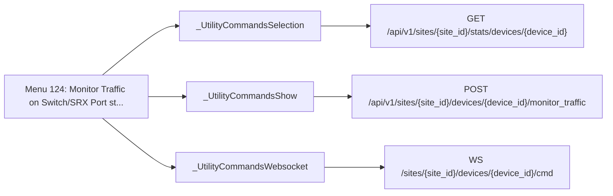

| Method | Path | SDK function | Called from | Found by |
| - | - | - | - | - |
| POST | `/api/v1/sites/{site_id}/devices/{device_id}/monitor_traffic` | [`sites.devices.monitorSiteDeviceTraffic`](https://www.juniper.net/documentation/us/en/software/mist/api/http/api/utilities/common/monitor-site-device-traffic) | [`_UtilityCommandsShow.monitor_traffic`](https://github.com/jmorrison-juniper/MistHelper/blob/main/src/device/_utility_commands_show.py) | Reference |
| GET | `/api/v1/sites/{site_id}/stats/devices/{device_id}` | [`sites.stats.getSiteDeviceStats`](https://www.juniper.net/documentation/us/en/software/mist/api/http/api/sites/stats/devices/get-site-device-stats) | [`_UtilityCommandsSelection._fetch_stats_data`](https://github.com/jmorrison-juniper/MistHelper/blob/main/src/device/_utility_commands_selection.py) | Call |
| WS | `/sites/{site_id}/devices/{device_id}/cmd` | None (WebSocket channel) | [`_UtilityCommandsWebsocket._prepare_ws_channel`](https://github.com/jmorrison-juniper/MistHelper/blob/main/src/device/_utility_commands_websocket.py) | Channel |

## Menu 125

- Title: Run Top Command on Switch/SRX (streaming, Ctrl+C to stop)
- Handler: `lambda: _get_duc_instance().run_top()`
- Shared helpers: [`DataExporter`](Menu-API-Endpoints#dataexporter), [`InputUtils`](Menu-API-Endpoints#inpututils), [`MainEntrypoint`](Menu-API-Endpoints#mainentrypoint), [`PromptUtils`](Menu-API-Endpoints#promptutils)
- Endpoints: 3

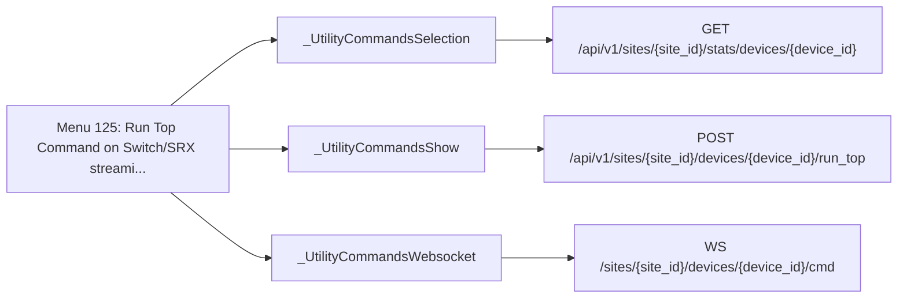

| Method | Path | SDK function | Called from | Found by |
| - | - | - | - | - |
| POST | `/api/v1/sites/{site_id}/devices/{device_id}/run_top` | [`sites.devices.runSiteSrxTopCommand`](https://www.juniper.net/documentation/us/en/software/mist/api/http/api/utilities/wan/run-site-srx-top-command) | [`_UtilityCommandsShow.run_top`](https://github.com/jmorrison-juniper/MistHelper/blob/main/src/device/_utility_commands_show.py) | Reference |
| GET | `/api/v1/sites/{site_id}/stats/devices/{device_id}` | [`sites.stats.getSiteDeviceStats`](https://www.juniper.net/documentation/us/en/software/mist/api/http/api/sites/stats/devices/get-site-device-stats) | [`_UtilityCommandsSelection._get_device_info`](https://github.com/jmorrison-juniper/MistHelper/blob/main/src/device/_utility_commands_selection.py) | Call |
| WS | `/sites/{site_id}/devices/{device_id}/cmd` | None (WebSocket channel) | [`_UtilityCommandsWebsocket._prepare_ws_channel`](https://github.com/jmorrison-juniper/MistHelper/blob/main/src/device/_utility_commands_websocket.py) | Channel |

## Menu 126

- Title: Poll Fresh Statistics from Switch
- Handler: `lambda: _get_duc_instance().poll_switch_stats()`
- Shared helpers: [`DataExporter`](Menu-API-Endpoints#dataexporter), [`InputUtils`](Menu-API-Endpoints#inpututils), [`MainEntrypoint`](Menu-API-Endpoints#mainentrypoint), [`PromptUtils`](Menu-API-Endpoints#promptutils)
- Endpoints: 2

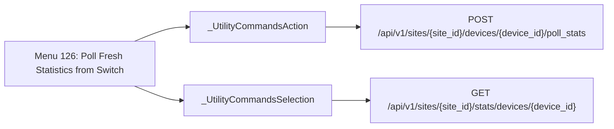

| Method | Path | SDK function | Called from | Found by |
| - | - | - | - | - |
| POST | `/api/v1/sites/{site_id}/devices/{device_id}/poll_stats` | [`sites.devices.pollSiteSwitchStats`](https://www.juniper.net/documentation/us/en/software/mist/api/http/api/utilities/lan/poll-site-switch-stats) | [`_UtilityCommandsAction.poll_switch_stats`](https://github.com/jmorrison-juniper/MistHelper/blob/main/src/device/_utility_commands_action.py) | Call |
| GET | `/api/v1/sites/{site_id}/stats/devices/{device_id}` | [`sites.stats.getSiteDeviceStats`](https://www.juniper.net/documentation/us/en/software/mist/api/http/api/sites/stats/devices/get-site-device-stats) | [`_UtilityCommandsSelection._get_device_info`](https://github.com/jmorrison-juniper/MistHelper/blob/main/src/device/_utility_commands_selection.py) | Call |

## Menu 127

- Title: Create Device Snapshot on Switch
- Handler: `lambda: _get_duc_instance().create_device_snapshot()`
- Shared helpers: [`DataExporter`](Menu-API-Endpoints#dataexporter), [`InputUtils`](Menu-API-Endpoints#inpututils), [`MainEntrypoint`](Menu-API-Endpoints#mainentrypoint), [`PromptUtils`](Menu-API-Endpoints#promptutils)
- Endpoints: 2


| Method | Path | SDK function | Called from | Found by |
| - | - | - | - | - |
| POST | `/api/v1/sites/{site_id}/devices/{device_id}/snapshot` | [`sites.devices.createSiteDeviceSnapshot`](https://www.juniper.net/documentation/us/en/software/mist/api/http/api/utilities/lan/create-site-device-snapshot) | [`_UtilityCommandsAction.create_device_snapshot`](https://github.com/jmorrison-juniper/MistHelper/blob/main/src/device/_utility_commands_action.py) | Call |
| GET | `/api/v1/sites/{site_id}/stats/devices/{device_id}` | [`sites.stats.getSiteDeviceStats`](https://www.juniper.net/documentation/us/en/software/mist/api/http/api/sites/stats/devices/get-site-device-stats) | [`_UtilityCommandsSelection._get_device_info`](https://github.com/jmorrison-juniper/MistHelper/blob/main/src/device/_utility_commands_selection.py) | Call |

## Menu 128

- Title: Locate Device - Blink LED on AP or Switch
- Handler: `lambda: _get_duc_instance().locate_device()`
- Shared helpers: [`DataExporter`](Menu-API-Endpoints#dataexporter), [`InputUtils`](Menu-API-Endpoints#inpututils), [`MainEntrypoint`](Menu-API-Endpoints#mainentrypoint), [`PromptUtils`](Menu-API-Endpoints#promptutils)
- Endpoints: 2

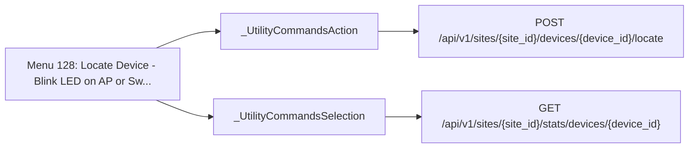

| Method | Path | SDK function | Called from | Found by |
| - | - | - | - | - |
| POST | `/api/v1/sites/{site_id}/devices/{device_id}/locate` | [`sites.devices.startSiteLocateDevice`](https://www.juniper.net/documentation/us/en/software/mist/api/http/api/utilities/common/start-site-locate-device) | [`_UtilityCommandsAction._invoke_locate`](https://github.com/jmorrison-juniper/MistHelper/blob/main/src/device/_utility_commands_action.py) | Call |
| GET | `/api/v1/sites/{site_id}/stats/devices/{device_id}` | [`sites.stats.getSiteDeviceStats`](https://www.juniper.net/documentation/us/en/software/mist/api/http/api/sites/stats/devices/get-site-device-stats) | [`_UtilityCommandsSelection._get_device_info`](https://github.com/jmorrison-juniper/MistHelper/blob/main/src/device/_utility_commands_selection.py) | Call |

## Menu 129

- Title: Unlocate Device - Stop LED Blinking on AP or Switch
- Handler: `lambda: _get_duc_instance().unlocate_device()`
- Shared helpers: [`DataExporter`](Menu-API-Endpoints#dataexporter), [`InputUtils`](Menu-API-Endpoints#inpututils), [`MainEntrypoint`](Menu-API-Endpoints#mainentrypoint), [`PromptUtils`](Menu-API-Endpoints#promptutils)
- Endpoints: 2

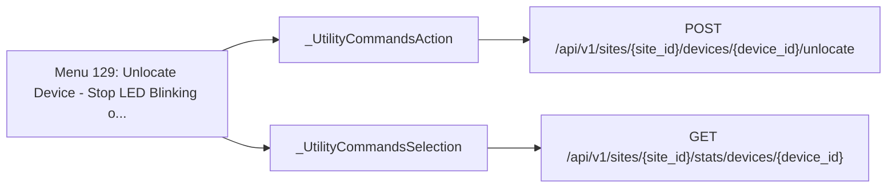

| Method | Path | SDK function | Called from | Found by |
| - | - | - | - | - |
| POST | `/api/v1/sites/{site_id}/devices/{device_id}/unlocate` | [`sites.devices.stopSiteLocateDevice`](https://www.juniper.net/documentation/us/en/software/mist/api/http/api/utilities/common/stop-site-locate-device) | [`_UtilityCommandsAction.unlocate_device`](https://github.com/jmorrison-juniper/MistHelper/blob/main/src/device/_utility_commands_action.py) | Call |
| GET | `/api/v1/sites/{site_id}/stats/devices/{device_id}` | [`sites.stats.getSiteDeviceStats`](https://www.juniper.net/documentation/us/en/software/mist/api/http/api/sites/stats/devices/get-site-device-stats) | [`_UtilityCommandsSelection._get_device_info`](https://github.com/jmorrison-juniper/MistHelper/blob/main/src/device/_utility_commands_selection.py) | Call |

## Menu 130

- Title: Re-adopt Switch Device
- Handler: `lambda: _get_duc_instance().readopt_device()`
- Shared helpers: [`DataExporter`](Menu-API-Endpoints#dataexporter), [`InputUtils`](Menu-API-Endpoints#inpututils), [`MainEntrypoint`](Menu-API-Endpoints#mainentrypoint), [`PromptUtils`](Menu-API-Endpoints#promptutils)
- Endpoints: 3

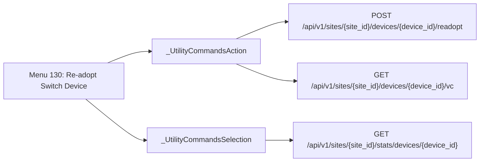

| Method | Path | SDK function | Called from | Found by |
| - | - | - | - | - |
| POST | `/api/v1/sites/{site_id}/devices/{device_id}/readopt` | [`sites.devices.readoptSiteOctermDevice`](https://www.juniper.net/documentation/us/en/software/mist/api/http/api/utilities/common/readopt-site-octerm-device) | [`_UtilityCommandsAction._invoke_readopt`](https://github.com/jmorrison-juniper/MistHelper/blob/main/src/device/_utility_commands_action.py) | Call |
| GET | `/api/v1/sites/{site_id}/devices/{device_id}/vc` | [`sites.devices.getSiteDeviceVirtualChassis`](https://www.juniper.net/documentation/us/en/software/mist/api/http/api/sites/devices/wired/virtual-chassis/get-site-device-virtual-chassis) | [`_UtilityCommandsAction._readopt_vc_preflight`](https://github.com/jmorrison-juniper/MistHelper/blob/main/src/device/_utility_commands_action.py) | Call |
| GET | `/api/v1/sites/{site_id}/stats/devices/{device_id}` | [`sites.stats.getSiteDeviceStats`](https://www.juniper.net/documentation/us/en/software/mist/api/http/api/sites/stats/devices/get-site-device-stats) | [`_UtilityCommandsSelection._get_device_info`](https://github.com/jmorrison-juniper/MistHelper/blob/main/src/device/_utility_commands_selection.py) | Call |

## Menu 131

- Title: Get ZTP Password for Switch/Gateway (console only)
- Handler: `lambda: _get_duc_instance().get_ztp_password()`
- Shared helpers: [`DataExporter`](Menu-API-Endpoints#dataexporter), [`InputUtils`](Menu-API-Endpoints#inpututils), [`MainEntrypoint`](Menu-API-Endpoints#mainentrypoint), [`PromptUtils`](Menu-API-Endpoints#promptutils)
- Endpoints: 2

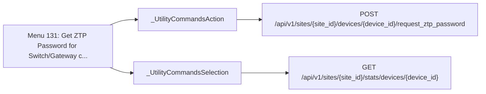

| Method | Path | SDK function | Called from | Found by |
| - | - | - | - | - |
| POST | `/api/v1/sites/{site_id}/devices/{device_id}/request_ztp_password` | [`sites.devices.getSiteDeviceZtpPassword`](https://www.juniper.net/documentation/us/en/software/mist/api/http/api/utilities/common/get-site-device-ztp-password) | [`_UtilityCommandsAction.get_ztp_password`](https://github.com/jmorrison-juniper/MistHelper/blob/main/src/device/_utility_commands_action.py) | Call |
| GET | `/api/v1/sites/{site_id}/stats/devices/{device_id}` | [`sites.stats.getSiteDeviceStats`](https://www.juniper.net/documentation/us/en/software/mist/api/http/api/sites/stats/devices/get-site-device-stats) | [`_UtilityCommandsSelection._get_device_info`](https://github.com/jmorrison-juniper/MistHelper/blob/main/src/device/_utility_commands_selection.py) | Call |

## Menu 132

- Title: Get Config CLI Commands for Switch Adoption
- Handler: `lambda: _get_duc_instance().get_config_commands()`
- Shared helpers: [`DataExporter`](Menu-API-Endpoints#dataexporter), [`InputUtils`](Menu-API-Endpoints#inpututils), [`MainEntrypoint`](Menu-API-Endpoints#mainentrypoint), [`PromptUtils`](Menu-API-Endpoints#promptutils)
- Endpoints: 2

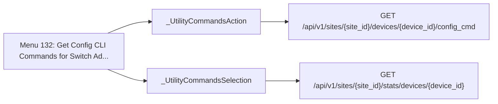

| Method | Path | SDK function | Called from | Found by |
| - | - | - | - | - |
| GET | `/api/v1/sites/{site_id}/devices/{device_id}/config_cmd` | [`sites.devices.getSiteDeviceConfigCmd`](https://www.juniper.net/documentation/us/en/software/mist/api/http/api/utilities/common/get-site-device-config-cmd) | [`_UtilityCommandsAction.get_config_commands`](https://github.com/jmorrison-juniper/MistHelper/blob/main/src/device/_utility_commands_action.py) | Call |
| GET | `/api/v1/sites/{site_id}/stats/devices/{device_id}` | [`sites.stats.getSiteDeviceStats`](https://www.juniper.net/documentation/us/en/software/mist/api/http/api/sites/stats/devices/get-site-device-stats) | [`_UtilityCommandsSelection._get_device_info`](https://github.com/jmorrison-juniper/MistHelper/blob/main/src/device/_utility_commands_selection.py) | Call |

## Menu 133

- Title: Upload Support File from Switch/Gateway
- Handler: `lambda: _get_duc_instance().upload_support_file()`
- Shared helpers: [`DataExporter`](Menu-API-Endpoints#dataexporter), [`InputUtils`](Menu-API-Endpoints#inpututils), [`MainEntrypoint`](Menu-API-Endpoints#mainentrypoint), [`PromptUtils`](Menu-API-Endpoints#promptutils)
- Endpoints: 2

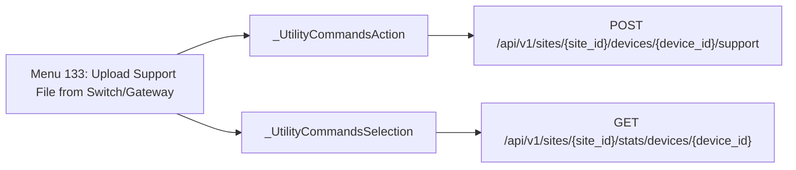

| Method | Path | SDK function | Called from | Found by |
| - | - | - | - | - |
| POST | `/api/v1/sites/{site_id}/devices/{device_id}/support` | [`sites.devices.uploadSiteDeviceSupportFile`](https://www.juniper.net/documentation/us/en/software/mist/api/http/api/utilities/common/upload-site-device-support-file) | [`_UtilityCommandsAction._invoke_support_upload`](https://github.com/jmorrison-juniper/MistHelper/blob/main/src/device/_utility_commands_action.py) | Call |
| GET | `/api/v1/sites/{site_id}/stats/devices/{device_id}` | [`sites.stats.getSiteDeviceStats`](https://www.juniper.net/documentation/us/en/software/mist/api/http/api/sites/stats/devices/get-site-device-stats) | [`_UtilityCommandsSelection._get_device_info`](https://github.com/jmorrison-juniper/MistHelper/blob/main/src/device/_utility_commands_selection.py) | Call |

## Menu 134

- Title: Start Site Packet Capture - Wireless/Wired/Gateway/Scan captures with WebSocket streaming
- Handler: `lambda: PacketCaptureManager(MainEntrypoint.context.apisession, ConfigUtils.get_cached_or_prompted_org_id()).start_site_packet_capture()`
- Shared helpers: [`ConfigUtils`](Menu-API-Endpoints#configutils), [`DataExporter`](Menu-API-Endpoints#dataexporter), [`InputUtils`](Menu-API-Endpoints#inpututils), [`MainEntrypoint`](Menu-API-Endpoints#mainentrypoint), [`PromptUtils`](Menu-API-Endpoints#promptutils), [`SourceDependencyResolver`](Menu-API-Endpoints#sourcedependencyresolver)
- Endpoints: 10

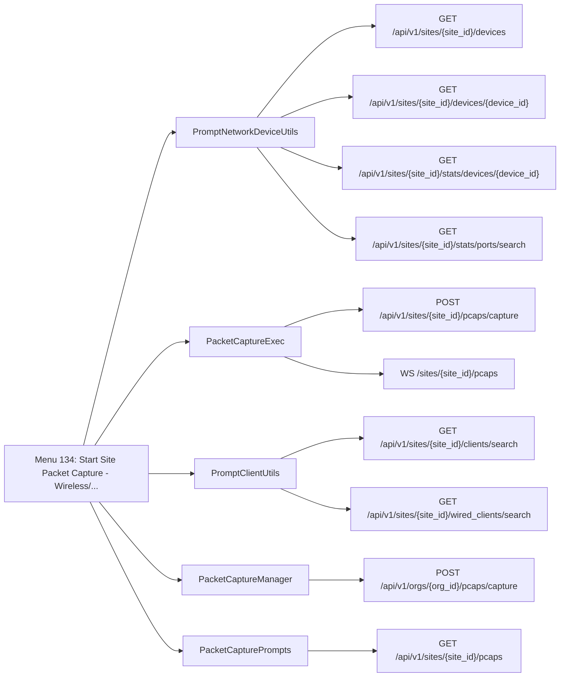

| Method | Path | SDK function | Called from | Found by |
| - | - | - | - | - |
| POST | `/api/v1/orgs/{org_id}/pcaps/capture` | [`orgs.pcaps.startOrgPacketCapture`](https://www.juniper.net/documentation/us/en/software/mist/api/http/api/utilities/pcaps/start-org-packet-capture) | [`PacketCaptureManager._export_capture_info_to_csv`](https://github.com/jmorrison-juniper/MistHelper/blob/main/src/capture/packet_capture.py) | Name |
| GET | `/api/v1/sites/{site_id}/clients/search` | [`sites.clients.searchSiteWirelessClients`](https://www.juniper.net/documentation/us/en/software/mist/api/http/api/sites/clients/wireless/search-site-wireless-clients) | [`PromptClientUtils._fetch_all_clients_for_site`](https://github.com/jmorrison-juniper/MistHelper/blob/main/src/input/prompt_client_utils.py) | Call |
| GET | `/api/v1/sites/{site_id}/devices` | [`sites.devices.listSiteDevices`](https://www.juniper.net/documentation/us/en/software/mist/api/http/api/sites/devices/list-site-devices) | [`PromptNetworkDeviceUtils._fetch_and_sort_devices`](https://github.com/jmorrison-juniper/MistHelper/blob/main/src/device/prompt_utils.py) | Call |
| GET | `/api/v1/sites/{site_id}/devices/{device_id}` | [`sites.devices.getSiteDevice`](https://www.juniper.net/documentation/us/en/software/mist/api/http/api/sites/devices/get-site-device) | [`PromptNetworkDeviceUtils._fetch_port_config`](https://github.com/jmorrison-juniper/MistHelper/blob/main/src/device/prompt_utils.py) | Call |
| GET | `/api/v1/sites/{site_id}/pcaps` | [`sites.pcaps.listSitePacketCaptures`](https://www.juniper.net/documentation/us/en/software/mist/api/http/api/utilities/pcaps/list-site-packet-captures) | [`PacketCapturePrompts._fetch_site_pcaps`](https://github.com/jmorrison-juniper/MistHelper/blob/main/src/capture/_packet_capture_prompts.py) | Call |
| POST | `/api/v1/sites/{site_id}/pcaps/capture` | [`sites.pcaps.startSitePacketCapture`](https://www.juniper.net/documentation/us/en/software/mist/api/http/api/utilities/pcaps/start-site-packet-capture) | [`PacketCaptureExec.execute_site_capture`](https://github.com/jmorrison-juniper/MistHelper/blob/main/src/capture/_packet_capture_exec.py) | Call |
| GET | `/api/v1/sites/{site_id}/stats/devices/{device_id}` | [`sites.stats.getSiteDeviceStats`](https://www.juniper.net/documentation/us/en/software/mist/api/http/api/sites/stats/devices/get-site-device-stats) | [`PromptNetworkDeviceUtils._fetch_ap_port_stats`](https://github.com/jmorrison-juniper/MistHelper/blob/main/src/device/prompt_utils.py) | Call |
| GET | `/api/v1/sites/{site_id}/stats/ports/search` | [`sites.stats.searchSiteSwOrGwPorts`](https://www.juniper.net/documentation/us/en/software/mist/api/http/api/sites/stats/ports/search-site-sw-or-gw-ports) | [`PromptNetworkDeviceUtils._fetch_switch_gateway_port_stats`](https://github.com/jmorrison-juniper/MistHelper/blob/main/src/device/prompt_utils.py) | Call |
| GET | `/api/v1/sites/{site_id}/wired_clients/search` | [`sites.wired_clients.searchSiteWiredClients`](https://www.juniper.net/documentation/us/en/software/mist/api/http/api/sites/clients/wired/search-site-wired-clients) | [`PromptClientUtils._fetch_all_clients_for_site`](https://github.com/jmorrison-juniper/MistHelper/blob/main/src/input/prompt_client_utils.py) | Call |
| WS | `/sites/{site_id}/pcaps` | None (WebSocket channel) | [`PacketCaptureExec.subscribe_to_site_capture_stream`](https://github.com/jmorrison-juniper/MistHelper/blob/main/src/capture/_packet_capture_exec.py) | Channel |

## Menu 135

- Title: Start Organization Packet Capture - MxEdge captures for org-level Mist Edges only
- Handler: `lambda: PacketCaptureManager(MainEntrypoint.context.apisession, ConfigUtils.get_cached_or_prompted_org_id()).start_org_packet_capture()`
- Shared helpers: [`ConfigUtils`](Menu-API-Endpoints#configutils), [`DataExporter`](Menu-API-Endpoints#dataexporter), [`InputUtils`](Menu-API-Endpoints#inpututils), [`MainEntrypoint`](Menu-API-Endpoints#mainentrypoint)
- Endpoints: 7

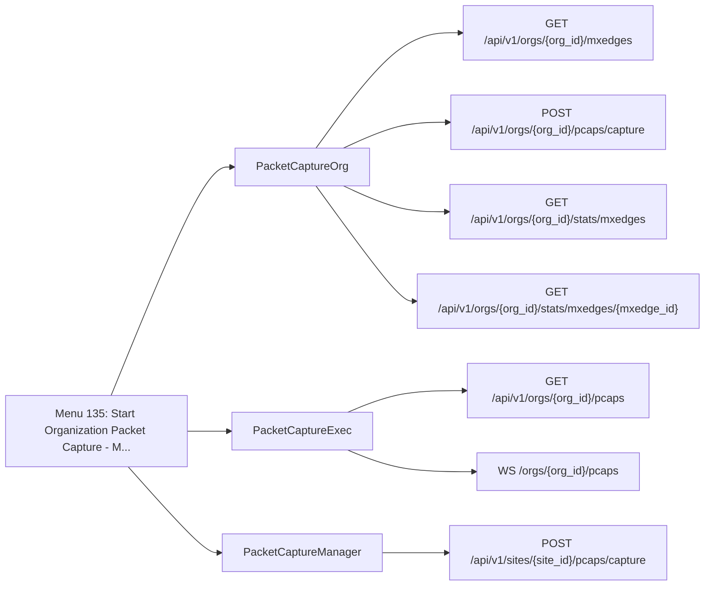

| Method | Path | SDK function | Called from | Found by |
| - | - | - | - | - |
| GET | `/api/v1/orgs/{org_id}/mxedges` | [`orgs.mxedges.listOrgMxEdges`](https://www.juniper.net/documentation/us/en/software/mist/api/http/api/orgs/mxedges/list-org-mx-edges) | [`PacketCaptureOrg._fetch_mxedge_list`](https://github.com/jmorrison-juniper/MistHelper/blob/main/src/capture/_packet_capture_org.py) | Call |
| GET | `/api/v1/orgs/{org_id}/pcaps` | [`orgs.pcaps.listOrgPacketCaptures`](https://www.juniper.net/documentation/us/en/software/mist/api/http/api/utilities/pcaps/list-org-packet-captures) | [`PacketCaptureExec.wait_and_download_pcap_org`](https://github.com/jmorrison-juniper/MistHelper/blob/main/src/capture/_packet_capture_exec.py) | Call |
| POST | `/api/v1/orgs/{org_id}/pcaps/capture` | [`orgs.pcaps.startOrgPacketCapture`](https://www.juniper.net/documentation/us/en/software/mist/api/http/api/utilities/pcaps/start-org-packet-capture) | [`PacketCaptureOrg.execute_org_capture`](https://github.com/jmorrison-juniper/MistHelper/blob/main/src/capture/_packet_capture_org.py) | Call |
| GET | `/api/v1/orgs/{org_id}/stats/mxedges` | [`orgs.stats.listOrgMxEdgesStats`](https://www.juniper.net/documentation/us/en/software/mist/api/http/api/orgs/stats/mxedges/list-org-mx-edges-stats) | [`PacketCaptureOrg._fetch_mxedge_stats_map`](https://github.com/jmorrison-juniper/MistHelper/blob/main/src/capture/_packet_capture_org.py) | Call |
| GET | `/api/v1/orgs/{org_id}/stats/mxedges/{mxedge_id}` | [`orgs.stats.getOrgMxEdgeStats`](https://www.juniper.net/documentation/us/en/software/mist/api/http/api/orgs/stats/mxedges/get-org-mx-edge-stats) | [`PacketCaptureOrg._fetch_single_mxedge_stats`](https://github.com/jmorrison-juniper/MistHelper/blob/main/src/capture/_packet_capture_org.py) | Call |
| POST | `/api/v1/sites/{site_id}/pcaps/capture` | [`sites.pcaps.startSitePacketCapture`](https://www.juniper.net/documentation/us/en/software/mist/api/http/api/utilities/pcaps/start-site-packet-capture) | [`PacketCaptureManager._export_capture_info_to_csv`](https://github.com/jmorrison-juniper/MistHelper/blob/main/src/capture/packet_capture.py) | Name |
| WS | `/orgs/{org_id}/pcaps` | None (WebSocket channel) | [`PacketCaptureExec.subscribe_to_org_capture_stream`](https://github.com/jmorrison-juniper/MistHelper/blob/main/src/capture/_packet_capture_exec.py) | Channel |

## Menu 136

- Title: MSP (Managed Service Provider) info - Displays guidance only (MSP data requires MSP-level API access, not org-level)
- Handler: `OrgConfigExporter.msp`
- Shared helpers: [`DataExporter`](Menu-API-Endpoints#dataexporter), [`InputUtils`](Menu-API-Endpoints#inpututils), [`SourceDependencyResolver`](Menu-API-Endpoints#sourcedependencyresolver)
- Endpoints: 1


| Method | Path | SDK function | Called from | Found by |
| - | - | - | - | - |
| GET | `/api/v1/msps/{msp_id}/orgs` | [`msps.orgs.listMspOrgs`](https://www.juniper.net/documentation/us/en/software/mist/api/http/api/msps/orgs/list-msp-orgs) | [`OrgConfigExporter._fetch_and_export_msp_orgs`](https://github.com/jmorrison-juniper/MistHelper/blob/main/src/export/org_config_exporter.py) | Call |

## Menu 137

- Title: Check current firmware upgrade status across organization with detailed progress monitoring and export to CSV
- Handler: `lambda: _build_firmware_manager(MainEntrypoint.context.apisession, ConfigUtils.get_cached_or_prompted_org_id()).check_firmware_upgrade_status()`
- Shared helpers: [`CacheUtils`](Menu-API-Endpoints#cacheutils), [`ConfigUtils`](Menu-API-Endpoints#configutils), [`DataExporter`](Menu-API-Endpoints#dataexporter), [`InputUtils`](Menu-API-Endpoints#inpututils), [`MainEntrypoint`](Menu-API-Endpoints#mainentrypoint), [`PromptUtils`](Menu-API-Endpoints#promptutils), [`SourceDependencyResolver`](Menu-API-Endpoints#sourcedependencyresolver), [`SourceDependencyResolverService`](Menu-API-Endpoints#sourcedependencyresolverservice)
- Endpoints: 11

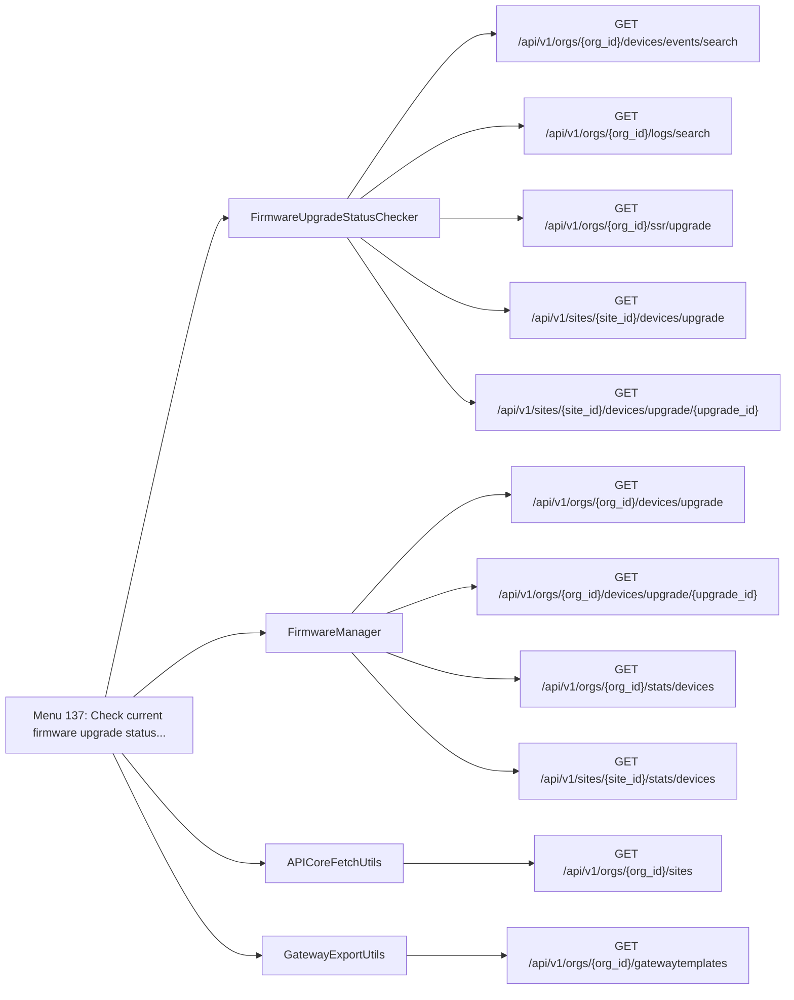

| Method | Path | SDK function | Called from | Found by |
| - | - | - | - | - |
| GET | `/api/v1/orgs/{org_id}/devices/events/search` | [`orgs.devices.searchOrgDeviceEvents`](https://www.juniper.net/documentation/us/en/software/mist/api/http/api/orgs/devices/search-org-device-events) | [`FirmwareUpgradeStatusChecker._fetch_device_upgrade_events_24h`](https://github.com/jmorrison-juniper/MistHelper/blob/main/src/firmware/firmware_manager.py) | Call |
| GET | `/api/v1/orgs/{org_id}/devices/upgrade` | [`orgs.devices.listOrgDeviceUpgrades`](https://www.juniper.net/documentation/us/en/software/mist/api/http/api/utilities/upgrade/list-org-device-upgrades) | [`FirmwareManager._fetch_org_upgrade_jobs`](https://github.com/jmorrison-juniper/MistHelper/blob/main/src/firmware/firmware_manager.py) | Call |
| GET | `/api/v1/orgs/{org_id}/devices/upgrade/{upgrade_id}` | [`orgs.devices.getOrgDeviceUpgrade`](https://www.juniper.net/documentation/us/en/software/mist/api/http/api/utilities/upgrade/get-org-device-upgrade) | [`FirmwareManager._print_upgrade_job_detail_block`](https://github.com/jmorrison-juniper/MistHelper/blob/main/src/firmware/firmware_manager.py) | Call |
| GET | `/api/v1/orgs/{org_id}/gatewaytemplates` | [`orgs.gatewaytemplates.listOrgGatewayTemplates`](https://www.juniper.net/documentation/us/en/software/mist/api/http/api/orgs/gateway-templates/list-org-gateway-templates) | [`GatewayExportUtils.templates`](https://github.com/jmorrison-juniper/MistHelper/blob/main/src/gateway/gateway_export_utils.py) | Call |
| GET | `/api/v1/orgs/{org_id}/logs/search` | [`orgs.logs.listOrgAuditLogs`](https://www.juniper.net/documentation/us/en/software/mist/api/http/api/orgs/logs/list-org-audit-logs) | [`FirmwareUpgradeStatusChecker._fetch_audit_logs_24h`](https://github.com/jmorrison-juniper/MistHelper/blob/main/src/firmware/firmware_manager.py) | Call |
| GET | `/api/v1/orgs/{org_id}/sites` | [`orgs.sites.listOrgSites`](https://www.juniper.net/documentation/us/en/software/mist/api/http/api/orgs/sites/list-org-sites) | [`APICoreFetchUtils.all_sites_with_limit`](https://github.com/jmorrison-juniper/MistHelper/blob/main/src/api/api_core_fetch_utils.py) | Call |
| GET | `/api/v1/orgs/{org_id}/ssr/upgrade` | [`orgs.ssr.listOrgSsrUpgrades`](https://www.juniper.net/documentation/us/en/software/mist/api/http/api/utilities/upgrade/list-org-ssr-upgrades) | [`FirmwareUpgradeStatusChecker._fetch_ssr_upgrades_payload`](https://github.com/jmorrison-juniper/MistHelper/blob/main/src/firmware/firmware_manager.py) | Call |
| GET | `/api/v1/orgs/{org_id}/stats/devices` | [`orgs.stats.listOrgDevicesStats`](https://www.juniper.net/documentation/us/en/software/mist/api/http/api/orgs/stats/devices/list-org-devices-stats) | [`FirmwareManager._fetch_device_stats_for_monitoring`](https://github.com/jmorrison-juniper/MistHelper/blob/main/src/firmware/firmware_manager.py) | Call |
| GET | `/api/v1/sites/{site_id}/devices/upgrade` | [`sites.devices.listSiteDeviceUpgrades`](https://www.juniper.net/documentation/us/en/software/mist/api/http/api/utilities/upgrade/list-site-device-upgrades) | [`FirmwareUpgradeStatusChecker._check_single_site_upgrades`](https://github.com/jmorrison-juniper/MistHelper/blob/main/src/firmware/firmware_manager.py) | Call |
| GET | `/api/v1/sites/{site_id}/devices/upgrade/{upgrade_id}` | [`sites.devices.getSiteDeviceUpgrade`](https://www.juniper.net/documentation/us/en/software/mist/api/http/api/utilities/upgrade/get-site-device-upgrade) | [`FirmwareUpgradeStatusChecker._safe_get_site_upgrade_data`](https://github.com/jmorrison-juniper/MistHelper/blob/main/src/firmware/firmware_manager.py) | Call |
| GET | `/api/v1/sites/{site_id}/stats/devices` | [`sites.stats.listSiteDevicesStats`](https://www.juniper.net/documentation/us/en/software/mist/api/http/api/sites/stats/devices/list-site-devices-stats) | [`FirmwareManager._fetch_device_stats_for_monitoring`](https://github.com/jmorrison-juniper/MistHelper/blob/main/src/firmware/firmware_manager.py) | Call |

## Menu 138

- Title: Compare inventory data with external CSV file using configurable address similarity threshold (ADDRESS_MATCH_THRESHOLD in .env)
- Handler: `lambda fast=False, address_check=False, debug=False, skip_ssl_verify=False: InventoryCSVComparator(fast=fast, address_check=address_check, debug=debug, skip_...`
- Shared helpers: [`CacheUtils`](Menu-API-Endpoints#cacheutils), [`ConfigUtils`](Menu-API-Endpoints#configutils), [`DataExporter`](Menu-API-Endpoints#dataexporter), [`InputUtils`](Menu-API-Endpoints#inpututils), [`SourceDependencyResolver`](Menu-API-Endpoints#sourcedependencyresolver)
- Endpoints: 3

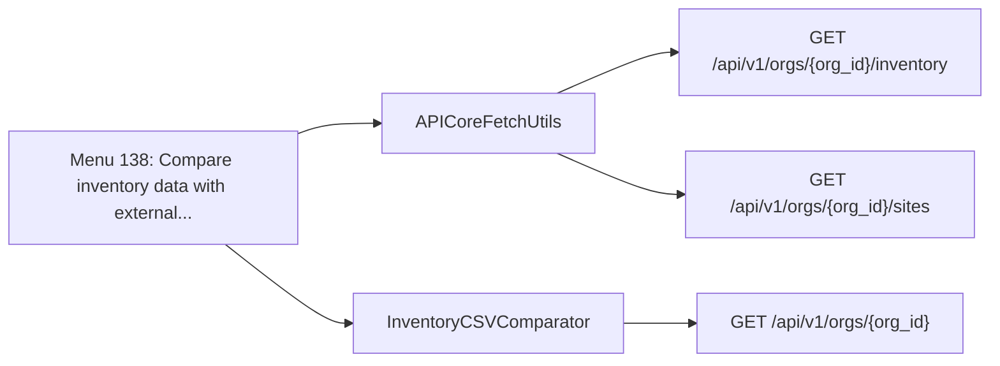

| Method | Path | SDK function | Called from | Found by |
| - | - | - | - | - |
| GET | `/api/v1/orgs/{org_id}` | [`orgs.orgs.getOrg`](https://www.juniper.net/documentation/us/en/software/mist/api/http/api/orgs/get-org) | [`InventoryCSVComparator._fetch_org_response`](https://github.com/jmorrison-juniper/MistHelper/blob/main/src/inventory/csv_comparator.py) | Call |
| GET | `/api/v1/orgs/{org_id}/inventory` | [`orgs.inventory.getOrgInventory`](https://www.juniper.net/documentation/us/en/software/mist/api/http/api/orgs/inventory/get-org-inventory) | [`APICoreFetchUtils.all_inventory_with_limit`](https://github.com/jmorrison-juniper/MistHelper/blob/main/src/api/api_core_fetch_utils.py) | Call |
| GET | `/api/v1/orgs/{org_id}/sites` | [`orgs.sites.listOrgSites`](https://www.juniper.net/documentation/us/en/software/mist/api/http/api/orgs/sites/list-org-sites) | [`APICoreFetchUtils.all_sites_with_limit`](https://github.com/jmorrison-juniper/MistHelper/blob/main/src/api/api_core_fetch_utils.py) | Call |

## Menu 139

- Title: Interactive Marvis (VNA) AI troubleshooting - guided client, device, and network analysis
- Handler: `TroubleshootUtils.launch_interactive`
- Shared helpers: [`ConfigUtils`](Menu-API-Endpoints#configutils), [`DataExporter`](Menu-API-Endpoints#dataexporter), [`InputUtils`](Menu-API-Endpoints#inpututils), [`PromptUtils`](Menu-API-Endpoints#promptutils), [`SourceDependencyResolver`](Menu-API-Endpoints#sourcedependencyresolver)
- Endpoints: 4

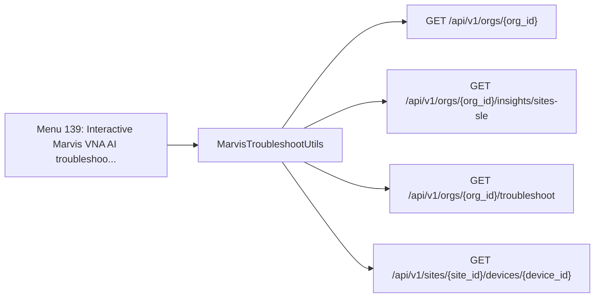

| Method | Path | SDK function | Called from | Found by |
| - | - | - | - | - |
| GET | `/api/v1/orgs/{org_id}` | [`orgs.orgs.getOrg`](https://www.juniper.net/documentation/us/en/software/mist/api/http/api/orgs/get-org) | [`MarvisTroubleshootUtils._fetch_org_info`](https://github.com/jmorrison-juniper/MistHelper/blob/main/src/troubleshooting/marvis_troubleshoot_utils.py) | Call |
| GET | `/api/v1/orgs/{org_id}/insights/sites-sle` | [`orgs.insights.getOrgSitesSle`](https://www.juniper.net/documentation/us/en/software/mist/api/http/api/orgs/sles/get-org-sites-sle) | [`MarvisTroubleshootUtils._insight_endpoints`](https://github.com/jmorrison-juniper/MistHelper/blob/main/src/troubleshooting/marvis_troubleshoot_utils.py) | Call |
| GET | `/api/v1/orgs/{org_id}/troubleshoot` | [`orgs.troubleshoot.troubleshootOrg`](https://www.juniper.net/documentation/us/en/software/mist/api/http/api/orgs/marvis/troubleshoot-org) | [`MarvisTroubleshootUtils._invoke_client_troubleshoot`](https://github.com/jmorrison-juniper/MistHelper/blob/main/src/troubleshooting/marvis_troubleshoot_utils.py) | Call |
| GET | `/api/v1/sites/{site_id}/devices/{device_id}` | [`sites.devices.getSiteDevice`](https://www.juniper.net/documentation/us/en/software/mist/api/http/api/sites/devices/get-site-device) | [`MarvisTroubleshootUtils._lookup_device`](https://github.com/jmorrison-juniper/MistHelper/blob/main/src/troubleshooting/marvis_troubleshoot_utils.py) | Call |

## Menu 140

- Title: Interactively execute a CLI command on a gateway or switch (exit with ~)
- Handler: `CLIShellManager.launch`
- Shared helpers: [`PromptUtils`](Menu-API-Endpoints#promptutils), [`SourceDependencyResolver`](Menu-API-Endpoints#sourcedependencyresolver)
- Endpoints: 1

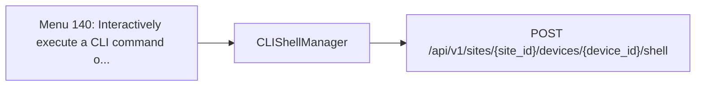

| Method | Path | SDK function | Called from | Found by |
| - | - | - | - | - |
| POST | `/api/v1/sites/{site_id}/devices/{device_id}/shell` | [`sites.devices.createSiteDeviceShellSession`](https://www.juniper.net/documentation/us/en/software/mist/api/http/api/utilities/common/create-site-device-shell-session) | [`CLIShellManager._create_session`](https://github.com/jmorrison-juniper/MistHelper/blob/main/src/ssh/cli_shell_manager.py) | Call |

## Menu 141

- Title: Launch Terminal User Interface (TUI) mode - Visual navigation of Mist API library with interactive exploration
- Handler: `lambda: TUILauncher().launch()`
- Shared helpers: [`SourceDependencyResolver`](Menu-API-Endpoints#sourcedependencyresolver), [`SourceDependencyResolverService`](Menu-API-Endpoints#sourcedependencyresolverservice)
- Endpoints: 0

Menu 141 opens a browser for the mistapi library. The operator selects the SDK function at run time, so the map cannot name one endpoint.

## Menu 142

- Title: Maps Manager - Interactive site floorplan and map operations (sub-menu)
- Handler: `lambda: MapsManagerLauncher().launch()`
- Shared helpers: [`ConfigUtils`](Menu-API-Endpoints#configutils), [`DataExporter`](Menu-API-Endpoints#dataexporter), [`InputUtils`](Menu-API-Endpoints#inpututils), [`PromptUtils`](Menu-API-Endpoints#promptutils), [`SourceDependencyResolver`](Menu-API-Endpoints#sourcedependencyresolver)
- Endpoints: 21

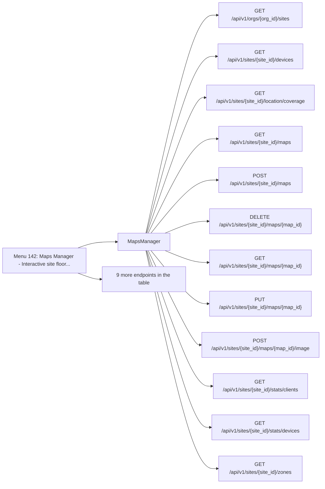

| Method | Path | SDK function | Called from | Found by |
| - | - | - | - | - |
| GET | `/api/v1/orgs/{org_id}/sites` | [`orgs.sites.listOrgSites`](https://www.juniper.net/documentation/us/en/software/mist/api/http/api/orgs/sites/list-org-sites) | [`MapsManager._fetch_sites`](https://github.com/jmorrison-juniper/MistHelper/blob/main/src/maps/maps_manager.py) | Call |
| GET | `/api/v1/sites/{site_id_for_coverage}/location/coverage` | None (raw request) | [`_ViewerUrlSwitch._fetch_url_switch_coverage`](https://github.com/jmorrison-juniper/MistHelper/blob/main/src/maps/launcher/_viewer_url_switch.py) | Path |
| GET | `/api/v1/sites/{site_id}/beacons` | [`sites.beacons.listSiteBeacons`](https://www.juniper.net/documentation/us/en/software/mist/api/http/api/sites/beacons/list-site-beacons) | [`_MapsWizard._wizard_fetch_beacons`](https://github.com/jmorrison-juniper/MistHelper/blob/main/src/maps/_maps_wizard.py) | Reference |
| PUT | `/api/v1/sites/{site_id}/beacons/{beacon_id}` | [`sites.beacons.updateSiteBeacon`](https://www.juniper.net/documentation/us/en/software/mist/api/http/api/sites/beacons/update-site-beacon) | [`_MapsWizard._update_single_beacon`](https://github.com/jmorrison-juniper/MistHelper/blob/main/src/maps/_maps_wizard.py) | Call |
| GET | `/api/v1/sites/{site_id}/devices` | [`sites.devices.listSiteDevices`](https://www.juniper.net/documentation/us/en/software/mist/api/http/api/sites/devices/list-site-devices) | [`MapsManager._get_devices_on_map`](https://github.com/jmorrison-juniper/MistHelper/blob/main/src/maps/maps_manager.py) | Call |
| PUT | `/api/v1/sites/{site_id}/devices/{device_id}` | [`sites.devices.updateSiteDevice`](https://www.juniper.net/documentation/us/en/software/mist/api/http/api/sites/devices/update-site-device) | [`_MapsWizard._update_single_device`](https://github.com/jmorrison-juniper/MistHelper/blob/main/src/maps/_maps_wizard.py) | Call |
| GET | `/api/v1/sites/{site_id}/location/coverage` | None (raw request) | [`MapsManager._request_map_coverage`](https://github.com/jmorrison-juniper/MistHelper/blob/main/src/maps/maps_manager.py) | Path |
| GET | `/api/v1/sites/{site_id}/maps` | [`sites.maps.listSiteMaps`](https://www.juniper.net/documentation/us/en/software/mist/api/http/api/sites/maps/list-site-maps) | [`MapsManager._collect_all_org_map_rows`](https://github.com/jmorrison-juniper/MistHelper/blob/main/src/maps/maps_manager.py) | Call |
| POST | `/api/v1/sites/{site_id}/maps` | [`sites.maps.createSiteMap`](https://www.juniper.net/documentation/us/en/software/mist/api/http/api/sites/maps/create-site-map) | [`MapsManager._build_and_create_map`](https://github.com/jmorrison-juniper/MistHelper/blob/main/src/maps/maps_manager.py) | Call |
| DELETE | `/api/v1/sites/{site_id}/maps/{map_id}` | [`sites.maps.deleteSiteMap`](https://www.juniper.net/documentation/us/en/software/mist/api/http/api/sites/maps/delete-site-map) | [`MapsManager._perform_map_delete`](https://github.com/jmorrison-juniper/MistHelper/blob/main/src/maps/maps_manager.py) | Call |
| GET | `/api/v1/sites/{site_id}/maps/{map_id}` | [`sites.maps.getSiteMap`](https://www.juniper.net/documentation/us/en/software/mist/api/http/api/sites/maps/get-site-map) | [`MapsManager._fetch_map_for_delete`](https://github.com/jmorrison-juniper/MistHelper/blob/main/src/maps/maps_manager.py) | Call |
| PUT | `/api/v1/sites/{site_id}/maps/{map_id}` | [`sites.maps.updateSiteMap`](https://www.juniper.net/documentation/us/en/software/mist/api/http/api/sites/maps/update-site-map) | [`MapsManager._apply_map_update`](https://github.com/jmorrison-juniper/MistHelper/blob/main/src/maps/maps_manager.py) | Call |
| POST | `/api/v1/sites/{site_id}/maps/{map_id}/image` | [`sites.maps.addSiteMapImageFile`](https://www.juniper.net/documentation/us/en/software/mist/api/http/api/sites/maps/add-site-map-image) | [`MapsManager._perform_image_upload`](https://github.com/jmorrison-juniper/MistHelper/blob/main/src/maps/maps_manager.py) | Call |
| GET | `/api/v1/sites/{site_id}/stats/clients` | [`sites.stats.listSiteWirelessClientsStats`](https://www.juniper.net/documentation/us/en/software/mist/api/http/api/sites/stats/clients-wireless/list-site-wireless-clients-stats) | [`MapsManager._fetch_all_wireless_clients`](https://github.com/jmorrison-juniper/MistHelper/blob/main/src/maps/maps_manager.py) | Call |
| GET | `/api/v1/sites/{site_id}/stats/devices` | [`sites.stats.listSiteDevicesStats`](https://www.juniper.net/documentation/us/en/software/mist/api/http/api/sites/stats/devices/list-site-devices-stats) | [`MapsManager._fetch_devices_on_map`](https://github.com/jmorrison-juniper/MistHelper/blob/main/src/maps/maps_manager.py) | Call |
| GET | `/api/v1/sites/{site_id}/vbeacons` | [`sites.vbeacons.listSiteVBeacons`](https://www.juniper.net/documentation/us/en/software/mist/api/http/api/sites/vbeacons/list-site-v-beacons) | [`_MapsWizard._wizard_fetch_beacons`](https://github.com/jmorrison-juniper/MistHelper/blob/main/src/maps/_maps_wizard.py) | Reference |
| PUT | `/api/v1/sites/{site_id}/vbeacons/{vbeacon_id}` | [`sites.vbeacons.updateSiteVBeacon`](https://www.juniper.net/documentation/us/en/software/mist/api/http/api/sites/vbeacons/update-site-v-beacon) | [`_MapsWizard._update_single_vbeacon`](https://github.com/jmorrison-juniper/MistHelper/blob/main/src/maps/_maps_wizard.py) | Call |
| GET | `/api/v1/sites/{site_id}/zones` | [`sites.zones.listSiteZones`](https://www.juniper.net/documentation/us/en/software/mist/api/http/api/sites/zones/list-site-zones) | [`MapsManager._fetch_zones_on_map`](https://github.com/jmorrison-juniper/MistHelper/blob/main/src/maps/maps_manager.py) | Call |
| POST | `/api/v1/sites/{site_id}/zones` | [`sites.zones.createSiteZone`](https://www.juniper.net/documentation/us/en/software/mist/api/http/api/sites/zones/create-site-zone) | [`_MapsClone._clone_single_zone`](https://github.com/jmorrison-juniper/MistHelper/blob/main/src/maps/_maps_clone.py) | Call |
| DELETE | `/api/v1/sites/{site_id}/zones/{zone_id}` | [`sites.zones.deleteSiteZone`](https://www.juniper.net/documentation/us/en/software/mist/api/http/api/sites/zones/delete-site-zone) | [`_ViewerDrawing._delete_zones_one_by_one`](https://github.com/jmorrison-juniper/MistHelper/blob/main/src/maps/launcher/_viewer_drawing.py) | Call |
| PUT | `/api/v1/sites/{site_id}/zones/{zone_id}` | [`sites.zones.updateSiteZone`](https://www.juniper.net/documentation/us/en/software/mist/api/http/api/sites/zones/update-site-zone) | [`_MapsWizard._update_single_zone`](https://github.com/jmorrison-juniper/MistHelper/blob/main/src/maps/_maps_wizard.py) | Call |

## Menu 143

- Title: Switch to interactive login (email/password) - Enables MSP-level API access for current session
- Handler: `lambda: SwitchToInteractiveLoginManager().run()`
- Shared helpers: [`InputUtils`](Menu-API-Endpoints#inpututils), [`MainEntrypoint`](Menu-API-Endpoints#mainentrypoint), [`SourceDependencyResolver`](Menu-API-Endpoints#sourcedependencyresolver)
- Endpoints: 3

```mermaid
flowchart LR
    menu["Menu 143: Switch to interactive login email/pas..."]
    menu --> c1["MspOrgSelector"]
    c1 --> e1["GET /api/v1/msps/{msp_id}/orgs"]
    menu --> c2["_fetch_msp_name"]
    c2 --> e2["GET /api/v1/msps/{msp_id}"]
    menu --> c3["_msp_fetch_user_data"]
    c3 --> e3["GET /api/v1/self"]
```

| Method | Path | SDK function | Called from | Found by |
| - | - | - | - | - |
| GET | `/api/v1/msps/{msp_id}` | [`msps.msps.getMspDetails`](https://www.juniper.net/documentation/us/en/software/mist/api/http/api/msps/get-msp-details) | [`_fetch_msp_name`](https://github.com/jmorrison-juniper/MistHelper/blob/main/src/refactors/msp_privilege_detection.py) | Call |
| GET | `/api/v1/msps/{msp_id}/orgs` | [`msps.orgs.listMspOrgs`](https://www.juniper.net/documentation/us/en/software/mist/api/http/api/msps/orgs/list-msp-orgs) | [`MspOrgSelector._fetch_msp_orgs`](https://github.com/jmorrison-juniper/MistHelper/blob/main/src/auth/interactive/msp_org_selector.py) | Call |
| GET | `/api/v1/self` | [`self.self.getSelf`](https://www.juniper.net/documentation/us/en/software/mist/api/http/api/self/account/get-self) | [`_msp_fetch_user_data`](https://github.com/jmorrison-juniper/MistHelper/blob/main/src/refactors/msp_privilege_detection.py) | Call |

## Menu 144

- Title: MSP Inventory Export - Export device inventory across all MSPs and all organizations to CSV (requires MSP privileges via --login)
- Handler: `MSPInventoryExporter.execute`
- Shared helpers: [`DataExporter`](Menu-API-Endpoints#dataexporter), [`InputUtils`](Menu-API-Endpoints#inpututils), [`MainEntrypoint`](Menu-API-Endpoints#mainentrypoint), [`SourceDependencyResolver`](Menu-API-Endpoints#sourcedependencyresolver)
- Endpoints: 5

```mermaid
flowchart LR
    menu["Menu 144: MSP Inventory Export - Export device..."]
    menu --> c1["MSPInventoryExporter"]
    c1 --> e1["GET /api/v1/msps/{msp_id}/orgs"]
    c1 --> e2["GET /api/v1/orgs/{org_id}/inventory"]
    menu --> c2["APICoreFetchUtils"]
    c2 --> e3["GET /api/v1/orgs/{org_id}/sites"]
    menu --> c3["_fetch_msp_name"]
    c3 --> e4["GET /api/v1/msps/{msp_id}"]
    menu --> c4["_msp_fetch_user_data"]
    c4 --> e5["GET /api/v1/self"]
```

| Method | Path | SDK function | Called from | Found by |
| - | - | - | - | - |
| GET | `/api/v1/msps/{msp_id}` | [`msps.msps.getMspDetails`](https://www.juniper.net/documentation/us/en/software/mist/api/http/api/msps/get-msp-details) | [`_fetch_msp_name`](https://github.com/jmorrison-juniper/MistHelper/blob/main/src/refactors/msp_privilege_detection.py) | Call |
| GET | `/api/v1/msps/{msp_id}/orgs` | [`msps.orgs.listMspOrgs`](https://www.juniper.net/documentation/us/en/software/mist/api/http/api/msps/orgs/list-msp-orgs) | [`MSPInventoryExporter._fetch_msp_orgs`](https://github.com/jmorrison-juniper/MistHelper/blob/main/src/export/msp_inventory_exporter.py) | Call |
| GET | `/api/v1/orgs/{org_id}/inventory` | [`orgs.inventory.getOrgInventory`](https://www.juniper.net/documentation/us/en/software/mist/api/http/api/orgs/inventory/get-org-inventory) | [`MSPInventoryExporter._fetch_org_inventory`](https://github.com/jmorrison-juniper/MistHelper/blob/main/src/export/msp_inventory_exporter.py) | Call |
| GET | `/api/v1/orgs/{org_id}/sites` | [`orgs.sites.listOrgSites`](https://www.juniper.net/documentation/us/en/software/mist/api/http/api/orgs/sites/list-org-sites) | [`APICoreFetchUtils.all_sites_with_limit`](https://github.com/jmorrison-juniper/MistHelper/blob/main/src/api/api_core_fetch_utils.py) | Call |
| GET | `/api/v1/self` | [`self.self.getSelf`](https://www.juniper.net/documentation/us/en/software/mist/api/http/api/self/account/get-self) | [`_msp_fetch_user_data`](https://github.com/jmorrison-juniper/MistHelper/blob/main/src/refactors/msp_privilege_detection.py) | Call |

## Menu 145

- Title: SSID Template Consolidation (5-Phase Guided Workflow)
- Handler: `OrgExportUtils.ssid_template_consolidation`
- Shared helpers: [`ConfigUtils`](Menu-API-Endpoints#configutils), [`DataExporter`](Menu-API-Endpoints#dataexporter), [`InputUtils`](Menu-API-Endpoints#inpututils), [`SourceDependencyResolver`](Menu-API-Endpoints#sourcedependencyresolver)
- Endpoints: 11

```mermaid
flowchart LR
    menu["Menu 145: SSID Template Consolidation 5-Phase G..."]
    menu --> c1["_SsidTemplatePhase1Cluster"]
    c1 --> e1["GET /api/v1/orgs/{org_id}/mxtunnels"]
    c1 --> e2["GET /api/v1/orgs/{org_id}/sitegroups"]
    c1 --> e3["GET /api/v1/orgs/{org_id}/sites"]
    c1 --> e4["GET /api/v1/orgs/{org_id}/templates"]
    c1 --> e5["GET /api/v1/orgs/{org_id}/wlans"]
    menu --> c2["_apply_ssid_disable"]
    c2 --> e6["GET /api/v1/orgs/{org_id}/templates/{template_id}"]
    c2 --> e7["PUT /api/v1/orgs/{org_id}/templates/{template_id}"]
    menu --> c3["_create_new_template"]
    c3 --> e8["POST /api/v1/orgs/{org_id}/templates"]
    menu --> c4["_create_site_group"]
    c4 --> e9["POST /api/v1/orgs/{org_id}/sitegroups"]
    menu --> c5["_push_group_site_ids"]
    c5 --> e10["PUT /api/v1/orgs/{org_id}/sitegroups/{sitegroup_id}"]
    menu --> c6["_write_single_site_vars"]
    c6 --> e11["PUT /api/v1/sites/{site_id}"]
```

| Method | Path | SDK function | Called from | Found by |
| - | - | - | - | - |
| GET | `/api/v1/orgs/{org_id}/mxtunnels` | [`orgs.mxtunnels.listOrgMxTunnels`](https://www.juniper.net/documentation/us/en/software/mist/api/http/api/orgs/mxtunnels/list-org-mx-tunnels) | [`_SsidTemplatePhase1Cluster._fetch_specs`](https://github.com/jmorrison-juniper/MistHelper/blob/main/src/ssid_consolidation/_ssid_template_phase1.py) | Reference |
| GET | `/api/v1/orgs/{org_id}/sitegroups` | [`orgs.sitegroups.listOrgSiteGroups`](https://www.juniper.net/documentation/us/en/software/mist/api/http/api/orgs/sitegroups/list-org-site-groups) | [`_SsidTemplatePhase1Cluster._fetch_specs`](https://github.com/jmorrison-juniper/MistHelper/blob/main/src/ssid_consolidation/_ssid_template_phase1.py) | Reference |
| POST | `/api/v1/orgs/{org_id}/sitegroups` | [`orgs.sitegroups.createOrgSiteGroup`](https://www.juniper.net/documentation/us/en/software/mist/api/http/api/orgs/sitegroups/create-org-site-group) | [`_create_site_group`](https://github.com/jmorrison-juniper/MistHelper/blob/main/src/ssid_consolidation/ssid_template_consolidation.py) | Call |
| PUT | `/api/v1/orgs/{org_id}/sitegroups/{sitegroup_id}` | [`orgs.sitegroups.updateOrgSiteGroup`](https://www.juniper.net/documentation/us/en/software/mist/api/http/api/orgs/sitegroups/update-org-site-group) | [`_push_group_site_ids`](https://github.com/jmorrison-juniper/MistHelper/blob/main/src/ssid_consolidation/ssid_template_consolidation.py) | Call |
| GET | `/api/v1/orgs/{org_id}/sites` | [`orgs.sites.listOrgSites`](https://www.juniper.net/documentation/us/en/software/mist/api/http/api/orgs/sites/list-org-sites) | [`_SsidTemplatePhase1Cluster._fetch_specs`](https://github.com/jmorrison-juniper/MistHelper/blob/main/src/ssid_consolidation/_ssid_template_phase1.py) | Reference |
| GET | `/api/v1/orgs/{org_id}/templates` | [`orgs.templates.listOrgTemplates`](https://www.juniper.net/documentation/us/en/software/mist/api/http/api/orgs/wlan-templates/list-org-templates) | [`_SsidTemplatePhase1Cluster._fetch_specs`](https://github.com/jmorrison-juniper/MistHelper/blob/main/src/ssid_consolidation/_ssid_template_phase1.py) | Reference |
| POST | `/api/v1/orgs/{org_id}/templates` | [`orgs.templates.createOrgTemplate`](https://www.juniper.net/documentation/us/en/software/mist/api/http/api/orgs/wlan-templates/create-org-template) | [`_create_new_template`](https://github.com/jmorrison-juniper/MistHelper/blob/main/src/ssid_consolidation/ssid_template_consolidation.py) | Call |
| GET | `/api/v1/orgs/{org_id}/templates/{template_id}` | [`orgs.templates.getOrgTemplate`](https://www.juniper.net/documentation/us/en/software/mist/api/http/api/orgs/wlan-templates/get-org-template) | [`_apply_ssid_disable`](https://github.com/jmorrison-juniper/MistHelper/blob/main/src/ssid_consolidation/ssid_template_consolidation.py) | Call |
| PUT | `/api/v1/orgs/{org_id}/templates/{template_id}` | [`orgs.templates.updateOrgTemplate`](https://www.juniper.net/documentation/us/en/software/mist/api/http/api/orgs/wlan-templates/update-org-template) | [`_apply_ssid_disable`](https://github.com/jmorrison-juniper/MistHelper/blob/main/src/ssid_consolidation/ssid_template_consolidation.py) | Call |
| GET | `/api/v1/orgs/{org_id}/wlans` | [`orgs.wlans.listOrgWlans`](https://www.juniper.net/documentation/us/en/software/mist/api/http/api/orgs/wlans/list-org-wlans) | [`_SsidTemplatePhase1Cluster._fetch_specs`](https://github.com/jmorrison-juniper/MistHelper/blob/main/src/ssid_consolidation/_ssid_template_phase1.py) | Reference |
| PUT | `/api/v1/sites/{site_id}` | [`sites.sites.updateSiteInfo`](https://www.juniper.net/documentation/us/en/software/mist/api/http/api/sites/update-site-info) | [`_write_single_site_vars`](https://github.com/jmorrison-juniper/MistHelper/blob/main/src/ssid_consolidation/ssid_template_consolidation.py) | Call |

## Menu 146

- Title: WAN Hub Group Number Manager
- Handler: `lambda: WanHubGroupNumberManager.execute(MainEntrypoint.context.apisession, ConfigUtils.get_cached_or_prompted_org_id, InputUtils.safe_input)`
- Shared helpers: [`ConfigUtils`](Menu-API-Endpoints#configutils), [`InputUtils`](Menu-API-Endpoints#inpututils), [`MainEntrypoint`](Menu-API-Endpoints#mainentrypoint)
- Endpoints: 4

```mermaid
flowchart LR
    menu["Menu 146: WAN Hub Group Number Manager"]
    menu --> c1["WanHubGroupNumberManager"]
    c1 --> e1["GET /api/v1/orgs/{org_id}/deviceprofiles"]
    c1 --> e2["GET /api/v1/orgs/{org_id}/vpns"]
    c1 --> e3["GET /api/v1/orgs/{org_id}/vpns/{vpn_id}"]
    c1 --> e4["PUT /api/v1/orgs/{org_id}/vpns/{vpn_id}"]
```

| Method | Path | SDK function | Called from | Found by |
| - | - | - | - | - |
| GET | `/api/v1/orgs/{org_id}/deviceprofiles` | [`orgs.deviceprofiles.listOrgDeviceProfiles`](https://www.juniper.net/documentation/us/en/software/mist/api/http/api/orgs/device-profiles/list-org-device-profiles) | [`WanHubGroupNumberManager._fetch_profiles`](https://github.com/jmorrison-juniper/MistHelper/blob/main/src/wan_hub_group_manager.py) | Call |
| GET | `/api/v1/orgs/{org_id}/vpns` | [`orgs.vpns.listOrgVpns`](https://www.juniper.net/documentation/us/en/software/mist/api/http/api/orgs/vpns/list-org-vpns) | [`WanHubGroupNumberManager._fetch_hub_spoke_vpns`](https://github.com/jmorrison-juniper/MistHelper/blob/main/src/wan_hub_group_manager.py) | Call |
| GET | `/api/v1/orgs/{org_id}/vpns/{vpn_id}` | [`orgs.vpns.getOrgVpn`](https://www.juniper.net/documentation/us/en/software/mist/api/http/api/orgs/vpns/get-org-vpn) | [`WanHubGroupNumberManager._update_single_vpn`](https://github.com/jmorrison-juniper/MistHelper/blob/main/src/wan_hub_group_manager.py) | Call |
| PUT | `/api/v1/orgs/{org_id}/vpns/{vpn_id}` | [`orgs.vpns.updateOrgVpn`](https://www.juniper.net/documentation/us/en/software/mist/api/http/api/orgs/vpns/update-org-vpn) | [`WanHubGroupNumberManager._update_single_vpn`](https://github.com/jmorrison-juniper/MistHelper/blob/main/src/wan_hub_group_manager.py) | Call |

## Menu 147

- Title: WAN Hub-Spoke VPN Builder
- Handler: `lambda: WanVpnBuilder.execute(MainEntrypoint.context.apisession, ConfigUtils.get_cached_or_prompted_org_id, InputUtils.safe_input)`
- Shared helpers: [`ConfigUtils`](Menu-API-Endpoints#configutils), [`InputUtils`](Menu-API-Endpoints#inpututils), [`MainEntrypoint`](Menu-API-Endpoints#mainentrypoint)
- Endpoints: 5

```mermaid
flowchart LR
    menu["Menu 147: WAN Hub-Spoke VPN Builder"]
    menu --> c1["WanVpnBuilder"]
    c1 --> e1["GET /api/v1/orgs/{org_id}/deviceprofiles"]
    c1 --> e2["GET /api/v1/orgs/{org_id}/deviceprofiles/{deviceprofile_id}"]
    c1 --> e3["PUT /api/v1/orgs/{org_id}/deviceprofiles/{deviceprofile_id}"]
    c1 --> e4["GET /api/v1/orgs/{org_id}/vpns"]
    c1 --> e5["POST /api/v1/orgs/{org_id}/vpns"]
```

| Method | Path | SDK function | Called from | Found by |
| - | - | - | - | - |
| GET | `/api/v1/orgs/{org_id}/deviceprofiles` | [`orgs.deviceprofiles.listOrgDeviceProfiles`](https://www.juniper.net/documentation/us/en/software/mist/api/http/api/orgs/device-profiles/list-org-device-profiles) | [`WanVpnBuilder._fetch_profiles`](https://github.com/jmorrison-juniper/MistHelper/blob/main/src/wan_vpn_builder.py) | Call |
| GET | `/api/v1/orgs/{org_id}/deviceprofiles/{deviceprofile_id}` | [`orgs.deviceprofiles.getOrgDeviceProfile`](https://www.juniper.net/documentation/us/en/software/mist/api/http/api/orgs/device-profiles/get-org-device-profile) | [`WanVpnBuilder._fetch_fresh_profile`](https://github.com/jmorrison-juniper/MistHelper/blob/main/src/wan_vpn_builder.py) | Call |
| PUT | `/api/v1/orgs/{org_id}/deviceprofiles/{deviceprofile_id}` | [`orgs.deviceprofiles.updateOrgDeviceProfile`](https://www.juniper.net/documentation/us/en/software/mist/api/http/api/orgs/device-profiles/update-org-device-profile) | [`WanVpnBuilder._push_profile_update`](https://github.com/jmorrison-juniper/MistHelper/blob/main/src/wan_vpn_builder.py) | Call |
| GET | `/api/v1/orgs/{org_id}/vpns` | [`orgs.vpns.listOrgVpns`](https://www.juniper.net/documentation/us/en/software/mist/api/http/api/orgs/vpns/list-org-vpns) | [`WanVpnBuilder._fetch_existing_vpns`](https://github.com/jmorrison-juniper/MistHelper/blob/main/src/wan_vpn_builder.py) | Call |
| POST | `/api/v1/orgs/{org_id}/vpns` | [`orgs.vpns.createOrgVpn`](https://www.juniper.net/documentation/us/en/software/mist/api/http/api/orgs/vpns/create-org-vpn) | [`WanVpnBuilder._create_vpn`](https://github.com/jmorrison-juniper/MistHelper/blob/main/src/wan_vpn_builder.py) | Call |

## Menu 148

- Title: Manage WLAN RADIUS Authentication Timers - Configure auth_servers_timeout, auth_servers_retries, auth_server_selection, and fast_dot1x_timers for site or template WLANs
- Handler: `lambda: WLANRadiusTimerManager().manage()`
- Shared helpers: [`ConfigUtils`](Menu-API-Endpoints#configutils), [`InputUtils`](Menu-API-Endpoints#inpututils), [`PromptUtils`](Menu-API-Endpoints#promptutils)
- Endpoints: 8

```mermaid
flowchart LR
    menu["Menu 148: Manage WLAN RADIUS Authentication Tim..."]
    menu --> c1["WLANRadiusTimerManager"]
    c1 --> e1["GET /api/v1/orgs/{org_id}/sitetemplates/{sitetemplate_id}"]
    c1 --> e2["PUT /api/v1/orgs/{org_id}/sitetemplates/{sitetemplate_id}"]
    c1 --> e3["GET /api/v1/orgs/{org_id}/templates"]
    c1 --> e4["GET /api/v1/orgs/{org_id}/wlans"]
    c1 --> e5["PUT /api/v1/orgs/{org_id}/wlans/{wlan_id}"]
    c1 --> e6["GET /api/v1/sites/{site_id}"]
    c1 --> e7["GET /api/v1/sites/{site_id}/wlans"]
    c1 --> e8["PUT /api/v1/sites/{site_id}/wlans/{wlan_id}"]
```

| Method | Path | SDK function | Called from | Found by |
| - | - | - | - | - |
| GET | `/api/v1/orgs/{org_id}/sitetemplates/{sitetemplate_id}` | [`orgs.sitetemplates.getOrgSiteTemplate`](https://www.juniper.net/documentation/us/en/software/mist/api/http/api/orgs/site-templates/get-org-site-template) | [`WLANRadiusTimerManager._fetch_site_template_for_update`](https://github.com/jmorrison-juniper/MistHelper/blob/main/src/refactors/wlanradius_timer_manager.py) | Call |
| PUT | `/api/v1/orgs/{org_id}/sitetemplates/{sitetemplate_id}` | [`orgs.sitetemplates.updateOrgSiteTemplate`](https://www.juniper.net/documentation/us/en/software/mist/api/http/api/orgs/site-templates/update-org-site-template) | [`WLANRadiusTimerManager._write_site_template_update`](https://github.com/jmorrison-juniper/MistHelper/blob/main/src/refactors/wlanradius_timer_manager.py) | Call |
| GET | `/api/v1/orgs/{org_id}/templates` | [`orgs.templates.listOrgTemplates`](https://www.juniper.net/documentation/us/en/software/mist/api/http/api/orgs/wlan-templates/list-org-templates) | [`WLANRadiusTimerManager._fetch_wlan_templates`](https://github.com/jmorrison-juniper/MistHelper/blob/main/src/refactors/wlanradius_timer_manager.py) | Call |
| GET | `/api/v1/orgs/{org_id}/wlans` | [`orgs.wlans.listOrgWlans`](https://www.juniper.net/documentation/us/en/software/mist/api/http/api/orgs/wlans/list-org-wlans) | [`WLANRadiusTimerManager._fetch_and_filter_org_wlans`](https://github.com/jmorrison-juniper/MistHelper/blob/main/src/refactors/wlanradius_timer_manager.py) | Call |
| PUT | `/api/v1/orgs/{org_id}/wlans/{wlan_id}` | [`orgs.wlans.updateOrgWlan`](https://www.juniper.net/documentation/us/en/software/mist/api/http/api/orgs/wlans/update-org-wlan) | [`WLANRadiusTimerManager._update_org_wlan`](https://github.com/jmorrison-juniper/MistHelper/blob/main/src/refactors/wlanradius_timer_manager.py) | Call |
| GET | `/api/v1/sites/{site_id}` | [`sites.sites.getSiteInfo`](https://www.juniper.net/documentation/us/en/software/mist/api/http/api/sites/get-site-info) | [`WLANRadiusTimerManager._fetch_site_info`](https://github.com/jmorrison-juniper/MistHelper/blob/main/src/refactors/wlanradius_timer_manager.py) | Call |
| GET | `/api/v1/sites/{site_id}/wlans` | [`sites.wlans.listSiteWlans`](https://www.juniper.net/documentation/us/en/software/mist/api/http/api/sites/wlans/list-site-wlans) | [`WLANRadiusTimerManager._fetch_site_wlans`](https://github.com/jmorrison-juniper/MistHelper/blob/main/src/refactors/wlanradius_timer_manager.py) | Call |
| PUT | `/api/v1/sites/{site_id}/wlans/{wlan_id}` | [`sites.wlans.updateSiteWlan`](https://www.juniper.net/documentation/us/en/software/mist/api/http/api/sites/wlans/update-site-wlan) | [`WLANRadiusTimerManager._update_site_wlan`](https://github.com/jmorrison-juniper/MistHelper/blob/main/src/refactors/wlanradius_timer_manager.py) | Call |

## Menu 149

- Title: Set WAN2 Interface Site Variable - Configure 'wan2_interface' site variable for template-based WAN migration (Reports sites with ge-0/0/1 overrides)
- Handler: `lambda: WAN2MigrationLauncher().launch()`
- Shared helpers: [`CacheUtils`](Menu-API-Endpoints#cacheutils), [`ConfigUtils`](Menu-API-Endpoints#configutils), [`DataExporter`](Menu-API-Endpoints#dataexporter), [`InputUtils`](Menu-API-Endpoints#inpututils), [`SourceDependencyResolver`](Menu-API-Endpoints#sourcedependencyresolver)
- Endpoints: 8

```mermaid
flowchart LR
    menu["Menu 149: Set WAN2 Interface Site Variable - Co..."]
    menu --> c1["GatewayExportUtils"]
    c1 --> e1["GET /api/v1/orgs/{org_id}/gatewaytemplates"]
    c1 --> e2["GET /api/v1/sites/{site_id}/devices"]
    c1 --> e3["GET /api/v1/sites/{site_id}/stats/ports/search"]
    menu --> c2["APIFetchUtils"]
    c2 --> e4["GET /api/v1/orgs/{org_id}/inventory"]
    c2 --> e5["GET /api/v1/sites/{site_id}/devices/{device_id}"]
    menu --> c3["WAN2MigrationManager"]
    c3 --> e6["GET /api/v1/sites/{site_id}/setting"]
    c3 --> e7["PUT /api/v1/sites/{site_id}/setting"]
    menu --> c4["OrgSiteExporter"]
    c4 --> e8["GET /api/v1/orgs/{org_id}/sites"]
```

| Method | Path | SDK function | Called from | Found by |
| - | - | - | - | - |
| GET | `/api/v1/orgs/{org_id}/gatewaytemplates` | [`orgs.gatewaytemplates.listOrgGatewayTemplates`](https://www.juniper.net/documentation/us/en/software/mist/api/http/api/orgs/gateway-templates/list-org-gateway-templates) | [`GatewayExportUtils.templates`](https://github.com/jmorrison-juniper/MistHelper/blob/main/src/gateway/gateway_export_utils.py) | Call |
| GET | `/api/v1/orgs/{org_id}/inventory` | [`orgs.inventory.getOrgInventory`](https://www.juniper.net/documentation/us/en/software/mist/api/http/api/orgs/inventory/get-org-inventory) | [`APIFetchUtils._gw_load_inventory`](https://github.com/jmorrison-juniper/MistHelper/blob/main/src/api/api_fetch_utils.py) | Call |
| GET | `/api/v1/orgs/{org_id}/sites` | [`orgs.sites.listOrgSites`](https://www.juniper.net/documentation/us/en/software/mist/api/http/api/orgs/sites/list-org-sites) | [`OrgSiteExporter.sites`](https://github.com/jmorrison-juniper/MistHelper/blob/main/src/export/org_site_exporter.py) | Reference |
| GET | `/api/v1/sites/{site_id}/devices` | [`sites.devices.listSiteDevices`](https://www.juniper.net/documentation/us/en/software/mist/api/http/api/sites/devices/list-site-devices) | [`GatewayExportUtils.device_configs`](https://github.com/jmorrison-juniper/MistHelper/blob/main/src/gateway/gateway_export_utils.py) | Name |
| GET | `/api/v1/sites/{site_id}/devices/{device_id}` | [`sites.devices.getSiteDevice`](https://www.juniper.net/documentation/us/en/software/mist/api/http/api/sites/devices/get-site-device) | [`APIFetchUtils._gw_fetch_one_config`](https://github.com/jmorrison-juniper/MistHelper/blob/main/src/api/api_fetch_utils.py) | Call |
| GET | `/api/v1/sites/{site_id}/setting` | [`sites.setting.getSiteSetting`](https://www.juniper.net/documentation/us/en/software/mist/api/http/api/sites/setting/get-site-setting) | [`WAN2MigrationManager._fetch_current_site_settings`](https://github.com/jmorrison-juniper/MistHelper/blob/main/src/gateway/wan2_migration_manager.py) | Call |
| PUT | `/api/v1/sites/{site_id}/setting` | [`sites.setting.updateSiteSettings`](https://www.juniper.net/documentation/us/en/software/mist/api/http/api/sites/setting/update-site-settings) | [`WAN2MigrationManager._apply_site_settings`](https://github.com/jmorrison-juniper/MistHelper/blob/main/src/gateway/wan2_migration_manager.py) | Call |
| GET | `/api/v1/sites/{site_id}/stats/ports/search` | [`sites.stats.searchSiteSwOrGwPorts`](https://www.juniper.net/documentation/us/en/software/mist/api/http/api/sites/stats/ports/search-site-sw-or-gw-ports) | [`GatewayExportUtils._save_filtered_port_configs`](https://github.com/jmorrison-juniper/MistHelper/blob/main/src/gateway/gateway_export_utils.py) | Name |

## Menu 150

- Title: Extract Gateway Template Configuration (DIA_Pico, Picocell) - Save specific configs to JSON for replication
- Handler: `lambda: GlobalImportManager.GatewayTemplateConfigManagerFactory().build().extract()`
- Shared helpers: [`CacheUtils`](Menu-API-Endpoints#cacheutils), [`ConfigUtils`](Menu-API-Endpoints#configutils), [`DataExporter`](Menu-API-Endpoints#dataexporter), [`InputUtils`](Menu-API-Endpoints#inpututils), [`MainEntrypoint`](Menu-API-Endpoints#mainentrypoint), [`SourceDependencyResolver`](Menu-API-Endpoints#sourcedependencyresolver)
- Endpoints: 3

```mermaid
flowchart LR
    menu["Menu 150: Extract Gateway Template Configuratio..."]
    menu --> c1["GatewayTemplateConfigManager"]
    c1 --> e1["GET /api/v1/orgs/{org_id}/gatewaytemplates"]
    c1 --> e2["GET /api/v1/orgs/{org_id}/gatewaytemplates/{gatewaytemplate_id}"]
    menu --> c2["OrgSiteExporter"]
    c2 --> e3["GET /api/v1/orgs/{org_id}/sites"]
```

| Method | Path | SDK function | Called from | Found by |
| - | - | - | - | - |
| GET | `/api/v1/orgs/{org_id}/gatewaytemplates` | [`orgs.gatewaytemplates.listOrgGatewayTemplates`](https://www.juniper.net/documentation/us/en/software/mist/api/http/api/orgs/gateway-templates/list-org-gateway-templates) | [`GatewayTemplateConfigManager._fetch_templates`](https://github.com/jmorrison-juniper/MistHelper/blob/main/src/gateway/template_config.py) | Call |
| GET | `/api/v1/orgs/{org_id}/gatewaytemplates/{gatewaytemplate_id}` | [`orgs.gatewaytemplates.getOrgGatewayTemplate`](https://www.juniper.net/documentation/us/en/software/mist/api/http/api/orgs/gateway-templates/get-org-gateway-template) | [`GatewayTemplateConfigManager._call_get_template`](https://github.com/jmorrison-juniper/MistHelper/blob/main/src/gateway/template_config.py) | Call |
| GET | `/api/v1/orgs/{org_id}/sites` | [`orgs.sites.listOrgSites`](https://www.juniper.net/documentation/us/en/software/mist/api/http/api/orgs/sites/list-org-sites) | [`OrgSiteExporter.sites`](https://github.com/jmorrison-juniper/MistHelper/blob/main/src/export/org_site_exporter.py) | Reference |

## Menu 192

- Title: View a support ticket with full comments and history
- Handler: `OrgTicketManager.view_ticket`
- Shared helpers: [`ConfigUtils`](Menu-API-Endpoints#configutils), [`InputUtils`](Menu-API-Endpoints#inpututils), [`SourceDependencyResolver`](Menu-API-Endpoints#sourcedependencyresolver)
- Endpoints: 2

```mermaid
flowchart LR
    menu["Menu 192: View a support ticket with full comme..."]
    menu --> c1["OrgTicketManager"]
    c1 --> e1["GET /api/v1/orgs/{org_id}/tickets"]
    c1 --> e2["GET /api/v1/orgs/{org_id}/tickets/{ticket_id}"]
```

| Method | Path | SDK function | Called from | Found by |
| - | - | - | - | - |
| GET | `/api/v1/orgs/{org_id}/tickets` | [`orgs.tickets.listOrgTickets`](https://www.juniper.net/documentation/us/en/software/mist/api/http/api/orgs/tickets/list-org-tickets) | [`OrgTicketManager._fetch_tickets_for_selection`](https://github.com/jmorrison-juniper/MistHelper/blob/main/src/org/org_ticket_manager.py) | Call |
| GET | `/api/v1/orgs/{org_id}/tickets/{ticket_id}` | [`orgs.tickets.getOrgTicket`](https://www.juniper.net/documentation/us/en/software/mist/api/http/api/orgs/tickets/get-org-ticket) | [`OrgTicketManager._fetch_ticket_detail`](https://github.com/jmorrison-juniper/MistHelper/blob/main/src/org/org_ticket_manager.py) | Call |
