<!-- The tool python -m tools.menu_api_map writes this page. Do not edit it by hand. -->

# Menu API endpoints: safe

This page lists the Mist API endpoints of the 73 menu options in the `safe` category.
A menu option in this category reads data and exports it. The --test run executes this category.

The index page explains how to read the map: [Menu API endpoint map](Menu-API-Endpoints).

## Overview

Each overview diagram links a menu option to the SDK families that it uses.
The section of each menu option has a second diagram.
That diagram links the menu option to the classes that send the requests, and each class to its endpoints.

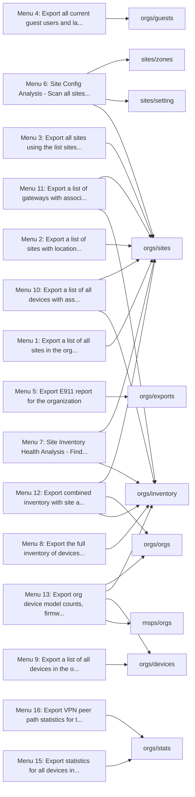

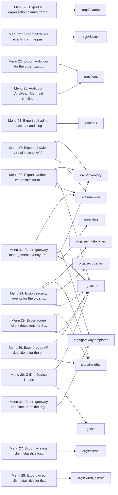

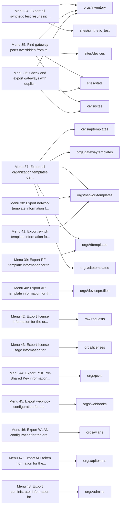

```mermaid
flowchart LR
    m49["Menu 49: Export SSO Single Sign-On information..."]
    m49 --> f_orgs_ssos
    m50["Menu 50: Export MX Edge information for the or..."]
    m50 --> f_orgs_mxedges
    m51["Menu 51: Export Organization SLE Metrics Servi..."]
    m51 --> f_orgs_insights
    m52["Menu 52: Export SLE summary metrics for all si..."]
    m52 --> f_orgs_insights
    m53["Menu 53: Export Organization Insight Metrics c..."]
    m53 --> f_orgs_insights
    m53 --> f_const_alarm_defs
    m53 --> f_const_ap_channels
    m53 --> f_const_ap_esl_versions
    m53 --> f_const_ap_led_status
    m53 --> f_const_app_categories
    m53 --> more53["23 more families"]
    m54["Menu 54: Export all available const definition..."]
    m54 --> f_const_alarm_defs
    m54 --> f_const_ap_channels
    m54 --> f_const_ap_esl_versions
    m54 --> f_const_ap_led_status
    m54 --> f_const_app_categories
    m54 --> f_const_app_subcategories
    m54 --> more54["22 more families"]
    m55["Menu 55: Export OSPF adjacency statistics for..."]
    m55 --> f_orgs_stats
    m56["Menu 56: Export JSI PBN Product Bulletin Notif..."]
    m56 --> f_orgs_jsi
    m57["Menu 57: Export JSI SIRT Security Incident Res..."]
    m57 --> f_orgs_jsi
    m58["Menu 58: Export Org WAN/Gateway Config JSON bu..."]
    m58 --> f_orgs_deviceprofiles
    m58 --> f_orgs_gatewaytemplates
    m58 --> f_orgs_networks
    m58 --> f_orgs_servicepolicies
    m58 --> f_orgs_services
    m58 --> f_orgs_vpns
    m58 --> more58["1 more family"]
    m188["Menu 188: Export all organization support ticke..."]
    m188 --> f_orgs_tickets
    m193["Menu 193: Export all tickets with full details..."]
    m193 --> f_orgs_tickets
    m204["Menu 204: Export JSI assets and contract search..."]
    m204 --> f_orgs_jsi
    m205["Menu 205: Export Org Mist Edge event search res..."]
    m205 --> f_orgs_mxedges
    m230["Menu 230: Search wireless client sessions for t..."]
    m230 --> f_orgs_clients
    f_const_alarm_defs["const/alarm_defs"]
    f_const_ap_channels["const/ap_channels"]
    f_const_ap_esl_versions["const/ap_esl_versions"]
    f_const_ap_led_status["const/ap_led_status"]
    f_const_app_categories["const/app_categories"]
    f_const_app_subcategories["const/app_subcategories"]
    f_orgs_clients["orgs/clients"]
    f_orgs_deviceprofiles["orgs/deviceprofiles"]
    f_orgs_gatewaytemplates["orgs/gatewaytemplates"]
    f_orgs_insights["orgs/insights"]
    f_orgs_jsi["orgs/jsi"]
    f_orgs_mxedges["orgs/mxedges"]
    f_orgs_networks["orgs/networks"]
    f_orgs_servicepolicies["orgs/servicepolicies"]
    f_orgs_services["orgs/services"]
    f_orgs_ssos["orgs/ssos"]
    f_orgs_stats["orgs/stats"]
    f_orgs_tickets["orgs/tickets"]
    f_orgs_vpns["orgs/vpns"]
```

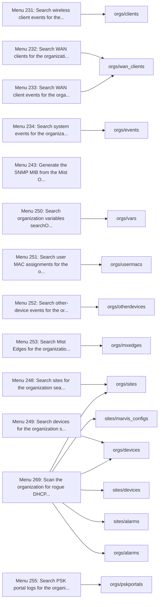

## Menu 1

- Title: Export a list of all sites in the organization
- Handler: `OrgSiteExporter.sites`
- Shared helpers: [`SourceDependencyResolver`](Menu-API-Endpoints#sourcedependencyresolver)
- Endpoints: 1


| Method | Path | SDK function | Called from | Found by |
| - | - | - | - | - |
| GET | `/api/v1/orgs/{org_id}/sites` | [`orgs.sites.listOrgSites`](https://www.juniper.net/documentation/us/en/software/mist/api/http/api/orgs/sites/list-org-sites) | [`OrgSiteExporter.sites`](https://github.com/jmorrison-juniper/MistHelper/blob/main/src/export/org_site_exporter.py) | Reference |

## Menu 2

- Title: Export a list of sites with location and timezone info
- Handler: `OrgSiteExporter.sites_with_location`
- Shared helpers: [`ConfigUtils`](Menu-API-Endpoints#configutils), [`DataExporter`](Menu-API-Endpoints#dataexporter), [`SourceDependencyResolver`](Menu-API-Endpoints#sourcedependencyresolver)
- Endpoints: 1


| Method | Path | SDK function | Called from | Found by |
| - | - | - | - | - |
| GET | `/api/v1/orgs/{org_id}/sites` | [`orgs.sites.listOrgSites`](https://www.juniper.net/documentation/us/en/software/mist/api/http/api/orgs/sites/list-org-sites) | [`APICoreFetchUtils.all_sites_with_limit`](https://github.com/jmorrison-juniper/MistHelper/blob/main/src/api/api_core_fetch_utils.py) | Call |

## Menu 3

- Title: Export all sites using the 'list' sites API endpoint (to SiteList_ListAPI.csv, only if not already present)
- Handler: `OrgSiteExporter.sites_list_api`
- Shared helpers: [`ConfigUtils`](Menu-API-Endpoints#configutils), [`DataExporter`](Menu-API-Endpoints#dataexporter), [`SourceDependencyResolver`](Menu-API-Endpoints#sourcedependencyresolver)
- Endpoints: 1


| Method | Path | SDK function | Called from | Found by |
| - | - | - | - | - |
| GET | `/api/v1/orgs/{org_id}/sites` | [`orgs.sites.listOrgSites`](https://www.juniper.net/documentation/us/en/software/mist/api/http/api/orgs/sites/list-org-sites) | [`APICoreFetchUtils.all_sites_with_limit`](https://github.com/jmorrison-juniper/MistHelper/blob/main/src/api/api_core_fetch_utils.py) | Call |

## Menu 4

- Title: Export all current guest users and last 7 days of historical guests to CSV
- Handler: `lambda: (OrgSiteExporter.current_guests(), OrgSiteExporter.historical_guests())`
- Shared helpers: [`ConfigUtils`](Menu-API-Endpoints#configutils), [`DataExporter`](Menu-API-Endpoints#dataexporter), [`SourceDependencyResolver`](Menu-API-Endpoints#sourcedependencyresolver)
- Endpoints: 1


| Method | Path | SDK function | Called from | Found by |
| - | - | - | - | - |
| GET | `/api/v1/orgs/{org_id}/guests/search` | [`orgs.guests.searchOrgGuestAuthorization`](https://www.juniper.net/documentation/us/en/software/mist/api/http/api/orgs/guests/search-org-guest-authorization) | [`OrgSiteExporter.current_guests`](https://github.com/jmorrison-juniper/MistHelper/blob/main/src/export/org_site_exporter.py) | Call |

## Menu 5

- Title: Export E911 report for the organization
- Handler: `OrgExportUtils.e911_report`
- Shared helpers: [`SourceDependencyResolver`](Menu-API-Endpoints#sourcedependencyresolver)
- Endpoints: 1


| Method | Path | SDK function | Called from | Found by |
| - | - | - | - | - |
| GET | `/api/v1/orgs/{org_id}/exports/e911_report` | [`orgs.exports.getOrgE911Report`](https://www.juniper.net/documentation/us/en/software/mist/api/http/api/orgs/reports/get-org-e911-report) | [`OrgExportUtils.e911_report`](https://github.com/jmorrison-juniper/MistHelper/blob/main/src/export/org_export_utils.py) | Reference |

## Menu 6

- Title: Site Config Analysis - Scan all sites for zone, engagement dwell tag, and occupancy setting deviations
- Handler: `lambda: GlobalImportManager.SiteExportUtilsFactory().build().zone_config_analysis()`
- Shared helpers: [`ConfigUtils`](Menu-API-Endpoints#configutils), [`DataExporter`](Menu-API-Endpoints#dataexporter), [`MainEntrypoint`](Menu-API-Endpoints#mainentrypoint), [`SourceDependencyResolver`](Menu-API-Endpoints#sourcedependencyresolver)
- Endpoints: 3

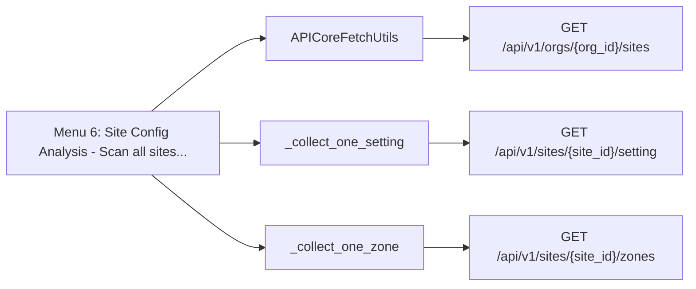

| Method | Path | SDK function | Called from | Found by |
| - | - | - | - | - |
| GET | `/api/v1/orgs/{org_id}/sites` | [`orgs.sites.listOrgSites`](https://www.juniper.net/documentation/us/en/software/mist/api/http/api/orgs/sites/list-org-sites) | [`APICoreFetchUtils.all_sites_with_limit`](https://github.com/jmorrison-juniper/MistHelper/blob/main/src/api/api_core_fetch_utils.py) | Call |
| GET | `/api/v1/sites/{site_id}/setting` | [`sites.setting.getSiteSetting`](https://www.juniper.net/documentation/us/en/software/mist/api/http/api/sites/setting/get-site-setting) | [`_collect_one_setting`](https://github.com/jmorrison-juniper/MistHelper/blob/main/src/analytics/zone_analyzer.py) | Call |
| GET | `/api/v1/sites/{site_id}/zones` | [`sites.zones.listSiteZones`](https://www.juniper.net/documentation/us/en/software/mist/api/http/api/sites/zones/list-site-zones) | [`_collect_one_zone`](https://github.com/jmorrison-juniper/MistHelper/blob/main/src/analytics/zone_analyzer.py) | Call |

## Menu 7

- Title: Site Inventory Health Analysis - Find sites with APs missing switches/gateways, or with offline infrastructure
- Handler: `lambda: ExtractedSiteInventoryHealthAnalyzer.analyze(SiteInventoryHealthAnalyzerDeps(apisession=MainEntrypoint.context.apisession, mistapi=mistapi, get_org_i...`
- Shared helpers: [`ConfigUtils`](Menu-API-Endpoints#configutils), [`DataExporter`](Menu-API-Endpoints#dataexporter), [`MainEntrypoint`](Menu-API-Endpoints#mainentrypoint), [`SourceDependencyResolver`](Menu-API-Endpoints#sourcedependencyresolver)
- Endpoints: 2

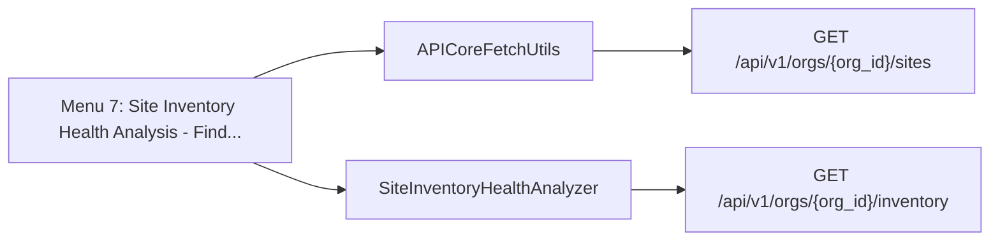

| Method | Path | SDK function | Called from | Found by |
| - | - | - | - | - |
| GET | `/api/v1/orgs/{org_id}/inventory` | [`orgs.inventory.getOrgInventory`](https://www.juniper.net/documentation/us/en/software/mist/api/http/api/orgs/inventory/get-org-inventory) | [`SiteInventoryHealthAnalyzer._fetch_devices`](https://github.com/jmorrison-juniper/MistHelper/blob/main/src/analytics/site_inventory_health_analyzer.py) | Call |
| GET | `/api/v1/orgs/{org_id}/sites` | [`orgs.sites.listOrgSites`](https://www.juniper.net/documentation/us/en/software/mist/api/http/api/orgs/sites/list-org-sites) | [`APICoreFetchUtils.all_sites_with_limit`](https://github.com/jmorrison-juniper/MistHelper/blob/main/src/api/api_core_fetch_utils.py) | Call |

## Menu 8

- Title: Export the full inventory of devices in the organization
- Handler: `OrgInventoryExporter.inventory`
- Shared helpers: [`SourceDependencyResolver`](Menu-API-Endpoints#sourcedependencyresolver)
- Endpoints: 1


| Method | Path | SDK function | Called from | Found by |
| - | - | - | - | - |
| GET | `/api/v1/orgs/{org_id}/inventory` | [`orgs.inventory.getOrgInventory`](https://www.juniper.net/documentation/us/en/software/mist/api/http/api/orgs/inventory/get-org-inventory) | [`OrgInventoryExporter.inventory`](https://github.com/jmorrison-juniper/MistHelper/blob/main/src/export/org_inventory_exporter.py) | Reference |

## Menu 9

- Title: Export a list of all devices in the organization
- Handler: `OrgInventoryExporter.devices`
- Shared helpers: [`SourceDependencyResolver`](Menu-API-Endpoints#sourcedependencyresolver)
- Endpoints: 1


| Method | Path | SDK function | Called from | Found by |
| - | - | - | - | - |
| GET | `/api/v1/orgs/{org_id}/devices` | [`orgs.devices.listOrgDevices`](https://www.juniper.net/documentation/us/en/software/mist/api/http/api/orgs/devices/list-org-devices) | [`OrgInventoryExporter.devices`](https://github.com/jmorrison-juniper/MistHelper/blob/main/src/export/org_inventory_exporter.py) | Reference |

## Menu 10

- Title: Export a list of all devices with associated site and address info
- Handler: `OrgInventoryExporter.devices_with_site_info`
- Shared helpers: [`CacheUtils`](Menu-API-Endpoints#cacheutils), [`ConfigUtils`](Menu-API-Endpoints#configutils), [`DataExporter`](Menu-API-Endpoints#dataexporter), [`SourceDependencyResolver`](Menu-API-Endpoints#sourcedependencyresolver)
- Endpoints: 2

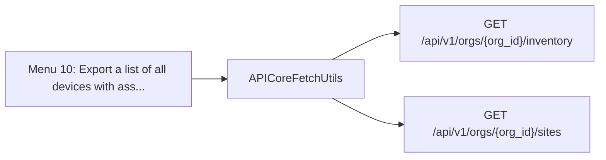

| Method | Path | SDK function | Called from | Found by |
| - | - | - | - | - |
| GET | `/api/v1/orgs/{org_id}/inventory` | [`orgs.inventory.getOrgInventory`](https://www.juniper.net/documentation/us/en/software/mist/api/http/api/orgs/inventory/get-org-inventory) | [`APICoreFetchUtils.all_inventory_with_limit`](https://github.com/jmorrison-juniper/MistHelper/blob/main/src/api/api_core_fetch_utils.py) | Call |
| GET | `/api/v1/orgs/{org_id}/sites` | [`orgs.sites.listOrgSites`](https://www.juniper.net/documentation/us/en/software/mist/api/http/api/orgs/sites/list-org-sites) | [`APICoreFetchUtils.all_sites_with_limit`](https://github.com/jmorrison-juniper/MistHelper/blob/main/src/api/api_core_fetch_utils.py) | Call |

## Menu 11

- Title: Export a list of gateways with associated site and address info
- Handler: `OrgInventoryExporter.gateways_with_site_info`
- Shared helpers: [`ConfigUtils`](Menu-API-Endpoints#configutils), [`DataExporter`](Menu-API-Endpoints#dataexporter), [`SourceDependencyResolver`](Menu-API-Endpoints#sourcedependencyresolver)
- Endpoints: 2

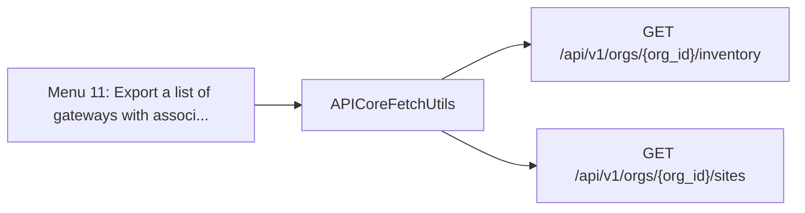

| Method | Path | SDK function | Called from | Found by |
| - | - | - | - | - |
| GET | `/api/v1/orgs/{org_id}/inventory` | [`orgs.inventory.getOrgInventory`](https://www.juniper.net/documentation/us/en/software/mist/api/http/api/orgs/inventory/get-org-inventory) | [`APICoreFetchUtils.all_inventory_with_limit`](https://github.com/jmorrison-juniper/MistHelper/blob/main/src/api/api_core_fetch_utils.py) | Call |
| GET | `/api/v1/orgs/{org_id}/sites` | [`orgs.sites.listOrgSites`](https://www.juniper.net/documentation/us/en/software/mist/api/http/api/orgs/sites/list-org-sites) | [`APICoreFetchUtils.all_sites_with_limit`](https://github.com/jmorrison-juniper/MistHelper/blob/main/src/api/api_core_fetch_utils.py) | Call |

## Menu 12

- Title: Export combined inventory with site and address info by calendar week
- Handler: `OrgInventoryExporter.combined_inventory_with_site_info`
- Shared helpers: [`CacheUtils`](Menu-API-Endpoints#cacheutils), [`ConfigUtils`](Menu-API-Endpoints#configutils), [`DataExporter`](Menu-API-Endpoints#dataexporter), [`SourceDependencyResolver`](Menu-API-Endpoints#sourcedependencyresolver)
- Endpoints: 3

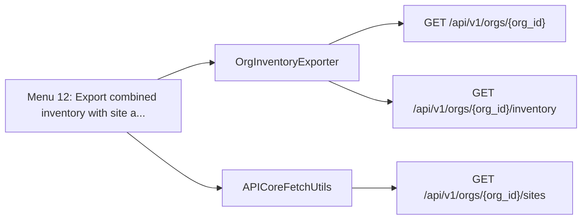

| Method | Path | SDK function | Called from | Found by |
| - | - | - | - | - |
| GET | `/api/v1/orgs/{org_id}` | [`orgs.orgs.getOrg`](https://www.juniper.net/documentation/us/en/software/mist/api/http/api/orgs/get-org) | [`OrgInventoryExporter._resolve_combined_inventory_org_name`](https://github.com/jmorrison-juniper/MistHelper/blob/main/src/export/org_inventory_exporter.py) | Call |
| GET | `/api/v1/orgs/{org_id}/inventory` | [`orgs.inventory.getOrgInventory`](https://www.juniper.net/documentation/us/en/software/mist/api/http/api/orgs/inventory/get-org-inventory) | [`OrgInventoryExporter._fetch_and_persist_raw_inventory_variant`](https://github.com/jmorrison-juniper/MistHelper/blob/main/src/export/org_inventory_exporter.py) | Call |
| GET | `/api/v1/orgs/{org_id}/sites` | [`orgs.sites.listOrgSites`](https://www.juniper.net/documentation/us/en/software/mist/api/http/api/orgs/sites/list-org-sites) | [`APICoreFetchUtils.all_sites_with_limit`](https://github.com/jmorrison-juniper/MistHelper/blob/main/src/api/api_core_fetch_utils.py) | Call |

## Menu 13

- Title: Export org device model counts, firmware version distribution, and versions per model (MSP-aware)
- Handler: `OrgDeviceInventorySummary.dispatch`
- Shared helpers: [`DataExporter`](Menu-API-Endpoints#dataexporter), [`InputUtils`](Menu-API-Endpoints#inpututils), [`SourceDependencyResolver`](Menu-API-Endpoints#sourcedependencyresolver)
- Endpoints: 4

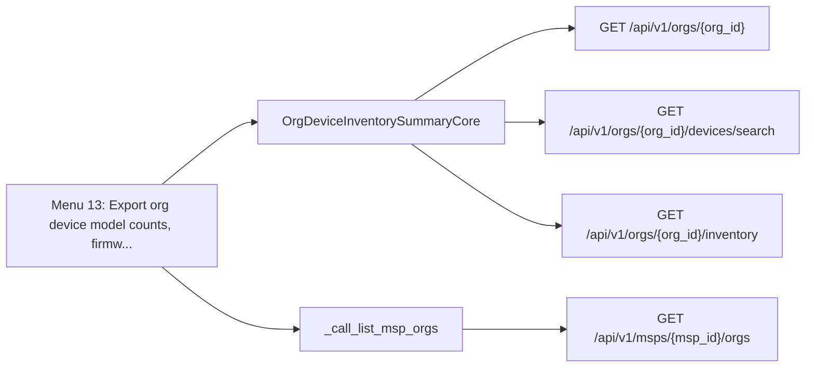

| Method | Path | SDK function | Called from | Found by |
| - | - | - | - | - |
| GET | `/api/v1/msps/{msp_id}/orgs` | [`msps.orgs.listMspOrgs`](https://www.juniper.net/documentation/us/en/software/mist/api/http/api/msps/orgs/list-msp-orgs) | [`_call_list_msp_orgs`](https://github.com/jmorrison-juniper/MistHelper/blob/main/src/inventory/org_device_inventory_msp.py) | Call |
| GET | `/api/v1/orgs/{org_id}` | [`orgs.orgs.getOrg`](https://www.juniper.net/documentation/us/en/software/mist/api/http/api/orgs/get-org) | [`OrgDeviceInventorySummaryCore._lookup_org_name_from_api`](https://github.com/jmorrison-juniper/MistHelper/blob/main/src/inventory/org_device_inventory_summary.py) | Call |
| GET | `/api/v1/orgs/{org_id}/devices/search` | [`orgs.devices.searchOrgDevices`](https://www.juniper.net/documentation/us/en/software/mist/api/http/api/orgs/devices/search-org-devices) | [`OrgDeviceInventorySummaryCore._search_switch_page`](https://github.com/jmorrison-juniper/MistHelper/blob/main/src/inventory/org_device_inventory_summary.py) | Call |
| GET | `/api/v1/orgs/{org_id}/inventory` | [`orgs.inventory.getOrgInventory`](https://www.juniper.net/documentation/us/en/software/mist/api/http/api/orgs/inventory/get-org-inventory) | [`OrgDeviceInventorySummaryCore._fetch_ap_inventory`](https://github.com/jmorrison-juniper/MistHelper/blob/main/src/inventory/org_device_inventory_summary.py) | Call |

## Menu 15

- Title: Export statistics for all devices in the organization
- Handler: `OrgDeviceStatsExporter.device_stats`
- Shared helpers: [`SourceDependencyResolver`](Menu-API-Endpoints#sourcedependencyresolver)
- Endpoints: 1


| Method | Path | SDK function | Called from | Found by |
| - | - | - | - | - |
| GET | `/api/v1/orgs/{org_id}/stats/devices` | [`orgs.stats.listOrgDevicesStats`](https://www.juniper.net/documentation/us/en/software/mist/api/http/api/orgs/stats/devices/list-org-devices-stats) | [`OrgDeviceStatsExporter.device_stats`](https://github.com/jmorrison-juniper/MistHelper/blob/main/src/export/org_device_stats_exporter.py) | Reference |

## Menu 16

- Title: Export VPN peer path statistics for the organization
- Handler: `OrgDeviceStatsExporter.vpn_peer_stats`
- Shared helpers: [`SourceDependencyResolver`](Menu-API-Endpoints#sourcedependencyresolver)
- Endpoints: 1


| Method | Path | SDK function | Called from | Found by |
| - | - | - | - | - |
| GET | `/api/v1/orgs/{org_id}/stats/vpn_peers/search` | [`orgs.stats.searchOrgPeerPathStats`](https://www.juniper.net/documentation/us/en/software/mist/api/http/api/orgs/stats/vpn-peers/search-org-peer-path-stats) | [`OrgDeviceStatsExporter.vpn_peer_stats`](https://github.com/jmorrison-juniper/MistHelper/blob/main/src/export/org_device_stats_exporter.py) | Reference |

## Menu 17

- Title: Export all switch virtual chassis (VC/stacking) stats to CSV
- Handler: `OrgDeviceStatsExporter.switch_vc_stats`
- Shared helpers: [`CacheUtils`](Menu-API-Endpoints#cacheutils), [`ConfigUtils`](Menu-API-Endpoints#configutils), [`DataExporter`](Menu-API-Endpoints#dataexporter), [`SourceDependencyResolver`](Menu-API-Endpoints#sourcedependencyresolver)
- Endpoints: 2

```mermaid
flowchart LR
    menu["Menu 17: Export all switch virtual chassis VC/..."]
    menu --> c1["OrgInventoryExporter"]
    c1 --> e1["GET /api/v1/orgs/{org_id}/inventory"]
    menu --> c2["SwitchVcStatsService"]
    c2 --> e2["GET /api/v1/sites/{site_id}/devices/{device_id}/vc"]
```

| Method | Path | SDK function | Called from | Found by |
| - | - | - | - | - |
| GET | `/api/v1/orgs/{org_id}/inventory` | [`orgs.inventory.getOrgInventory`](https://www.juniper.net/documentation/us/en/software/mist/api/http/api/orgs/inventory/get-org-inventory) | [`OrgInventoryExporter.inventory`](https://github.com/jmorrison-juniper/MistHelper/blob/main/src/export/org_inventory_exporter.py) | Reference |
| GET | `/api/v1/sites/{site_id}/devices/{device_id}/vc` | [`sites.devices.getSiteDeviceVirtualChassis`](https://www.juniper.net/documentation/us/en/software/mist/api/http/api/sites/devices/wired/virtual-chassis/get-site-device-virtual-chassis) | [`SwitchVcStatsService._fetch_vc_for_switch`](https://github.com/jmorrison-juniper/MistHelper/blob/main/src/refactors/serial_cc/switch_vc_stats.py) | Call |

## Menu 20

- Title: Export all organization alarms from the past day
- Handler: `OrgAlarmEventExporter.alarms`
- Shared helpers: [`SourceDependencyResolver`](Menu-API-Endpoints#sourcedependencyresolver)
- Endpoints: 1

```mermaid
flowchart LR
    menu["Menu 20: Export all organization alarms from t..."]
    menu --> c1["OrgAlarmEventExporter"]
    c1 --> e1["GET /api/v1/orgs/{org_id}/alarms/search"]
```

| Method | Path | SDK function | Called from | Found by |
| - | - | - | - | - |
| GET | `/api/v1/orgs/{org_id}/alarms/search` | [`orgs.alarms.searchOrgAlarms`](https://www.juniper.net/documentation/us/en/software/mist/api/http/api/orgs/alarms/search-org-alarms) | [`OrgAlarmEventExporter.alarms`](https://github.com/jmorrison-juniper/MistHelper/blob/main/src/export/org_alarm_event_exporter.py) | Reference |

## Menu 21

- Title: Export all device events from the past 24 hours
- Handler: `OrgAlarmEventExporter.device_events`
- Shared helpers: [`ConfigUtils`](Menu-API-Endpoints#configutils), [`DataExporter`](Menu-API-Endpoints#dataexporter), [`SourceDependencyResolver`](Menu-API-Endpoints#sourcedependencyresolver)
- Endpoints: 1

```mermaid
flowchart LR
    menu["Menu 21: Export all device events from the pas..."]
    menu --> c1["OrgAlarmEventExporter"]
    c1 --> e1["GET /api/v1/orgs/{org_id}/devices/events/search"]
```

| Method | Path | SDK function | Called from | Found by |
| - | - | - | - | - |
| GET | `/api/v1/orgs/{org_id}/devices/events/search` | [`orgs.devices.searchOrgDeviceEvents`](https://www.juniper.net/documentation/us/en/software/mist/api/http/api/orgs/devices/search-org-device-events) | [`OrgAlarmEventExporter.device_events`](https://github.com/jmorrison-juniper/MistHelper/blob/main/src/export/org_alarm_event_exporter.py) | Call |

## Menu 22

- Title: Export audit logs for the organization (last 24 hours)
- Handler: `lambda: OrgExportUtils.audit_logs(full_history=False)`
- Shared helpers: [`ConfigUtils`](Menu-API-Endpoints#configutils), [`DataExporter`](Menu-API-Endpoints#dataexporter), [`SourceDependencyResolver`](Menu-API-Endpoints#sourcedependencyresolver)
- Endpoints: 1

```mermaid
flowchart LR
    menu["Menu 22: Export audit logs for the organizatio..."]
    menu --> c1["OrgExportUtils"]
    c1 --> e1["GET /api/v1/orgs/{org_id}/logs/search"]
```

| Method | Path | SDK function | Called from | Found by |
| - | - | - | - | - |
| GET | `/api/v1/orgs/{org_id}/logs/search` | [`orgs.logs.listOrgAuditLogs`](https://www.juniper.net/documentation/us/en/software/mist/api/http/api/orgs/logs/list-org-audit-logs) | [`OrgExportUtils.audit_logs`](https://github.com/jmorrison-juniper/MistHelper/blob/main/src/export/org_export_utils.py) | Call |

## Menu 23

- Title: Export self (admin account) audit log
- Handler: `SelfExportUtils.audit_logs`
- Shared helpers: [`DataExporter`](Menu-API-Endpoints#dataexporter), [`SourceDependencyResolver`](Menu-API-Endpoints#sourcedependencyresolver)
- Endpoints: 1

```mermaid
flowchart LR
    menu["Menu 23: Export self admin account audit log"]
    menu --> c1["SelfExportUtils"]
    c1 --> e1["GET /api/v1/self/logs"]
```

| Method | Path | SDK function | Called from | Found by |
| - | - | - | - | - |
| GET | `/api/v1/self/logs` | [`self.logs.listSelfAuditLogs`](https://www.juniper.net/documentation/us/en/software/mist/api/http/api/self/audit-logs/list-self-audit-logs) | [`SelfExportUtils.audit_logs`](https://github.com/jmorrison-juniper/MistHelper/blob/main/src/export/self_export_utils.py) | Call |

## Menu 24

- Title: Export security events for the organization
- Handler: `OrgClientSecurityExporter.security_events`
- Shared helpers: [`CacheUtils`](Menu-API-Endpoints#cacheutils), [`ConfigUtils`](Menu-API-Endpoints#configutils), [`DataExporter`](Menu-API-Endpoints#dataexporter), [`SourceDependencyResolver`](Menu-API-Endpoints#sourcedependencyresolver)
- Endpoints: 5

```mermaid
flowchart LR
    menu["Menu 24: Export security events for the organi..."]
    menu --> c1["SecurityEventsService"]
    c1 --> e1["GET /api/v1/orgs/{org_id}/secintelprofiles"]
    c1 --> e2["GET /api/v1/orgs/{org_id}/secpolicies"]
    c1 --> e3["GET /api/v1/sites/{site_id}/insights/rogues/clients"]
    menu --> c2["OrgSiteExporter"]
    c2 --> e4["GET /api/v1/orgs/{org_id}/sites"]
    menu --> c3["_ROGUE_KINDS"]
    c3 --> e5["GET /api/v1/sites/{site_id}/insights/rogues"]
```

| Method | Path | SDK function | Called from | Found by |
| - | - | - | - | - |
| GET | `/api/v1/orgs/{org_id}/secintelprofiles` | [`orgs.secintelprofiles.listOrgSecIntelProfiles`](https://www.juniper.net/documentation/us/en/software/mist/api/http/api/orgs/secintel-profiles/list-org-sec-intel-profiles) | [`SecurityEventsService._build_flattened_specs`](https://github.com/jmorrison-juniper/MistHelper/blob/main/src/refactors/serial_cc/security_events.py) | Call |
| GET | `/api/v1/orgs/{org_id}/secpolicies` | [`orgs.secpolicies.listOrgSecPolicies`](https://www.juniper.net/documentation/us/en/software/mist/api/http/api/orgs/security-policies/list-org-sec-policies) | [`SecurityEventsService._build_flattened_specs`](https://github.com/jmorrison-juniper/MistHelper/blob/main/src/refactors/serial_cc/security_events.py) | Call |
| GET | `/api/v1/orgs/{org_id}/sites` | [`orgs.sites.listOrgSites`](https://www.juniper.net/documentation/us/en/software/mist/api/http/api/orgs/sites/list-org-sites) | [`OrgSiteExporter.sites`](https://github.com/jmorrison-juniper/MistHelper/blob/main/src/export/org_site_exporter.py) | Reference |
| GET | `/api/v1/sites/{site_id}/insights/rogues` | [`sites.insights.listSiteRogueAPs`](https://www.juniper.net/documentation/us/en/software/mist/api/http/api/sites/rogues/list-site-rogue-a-ps) | [`_ROGUE_KINDS`](https://github.com/jmorrison-juniper/MistHelper/blob/main/src/refactors/serial_cc/security_events.py) | Name |
| GET | `/api/v1/sites/{site_id}/insights/rogues/clients` | [`sites.insights.listSiteRogueClients`](https://www.juniper.net/documentation/us/en/software/mist/api/http/api/sites/rogues/list-site-rogue-clients) | [`SecurityEventsService._export_rogue_combined`](https://github.com/jmorrison-juniper/MistHelper/blob/main/src/refactors/serial_cc/security_events.py) | Name |

## Menu 25

- Title: Audit Log Analysis - Mermaid timeline + interactive HTML report
- Handler: `AuditAnalysisOps.audit_log_analysis`
- Shared helpers: [`CacheUtils`](Menu-API-Endpoints#cacheutils), [`ConfigUtils`](Menu-API-Endpoints#configutils), [`InputUtils`](Menu-API-Endpoints#inpututils), [`SourceDependencyResolver`](Menu-API-Endpoints#sourcedependencyresolver)
- Endpoints: 1

```mermaid
flowchart LR
    menu["Menu 25: Audit Log Analysis - Mermaid timeline..."]
    menu --> c1["AuditAnalysisOps"]
    c1 --> e1["GET /api/v1/orgs/{org_id}/logs/search"]
```

| Method | Path | SDK function | Called from | Found by |
| - | - | - | - | - |
| GET | `/api/v1/orgs/{org_id}/logs/search` | [`orgs.logs.listOrgAuditLogs`](https://www.juniper.net/documentation/us/en/software/mist/api/http/api/orgs/logs/list-org-audit-logs) | [`AuditAnalysisOps._fetch_filtered_audit_entries`](https://github.com/jmorrison-juniper/MistHelper/blob/main/src/audit/audit_analysis_ops.py) | Call |

## Menu 26

- Title: Offline Device Report
- Handler: `OfflineDeviceReporter.execute`
- Shared helpers: [`ConfigUtils`](Menu-API-Endpoints#configutils), [`DataExporter`](Menu-API-Endpoints#dataexporter), [`InputUtils`](Menu-API-Endpoints#inpututils), [`SourceDependencyResolver`](Menu-API-Endpoints#sourcedependencyresolver)
- Endpoints: 2

```mermaid
flowchart LR
    menu["Menu 26: Offline Device Report"]
    menu --> c1["APICoreFetchUtils"]
    c1 --> e1["GET /api/v1/orgs/{org_id}/sites"]
    menu --> c2["OfflineDeviceReporter"]
    c2 --> e2["GET /api/v1/orgs/{org_id}/stats/devices"]
```

| Method | Path | SDK function | Called from | Found by |
| - | - | - | - | - |
| GET | `/api/v1/orgs/{org_id}/sites` | [`orgs.sites.listOrgSites`](https://www.juniper.net/documentation/us/en/software/mist/api/http/api/orgs/sites/list-org-sites) | [`APICoreFetchUtils.all_sites_with_limit`](https://github.com/jmorrison-juniper/MistHelper/blob/main/src/api/api_core_fetch_utils.py) | Call |
| GET | `/api/v1/orgs/{org_id}/stats/devices` | [`orgs.stats.listOrgDevicesStats`](https://www.juniper.net/documentation/us/en/software/mist/api/http/api/orgs/stats/devices/list-org-devices-stats) | [`OfflineDeviceReporter._fetch_data`](https://github.com/jmorrison-juniper/MistHelper/blob/main/src/reports/offline_device_reporter.py) | Call |

## Menu 27

- Title: Export wireless client statistics for the organization
- Handler: `OrgClientSecurityExporter.wireless_clients`
- Shared helpers: [`SourceDependencyResolver`](Menu-API-Endpoints#sourcedependencyresolver)
- Endpoints: 1

```mermaid
flowchart LR
    menu["Menu 27: Export wireless client statistics for..."]
    menu --> c1["OrgClientSecurityExporter"]
    c1 --> e1["GET /api/v1/orgs/{org_id}/clients/search"]
```

| Method | Path | SDK function | Called from | Found by |
| - | - | - | - | - |
| GET | `/api/v1/orgs/{org_id}/clients/search` | [`orgs.clients.searchOrgWirelessClients`](https://www.juniper.net/documentation/us/en/software/mist/api/http/api/orgs/clients/wireless/search-org-wireless-clients) | [`OrgClientSecurityExporter.wireless_clients`](https://github.com/jmorrison-juniper/MistHelper/blob/main/src/export/org_client_security_exporter.py) | Reference |

## Menu 28

- Title: Export wired client statistics for the organization
- Handler: `OrgClientSecurityExporter.wired_clients`
- Shared helpers: [`SourceDependencyResolver`](Menu-API-Endpoints#sourcedependencyresolver)
- Endpoints: 1

```mermaid
flowchart LR
    menu["Menu 28: Export wired client statistics for th..."]
    menu --> c1["OrgClientSecurityExporter"]
    c1 --> e1["GET /api/v1/orgs/{org_id}/wired_clients/search"]
```

| Method | Path | SDK function | Called from | Found by |
| - | - | - | - | - |
| GET | `/api/v1/orgs/{org_id}/wired_clients/search` | [`orgs.wired_clients.searchOrgWiredClients`](https://www.juniper.net/documentation/us/en/software/mist/api/http/api/orgs/clients/wired/search-org-wired-clients) | [`OrgClientSecurityExporter.wired_clients`](https://github.com/jmorrison-juniper/MistHelper/blob/main/src/export/org_client_security_exporter.py) | Reference |

## Menu 29

- Title: Export rogue client detections for the organization
- Handler: `OrgClientSecurityExporter.rogue_clients`
- Shared helpers: [`CacheUtils`](Menu-API-Endpoints#cacheutils), [`ConfigUtils`](Menu-API-Endpoints#configutils), [`DataExporter`](Menu-API-Endpoints#dataexporter), [`SourceDependencyResolver`](Menu-API-Endpoints#sourcedependencyresolver)
- Endpoints: 3

```mermaid
flowchart LR
    menu["Menu 29: Export rogue client detections for th..."]
    menu --> c1["OrgClientSecurityExporter"]
    c1 --> e1["GET /api/v1/sites/{site_id}/insights/rogues"]
    c1 --> e2["GET /api/v1/sites/{site_id}/insights/rogues/clients"]
    menu --> c2["OrgSiteExporter"]
    c2 --> e3["GET /api/v1/orgs/{org_id}/sites"]
```

| Method | Path | SDK function | Called from | Found by |
| - | - | - | - | - |
| GET | `/api/v1/orgs/{org_id}/sites` | [`orgs.sites.listOrgSites`](https://www.juniper.net/documentation/us/en/software/mist/api/http/api/orgs/sites/list-org-sites) | [`OrgSiteExporter.sites`](https://github.com/jmorrison-juniper/MistHelper/blob/main/src/export/org_site_exporter.py) | Reference |
| GET | `/api/v1/sites/{site_id}/insights/rogues` | [`sites.insights.listSiteRogueAPs`](https://www.juniper.net/documentation/us/en/software/mist/api/http/api/sites/rogues/list-site-rogue-a-ps) | [`OrgClientSecurityExporter._export_rogues`](https://github.com/jmorrison-juniper/MistHelper/blob/main/src/export/org_client_security_exporter.py) | Name |
| GET | `/api/v1/sites/{site_id}/insights/rogues/clients` | [`sites.insights.listSiteRogueClients`](https://www.juniper.net/documentation/us/en/software/mist/api/http/api/sites/rogues/list-site-rogue-clients) | [`OrgClientSecurityExporter.rogue_clients`](https://github.com/jmorrison-juniper/MistHelper/blob/main/src/export/org_client_security_exporter.py) | Reference |

## Menu 30

- Title: Export rogue AP detections for the organization
- Handler: `OrgClientSecurityExporter.rogue_aps`
- Shared helpers: [`CacheUtils`](Menu-API-Endpoints#cacheutils), [`ConfigUtils`](Menu-API-Endpoints#configutils), [`DataExporter`](Menu-API-Endpoints#dataexporter), [`SourceDependencyResolver`](Menu-API-Endpoints#sourcedependencyresolver)
- Endpoints: 2

```mermaid
flowchart LR
    menu["Menu 30: Export rogue AP detections for the or..."]
    menu --> c1["OrgClientSecurityExporter"]
    c1 --> e1["GET /api/v1/sites/{site_id}/insights/rogues"]
    menu --> c2["OrgSiteExporter"]
    c2 --> e2["GET /api/v1/orgs/{org_id}/sites"]
```

| Method | Path | SDK function | Called from | Found by |
| - | - | - | - | - |
| GET | `/api/v1/orgs/{org_id}/sites` | [`orgs.sites.listOrgSites`](https://www.juniper.net/documentation/us/en/software/mist/api/http/api/orgs/sites/list-org-sites) | [`OrgSiteExporter.sites`](https://github.com/jmorrison-juniper/MistHelper/blob/main/src/export/org_site_exporter.py) | Reference |
| GET | `/api/v1/sites/{site_id}/insights/rogues` | [`sites.insights.listSiteRogueAPs`](https://www.juniper.net/documentation/us/en/software/mist/api/http/api/sites/rogues/list-site-rogue-a-ps) | [`OrgClientSecurityExporter.rogue_aps`](https://github.com/jmorrison-juniper/MistHelper/blob/main/src/export/org_client_security_exporter.py) | Reference |

## Menu 31

- Title: Export gateway management overlay IPs grouped by template association
- Handler: `_dispatch_gateway_management_ips`
- Shared helpers: [`CacheUtils`](Menu-API-Endpoints#cacheutils), [`ConfigUtils`](Menu-API-Endpoints#configutils), [`DataExporter`](Menu-API-Endpoints#dataexporter), [`MainEntrypoint`](Menu-API-Endpoints#mainentrypoint), [`SourceDependencyResolver`](Menu-API-Endpoints#sourcedependencyresolver)
- Endpoints: 6

```mermaid
flowchart LR
    menu["Menu 31: Export gateway management overlay IPs..."]
    menu --> c1["GatewayExportUtils"]
    c1 --> e1["GET /api/v1/orgs/{org_id}/gatewaytemplates"]
    c1 --> e2["GET /api/v1/sites/{site_id}/devices"]
    c1 --> e3["GET /api/v1/sites/{site_id}/stats/ports/search"]
    menu --> c2["APICoreFetchUtils"]
    c2 --> e4["GET /api/v1/orgs/{org_id}/inventory"]
    c2 --> e5["GET /api/v1/orgs/{org_id}/sites"]
    menu --> c3["APIFetchUtils"]
    c3 --> e6["GET /api/v1/sites/{site_id}/devices/{device_id}"]
```

| Method | Path | SDK function | Called from | Found by |
| - | - | - | - | - |
| GET | `/api/v1/orgs/{org_id}/gatewaytemplates` | [`orgs.gatewaytemplates.listOrgGatewayTemplates`](https://www.juniper.net/documentation/us/en/software/mist/api/http/api/orgs/gateway-templates/list-org-gateway-templates) | [`GatewayExportUtils.templates`](https://github.com/jmorrison-juniper/MistHelper/blob/main/src/gateway/gateway_export_utils.py) | Call |
| GET | `/api/v1/orgs/{org_id}/inventory` | [`orgs.inventory.getOrgInventory`](https://www.juniper.net/documentation/us/en/software/mist/api/http/api/orgs/inventory/get-org-inventory) | [`APICoreFetchUtils.all_inventory_with_limit`](https://github.com/jmorrison-juniper/MistHelper/blob/main/src/api/api_core_fetch_utils.py) | Call |
| GET | `/api/v1/orgs/{org_id}/sites` | [`orgs.sites.listOrgSites`](https://www.juniper.net/documentation/us/en/software/mist/api/http/api/orgs/sites/list-org-sites) | [`APICoreFetchUtils.all_sites_with_limit`](https://github.com/jmorrison-juniper/MistHelper/blob/main/src/api/api_core_fetch_utils.py) | Call |
| GET | `/api/v1/sites/{site_id}/devices` | [`sites.devices.listSiteDevices`](https://www.juniper.net/documentation/us/en/software/mist/api/http/api/sites/devices/list-site-devices) | [`GatewayExportUtils._finalise_management_ip_output`](https://github.com/jmorrison-juniper/MistHelper/blob/main/src/gateway/gateway_export_utils.py) | Name |
| GET | `/api/v1/sites/{site_id}/devices/{device_id}` | [`sites.devices.getSiteDevice`](https://www.juniper.net/documentation/us/en/software/mist/api/http/api/sites/devices/get-site-device) | [`APIFetchUtils._gw_fetch_one_config`](https://github.com/jmorrison-juniper/MistHelper/blob/main/src/api/api_fetch_utils.py) | Call |
| GET | `/api/v1/sites/{site_id}/stats/ports/search` | [`sites.stats.searchSiteSwOrGwPorts`](https://www.juniper.net/documentation/us/en/software/mist/api/http/api/sites/stats/ports/search-site-sw-or-gw-ports) | [`GatewayExportUtils._save_filtered_port_configs`](https://github.com/jmorrison-juniper/MistHelper/blob/main/src/gateway/gateway_export_utils.py) | Name |

## Menu 32

- Title: Export gateway templates from the organization
- Handler: `_dispatch_gateway_templates`
- Shared helpers: [`CacheUtils`](Menu-API-Endpoints#cacheutils), [`ConfigUtils`](Menu-API-Endpoints#configutils), [`DataExporter`](Menu-API-Endpoints#dataexporter), [`MainEntrypoint`](Menu-API-Endpoints#mainentrypoint)
- Endpoints: 1

```mermaid
flowchart LR
    menu["Menu 32: Export gateway templates from the org..."]
    menu --> c1["GatewayExportUtils"]
    c1 --> e1["GET /api/v1/orgs/{org_id}/gatewaytemplates"]
```

| Method | Path | SDK function | Called from | Found by |
| - | - | - | - | - |
| GET | `/api/v1/orgs/{org_id}/gatewaytemplates` | [`orgs.gatewaytemplates.listOrgGatewayTemplates`](https://www.juniper.net/documentation/us/en/software/mist/api/http/api/orgs/gateway-templates/list-org-gateway-templates) | [`GatewayExportUtils.templates`](https://github.com/jmorrison-juniper/MistHelper/blob/main/src/gateway/gateway_export_utils.py) | Call |

## Menu 33

- Title: Export synthetic test results for all gateways
- Handler: `GatewayTestExporter.synthetic_tests`
- Shared helpers: [`CacheUtils`](Menu-API-Endpoints#cacheutils), [`ConfigUtils`](Menu-API-Endpoints#configutils), [`DataExporter`](Menu-API-Endpoints#dataexporter), [`RateLimitingUtils`](Menu-API-Endpoints#ratelimitingutils), [`SourceDependencyResolver`](Menu-API-Endpoints#sourcedependencyresolver)
- Endpoints: 3

```mermaid
flowchart LR
    menu["Menu 33: Export synthetic test results for all..."]
    menu --> c1["APICoreFetchUtils"]
    c1 --> e1["GET /api/v1/orgs/{org_id}/inventory"]
    menu --> c2["GatewayTestExporter"]
    c2 --> e2["GET /api/v1/sites/{site_id}/devices/{device_id}/synthetic_test"]
    menu --> c3["_fetch_site_name_lookup_from_api"]
    c3 --> e3["GET /api/v1/orgs/{org_id}/sites"]
```

| Method | Path | SDK function | Called from | Found by |
| - | - | - | - | - |
| GET | `/api/v1/orgs/{org_id}/inventory` | [`orgs.inventory.getOrgInventory`](https://www.juniper.net/documentation/us/en/software/mist/api/http/api/orgs/inventory/get-org-inventory) | [`APICoreFetchUtils.all_inventory_with_limit`](https://github.com/jmorrison-juniper/MistHelper/blob/main/src/api/api_core_fetch_utils.py) | Call |
| GET | `/api/v1/orgs/{org_id}/sites` | [`orgs.sites.listOrgSites`](https://www.juniper.net/documentation/us/en/software/mist/api/http/api/orgs/sites/list-org-sites) | [`_fetch_site_name_lookup_from_api`](https://github.com/jmorrison-juniper/MistHelper/blob/main/src/gateway/gateway_export_utils.py) | Call |
| GET | `/api/v1/sites/{site_id}/devices/{device_id}/synthetic_test` | [`sites.devices.getSiteDeviceSyntheticTest`](https://www.juniper.net/documentation/us/en/software/mist/api/http/api/sites/synthetic-tests/get-site-device-synthetic-test) | [`GatewayTestExporter._call_synthetic_endpoint`](https://github.com/jmorrison-juniper/MistHelper/blob/main/src/export/gateway_test_exporter.py) | Call |

## Menu 34

- Title: Export all synthetic test results (including speed tests) for gateways
- Handler: `GatewayTestExporter.test_results_by_site`
- Shared helpers: [`CacheUtils`](Menu-API-Endpoints#cacheutils), [`ConfigUtils`](Menu-API-Endpoints#configutils), [`DataExporter`](Menu-API-Endpoints#dataexporter), [`RateLimitingUtils`](Menu-API-Endpoints#ratelimitingutils), [`SourceDependencyResolver`](Menu-API-Endpoints#sourcedependencyresolver)
- Endpoints: 2

```mermaid
flowchart LR
    menu["Menu 34: Export all synthetic test results inc..."]
    menu --> c1["APICoreFetchUtils"]
    c1 --> e1["GET /api/v1/orgs/{org_id}/inventory"]
    menu --> c2["GatewayTestResultsService"]
    c2 --> e2["GET /api/v1/sites/{site_id}/synthetic_test/search"]
```

| Method | Path | SDK function | Called from | Found by |
| - | - | - | - | - |
| GET | `/api/v1/orgs/{org_id}/inventory` | [`orgs.inventory.getOrgInventory`](https://www.juniper.net/documentation/us/en/software/mist/api/http/api/orgs/inventory/get-org-inventory) | [`APICoreFetchUtils.all_inventory_with_limit`](https://github.com/jmorrison-juniper/MistHelper/blob/main/src/api/api_core_fetch_utils.py) | Call |
| GET | `/api/v1/sites/{site_id}/synthetic_test/search` | [`sites.synthetic_test.searchSiteSyntheticTest`](https://www.juniper.net/documentation/us/en/software/mist/api/http/api/sites/synthetic-tests/search-site-synthetic-test) | [`GatewayTestResultsService._invoke_search_api`](https://github.com/jmorrison-juniper/MistHelper/blob/main/src/refactors/serial_cc/test_results_by_site.py) | Call |

## Menu 35

- Title: Find gateway ports overridden from template (outliers for compliance correction)
- Handler: `_dispatch_gateway_with_wan_overrides`
- Shared helpers: [`CacheUtils`](Menu-API-Endpoints#cacheutils), [`ConfigUtils`](Menu-API-Endpoints#configutils), [`DataExporter`](Menu-API-Endpoints#dataexporter), [`MainEntrypoint`](Menu-API-Endpoints#mainentrypoint), [`SourceDependencyResolver`](Menu-API-Endpoints#sourcedependencyresolver)
- Endpoints: 6

```mermaid
flowchart LR
    menu["Menu 35: Find gateway ports overridden from te..."]
    menu --> c1["DeviceDataFetcher"]
    c1 --> e1["GET /api/v1/sites/{site_id}/devices/{device_id}"]
    c1 --> e2["GET /api/v1/sites/{site_id}/stats/devices/{device_id}"]
    menu --> c2["GatewayExportUtils"]
    c2 --> e3["GET /api/v1/sites/{site_id}/devices"]
    c2 --> e4["GET /api/v1/sites/{site_id}/stats/ports/search"]
    menu --> c3["APICoreFetchUtils"]
    c3 --> e5["GET /api/v1/orgs/{org_id}/sites"]
    menu --> c4["APIFetchUtils"]
    c4 --> e6["GET /api/v1/orgs/{org_id}/inventory"]
```

| Method | Path | SDK function | Called from | Found by |
| - | - | - | - | - |
| GET | `/api/v1/orgs/{org_id}/inventory` | [`orgs.inventory.getOrgInventory`](https://www.juniper.net/documentation/us/en/software/mist/api/http/api/orgs/inventory/get-org-inventory) | [`APIFetchUtils._gw_load_inventory`](https://github.com/jmorrison-juniper/MistHelper/blob/main/src/api/api_fetch_utils.py) | Call |
| GET | `/api/v1/orgs/{org_id}/sites` | [`orgs.sites.listOrgSites`](https://www.juniper.net/documentation/us/en/software/mist/api/http/api/orgs/sites/list-org-sites) | [`APICoreFetchUtils.all_sites_with_limit`](https://github.com/jmorrison-juniper/MistHelper/blob/main/src/api/api_core_fetch_utils.py) | Call |
| GET | `/api/v1/sites/{site_id}/devices` | [`sites.devices.listSiteDevices`](https://www.juniper.net/documentation/us/en/software/mist/api/http/api/sites/devices/list-site-devices) | [`GatewayExportUtils.device_configs`](https://github.com/jmorrison-juniper/MistHelper/blob/main/src/gateway/gateway_export_utils.py) | Name |
| GET | `/api/v1/sites/{site_id}/devices/{device_id}` | [`sites.devices.getSiteDevice`](https://www.juniper.net/documentation/us/en/software/mist/api/http/api/sites/devices/get-site-device) | [`DeviceDataFetcher._fetch_port_configs`](https://github.com/jmorrison-juniper/MistHelper/blob/main/src/gateway/overrides/device_data_fetcher.py) | Call |
| GET | `/api/v1/sites/{site_id}/stats/devices/{device_id}` | [`sites.stats.getSiteDeviceStats`](https://www.juniper.net/documentation/us/en/software/mist/api/http/api/sites/stats/devices/get-site-device-stats) | [`DeviceDataFetcher._fetch_interface_stats`](https://github.com/jmorrison-juniper/MistHelper/blob/main/src/gateway/overrides/device_data_fetcher.py) | Call |
| GET | `/api/v1/sites/{site_id}/stats/ports/search` | [`sites.stats.searchSiteSwOrGwPorts`](https://www.juniper.net/documentation/us/en/software/mist/api/http/api/sites/stats/ports/search-site-sw-or-gw-ports) | [`GatewayExportUtils._save_filtered_port_configs`](https://github.com/jmorrison-juniper/MistHelper/blob/main/src/gateway/gateway_export_utils.py) | Name |

## Menu 36

- Title: Check and export gateways with duplicate WAN port IP addresses (0/0/0, 0/0/1, 0/0/2)
- Handler: `_dispatch_gateway_stats_wan_port_conflicts`
- Shared helpers: [`CacheUtils`](Menu-API-Endpoints#cacheutils), [`ConfigUtils`](Menu-API-Endpoints#configutils), [`DataExporter`](Menu-API-Endpoints#dataexporter), [`MainEntrypoint`](Menu-API-Endpoints#mainentrypoint), [`SourceDependencyResolver`](Menu-API-Endpoints#sourcedependencyresolver)
- Endpoints: 3

```mermaid
flowchart LR
    menu["Menu 36: Check and export gateways with duplic..."]
    menu --> c1["APICoreFetchUtils"]
    c1 --> e1["GET /api/v1/orgs/{org_id}/inventory"]
    menu --> c2["_call_get_site_device_stats"]
    c2 --> e2["GET /api/v1/sites/{site_id}/stats/devices/{device_id}"]
    menu --> c3["_fetch_site_name_lookup_from_api"]
    c3 --> e3["GET /api/v1/orgs/{org_id}/sites"]
```

| Method | Path | SDK function | Called from | Found by |
| - | - | - | - | - |
| GET | `/api/v1/orgs/{org_id}/inventory` | [`orgs.inventory.getOrgInventory`](https://www.juniper.net/documentation/us/en/software/mist/api/http/api/orgs/inventory/get-org-inventory) | [`APICoreFetchUtils.all_inventory_with_limit`](https://github.com/jmorrison-juniper/MistHelper/blob/main/src/api/api_core_fetch_utils.py) | Call |
| GET | `/api/v1/orgs/{org_id}/sites` | [`orgs.sites.listOrgSites`](https://www.juniper.net/documentation/us/en/software/mist/api/http/api/orgs/sites/list-org-sites) | [`_fetch_site_name_lookup_from_api`](https://github.com/jmorrison-juniper/MistHelper/blob/main/src/gateway/gateway_export_utils.py) | Call |
| GET | `/api/v1/sites/{site_id}/stats/devices/{device_id}` | [`sites.stats.getSiteDeviceStats`](https://www.juniper.net/documentation/us/en/software/mist/api/http/api/sites/stats/devices/get-site-device-stats) | [`_call_get_site_device_stats`](https://github.com/jmorrison-juniper/MistHelper/blob/main/src/gateway/gateway_stats_exporter.py) | Call |

## Menu 37

- Title: Export all organization templates (gateway, network, RF, site, AP)
- Handler: `OrgTemplateExporter.all_templates`
- Shared helpers: [`SourceDependencyResolver`](Menu-API-Endpoints#sourcedependencyresolver)
- Endpoints: 5

```mermaid
flowchart LR
    menu["Menu 37: Export all organization templates gat..."]
    menu --> c1["OrgTemplateExporter"]
    c1 --> e1["GET /api/v1/orgs/{org_id}/aptemplates"]
    c1 --> e2["GET /api/v1/orgs/{org_id}/gatewaytemplates"]
    c1 --> e3["GET /api/v1/orgs/{org_id}/networktemplates"]
    c1 --> e4["GET /api/v1/orgs/{org_id}/rftemplates"]
    c1 --> e5["GET /api/v1/orgs/{org_id}/sitetemplates"]
```

| Method | Path | SDK function | Called from | Found by |
| - | - | - | - | - |
| GET | `/api/v1/orgs/{org_id}/aptemplates` | [`orgs.aptemplates.listOrgAptemplates`](https://www.juniper.net/documentation/us/en/software/mist/api/http/api/orgs/ap-templates/list-org-aptemplates) | [`OrgTemplateExporter._template_export_specs`](https://github.com/jmorrison-juniper/MistHelper/blob/main/src/export/org_template_exporter.py) | Reference |
| GET | `/api/v1/orgs/{org_id}/gatewaytemplates` | [`orgs.gatewaytemplates.listOrgGatewayTemplates`](https://www.juniper.net/documentation/us/en/software/mist/api/http/api/orgs/gateway-templates/list-org-gateway-templates) | [`OrgTemplateExporter._template_export_specs`](https://github.com/jmorrison-juniper/MistHelper/blob/main/src/export/org_template_exporter.py) | Reference |
| GET | `/api/v1/orgs/{org_id}/networktemplates` | [`orgs.networktemplates.listOrgNetworkTemplates`](https://www.juniper.net/documentation/us/en/software/mist/api/http/api/orgs/network-templates/list-org-network-templates) | [`OrgTemplateExporter._template_export_specs`](https://github.com/jmorrison-juniper/MistHelper/blob/main/src/export/org_template_exporter.py) | Reference |
| GET | `/api/v1/orgs/{org_id}/rftemplates` | [`orgs.rftemplates.listOrgRfTemplates`](https://www.juniper.net/documentation/us/en/software/mist/api/http/api/orgs/rf-templates/list-org-rf-templates) | [`OrgTemplateExporter._template_export_specs`](https://github.com/jmorrison-juniper/MistHelper/blob/main/src/export/org_template_exporter.py) | Reference |
| GET | `/api/v1/orgs/{org_id}/sitetemplates` | [`orgs.sitetemplates.listOrgSiteTemplates`](https://www.juniper.net/documentation/us/en/software/mist/api/http/api/orgs/site-templates/list-org-site-templates) | [`OrgTemplateExporter._template_export_specs`](https://github.com/jmorrison-juniper/MistHelper/blob/main/src/export/org_template_exporter.py) | Reference |

## Menu 38

- Title: Export network template information for the organization
- Handler: `OrgTemplateExporter.network_templates`
- Shared helpers: [`SourceDependencyResolver`](Menu-API-Endpoints#sourcedependencyresolver)
- Endpoints: 1

```mermaid
flowchart LR
    menu["Menu 38: Export network template information f..."]
    menu --> c1["OrgTemplateExporter"]
    c1 --> e1["GET /api/v1/orgs/{org_id}/networktemplates"]
```

| Method | Path | SDK function | Called from | Found by |
| - | - | - | - | - |
| GET | `/api/v1/orgs/{org_id}/networktemplates` | [`orgs.networktemplates.listOrgNetworkTemplates`](https://www.juniper.net/documentation/us/en/software/mist/api/http/api/orgs/network-templates/list-org-network-templates) | [`OrgTemplateExporter.network_templates`](https://github.com/jmorrison-juniper/MistHelper/blob/main/src/export/org_template_exporter.py) | Reference |

## Menu 39

- Title: Export RF template information for the organization
- Handler: `OrgTemplateExporter.rf_templates`
- Shared helpers: [`SourceDependencyResolver`](Menu-API-Endpoints#sourcedependencyresolver)
- Endpoints: 1

```mermaid
flowchart LR
    menu["Menu 39: Export RF template information for th..."]
    menu --> c1["OrgTemplateExporter"]
    c1 --> e1["GET /api/v1/orgs/{org_id}/rftemplates"]
```

| Method | Path | SDK function | Called from | Found by |
| - | - | - | - | - |
| GET | `/api/v1/orgs/{org_id}/rftemplates` | [`orgs.rftemplates.listOrgRfTemplates`](https://www.juniper.net/documentation/us/en/software/mist/api/http/api/orgs/rf-templates/list-org-rf-templates) | [`OrgTemplateExporter.rf_templates`](https://github.com/jmorrison-juniper/MistHelper/blob/main/src/export/org_template_exporter.py) | Reference |

## Menu 40

- Title: Export AP template information for the organization
- Handler: `OrgTemplateExporter.ap_templates`
- Shared helpers: [`ConfigUtils`](Menu-API-Endpoints#configutils), [`DataExporter`](Menu-API-Endpoints#dataexporter), [`SourceDependencyResolver`](Menu-API-Endpoints#sourcedependencyresolver)
- Endpoints: 1

```mermaid
flowchart LR
    menu["Menu 40: Export AP template information for th..."]
    menu --> c1["OrgTemplateExporter"]
    c1 --> e1["GET /api/v1/orgs/{org_id}/deviceprofiles"]
```

| Method | Path | SDK function | Called from | Found by |
| - | - | - | - | - |
| GET | `/api/v1/orgs/{org_id}/deviceprofiles` | [`orgs.deviceprofiles.listOrgDeviceProfiles`](https://www.juniper.net/documentation/us/en/software/mist/api/http/api/orgs/device-profiles/list-org-device-profiles) | [`OrgTemplateExporter.ap_templates`](https://github.com/jmorrison-juniper/MistHelper/blob/main/src/export/org_template_exporter.py) | Call |

## Menu 41

- Title: Export switch template information for the organization
- Handler: `OrgTemplateExporter.switch_templates`
- Shared helpers: [`ConfigUtils`](Menu-API-Endpoints#configutils), [`DataExporter`](Menu-API-Endpoints#dataexporter), [`SourceDependencyResolver`](Menu-API-Endpoints#sourcedependencyresolver)
- Endpoints: 1

```mermaid
flowchart LR
    menu["Menu 41: Export switch template information fo..."]
    menu --> c1["OrgTemplateExporter"]
    c1 --> e1["GET /api/v1/orgs/{org_id}/networktemplates"]
```

| Method | Path | SDK function | Called from | Found by |
| - | - | - | - | - |
| GET | `/api/v1/orgs/{org_id}/networktemplates` | [`orgs.networktemplates.listOrgNetworkTemplates`](https://www.juniper.net/documentation/us/en/software/mist/api/http/api/orgs/network-templates/list-org-network-templates) | [`OrgTemplateExporter.switch_templates`](https://github.com/jmorrison-juniper/MistHelper/blob/main/src/export/org_template_exporter.py) | Call |

## Menu 42

- Title: Export license information for the organization
- Handler: `OrgAdminExporter.licenses`
- Shared helpers: [`ConfigUtils`](Menu-API-Endpoints#configutils), [`DataExporter`](Menu-API-Endpoints#dataexporter), [`SourceDependencyResolver`](Menu-API-Endpoints#sourcedependencyresolver)
- Endpoints: 1

```mermaid
flowchart LR
    menu["Menu 42: Export license information for the or..."]
    menu --> c1["OrgAdminExporter"]
    c1 --> e1["GET /api/v1/orgs/{current_org_id}/licenses"]
```

| Method | Path | SDK function | Called from | Found by |
| - | - | - | - | - |
| GET | `/api/v1/orgs/{current_org_id}/licenses` | None (raw request) | [`OrgAdminExporter._fetch_license_payload`](https://github.com/jmorrison-juniper/MistHelper/blob/main/src/export/org_admin_exporter.py) | Path |

## Menu 43

- Title: Export license usage information for the organization
- Handler: `OrgAdminExporter.usage`
- Shared helpers: [`SourceDependencyResolver`](Menu-API-Endpoints#sourcedependencyresolver)
- Endpoints: 1

```mermaid
flowchart LR
    menu["Menu 43: Export license usage information for..."]
    menu --> c1["OrgAdminExporter"]
    c1 --> e1["GET /api/v1/orgs/{org_id}/licenses/usages"]
```

| Method | Path | SDK function | Called from | Found by |
| - | - | - | - | - |
| GET | `/api/v1/orgs/{org_id}/licenses/usages` | [`orgs.licenses.getOrgLicensesBySite`](https://www.juniper.net/documentation/us/en/software/mist/api/http/api/orgs/licenses/get-org-licenses-by-site) | [`OrgAdminExporter.usage`](https://github.com/jmorrison-juniper/MistHelper/blob/main/src/export/org_admin_exporter.py) | Reference |

## Menu 44

- Title: Export PSK (Pre-Shared Key) information for the organization
- Handler: `OrgConfigExporter.psks`
- Shared helpers: [`SourceDependencyResolver`](Menu-API-Endpoints#sourcedependencyresolver)
- Endpoints: 1

```mermaid
flowchart LR
    menu["Menu 44: Export PSK Pre-Shared Key information..."]
    menu --> c1["OrgConfigExporter"]
    c1 --> e1["GET /api/v1/orgs/{org_id}/psks"]
```

| Method | Path | SDK function | Called from | Found by |
| - | - | - | - | - |
| GET | `/api/v1/orgs/{org_id}/psks` | [`orgs.psks.listOrgPsks`](https://www.juniper.net/documentation/us/en/software/mist/api/http/api/orgs/psks/list-org-psks) | [`OrgConfigExporter.psks`](https://github.com/jmorrison-juniper/MistHelper/blob/main/src/export/org_config_exporter.py) | Reference |

## Menu 45

- Title: Export webhook configuration for the organization
- Handler: `OrgConfigExporter.webhooks`
- Shared helpers: [`SourceDependencyResolver`](Menu-API-Endpoints#sourcedependencyresolver)
- Endpoints: 1

```mermaid
flowchart LR
    menu["Menu 45: Export webhook configuration for the..."]
    menu --> c1["OrgConfigExporter"]
    c1 --> e1["GET /api/v1/orgs/{org_id}/webhooks"]
```

| Method | Path | SDK function | Called from | Found by |
| - | - | - | - | - |
| GET | `/api/v1/orgs/{org_id}/webhooks` | [`orgs.webhooks.listOrgWebhooks`](https://www.juniper.net/documentation/us/en/software/mist/api/http/api/orgs/webhooks/list-org-webhooks) | [`OrgConfigExporter.webhooks`](https://github.com/jmorrison-juniper/MistHelper/blob/main/src/export/org_config_exporter.py) | Reference |

## Menu 46

- Title: Export WLAN configuration for the organization
- Handler: `OrgConfigExporter.wlans`
- Shared helpers: [`SourceDependencyResolver`](Menu-API-Endpoints#sourcedependencyresolver)
- Endpoints: 1

```mermaid
flowchart LR
    menu["Menu 46: Export WLAN configuration for the org..."]
    menu --> c1["OrgConfigExporter"]
    c1 --> e1["GET /api/v1/orgs/{org_id}/wlans"]
```

| Method | Path | SDK function | Called from | Found by |
| - | - | - | - | - |
| GET | `/api/v1/orgs/{org_id}/wlans` | [`orgs.wlans.listOrgWlans`](https://www.juniper.net/documentation/us/en/software/mist/api/http/api/orgs/wlans/list-org-wlans) | [`OrgConfigExporter.wlans`](https://github.com/jmorrison-juniper/MistHelper/blob/main/src/export/org_config_exporter.py) | Reference |

## Menu 47

- Title: Export API token information for the organization
- Handler: `OrgAdminExporter.api_tokens`
- Shared helpers: [`SourceDependencyResolver`](Menu-API-Endpoints#sourcedependencyresolver)
- Endpoints: 1

```mermaid
flowchart LR
    menu["Menu 47: Export API token information for the..."]
    menu --> c1["OrgAdminExporter"]
    c1 --> e1["GET /api/v1/orgs/{org_id}/apitokens"]
```

| Method | Path | SDK function | Called from | Found by |
| - | - | - | - | - |
| GET | `/api/v1/orgs/{org_id}/apitokens` | [`orgs.apitokens.listOrgApiTokens`](https://www.juniper.net/documentation/us/en/software/mist/api/http/api/orgs/api-tokens/list-org-api-tokens) | [`OrgAdminExporter.api_tokens`](https://github.com/jmorrison-juniper/MistHelper/blob/main/src/export/org_admin_exporter.py) | Reference |

## Menu 48

- Title: Export administrator information for the organization
- Handler: `OrgAdminExporter.admins`
- Shared helpers: [`SourceDependencyResolver`](Menu-API-Endpoints#sourcedependencyresolver)
- Endpoints: 1

```mermaid
flowchart LR
    menu["Menu 48: Export administrator information for..."]
    menu --> c1["OrgAdminExporter"]
    c1 --> e1["GET /api/v1/orgs/{org_id}/admins"]
```

| Method | Path | SDK function | Called from | Found by |
| - | - | - | - | - |
| GET | `/api/v1/orgs/{org_id}/admins` | [`orgs.admins.listOrgAdmins`](https://www.juniper.net/documentation/us/en/software/mist/api/http/api/orgs/admins/list-org-admins) | [`OrgAdminExporter.admins`](https://github.com/jmorrison-juniper/MistHelper/blob/main/src/export/org_admin_exporter.py) | Reference |

## Menu 49

- Title: Export SSO (Single Sign-On) information for the organization
- Handler: `OrgAdminExporter.sso`
- Shared helpers: [`SourceDependencyResolver`](Menu-API-Endpoints#sourcedependencyresolver)
- Endpoints: 1

```mermaid
flowchart LR
    menu["Menu 49: Export SSO Single Sign-On information..."]
    menu --> c1["OrgAdminExporter"]
    c1 --> e1["GET /api/v1/orgs/{org_id}/ssos"]
```

| Method | Path | SDK function | Called from | Found by |
| - | - | - | - | - |
| GET | `/api/v1/orgs/{org_id}/ssos` | [`orgs.ssos.listOrgSsos`](https://www.juniper.net/documentation/us/en/software/mist/api/http/api/orgs/sso/list-org-ssos) | [`OrgAdminExporter.sso`](https://github.com/jmorrison-juniper/MistHelper/blob/main/src/export/org_admin_exporter.py) | Reference |

## Menu 50

- Title: Export MX Edge information for the organization
- Handler: `OrgConfigExporter.mx_edges`
- Shared helpers: [`SourceDependencyResolver`](Menu-API-Endpoints#sourcedependencyresolver)
- Endpoints: 1

```mermaid
flowchart LR
    menu["Menu 50: Export MX Edge information for the or..."]
    menu --> c1["OrgConfigExporter"]
    c1 --> e1["GET /api/v1/orgs/{org_id}/mxedges"]
```

| Method | Path | SDK function | Called from | Found by |
| - | - | - | - | - |
| GET | `/api/v1/orgs/{org_id}/mxedges` | [`orgs.mxedges.listOrgMxEdges`](https://www.juniper.net/documentation/us/en/software/mist/api/http/api/orgs/mxedges/list-org-mx-edges) | [`OrgConfigExporter.mx_edges`](https://github.com/jmorrison-juniper/MistHelper/blob/main/src/export/org_config_exporter.py) | Reference |

## Menu 51

- Title: Export Organization SLE Metrics (Service Level Experience)
- Handler: `OrgExportUtils.sle_metrics`
- Shared helpers: [`ConfigUtils`](Menu-API-Endpoints#configutils), [`DataExporter`](Menu-API-Endpoints#dataexporter), [`SourceDependencyResolver`](Menu-API-Endpoints#sourcedependencyresolver)
- Endpoints: 2

```mermaid
flowchart LR
    menu["Menu 51: Export Organization SLE Metrics Servi..."]
    menu --> c1["SLEMetricsService"]
    c1 --> e1["GET /api/v1/orgs/{org_id}/insights/sites-sle"]
    c1 --> e2["GET /api/v1/orgs/{org_id}/insights/{metric}"]
```

| Method | Path | SDK function | Called from | Found by |
| - | - | - | - | - |
| GET | `/api/v1/orgs/{org_id}/insights/sites-sle` | [`orgs.insights.getOrgSitesSle`](https://www.juniper.net/documentation/us/en/software/mist/api/http/api/orgs/sles/get-org-sites-sle) | [`SLEMetricsService._fetch_aggregated_category`](https://github.com/jmorrison-juniper/MistHelper/blob/main/src/refactors/serial_cc/sle_metrics.py) | Call |
| GET | `/api/v1/orgs/{org_id}/insights/{metric}` | [`orgs.insights.getOrgSle`](https://www.juniper.net/documentation/us/en/software/mist/api/http/api/orgs/sles/get-org-sle) | [`SLEMetricsService._fetch_single_sle`](https://github.com/jmorrison-juniper/MistHelper/blob/main/src/refactors/serial_cc/sle_metrics.py) | Call |

## Menu 52

- Title: Export SLE summary metrics for all sites in the organization
- Handler: `OrgExportUtils.sites_sle_summary`
- Shared helpers: [`ConfigUtils`](Menu-API-Endpoints#configutils), [`DataExporter`](Menu-API-Endpoints#dataexporter), [`SourceDependencyResolver`](Menu-API-Endpoints#sourcedependencyresolver)
- Endpoints: 1

```mermaid
flowchart LR
    menu["Menu 52: Export SLE summary metrics for all si..."]
    menu --> c1["OrgExportUtils"]
    c1 --> e1["GET /api/v1/orgs/{org_id}/insights/sites-sle"]
```

| Method | Path | SDK function | Called from | Found by |
| - | - | - | - | - |
| GET | `/api/v1/orgs/{org_id}/insights/sites-sle` | [`orgs.insights.getOrgSitesSle`](https://www.juniper.net/documentation/us/en/software/mist/api/http/api/orgs/sles/get-org-sites-sle) | [`OrgExportUtils._collect_one_sle_type`](https://github.com/jmorrison-juniper/MistHelper/blob/main/src/export/org_export_utils.py) | Call |

## Menu 53

- Title: Export Organization Insight Metrics (comprehensive operational insights)
- Handler: `OrgExportUtils.insight_metrics`
- Shared helpers: [`ConfigUtils`](Menu-API-Endpoints#configutils), [`DataExporter`](Menu-API-Endpoints#dataexporter), [`SourceDependencyResolver`](Menu-API-Endpoints#sourcedependencyresolver)
- Endpoints: 30

```mermaid
flowchart LR
    menu["Menu 53: Export Organization Insight Metrics c..."]
    menu --> c1["ConstDefinitionsExporter"]
    c1 --> e1["GET /api/v1/const/alarm_defs"]
    c1 --> e2["GET /api/v1/const/ap_channels"]
    c1 --> e3["GET /api/v1/const/ap_esl_versions"]
    c1 --> e4["GET /api/v1/const/ap_led_status"]
    c1 --> e5["GET /api/v1/const/app_categories"]
    c1 --> e6["GET /api/v1/const/app_subcategories"]
    c1 --> e7["GET /api/v1/const/applications"]
    c1 --> e8["GET /api/v1/const/client_events"]
    c1 --> e9["GET /api/v1/const/countries"]
    c1 --> e10["GET /api/v1/const/default_gateway_config"]
    c1 --> e11["GET /api/v1/const/device_events"]
    c1 --> e12["GET /api/v1/const/device_models"]
    menu --> more["18 more endpoints in the table"]
```

| Method | Path | SDK function | Called from | Found by |
| - | - | - | - | - |
| GET | `/api/v1/const/alarm_defs` | [`const.alarm_defs.listAlarmDefinitions`](https://www.juniper.net/documentation/us/en/software/mist/api/http/api/constants/events/list-alarm-definitions) | [`ConstDefinitionsExporter._discover_endpoints`](https://github.com/jmorrison-juniper/MistHelper/blob/main/src/export/const_definitions_exporter.py) | Curated |
| GET | `/api/v1/const/ap_channels` | [`const.ap_channels.listApChannels`](https://www.juniper.net/documentation/us/en/software/mist/api/http/api/constants/definitions/list-ap-channels) | [`ConstDefinitionsExporter._discover_endpoints`](https://github.com/jmorrison-juniper/MistHelper/blob/main/src/export/const_definitions_exporter.py) | Curated |
| GET | `/api/v1/const/ap_esl_versions` | [`const.ap_esl_versions.listApLEslVersions`](https://www.juniper.net/documentation/us/en/software/mist/api/http/api/constants/definitions/list-ap-l-esl-versions) | [`ConstDefinitionsExporter._discover_endpoints`](https://github.com/jmorrison-juniper/MistHelper/blob/main/src/export/const_definitions_exporter.py) | Curated |
| GET | `/api/v1/const/ap_led_status` | [`const.ap_led_status.listApLedDefinition`](https://www.juniper.net/documentation/us/en/software/mist/api/http/api/constants/definitions/list-ap-led-definition) | [`ConstDefinitionsExporter._discover_endpoints`](https://github.com/jmorrison-juniper/MistHelper/blob/main/src/export/const_definitions_exporter.py) | Curated |
| GET | `/api/v1/const/app_categories` | [`const.app_categories.listAppCategoryDefinitions`](https://www.juniper.net/documentation/us/en/software/mist/api/http/api/constants/definitions/list-app-category-definitions) | [`ConstDefinitionsExporter._discover_endpoints`](https://github.com/jmorrison-juniper/MistHelper/blob/main/src/export/const_definitions_exporter.py) | Curated |
| GET | `/api/v1/const/app_subcategories` | [`const.app_subcategories.listAppSubCategoryDefinitions`](https://www.juniper.net/documentation/us/en/software/mist/api/http/api/constants/definitions/list-app-sub-category-definitions) | [`ConstDefinitionsExporter._discover_endpoints`](https://github.com/jmorrison-juniper/MistHelper/blob/main/src/export/const_definitions_exporter.py) | Curated |
| GET | `/api/v1/const/applications` | [`const.applications.listApplications`](https://www.juniper.net/documentation/us/en/software/mist/api/http/api/constants/definitions/list-applications) | [`ConstDefinitionsExporter._discover_endpoints`](https://github.com/jmorrison-juniper/MistHelper/blob/main/src/export/const_definitions_exporter.py) | Curated |
| GET | `/api/v1/const/client_events` | [`const.client_events.listClientEventsDefinitions`](https://www.juniper.net/documentation/us/en/software/mist/api/http/api/constants/events/list-client-events-definitions) | [`ConstDefinitionsExporter._discover_endpoints`](https://github.com/jmorrison-juniper/MistHelper/blob/main/src/export/const_definitions_exporter.py) | Curated |
| GET | `/api/v1/const/countries` | [`const.countries.listCountryCodes`](https://www.juniper.net/documentation/us/en/software/mist/api/http/api/constants/definitions/list-country-codes) | [`ConstDefinitionsExporter._get_channel_country_codes`](https://github.com/jmorrison-juniper/MistHelper/blob/main/src/export/const_definitions_exporter.py) | Reference |
| GET | `/api/v1/const/default_gateway_config` | [`const.default_gateway_config.getGatewayDefaultConfig`](https://www.juniper.net/documentation/us/en/software/mist/api/http/api/constants/models/get-gateway-default-config) | [`ConstDefinitionsExporter._discover_endpoints`](https://github.com/jmorrison-juniper/MistHelper/blob/main/src/export/const_definitions_exporter.py) | Curated |
| GET | `/api/v1/const/device_events` | [`const.device_events.listDeviceEventsDefinitions`](https://www.juniper.net/documentation/us/en/software/mist/api/http/api/constants/events/list-device-events-definitions) | [`ConstDefinitionsExporter._discover_endpoints`](https://github.com/jmorrison-juniper/MistHelper/blob/main/src/export/const_definitions_exporter.py) | Curated |
| GET | `/api/v1/const/device_models` | [`const.device_models.listDeviceModels`](https://www.juniper.net/documentation/us/en/software/mist/api/http/api/constants/models/list-device-models) | [`ConstDefinitionsExporter._get_gateway_models_list`](https://github.com/jmorrison-juniper/MistHelper/blob/main/src/export/const_definitions_exporter.py) | Reference |
| GET | `/api/v1/const/fingerprint_types` | [`const.fingerprint_types.listFingerprintTypes`](https://www.juniper.net/documentation/us/en/software/mist/api/http/api/constants/definitions/list-fingerprint-types) | [`ConstDefinitionsExporter._discover_endpoints`](https://github.com/jmorrison-juniper/MistHelper/blob/main/src/export/const_definitions_exporter.py) | Curated |
| GET | `/api/v1/const/gateway_applications` | [`const.gateway_applications.listGatewayApplications`](https://www.juniper.net/documentation/us/en/software/mist/api/http/api/constants/definitions/list-gateway-applications) | [`ConstDefinitionsExporter._discover_endpoints`](https://github.com/jmorrison-juniper/MistHelper/blob/main/src/export/const_definitions_exporter.py) | Curated |
| GET | `/api/v1/const/insight_metrics` | [`const.insight_metrics.listInsightMetrics`](https://www.juniper.net/documentation/us/en/software/mist/api/http/api/constants/definitions/list-insight-metrics) | [`OrgExportUtils._load_parameterized_metric_choices`](https://github.com/jmorrison-juniper/MistHelper/blob/main/src/export/org_export_utils.py) | Call |
| GET | `/api/v1/const/languages` | [`const.languages.listSiteLanguages`](https://www.juniper.net/documentation/us/en/software/mist/api/http/api/constants/definitions/list-site-languages) | [`ConstDefinitionsExporter._discover_endpoints`](https://github.com/jmorrison-juniper/MistHelper/blob/main/src/export/const_definitions_exporter.py) | Curated |
| GET | `/api/v1/const/license_types` | [`const.license_types.listLicenseTypes`](https://www.juniper.net/documentation/us/en/software/mist/api/http/api/constants/definitions/list-license-types) | [`ConstDefinitionsExporter._discover_endpoints`](https://github.com/jmorrison-juniper/MistHelper/blob/main/src/export/const_definitions_exporter.py) | Curated |
| GET | `/api/v1/const/marvisclient_events` | [`const.marvisclient_events.listMarvisClientEventsDefinitions`](https://www.juniper.net/documentation/us/en/software/mist/api/http/api/constants/definitions/list-marvis-client-events-definitions) | [`ConstDefinitionsExporter._discover_endpoints`](https://github.com/jmorrison-juniper/MistHelper/blob/main/src/export/const_definitions_exporter.py) | Curated |
| GET | `/api/v1/const/marvisclient_versions` | [`const.marvisclient_versions.listMarvisClientVersions`](https://www.juniper.net/documentation/us/en/software/mist/api/http/api/constants/definitions/list-marvis-client-versions) | [`ConstDefinitionsExporter._discover_endpoints`](https://github.com/jmorrison-juniper/MistHelper/blob/main/src/export/const_definitions_exporter.py) | Curated |
| GET | `/api/v1/const/mxedge_events` | [`const.mxedge_events.listMxEdgeEventsDefinitions`](https://www.juniper.net/documentation/us/en/software/mist/api/http/api/constants/events/list-mx-edge-events-definitions) | [`ConstDefinitionsExporter._discover_endpoints`](https://github.com/jmorrison-juniper/MistHelper/blob/main/src/export/const_definitions_exporter.py) | Curated |
| GET | `/api/v1/const/mxedge_models` | [`const.mxedge_models.listMxEdgeModels`](https://www.juniper.net/documentation/us/en/software/mist/api/http/api/constants/models/list-mx-edge-models) | [`ConstDefinitionsExporter._discover_endpoints`](https://github.com/jmorrison-juniper/MistHelper/blob/main/src/export/const_definitions_exporter.py) | Curated |
| GET | `/api/v1/const/nac_events` | [`const.nac_events.listNacEventsDefinitions`](https://www.juniper.net/documentation/us/en/software/mist/api/http/api/constants/events/list-nac-events-definitions) | [`ConstDefinitionsExporter._discover_endpoints`](https://github.com/jmorrison-juniper/MistHelper/blob/main/src/export/const_definitions_exporter.py) | Curated |
| GET | `/api/v1/const/otherdevice_events` | [`const.otherdevice_events.listOtherDeviceEventsDefinitions`](https://www.juniper.net/documentation/us/en/software/mist/api/http/api/constants/events/list-other-device-events-definitions) | [`ConstDefinitionsExporter._discover_endpoints`](https://github.com/jmorrison-juniper/MistHelper/blob/main/src/export/const_definitions_exporter.py) | Curated |
| GET | `/api/v1/const/otherdevice_models` | [`const.otherdevice_models.listSupportedOtherDeviceModels`](https://www.juniper.net/documentation/us/en/software/mist/api/http/api/constants/models/list-supported-other-device-models) | [`ConstDefinitionsExporter._discover_endpoints`](https://github.com/jmorrison-juniper/MistHelper/blob/main/src/export/const_definitions_exporter.py) | Curated |
| GET | `/api/v1/const/states` | [`const.states.listStates`](https://www.juniper.net/documentation/us/en/software/mist/api/http/api/constants/definitions/list-states) | [`ConstDefinitionsExporter._discover_endpoints`](https://github.com/jmorrison-juniper/MistHelper/blob/main/src/export/const_definitions_exporter.py) | Curated |
| GET | `/api/v1/const/system_events` | [`const.system_events.listSystemEventsDefinitions`](https://www.juniper.net/documentation/us/en/software/mist/api/http/api/constants/events/list-system-events-definitions) | [`ConstDefinitionsExporter._discover_endpoints`](https://github.com/jmorrison-juniper/MistHelper/blob/main/src/export/const_definitions_exporter.py) | Curated |
| GET | `/api/v1/const/traffic_types` | [`const.traffic_types.listTrafficTypes`](https://www.juniper.net/documentation/us/en/software/mist/api/http/api/constants/definitions/list-traffic-types) | [`ConstDefinitionsExporter._discover_endpoints`](https://github.com/jmorrison-juniper/MistHelper/blob/main/src/export/const_definitions_exporter.py) | Curated |
| GET | `/api/v1/const/webhook_topics` | [`const.webhook_topics.listWebhookTopics`](https://www.juniper.net/documentation/us/en/software/mist/api/http/api/constants/definitions/list-webhook-topics) | [`ConstDefinitionsExporter._discover_endpoints`](https://github.com/jmorrison-juniper/MistHelper/blob/main/src/export/const_definitions_exporter.py) | Curated |
| GET | `/api/v1/orgs/{org_id}/insights/sites-sle` | [`orgs.insights.getOrgSitesSle`](https://www.juniper.net/documentation/us/en/software/mist/api/http/api/orgs/sles/get-org-sites-sle) | [`OrgExportUtils._insight_fetch_sites_sle_summary`](https://github.com/jmorrison-juniper/MistHelper/blob/main/src/export/org_export_utils.py) | Call |
| GET | `/api/v1/orgs/{org_id}/insights/{metric}` | [`orgs.insights.getOrgSle`](https://www.juniper.net/documentation/us/en/software/mist/api/http/api/orgs/sles/get-org-sle) | [`OrgExportUtils._insight_fetch_default_metric`](https://github.com/jmorrison-juniper/MistHelper/blob/main/src/export/org_export_utils.py) | Call |

## Menu 54

- Title: Export all available const definitions from the Mist API (comprehensive endpoint coverage)
- Handler: `lambda: ConstDefinitionsExporter(MainEntrypoint.context.apisession).export_all()`
- Shared helpers: [`DataExporter`](Menu-API-Endpoints#dataexporter), [`MainEntrypoint`](Menu-API-Endpoints#mainentrypoint), [`SourceDependencyResolver`](Menu-API-Endpoints#sourcedependencyresolver)
- Endpoints: 28

```mermaid
flowchart LR
    menu["Menu 54: Export all available const definition..."]
    menu --> c1["ConstDefinitionsExporter"]
    c1 --> e1["GET /api/v1/const/alarm_defs"]
    c1 --> e2["GET /api/v1/const/ap_channels"]
    c1 --> e3["GET /api/v1/const/ap_esl_versions"]
    c1 --> e4["GET /api/v1/const/ap_led_status"]
    c1 --> e5["GET /api/v1/const/app_categories"]
    c1 --> e6["GET /api/v1/const/app_subcategories"]
    c1 --> e7["GET /api/v1/const/applications"]
    c1 --> e8["GET /api/v1/const/client_events"]
    c1 --> e9["GET /api/v1/const/countries"]
    c1 --> e10["GET /api/v1/const/default_gateway_config"]
    c1 --> e11["GET /api/v1/const/device_events"]
    c1 --> e12["GET /api/v1/const/device_models"]
    menu --> more["16 more endpoints in the table"]
```

| Method | Path | SDK function | Called from | Found by |
| - | - | - | - | - |
| GET | `/api/v1/const/alarm_defs` | [`const.alarm_defs.listAlarmDefinitions`](https://www.juniper.net/documentation/us/en/software/mist/api/http/api/constants/events/list-alarm-definitions) | [`ConstDefinitionsExporter._discover_endpoints`](https://github.com/jmorrison-juniper/MistHelper/blob/main/src/export/const_definitions_exporter.py) | Curated |
| GET | `/api/v1/const/ap_channels` | [`const.ap_channels.listApChannels`](https://www.juniper.net/documentation/us/en/software/mist/api/http/api/constants/definitions/list-ap-channels) | [`ConstDefinitionsExporter._discover_endpoints`](https://github.com/jmorrison-juniper/MistHelper/blob/main/src/export/const_definitions_exporter.py) | Curated |
| GET | `/api/v1/const/ap_esl_versions` | [`const.ap_esl_versions.listApLEslVersions`](https://www.juniper.net/documentation/us/en/software/mist/api/http/api/constants/definitions/list-ap-l-esl-versions) | [`ConstDefinitionsExporter._discover_endpoints`](https://github.com/jmorrison-juniper/MistHelper/blob/main/src/export/const_definitions_exporter.py) | Curated |
| GET | `/api/v1/const/ap_led_status` | [`const.ap_led_status.listApLedDefinition`](https://www.juniper.net/documentation/us/en/software/mist/api/http/api/constants/definitions/list-ap-led-definition) | [`ConstDefinitionsExporter._discover_endpoints`](https://github.com/jmorrison-juniper/MistHelper/blob/main/src/export/const_definitions_exporter.py) | Curated |
| GET | `/api/v1/const/app_categories` | [`const.app_categories.listAppCategoryDefinitions`](https://www.juniper.net/documentation/us/en/software/mist/api/http/api/constants/definitions/list-app-category-definitions) | [`ConstDefinitionsExporter._discover_endpoints`](https://github.com/jmorrison-juniper/MistHelper/blob/main/src/export/const_definitions_exporter.py) | Curated |
| GET | `/api/v1/const/app_subcategories` | [`const.app_subcategories.listAppSubCategoryDefinitions`](https://www.juniper.net/documentation/us/en/software/mist/api/http/api/constants/definitions/list-app-sub-category-definitions) | [`ConstDefinitionsExporter._discover_endpoints`](https://github.com/jmorrison-juniper/MistHelper/blob/main/src/export/const_definitions_exporter.py) | Curated |
| GET | `/api/v1/const/applications` | [`const.applications.listApplications`](https://www.juniper.net/documentation/us/en/software/mist/api/http/api/constants/definitions/list-applications) | [`ConstDefinitionsExporter._discover_endpoints`](https://github.com/jmorrison-juniper/MistHelper/blob/main/src/export/const_definitions_exporter.py) | Curated |
| GET | `/api/v1/const/client_events` | [`const.client_events.listClientEventsDefinitions`](https://www.juniper.net/documentation/us/en/software/mist/api/http/api/constants/events/list-client-events-definitions) | [`ConstDefinitionsExporter._discover_endpoints`](https://github.com/jmorrison-juniper/MistHelper/blob/main/src/export/const_definitions_exporter.py) | Curated |
| GET | `/api/v1/const/countries` | [`const.countries.listCountryCodes`](https://www.juniper.net/documentation/us/en/software/mist/api/http/api/constants/definitions/list-country-codes) | [`ConstDefinitionsExporter._get_channel_country_codes`](https://github.com/jmorrison-juniper/MistHelper/blob/main/src/export/const_definitions_exporter.py) | Reference |
| GET | `/api/v1/const/default_gateway_config` | [`const.default_gateway_config.getGatewayDefaultConfig`](https://www.juniper.net/documentation/us/en/software/mist/api/http/api/constants/models/get-gateway-default-config) | [`ConstDefinitionsExporter._discover_endpoints`](https://github.com/jmorrison-juniper/MistHelper/blob/main/src/export/const_definitions_exporter.py) | Curated |
| GET | `/api/v1/const/device_events` | [`const.device_events.listDeviceEventsDefinitions`](https://www.juniper.net/documentation/us/en/software/mist/api/http/api/constants/events/list-device-events-definitions) | [`ConstDefinitionsExporter._discover_endpoints`](https://github.com/jmorrison-juniper/MistHelper/blob/main/src/export/const_definitions_exporter.py) | Curated |
| GET | `/api/v1/const/device_models` | [`const.device_models.listDeviceModels`](https://www.juniper.net/documentation/us/en/software/mist/api/http/api/constants/models/list-device-models) | [`ConstDefinitionsExporter._get_gateway_models_list`](https://github.com/jmorrison-juniper/MistHelper/blob/main/src/export/const_definitions_exporter.py) | Reference |
| GET | `/api/v1/const/fingerprint_types` | [`const.fingerprint_types.listFingerprintTypes`](https://www.juniper.net/documentation/us/en/software/mist/api/http/api/constants/definitions/list-fingerprint-types) | [`ConstDefinitionsExporter._discover_endpoints`](https://github.com/jmorrison-juniper/MistHelper/blob/main/src/export/const_definitions_exporter.py) | Curated |
| GET | `/api/v1/const/gateway_applications` | [`const.gateway_applications.listGatewayApplications`](https://www.juniper.net/documentation/us/en/software/mist/api/http/api/constants/definitions/list-gateway-applications) | [`ConstDefinitionsExporter._discover_endpoints`](https://github.com/jmorrison-juniper/MistHelper/blob/main/src/export/const_definitions_exporter.py) | Curated |
| GET | `/api/v1/const/insight_metrics` | [`const.insight_metrics.listInsightMetrics`](https://www.juniper.net/documentation/us/en/software/mist/api/http/api/constants/definitions/list-insight-metrics) | [`ConstDefinitionsExporter._discover_endpoints`](https://github.com/jmorrison-juniper/MistHelper/blob/main/src/export/const_definitions_exporter.py) | Curated |
| GET | `/api/v1/const/languages` | [`const.languages.listSiteLanguages`](https://www.juniper.net/documentation/us/en/software/mist/api/http/api/constants/definitions/list-site-languages) | [`ConstDefinitionsExporter._discover_endpoints`](https://github.com/jmorrison-juniper/MistHelper/blob/main/src/export/const_definitions_exporter.py) | Curated |
| GET | `/api/v1/const/license_types` | [`const.license_types.listLicenseTypes`](https://www.juniper.net/documentation/us/en/software/mist/api/http/api/constants/definitions/list-license-types) | [`ConstDefinitionsExporter._discover_endpoints`](https://github.com/jmorrison-juniper/MistHelper/blob/main/src/export/const_definitions_exporter.py) | Curated |
| GET | `/api/v1/const/marvisclient_events` | [`const.marvisclient_events.listMarvisClientEventsDefinitions`](https://www.juniper.net/documentation/us/en/software/mist/api/http/api/constants/definitions/list-marvis-client-events-definitions) | [`ConstDefinitionsExporter._discover_endpoints`](https://github.com/jmorrison-juniper/MistHelper/blob/main/src/export/const_definitions_exporter.py) | Curated |
| GET | `/api/v1/const/marvisclient_versions` | [`const.marvisclient_versions.listMarvisClientVersions`](https://www.juniper.net/documentation/us/en/software/mist/api/http/api/constants/definitions/list-marvis-client-versions) | [`ConstDefinitionsExporter._discover_endpoints`](https://github.com/jmorrison-juniper/MistHelper/blob/main/src/export/const_definitions_exporter.py) | Curated |
| GET | `/api/v1/const/mxedge_events` | [`const.mxedge_events.listMxEdgeEventsDefinitions`](https://www.juniper.net/documentation/us/en/software/mist/api/http/api/constants/events/list-mx-edge-events-definitions) | [`ConstDefinitionsExporter._discover_endpoints`](https://github.com/jmorrison-juniper/MistHelper/blob/main/src/export/const_definitions_exporter.py) | Curated |
| GET | `/api/v1/const/mxedge_models` | [`const.mxedge_models.listMxEdgeModels`](https://www.juniper.net/documentation/us/en/software/mist/api/http/api/constants/models/list-mx-edge-models) | [`ConstDefinitionsExporter._discover_endpoints`](https://github.com/jmorrison-juniper/MistHelper/blob/main/src/export/const_definitions_exporter.py) | Curated |
| GET | `/api/v1/const/nac_events` | [`const.nac_events.listNacEventsDefinitions`](https://www.juniper.net/documentation/us/en/software/mist/api/http/api/constants/events/list-nac-events-definitions) | [`ConstDefinitionsExporter._discover_endpoints`](https://github.com/jmorrison-juniper/MistHelper/blob/main/src/export/const_definitions_exporter.py) | Curated |
| GET | `/api/v1/const/otherdevice_events` | [`const.otherdevice_events.listOtherDeviceEventsDefinitions`](https://www.juniper.net/documentation/us/en/software/mist/api/http/api/constants/events/list-other-device-events-definitions) | [`ConstDefinitionsExporter._discover_endpoints`](https://github.com/jmorrison-juniper/MistHelper/blob/main/src/export/const_definitions_exporter.py) | Curated |
| GET | `/api/v1/const/otherdevice_models` | [`const.otherdevice_models.listSupportedOtherDeviceModels`](https://www.juniper.net/documentation/us/en/software/mist/api/http/api/constants/models/list-supported-other-device-models) | [`ConstDefinitionsExporter._discover_endpoints`](https://github.com/jmorrison-juniper/MistHelper/blob/main/src/export/const_definitions_exporter.py) | Curated |
| GET | `/api/v1/const/states` | [`const.states.listStates`](https://www.juniper.net/documentation/us/en/software/mist/api/http/api/constants/definitions/list-states) | [`ConstDefinitionsExporter._discover_endpoints`](https://github.com/jmorrison-juniper/MistHelper/blob/main/src/export/const_definitions_exporter.py) | Curated |
| GET | `/api/v1/const/system_events` | [`const.system_events.listSystemEventsDefinitions`](https://www.juniper.net/documentation/us/en/software/mist/api/http/api/constants/events/list-system-events-definitions) | [`ConstDefinitionsExporter._discover_endpoints`](https://github.com/jmorrison-juniper/MistHelper/blob/main/src/export/const_definitions_exporter.py) | Curated |
| GET | `/api/v1/const/traffic_types` | [`const.traffic_types.listTrafficTypes`](https://www.juniper.net/documentation/us/en/software/mist/api/http/api/constants/definitions/list-traffic-types) | [`ConstDefinitionsExporter._discover_endpoints`](https://github.com/jmorrison-juniper/MistHelper/blob/main/src/export/const_definitions_exporter.py) | Curated |
| GET | `/api/v1/const/webhook_topics` | [`const.webhook_topics.listWebhookTopics`](https://www.juniper.net/documentation/us/en/software/mist/api/http/api/constants/definitions/list-webhook-topics) | [`ConstDefinitionsExporter._discover_endpoints`](https://github.com/jmorrison-juniper/MistHelper/blob/main/src/export/const_definitions_exporter.py) | Curated |

## Menu 55

- Title: Export OSPF adjacency statistics for the organization
- Handler: `OrgExportUtils.ospf_stats`
- Shared helpers: [`SourceDependencyResolver`](Menu-API-Endpoints#sourcedependencyresolver)
- Endpoints: 1

```mermaid
flowchart LR
    menu["Menu 55: Export OSPF adjacency statistics for..."]
    menu --> c1["OrgExportUtils"]
    c1 --> e1["GET /api/v1/orgs/{org_id}/stats/ospf_peers/search"]
```

| Method | Path | SDK function | Called from | Found by |
| - | - | - | - | - |
| GET | `/api/v1/orgs/{org_id}/stats/ospf_peers/search` | [`orgs.stats.searchOrgOspfStats`](https://www.juniper.net/documentation/us/en/software/mist/api/http/api/orgs/stats/ospf/search-org-ospf-stats) | [`OrgExportUtils.ospf_stats`](https://github.com/jmorrison-juniper/MistHelper/blob/main/src/export/org_export_utils.py) | Reference |

## Menu 56

- Title: Export JSI PBN (Product Bulletin Notifications) data
- Handler: `OrgExportUtils.jsi_pbn`
- Shared helpers: [`SourceDependencyResolver`](Menu-API-Endpoints#sourcedependencyresolver)
- Endpoints: 1

```mermaid
flowchart LR
    menu["Menu 56: Export JSI PBN Product Bulletin Notif..."]
    menu --> c1["OrgExportUtils"]
    c1 --> e1["GET /api/v1/orgs/{org_id}/jsi/pbn/search"]
```

| Method | Path | SDK function | Called from | Found by |
| - | - | - | - | - |
| GET | `/api/v1/orgs/{org_id}/jsi/pbn/search` | [`orgs.jsi.searchOrgJsiPbn`](https://www.juniper.net/documentation/us/en/software/mist/api/http/api/orgs/jsi/search-org-jsi-pbn) | [`OrgExportUtils.jsi_pbn`](https://github.com/jmorrison-juniper/MistHelper/blob/main/src/export/org_export_utils.py) | Reference |

## Menu 57

- Title: Export JSI SIRT (Security Incident Response) advisories
- Handler: `OrgExportUtils.jsi_sirt`
- Shared helpers: [`SourceDependencyResolver`](Menu-API-Endpoints#sourcedependencyresolver)
- Endpoints: 1

```mermaid
flowchart LR
    menu["Menu 57: Export JSI SIRT Security Incident Res..."]
    menu --> c1["OrgExportUtils"]
    c1 --> e1["GET /api/v1/orgs/{org_id}/jsi/sirt/search"]
```

| Method | Path | SDK function | Called from | Found by |
| - | - | - | - | - |
| GET | `/api/v1/orgs/{org_id}/jsi/sirt/search` | [`orgs.jsi.searchOrgJsiSirt`](https://www.juniper.net/documentation/us/en/software/mist/api/http/api/orgs/jsi/search-org-jsi-sirt) | [`OrgExportUtils.jsi_sirt`](https://github.com/jmorrison-juniper/MistHelper/blob/main/src/export/org_export_utils.py) | Reference |

## Menu 58

- Title: Export Org WAN/Gateway Config (JSON bundle for cross-org migration)
- Handler: `lambda: cast(Any, OrgConfigMigrationManager)(MainEntrypoint.context.apisession, ConfigUtils.get_cached_or_prompted_org_id, InputUtils.safe_input).export_conf...`
- Shared helpers: [`ConfigUtils`](Menu-API-Endpoints#configutils), [`InputUtils`](Menu-API-Endpoints#inpututils), [`MainEntrypoint`](Menu-API-Endpoints#mainentrypoint)
- Endpoints: 13

```mermaid
flowchart LR
    menu["Menu 58: Export Org WAN/Gateway Config JSON bu..."]
    menu --> c1["OrgConfigMigrationManager"]
    c1 --> e1["GET /api/v1/orgs/{org_id}"]
    c1 --> e2["GET /api/v1/orgs/{org_id}/deviceprofiles"]
    c1 --> e3["POST /api/v1/orgs/{org_id}/deviceprofiles"]
    c1 --> e4["GET /api/v1/orgs/{org_id}/gatewaytemplates"]
    c1 --> e5["POST /api/v1/orgs/{org_id}/gatewaytemplates"]
    c1 --> e6["GET /api/v1/orgs/{org_id}/networks"]
    c1 --> e7["POST /api/v1/orgs/{org_id}/networks"]
    c1 --> e8["GET /api/v1/orgs/{org_id}/servicepolicies"]
    c1 --> e9["POST /api/v1/orgs/{org_id}/servicepolicies"]
    c1 --> e10["GET /api/v1/orgs/{org_id}/services"]
    c1 --> e11["POST /api/v1/orgs/{org_id}/services"]
    c1 --> e12["GET /api/v1/orgs/{org_id}/vpns"]
    menu --> more["1 more endpoint in the table"]
```

| Method | Path | SDK function | Called from | Found by |
| - | - | - | - | - |
| GET | `/api/v1/orgs/{org_id}` | [`orgs.orgs.getOrg`](https://www.juniper.net/documentation/us/en/software/mist/api/http/api/orgs/get-org) | [`OrgConfigMigrationManager._get_org_name`](https://github.com/jmorrison-juniper/MistHelper/blob/main/src/org/org_config_migration_manager.py) | Call |
| GET | `/api/v1/orgs/{org_id}/deviceprofiles` | [`orgs.deviceprofiles.listOrgDeviceProfiles`](https://www.juniper.net/documentation/us/en/software/mist/api/http/api/orgs/device-profiles/list-org-device-profiles) | [`OrgConfigMigrationManager.CONFIG_TYPES`](https://github.com/jmorrison-juniper/MistHelper/blob/main/src/org/org_config_migration_manager.py) | Reference |
| POST | `/api/v1/orgs/{org_id}/deviceprofiles` | [`orgs.deviceprofiles.createOrgDeviceProfile`](https://www.juniper.net/documentation/us/en/software/mist/api/http/api/orgs/device-profiles/create-org-device-profile) | [`OrgConfigMigrationManager.CONFIG_TYPES`](https://github.com/jmorrison-juniper/MistHelper/blob/main/src/org/org_config_migration_manager.py) | Reference |
| GET | `/api/v1/orgs/{org_id}/gatewaytemplates` | [`orgs.gatewaytemplates.listOrgGatewayTemplates`](https://www.juniper.net/documentation/us/en/software/mist/api/http/api/orgs/gateway-templates/list-org-gateway-templates) | [`OrgConfigMigrationManager.CONFIG_TYPES`](https://github.com/jmorrison-juniper/MistHelper/blob/main/src/org/org_config_migration_manager.py) | Reference |
| POST | `/api/v1/orgs/{org_id}/gatewaytemplates` | [`orgs.gatewaytemplates.createOrgGatewayTemplate`](https://www.juniper.net/documentation/us/en/software/mist/api/http/api/orgs/gateway-templates/create-org-gateway-template) | [`OrgConfigMigrationManager.CONFIG_TYPES`](https://github.com/jmorrison-juniper/MistHelper/blob/main/src/org/org_config_migration_manager.py) | Reference |
| GET | `/api/v1/orgs/{org_id}/networks` | [`orgs.networks.listOrgNetworks`](https://www.juniper.net/documentation/us/en/software/mist/api/http/api/orgs/networks/list-org-networks) | [`OrgConfigMigrationManager.CONFIG_TYPES`](https://github.com/jmorrison-juniper/MistHelper/blob/main/src/org/org_config_migration_manager.py) | Reference |
| POST | `/api/v1/orgs/{org_id}/networks` | [`orgs.networks.createOrgNetwork`](https://www.juniper.net/documentation/us/en/software/mist/api/http/api/orgs/networks/create-org-network) | [`OrgConfigMigrationManager.CONFIG_TYPES`](https://github.com/jmorrison-juniper/MistHelper/blob/main/src/org/org_config_migration_manager.py) | Reference |
| GET | `/api/v1/orgs/{org_id}/servicepolicies` | [`orgs.servicepolicies.listOrgServicePolicies`](https://www.juniper.net/documentation/us/en/software/mist/api/http/api/orgs/service-policies/list-org-service-policies) | [`OrgConfigMigrationManager.CONFIG_TYPES`](https://github.com/jmorrison-juniper/MistHelper/blob/main/src/org/org_config_migration_manager.py) | Reference |
| POST | `/api/v1/orgs/{org_id}/servicepolicies` | [`orgs.servicepolicies.createOrgServicePolicy`](https://www.juniper.net/documentation/us/en/software/mist/api/http/api/orgs/service-policies/create-org-service-policy) | [`OrgConfigMigrationManager.CONFIG_TYPES`](https://github.com/jmorrison-juniper/MistHelper/blob/main/src/org/org_config_migration_manager.py) | Reference |
| GET | `/api/v1/orgs/{org_id}/services` | [`orgs.services.listOrgServices`](https://www.juniper.net/documentation/us/en/software/mist/api/http/api/orgs/services/list-org-services) | [`OrgConfigMigrationManager.CONFIG_TYPES`](https://github.com/jmorrison-juniper/MistHelper/blob/main/src/org/org_config_migration_manager.py) | Reference |
| POST | `/api/v1/orgs/{org_id}/services` | [`orgs.services.createOrgService`](https://www.juniper.net/documentation/us/en/software/mist/api/http/api/orgs/services/create-org-service) | [`OrgConfigMigrationManager.CONFIG_TYPES`](https://github.com/jmorrison-juniper/MistHelper/blob/main/src/org/org_config_migration_manager.py) | Reference |
| GET | `/api/v1/orgs/{org_id}/vpns` | [`orgs.vpns.listOrgVpns`](https://www.juniper.net/documentation/us/en/software/mist/api/http/api/orgs/vpns/list-org-vpns) | [`OrgConfigMigrationManager.CONFIG_TYPES`](https://github.com/jmorrison-juniper/MistHelper/blob/main/src/org/org_config_migration_manager.py) | Reference |
| POST | `/api/v1/orgs/{org_id}/vpns` | [`orgs.vpns.createOrgVpn`](https://www.juniper.net/documentation/us/en/software/mist/api/http/api/orgs/vpns/create-org-vpn) | [`OrgConfigMigrationManager.CONFIG_TYPES`](https://github.com/jmorrison-juniper/MistHelper/blob/main/src/org/org_config_migration_manager.py) | Reference |

## Menu 188

- Title: Export all organization support tickets to CSV
- Handler: `OrgTicketManager.list_tickets`
- Shared helpers: [`SourceDependencyResolver`](Menu-API-Endpoints#sourcedependencyresolver)
- Endpoints: 1

```mermaid
flowchart LR
    menu["Menu 188: Export all organization support ticke..."]
    menu --> c1["OrgTicketManager"]
    c1 --> e1["GET /api/v1/orgs/{org_id}/tickets"]
```

| Method | Path | SDK function | Called from | Found by |
| - | - | - | - | - |
| GET | `/api/v1/orgs/{org_id}/tickets` | [`orgs.tickets.listOrgTickets`](https://www.juniper.net/documentation/us/en/software/mist/api/http/api/orgs/tickets/list-org-tickets) | [`OrgTicketManager.list_tickets`](https://github.com/jmorrison-juniper/MistHelper/blob/main/src/org/org_ticket_manager.py) | Reference |

## Menu 193

- Title: Export all tickets with full details and comments
- Handler: `OrgTicketManager.export_ticket_details`
- Shared helpers: [`ConfigUtils`](Menu-API-Endpoints#configutils), [`DataExporter`](Menu-API-Endpoints#dataexporter), [`SourceDependencyResolver`](Menu-API-Endpoints#sourcedependencyresolver)
- Endpoints: 2

```mermaid
flowchart LR
    menu["Menu 193: Export all tickets with full details..."]
    menu --> c1["OrgTicketManager"]
    c1 --> e1["GET /api/v1/orgs/{org_id}/tickets"]
    c1 --> e2["GET /api/v1/orgs/{org_id}/tickets/{ticket_id}"]
```

| Method | Path | SDK function | Called from | Found by |
| - | - | - | - | - |
| GET | `/api/v1/orgs/{org_id}/tickets` | [`orgs.tickets.listOrgTickets`](https://www.juniper.net/documentation/us/en/software/mist/api/http/api/orgs/tickets/list-org-tickets) | [`OrgTicketManager._fetch_all_ticket_summaries`](https://github.com/jmorrison-juniper/MistHelper/blob/main/src/org/org_ticket_manager.py) | Call |
| GET | `/api/v1/orgs/{org_id}/tickets/{ticket_id}` | [`orgs.tickets.getOrgTicket`](https://www.juniper.net/documentation/us/en/software/mist/api/http/api/orgs/tickets/get-org-ticket) | [`OrgTicketManager._fetch_ticket_detail`](https://github.com/jmorrison-juniper/MistHelper/blob/main/src/org/org_ticket_manager.py) | Call |

## Menu 204

- Title: Export JSI assets and contract search results
- Handler: `OrgExportUtils.jsi_assets`
- Shared helpers: [`SourceDependencyResolver`](Menu-API-Endpoints#sourcedependencyresolver)
- Endpoints: 1

```mermaid
flowchart LR
    menu["Menu 204: Export JSI assets and contract search..."]
    menu --> c1["OrgExportUtils"]
    c1 --> e1["GET /api/v1/orgs/{org_id}/jsi/inventory/search"]
```

| Method | Path | SDK function | Called from | Found by |
| - | - | - | - | - |
| GET | `/api/v1/orgs/{org_id}/jsi/inventory/search` | [`orgs.jsi.searchOrgJsiAssetsAndContracts`](https://www.juniper.net/documentation/us/en/software/mist/api/http/api/orgs/jsi/search-org-jsi-assets-and-contracts) | [`OrgExportUtils.jsi_assets`](https://github.com/jmorrison-juniper/MistHelper/blob/main/src/export/org_export_utils.py) | Reference |

## Menu 205

- Title: Export Org Mist Edge event search results
- Handler: `OrgExportUtils.mist_edge_events`
- Shared helpers: [`SourceDependencyResolver`](Menu-API-Endpoints#sourcedependencyresolver)
- Endpoints: 1

```mermaid
flowchart LR
    menu["Menu 205: Export Org Mist Edge event search res..."]
    menu --> c1["OrgExportUtils"]
    c1 --> e1["GET /api/v1/orgs/{org_id}/mxedges/events/search"]
```

| Method | Path | SDK function | Called from | Found by |
| - | - | - | - | - |
| GET | `/api/v1/orgs/{org_id}/mxedges/events/search` | [`orgs.mxedges.searchOrgMistEdgeEvents`](https://www.juniper.net/documentation/us/en/software/mist/api/http/api/orgs/mxedges/search-org-mist-edge-events) | [`OrgExportUtils.mist_edge_events`](https://github.com/jmorrison-juniper/MistHelper/blob/main/src/export/org_export_utils.py) | Reference |

## Menu 230

- Title: Search wireless client sessions for the organization (searchOrgWirelessClientSessions)
- Handler: `OrgSearchExporter.wireless_client_sessions`
- Shared helpers: [`ConfigUtils`](Menu-API-Endpoints#configutils), [`DataExporter`](Menu-API-Endpoints#dataexporter), [`InputUtils`](Menu-API-Endpoints#inpututils), [`SourceDependencyResolver`](Menu-API-Endpoints#sourcedependencyresolver)
- Endpoints: 1

```mermaid
flowchart LR
    menu["Menu 230: Search wireless client sessions for t..."]
    menu --> c1["OrgSearchExporter"]
    c1 --> e1["GET /api/v1/orgs/{org_id}/clients/sessions/search"]
```

| Method | Path | SDK function | Called from | Found by |
| - | - | - | - | - |
| GET | `/api/v1/orgs/{org_id}/clients/sessions/search` | [`orgs.clients.searchOrgWirelessClientSessions`](https://www.juniper.net/documentation/us/en/software/mist/api/http/api/orgs/clients/wireless/search-org-wireless-client-sessions) | [`OrgSearchExporter.wireless_client_sessions`](https://github.com/jmorrison-juniper/MistHelper/blob/main/src/export/org_search_exporter.py) | Reference |

## Menu 231

- Title: Search wireless client events for the organization (searchOrgWirelessClientEvents)
- Handler: `OrgSearchExporter.wireless_client_events`
- Shared helpers: [`ConfigUtils`](Menu-API-Endpoints#configutils), [`DataExporter`](Menu-API-Endpoints#dataexporter), [`InputUtils`](Menu-API-Endpoints#inpututils), [`SourceDependencyResolver`](Menu-API-Endpoints#sourcedependencyresolver)
- Endpoints: 1

```mermaid
flowchart LR
    menu["Menu 231: Search wireless client events for the..."]
    menu --> c1["OrgSearchExporter"]
    c1 --> e1["GET /api/v1/orgs/{org_id}/clients/events/search"]
```

| Method | Path | SDK function | Called from | Found by |
| - | - | - | - | - |
| GET | `/api/v1/orgs/{org_id}/clients/events/search` | [`orgs.clients.searchOrgWirelessClientEvents`](https://www.juniper.net/documentation/us/en/software/mist/api/http/api/orgs/clients/wireless/search-org-wireless-client-events) | [`OrgSearchExporter.wireless_client_events`](https://github.com/jmorrison-juniper/MistHelper/blob/main/src/export/org_search_exporter.py) | Reference |

## Menu 232

- Title: Search WAN clients for the organization (searchOrgWanClients)
- Handler: `OrgSearchExporter.wan_clients`
- Shared helpers: [`ConfigUtils`](Menu-API-Endpoints#configutils), [`DataExporter`](Menu-API-Endpoints#dataexporter), [`InputUtils`](Menu-API-Endpoints#inpututils), [`SourceDependencyResolver`](Menu-API-Endpoints#sourcedependencyresolver)
- Endpoints: 1

```mermaid
flowchart LR
    menu["Menu 232: Search WAN clients for the organizati..."]
    menu --> c1["OrgSearchExporter"]
    c1 --> e1["GET /api/v1/orgs/{org_id}/wan_clients/search"]
```

| Method | Path | SDK function | Called from | Found by |
| - | - | - | - | - |
| GET | `/api/v1/orgs/{org_id}/wan_clients/search` | [`orgs.wan_clients.searchOrgWanClients`](https://www.juniper.net/documentation/us/en/software/mist/api/http/api/orgs/clients/wan/search-org-wan-clients) | [`OrgSearchExporter.wan_clients`](https://github.com/jmorrison-juniper/MistHelper/blob/main/src/export/org_search_exporter.py) | Reference |

## Menu 233

- Title: Search WAN client events for the organization (searchOrgWanClientEvents)
- Handler: `OrgSearchExporter.wan_client_events`
- Shared helpers: [`ConfigUtils`](Menu-API-Endpoints#configutils), [`DataExporter`](Menu-API-Endpoints#dataexporter), [`InputUtils`](Menu-API-Endpoints#inpututils), [`SourceDependencyResolver`](Menu-API-Endpoints#sourcedependencyresolver)
- Endpoints: 1

```mermaid
flowchart LR
    menu["Menu 233: Search WAN client events for the orga..."]
    menu --> c1["OrgSearchExporter"]
    c1 --> e1["GET /api/v1/orgs/{org_id}/wan_clients/events/search"]
```

| Method | Path | SDK function | Called from | Found by |
| - | - | - | - | - |
| GET | `/api/v1/orgs/{org_id}/wan_clients/events/search` | [`orgs.wan_clients.searchOrgWanClientEvents`](https://www.juniper.net/documentation/us/en/software/mist/api/http/api/orgs/clients/wan/search-org-wan-client-events) | [`OrgSearchExporter.wan_client_events`](https://github.com/jmorrison-juniper/MistHelper/blob/main/src/export/org_search_exporter.py) | Reference |

## Menu 234

- Title: Search system events for the organization (searchOrgSystemEvents)
- Handler: `OrgSearchExporter.system_events`
- Shared helpers: [`ConfigUtils`](Menu-API-Endpoints#configutils), [`DataExporter`](Menu-API-Endpoints#dataexporter), [`InputUtils`](Menu-API-Endpoints#inpututils), [`SourceDependencyResolver`](Menu-API-Endpoints#sourcedependencyresolver)
- Endpoints: 1

```mermaid
flowchart LR
    menu["Menu 234: Search system events for the organiza..."]
    menu --> c1["OrgSearchExporter"]
    c1 --> e1["GET /api/v1/orgs/{org_id}/events/system/search"]
```

| Method | Path | SDK function | Called from | Found by |
| - | - | - | - | - |
| GET | `/api/v1/orgs/{org_id}/events/system/search` | [`orgs.events.searchOrgSystemEvents`](https://www.juniper.net/documentation/us/en/software/mist/api/http/api/orgs/events/search-org-system-events) | [`OrgSearchExporter.system_events`](https://github.com/jmorrison-juniper/MistHelper/blob/main/src/export/org_search_exporter.py) | Reference |

## Menu 243

- Title: Generate the SNMP MIB from the Mist OpenAPI file and the metric catalog
- Handler: `lambda: _launch_mib_generator()`
- Endpoints: 0

Menu 243 builds the SNMP MIB from the local Mist OpenAPI file and the metric catalog. It sends no API request.

## Menu 248

- Title: Search sites for the organization (searchOrgSites)
- Handler: `OrgSearchExporter.sites`
- Shared helpers: [`ConfigUtils`](Menu-API-Endpoints#configutils), [`DataExporter`](Menu-API-Endpoints#dataexporter), [`InputUtils`](Menu-API-Endpoints#inpututils), [`SourceDependencyResolver`](Menu-API-Endpoints#sourcedependencyresolver)
- Endpoints: 1

```mermaid
flowchart LR
    menu["Menu 248: Search sites for the organization sea..."]
    menu --> c1["OrgSearchExporter"]
    c1 --> e1["GET /api/v1/orgs/{org_id}/sites/search"]
```

| Method | Path | SDK function | Called from | Found by |
| - | - | - | - | - |
| GET | `/api/v1/orgs/{org_id}/sites/search` | [`orgs.sites.searchOrgSites`](https://www.juniper.net/documentation/us/en/software/mist/api/http/api/orgs/sites/search-org-sites) | [`OrgSearchExporter.sites`](https://github.com/jmorrison-juniper/MistHelper/blob/main/src/export/org_search_exporter.py) | Reference |

## Menu 249

- Title: Search devices for the organization (searchOrgDevices)
- Handler: `OrgSearchExporter.devices`
- Shared helpers: [`ConfigUtils`](Menu-API-Endpoints#configutils), [`DataExporter`](Menu-API-Endpoints#dataexporter), [`InputUtils`](Menu-API-Endpoints#inpututils), [`SourceDependencyResolver`](Menu-API-Endpoints#sourcedependencyresolver)
- Endpoints: 1

```mermaid
flowchart LR
    menu["Menu 249: Search devices for the organization s..."]
    menu --> c1["OrgSearchExporter"]
    c1 --> e1["GET /api/v1/orgs/{org_id}/devices/search"]
```

| Method | Path | SDK function | Called from | Found by |
| - | - | - | - | - |
| GET | `/api/v1/orgs/{org_id}/devices/search` | [`orgs.devices.searchOrgDevices`](https://www.juniper.net/documentation/us/en/software/mist/api/http/api/orgs/devices/search-org-devices) | [`OrgSearchExporter.devices`](https://github.com/jmorrison-juniper/MistHelper/blob/main/src/export/org_search_exporter.py) | Reference |

## Menu 250

- Title: Search organization variables (searchOrgVars)
- Handler: `OrgSearchExporter.org_vars`
- Shared helpers: [`ConfigUtils`](Menu-API-Endpoints#configutils), [`DataExporter`](Menu-API-Endpoints#dataexporter), [`InputUtils`](Menu-API-Endpoints#inpututils), [`SourceDependencyResolver`](Menu-API-Endpoints#sourcedependencyresolver)
- Endpoints: 1

```mermaid
flowchart LR
    menu["Menu 250: Search organization variables searchO..."]
    menu --> c1["OrgSearchExporter"]
    c1 --> e1["GET /api/v1/orgs/{org_id}/vars/search"]
```

| Method | Path | SDK function | Called from | Found by |
| - | - | - | - | - |
| GET | `/api/v1/orgs/{org_id}/vars/search` | [`orgs.vars.searchOrgVars`](https://www.juniper.net/documentation/us/en/software/mist/api/http/api/orgs/vars/search-org-vars) | [`OrgSearchExporter.org_vars`](https://github.com/jmorrison-juniper/MistHelper/blob/main/src/export/org_search_exporter.py) | Reference |

## Menu 251

- Title: Search user MAC assignments for the organization (searchOrgUserMacs)
- Handler: `OrgSearchExporter.user_macs`
- Shared helpers: [`ConfigUtils`](Menu-API-Endpoints#configutils), [`DataExporter`](Menu-API-Endpoints#dataexporter), [`InputUtils`](Menu-API-Endpoints#inpututils), [`SourceDependencyResolver`](Menu-API-Endpoints#sourcedependencyresolver)
- Endpoints: 1

```mermaid
flowchart LR
    menu["Menu 251: Search user MAC assignments for the o..."]
    menu --> c1["OrgSearchExporter"]
    c1 --> e1["GET /api/v1/orgs/{org_id}/usermacs/search"]
```

| Method | Path | SDK function | Called from | Found by |
| - | - | - | - | - |
| GET | `/api/v1/orgs/{org_id}/usermacs/search` | [`orgs.usermacs.searchOrgUserMacs`](https://www.juniper.net/documentation/us/en/software/mist/api/http/api/orgs/user-macs/search-org-user-macs) | [`OrgSearchExporter.user_macs`](https://github.com/jmorrison-juniper/MistHelper/blob/main/src/export/org_search_exporter.py) | Reference |

## Menu 252

- Title: Search other-device events for the organization (searchOrgOtherDeviceEvents)
- Handler: `OrgExportUtils.other_device_events`
- Shared helpers: [`SourceDependencyResolver`](Menu-API-Endpoints#sourcedependencyresolver)
- Endpoints: 1

```mermaid
flowchart LR
    menu["Menu 252: Search other-device events for the or..."]
    menu --> c1["OrgExportUtils"]
    c1 --> e1["GET /api/v1/orgs/{org_id}/otherdevices/events/search"]
```

| Method | Path | SDK function | Called from | Found by |
| - | - | - | - | - |
| GET | `/api/v1/orgs/{org_id}/otherdevices/events/search` | [`orgs.otherdevices.searchOrgOtherDeviceEvents`](https://www.juniper.net/documentation/us/en/software/mist/api/http/api/orgs/devices/others/search-org-other-device-events) | [`OrgExportUtils.other_device_events`](https://github.com/jmorrison-juniper/MistHelper/blob/main/src/export/org_export_utils.py) | Reference |

## Menu 253

- Title: Search Mist Edges for the organization (searchOrgMxEdges)
- Handler: `OrgSearchExporter.mx_edges`
- Shared helpers: [`ConfigUtils`](Menu-API-Endpoints#configutils), [`DataExporter`](Menu-API-Endpoints#dataexporter), [`InputUtils`](Menu-API-Endpoints#inpututils), [`SourceDependencyResolver`](Menu-API-Endpoints#sourcedependencyresolver)
- Endpoints: 1

```mermaid
flowchart LR
    menu["Menu 253: Search Mist Edges for the organizatio..."]
    menu --> c1["OrgSearchExporter"]
    c1 --> e1["GET /api/v1/orgs/{org_id}/mxedges/search"]
```

| Method | Path | SDK function | Called from | Found by |
| - | - | - | - | - |
| GET | `/api/v1/orgs/{org_id}/mxedges/search` | [`orgs.mxedges.searchOrgMxEdges`](https://www.juniper.net/documentation/us/en/software/mist/api/http/api/orgs/mxedges/search-org-mx-edges) | [`OrgSearchExporter.mx_edges`](https://github.com/jmorrison-juniper/MistHelper/blob/main/src/export/org_search_exporter.py) | Reference |

## Menu 255

- Title: Search PSK portal logs for the organization (searchOrgPskPortalLogs)
- Handler: `OrgSearchExporter.psk_portal_logs`
- Shared helpers: [`ConfigUtils`](Menu-API-Endpoints#configutils), [`DataExporter`](Menu-API-Endpoints#dataexporter), [`InputUtils`](Menu-API-Endpoints#inpututils), [`SourceDependencyResolver`](Menu-API-Endpoints#sourcedependencyresolver)
- Endpoints: 1

```mermaid
flowchart LR
    menu["Menu 255: Search PSK portal logs for the organi..."]
    menu --> c1["OrgSearchExporter"]
    c1 --> e1["GET /api/v1/orgs/{org_id}/pskportals/logs/search"]
```

| Method | Path | SDK function | Called from | Found by |
| - | - | - | - | - |
| GET | `/api/v1/orgs/{org_id}/pskportals/logs/search` | [`orgs.pskportals.searchOrgPskPortalLogs`](https://www.juniper.net/documentation/us/en/software/mist/api/http/api/orgs/psk-portals/search-org-psk-portal-logs) | [`OrgSearchExporter.psk_portal_logs`](https://github.com/jmorrison-juniper/MistHelper/blob/main/src/export/org_search_exporter.py) | Reference |

## Menu 269

- Title: Scan the organization for rogue DHCP servers on switches (30 days)
- Handler: `RogueDhcpScanOperation.run`
- Shared helpers: [`ConfigUtils`](Menu-API-Endpoints#configutils), [`DataExporter`](Menu-API-Endpoints#dataexporter)
- Endpoints: 6

```mermaid
flowchart LR
    menu["Menu 269: Scan the organization for rogue DHCP..."]
    menu --> c1["RogueDhcpScanner"]
    c1 --> e1["GET /api/v1/orgs/{org_id}/alarms/search"]
    c1 --> e2["GET /api/v1/orgs/{org_id}/devices/events/search"]
    c1 --> e3["GET /api/v1/orgs/{org_id}/sites"]
    c1 --> e4["GET /api/v1/sites/{site_id}/alarms/search"]
    c1 --> e5["GET /api/v1/sites/{site_id}/devices/events/search"]
    c1 --> e6["GET /api/v1/sites/{site_id}/marvis_configs/search"]
```

| Method | Path | SDK function | Called from | Found by |
| - | - | - | - | - |
| GET | `/api/v1/orgs/{org_id}/alarms/search` | [`orgs.alarms.searchOrgAlarms`](https://www.juniper.net/documentation/us/en/software/mist/api/http/api/orgs/alarms/search-org-alarms) | [`RogueDhcpScanner._default_api`](https://github.com/jmorrison-juniper/MistHelper/blob/main/src/security/rogue_dhcp/scanner.py) | Reference |
| GET | `/api/v1/orgs/{org_id}/devices/events/search` | [`orgs.devices.searchOrgDeviceEvents`](https://www.juniper.net/documentation/us/en/software/mist/api/http/api/orgs/devices/search-org-device-events) | [`RogueDhcpScanner._default_api`](https://github.com/jmorrison-juniper/MistHelper/blob/main/src/security/rogue_dhcp/scanner.py) | Reference |
| GET | `/api/v1/orgs/{org_id}/sites` | [`orgs.sites.listOrgSites`](https://www.juniper.net/documentation/us/en/software/mist/api/http/api/orgs/sites/list-org-sites) | [`RogueDhcpScanner._default_api`](https://github.com/jmorrison-juniper/MistHelper/blob/main/src/security/rogue_dhcp/scanner.py) | Reference |
| GET | `/api/v1/sites/{site_id}/alarms/search` | [`sites.alarms.searchSiteAlarms`](https://www.juniper.net/documentation/us/en/software/mist/api/http/api/sites/alarms/search-site-alarms) | [`RogueDhcpScanner._default_api`](https://github.com/jmorrison-juniper/MistHelper/blob/main/src/security/rogue_dhcp/scanner.py) | Reference |
| GET | `/api/v1/sites/{site_id}/devices/events/search` | [`sites.devices.searchSiteDeviceEvents`](https://www.juniper.net/documentation/us/en/software/mist/api/http/api/sites/devices/search-site-device-events) | [`RogueDhcpScanner._default_api`](https://github.com/jmorrison-juniper/MistHelper/blob/main/src/security/rogue_dhcp/scanner.py) | Reference |
| GET | `/api/v1/sites/{site_id}/marvis_configs/search` | [`sites.marvis_configs.searchSiteMarvisConfigActions`](https://www.juniper.net/documentation/us/en/software/mist/api/http/api/sites/marvis-configs/search-site-marvis-config-actions) | [`RogueDhcpScanner._default_api`](https://github.com/jmorrison-juniper/MistHelper/blob/main/src/security/rogue_dhcp/scanner.py) | Reference |
