<!-- The tool python -m tools.menu_api_map writes this page. Do not edit it by hand. -->

# Menu API endpoints: websocket

This page lists the Mist API endpoints of the 22 menu options in the `websocket` category.
A menu option in this category opens a WebSocket session to a device or to the Mist cloud.

The index page explains how to read the map: [Menu API endpoint map](Menu-API-Endpoints).

## Overview

Each overview diagram links a menu option to the SDK families that it uses.
The section of each menu option has a second diagram.
That diagram links the menu option to the classes that send the requests, and each class to its endpoints.

```mermaid
flowchart LR
    m102["Menu 102: Show MAC table on switch device via W..."]
    m102 --> f_raw_requests
    m102 --> f_sites_devices
    m102 --> f_websocket_channels
    m103["Menu 103: Show forwarding table on gateway devi..."]
    m103 --> f_raw_requests
    m103 --> f_sites_devices
    m103 --> f_websocket_channels
    m104["Menu 104: Show routing table on switches via We..."]
    m104 --> f_raw_requests
    m104 --> f_sites_devices
    m104 --> f_websocket_channels
    m105["Menu 105: Show SSR/SRX routing table via dedica..."]
    m105 --> f_sites_devices
    m105 --> f_websocket_channels
    m106["Menu 106: Show OSPF Neighbors on SSR/SRX Gateway"]
    m106 --> f_sites_devices
    m106 --> f_sites_stats
    m106 --> f_websocket_channels
    m107["Menu 107: Show OSPF Interfaces on SSR/SRX Gateway"]
    m107 --> f_sites_devices
    m107 --> f_sites_stats
    m107 --> f_websocket_channels
    m108["Menu 108: Show OSPF Database on SSR/SRX Gateway"]
    m108 --> f_sites_devices
    m108 --> f_sites_stats
    m108 --> f_websocket_channels
    m109["Menu 109: Show OSPF Summary on SSR/SRX Gateway"]
    m109 --> f_sites_devices
    m109 --> f_sites_stats
    m109 --> f_websocket_channels
    m110["Menu 110: Show Sessions on SSR/SRX Gateway"]
    m110 --> f_sites_devices
    m110 --> f_sites_stats
    m110 --> f_websocket_channels
    m111["Menu 111: Show Service Path on SSR Gateway"]
    m111 --> f_sites_devices
    m111 --> f_sites_stats
    m111 --> f_websocket_channels
    m112["Menu 112: Show BGP Summary on Switch or Gateway"]
    m112 --> f_sites_devices
    m112 --> f_sites_stats
    m112 --> f_websocket_channels
    m113["Menu 113: Show ARP Table on Switch or Gateway"]
    m113 --> f_sites_devices
    m113 --> f_sites_stats
    m113 --> f_websocket_channels
    m114["Menu 114: Show DHCP Leases on Switch or Gateway"]
    m114 --> f_sites_devices
    m114 --> f_sites_stats
    m114 --> f_websocket_channels
    m115["Menu 115: Show 802.1X Table on Switch"]
    m115 --> f_sites_devices
    m115 --> f_sites_stats
    m115 --> f_websocket_channels
    m116["Menu 116: Show EVPN Database on Switch or Gateway"]
    m116 --> f_sites_devices
    m116 --> f_sites_stats
    m116 --> f_websocket_channels
    f_raw_requests["raw requests"]
    f_sites_devices["sites/devices"]
    f_sites_stats["sites/stats"]
    f_websocket_channels["websocket channels"]
```

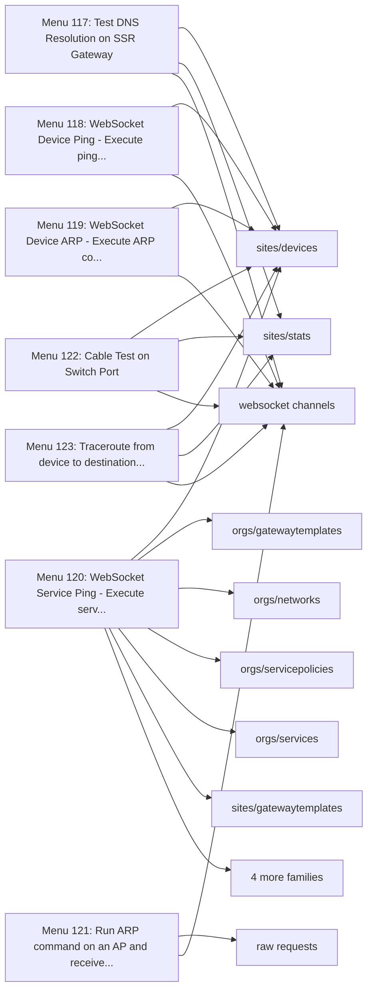

## Menu 102

- Title: Show MAC table on switch device via WebSocket (Layer 2 switching table)
- Handler: `lambda: MacTableCommand.execute(_ws_cmd_deps())`
- Shared helpers: [`InputUtils`](Menu-API-Endpoints#inpututils), [`MainEntrypoint`](Menu-API-Endpoints#mainentrypoint), [`PromptUtils`](Menu-API-Endpoints#promptutils)
- Endpoints: 3

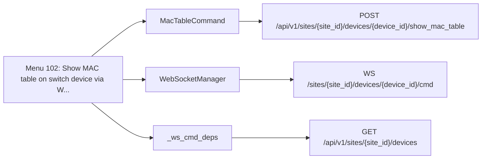

| Method | Path | SDK function | Called from | Found by |
| - | - | - | - | - |
| GET | `/api/v1/sites/{site_id}/devices` | [`sites.devices.listSiteDevices`](https://www.juniper.net/documentation/us/en/software/mist/api/http/api/sites/devices/list-site-devices) | [`_ws_cmd_deps`](https://github.com/jmorrison-juniper/MistHelper/blob/main/MistHelper.py) | Reference |
| POST | `/api/v1/sites/{site_id}/devices/{device_id}/show_mac_table` | None (raw request) | [`MacTableCommand._post_show_mac_table`](https://github.com/jmorrison-juniper/MistHelper/blob/main/src/websocket/commands.py) | Path |
| WS | `/sites/{site_id}/devices/{device_id}/cmd` | None (WebSocket channel) | [`WebSocketManager._subscribe_command_channel`](https://github.com/jmorrison-juniper/MistHelper/blob/main/src/websocket/manager.py) | Channel |

## Menu 103

- Title: Show forwarding table on gateway device via WebSocket (Layer 3 routing table)
- Handler: `lambda: GlobalImportManager.RoutingUtilsFactory().build().execute_show_forwarding_table()`
- Shared helpers: [`InputUtils`](Menu-API-Endpoints#inpututils), [`MainEntrypoint`](Menu-API-Endpoints#mainentrypoint), [`PromptUtils`](Menu-API-Endpoints#promptutils)
- Endpoints: 3


| Method | Path | SDK function | Called from | Found by |
| - | - | - | - | - |
| GET | `/api/v1/sites/{site_id}/devices` | [`sites.devices.listSiteDevices`](https://www.juniper.net/documentation/us/en/software/mist/api/http/api/sites/devices/list-site-devices) | [`RoutingUtils._fetch_device_info`](https://github.com/jmorrison-juniper/MistHelper/blob/main/src/network/routing_utils.py) | Call |
| POST | `/api/v1/sites/{site_id}/devices/{device_id}/{endpoint}` | None (raw request) | [`_RoutingUtilsPayload._post_device_command`](https://github.com/jmorrison-juniper/MistHelper/blob/main/src/network/_routing_utils_payload.py) | Path |
| WS | `/sites/{site_id}/devices/{device_id}/cmd` | None (WebSocket channel) | [`RoutingUtils._subscribe_command_channel`](https://github.com/jmorrison-juniper/MistHelper/blob/main/src/network/routing_utils.py) | Channel |

## Menu 104

- Title: Show routing table on switches via WebSocket (Switch L3 routing - BGP/OSPF/Static)
- Handler: `lambda: GlobalImportManager.RoutingUtilsFactory().build().execute_show_routing_table()`
- Shared helpers: [`InputUtils`](Menu-API-Endpoints#inpututils), [`MainEntrypoint`](Menu-API-Endpoints#mainentrypoint), [`PromptUtils`](Menu-API-Endpoints#promptutils)
- Endpoints: 3


| Method | Path | SDK function | Called from | Found by |
| - | - | - | - | - |
| GET | `/api/v1/sites/{site_id}/devices` | [`sites.devices.listSiteDevices`](https://www.juniper.net/documentation/us/en/software/mist/api/http/api/sites/devices/list-site-devices) | [`RoutingUtils._fetch_device_info`](https://github.com/jmorrison-juniper/MistHelper/blob/main/src/network/routing_utils.py) | Call |
| POST | `/api/v1/sites/{site_id}/devices/{device_id}/{endpoint}` | None (raw request) | [`_RoutingUtilsPayload._post_device_command`](https://github.com/jmorrison-juniper/MistHelper/blob/main/src/network/_routing_utils_payload.py) | Path |
| WS | `/sites/{site_id}/devices/{device_id}/cmd` | None (WebSocket channel) | [`RoutingUtils._subscribe_command_channel`](https://github.com/jmorrison-juniper/MistHelper/blob/main/src/network/routing_utils.py) | Channel |

## Menu 105

- Title: Show SSR/SRX routing table via dedicated API (128T/SRX gateways - Advanced BGP analysis)
- Handler: `lambda: GlobalImportManager.RoutingUtilsFactory().build().execute_show_ssr_routes()`
- Shared helpers: [`InputUtils`](Menu-API-Endpoints#inpututils), [`MainEntrypoint`](Menu-API-Endpoints#mainentrypoint), [`PromptUtils`](Menu-API-Endpoints#promptutils)
- Endpoints: 3

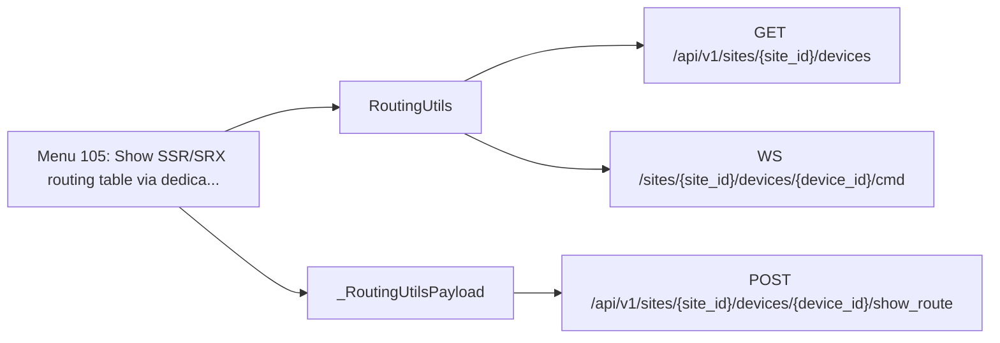

| Method | Path | SDK function | Called from | Found by |
| - | - | - | - | - |
| GET | `/api/v1/sites/{site_id}/devices` | [`sites.devices.listSiteDevices`](https://www.juniper.net/documentation/us/en/software/mist/api/http/api/sites/devices/list-site-devices) | [`RoutingUtils._fetch_device_info`](https://github.com/jmorrison-juniper/MistHelper/blob/main/src/network/routing_utils.py) | Call |
| POST | `/api/v1/sites/{site_id}/devices/{device_id}/show_route` | [`sites.devices.showSiteSsrAndSrxRoutes`](https://www.juniper.net/documentation/us/en/software/mist/api/http/api/utilities/wan/show-site-ssr-and-srx-routes) | [`_RoutingUtilsPayload._invoke_ssr_route_api`](https://github.com/jmorrison-juniper/MistHelper/blob/main/src/network/_routing_utils_payload.py) | Call |
| WS | `/sites/{site_id}/devices/{device_id}/cmd` | None (WebSocket channel) | [`RoutingUtils._subscribe_command_channel`](https://github.com/jmorrison-juniper/MistHelper/blob/main/src/network/routing_utils.py) | Channel |

## Menu 106

- Title: Show OSPF Neighbors on SSR/SRX Gateway
- Handler: `lambda: _get_duc_instance().show_ospf_neighbors()`
- Shared helpers: [`DataExporter`](Menu-API-Endpoints#dataexporter), [`InputUtils`](Menu-API-Endpoints#inpututils), [`MainEntrypoint`](Menu-API-Endpoints#mainentrypoint), [`PromptUtils`](Menu-API-Endpoints#promptutils)
- Endpoints: 3

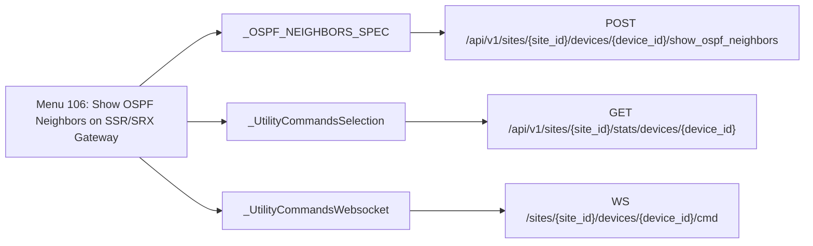

| Method | Path | SDK function | Called from | Found by |
| - | - | - | - | - |
| POST | `/api/v1/sites/{site_id}/devices/{device_id}/show_ospf_neighbors` | [`sites.devices.showSiteGatewayOspfNeighbors`](https://www.juniper.net/documentation/us/en/software/mist/api/http/api/utilities/wan/show-site-gateway-ospf-neighbors) | [`_OSPF_NEIGHBORS_SPEC`](https://github.com/jmorrison-juniper/MistHelper/blob/main/src/device/_utility_commands_show.py) | Reference |
| GET | `/api/v1/sites/{site_id}/stats/devices/{device_id}` | [`sites.stats.getSiteDeviceStats`](https://www.juniper.net/documentation/us/en/software/mist/api/http/api/sites/stats/devices/get-site-device-stats) | [`_UtilityCommandsSelection._get_device_info`](https://github.com/jmorrison-juniper/MistHelper/blob/main/src/device/_utility_commands_selection.py) | Call |
| WS | `/sites/{site_id}/devices/{device_id}/cmd` | None (WebSocket channel) | [`_UtilityCommandsWebsocket._prepare_ws_channel`](https://github.com/jmorrison-juniper/MistHelper/blob/main/src/device/_utility_commands_websocket.py) | Channel |

## Menu 107

- Title: Show OSPF Interfaces on SSR/SRX Gateway
- Handler: `lambda: _get_duc_instance().show_ospf_interfaces()`
- Shared helpers: [`DataExporter`](Menu-API-Endpoints#dataexporter), [`InputUtils`](Menu-API-Endpoints#inpututils), [`MainEntrypoint`](Menu-API-Endpoints#mainentrypoint), [`PromptUtils`](Menu-API-Endpoints#promptutils)
- Endpoints: 3


| Method | Path | SDK function | Called from | Found by |
| - | - | - | - | - |
| POST | `/api/v1/sites/{site_id}/devices/{device_id}/show_ospf_interfaces` | [`sites.devices.showSiteGatewayOspfInterfaces`](https://www.juniper.net/documentation/us/en/software/mist/api/http/api/utilities/wan/show-site-gateway-ospf-interfaces) | [`_OSPF_INTERFACES_SPEC`](https://github.com/jmorrison-juniper/MistHelper/blob/main/src/device/_utility_commands_show.py) | Reference |
| GET | `/api/v1/sites/{site_id}/stats/devices/{device_id}` | [`sites.stats.getSiteDeviceStats`](https://www.juniper.net/documentation/us/en/software/mist/api/http/api/sites/stats/devices/get-site-device-stats) | [`_UtilityCommandsSelection._get_device_info`](https://github.com/jmorrison-juniper/MistHelper/blob/main/src/device/_utility_commands_selection.py) | Call |
| WS | `/sites/{site_id}/devices/{device_id}/cmd` | None (WebSocket channel) | [`_UtilityCommandsWebsocket._prepare_ws_channel`](https://github.com/jmorrison-juniper/MistHelper/blob/main/src/device/_utility_commands_websocket.py) | Channel |

## Menu 108

- Title: Show OSPF Database on SSR/SRX Gateway
- Handler: `lambda: _get_duc_instance().show_ospf_database()`
- Shared helpers: [`DataExporter`](Menu-API-Endpoints#dataexporter), [`InputUtils`](Menu-API-Endpoints#inpututils), [`MainEntrypoint`](Menu-API-Endpoints#mainentrypoint), [`PromptUtils`](Menu-API-Endpoints#promptutils)
- Endpoints: 3

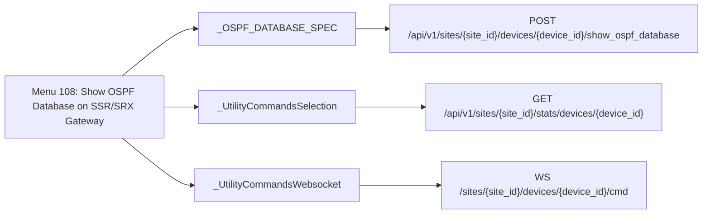

| Method | Path | SDK function | Called from | Found by |
| - | - | - | - | - |
| POST | `/api/v1/sites/{site_id}/devices/{device_id}/show_ospf_database` | [`sites.devices.showSiteGatewayOspfDatabase`](https://www.juniper.net/documentation/us/en/software/mist/api/http/api/utilities/wan/show-site-gateway-ospf-database) | [`_OSPF_DATABASE_SPEC`](https://github.com/jmorrison-juniper/MistHelper/blob/main/src/device/_utility_commands_show.py) | Reference |
| GET | `/api/v1/sites/{site_id}/stats/devices/{device_id}` | [`sites.stats.getSiteDeviceStats`](https://www.juniper.net/documentation/us/en/software/mist/api/http/api/sites/stats/devices/get-site-device-stats) | [`_UtilityCommandsSelection._get_device_info`](https://github.com/jmorrison-juniper/MistHelper/blob/main/src/device/_utility_commands_selection.py) | Call |
| WS | `/sites/{site_id}/devices/{device_id}/cmd` | None (WebSocket channel) | [`_UtilityCommandsWebsocket._prepare_ws_channel`](https://github.com/jmorrison-juniper/MistHelper/blob/main/src/device/_utility_commands_websocket.py) | Channel |

## Menu 109

- Title: Show OSPF Summary on SSR/SRX Gateway
- Handler: `lambda: _get_duc_instance().show_ospf_summary()`
- Shared helpers: [`DataExporter`](Menu-API-Endpoints#dataexporter), [`InputUtils`](Menu-API-Endpoints#inpututils), [`MainEntrypoint`](Menu-API-Endpoints#mainentrypoint), [`PromptUtils`](Menu-API-Endpoints#promptutils)
- Endpoints: 3


| Method | Path | SDK function | Called from | Found by |
| - | - | - | - | - |
| POST | `/api/v1/sites/{site_id}/devices/{device_id}/show_ospf_summary` | [`sites.devices.showSiteGatewayOspfSummary`](https://www.juniper.net/documentation/us/en/software/mist/api/http/api/utilities/wan/show-site-gateway-ospf-summary) | [`_OSPF_SUMMARY_SPEC`](https://github.com/jmorrison-juniper/MistHelper/blob/main/src/device/_utility_commands_show.py) | Reference |
| GET | `/api/v1/sites/{site_id}/stats/devices/{device_id}` | [`sites.stats.getSiteDeviceStats`](https://www.juniper.net/documentation/us/en/software/mist/api/http/api/sites/stats/devices/get-site-device-stats) | [`_UtilityCommandsSelection._get_device_info`](https://github.com/jmorrison-juniper/MistHelper/blob/main/src/device/_utility_commands_selection.py) | Call |
| WS | `/sites/{site_id}/devices/{device_id}/cmd` | None (WebSocket channel) | [`_UtilityCommandsWebsocket._prepare_ws_channel`](https://github.com/jmorrison-juniper/MistHelper/blob/main/src/device/_utility_commands_websocket.py) | Channel |

## Menu 110

- Title: Show Sessions on SSR/SRX Gateway
- Handler: `lambda: _get_duc_instance().show_session()`
- Shared helpers: [`DataExporter`](Menu-API-Endpoints#dataexporter), [`InputUtils`](Menu-API-Endpoints#inpututils), [`MainEntrypoint`](Menu-API-Endpoints#mainentrypoint), [`PromptUtils`](Menu-API-Endpoints#promptutils)
- Endpoints: 3

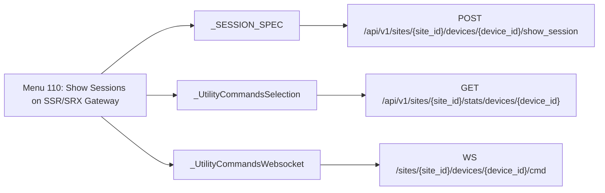

| Method | Path | SDK function | Called from | Found by |
| - | - | - | - | - |
| POST | `/api/v1/sites/{site_id}/devices/{device_id}/show_session` | [`sites.devices.showSiteSsrAndSrxSessions`](https://www.juniper.net/documentation/us/en/software/mist/api/http/api/utilities/wan/show-site-ssr-and-srx-sessions) | [`_SESSION_SPEC`](https://github.com/jmorrison-juniper/MistHelper/blob/main/src/device/_utility_commands_show.py) | Reference |
| GET | `/api/v1/sites/{site_id}/stats/devices/{device_id}` | [`sites.stats.getSiteDeviceStats`](https://www.juniper.net/documentation/us/en/software/mist/api/http/api/sites/stats/devices/get-site-device-stats) | [`_UtilityCommandsSelection._get_device_info`](https://github.com/jmorrison-juniper/MistHelper/blob/main/src/device/_utility_commands_selection.py) | Call |
| WS | `/sites/{site_id}/devices/{device_id}/cmd` | None (WebSocket channel) | [`_UtilityCommandsWebsocket._prepare_ws_channel`](https://github.com/jmorrison-juniper/MistHelper/blob/main/src/device/_utility_commands_websocket.py) | Channel |

## Menu 111

- Title: Show Service Path on SSR Gateway
- Handler: `lambda: _get_duc_instance().show_service_path()`
- Shared helpers: [`DataExporter`](Menu-API-Endpoints#dataexporter), [`InputUtils`](Menu-API-Endpoints#inpututils), [`MainEntrypoint`](Menu-API-Endpoints#mainentrypoint), [`PromptUtils`](Menu-API-Endpoints#promptutils)
- Endpoints: 3

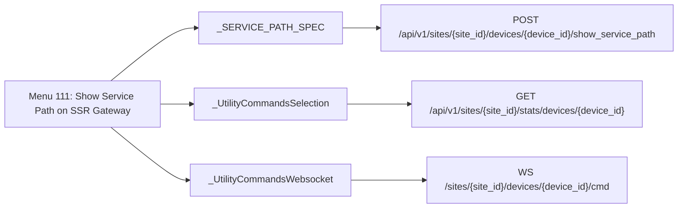

| Method | Path | SDK function | Called from | Found by |
| - | - | - | - | - |
| POST | `/api/v1/sites/{site_id}/devices/{device_id}/show_service_path` | [`sites.devices.showSiteSsrServicePath`](https://www.juniper.net/documentation/us/en/software/mist/api/http/api/utilities/wan/show-site-ssr-service-path) | [`_SERVICE_PATH_SPEC`](https://github.com/jmorrison-juniper/MistHelper/blob/main/src/device/_utility_commands_show.py) | Reference |
| GET | `/api/v1/sites/{site_id}/stats/devices/{device_id}` | [`sites.stats.getSiteDeviceStats`](https://www.juniper.net/documentation/us/en/software/mist/api/http/api/sites/stats/devices/get-site-device-stats) | [`_UtilityCommandsSelection._get_device_info`](https://github.com/jmorrison-juniper/MistHelper/blob/main/src/device/_utility_commands_selection.py) | Call |
| WS | `/sites/{site_id}/devices/{device_id}/cmd` | None (WebSocket channel) | [`_UtilityCommandsWebsocket._prepare_ws_channel`](https://github.com/jmorrison-juniper/MistHelper/blob/main/src/device/_utility_commands_websocket.py) | Channel |

## Menu 112

- Title: Show BGP Summary on Switch or Gateway
- Handler: `lambda: _get_duc_instance().show_bgp_summary()`
- Shared helpers: [`DataExporter`](Menu-API-Endpoints#dataexporter), [`InputUtils`](Menu-API-Endpoints#inpututils), [`MainEntrypoint`](Menu-API-Endpoints#mainentrypoint), [`PromptUtils`](Menu-API-Endpoints#promptutils)
- Endpoints: 3

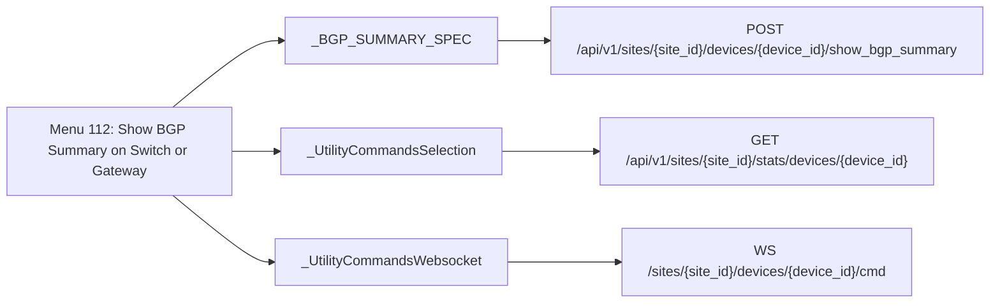

| Method | Path | SDK function | Called from | Found by |
| - | - | - | - | - |
| POST | `/api/v1/sites/{site_id}/devices/{device_id}/show_bgp_summary` | [`sites.devices.showSiteDeviceBgpSummary`](https://www.juniper.net/documentation/us/en/software/mist/api/http/api/utilities/common/show-site-device-bgp-summary) | [`_BGP_SUMMARY_SPEC`](https://github.com/jmorrison-juniper/MistHelper/blob/main/src/device/_utility_commands_show.py) | Reference |
| GET | `/api/v1/sites/{site_id}/stats/devices/{device_id}` | [`sites.stats.getSiteDeviceStats`](https://www.juniper.net/documentation/us/en/software/mist/api/http/api/sites/stats/devices/get-site-device-stats) | [`_UtilityCommandsSelection._get_device_info`](https://github.com/jmorrison-juniper/MistHelper/blob/main/src/device/_utility_commands_selection.py) | Call |
| WS | `/sites/{site_id}/devices/{device_id}/cmd` | None (WebSocket channel) | [`_UtilityCommandsWebsocket._prepare_ws_channel`](https://github.com/jmorrison-juniper/MistHelper/blob/main/src/device/_utility_commands_websocket.py) | Channel |

## Menu 113

- Title: Show ARP Table on Switch or Gateway
- Handler: `lambda: _get_duc_instance().show_arp_table()`
- Shared helpers: [`DataExporter`](Menu-API-Endpoints#dataexporter), [`InputUtils`](Menu-API-Endpoints#inpututils), [`MainEntrypoint`](Menu-API-Endpoints#mainentrypoint), [`PromptUtils`](Menu-API-Endpoints#promptutils)
- Endpoints: 3

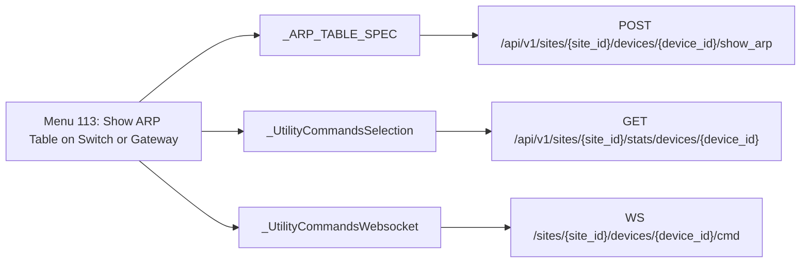

| Method | Path | SDK function | Called from | Found by |
| - | - | - | - | - |
| POST | `/api/v1/sites/{site_id}/devices/{device_id}/show_arp` | [`sites.devices.showSiteDeviceArpTable`](https://www.juniper.net/documentation/us/en/software/mist/api/http/api/utilities/lan/show-site-device-arp-table) | [`_ARP_TABLE_SPEC`](https://github.com/jmorrison-juniper/MistHelper/blob/main/src/device/_utility_commands_show.py) | Reference |
| GET | `/api/v1/sites/{site_id}/stats/devices/{device_id}` | [`sites.stats.getSiteDeviceStats`](https://www.juniper.net/documentation/us/en/software/mist/api/http/api/sites/stats/devices/get-site-device-stats) | [`_UtilityCommandsSelection._get_device_info`](https://github.com/jmorrison-juniper/MistHelper/blob/main/src/device/_utility_commands_selection.py) | Call |
| WS | `/sites/{site_id}/devices/{device_id}/cmd` | None (WebSocket channel) | [`_UtilityCommandsWebsocket._prepare_ws_channel`](https://github.com/jmorrison-juniper/MistHelper/blob/main/src/device/_utility_commands_websocket.py) | Channel |

## Menu 114

- Title: Show DHCP Leases on Switch or Gateway
- Handler: `lambda: _get_duc_instance().show_dhcp_leases()`
- Shared helpers: [`DataExporter`](Menu-API-Endpoints#dataexporter), [`InputUtils`](Menu-API-Endpoints#inpututils), [`MainEntrypoint`](Menu-API-Endpoints#mainentrypoint), [`PromptUtils`](Menu-API-Endpoints#promptutils)
- Endpoints: 4

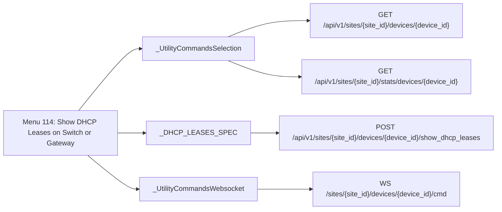

| Method | Path | SDK function | Called from | Found by |
| - | - | - | - | - |
| GET | `/api/v1/sites/{site_id}/devices/{device_id}` | [`sites.devices.getSiteDevice`](https://www.juniper.net/documentation/us/en/software/mist/api/http/api/sites/devices/get-site-device) | [`_UtilityCommandsSelection._fetch_device_config`](https://github.com/jmorrison-juniper/MistHelper/blob/main/src/device/_utility_commands_selection.py) | Call |
| POST | `/api/v1/sites/{site_id}/devices/{device_id}/show_dhcp_leases` | [`sites.devices.showSiteDeviceDhcpLeases`](https://www.juniper.net/documentation/us/en/software/mist/api/http/api/utilities/common/show-site-device-dhcp-leases) | [`_DHCP_LEASES_SPEC`](https://github.com/jmorrison-juniper/MistHelper/blob/main/src/device/_utility_commands_show.py) | Reference |
| GET | `/api/v1/sites/{site_id}/stats/devices/{device_id}` | [`sites.stats.getSiteDeviceStats`](https://www.juniper.net/documentation/us/en/software/mist/api/http/api/sites/stats/devices/get-site-device-stats) | [`_UtilityCommandsSelection._get_device_info`](https://github.com/jmorrison-juniper/MistHelper/blob/main/src/device/_utility_commands_selection.py) | Call |
| WS | `/sites/{site_id}/devices/{device_id}/cmd` | None (WebSocket channel) | [`_UtilityCommandsWebsocket._prepare_ws_channel`](https://github.com/jmorrison-juniper/MistHelper/blob/main/src/device/_utility_commands_websocket.py) | Channel |

## Menu 115

- Title: Show 802.1X Table on Switch
- Handler: `lambda: _get_duc_instance().show_dot1x()`
- Shared helpers: [`DataExporter`](Menu-API-Endpoints#dataexporter), [`InputUtils`](Menu-API-Endpoints#inpututils), [`MainEntrypoint`](Menu-API-Endpoints#mainentrypoint), [`PromptUtils`](Menu-API-Endpoints#promptutils)
- Endpoints: 3

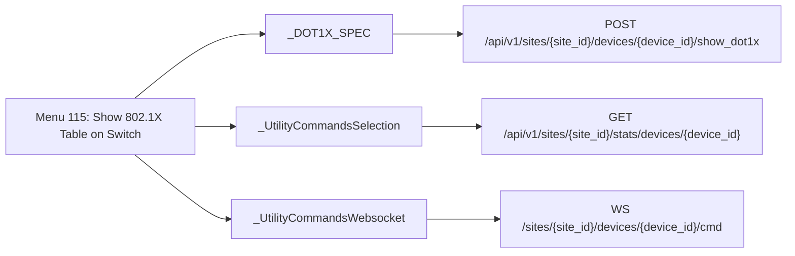

| Method | Path | SDK function | Called from | Found by |
| - | - | - | - | - |
| POST | `/api/v1/sites/{site_id}/devices/{device_id}/show_dot1x` | [`sites.devices.showSiteDeviceDot1xTable`](https://www.juniper.net/documentation/us/en/software/mist/api/http/api/utilities/common/show-site-device-dot1x-table) | [`_DOT1X_SPEC`](https://github.com/jmorrison-juniper/MistHelper/blob/main/src/device/_utility_commands_show.py) | Reference |
| GET | `/api/v1/sites/{site_id}/stats/devices/{device_id}` | [`sites.stats.getSiteDeviceStats`](https://www.juniper.net/documentation/us/en/software/mist/api/http/api/sites/stats/devices/get-site-device-stats) | [`_UtilityCommandsSelection._get_device_info`](https://github.com/jmorrison-juniper/MistHelper/blob/main/src/device/_utility_commands_selection.py) | Call |
| WS | `/sites/{site_id}/devices/{device_id}/cmd` | None (WebSocket channel) | [`_UtilityCommandsWebsocket._prepare_ws_channel`](https://github.com/jmorrison-juniper/MistHelper/blob/main/src/device/_utility_commands_websocket.py) | Channel |

## Menu 116

- Title: Show EVPN Database on Switch or Gateway
- Handler: `lambda: _get_duc_instance().show_evpn_database()`
- Shared helpers: [`DataExporter`](Menu-API-Endpoints#dataexporter), [`InputUtils`](Menu-API-Endpoints#inpututils), [`MainEntrypoint`](Menu-API-Endpoints#mainentrypoint), [`PromptUtils`](Menu-API-Endpoints#promptutils)
- Endpoints: 3


| Method | Path | SDK function | Called from | Found by |
| - | - | - | - | - |
| POST | `/api/v1/sites/{site_id}/devices/{device_id}/show_evpn_database` | [`sites.devices.showSiteDeviceEvpnDatabase`](https://www.juniper.net/documentation/us/en/software/mist/api/http/api/utilities/common/show-site-device-evpn-database) | [`_EVPN_DATABASE_SPEC`](https://github.com/jmorrison-juniper/MistHelper/blob/main/src/device/_utility_commands_show.py) | Reference |
| GET | `/api/v1/sites/{site_id}/stats/devices/{device_id}` | [`sites.stats.getSiteDeviceStats`](https://www.juniper.net/documentation/us/en/software/mist/api/http/api/sites/stats/devices/get-site-device-stats) | [`_UtilityCommandsSelection._get_device_info`](https://github.com/jmorrison-juniper/MistHelper/blob/main/src/device/_utility_commands_selection.py) | Call |
| WS | `/sites/{site_id}/devices/{device_id}/cmd` | None (WebSocket channel) | [`_UtilityCommandsWebsocket._prepare_ws_channel`](https://github.com/jmorrison-juniper/MistHelper/blob/main/src/device/_utility_commands_websocket.py) | Channel |

## Menu 117

- Title: Test DNS Resolution on SSR Gateway
- Handler: `lambda: _get_duc_instance().resolve_dns()`
- Shared helpers: [`DataExporter`](Menu-API-Endpoints#dataexporter), [`InputUtils`](Menu-API-Endpoints#inpututils), [`MainEntrypoint`](Menu-API-Endpoints#mainentrypoint), [`PromptUtils`](Menu-API-Endpoints#promptutils)
- Endpoints: 3

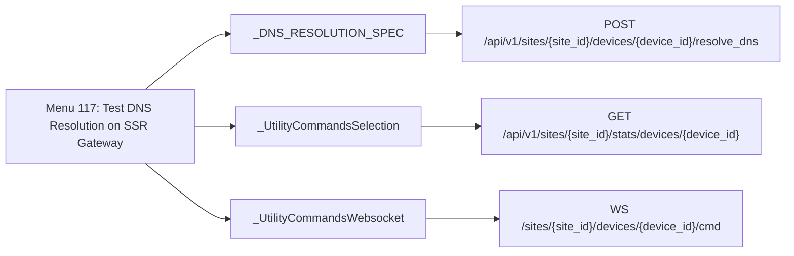

| Method | Path | SDK function | Called from | Found by |
| - | - | - | - | - |
| POST | `/api/v1/sites/{site_id}/devices/{device_id}/resolve_dns` | [`sites.devices.testSiteSsrDnsResolution`](https://www.juniper.net/documentation/us/en/software/mist/api/http/api/utilities/wan/test-site-ssr-dns-resolution) | [`_DNS_RESOLUTION_SPEC`](https://github.com/jmorrison-juniper/MistHelper/blob/main/src/device/_utility_commands_show.py) | Reference |
| GET | `/api/v1/sites/{site_id}/stats/devices/{device_id}` | [`sites.stats.getSiteDeviceStats`](https://www.juniper.net/documentation/us/en/software/mist/api/http/api/sites/stats/devices/get-site-device-stats) | [`_UtilityCommandsSelection._get_device_info`](https://github.com/jmorrison-juniper/MistHelper/blob/main/src/device/_utility_commands_selection.py) | Call |
| WS | `/sites/{site_id}/devices/{device_id}/cmd` | None (WebSocket channel) | [`_UtilityCommandsWebsocket._prepare_ws_channel`](https://github.com/jmorrison-juniper/MistHelper/blob/main/src/device/_utility_commands_websocket.py) | Channel |

## Menu 118

- Title: WebSocket Device Ping - Execute ping command on device via WebSocket stream (real-time output)
- Handler: `lambda: PingDeviceExecutor().execute(_ws_cmd_deps())`
- Shared helpers: [`InputUtils`](Menu-API-Endpoints#inpututils), [`MainEntrypoint`](Menu-API-Endpoints#mainentrypoint), [`PromptUtils`](Menu-API-Endpoints#promptutils)
- Endpoints: 2


| Method | Path | SDK function | Called from | Found by |
| - | - | - | - | - |
| GET | `/api/v1/sites/{site_id}/devices` | [`sites.devices.listSiteDevices`](https://www.juniper.net/documentation/us/en/software/mist/api/http/api/sites/devices/list-site-devices) | [`_ws_cmd_deps`](https://github.com/jmorrison-juniper/MistHelper/blob/main/MistHelper.py) | Reference |
| WS | `/sites/{site_id}/devices/{device_id}/cmd` | None (WebSocket channel) | [`WebSocketManager._subscribe_command_channel`](https://github.com/jmorrison-juniper/MistHelper/blob/main/src/websocket/manager.py) | Channel |

## Menu 119

- Title: WebSocket Device ARP - Execute ARP command on device via WebSocket stream (real-time output)
- Handler: `lambda: ArpDeviceExecutor().execute(_ws_cmd_deps())`
- Shared helpers: [`InputUtils`](Menu-API-Endpoints#inpututils), [`MainEntrypoint`](Menu-API-Endpoints#mainentrypoint), [`PromptUtils`](Menu-API-Endpoints#promptutils)
- Endpoints: 2

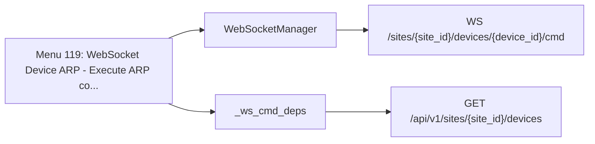

| Method | Path | SDK function | Called from | Found by |
| - | - | - | - | - |
| GET | `/api/v1/sites/{site_id}/devices` | [`sites.devices.listSiteDevices`](https://www.juniper.net/documentation/us/en/software/mist/api/http/api/sites/devices/list-site-devices) | [`_ws_cmd_deps`](https://github.com/jmorrison-juniper/MistHelper/blob/main/MistHelper.py) | Reference |
| WS | `/sites/{site_id}/devices/{device_id}/cmd` | None (WebSocket channel) | [`WebSocketManager._subscribe_command_channel`](https://github.com/jmorrison-juniper/MistHelper/blob/main/src/websocket/manager.py) | Channel |

## Menu 120

- Title: WebSocket Service Ping - Execute service-specific ping on SSR gateways via WebSocket stream (real-time output)
- Handler: `lambda: ServicePingLauncher().launch()`
- Shared helpers: [`ConfigUtils`](Menu-API-Endpoints#configutils), [`InputUtils`](Menu-API-Endpoints#inpututils), [`PromptUtils`](Menu-API-Endpoints#promptutils), [`SourceDependencyResolver`](Menu-API-Endpoints#sourcedependencyresolver)
- Endpoints: 12

```mermaid
flowchart LR
    menu["Menu 120: WebSocket Service Ping - Execute serv..."]
    menu --> c1["APITenantFetchUtils"]
    c1 --> e1["GET /api/v1/orgs/{org_id}/gatewaytemplates"]
    c1 --> e2["GET /api/v1/orgs/{org_id}/networks"]
    c1 --> e3["GET /api/v1/orgs/{org_id}/servicepolicies"]
    c1 --> e4["GET /api/v1/sites/{site_id}/gatewaytemplates/derived"]
    c1 --> e5["GET /api/v1/sites/{site_id}/networks/derived"]
    c1 --> e6["GET /api/v1/sites/{site_id}/servicepolicies/derived"]
    menu --> c2["ServicePingManager"]
    c2 --> e7["GET /api/v1/sites/{site_id}/devices"]
    c2 --> e8["POST /api/v1/sites/{site_id}/devices/{device_id}/service_ping"]
    c2 --> e9["WS /sites/{site_id}/devices/{device_id}/cmd"]
    menu --> c3["ServicePingDiscoveryMixin"]
    c3 --> e10["GET /api/v1/sites/{site_id}/devices/{device_id}"]
    c3 --> e11["GET /api/v1/sites/{site_id}/stats/devices/{device_id}"]
    menu --> c4["APIFetchUtils"]
    c4 --> e12["GET /api/v1/orgs/{org_id}/services"]
```

| Method | Path | SDK function | Called from | Found by |
| - | - | - | - | - |
| GET | `/api/v1/orgs/{org_id}/gatewaytemplates` | [`orgs.gatewaytemplates.listOrgGatewayTemplates`](https://www.juniper.net/documentation/us/en/software/mist/api/http/api/orgs/gateway-templates/list-org-gateway-templates) | [`APITenantFetchUtils._fetch_org_template_tenants`](https://github.com/jmorrison-juniper/MistHelper/blob/main/src/api/tenant_fetch.py) | Call |
| GET | `/api/v1/orgs/{org_id}/networks` | [`orgs.networks.listOrgNetworks`](https://www.juniper.net/documentation/us/en/software/mist/api/http/api/orgs/networks/list-org-networks) | [`APITenantFetchUtils.organization_tenants`](https://github.com/jmorrison-juniper/MistHelper/blob/main/src/api/tenant_fetch.py) | Call |
| GET | `/api/v1/orgs/{org_id}/servicepolicies` | [`orgs.servicepolicies.listOrgServicePolicies`](https://www.juniper.net/documentation/us/en/software/mist/api/http/api/orgs/service-policies/list-org-service-policies) | [`APITenantFetchUtils._fetch_org_policy_tenants`](https://github.com/jmorrison-juniper/MistHelper/blob/main/src/api/tenant_fetch.py) | Call |
| GET | `/api/v1/orgs/{org_id}/services` | [`orgs.services.listOrgServices`](https://www.juniper.net/documentation/us/en/software/mist/api/http/api/orgs/services/list-org-services) | [`APIFetchUtils.organization_services`](https://github.com/jmorrison-juniper/MistHelper/blob/main/src/api/api_fetch_utils.py) | Call |
| GET | `/api/v1/sites/{site_id}/devices` | [`sites.devices.listSiteDevices`](https://www.juniper.net/documentation/us/en/software/mist/api/http/api/sites/devices/list-site-devices) | [`ServicePingManager._lookup_device_info`](https://github.com/jmorrison-juniper/MistHelper/blob/main/src/websocket/service_ping_manager.py) | Call |
| GET | `/api/v1/sites/{site_id}/devices/{device_id}` | [`sites.devices.getSiteDevice`](https://www.juniper.net/documentation/us/en/software/mist/api/http/api/sites/devices/get-site-device) | [`ServicePingDiscoveryMixin._retrieve_device_config`](https://github.com/jmorrison-juniper/MistHelper/blob/main/src/websocket/service_ping_discovery.py) | Call |
| POST | `/api/v1/sites/{site_id}/devices/{device_id}/service_ping` | [`sites.devices.servicePingFromSsr`](https://www.juniper.net/documentation/us/en/software/mist/api/http/api/utilities/wan/service-ping-from-ssr) | [`ServicePingManager._execute_service_ping`](https://github.com/jmorrison-juniper/MistHelper/blob/main/src/websocket/service_ping_manager.py) | Call |
| GET | `/api/v1/sites/{site_id}/gatewaytemplates/derived` | [`sites.gatewaytemplates.listSiteGatewayTemplatesDerived`](https://www.juniper.net/documentation/us/en/software/mist/api/http/api/sites/gateway-templates/list-site-gateway-templates-derived) | [`APITenantFetchUtils._fetch_site_template_tenants`](https://github.com/jmorrison-juniper/MistHelper/blob/main/src/api/tenant_fetch.py) | Call |
| GET | `/api/v1/sites/{site_id}/networks/derived` | [`sites.networks.listSiteNetworksDerived`](https://www.juniper.net/documentation/us/en/software/mist/api/http/api/sites/networks/list-site-networks-derived) | [`APITenantFetchUtils.site_tenants`](https://github.com/jmorrison-juniper/MistHelper/blob/main/src/api/tenant_fetch.py) | Call |
| GET | `/api/v1/sites/{site_id}/servicepolicies/derived` | [`sites.servicepolicies.listSiteServicePoliciesDerived`](https://www.juniper.net/documentation/us/en/software/mist/api/http/api/sites/service-policies/list-site-service-policies-derived) | [`APITenantFetchUtils._fetch_site_policy_tenants`](https://github.com/jmorrison-juniper/MistHelper/blob/main/src/api/tenant_fetch.py) | Call |
| GET | `/api/v1/sites/{site_id}/stats/devices/{device_id}` | [`sites.stats.getSiteDeviceStats`](https://www.juniper.net/documentation/us/en/software/mist/api/http/api/sites/stats/devices/get-site-device-stats) | [`ServicePingDiscoveryMixin._retrieve_device_stats`](https://github.com/jmorrison-juniper/MistHelper/blob/main/src/websocket/service_ping_discovery.py) | Call |
| WS | `/sites/{site_id}/devices/{device_id}/cmd` | None (WebSocket channel) | [`ServicePingManager._setup_websocket`](https://github.com/jmorrison-juniper/MistHelper/blob/main/src/websocket/service_ping_manager.py) | Channel |

## Menu 121

- Title: Run ARP command on an AP and receive output via WebSocket
- Handler: `ARPCommandManager.execute`
- Shared helpers: [`PromptUtils`](Menu-API-Endpoints#promptutils), [`SourceDependencyResolver`](Menu-API-Endpoints#sourcedependencyresolver)
- Endpoints: 2

```mermaid
flowchart LR
    menu["Menu 121: Run ARP command on an AP and receive..."]
    menu --> c1["ARPCommandManager"]
    c1 --> e1["POST /api/v1/sites/{site_id}/devices/{device_id}/arp"]
    c1 --> e2["WS /sites/{site_id}/devices/{device_id}/cmd"]
```

| Method | Path | SDK function | Called from | Found by |
| - | - | - | - | - |
| POST | `/api/v1/sites/{site_id}/devices/{device_id}/arp` | None (raw request) | [`ARPCommandManager._trigger_command`](https://github.com/jmorrison-juniper/MistHelper/blob/main/src/device/arp_command_manager.py) | Path |
| WS | `/sites/{site_id}/devices/{device_id}/cmd` | None (WebSocket channel) | [`ARPCommandManager._build_ws_subscribe`](https://github.com/jmorrison-juniper/MistHelper/blob/main/src/device/arp_command_manager.py) | Channel |

## Menu 122

- Title: Cable Test on Switch Port
- Handler: `lambda: _get_duc_instance().cable_test()`
- Shared helpers: [`DataExporter`](Menu-API-Endpoints#dataexporter), [`InputUtils`](Menu-API-Endpoints#inpututils), [`MainEntrypoint`](Menu-API-Endpoints#mainentrypoint), [`PromptUtils`](Menu-API-Endpoints#promptutils)
- Endpoints: 3

```mermaid
flowchart LR
    menu["Menu 122: Cable Test on Switch Port"]
    menu --> c1["_CABLE_TEST_SPEC"]
    c1 --> e1["POST /api/v1/sites/{site_id}/devices/{device_id}/cable_test"]
    menu --> c2["_UtilityCommandsSelection"]
    c2 --> e2["GET /api/v1/sites/{site_id}/stats/devices/{device_id}"]
    menu --> c3["_UtilityCommandsWebsocket"]
    c3 --> e3["WS /sites/{site_id}/devices/{device_id}/cmd"]
```

| Method | Path | SDK function | Called from | Found by |
| - | - | - | - | - |
| POST | `/api/v1/sites/{site_id}/devices/{device_id}/cable_test` | [`sites.devices.cableTestFromSwitch`](https://www.juniper.net/documentation/us/en/software/mist/api/http/api/utilities/lan/cable-test-from-switch) | [`_CABLE_TEST_SPEC`](https://github.com/jmorrison-juniper/MistHelper/blob/main/src/device/_utility_commands_show.py) | Reference |
| GET | `/api/v1/sites/{site_id}/stats/devices/{device_id}` | [`sites.stats.getSiteDeviceStats`](https://www.juniper.net/documentation/us/en/software/mist/api/http/api/sites/stats/devices/get-site-device-stats) | [`_UtilityCommandsSelection._fetch_stats_data`](https://github.com/jmorrison-juniper/MistHelper/blob/main/src/device/_utility_commands_selection.py) | Call |
| WS | `/sites/{site_id}/devices/{device_id}/cmd` | None (WebSocket channel) | [`_UtilityCommandsWebsocket._prepare_ws_channel`](https://github.com/jmorrison-juniper/MistHelper/blob/main/src/device/_utility_commands_websocket.py) | Channel |

## Menu 123

- Title: Traceroute from device to destination host (AP/Switch/Gateway)
- Handler: `lambda: _get_duc_instance().traceroute()`
- Shared helpers: [`DataExporter`](Menu-API-Endpoints#dataexporter), [`InputUtils`](Menu-API-Endpoints#inpututils), [`MainEntrypoint`](Menu-API-Endpoints#mainentrypoint), [`PromptUtils`](Menu-API-Endpoints#promptutils)
- Endpoints: 3

```mermaid
flowchart LR
    menu["Menu 123: Traceroute from device to destination..."]
    menu --> c1["_TRACEROUTE_SPEC"]
    c1 --> e1["POST /api/v1/sites/{site_id}/devices/{device_id}/traceroute"]
    menu --> c2["_UtilityCommandsSelection"]
    c2 --> e2["GET /api/v1/sites/{site_id}/stats/devices/{device_id}"]
    menu --> c3["_UtilityCommandsWebsocket"]
    c3 --> e3["WS /sites/{site_id}/devices/{device_id}/cmd"]
```

| Method | Path | SDK function | Called from | Found by |
| - | - | - | - | - |
| POST | `/api/v1/sites/{site_id}/devices/{device_id}/traceroute` | [`sites.devices.tracerouteFromDevice`](https://www.juniper.net/documentation/us/en/software/mist/api/http/api/utilities/common/traceroute-from-device) | [`_TRACEROUTE_SPEC`](https://github.com/jmorrison-juniper/MistHelper/blob/main/src/device/_utility_commands_show.py) | Reference |
| GET | `/api/v1/sites/{site_id}/stats/devices/{device_id}` | [`sites.stats.getSiteDeviceStats`](https://www.juniper.net/documentation/us/en/software/mist/api/http/api/sites/stats/devices/get-site-device-stats) | [`_UtilityCommandsSelection._get_device_info`](https://github.com/jmorrison-juniper/MistHelper/blob/main/src/device/_utility_commands_selection.py) | Call |
| WS | `/sites/{site_id}/devices/{device_id}/cmd` | None (WebSocket channel) | [`_UtilityCommandsWebsocket._prepare_ws_channel`](https://github.com/jmorrison-juniper/MistHelper/blob/main/src/device/_utility_commands_websocket.py) | Channel |
