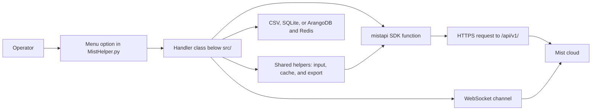
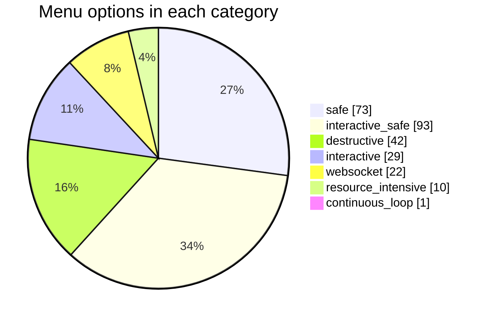

<!-- The tool python -m scripts.menu_api_map writes this page. Do not edit it by hand. -->

# Menu API endpoint map

This map shows the Mist API endpoints that each of the 270 MistHelper menu options can call.
The count includes menu 0, which closes MistHelper.
The menu reference does not count menu 0 as an actionable entry.
Use the map to find the endpoint that does a task, and to find the code that sends the request.

A tool writes each page of the map from the source code and from mistapi 0.64.0.
Do not edit a page by hand. To write the pages again, run this command from the repository root:

```powershell
python -m scripts.menu_api_map
```

The `menu_reference_drift` job runs `python -m scripts.menu_api_map --check` on each pull request.
If a change adds or removes an API call, the job fails until you write the pages again.

## How to read the map

- The map comes from static analysis. The tool does not run MistHelper, and it sends no API request.
- The map shows the endpoints that a menu option can reach. A call can depend on a prompt answer.
- The map can miss a call that the code builds at run time from data.
- The walk stops at a shared helper. The shared helper section lists the endpoints of each helper.
- The HTTP method is Unknown when the code holds the path in a string and does not state the method.
- The diagram of a menu option shows 12 endpoints or fewer. The table lists each endpoint.

## How a menu option reaches the Mist cloud



## How the tool builds the map


## Menu options in each category



## Category pages

| Category | Menu options | With an endpoint | Page |
| - | - | - | - |
| `safe` | 73 | 72 | [safe](Menu-API-Endpoints-Safe) |
| `interactive_safe` | 93 | 93 | [interactive_safe](Menu-API-Endpoints-Interactive-Safe) |
| `destructive` | 42 | 40 | [destructive](Menu-API-Endpoints-Destructive) |
| `interactive` | 29 | 27 | [interactive](Menu-API-Endpoints-Interactive) |
| `websocket` | 22 | 22 | [websocket](Menu-API-Endpoints-Websocket) |
| `resource_intensive` | 10 | 10 | [resource_intensive](Menu-API-Endpoints-Resource-Intensive) |
| `continuous_loop` | 1 | 1 | [continuous_loop](Menu-API-Endpoints-Continuous-Loop) |

## Find a menu option

| Menu | Title | Category | Endpoints |
| - | - | - | - |
| [0](Menu-API-Endpoints-Interactive#menu-0) | Exit MistHelper | `interactive` | 0 |
| [1](Menu-API-Endpoints-Safe#menu-1) | Export a list of all sites in the organization | `safe` | 1 |
| [2](Menu-API-Endpoints-Safe#menu-2) | Export a list of sites with location and timezone info | `safe` | 1 |
| [3](Menu-API-Endpoints-Safe#menu-3) | Export all sites using the 'list' sites API endpoint (to SiteList_ListAPI.csv, only if not already present) | `safe` | 1 |
| [4](Menu-API-Endpoints-Safe#menu-4) | Export all current guest users and last 7 days of historical guests to CSV | `safe` | 1 |
| [5](Menu-API-Endpoints-Safe#menu-5) | Export E911 report for the organization | `safe` | 1 |
| [6](Menu-API-Endpoints-Safe#menu-6) | Site Config Analysis - Scan all sites for zone, engagement dwell tag, and occupancy setting deviations | `safe` | 3 |
| [7](Menu-API-Endpoints-Safe#menu-7) | Site Inventory Health Analysis - Find sites with APs missing switches/gateways, or with offline infrastructure | `safe` | 2 |
| [8](Menu-API-Endpoints-Safe#menu-8) | Export the full inventory of devices in the organization | `safe` | 1 |
| [9](Menu-API-Endpoints-Safe#menu-9) | Export a list of all devices in the organization | `safe` | 1 |
| [10](Menu-API-Endpoints-Safe#menu-10) | Export a list of all devices with associated site and address info | `safe` | 2 |
| [11](Menu-API-Endpoints-Safe#menu-11) | Export a list of gateways with associated site and address info | `safe` | 2 |
| [12](Menu-API-Endpoints-Safe#menu-12) | Export combined inventory with site and address info by calendar week | `safe` | 3 |
| [13](Menu-API-Endpoints-Safe#menu-13) | Export org device model counts, firmware version distribution, and versions per model (MSP-aware) | `safe` | 4 |
| [14](Menu-API-Endpoints-Resource-Intensive#menu-14) | Check virtual chassis to virtual MAC conversion status for all switches | `resource_intensive` | 2 |
| [15](Menu-API-Endpoints-Safe#menu-15) | Export statistics for all devices in the organization | `safe` | 1 |
| [16](Menu-API-Endpoints-Safe#menu-16) | Export VPN peer path statistics for the organization | `safe` | 1 |
| [17](Menu-API-Endpoints-Safe#menu-17) | Export all switch virtual chassis (VC/stacking) stats to CSV | `safe` | 2 |
| [18](Menu-API-Endpoints-Resource-Intensive#menu-18) | Export detailed device statistics for all gateways (with freshness check) | `resource_intensive` | 3 |
| [19](Menu-API-Endpoints-Resource-Intensive#menu-19) | Export port-level statistics for switches and gateways | `resource_intensive` | 3 |
| [20](Menu-API-Endpoints-Safe#menu-20) | Export all organization alarms from the past day | `safe` | 1 |
| [21](Menu-API-Endpoints-Safe#menu-21) | Export all device events from the past 24 hours | `safe` | 1 |
| [22](Menu-API-Endpoints-Safe#menu-22) | Export audit logs for the organization (last 24 hours) | `safe` | 1 |
| [23](Menu-API-Endpoints-Safe#menu-23) | Export self (admin account) audit log | `safe` | 1 |
| [24](Menu-API-Endpoints-Safe#menu-24) | Export security events for the organization | `safe` | 5 |
| [25](Menu-API-Endpoints-Safe#menu-25) | Audit Log Analysis - Mermaid timeline + interactive HTML report | `safe` | 1 |
| [26](Menu-API-Endpoints-Safe#menu-26) | Offline Device Report | `safe` | 2 |
| [27](Menu-API-Endpoints-Safe#menu-27) | Export wireless client statistics for the organization | `safe` | 1 |
| [28](Menu-API-Endpoints-Safe#menu-28) | Export wired client statistics for the organization | `safe` | 1 |
| [29](Menu-API-Endpoints-Safe#menu-29) | Export rogue client detections for the organization | `safe` | 3 |
| [30](Menu-API-Endpoints-Safe#menu-30) | Export rogue AP detections for the organization | `safe` | 2 |
| [31](Menu-API-Endpoints-Safe#menu-31) | Export gateway management overlay IPs grouped by template association | `safe` | 6 |
| [32](Menu-API-Endpoints-Safe#menu-32) | Export gateway templates from the organization | `safe` | 1 |
| [33](Menu-API-Endpoints-Safe#menu-33) | Export synthetic test results for all gateways | `safe` | 3 |
| [34](Menu-API-Endpoints-Safe#menu-34) | Export all synthetic test results (including speed tests) for gateways | `safe` | 2 |
| [35](Menu-API-Endpoints-Safe#menu-35) | Find gateway ports overridden from template (outliers for compliance correction) | `safe` | 6 |
| [36](Menu-API-Endpoints-Safe#menu-36) | Check and export gateways with duplicate WAN port IP addresses (0/0/0, 0/0/1, 0/0/2) | `safe` | 3 |
| [37](Menu-API-Endpoints-Safe#menu-37) | Export all organization templates (gateway, network, RF, site, AP) | `safe` | 5 |
| [38](Menu-API-Endpoints-Safe#menu-38) | Export network template information for the organization | `safe` | 1 |
| [39](Menu-API-Endpoints-Safe#menu-39) | Export RF template information for the organization | `safe` | 1 |
| [40](Menu-API-Endpoints-Safe#menu-40) | Export AP template information for the organization | `safe` | 1 |
| [41](Menu-API-Endpoints-Safe#menu-41) | Export switch template information for the organization | `safe` | 1 |
| [42](Menu-API-Endpoints-Safe#menu-42) | Export license information for the organization | `safe` | 1 |
| [43](Menu-API-Endpoints-Safe#menu-43) | Export license usage information for the organization | `safe` | 1 |
| [44](Menu-API-Endpoints-Safe#menu-44) | Export PSK (Pre-Shared Key) information for the organization | `safe` | 1 |
| [45](Menu-API-Endpoints-Safe#menu-45) | Export webhook configuration for the organization | `safe` | 1 |
| [46](Menu-API-Endpoints-Safe#menu-46) | Export WLAN configuration for the organization | `safe` | 1 |
| [47](Menu-API-Endpoints-Safe#menu-47) | Export API token information for the organization | `safe` | 1 |
| [48](Menu-API-Endpoints-Safe#menu-48) | Export administrator information for the organization | `safe` | 1 |
| [49](Menu-API-Endpoints-Safe#menu-49) | Export SSO (Single Sign-On) information for the organization | `safe` | 1 |
| [50](Menu-API-Endpoints-Safe#menu-50) | Export MX Edge information for the organization | `safe` | 1 |
| [51](Menu-API-Endpoints-Safe#menu-51) | Export Organization SLE Metrics (Service Level Experience) | `safe` | 2 |
| [52](Menu-API-Endpoints-Safe#menu-52) | Export SLE summary metrics for all sites in the organization | `safe` | 1 |
| [53](Menu-API-Endpoints-Safe#menu-53) | Export Organization Insight Metrics (comprehensive operational insights) | `safe` | 30 |
| [54](Menu-API-Endpoints-Safe#menu-54) | Export all available const definitions from the Mist API (comprehensive endpoint coverage) | `safe` | 28 |
| [55](Menu-API-Endpoints-Safe#menu-55) | Export OSPF adjacency statistics for the organization | `safe` | 1 |
| [56](Menu-API-Endpoints-Safe#menu-56) | Export JSI PBN (Product Bulletin Notifications) data | `safe` | 1 |
| [57](Menu-API-Endpoints-Safe#menu-57) | Export JSI SIRT (Security Incident Response) advisories | `safe` | 1 |
| [58](Menu-API-Endpoints-Safe#menu-58) | Export Org WAN/Gateway Config (JSON bundle for cross-org migration) | `safe` | 13 |
| [59](Menu-API-Endpoints-Resource-Intensive#menu-59) | Export configuration settings for all sites | `resource_intensive` | 2 |
| [60](Menu-API-Endpoints-Interactive-Safe#menu-60) | Export device list for a selected site | `interactive_safe` | 2 |
| [61](Menu-API-Endpoints-Interactive-Safe#menu-61) | Export device statistics for a selected site | `interactive_safe` | 2 |
| [62](Menu-API-Endpoints-Interactive-Safe#menu-62) | Export port statistics for a selected site | `interactive_safe` | 2 |
| [63](Menu-API-Endpoints-Interactive-Safe#menu-63) | Export virtual chassis information for a selected switch device | `interactive_safe` | 2 |
| [64](Menu-API-Endpoints-Interactive-Safe#menu-64) | Export currently connected WiFi clients and session data for a selected site to SiteWiFiClients.CSV | `interactive_safe` | 4 |
| [65](Menu-API-Endpoints-Interactive-Safe#menu-65) | Export client statistics for a selected site | `interactive_safe` | 2 |
| [66](Menu-API-Endpoints-Interactive-Safe#menu-66) | Export beacon information for a selected site | `interactive_safe` | 2 |
| [67](Menu-API-Endpoints-Interactive-Safe#menu-67) | Export map information for a selected site | `interactive_safe` | 2 |
| [68](Menu-API-Endpoints-Interactive-Safe#menu-68) | Export zone information for a selected site | `interactive_safe` | 2 |
| [69](Menu-API-Endpoints-Interactive-Safe#menu-69) | Export WLAN configuration for a selected site | `interactive_safe` | 3 |
| [70](Menu-API-Endpoints-Interactive-Safe#menu-70) | Export OSPF adjacency statistics for a selected site | `interactive_safe` | 2 |
| [71](Menu-API-Endpoints-Interactive-Safe#menu-71) | Export MxEdge upgrade status for a selected site | `interactive_safe` | 2 |
| [72](Menu-API-Endpoints-Interactive-Safe#menu-72) | Export auto-map assignment status for a selected site | `interactive_safe` | 2 |
| [73](Menu-API-Endpoints-Interactive-Safe#menu-73) | Export SLE (Service Level Experience) metrics insights for a selected site | `interactive_safe` | 2 |
| [74](Menu-API-Endpoints-Interactive-Safe#menu-74) | Export general insight metrics for a selected site | `interactive_safe` | 30 |
| [75](Menu-API-Endpoints-Interactive-Safe#menu-75) | Export client-specific insight metrics for a selected site | `interactive_safe` | 30 |
| [76](Menu-API-Endpoints-Interactive-Safe#menu-76) | Export device-specific insight metrics for a selected site | `interactive_safe` | 31 |
| [77](Menu-API-Endpoints-Interactive-Safe#menu-77) | Export Site Anomaly Events (dynamic discovery of all anomaly-related metrics from Mist API) | `interactive_safe` | 2 |
| [78](Menu-API-Endpoints-Interactive-Safe#menu-78) | Export Site Device Anomaly Events (device-specific anomaly detection) | `interactive_safe` | 3 |
| [79](Menu-API-Endpoints-Interactive-Safe#menu-79) | Export Site Client Anomaly Events (client-specific anomaly detection: connectivity, roaming, throughput) | `interactive_safe` | 3 |
| [80](Menu-API-Endpoints-Interactive-Safe#menu-80) | Export site aggregate health & capacity statistics | `interactive_safe` | 1 |
| [81](Menu-API-Endpoints-Interactive-Safe#menu-81) | Export site gateway performance metrics summary | `interactive_safe` | 1 |
| [82](Menu-API-Endpoints-Interactive-Safe#menu-82) | Export site switch performance metrics summary | `interactive_safe` | 1 |
| [83](Menu-API-Endpoints-Interactive-Safe#menu-83) | Export site BLE beacon statistics | `interactive_safe` | 2 |
| [84](Menu-API-Endpoints-Interactive-Safe#menu-84) | Export site WxLAN rule usage statistics | `interactive_safe` | 1 |
| [85](Menu-API-Endpoints-Interactive-Safe#menu-85) | Export site asset statistics | `interactive_safe` | 2 |
| [86](Menu-API-Endpoints-Interactive-Safe#menu-86) | Export current RRM channel & power plan per AP radio | `interactive_safe` | 1 |
| [87](Menu-API-Endpoints-Interactive-Safe#menu-87) | Export HA gateway cluster info, stats & node pair for a site | `interactive_safe` | 2 |
| [88](Menu-API-Endpoints-Interactive-Safe#menu-88) | Export sites by AP model with site address (CSV) | `interactive_safe` | 2 |
| [89](Menu-API-Endpoints-Interactive-Safe#menu-89) | E911 BSSID Compliance Report | `interactive_safe` | 8 |
| [90](Menu-API-Endpoints-Interactive-Safe#menu-90) | Global Wired Client Report (operator-based MAC/MFG filtering) | `interactive_safe` | 1 |
| [91](Menu-API-Endpoints-Interactive-Safe#menu-91) | Wired Client Manufacturer Report (browse & select) | `interactive_safe` | 1 |
| [92](Menu-API-Endpoints-Interactive-Safe#menu-92) | Select a site (used by other functions) | `interactive_safe` | 1 |
| [93](Menu-API-Endpoints-Interactive-Safe#menu-93) | View device inventory for a selected site | `interactive_safe` | 2 |
| [94](Menu-API-Endpoints-Interactive-Safe#menu-94) | View statistics for a selected device at a site | `interactive_safe` | 1 |
| [95](Menu-API-Endpoints-Interactive-Safe#menu-95) | View synthetic test stats for a selected gateway device | `interactive_safe` | 1 |
| [96](Menu-API-Endpoints-Interactive-Safe#menu-96) | View configuration details for a selected device | `interactive_safe` | 1 |
| [97](Menu-API-Endpoints-Resource-Intensive#menu-97) | Export all org device events from the last 52 weeks (streaming with checkpoint/resume) | `resource_intensive` | 1 |
| [98](Menu-API-Endpoints-Resource-Intensive#menu-98) | Export ALL audit logs for the organization (last 52 weeks) | `resource_intensive` | 1 |
| [99](Menu-API-Endpoints-Resource-Intensive#menu-99) | Export configuration details for all gateway devices across all sites | `resource_intensive` | 4 |
| [100](Menu-API-Endpoints-Resource-Intensive#menu-100) | Process and merge CSV files of SFP Module locations into a single CSV file | `resource_intensive` | 5 |
| [101](Menu-API-Endpoints-Resource-Intensive#menu-101) | Generate support package for each site | `resource_intensive` | 9 |
| [102](Menu-API-Endpoints-Websocket#menu-102) | Show MAC table on switch device via WebSocket (Layer 2 switching table) | `websocket` | 3 |
| [103](Menu-API-Endpoints-Websocket#menu-103) | Show forwarding table on gateway device via WebSocket (Layer 3 routing table) | `websocket` | 3 |
| [104](Menu-API-Endpoints-Websocket#menu-104) | Show routing table on switches via WebSocket (Switch L3 routing - BGP/OSPF/Static) | `websocket` | 3 |
| [105](Menu-API-Endpoints-Websocket#menu-105) | Show SSR/SRX routing table via dedicated API (128T/SRX gateways - Advanced BGP analysis) | `websocket` | 3 |
| [106](Menu-API-Endpoints-Websocket#menu-106) | Show OSPF Neighbors on SSR/SRX Gateway | `websocket` | 3 |
| [107](Menu-API-Endpoints-Websocket#menu-107) | Show OSPF Interfaces on SSR/SRX Gateway | `websocket` | 3 |
| [108](Menu-API-Endpoints-Websocket#menu-108) | Show OSPF Database on SSR/SRX Gateway | `websocket` | 3 |
| [109](Menu-API-Endpoints-Websocket#menu-109) | Show OSPF Summary on SSR/SRX Gateway | `websocket` | 3 |
| [110](Menu-API-Endpoints-Websocket#menu-110) | Show Sessions on SSR/SRX Gateway | `websocket` | 3 |
| [111](Menu-API-Endpoints-Websocket#menu-111) | Show Service Path on SSR Gateway | `websocket` | 3 |
| [112](Menu-API-Endpoints-Websocket#menu-112) | Show BGP Summary on Switch or Gateway | `websocket` | 3 |
| [113](Menu-API-Endpoints-Websocket#menu-113) | Show ARP Table on Switch or Gateway | `websocket` | 3 |
| [114](Menu-API-Endpoints-Websocket#menu-114) | Show DHCP Leases on Switch or Gateway | `websocket` | 4 |
| [115](Menu-API-Endpoints-Websocket#menu-115) | Show 802.1X Table on Switch | `websocket` | 3 |
| [116](Menu-API-Endpoints-Websocket#menu-116) | Show EVPN Database on Switch or Gateway | `websocket` | 3 |
| [117](Menu-API-Endpoints-Websocket#menu-117) | Test DNS Resolution on SSR Gateway | `websocket` | 3 |
| [118](Menu-API-Endpoints-Websocket#menu-118) | WebSocket Device Ping - Execute ping command on device via WebSocket stream (real-time output) | `websocket` | 2 |
| [119](Menu-API-Endpoints-Websocket#menu-119) | WebSocket Device ARP - Execute ARP command on device via WebSocket stream (real-time output) | `websocket` | 2 |
| [120](Menu-API-Endpoints-Websocket#menu-120) | WebSocket Service Ping - Execute service-specific ping on SSR gateways via WebSocket stream (real-time output) | `websocket` | 12 |
| [121](Menu-API-Endpoints-Websocket#menu-121) | Run ARP command on an AP and receive output via WebSocket | `websocket` | 2 |
| [122](Menu-API-Endpoints-Websocket#menu-122) | Cable Test on Switch Port | `websocket` | 3 |
| [123](Menu-API-Endpoints-Websocket#menu-123) | Traceroute from device to destination host (AP/Switch/Gateway) | `websocket` | 3 |
| [124](Menu-API-Endpoints-Interactive#menu-124) | Monitor Traffic on Switch/SRX Port (streaming, Ctrl+C to stop) | `interactive` | 3 |
| [125](Menu-API-Endpoints-Interactive#menu-125) | Run Top Command on Switch/SRX (streaming, Ctrl+C to stop) | `interactive` | 3 |
| [126](Menu-API-Endpoints-Interactive#menu-126) | Poll Fresh Statistics from Switch | `interactive` | 2 |
| [127](Menu-API-Endpoints-Interactive#menu-127) | Create Device Snapshot on Switch | `interactive` | 2 |
| [128](Menu-API-Endpoints-Interactive#menu-128) | Locate Device - Blink LED on AP or Switch | `interactive` | 2 |
| [129](Menu-API-Endpoints-Interactive#menu-129) | Unlocate Device - Stop LED Blinking on AP or Switch | `interactive` | 2 |
| [130](Menu-API-Endpoints-Interactive#menu-130) | Re-adopt Switch Device | `interactive` | 3 |
| [131](Menu-API-Endpoints-Interactive#menu-131) | Get ZTP Password for Switch/Gateway (console only) | `interactive` | 2 |
| [132](Menu-API-Endpoints-Interactive#menu-132) | Get Config CLI Commands for Switch Adoption | `interactive` | 2 |
| [133](Menu-API-Endpoints-Interactive#menu-133) | Upload Support File from Switch/Gateway | `interactive` | 2 |
| [134](Menu-API-Endpoints-Interactive#menu-134) | Start Site Packet Capture - Wireless/Wired/Gateway/Scan captures with WebSocket streaming | `interactive` | 10 |
| [135](Menu-API-Endpoints-Interactive#menu-135) | Start Organization Packet Capture - MxEdge captures for org-level Mist Edges only | `interactive` | 7 |
| [136](Menu-API-Endpoints-Interactive#menu-136) | MSP (Managed Service Provider) info - Displays guidance only (MSP data requires MSP-level API access, not org-level) | `interactive` | 1 |
| [137](Menu-API-Endpoints-Interactive#menu-137) | Check current firmware upgrade status across organization with detailed progress monitoring and export to CSV | `interactive` | 11 |
| [138](Menu-API-Endpoints-Interactive#menu-138) | Compare inventory data with external CSV file using configurable address similarity threshold (ADDRESS_MATCH_THRESHOLD in .env) | `interactive` | 3 |
| [139](Menu-API-Endpoints-Interactive#menu-139) | Interactive Marvis (VNA) AI troubleshooting - guided client, device, and network analysis | `interactive` | 4 |
| [140](Menu-API-Endpoints-Interactive#menu-140) | Interactively execute a CLI command on a gateway or switch (exit with ~) | `interactive` | 1 |
| [141](Menu-API-Endpoints-Interactive#menu-141) | Launch Terminal User Interface (TUI) mode - Visual navigation of Mist API library with interactive exploration | `interactive` | 0 |
| [142](Menu-API-Endpoints-Interactive#menu-142) | Maps Manager - Interactive site floorplan and map operations (sub-menu) | `interactive` | 21 |
| [143](Menu-API-Endpoints-Interactive#menu-143) | Switch to interactive login (email/password) - Enables MSP-level API access for current session | `interactive` | 3 |
| [144](Menu-API-Endpoints-Interactive#menu-144) | MSP Inventory Export - Export device inventory across all MSPs and all organizations to CSV (requires MSP privileges via --login) | `interactive` | 5 |
| [145](Menu-API-Endpoints-Interactive#menu-145) | SSID Template Consolidation (5-Phase Guided Workflow) | `interactive` | 11 |
| [146](Menu-API-Endpoints-Interactive#menu-146) | WAN Hub Group Number Manager | `interactive` | 4 |
| [147](Menu-API-Endpoints-Interactive#menu-147) | WAN Hub-Spoke VPN Builder | `interactive` | 5 |
| [148](Menu-API-Endpoints-Interactive#menu-148) | Manage WLAN RADIUS Authentication Timers - Configure auth_servers_timeout, auth_servers_retries, auth_server_selection, and fast_dot1x_timers for site or template WLANs | `interactive` | 8 |
| [149](Menu-API-Endpoints-Interactive#menu-149) | Set WAN2 Interface Site Variable - Configure 'wan2_interface' site variable for template-based WAN migration (Reports sites with ge-0/0/1 overrides) | `interactive` | 8 |
| [150](Menu-API-Endpoints-Interactive#menu-150) | Extract Gateway Template Configuration (DIA_Pico, Picocell) - Save specific configs to JSON for replication | `interactive` | 3 |
| [151](Menu-API-Endpoints-Continuous-Loop#menu-151) | Loop refresh of core datasets (site list, inventory, stats, ports, VPN) Stop with CTRL+C or create 'stop_loop.txt' | `continuous_loop` | 6 |
| [153](Menu-API-Endpoints-Resource-Intensive#menu-153) | Bulk Org Data Collection (populate ArangoDB/Redis/SQLite with all org-level APIs) | `resource_intensive` | 151 |
| [154](Menu-API-Endpoints-Destructive#menu-154) | DESTRUCTIVE: Advanced AP firmware upgrade with mode selection - upgrade by site list/selection or by Gateway Template assignment | `destructive` | 17 |
| [155](Menu-API-Endpoints-Destructive#menu-155) | DESTRUCTIVE: Advanced Switch firmware upgrade with mode selection - upgrade by site list/selection or by Gateway Template assignment | `destructive` | 7 |
| [156](Menu-API-Endpoints-Destructive#menu-156) | DESTRUCTIVE: Advanced SSR firmware upgrade with mode selection - upgrade by site list/selection or by Gateway Template assignment | `destructive` | 8 |
| [157](Menu-API-Endpoints-Destructive#menu-157) | DESTRUCTIVE: Org-Level AP Firmware Upgrade - Efficient multi-site upgrade using org-level API (1 call per version vs 1 per site), MSP multi-org support, supports --dry-run | `destructive` | 7 |
| [158](Menu-API-Endpoints-Destructive#menu-158) | DESTRUCTIVE: Reboot all devices associated with templates listed in GatewayTemplateRebootList.CSV and log results | `destructive` | 8 |
| [159](Menu-API-Endpoints-Destructive#menu-159) | Bounce Switch/Gateway Port (y/N confirmation) | `destructive` | 3 |
| [160](Menu-API-Endpoints-Destructive#menu-160) | Reprovision Switch/Gateway (y/N confirmation) | `destructive` | 2 |
| [161](Menu-API-Endpoints-Destructive#menu-161) | DESTRUCTIVE: Convert a virtual chassis switch to virtual MAC (interactive, supports --dry-run) | `destructive` | 4 |
| [162](Menu-API-Endpoints-Destructive#menu-162) | DESTRUCTIVE: Convert all virtual chassis switches in sites listed in VCConvert.CSV (bulk operation) | `destructive` | 3 |
| [163](Menu-API-Endpoints-Destructive#menu-163) | DESTRUCTIVE: Update Gateway Templates to Use WAN2 Variable - Replace hardcoded 'ge-0/0/1' references with {{wan2_interface}} variable (Requires uppercase 'MIGRATE' confirmation, supports --dry-run) | `destructive` | 7 |
| [164](Menu-API-Endpoints-Destructive#menu-164) | DESTRUCTIVE: Apply Gateway Template Configuration - Replicate extracted configs to other templates (Requires uppercase 'APPLY' confirmation) | `destructive` | 4 |
| [165](Menu-API-Endpoints-Destructive#menu-165) | DESTRUCTIVE: Clone Gateway Template by State and Country - Create state/country-specific templates and assign sites (Requires uppercase 'CLONE' confirmation) | `destructive` | 5 |
| [166](Menu-API-Endpoints-Destructive#menu-166) | DESTRUCTIVE: Configure WAN Probe Override on Gateway Templates - Set ICMP probe IPs and profile for all WAN interfaces (Requires uppercase 'APPLY' confirmation, supports --dry-run) | `destructive` | 4 |
| [167](Menu-API-Endpoints-Destructive#menu-167) | DESTRUCTIVE: Configure WAN Probe on Device Port Overrides - Set ICMP probe on device-level WAN overrides only (Requires uppercase 'APPLY' confirmation, supports --dry-run) | `destructive` | 5 |
| [168](Menu-API-Endpoints-Destructive#menu-168) | Site Auto-Upgrade Configuration - Configure AP auto-upgrade settings for sites with MSP multi-org support (supports --dry-run) | `destructive` | 5 |
| [169](Menu-API-Endpoints-Destructive#menu-169) | DESTRUCTIVE: Site Analytics Configuration - Apply standard RTSA/Rogue/Engagement/Occupancy settings to deviating sites | `destructive` | 3 |
| [170](Menu-API-Endpoints-Destructive#menu-170) | Bulk RADIUS WLAN Configuration - Configure auth_servers_timeout, auth_servers_retries, fast_dot1x_timers for org-level RADIUS WLANs | `destructive` | 3 |
| [171](Menu-API-Endpoints-Destructive#menu-171) | DESTRUCTIVE: Create 137 test sites from NorthAmericanTestSites.csv - Real landmarks across 13 North American countries (Requires uppercase 'CREATE' confirmation) | `destructive` | 1 |
| [172](Menu-API-Endpoints-Destructive#menu-172) | DESTRUCTIVE: Create country-specific RF templates and assign sites to matching templates (Requires uppercase 'CREATE' confirmation) | `destructive` | 6 |
| [173](Menu-API-Endpoints-Destructive#menu-173) | DESTRUCTIVE: Scan org for AP models and create Device Profile per model with inherit/auto settings (Requires uppercase 'CREATE' confirmation) | `destructive` | 3 |
| [174](Menu-API-Endpoints-Destructive#menu-174) | DESTRUCTIVE: Assign APs to Device Profiles matching their model type (AP-{model}) - Skips APs without matching profiles (Requires uppercase 'ASSIGN' confirmation) | `destructive` | 3 |
| [175](Menu-API-Endpoints-Destructive#menu-175) | Enhanced SSH Command Runner - Execute commands on remote network devices via SSH | `destructive` | 0 |
| [176](Menu-API-Endpoints-Destructive#menu-176) | SSH Runner - Target gateways by template name (online gateways with management IPs only) | `destructive` | 6 |
| [177](Menu-API-Endpoints-Destructive#menu-177) | DESTRUCTIVE: Clear ARP Cache (type CLEAR) | `destructive` | 2 |
| [178](Menu-API-Endpoints-Destructive#menu-178) | DESTRUCTIVE: Clear BGP Routes (type CLEAR) | `destructive` | 2 |
| [179](Menu-API-Endpoints-Destructive#menu-179) | DESTRUCTIVE: Clear Session on SSR/SRX (type CLEAR) | `destructive` | 2 |
| [180](Menu-API-Endpoints-Destructive#menu-180) | DESTRUCTIVE: Clear MAC Table (type CLEAR) | `destructive` | 2 |
| [181](Menu-API-Endpoints-Destructive#menu-181) | DESTRUCTIVE: Clear BPDU Errors on Switch (type CLEAR) | `destructive` | 2 |
| [182](Menu-API-Endpoints-Destructive#menu-182) | DESTRUCTIVE: Clear Learned MACs from Switch Port (type CLEAR) | `destructive` | 2 |
| [183](Menu-API-Endpoints-Destructive#menu-183) | DESTRUCTIVE: Clear Policy Hit Count on SSR (type CLEAR) | `destructive` | 2 |
| [184](Menu-API-Endpoints-Destructive#menu-184) | Release DHCP Lease on Switch/Gateway (y/N) | `destructive` | 2 |
| [185](Menu-API-Endpoints-Destructive#menu-185) | Release DHCP Lease on SSR/SRX (y/N) | `destructive` | 2 |
| [186](Menu-API-Endpoints-Destructive#menu-186) | Clear CSV Cache Files (delete all generated cache CSVs) | `destructive` | 0 |
| [187](Menu-API-Endpoints-Destructive#menu-187) | Import Org WAN/Gateway Config (cross-org migration with conflict detection) | `destructive` | 12 |
| [188](Menu-API-Endpoints-Safe#menu-188) | Export all organization support tickets to CSV | `safe` | 1 |
| [189](Menu-API-Endpoints-Destructive#menu-189) | Create a new organization support ticket | `destructive` | 1 |
| [190](Menu-API-Endpoints-Destructive#menu-190) | Add a comment (with optional file attachment) to a support ticket | `destructive` | 3 |
| [191](Menu-API-Endpoints-Destructive#menu-191) | Update fields on an existing support ticket | `destructive` | 2 |
| [192](Menu-API-Endpoints-Interactive#menu-192) | View a support ticket with full comments and history | `interactive` | 2 |
| [193](Menu-API-Endpoints-Safe#menu-193) | Export all tickets with full details and comments | `safe` | 2 |
| [194](Menu-API-Endpoints-Destructive#menu-194) | DESTRUCTIVE: Clone Device Config to Gateway Template - Select a gateway, extract its local config, and create a new org gateway template (Requires typing 'CREATE' to confirm) | `destructive` | 5 |
| [195](Menu-API-Endpoints-Interactive-Safe#menu-195) | Audit site addresses from CSV (data/) - fuse Mist + SNMP + CSV hints, verify vs. web; READ-ONLY, saves report. Tier-3 browser geocoding auto-engages when available (ADDRESS_AUDIT_GEOCODE=off to skip) | `interactive_safe` | 5 |
| [196](Menu-API-Endpoints-Interactive-Safe#menu-196) | Export async organization license-claim status summary (and optional per-device details) | `interactive_safe` | 1 |
| [197](Menu-API-Endpoints-Interactive-Safe#menu-197) | Download client packet captures grouped by VLAN (site -> client -> VLAN -> data/packet_captures/) | `interactive_safe` | 2 |
| [198](Menu-API-Endpoints-Interactive-Safe#menu-198) | Search Site WAN Usages (searchSiteWanUsage) - Export per-site WAN usage records to SiteWanUsages.csv | `interactive_safe` | 2 |
| [199](Menu-API-Endpoints-Interactive-Safe#menu-199) | Search Site Webhook Deliveries (searchSiteWebhooksDeliveries) - Per site+webhook delivery audit CSV | `interactive_safe` | 3 |
| [200](Menu-API-Endpoints-Interactive-Safe#menu-200) | Search Site Guest Authorization (searchSiteGuestAuthorization) - Per-site authorized guest CSV | `interactive_safe` | 2 |
| [201](Menu-API-Endpoints-Interactive-Safe#menu-201) | Search Site Mist Edge Events (searchSiteMistEdgeEvents) - Per-site Mist Edge event CSV | `interactive_safe` | 2 |
| [202](Menu-API-Endpoints-Interactive-Safe#menu-202) | Search Site NAC Client Events (searchSiteNacClientEvents) - Per-site NAC client event CSV | `interactive_safe` | 2 |
| [203](Menu-API-Endpoints-Interactive-Safe#menu-203) | Search WAN client events for a selected site | `interactive_safe` | 2 |
| [204](Menu-API-Endpoints-Safe#menu-204) | Export JSI assets and contract search results | `safe` | 1 |
| [205](Menu-API-Endpoints-Safe#menu-205) | Export Org Mist Edge event search results | `safe` | 1 |
| [206](Menu-API-Endpoints-Destructive#menu-206) | DESTRUCTIVE: Manage org Zscaler synthetic probes - Build/merge/swap synthetic_test.custom_probes from curated Zscaler catalogue | `destructive` | 5 |
| [207](Menu-API-Endpoints-Destructive#menu-207) | DESTRUCTIVE: Migrate APs between device profiles - Reassign every AP bound to a source device profile to a chosen target profile (Requires typing 'MIGRATE' or 'DRY-RUN' to confirm) | `destructive` | 4 |
| [208](Menu-API-Endpoints-Destructive#menu-208) | DESTRUCTIVE: Revert an AP profile migration from a backup file - Reassign each listed AP back to its original device profile (Requires typing 'REVERT' to confirm) | `destructive` | 2 |
| [209](Menu-API-Endpoints-Interactive-Safe#menu-209) | Get site beacon detail by site_id + beacon_id (getSiteBeacon) | `interactive_safe` | 1 |
| [210](Menu-API-Endpoints-Interactive-Safe#menu-210) | Export BLE beacons matching an Asset or AssetFilter for a site (getSiteAssetsOfInterest) | `interactive_safe` | 2 |
| [211](Menu-API-Endpoints-Interactive-Safe#menu-211) | Get site asset filter detail by site_id + assetfilter_id (getSiteAssetFilter) | `interactive_safe` | 2 |
| [212](Menu-API-Endpoints-Interactive-Safe#menu-212) | Get site asset detail by site_id + asset_id (getSiteAsset) | `interactive_safe` | 2 |
| [213](Menu-API-Endpoints-Interactive-Safe#menu-213) | Export the application list for a selected site (getSiteApplicationList) | `interactive_safe` | 2 |
| [214](Menu-API-Endpoints-Interactive-Safe#menu-214) | Search system events for a selected site (searchSiteSystemEvents) | `interactive_safe` | 2 |
| [215](Menu-API-Endpoints-Interactive-Safe#menu-215) | Search alarms for a selected site (searchSiteAlarms) | `interactive_safe` | 2 |
| [216](Menu-API-Endpoints-Interactive-Safe#menu-216) | Search tracked assets for a selected site (searchSiteAssets) | `interactive_safe` | 2 |
| [217](Menu-API-Endpoints-Interactive-Safe#menu-217) | Search BGP peer statistics for a selected site (searchSiteBgpStats) | `interactive_safe` | 2 |
| [218](Menu-API-Endpoints-Interactive-Safe#menu-218) | Search call quality records for a selected site (searchSiteCalls) | `interactive_safe` | 2 |
| [219](Menu-API-Endpoints-Interactive-Safe#menu-219) | Search Sky ATP security events for a selected site (searchSiteSkyatpEvents) | `interactive_safe` | 2 |
| [220](Menu-API-Endpoints-Interactive-Safe#menu-220) | Search wireless client events for a selected site (searchSiteWirelessClientEvents) | `interactive_safe` | 2 |
| [221](Menu-API-Endpoints-Interactive-Safe#menu-221) | Search WAN clients for a selected site (searchSiteWanClients) | `interactive_safe` | 2 |
| [222](Menu-API-Endpoints-Interactive-Safe#menu-222) | Search device events for a selected site (searchSiteDeviceEvents) | `interactive_safe` | 2 |
| [223](Menu-API-Endpoints-Interactive-Safe#menu-223) | Search devices for a selected site (searchSiteDevices) | `interactive_safe` | 2 |
| [224](Menu-API-Endpoints-Interactive-Safe#menu-224) | Search rogue access point events for a selected site (searchSiteRogueEvents) | `interactive_safe` | 2 |
| [225](Menu-API-Endpoints-Interactive-Safe#menu-225) | Search OSPF neighbor statistics for a selected site (searchSiteOspfStats) | `interactive_safe` | 2 |
| [226](Menu-API-Endpoints-Interactive-Safe#menu-226) | Search the last device configurations for a selected site (searchSiteDeviceLastConfigs) | `interactive_safe` | 2 |
| [227](Menu-API-Endpoints-Interactive-Safe#menu-227) | Search device configuration history for a selected site (searchSiteDeviceConfigHistory) | `interactive_safe` | 2 |
| [228](Menu-API-Endpoints-Interactive-Safe#menu-228) | Search discovered switches for a selected site (searchSiteDiscoveredSwitches) | `interactive_safe` | 2 |
| [229](Menu-API-Endpoints-Interactive-Safe#menu-229) | Search zone sessions for a selected site and zone type (searchSiteZoneSessions) | `interactive_safe` | 2 |
| [230](Menu-API-Endpoints-Safe#menu-230) | Search wireless client sessions for the organization (searchOrgWirelessClientSessions) | `safe` | 1 |
| [231](Menu-API-Endpoints-Safe#menu-231) | Search wireless client events for the organization (searchOrgWirelessClientEvents) | `safe` | 1 |
| [232](Menu-API-Endpoints-Safe#menu-232) | Search WAN clients for the organization (searchOrgWanClients) | `safe` | 1 |
| [233](Menu-API-Endpoints-Safe#menu-233) | Search WAN client events for the organization (searchOrgWanClientEvents) | `safe` | 1 |
| [234](Menu-API-Endpoints-Safe#menu-234) | Search system events for the organization (searchOrgSystemEvents) | `safe` | 1 |
| [235](Menu-API-Endpoints-Interactive-Safe#menu-235) | Run any org-scoped Mist count endpoint (35 operations) | `interactive_safe` | 35 |
| [236](Menu-API-Endpoints-Interactive-Safe#menu-236) | Run any site-scoped Mist count endpoint (33 operations) | `interactive_safe` | 34 |
| [237](Menu-API-Endpoints-Interactive-Safe#menu-237) | Run any MSP-scoped Mist count endpoint (3 operations) | `interactive_safe` | 3 |
| [238](Menu-API-Endpoints-Interactive-Safe#menu-238) | Export the license entitlement, usage, and subscriptions for an MSP (listMspLicenses) | `interactive_safe` | 1 |
| [239](Menu-API-Endpoints-Destructive#menu-239) | Launch the upgrade capture portal on port 8056 (pre-check, upgrade, post-check) | `destructive` | 20 |
| [240](Menu-API-Endpoints-Interactive-Safe#menu-240) | Export one organization security intelligence profile (getOrgSecIntelProfile) | `interactive_safe` | 2 |
| [241](Menu-API-Endpoints-Interactive-Safe#menu-241) | Serve Mist Cloud health to a monitoring system on port 8057 (Prometheus and SNMP) | `interactive_safe` | 4 |
| [242](Menu-API-Endpoints-Interactive-Safe#menu-242) | Find sites where an SSID is not broadcast by any AP | `interactive_safe` | 2 |
| [243](Menu-API-Endpoints-Safe#menu-243) | Generate the SNMP MIB from the Mist OpenAPI file and the metric catalog | `safe` | 0 |
| [244](Menu-API-Endpoints-Interactive-Safe#menu-244) | Search service path events for a selected site (searchSiteServicePathEvents) | `interactive_safe` | 2 |
| [245](Menu-API-Endpoints-Interactive-Safe#menu-245) | Export the Cradlepoint connection status for an organization (testOrgCradlepointConnection) | `interactive_safe` | 1 |
| [246](Menu-API-Endpoints-Interactive-Safe#menu-246) | Troubleshoot a call for a site, client MAC, and meeting ID (troubleshootSiteCall) | `interactive_safe` | 2 |
| [247](Menu-API-Endpoints-Interactive-Safe#menu-247) | Verify an email change token from the Mist email (verifySelfEmail) | `interactive_safe` | 1 |
| [248](Menu-API-Endpoints-Safe#menu-248) | Search sites for the organization (searchOrgSites) | `safe` | 1 |
| [249](Menu-API-Endpoints-Safe#menu-249) | Search devices for the organization (searchOrgDevices) | `safe` | 1 |
| [250](Menu-API-Endpoints-Safe#menu-250) | Search organization variables (searchOrgVars) | `safe` | 1 |
| [251](Menu-API-Endpoints-Safe#menu-251) | Search user MAC assignments for the organization (searchOrgUserMacs) | `safe` | 1 |
| [252](Menu-API-Endpoints-Safe#menu-252) | Search other-device events for the organization (searchOrgOtherDeviceEvents) | `safe` | 1 |
| [253](Menu-API-Endpoints-Safe#menu-253) | Search Mist Edges for the organization (searchOrgMxEdges) | `safe` | 1 |
| [254](Menu-API-Endpoints-Interactive-Safe#menu-254) | Search organization inventory with optional filters (searchOrgInventory) | `interactive_safe` | 1 |
| [255](Menu-API-Endpoints-Safe#menu-255) | Search PSK portal logs for the organization (searchOrgPskPortalLogs) | `safe` | 1 |
| [256](Menu-API-Endpoints-Interactive-Safe#menu-256) | Search organization webhook deliveries (searchOrgWebhooksDeliveries) | `interactive_safe` | 2 |
| [257](Menu-API-Endpoints-Interactive-Safe#menu-257) | Search NAC clients for a selected site (searchSiteNacClients) | `interactive_safe` | 2 |
| [258](Menu-API-Endpoints-Interactive-Safe#menu-258) | Search other-device events for a selected site (searchSiteOtherDeviceEvents) | `interactive_safe` | 2 |
| [259](Menu-API-Endpoints-Interactive-Safe#menu-259) | Run any no-identifier Mist get or list endpoint (29 operations) | `interactive_safe` | 29 |
| [260](Menu-API-Endpoints-Interactive-Safe#menu-260) | Run any org-scoped Mist get or list endpoint (55 operations) | `interactive_safe` | 55 |
| [261](Menu-API-Endpoints-Interactive-Safe#menu-261) | Run any site-scoped simple Mist read endpoint (58 operations) | `interactive_safe` | 58 |
| [262](Menu-API-Endpoints-Interactive-Safe#menu-262) | Run any MSP-scoped Mist get or list endpoint (10 operations) | `interactive_safe` | 10 |
| [263](Menu-API-Endpoints-Interactive-Safe#menu-263) | Run any site SLE endpoint with scope prompts (17 operations) | `interactive_safe` | 18 |
| [264](Menu-API-Endpoints-Interactive-Safe#menu-264) | Run any site map endpoint with map prompts (7 operations) | `interactive_safe` | 8 |
| [265](Menu-API-Endpoints-Interactive-Safe#menu-265) | Run any site detail endpoint with identifier prompts (33 operations) | `interactive_safe` | 34 |
| [266](Menu-API-Endpoints-Interactive-Safe#menu-266) | Run any org detail endpoint with identifier prompts (61 operations) | `interactive_safe` | 61 |
| [267](Menu-API-Endpoints-Interactive-Safe#menu-267) | Run any MSP detail endpoint with identifier prompts (10 operations) | `interactive_safe` | 11 |
| [268](Menu-API-Endpoints-Interactive-Safe#menu-268) | Run any remaining endpoint with identifier prompts (6 operations) | `interactive_safe` | 7 |
| [269](Menu-API-Endpoints-Safe#menu-269) | Scan the organization for rogue DHCP servers on switches (30 days) | `safe` | 6 |
| [270](Menu-API-Endpoints-Interactive-Safe#menu-270) | Export or resolve Marvis Actions by category and subcategory | `interactive_safe` | 3 |

## Menu options with no endpoint

The map finds no Mist API request for 5 menu options.

- Menu 0: Menu 0 closes MistHelper. It sends no API request.
- Menu 141: Menu 141 opens a browser for the mistapi library. The operator selects the SDK function at run time, so the map cannot name one endpoint.
- Menu 175: Menu 175 connects over SSH to the devices that the operator names. It sends no Mist API request.
- Menu 186: Menu 186 deletes the local CSV cache files. It sends no API request.
- Menu 243: Menu 243 builds the SNMP MIB from the local Mist OpenAPI file and the metric catalog. It sends no API request.

## Most used endpoints

| Menu options | Method | Path | SDK function |
| - | - | - | - |
| 111 | GET | `/api/v1/orgs/{org_id}/sites` | [`orgs.sites.listOrgSites`](https://www.juniper.net/documentation/us/en/software/mist/api/http/api/orgs/sites/list-org-sites) |
| 41 | GET | `/api/v1/sites/{site_id}/stats/devices/{device_id}` | [`sites.stats.getSiteDeviceStats`](https://www.juniper.net/documentation/us/en/software/mist/api/http/api/sites/stats/devices/get-site-device-stats) |
| 34 | GET | `/api/v1/orgs/{org_id}/inventory` | [`orgs.inventory.getOrgInventory`](https://www.juniper.net/documentation/us/en/software/mist/api/http/api/orgs/inventory/get-org-inventory) |
| 28 | GET | `/api/v1/sites/{site_id}/devices` | [`sites.devices.listSiteDevices`](https://www.juniper.net/documentation/us/en/software/mist/api/http/api/sites/devices/list-site-devices) |
| 21 | GET | `/api/v1/orgs/{org_id}/gatewaytemplates` | [`orgs.gatewaytemplates.listOrgGatewayTemplates`](https://www.juniper.net/documentation/us/en/software/mist/api/http/api/orgs/gateway-templates/list-org-gateway-templates) |
| 14 | GET | `/api/v1/sites/{site_id}/devices/{device_id}` | [`sites.devices.getSiteDevice`](https://www.juniper.net/documentation/us/en/software/mist/api/http/api/sites/devices/get-site-device) |
| 12 | GET | `/api/v1/sites/{site_id}/stats/ports/search` | [`sites.stats.searchSiteSwOrGwPorts`](https://www.juniper.net/documentation/us/en/software/mist/api/http/api/sites/stats/ports/search-site-sw-or-gw-ports) |
| 11 | GET | `/api/v1/orgs/{org_id}/stats/devices` | [`orgs.stats.listOrgDevicesStats`](https://www.juniper.net/documentation/us/en/software/mist/api/http/api/orgs/stats/devices/list-org-devices-stats) |
| 9 | GET | `/api/v1/orgs/{org_id}/deviceprofiles` | [`orgs.deviceprofiles.listOrgDeviceProfiles`](https://www.juniper.net/documentation/us/en/software/mist/api/http/api/orgs/device-profiles/list-org-device-profiles) |
| 9 | GET | `/api/v1/sites/{site_id}` | [`sites.sites.getSiteInfo`](https://www.juniper.net/documentation/us/en/software/mist/api/http/api/sites/get-site-info) |
| 8 | GET | `/api/v1/msps/{msp_id}/orgs` | [`msps.orgs.listMspOrgs`](https://www.juniper.net/documentation/us/en/software/mist/api/http/api/msps/orgs/list-msp-orgs) |
| 8 | GET | `/api/v1/orgs/{org_id}` | [`orgs.orgs.getOrg`](https://www.juniper.net/documentation/us/en/software/mist/api/http/api/orgs/get-org) |
| 8 | GET | `/api/v1/sites/{site_id}/stats/devices` | [`sites.stats.listSiteDevicesStats`](https://www.juniper.net/documentation/us/en/software/mist/api/http/api/sites/stats/devices/list-site-devices-stats) |
| 7 | GET | `/api/v1/const/device_models` | [`const.device_models.listDeviceModels`](https://www.juniper.net/documentation/us/en/software/mist/api/http/api/constants/models/list-device-models) |
| 7 | GET | `/api/v1/orgs/{org_id}/devices/events/search` | [`orgs.devices.searchOrgDeviceEvents`](https://www.juniper.net/documentation/us/en/software/mist/api/http/api/orgs/devices/search-org-device-events) |
| 7 | GET | `/api/v1/sites/{site_id}/setting` | [`sites.setting.getSiteSetting`](https://www.juniper.net/documentation/us/en/software/mist/api/http/api/sites/setting/get-site-setting) |
| 6 | GET | `/api/v1/const/alarm_defs` | [`const.alarm_defs.listAlarmDefinitions`](https://www.juniper.net/documentation/us/en/software/mist/api/http/api/constants/events/list-alarm-definitions) |
| 6 | GET | `/api/v1/const/ap_channels` | [`const.ap_channels.listApChannels`](https://www.juniper.net/documentation/us/en/software/mist/api/http/api/constants/definitions/list-ap-channels) |
| 6 | GET | `/api/v1/const/ap_esl_versions` | [`const.ap_esl_versions.listApLEslVersions`](https://www.juniper.net/documentation/us/en/software/mist/api/http/api/constants/definitions/list-ap-l-esl-versions) |
| 6 | GET | `/api/v1/const/ap_led_status` | [`const.ap_led_status.listApLedDefinition`](https://www.juniper.net/documentation/us/en/software/mist/api/http/api/constants/definitions/list-ap-led-definition) |
| 6 | GET | `/api/v1/const/app_categories` | [`const.app_categories.listAppCategoryDefinitions`](https://www.juniper.net/documentation/us/en/software/mist/api/http/api/constants/definitions/list-app-category-definitions) |
| 6 | GET | `/api/v1/const/app_subcategories` | [`const.app_subcategories.listAppSubCategoryDefinitions`](https://www.juniper.net/documentation/us/en/software/mist/api/http/api/constants/definitions/list-app-sub-category-definitions) |
| 6 | GET | `/api/v1/const/applications` | [`const.applications.listApplications`](https://www.juniper.net/documentation/us/en/software/mist/api/http/api/constants/definitions/list-applications) |
| 6 | GET | `/api/v1/const/client_events` | [`const.client_events.listClientEventsDefinitions`](https://www.juniper.net/documentation/us/en/software/mist/api/http/api/constants/events/list-client-events-definitions) |
| 6 | GET | `/api/v1/const/countries` | [`const.countries.listCountryCodes`](https://www.juniper.net/documentation/us/en/software/mist/api/http/api/constants/definitions/list-country-codes) |

## Shared helpers

The walk of a menu option stops at these helpers.

### CacheUtils

Keeps the local CSV cache files fresh, and runs the export again when a cache file is old.

This helper also uses: `SourceDependencyResolver`.

The map finds no Mist API request for this helper.

### ConfigUtils

Reads the organization ID and the API session for the current run.

This helper also uses: `MainEntrypoint`.

The map finds no Mist API request for this helper.

### DataExporter

Writes the rows of an export to CSV, to SQLite, or to ArangoDB and Redis.

This helper also uses: `SourceDependencyResolver`, `SourceDependencyResolverService`.

| Method | Path | SDK function | Called from | Found by |
| - | - | - | - | - |
| GET | `/api/v1/orgs/{org_id}` | [`orgs.orgs.getOrg`](https://www.juniper.net/documentation/us/en/software/mist/api/http/api/orgs/get-org) | [`DatabaseSchemaUtils.determine_api_function_name_from_context`](https://github.com/jmorrison-juniper/MistHelper/blob/main/src/db/database_schema_utils.py) | Name |
| GET | `/api/v1/orgs/{org_id}/deviceprofiles` | [`orgs.deviceprofiles.listOrgDeviceProfiles`](https://www.juniper.net/documentation/us/en/software/mist/api/http/api/orgs/device-profiles/list-org-device-profiles) | [`CONFIG_SNAPSHOT_APIS`](https://github.com/jmorrison-juniper/MistHelper/blob/main/src/db/router.py) | Name |
| GET | `/api/v1/orgs/{org_id}/gatewaytemplates` | [`orgs.gatewaytemplates.listOrgGatewayTemplates`](https://www.juniper.net/documentation/us/en/software/mist/api/http/api/orgs/gateway-templates/list-org-gateway-templates) | [`CONFIG_SNAPSHOT_APIS`](https://github.com/jmorrison-juniper/MistHelper/blob/main/src/db/router.py) | Name |
| GET | `/api/v1/orgs/{org_id}/networktemplates` | [`orgs.networktemplates.listOrgNetworkTemplates`](https://www.juniper.net/documentation/us/en/software/mist/api/http/api/orgs/network-templates/list-org-network-templates) | [`CONFIG_SNAPSHOT_APIS`](https://github.com/jmorrison-juniper/MistHelper/blob/main/src/db/router.py) | Name |
| GET | `/api/v1/orgs/{org_id}/rftemplates` | [`orgs.rftemplates.listOrgRfTemplates`](https://www.juniper.net/documentation/us/en/software/mist/api/http/api/orgs/rf-templates/list-org-rf-templates) | [`CONFIG_SNAPSHOT_APIS`](https://github.com/jmorrison-juniper/MistHelper/blob/main/src/db/router.py) | Name |
| GET | `/api/v1/orgs/{org_id}/servicepolicies` | [`orgs.servicepolicies.listOrgServicePolicies`](https://www.juniper.net/documentation/us/en/software/mist/api/http/api/orgs/service-policies/list-org-service-policies) | [`CONFIG_SNAPSHOT_APIS`](https://github.com/jmorrison-juniper/MistHelper/blob/main/src/db/router.py) | Name |
| GET | `/api/v1/orgs/{org_id}/services` | [`orgs.services.listOrgServices`](https://www.juniper.net/documentation/us/en/software/mist/api/http/api/orgs/services/list-org-services) | [`CONFIG_SNAPSHOT_APIS`](https://github.com/jmorrison-juniper/MistHelper/blob/main/src/db/router.py) | Name |
| GET | `/api/v1/orgs/{org_id}/sites` | [`orgs.sites.listOrgSites`](https://www.juniper.net/documentation/us/en/software/mist/api/http/api/orgs/sites/list-org-sites) | [`CONFIG_SNAPSHOT_APIS`](https://github.com/jmorrison-juniper/MistHelper/blob/main/src/db/router.py) | Name |
| GET | `/api/v1/sites/{site_id}/devices` | [`sites.devices.listSiteDevices`](https://www.juniper.net/documentation/us/en/software/mist/api/http/api/sites/devices/list-site-devices) | [`CONFIG_SNAPSHOT_APIS`](https://github.com/jmorrison-juniper/MistHelper/blob/main/src/db/router.py) | Name |

### InputUtils

Reads the operator input, and stops the session when the input stream closes.

The map finds no Mist API request for this helper.

### MainEntrypoint

Starts the MistHelper command line interface and runs the selected menu option.

The map finds no Mist API request for this helper.

### PromptUtils

Asks the operator to select a site, a device, or a client, and reads the lists that the selection needs.

This helper also uses: `CacheUtils`, `DataExporter`, `InputUtils`, `SourceDependencyResolver`.

| Method | Path | SDK function | Called from | Found by |
| - | - | - | - | - |
| GET | `/api/v1/orgs/{org_id}/clients/search` | [`orgs.clients.searchOrgWirelessClients`](https://www.juniper.net/documentation/us/en/software/mist/api/http/api/orgs/clients/wireless/search-org-wireless-clients) | [`PromptUtils._fetch_org_wireless_clients`](https://github.com/jmorrison-juniper/MistHelper/blob/main/src/ui/prompt_utils.py) | Call |
| GET | `/api/v1/orgs/{org_id}/inventory` | [`orgs.inventory.getOrgInventory`](https://www.juniper.net/documentation/us/en/software/mist/api/http/api/orgs/inventory/get-org-inventory) | [`PromptUtils._export_and_index_inventory`](https://github.com/jmorrison-juniper/MistHelper/blob/main/src/ui/prompt_utils.py) | Name |
| GET | `/api/v1/orgs/{org_id}/sites` | [`orgs.sites.listOrgSites`](https://www.juniper.net/documentation/us/en/software/mist/api/http/api/orgs/sites/list-org-sites) | [`APICoreFetchUtils.all_sites_with_limit`](https://github.com/jmorrison-juniper/MistHelper/blob/main/src/api/api_core_fetch_utils.py) | Call |
| GET | `/api/v1/orgs/{org_id}/wired_clients/search` | [`orgs.wired_clients.searchOrgWiredClients`](https://www.juniper.net/documentation/us/en/software/mist/api/http/api/orgs/clients/wired/search-org-wired-clients) | [`PromptUtils._fetch_org_wired_clients`](https://github.com/jmorrison-juniper/MistHelper/blob/main/src/ui/prompt_utils.py) | Call |
| GET | `/api/v1/sites/{site_id}/clients/search` | [`sites.clients.searchSiteWirelessClients`](https://www.juniper.net/documentation/us/en/software/mist/api/http/api/sites/clients/wireless/search-site-wireless-clients) | [`PromptUtils._fetch_site_wireless_clients`](https://github.com/jmorrison-juniper/MistHelper/blob/main/src/ui/prompt_utils.py) | Call |
| GET | `/api/v1/sites/{site_id}/devices` | [`sites.devices.listSiteDevices`](https://www.juniper.net/documentation/us/en/software/mist/api/http/api/sites/devices/list-site-devices) | [`PromptUtils._fetch_and_filter_devices`](https://github.com/jmorrison-juniper/MistHelper/blob/main/src/ui/prompt_utils.py) | Call |
| GET | `/api/v1/sites/{site_id}/wired_clients/search` | [`sites.wired_clients.searchSiteWiredClients`](https://www.juniper.net/documentation/us/en/software/mist/api/http/api/sites/clients/wired/search-site-wired-clients) | [`PromptUtils._fetch_site_wired_clients`](https://github.com/jmorrison-juniper/MistHelper/blob/main/src/ui/prompt_utils.py) | Call |

### RateLimitingUtils

Calculates the delay between two API calls, so that a long run stays below the API rate limit.

| Method | Path | SDK function | Called from | Found by |
| - | - | - | - | - |
| GET | `/api/v1/self/usage` | [`self.usage.getSelfApiUsage`](https://www.juniper.net/documentation/us/en/software/mist/api/http/api/self/account/get-self-api-usage) | [`RateLimitingUtils._refresh_api_usage`](https://github.com/jmorrison-juniper/MistHelper/blob/main/src/utils/rate_limiting.py) | Call |

### SourceDependencyResolver

The shared instance of SourceDependencyResolverService.

This helper also uses: `SourceDependencyResolverService`.

The map finds no Mist API request for this helper.

### SourceDependencyResolverService

Finds the source package that owns a legacy dependency name, and opens the Mist API session.

This helper also uses: `MainEntrypoint`, `SourceDependencyResolver`.

| Method | Path | SDK function | Called from | Found by |
| - | - | - | - | - |
| GET | `/api/v1/self` | None (raw request) | [`_check_token_rate_limit`](https://github.com/jmorrison-juniper/MistHelper/blob/main/MistHelper.py) | Path |

## Evidence kinds

| Found by | Meaning |
| - | - |
| Call | The code calls the SDK function. |
| Reference | The code passes the SDK function as a value, or a string holds its full path. |
| Name | A string holds the SDK function name. The code can call the function by that name. |
| Curated | A curated rule adds the function, because the code finds it at run time. |
| Path | The code holds the request path, and it sends the request without an SDK function. |
| Channel | The code subscribes to this WebSocket channel. |
