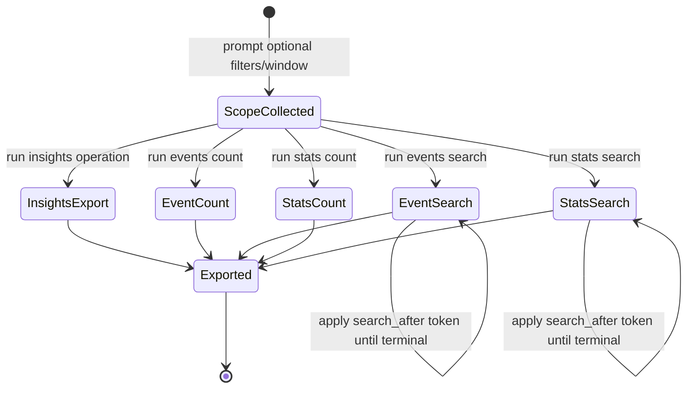

# Data Model: Org Marvis Client APIs Menu Set

## Overview

This feature introduces five menu-operation data flows:
1. Marvis Client Insights export
2. Marvis Client Events count
3. Marvis Client Events search (paginated)
4. Marvis Client Stats count
5. Marvis Client Stats search (paginated)

The model below defines request/response entities, validation rules, continuation semantics, and persistence identity expectations.

## Entities

### 1) QueryScopeInput

Operator-provided execution scope shared by all operations.

| Field | Type | Required | Notes |
| - | - | - | - |
| `org_id` | string | yes | Selected org context |
| `duration` | string | no | Validated duration/window input |
| `start_time` | string/int | no | Optional explicit start boundary |
| `end_time` | string/int | no | Optional explicit end boundary |
| `filters` | object | no | Endpoint-specific optional filters |

**Validation rules**
- `org_id` non-empty.
- `duration` must match accepted format when supplied.
- when both start/end exist, `start <= end`.

---

### 2) PaginationContinuationToken

Search-after token for events/stats search continuation.

| Field | Type | Required | Notes |
| - | - | - | - |
| `search_after` | string | no | API-provided continuation cursor |
| `page_number` | int | yes | Local traversal counter |
| `is_terminal` | bool | yes | True when no more pages |

**Validation rules**
- Accept blank token for first page.
- Reject malformed/expired token with actionable message.

---

### 3) MarvisClientInsightRecord

Org-level insight record from insights endpoint.

| Field | Type | Required | Notes |
| - | - | - | - |
| `org_id` | string | yes | Context join key |
| `client_mac` | string | no | Client identity if present |
| `site_id` | string | no | Site context |
| `insight_type` | string | no | Insight classification |
| `severity` | string | no | Priority/severity if present |
| `timestamp` | int/float | no | Event/observation time |
| `raw_payload` | object | no | Flattened/exported as needed |

**Persistence strategy**
- natural/composite key preserving uniqueness (prefer stable insight ID when provided; fallback composite with org/client/type/timestamp).

---

### 4) MarvisClientEventCountResult

Aggregated event count dataset.

| Field | Type | Required | Notes |
| - | - | - | - |
| `org_id` | string | yes | Context key |
| `window_start` | int/float/string | no | Effective execution start |
| `window_end` | int/float/string | no | Effective execution end |
| `group_key` | string | no | Aggregate grouping bucket |
| `count` | int | yes | Aggregate count |
| `filters_hash` | string | no | Deterministic scope identity |

**Persistence strategy**
- deterministic repeat-run update key, e.g. (`org_id`,`window_start`,`window_end`,`group_key`,`filters_hash`).

---

### 5) MarvisClientEventRecord

Detailed event-level search result.

| Field | Type | Required | Notes |
| - | - | - | - |
| `org_id` | string | yes | Context key |
| `event_id` | string | no | Stable event identity if available |
| `client_mac` | string | no | Client identity |
| `site_id` | string | no | Site context |
| `event_type` | string | no | Type/category |
| `timestamp` | int/float | no | Event timestamp |
| `page_number` | int | yes | Local traversal metadata |
| `raw_payload` | object | no | Flattened/exported payload |

**Persistence strategy**
- composite idempotent key for retry/page dedupe (prefer `event_id`; fallback org/client/type/timestamp).

---

### 6) MarvisClientStatsCountResult

Aggregated stats count dataset.

| Field | Type | Required | Notes |
| - | - | - | - |
| `org_id` | string | yes | Context key |
| `window_start` | int/float/string | no | Effective execution start |
| `window_end` | int/float/string | no | Effective execution end |
| `group_key` | string | no | Aggregate grouping bucket |
| `count` | int | yes | Aggregate count |
| `filters_hash` | string | no | Deterministic scope identity |

**Persistence strategy**
- deterministic repeat-run update key parallel to event count strategy.

---

### 7) MarvisClientStatsRecord

Detailed stats search result.

| Field | Type | Required | Notes |
| - | - | - | - |
| `org_id` | string | yes | Context key |
| `stat_id` | string | no | Stable record identity if available |
| `client_mac` | string | no | Client identity |
| `metric_name` | string | no | Metric/field name |
| `metric_value` | number/string | no | Value |
| `timestamp` | int/float | no | Observation timestamp |
| `page_number` | int | yes | Local traversal metadata |
| `raw_payload` | object | no | Flattened/exported payload |

**Persistence strategy**
- composite idempotent key including stable stat identity or fallback timestamp-based composite.

## Relationships

- `QueryScopeInput` applies to all five operations.
- `PaginationContinuationToken` used only by `MarvisClientEventRecord` and `MarvisClientStatsRecord` retrieval.
- Count entities provide triage baseline for corresponding search entities in same effective window.

## State Flow

## Error Model

| Error class | Trigger | Required behavior |
| - | - | - |
| Validation error | invalid duration/filter/token input | reject early, show corrective guidance, no API call |
| Continuation error | malformed/expired search-after token | fail safely, offer restart from first page |
| API failure | 4xx/5xx/network | actionable summary + logged context |
| Empty result set | valid query returns no records | treat as success with explicit empty summary |
| Output failure | CSV/SQLite write unavailable | fail with actionable message, preserve execution summary |
