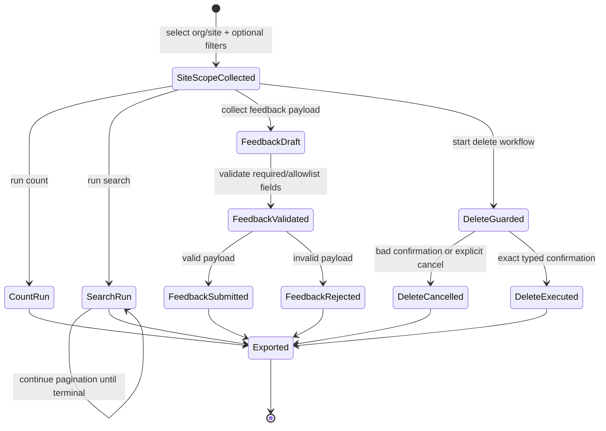

# Data Model: Site Marvis Config Actions Menu Set

## Overview

This feature introduces four site-scoped Marvis config action flows:
1. Config action count (safe)
2. Config action search (safe, paginated)
3. Config action feedback submission (mutating)
4. Config action delete (destructive)

The model below defines request/response entities, validation rules, and persistence identity requirements for deterministic exports.

## Entities

### 1) SiteQueryScopeInput

Shared site-scoped input for count/search operations.

| Field | Type | Required | Notes |
| - | - | - | - |
| `org_id` | string | yes | Organization context for site lookup/use |
| `site_id` | string | yes | Selected site scope |
| `duration` | string | no | Optional validated time window shorthand |
| `start_time` | string/int | no | Optional explicit start boundary |
| `end_time` | string/int | no | Optional explicit end boundary |
| `filters` | object | no | Endpoint-specific optional filters |

**Validation rules**
- `org_id` and `site_id` must be non-empty.
- if both start/end are set, `start <= end`.
- `duration` must match accepted format when provided.

---

### 2) SiteConfigActionCountResult

Aggregate count payload for selected site and filter scope.

| Field | Type | Required | Notes |
| - | - | - | - |
| `org_id` | string | yes | Context key |
| `site_id` | string | yes | Context key |
| `window_start` | int/float/string | no | Effective window start |
| `window_end` | int/float/string | no | Effective window end |
| `group_key` | string | no | Aggregate grouping bucket when present |
| `count` | int | yes | Total or grouped count |
| `filters_hash` | string | no | Deterministic scope identity |

**Persistence strategy**
- deterministic scope key: (`site_id`,`window_start`,`window_end`,`group_key`,`filters_hash`).

---

### 3) SiteConfigActionRecord

Detailed config action record returned by search.

| Field | Type | Required | Notes |
| - | - | - | - |
| `org_id` | string | yes | Context key |
| `site_id` | string | yes | Context key |
| `action_id` | string | yes/no | Preferred stable identity when present |
| `action_type` | string | no | Action category/type |
| `status` | string | no | Current action status |
| `severity` | string | no | Priority/severity if available |
| `created_time` | int/float | no | Creation timestamp |
| `updated_time` | int/float | no | Last update timestamp |
| `page_number` | int | yes | Local pagination metadata |
| `raw_payload` | object | no | Flattened/exported payload |

**Persistence strategy**
- idempotent detail key:
  - preferred: (`site_id`,`action_id`)
  - fallback: (`site_id`,`action_type`,`status`,`created_time`,`updated_time`).

---

### 4) FeedbackSubmissionPayload

Validated mutating payload for feedback submission.

| Field | Type | Required | Notes |
| - | - | - | - |
| `org_id` | string | yes | Context key |
| `site_id` | string | yes | Context key |
| `action_id` | string | yes | Target config action |
| `feedback_type` | string | yes | Allowed value from endpoint contract |
| `feedback_value` | string/int/bool | yes | Value matching feedback type |
| `comment` | string | no | Optional bounded free-text |
| `actor` | string | no | Optional operator/user identifier |

**Validation rules**
- `action_id` non-empty and format-valid.
- `feedback_type` must be allowlisted.
- `feedback_value` must match expected type/range for selected feedback type.
- `comment` length and character set bounded.

---

### 5) FeedbackSubmissionResult

Result envelope for successful/failed feedback mutation.

| Field | Type | Required | Notes |
| - | - | - | - |
| `org_id` | string | yes | Context key |
| `site_id` | string | yes | Context key |
| `action_id` | string | yes | Target identity |
| `request_id` | string | no | API/request correlation ID |
| `status` | string | yes | success/rejected/failed |
| `submitted_at` | int/float/string | yes | Execution timestamp |
| `message` | string | no | User-facing result summary |

**Persistence strategy**
- operation audit key: (`site_id`,`action_id`,`submitted_at`).

---

### 6) DeleteRequestContext

Guarded destructive request context for deletion.

| Field | Type | Required | Notes |
| - | - | - | - |
| `org_id` | string | yes | Context key |
| `site_id` | string | yes | Context key |
| `action_id` | string | yes | Target action identity |
| `warning_shown` | bool | yes | Set after warning banner shown |
| `typed_confirmation` | string | yes | Exact operator confirmation entry |
| `confirmation_expected` | string | yes | Required exact phrase |

**Validation rules**
- no delete API call unless `warning_shown == true` and `typed_confirmation == confirmation_expected`.

---

### 7) DeleteExecutionResult

Destructive action execution/audit result.

| Field | Type | Required | Notes |
| - | - | - | - |
| `org_id` | string | yes | Context key |
| `site_id` | string | yes | Context key |
| `action_id` | string | yes | Target identity |
| `status` | string | yes | cancelled/rejected/success/failed |
| `executed` | bool | yes | True only when API call was attempted |
| `executed_at` | int/float/string | no | Timestamp if executed |
| `message` | string | no | User-facing summary |

**Persistence strategy**
- destructive audit key: (`site_id`,`action_id`,`status`,`executed_at`).

## Relationships

- `SiteQueryScopeInput` drives `SiteConfigActionCountResult` and `SiteConfigActionRecord` retrieval.
- `FeedbackSubmissionPayload` targets a specific `SiteConfigActionRecord` (`action_id`).
- `DeleteRequestContext` and `DeleteExecutionResult` always target one `action_id` in one `site_id`.
- `SiteConfigActionRecord` is authoritative target source for feedback/delete follow-on flows.

## State Flow

## Error Model

| Error class | Trigger | Required behavior |
| - | - | - |
| Validation error | invalid site/action/feedback input | reject early, show corrective guidance, no mutating/destructive call |
| Pagination error | malformed continuation data or page failure | fail safely with resumable guidance |
| API failure | 4xx/5xx/network/rate limit | actionable summary + logged context |
| Empty result set | valid search returns no actions | treat as success with explicit empty summary |
| Guard failure | typed confirmation mismatch | cancellation path, no delete call |
| Output failure | CSV/SQLite/polyglot write unavailable | fail with actionable message, preserve execution summary |
