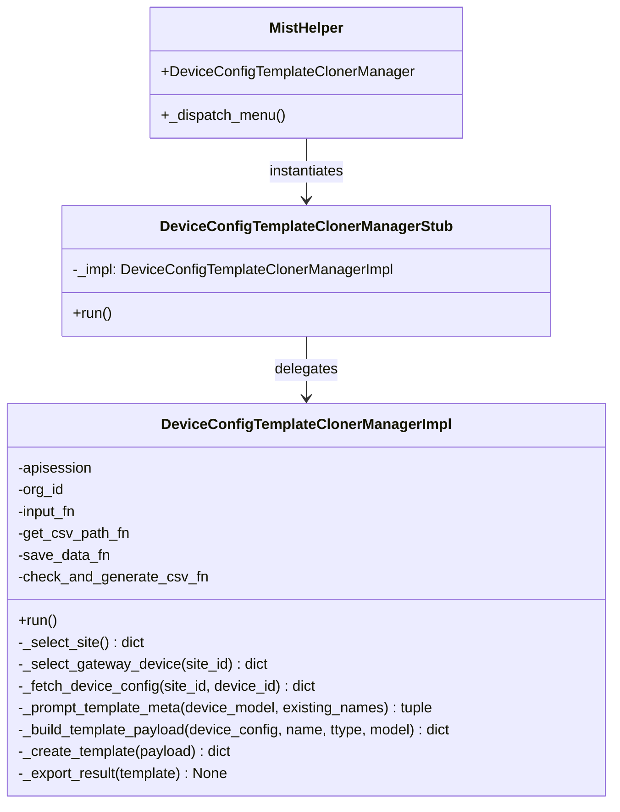
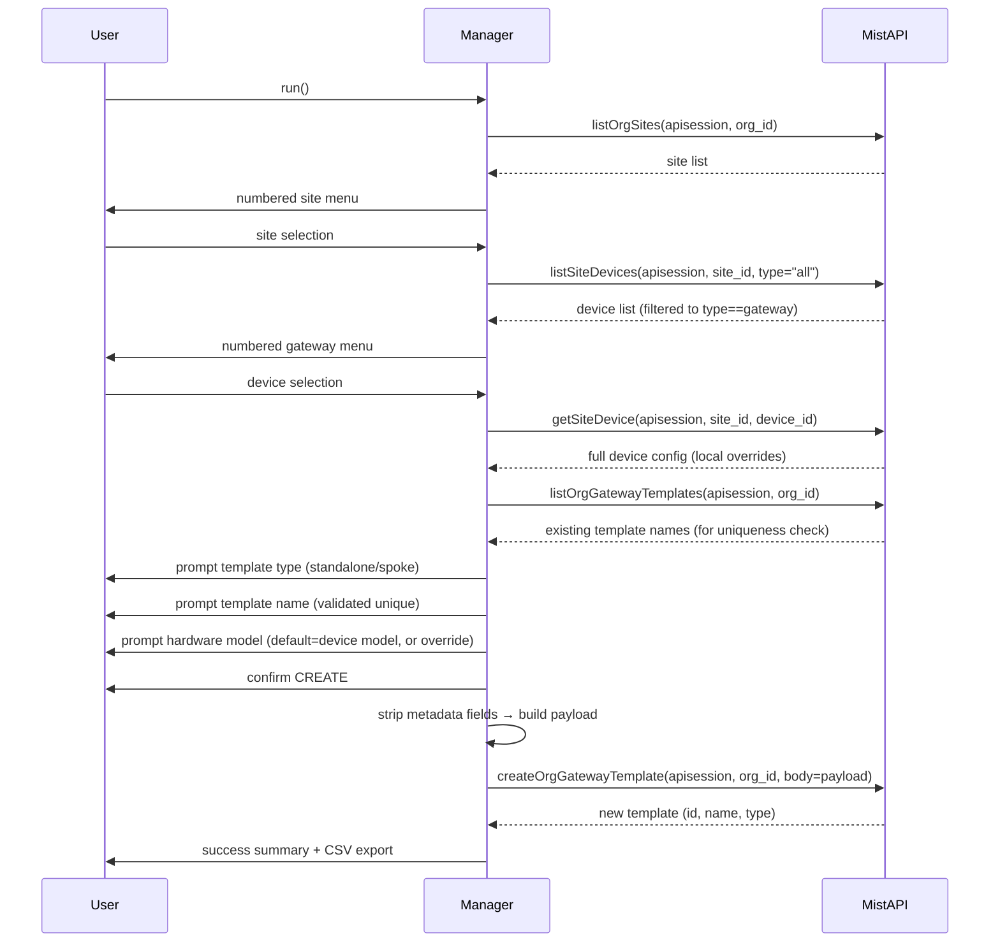

# Implementation Plan: Menu 194 — Clone Device Config to New Gateway Template

**Branch**: `feat/168-clone-gateway-template` | **Date**: 2026-06-08 | **Spec**: [spec.md](spec.md)  
**Input**: Feature specification from `specs/168-clone-gateway-template/spec.md`

---

## Summary

Add Menu 194 to MistHelper that lets a NOC engineer pick a gateway device at a site, strip device-specific metadata from its local config, and create a new org-level gateway template from the retained config fields. The source is always the device's live local config (not an existing template). Implementation follows the established extracted-class pattern: `DeviceConfigTemplateClonerManager` lives in `src/gateway/device_template_cloner.py`; a same-name delegation stub in `MistHelper.py` forwards calls to it.

---

## Technical Context

**Language/Version**: Python 3.13+  
**Primary Dependencies**: mistapi 0.59+, standard library only  
**Storage**: CSV output via existing `check_and_generate_csv_fn` helper; no DB schema changes  
**Testing**: pytest + Hypothesis (existing suite)  
**Target Platform**: Container (Podman/Docker), Linux  
**Project Type**: CLI menu tool  
**Performance Goals**: Single API sequence; no bulk operations  
**Constraints**: No new third-party dependencies; must pass all existing quality gates  
**Scale/Scope**: Single menu operation; 4–5 API calls per run

---

## Constitution Check

| Gate | Status | Notes |
| - | - | - |
| Five-Item Rule (max 5 params per function) | PASS | All functions use injected deps object or split params |
| Five-Item Rule (max 25 lines per function) | PASS | Each logical step extracted into helper method |
| Class-based design (no wrappers) | PASS | `DeviceConfigTemplateClonerManager` in `src/`; delegation stub in `MistHelper.py` |
| safe_input() for all `input()` calls | PASS | All prompts go through injected `input_fn` |
| Inline comments on every executable line | PASS | Required — enforced at review |
| Action logging before/after every operation | PASS | Required — enforced at review |
| ASCII-only log output | PASS | No Unicode in log strings |
| No new dependencies | PASS | mistapi already present |
| Destructive confirmation ("CREATE") | PASS | Uppercase confirmation required before API write |
| PK strategy defined before implementation | PASS | See Data Model section |

---

## Project Structure

### Documentation (this feature)

```text
specs/168-clone-gateway-template/
├── spec.md              # Feature specification
├── plan.md              # This file
├── research.md          # Phase 0 research notes
├── data-model.md        # Phase 1 data model
└── tasks.md             # Phase 2 task list (/speckit.tasks output)
```

### Source Code Changes

```text
src/
└── gateway/
    └── device_template_cloner.py   # NEW — extracted implementation

MistHelper.py                       # MODIFY — delegation stub + menu entry + PK strategy
README.md                           # MODIFY — operation count 161 → 162, menu 194 row
CHANGELOG.md                        # MODIFY — version 26.06.08 entry
```

---

## Architecture

### Class Relationships



### Module Location

`src/gateway/device_template_cloner.py` — follows the pattern established by other extracted managers (e.g., `src/firmware/`, `src/ssh/`). If `src/gateway/` does not yet exist it must be created with an `__init__.py`.

---

## API Call Sequence



---

## Data Transformation

### Strip / Keep Strategy

The device config returned by `getSiteDevice` is a flat JSON object. Transformation is a single dict comprehension — keep only the fields in the KEEP list.

**STRIP** (device-specific metadata — never goes into a template):
```text
id, mac, serial, model, site_id, org_id, map_id, x, y, orientation,
last_seen, uptime, status, connected, version, ip, ext_ip, ips,
ip_stat, template_id, gateway_template_id, name, notes,
image1_url, image2_url, image3_url, created_time, modified_time,
if_stat, port_stat, service_stat
```

**KEEP** (config fields that form the template body):
```text
additional_config_cmds, bgp_config, dhcpd_config, dns_servers,
dns_suffix, dnsOverride, extra_routes, extra_routes6, idp_profiles,
ip_configs, networks, ntp_servers, ntpOverride, oob_ip_config,
ospf_config, path_preferences, port_config, routing_policies,
service_policies, tunnel_configs, tunnel_provider_options,
vrf_config, vrf_instances
```

### Payload Structure

```python
payload = {
    "name": user_provided_name,           # validated non-empty, unique in org
    "type": "standalone" or "spoke",      # from prompt
    "gateway_matching": {
        "enable": True,
        "rules": [{"match_model": target_model}],  # device model or user override
    },
    # all KEEP fields from device config that are present and non-None
}
```

Empty/None fields from the device config are omitted from the payload to avoid sending null overrides.

### Implementation Pattern

```python
STRIP_FIELDS = frozenset({...})  # module-level constant

def _build_template_payload(self, device_config, name, ttype, model):
    kept = {k: v for k, v in device_config.items()
            if k not in STRIP_FIELDS and v is not None}  # keep non-null config fields only
    return {
        "name": name,
        "type": ttype,
        "gateway_matching": {"enable": True, "rules": [{"match_model": model}]},
        **kept,
    }
```

---

## Error Handling Strategy

| Scenario | Handling |
| - | - |
| `listOrgSites` returns empty list | Print "No sites found" and return early |
| `listSiteDevices` returns no gateways | Print "No gateway devices at this site" and return early |
| `getSiteDevice` API error | Log error with site_id and device_id; print user-friendly message; return early |
| Template name already exists in org | Re-prompt user for a new name (loop, do not crash) |
| User does not type "CREATE" | Print "Operation cancelled" and return early |
| `createOrgGatewayTemplate` API error | Log full response; print error details to user; return early (no partial state to roll back) |
| `listOrgGatewayTemplates` fails | Log warning; skip uniqueness check with a user warning; allow creation to proceed |

All API calls wrapped in try/except with `logging.error("...", exc_info=True)` on failure.

---

## Primary Key Strategy

Entry to add to `ENDPOINT_PRIMARY_KEY_STRATEGIES` in `MistHelper.py`:

```python
'createOrgGatewayTemplate': {
    'type': 'natural_pk',
    'primary_key': ['id'],
    'indexes': ['org_id', 'name', 'type'],
},
```

---

## Files to Create / Modify

### 1. CREATE `src/gateway/device_template_cloner.py`

New file. Contains:
- `STRIP_FIELDS: frozenset` — module-level constant, list of metadata keys to remove
- `KEEP_FIELDS: frozenset` — module-level constant, list of config keys to retain (documentation/validation aid)
- `DeviceConfigTemplateClonerManager` class with `__init__` and `run()` public method
- Private helpers: `_select_site`, `_select_gateway_device`, `_fetch_device_config`, `_prompt_template_meta`, `_build_template_payload`, `_create_template`, `_export_result`

If `src/gateway/__init__.py` does not exist, create it (empty, with module docstring).

### 2. MODIFY `MistHelper.py`

Three changes:

**a) PK strategy entry** — add to `ENDPOINT_PRIMARY_KEY_STRATEGIES` dict (near line 1672, alphabetical order within the `orgs.gatewaytemplates` group):
```python
'createOrgGatewayTemplate': {
    'type': 'natural_pk',
    'primary_key': ['id'],
    'indexes': ['org_id', 'name', 'type'],
},
```

**b) Delegation stub class** — add new class near other gateway-related stubs (search for `GatewayTemplate` to find insertion point):
```python
class DeviceConfigTemplateClonerManager:
    """Delegation stub — forwards all calls to the extracted implementation."""
    def __init__(self, apisession, org_id, input_fn, get_csv_path_fn, save_data_fn, check_and_generate_csv_fn):
        from src.gateway.device_template_cloner import DeviceConfigTemplateClonerManager as _Impl
        self._impl = _Impl(apisession, org_id, input_fn, get_csv_path_fn, save_data_fn, check_and_generate_csv_fn)
    def run(self):
        return self._impl.run()
```

**c) Menu 194 dispatcher entry** — add to the menu dispatch dict:
```python
194: lambda: DeviceConfigTemplateClonerManager(
    apisession, org_id, safe_input, get_csv_path, save_data, check_and_generate_csv
).run(),
```

### 3. MODIFY `README.md`

- Update operation count: `161` → `162` (appears in title line and architecture section)
- Add row in the menu table for Menu 194:
  ```markdown
  | 194 | Clone Device Config to New Gateway Template | Safe |
  ```

### 4. MODIFY `CHANGELOG.md`

Add at the top of the changelog under `## Unreleased` (or new version block):
```markdown
### Added
- Menu 194: Clone Device Config to New Gateway Template — select a gateway device at a site, strip device metadata, and create an org-level gateway template from the device's local config.
```

---

## Testing Approach

### Unit Tests (`tests/unit/test_device_template_cloner.py`)

| Test | Description |
| - | - |
| `test_strip_fields_removed` | Assert all STRIP_FIELDS keys absent from `_build_template_payload` output |
| `test_keep_fields_preserved` | Assert KEEP_FIELDS present in output when non-None in input |
| `test_none_values_omitted` | Assert keys with None values are excluded from payload |
| `test_gateway_matching_structure` | Assert `gateway_matching.rules[0].match_model` equals provided model |
| `test_name_uniqueness_reprompt` | Mock `listOrgGatewayTemplates` returning a name; assert re-prompt occurs |
| `test_cancel_on_wrong_confirmation` | Assert early return when user types anything other than "CREATE" |
| `test_empty_site_list_returns_early` | Assert `run()` exits cleanly when no sites returned |
| `test_empty_gateway_list_returns_early` | Assert `run()` exits cleanly when no gateways at site |

### Integration Test (`tests/integration/test_device_template_cloner_integration.py`)

- Mock all five `mistapi` calls with realistic fixtures
- Assert full flow completes: site selection → device selection → config fetch → template creation → CSV export
- Assert `createOrgGatewayTemplate` called exactly once with correct payload shape

### Property Test (Hypothesis)

```python
@given(st.dictionaries(st.text(), st.one_of(st.none(), st.text(), st.integers())))
def test_build_payload_never_leaks_strip_fields(device_config):
    # inject known STRIP_FIELDS values, assert none appear in output
```

---

## Dependency Injection Signatures

```python
# src/gateway/device_template_cloner.py
class DeviceConfigTemplateClonerManager:
    def __init__(
        self,
        apisession,           # authenticated mistapi session
        org_id: str,          # Mist org UUID
        input_fn,             # callable(prompt, context) -> str  (safe_input)
        get_csv_path_fn,      # callable(filename) -> Path
        save_data_fn,         # callable(data, path) -> None
        check_and_generate_csv_fn,  # callable(data, fname, api_fn_name) -> None
    ): ...
```

---

## Phase 0 Research Questions

The following are resolved inline (no external research needed):

1. **`getSiteDevice` vs `getGatewayTemplate`** — Confirmed: source is always the device's live local config; `getSiteDevice` is the correct call.
2. **`gateway_matching.rules` schema** — From Mist API docs: `rules` is a list of objects; each object may contain `match_model` (string). At least one rule required when `enable=True`.
3. **Template `type` field values** — Confirmed: `"standalone"` and `"spoke"` are the valid enum values.
4. **Payload field overlap** — Fields returned by `getSiteDevice` that are also valid template fields are kept; device-specific fields are stripped using the explicit STRIP list rather than an allowlist to avoid accidentally dropping new config fields added in future API versions. *(Decision: use STRIP list, not KEEP allowlist, for forward compatibility.)*

---

## Open Questions / Risks

| Item | Risk | Mitigation |
| - | - | - |
| New config fields added to future Mist API versions | Strip list may miss new metadata fields | Log a warning if any unknown top-level key is neither in STRIP nor KEEP at runtime |
| Device with no local config overrides (all defaults) | Payload may be nearly empty but valid | Acceptable — Mist will create a minimal template |
| Site with many devices (>50 gateways) | Numbered list becomes unwieldy | Out of scope; consistent with existing patterns |
| `src/gateway/` package doesn't exist yet | Import error at startup | Create `src/gateway/__init__.py` as part of this feature |
