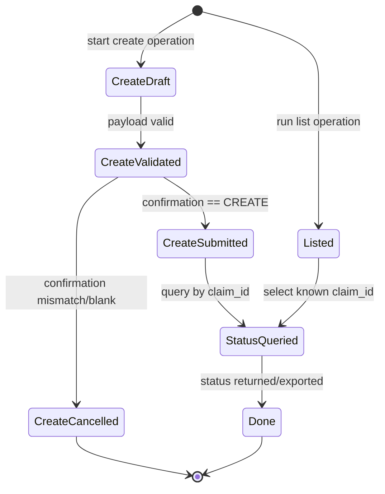

# Data Model: Org Async Claim Menu Operations

## Overview

This feature introduces three operational data flows in MistHelper:
1. list async claims (read/export)
2. create async claim (write/destructive)
3. fetch async claim status by ID (read/export)

The models below define runtime payloads, validation rules, and persistence identity expectations.

## Entities

### 1) OrgAsyncClaimRecord

Represents one claim object returned by list API.

| Field | Type | Required | Source | Notes |
| - | - | - | - | - |
| `org_id` | string | yes | context | selected/cached org context |
| `claim_id` | string | preferred | API | stable claim identifier if exposed |
| `status` | string | no | API | lifecycle state (`prepared`,`ongoing`,`done`, etc.) |
| `scheduled_at` | integer | no | API | epoch seconds |
| `processed` | integer | no | API | number processed |
| `succeed` | integer | no | API | number succeeded |
| `failed` | integer | no | API | number failed |
| `timestamp` | number | no | API | response timestamp |
| `raw_payload` | object | no | normalized | flattened during export pipeline |

**Validation rules**
- `org_id` must be non-empty.
- Record list may be empty (valid outcome).
- Unknown fields are preserved through flattening.

**Persistence strategy**
- Preferred natural key: `claim_id` (with `org_id` index).
- Fallback composite if `claim_id` absent: (`org_id`, `scheduled_at`, `timestamp`).

---

### 2) OrgAsyncClaimCreateRequest

Operator-provided input used to submit create operation.

| Field | Type | Required | Source | Notes |
| - | - | - | - | - |
| `org_id` | string | yes | context | selected/cached org |
| `claim_payload` | object/string | yes | prompt | exact shape depends on endpoint requirements |
| `confirmation_text` | string | yes | prompt | must equal `CREATE` |

**Validation rules**
- `org_id` required.
- `claim_payload` must be non-empty and parseable to endpoint-compatible structure.
- `confirmation_text == "CREATE"` is mandatory gate.

**State transitions**
- `draft` → `validated` → `confirmed` → `submitted`
- Any failure returns to `cancelled` (no API call if pre-submit failure).

---

### 3) OrgAsyncClaimCreateResponse

Represents API response from create operation.

| Field | Type | Required | Source | Notes |
| - | - | - | - | - |
| `org_id` | string | yes | context | request org |
| `claim_id` | string | preferred | API | newly created async claim identifier |
| `status` | string | no | API | initial async status |
| `submitted_at` | integer/number | no | API | submission timestamp |
| `detail` | object | no | API | endpoint-specific metadata |

**Persistence strategy**
- Natural key: `claim_id` when available.
- Fallback composite: (`org_id`, `submitted_at`, `status`).

---

### 4) OrgAsyncClaimStatusRequest

Operator request to fetch claim status by claim ID.

| Field | Type | Required | Source | Notes |
| - | - | - | - | - |
| `org_id` | string | yes | context | selected/cached org |
| `claim_id` | string | yes | prompt | must be non-empty trimmed string |
| `detail` | boolean | no | prompt/constant | optional detail expansion if endpoint supports |

**Validation rules**
- `claim_id` cannot be empty/whitespace.
- Reject malformed IDs using conservative syntax check if known.

---

### 5) OrgAsyncClaimStatusRecord

Status response payload for a claim.

| Field | Type | Required | Source | Notes |
| - | - | - | - | - |
| `org_id` | string | yes | context | request org |
| `claim_id` | string | yes | request | input claim id |
| `status` | string | no | API | processing state |
| `completed` | array[string] | no | API | completed claim items |
| `incompleted` | array[string] | no | API | pending items |
| `details` | array[object] | no | API | per-device detail records |
| `processed` | integer | no | API | processed count |
| `succeed` | integer | no | API | success count |
| `failed` | integer | no | API | failed count |
| `total` | integer | no | API | total item count |
| `timestamp` | number | no | API | status timestamp |

**Persistence strategy**
- Composite key: (`org_id`, `claim_id`, `timestamp`) to preserve timeline snapshots.

## Relationships

- `OrgAsyncClaimCreateRequest` produces one `OrgAsyncClaimCreateResponse`.
- `OrgAsyncClaimCreateResponse.claim_id` feeds `OrgAsyncClaimStatusRequest.claim_id`.
- `OrgAsyncClaimRecord.claim_id` can also feed `OrgAsyncClaimStatusRequest.claim_id`.

## Operational State Machine

## Error Model

| Error class | Trigger | Expected behavior |
| - | - | - |
| Validation error | empty claim ID / invalid payload | print actionable message; no API call |
| Permission error | 401/403 from Mist API | show permission guidance; operation exits cleanly |
| Not found | invalid claim ID / 404 | user-facing not-found response; no crash |
| Rate limit | 429 | log + user message; no infinite retry loop |
| Transport/API exception | network/session failures | catch exception; log error context; continue process safely |
