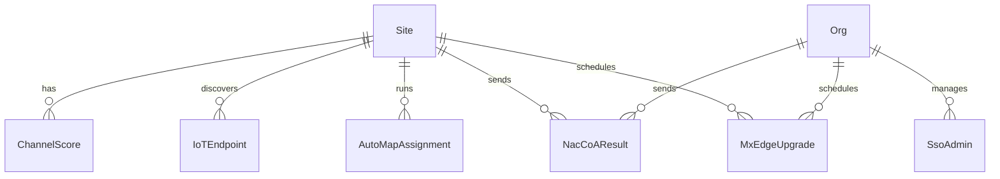

# Data Model: Upstream New Endpoints

**Feature**: upstream-new-endpoints | **Date**: 2026-06-11

## Entities

### ChannelScore

| Field | Type | Source | Notes |
| - | - | - | - |
| ap_mac | string | API | AP MAC address (PK component) |
| band | string | API | RF band: 24, 5, or 6 (PK component) |
| channel | int | API | Channel number (PK component) |
| score | float | API | Channel quality score |
| ap_name | string | API (joined) | AP hostname for human readability |
| site_id | string | context | Site UUID from user selection |

**PK Strategy**: `composite_pk` on `['ap_mac', 'band', 'channel']`

### IoTEndpoint

| Field | Type | Source | Notes |
| - | - | - | - |
| mac | string | API | Endpoint MAC (PK) |
| type | string | API | BLE, Zigbee, etc. |
| name | string | API | Endpoint name |
| last_seen | int | API | Unix timestamp of last discovery |
| site_id | string | context | Site UUID |

**PK Strategy**: `natural_pk` on `['mac']`

### NacCoAResult

| Field | Type | Source | Notes |
| - | - | - | - |
| client_mac | string | input | Target client MAC |
| status | string | API response | Success/failure |
| scope | string | context | "org" or "site" |
| timestamp | string | runtime | ISO 8601 execution time |

**PK Strategy**: `auto_increment_with_unique` (action result, not persistent entity)

### AutoMapAssignment

| Field | Type | Source | Notes |
| - | - | - | - |
| site_id | string | context | Site UUID |
| status | string | API | pending/completed/failed |
| results | list | API | Proposed AP-to-map assignments |

**PK Strategy**: `auto_increment_with_unique` (job status, not persistent entity)

### SsoAdmin

| Field | Type | Source | Notes |
| - | - | - | - |
| admin_id | string | API | Admin UUID |
| name | string | API | Admin display name |
| email | string | API | Admin email |
| sso_id | string | API | SSO provider UUID |
| role | string | API | Admin role |

**PK Strategy**: N/A (used for selection display only; deletion result uses `auto_increment_with_unique`)

### MxEdgeUpgrade

| Field | Type | Source | Notes |
| - | - | - | - |
| id | string | API | Upgrade job UUID (PK) |
| status | string | API | pending/in_progress/completed/failed/cancelled |
| mxedge_ids | list | API | Target MxEdge UUIDs |
| target_version | string | API | Target firmware version |
| created_time | int | API | Job creation timestamp |

**PK Strategy**: `natural_pk` on `['id']`

## Relationships

## Validation Rules

- **client_mac**: Must match MAC address pattern `[0-9a-fA-F]{12}` or `[0-9a-fA-F]{2}(:[0-9a-fA-F]{2}){5}`. Reject empty input.
- **band**: Must be one of `24`, `5`, `6`. Validate before API call.
- **Destructive confirmation**: SSO admin deletion requires exact string `DELETE`. MxEdge upgrade requires exact string `UPGRADE`.
- **site_id / org_id / sso_id**: Must be valid UUIDs from prior selection steps. Never accept raw user input for these.
