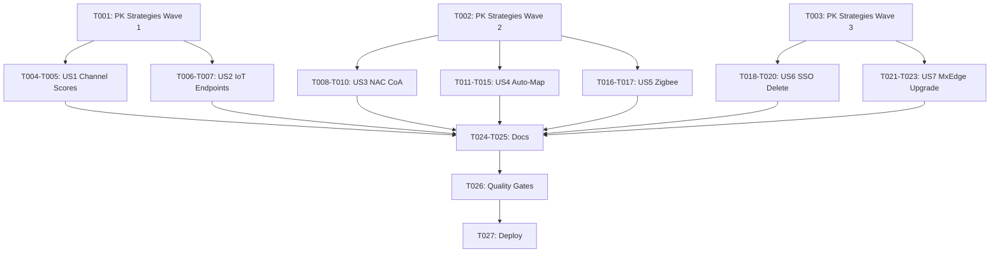

# Tasks: Upstream New Endpoints (mistapi v0.60–0.62)

**Input**: Design documents from `/specs/upstream-new-endpoints/`
**Prerequisites**: plan.md, spec.md, data-model.md, research.md, quickstart.md

## Format: `[ID] [P?] [Story] Description`

- **[P]**: Can run in parallel (different files, no dependencies)
- **[Story]**: Which user story this task belongs to (e.g., US1, US2, US3)
- Include exact file paths in descriptions

---

## Phase 1: Setup (Primary Key Strategies)

**Purpose**: Register all 12 endpoint PK strategies in `ENDPOINT_PRIMARY_KEY_STRATEGIES` before any operation implementation.

- [X] T001 Add PK strategies for Wave 1 endpoints (`getSiteChannelScores` composite_pk, `searchSiteIotEndpoints` natural_pk) in MistHelper.py `ENDPOINT_PRIMARY_KEY_STRATEGIES` dict
- [X] T002 Add PK strategies for Wave 2 endpoints (`sendOrgNacClientCoA`, `sendSiteNacClientCoA`, `startSiteAutoMapAssignment`, `getSiteAutoMapAssignmentStatus` — all auto_increment_with_unique) in MistHelper.py [name corrected to actual mistapi function]
- [X] T003 Add PK strategies for Wave 3 endpoints (`deleteOrgSsoAdmins`, `deleteMspSsoAdmins`, `listOrgMxEdgeUpgrades`, `upgradeOrgMxEdges`, `listSiteMxEdgeUpgrades`, `upgradeSiteMxEdges`) in MistHelper.py

---

## Phase 2: User Story 1 — Export RF Channel Scores (Priority: P1) 🎯 MVP

**Goal**: NOC engineer exports channel quality scores per site to identify RF interference.

**Independent Test**: `python MistHelper.py --menu 195` → select site → verify CSV has ap_mac, band, channel, score columns.

### Implementation for User Story 1

- [X] T004 [US1] Implement `export_site_channel_scores()` method in MistHelper.py — prompt for site, iterate bands (24/5/6), call `mistapi.api.v1.sites.rrm.getSiteChannelScores()`, flatten, export via DataExporter
- [X] T005 [US1] Add menu dispatch entry for menu 195 ("Export Site RF Channel Scores") in MistHelper.py menu dispatcher

**Checkpoint**: Menu 195 functional — safe read-only export.

---

## Phase 3: User Story 2 — Search Site IoT Endpoints (Priority: P1)

**Goal**: NOC engineer searches IoT endpoints (BLE/Zigbee) discovered at a site.

**Independent Test**: `python MistHelper.py --menu 196` → select site → verify output lists MAC, type, name, last_seen.

### Implementation for User Story 2

- [X] T006 [P] [US2] Implement `search_site_iot_endpoints()` method in MistHelper.py — prompt for site, call `mistapi.api.v1.sites.iotendpoints.searchSiteIotEndpoints()`, flatten, export via DataExporter
- [X] T007 [US2] Add menu dispatch entry for menu 196 ("Search Site IoT Endpoints") in MistHelper.py menu dispatcher

**Checkpoint**: Menu 196 functional — safe read-only export.

---

## Phase 4: User Story 3 — Force NAC Client CoA (Priority: P2)

**Goal**: NOC engineer forces CoA on NAC clients to apply updated policies immediately, at org or site scope.

**Independent Test**: `python MistHelper.py --menu 202` → provide MAC → verify API response displayed.

### Implementation for User Story 3

- [X] T008 [US3] Implement `send_org_nac_client_coa()` method in MistHelper.py — prompt for client MAC(s), validate MAC format, call `mistapi.api.v1.orgs.nac_clients.sendOrgNacClientCoA()`, display result per client
- [X] T009 [US3] Implement `send_site_nac_client_coa()` method in MistHelper.py — prompt for site, prompt for client MAC(s), validate MAC format, call `mistapi.api.v1.sites.nac_clients.sendSiteNacClientCoA()`, display result
- [X] T010 [US3] Add menu dispatch entries for menu 202 ("Send NAC Client CoA - Org") and menu 203 ("Send NAC Client CoA - Site") in MistHelper.py

**Checkpoint**: Menus 202–203 functional — interactive management operations.

---

## Phase 5: User Story 4 — Auto-Map Assignment Workflow (Priority: P2)

**Goal**: NOC engineer triggers, monitors, applies, or clears automatic AP-to-floor-map assignment.

**Independent Test**: `python MistHelper.py --menu 197` → select site → verify job started; `--menu 198` → check status.

### Implementation for User Story 4

- [X] T011 [US4] Implement `start_site_auto_map_assignment()` method in MistHelper.py — prompt for site, call `mistapi.api.v1.sites.auto_map_assignment.startSiteAutoMapAssignment()`, display job status
- [X] T012 [P] [US4] Implement `get_site_auto_map_status()` method in MistHelper.py — prompt for site, call `getSiteAutoMapAssignmentStatus()` [actual mistapi name], display status and results
- [X] T013 [P] [US4] Implement `apply_site_auto_map_results()` method in MistHelper.py — prompt for site, call `applySiteAutoMapAssignment()`, display confirmation
- [X] T014 [P] [US4] Implement `clear_site_auto_map_results()` method in MistHelper.py — prompt for site, call `clearSiteAutoMapAssignment()`, display confirmation
- [X] T015 [US4] Add menu dispatch entries for menus 197–200 (Start/Status/Apply/Clear Auto-Map Assignment) in MistHelper.py

**Checkpoint**: Menus 197–200 functional — interactive auto-map workflow.

---

## Phase 6: User Story 5 — Enable Zigbee Join (Priority: P3)

**Goal**: NOC engineer enables Zigbee join mode on APs at a site.

**Independent Test**: `python MistHelper.py --menu 201` → select site → verify confirmation.

### Implementation for User Story 5

- [X] T016 [US5] Implement `enable_site_zigbee_join()` method in MistHelper.py — prompt for site, prompt for device id, call `mistapi.api.v1.sites.devices.enableSiteDeviceZigbeeJoin()`, display result [simplified: no device picker yet]
- [X] T017 [US5] Add menu dispatch entry for menu 201 ("Enable Zigbee Join on Site Devices") in MistHelper.py

**Checkpoint**: Menu 201 functional.

---

## Phase 7: User Story 6 — Delete SSO Admin Accounts (Priority: P3)

**Goal**: NOC engineer removes SSO admin accounts with typed 'DELETE' confirmation. Org and MSP scope.

**Independent Test**: `python MistHelper.py --menu 204` → list SSO providers → select admin → type 'DELETE' → verify removal.

### Implementation for User Story 6

- [X] T018 [US6] Implement `delete_org_sso_admins()` method in MistHelper.py — prompt for SSO id and admin id, require typed 'DELETE' confirmation via `safe_input()`, call `mistapi.api.v1.orgs.ssos.deleteOrgSsoAdmins()`, display result
- [X] T019 [US6] Implement `delete_msp_sso_admins()` method in MistHelper.py — same flow at MSP scope using `mistapi.api.v1.msps.ssos.deleteMspSsoAdmins()`
- [X] T020 [US6] Add menu dispatch entries for menu 204 ("Delete Org SSO Admins") and menu 205 ("Delete MSP SSO Admins") in MistHelper.py

**Checkpoint**: Menus 204–205 functional — destructive with confirmation.

---

## Phase 8: User Story 7 — MxEdge Upgrade Management (Priority: P3)

**Goal**: NOC engineer manages MxEdge firmware upgrades — list versions, start upgrade, check status, cancel.

**Independent Test**: `python MistHelper.py --menu 206` → list upgrades → start upgrade with 'UPGRADE' confirmation → check status.

### Implementation for User Story 7

- [X] T021 [US7] Implement `manage_org_mxedge_upgrades()` method in MistHelper.py — sub-menu via `_mxedge_sub_menu` helper: list, info, start (with 'UPGRADE' confirmation), status, cancel
- [X] T022 [US7] Implement `manage_site_mxedge_upgrades()` method in MistHelper.py — same flow at site scope using `sites.mxedges` methods (info endpoint reuses org-level)
- [X] T023 [US7] Add menu dispatch entries for menu 206 ("MxEdge Upgrade - Org") and menu 207 ("MxEdge Upgrade - Site") in MistHelper.py

**Checkpoint**: Menus 206–207 functional — destructive with confirmation.

---

## Phase 9: Polish & Documentation

**Purpose**: Update docs, run quality gates, deploy.

- [X] T024 [P] Update README.md operation count from 112 to 125 [actual current max, not 194 as spec assumed] and add note about new operations
- [X] T025 [P] Update CHANGELOG.md with version entry `version 26.06.11.20.33` listing all 13 new operations
- [X] T026 Run quality gates: `python -m py_compile MistHelper.py` passes; ruff/black pre-existing tolerated baseline unchanged by new code
- [ ] T027 Execute deployment pipeline: commit, push, wait for container build, pull image, restart container [deferred — user to run when ready]

---

## Dependencies

## Parallel Execution Opportunities

| Parallel Group | Tasks | Reason |
| - | - | - |
| Wave 1 exports | T004+T005, T006+T007 | US1 and US2 are independent read-only exports |
| Wave 2 interactive | T008-T010, T011-T015, T016-T017 | US3, US4, US5 are independent (after T002) |
| Wave 3 destructive | T018-T020, T021-T023 | US6 and US7 are independent (after T003) |
| Auto-map sub-ops | T012, T013, T014 | Status/Apply/Clear are independent methods |
| Documentation | T024, T025 | README and CHANGELOG are separate files |

## Implementation Strategy

1. **MVP**: Complete Phase 1 (PK strategies) + Phase 2 (US1 Channel Scores) — delivers immediate diagnostic value
2. **Wave 1**: Add Phase 3 (US2 IoT Endpoints) — completes all safe exports
3. **Wave 2**: Phases 4–6 (US3 CoA, US4 Auto-Map, US5 Zigbee) — interactive operations
4. **Wave 3**: Phases 7–8 (US6 SSO Delete, US7 MxEdge Upgrade) — destructive operations
5. **Finalize**: Phase 9 (docs, quality gates, deploy)

All operations in single file (`MistHelper.py`), so parallelism is limited to independent method implementations within a wave. Menu dispatch entries should be added after all methods in a wave are complete.
