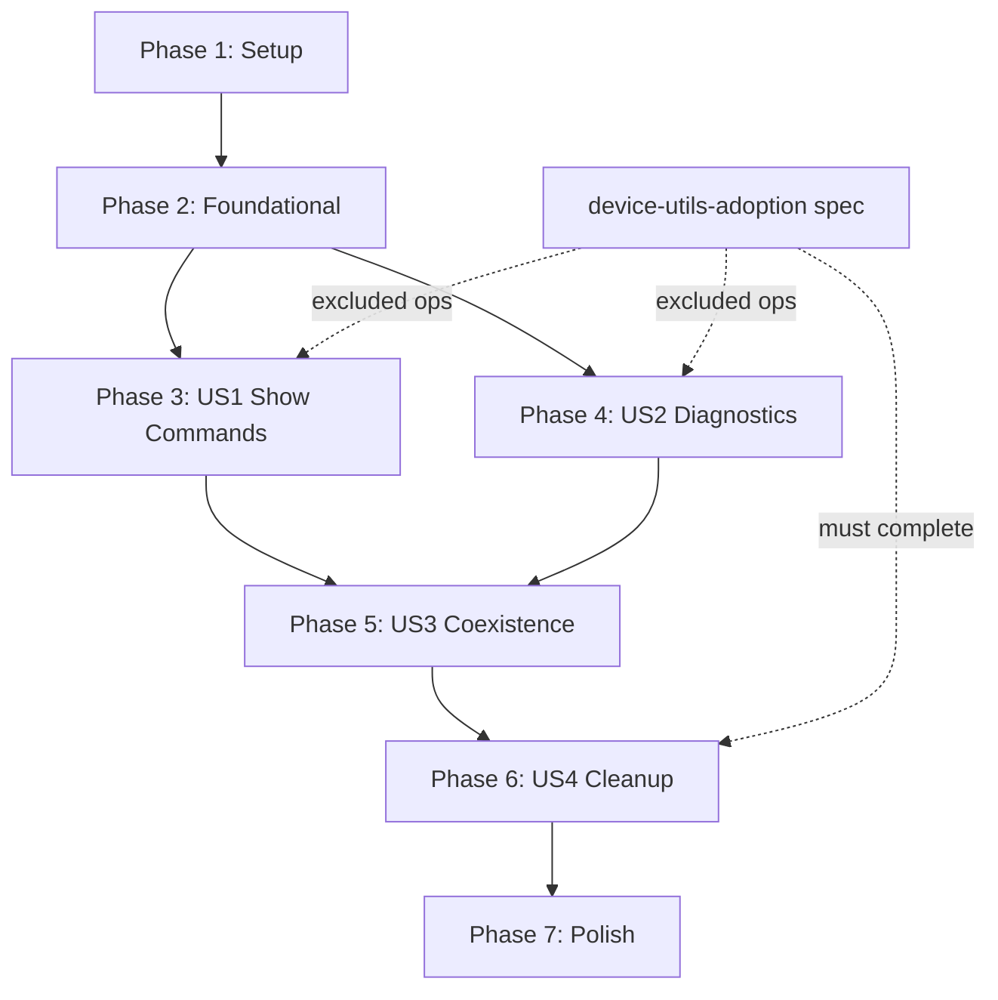

# Tasks: WebSocket Migration to mistapi.websockets

**Input**: Design documents from `/specs/websocket-migration/`
**Prerequisites**: plan.md, spec.md, research.md, data-model.md, contracts/adapter-interface.md, quickstart.md

## Format: `[ID] [P?] [Story] Description`

- **[P]**: Can run in parallel (different files, no dependencies)
- **[Story]**: Which user story this task belongs to (e.g., US1, US2, US3, US4)

---

## Phase 1: Setup (Shared Infrastructure)

**Purpose**: Version gating, adapter scaffolding, baseline capture tooling

- [X] T001 Add `mistapi >= 0.61.0` version floor to `requirements.txt` and `pyproject.toml`
- [X] T002 Create `src/websocket/adapter.py` with `MistWebSocketAdapter` class skeleton matching contract in `contracts/adapter-interface.md`
- [X] T003 [P] Add version gate in `src/websocket/adapter.py` — check `mistapi.__version__ >= "0.61.0"` at import time, raise `ImportError` with clear message if older
- [X] T004 [P] Update `src/websocket/__init__.py` to export `MistWebSocketAdapter` alongside existing classes
- [X] T005 [P] Create `tests/unit/websocket/test_ws_adapter.py` with test skeleton for adapter unit tests (mocked `DeviceCmdEvents`)

---

## Phase 2: Foundational (Blocking Prerequisites)

**Purpose**: Implement the adapter core that ALL user stories depend on

**⚠️ CRITICAL**: No menu operation migration can begin until this phase is complete

- [X] T006 Implement `MistWebSocketAdapter.__init__()` in `src/websocket/adapter.py` — store `mist_session`, `site_id`, `device_id`, `timeout`, `auto_reconnect`; init logger
- [X] T007 Implement `MistWebSocketAdapter.connect()` in `src/websocket/adapter.py` — instantiate `DeviceCmdEvents(mist_session, site_id, [device_id])`, call `.connect(run_in_background=True)`, wait for `.ready`, return bool; log info before/debug after
- [X] T008 Implement `MistWebSocketAdapter.send_and_wait()` in `src/websocket/adapter.py` — iterate `receive()` generator, filter by `session_id`, assemble result dict `{session_id, status, data, raw}`, handle `TimeoutError`; log info before/debug after
- [X] T009 Implement `MistWebSocketAdapter.disconnect()` in `src/websocket/adapter.py` — call `_ws_client.disconnect()`, set `_connected=False`, idempotent; log info before/debug after
- [X] T010 Implement error translation in `src/websocket/adapter.py` — catch SDK exceptions, translate to same error format menu operations expect (match `WebSocketManager` error behavior)
- [X] T011 Write unit tests in `tests/unit/websocket/test_ws_adapter.py` — test connect/disconnect lifecycle, send_and_wait happy path, timeout handling, error translation, version gate, idempotent disconnect

**Checkpoint**: Adapter ready — menu operation migration can now begin

---

## MVP Status (executed 2026-06-11)

Phases 1 and 2 are complete. Phases 3-7 are **deferred** pending:
1. Live device verification windows for baseline capture (T012, T021).
2. Full completion of the `device-utils-adoption` spec — required so
   operation-mapping (T013, T022) and cleanup (T032-T037) know which
   menus belong to which spec.

The adapter coexists with `WebSocketManager` in `src/websocket/`; no
menu code paths have been rewired yet. Rollback today = revert the
single `MistWebSocketAdapter` import line in any consumer.

### Migration path for a single menu operation

```python
# Before
from src.websocket import WebSocketManager
ws = WebSocketManager(apisession)
ws.connect()
ws.subscribe_to_channel(f"/sites/{site_id}/devices/{device_id}/cmd")
result = ws.wait_for_command_result(session_id, timeout_seconds=60)
ws.disconnect()

# After
from src.websocket import MistWebSocketAdapter
ws = MistWebSocketAdapter(apisession, site_id, device_id, timeout=60)
ws.connect()  # auto-subscribes via DeviceCmdEvents
result = ws.send_and_wait(session_id, timeout=60)
ws.disconnect()
```

Result dict shape: `{"session_id", "status", "data", "raw"}`. The
legacy `wait_for_command_result()` returned a freer dict; consumers
that read specific keys should adapt to `result["data"]`.

---

## Phase 3: User Story 1 — Show Commands Work Identically (Priority: P1) 🎯 MVP

**Goal**: Migrate show commands (Menu 102-115) to use `MistWebSocketAdapter` instead of `WebSocketManager`, producing identical output

**Independent Test**: Run each show command against a test device, diff output against baseline from current implementation

### Implementation for User Story 1

- [ ] T012 Capture baseline output for all show commands (Menu 102-115) — run each against a test device, save to `specs/websocket-migration/baselines/`
- [ ] T013 [US1] Identify which show commands (102-115) have `device_utils` helpers and exclude them (those belong to `device-utils-adoption` spec) — document in `specs/websocket-migration/checklists/operation-mapping.md`
- [ ] T014 [US1] Migrate first show command (Menu 102 — Show ARP) in `MistHelper.py` — replace `WebSocketManager` usage with `MistWebSocketAdapter` per quickstart.md pattern
- [ ] T015 [US1] Verify Menu 102 output matches baseline — diff migrated output against `baselines/`
- [ ] T016 [P] [US1] Migrate Menu 103 (Show MAC Table) in `MistHelper.py` — same adapter swap pattern
- [ ] T017 [P] [US1] Migrate Menu 104 (Show Route Table) in `MistHelper.py` — same adapter swap pattern
- [ ] T018 [P] [US1] Migrate Menu 105 (Show BGP Summary) in `MistHelper.py` — same adapter swap pattern
- [ ] T019 [US1] Migrate remaining show commands (106-115) in `MistHelper.py` that are NOT handled by `device-utils-adoption` — batch migrate, verify each against baseline
- [ ] T020 [US1] Run all migrated show commands end-to-end, confirm no regressions — diff all outputs against baselines

**Checkpoint**: All show commands migrated and verified. US1 independently testable.

---

## Phase 4: User Story 2 — Diagnostic Commands Work Identically (Priority: P1)

**Goal**: Migrate diagnostic commands (Menu 116-123) to use `MistWebSocketAdapter`, producing identical prompts and output

**Independent Test**: Run each diagnostic against a test device, compare prompts and output to baseline

### Implementation for User Story 2

- [ ] T021 Capture baseline output for all diagnostic commands (Menu 116-123) — run each against a test device, save to `specs/websocket-migration/baselines/`
- [ ] T022 [US2] Identify which diagnostic commands (116-123) have `device_utils` helpers and exclude them — update `specs/websocket-migration/checklists/operation-mapping.md`
- [ ] T023 [US2] Migrate first diagnostic command (Menu 116 — Ping) in `MistHelper.py` — replace `WebSocketManager` with `MistWebSocketAdapter`, verify prompts preserved
- [ ] T024 [US2] Verify Menu 116 output matches baseline — diff migrated output against `baselines/`
- [ ] T025 [P] [US2] Migrate Menu 117 (Traceroute) in `MistHelper.py` — same adapter swap pattern
- [ ] T026 [P] [US2] Migrate Menu 118 (DNS Lookup) in `MistHelper.py` — same adapter swap pattern
- [ ] T027 [US2] Migrate remaining diagnostics (119-123) in `MistHelper.py` that are NOT handled by `device-utils-adoption` — batch migrate, verify each against baseline
- [ ] T028 [US2] Run all migrated diagnostics end-to-end, confirm no regressions — diff all outputs against baselines

**Checkpoint**: All diagnostic commands migrated and verified. US2 independently testable.

---

## Phase 5: User Story 3 — Adapter Layer Provides Seamless Transition (Priority: P2)

**Goal**: Validate coexistence during migration and rollback capability

**Independent Test**: Toggle one operation between old and new implementation, verify both work

### Implementation for User Story 3

- [ ] T029 [US3] Add migration toggle mechanism in `src/websocket/adapter.py` or `MistHelper.py` — environment variable or config flag to select old vs new WS implementation per operation
- [ ] T030 [US3] Document rollback procedure in `specs/websocket-migration/quickstart.md` — confirm revert-to-`WebSocketManager` path works for any single operation
- [ ] T031 [US3] Integration test: swap one operation to adapter, verify output, swap back to `WebSocketManager`, verify output — confirm both paths produce identical results

**Checkpoint**: Coexistence verified. Any operation can be rolled back independently.

---

## Phase 6: User Story 4 — Custom WebSocket Code Removed (Priority: P3)

**Goal**: After ALL operations migrated (this spec + `device-utils-adoption`), remove `src/websocket/` custom code and `websocket-client` dependency

**Independent Test**: Delete `src/websocket/` legacy files, run full test suite, confirm no import errors

### Implementation for User Story 4

- [ ] T032 [US4] Verify all 22 operations (102-123) are migrated — cross-reference with `device-utils-adoption` spec for operations handled there
- [ ] T033 [US4] Remove legacy files from `src/websocket/` — delete `manager.py`, `commands.py`, `polling/`, `diagnostics/`, `service_ping_*.py` and any other files replaced by adapter or `device_utils`
- [ ] T034 [US4] Remove all `WebSocketManager` imports and references from `MistHelper.py` — replace any remaining references with `MistWebSocketAdapter`
- [ ] T035 [US4] Remove `websocket-client` from `requirements.txt` and `pyproject.toml`
- [ ] T036 [US4] Run full test suite — confirm no import errors, no runtime failures, all operations functional
- [ ] T037 [US4] Update `README.md` — remove references to custom WebSocket code, note migration to `mistapi.websockets`

**Checkpoint**: ~3,008 lines of custom WebSocket code removed. `websocket-client` dependency eliminated.

---

## Phase 7: Polish & Cross-Cutting Concerns

**Purpose**: Final cleanup and documentation

- [ ] T038 Update `CHANGELOG.md` with WebSocket migration entry — version `YY.MM.DD.HH.MM` format
- [ ] T039 Run full quality gates — `py_compile`, `ruff check`, `black --check`, `pytest`
- [ ] T040 Commit, push, verify container build succeeds via GitHub Actions

---

## Dependencies



**Key dependency**: Phase 6 (cleanup) cannot start until BOTH this spec AND `device-utils-adoption` are complete for all 22 operations.

## Parallel Execution Opportunities

| Tasks | Why Parallel |
| - | - |
| T003, T004, T005 | Different files, no shared state |
| T016, T017, T018 | Independent show command migrations, different menu functions |
| T025, T026 | Independent diagnostic migrations, different menu functions |

## Implementation Strategy

1. **MVP**: Phase 1 + Phase 2 + Phase 3 (adapter + show commands). Delivers value immediately — most-used operations migrated.
2. **Increment 2**: Phase 4 (diagnostics). Completes P1-priority work.
3. **Increment 3**: Phase 5 (coexistence validation). Confirms rollback safety.
4. **Final**: Phase 6 + 7 (cleanup + polish). Only after `device-utils-adoption` also complete.
